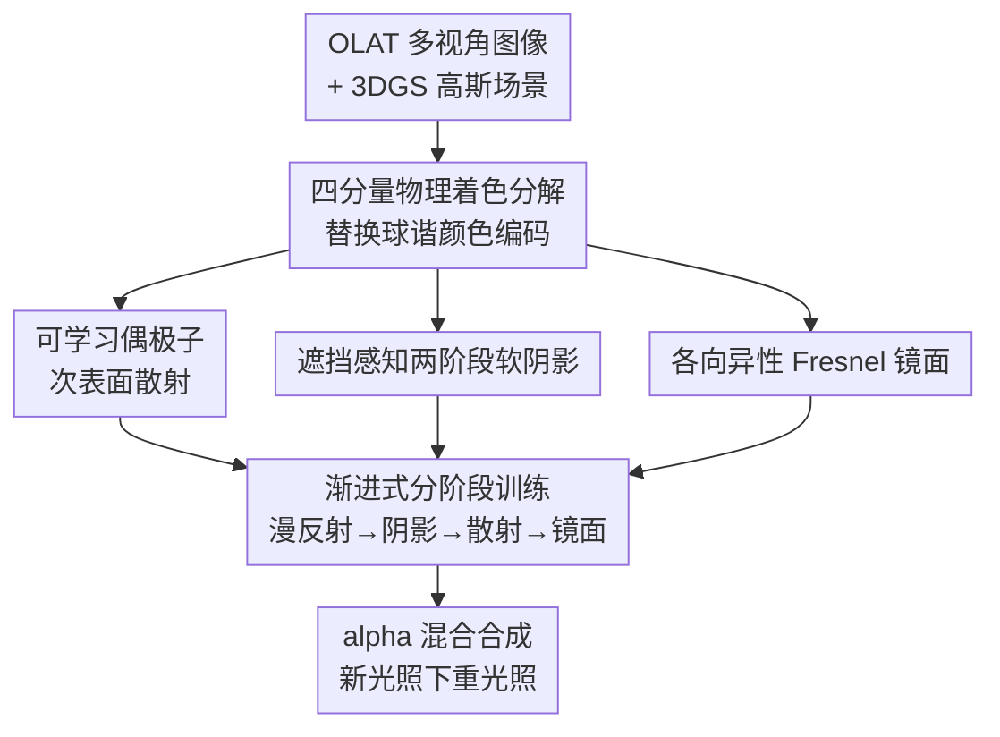

# SSD-GS: Scattering and Shadow Decomposition for Relightable 3D Gaussian Splatting

**会议**: ICLR 2026  
**OpenReview**: [https://openreview.net/forum?id=7m2Dqz9g05](https://openreview.net/forum?id=7m2Dqz9g05)  
**代码**: https://github.com/irisfreesiri/SSD-GS  
**领域**: 3D视觉  
**关键词**: 可重光照, 3D高斯泼溅, 次表面散射, 软阴影, 物理着色分解

## 一句话总结
SSD-GS 在 3D 高斯泼溅里把外观从「球谐系数」换成「漫反射 + 镜面 + 阴影 + 次表面散射」四项物理可解释的着色分解，配合可学习偶极子散射、遮挡感知两阶段软阴影和渐进式训练，让重光照在金属、半透明等复杂材质上的保真度显著超过现有方法。

## 研究背景与动机

**领域现状**：从单光源（OLAT，one-light-at-a-time）数据里做可重光照的 3D 重建，主流路线是在 3DGS（3D Gaussian Splatting）上扩展物理着色。3DGS 用一堆各向异性高斯点表示场景，渲染快、质量好，是替代 NeRF 体渲染的有力方案。

**现有痛点**：现有 3DGS 重光照方法的着色分解都太粗。一类（GaussianShader、GI-GS、R3DG）只建模漫反射和镜面，且假设训练时光照静止，换新光照就失效；另一类基于 OLAT 的方法虽然有动态光照监督，但处理阴影和散射的方式很糙——GS3 把阴影和残差效应丢到像素级延迟渲染里，抓不住软阴影和间接光；OLAT Gaussians 依赖代理网格（proxy mesh）提供法线监督，对几何质量极度敏感；RNG 用一个隐外观码（latent appearance code）换掉物理着色，牺牲了可解释性。

**核心矛盾**：真实材质的光传输是非线性的，会产生渐变软阴影、次表面散射这类视觉上关键的现象。但现有方法要么用神经网络黑箱近似这些效应（不可解释、难控制），要么干脆不建模（保真度不足），尤其在各向异性金属和半透明材质上崩得最明显。物理可解释性和高频效应保真度之间，现有工作没能兼得。

**本文目标**：把反射率显式拆成漫反射、镜面、阴影、次表面散射四个物理可解释的分量，分别用解析模型或轻量神经场建模，让每个分量都能被单独监督和控制，并在未见光照下保持泛化。

**切入角度**：作者注意到，经典图形学里早有成熟的物理模型——偶极子扩散（dipole diffusion）能闭式近似半透明介质的多次散射，Fresnel + 各向异性球高斯能表达金属高光。与其让神经网络从头逼近这些效应，不如把这些「祖传」物理模型嵌进 3DGS 的逐高斯着色里，神经网络只负责预测物理参数。

**核心 idea**：用「四分量物理着色分解 + 物理模型打底 + 神经网络预测参数 + 渐进式引入」替代 3DGS 原本的球谐颜色编码，在保持光栅化效率的同时拿回物理可解释性和高频保真度。

## 方法详解

### 整体框架
SSD-GS 的输入是一组 OLAT 拍摄/合成的多视角图像（每张图只点亮一个点光源），输出是能在新光照下重光照的高斯场景。它做的事可以概括成：保留 3DGS 的高斯几何与光栅化前向管线，但把每个高斯的颜色从球谐展开换成一个四分量物理着色函数

$$C_i = (c_d f_d + c_s f_s)\cdot S(\mathbf{x}) + c_{sss} f_{sss}$$

其中 $f_d, f_s, f_{sss}$ 是漫反射、镜面、次表面散射的标量反射强度，$c_d, c_s, c_{sss}\in\mathbb{R}^3$ 是各自学到的基色，$S(\mathbf{x})$ 是软阴影衰减因子。注意阴影只调制漫反射和镜面（直接光照部分），散射项单独叠加（散射来自介质内部，不该被表面阴影衰减）。这个颜色逐高斯计算，再经标准 alpha 混合合成像素，用逐像素损失对齐真值。

四个分量不是一股脑同时训，而是按「粗到细」渐进引入：先训漫反射打底，再依次加阴影、散射、镜面，让网络逐步解耦复杂的光照-材质效应。

### 关键设计

**1. 四分量物理着色分解：把球谐黑箱换成可解释的四项叠加**

3DGS 原生用球谐（SH）编码逐高斯的视角相关颜色，但球谐天生只能表达平滑的低频角度变化，对镜面高光、散射这类高频效应表达力不足，且没有物理含义、无法单独控制某一种着色效应。SSD-GS 直接把颜色公式改成上面的 $C_i = (c_d f_d + c_s f_s)\cdot S(\mathbf{x}) + c_{sss} f_{sss}$，让漫反射、镜面、阴影、散射各占一项。这样做的好处是每一项都能被单独监督（per-component supervision）、单独可视化、单独编辑——重光照时可以精确改变单个光源的贡献，而不是像环境贴图那样只能做全局重光照。这是整篇论文的骨架，后面三个设计就是在填这个公式里的各项怎么算。

**2. 可学习偶极子次表面散射：物理模型打底，神经场只预测材质参数**

半透明材质（皮肤、玉、蜡、大理石）的次表面散射是重灾区，现有 SSS-GS 直接用神经网络学一个散射辐射作为残差项叠加，既不可解释又依赖密集监督。SSD-GS 改用经典的标准偶极子扩散模型（Jensen 2001），它给出一个闭式 BSSRDF 来近似均匀介质里的多次散射：

$$f_{sss}(r) = \frac{\alpha'}{4\pi}\left[\frac{z_r(\sigma_t d_r + 1)e^{-\sigma_t d_r}}{d_r^3} + \frac{z_r z_v(\sigma_t d_r + 1)e^{-\sigma_t d_v}}{d_v^3}\right]$$

其中 $\alpha' = \sigma_s/(\sigma_s+\sigma_a)$，$\sigma_t = \sigma_s+\sigma_a$，$z_r, z_v$ 是实/虚偶极子源的深度，$d_r, d_v$ 是着色点到两个源的距离。关键在于：物理公式的形式是固定的，但里面的散射系数 $\sigma_s$、吸收系数 $\sigma_a$、表面分离距离 $r$ 由一个 6 层 MLP 神经场 $\Theta_{SSS}$ 从高斯中心 $\mathbf{x}$、光照/视角方向、法线和逐高斯材质嵌入 $m\in\mathbb{R}^6$ 预测得到，并经 sigmoid 重缩放到物理合理区间（$\sigma_s,\sigma_a\in[0.05,2.05]$，$r\in[0.1,3.1]$）。法线直接从高斯局部坐标系取，不需要外部代理网格——这让它在几何噪声大的区域也稳，避免了 OLAT Gaussians 那种对网格质量的强依赖。

**3. 遮挡感知两阶段软阴影：先体积可见性打底，再神经细化补接触阴影**

软阴影是另一个老大难，GS3 把它放到像素级延迟渲染里会引入噪声、抓不住锐利边界。SSD-GS 用两阶段。第一阶段做几何可见性估计：对每个高斯，沿光源方向向它覆盖的每个像素打一条阴影射线，累积沿途高斯的不透明度得到逐射线透射率 $v_i = \prod_{k\in O_i}(1-\alpha_k)$，再用高斯的投影密度 $\rho_i$ 加权求期望，得到粗可见性 $\hat{v}_g = \frac{\sum_i \rho_i v_i}{\sum_i \rho_i}$。这种连续体积可见性天然产生平滑、几何一致的软阴影。第二阶段做神经细化：粗可见性会漏掉接触阴影、几何细节、材质相关的衰减，于是一个 3 层小 MLP $\Theta_{shad}$ 以高斯中心、入射光方向、粗可见性 $\hat{v}$ 和材质嵌入 $m$ 为输入，预测最终阴影衰减项 $S(\mathbf{x}) = \Theta_{shad}(\mathbf{x}\mid\hat{v},\omega_i,m)$。物理可见性打底保证了大趋势对、可解释，神经细化补上高频细节，两者互补。

**4. 各向异性 Fresnel 镜面 + 渐进式分阶段训练：表达金属高光，并按粗到细顺序解耦各分量**

镜面项要表达金属、织物这类高频视角相关反射，SSD-GS 用 Fresnel 因子（Schlick）调制各向异性球高斯（ASG）基：Fresnel 抓掠射角附近反射强度的陡增，ASG 基紧凑地表达各向异性高光，能复现拉丝金属、布料这类效果；漫反射则用标准 Lambertian BRDF 打底，提供稳定的低频外观。但四个分量若一起训会互相干扰（梯度重叠让镜面和散射抢着解释同一块外观）。为此作者采用渐进式训练：按「漫反射 → 阴影 → 散射 → 镜面」的粗到细顺序，用一组迭代阈值分阶段引入各分量；同时在阴影引入后激活相机位姿微调、在镜面阶段开始光源位置微调。消融显示这个物理顺序（Schedule I）优于联合训练（H）、交换顺序（J）和暖启动后一次性加全部（K）——一次性引入多项会造成训练干扰，破坏解耦质量。

### 损失函数 / 训练策略
最终图像用逐像素损失对齐真值。训练采用上面第 4 点描述的渐进式分阶段策略，所有场景共用一套默认配置以保证稳定可复现；相机位姿和光源位置在训练中持续微调（相机在阴影阶段后激活，光源在镜面阶段开始）。真实数据训 100K 迭代，SSS-GS 合成集为对齐对比训 60K。

## 实验关键数据

### 主实验
在 NRHints 真实 OLAT 数据集（7 个场景）和 GS3 合成数据集（6 个场景）上，与 vanilla 3DGS、GI-GS（静态光照重光照代表）、GS3 和 RNG（OLAT 重光照代表）对比，全部训 100K 迭代、相同设置。下面摘几个代表性场景的测试集（未见光照）PSNR：

| 数据集 | 场景 | 本文 | GS3 | RNG | 3DGS |
|--------|------|------|-----|-----|------|
| NRHints | FurScene | **30.73** | 28.22 | 27.69 | 18.48 |
| NRHints | Pixiu | **31.12** | 29.70 | 28.86 | 18.55 |
| NRHints | Cat | **27.68** | 27.41 | 26.61 | 14.53 |
| GS3 合成 | AnisoMetal | **30.04** | 28.82 | 25.92 | 17.10 |
| GS3 合成 | Translucent | **32.39** | 32.20 | 28.57 | 16.49 |

在散射、镜面突出的场景上优势最明显（AnisoMetal、Translucent、FurScene），在低频外观主导的场景上与 GS3 持平，体现了跨场景的强泛化。

在专门强调次表面散射的 SSS-GS 合成数据集（训 60K、黑背景对齐）上，与 SSS-GS、KiloOSF 对比：

| 方法 | 测试 PSNR | 测试 SSIM | 测试 LPIPS | FPS | GPU |
|------|-----------|-----------|------------|-----|-----|
| KiloOSF | 25.91 | 0.93 | 0.097 | 14.4 | RTX 4090 |
| SSS-GS | 35.01 | 0.972 | 0.040 | 154.8 | RTX 4090 |
| 本文 (w/o Opt) | 37.44 | 0.984 | 0.0186 | 66.3 | RTX 3090 |
| 本文 (w/ Opt) | **38.35** | **0.986** | **0.0158** | 61.5 | RTX 3090 |

即便用更弱的 RTX 3090，本文在 PSNR/SSIM/LPIPS 上全面超过用 4090 的 SSS-GS，验证了物理 SSS 着色项的有效性。

### 消融实验
在 NRHints 真实场景 Pixiu 上做反射率分量和训练调度两组消融（测试集）：

| 配置 | 测试 PSNR | 测试 SSIM | 测试 LPIPS | 说明 |
|------|-----------|-----------|------------|------|
| A: 仅漫反射 | 20.19 | 0.5583 | 0.1061 | 基线 |
| B: + 镜面 | 20.57 | 0.6683 | 0.0992 | 加镜面 |
| C: + 散射 | 24.81 | 0.9274 | 0.0857 | 再加散射，SSIM 暴涨 |
| D: 完整模型 | **31.12** | **0.9452** | **0.0791** | 全部四项 |
| E: 完整 − 镜面 | 30.60 | 0.9429 | 0.0844 | 去镜面掉点 |
| F: 完整 − 散射 | 30.41 | 0.7204 | 0.0850 | 去散射 SSIM 崩到 0.72 |
| H: 联合训练 | 31.09 | 0.9441 | 0.0812 | 一起训 |
| I: 渐进物理(本文) | **31.12** | **0.9452** | **0.0791** | 漫→阴影→散射→镜面 |
| J: 渐进非物理 | 31.10 | 0.9443 | 0.0807 | 交换后两项顺序 |
| K: 渐进合并 | 31.05 | 0.9449 | 0.0794 | 暖启动后一次性加全部 |

### 关键发现
- 散射项贡献最大：从 B（仅漫+镜面，SSIM 0.67）加上散射到 C，SSIM 暴涨到 0.93；去掉散射（配置 F）SSIM 直接崩到 0.72——散射缺失时漫反射和阴影会去「吸收」本该属于散射的外观，产生半透明伪影并破坏阴影锐度。
- 训练调度的数值差异较小（I/H/J/K 的 PSNR 都在 31 附近），但视觉分解差异明显：调度 K 一次性引入多项会造成训练干扰，镜面和散射梯度重叠，解耦质量下降——这些伪影在标量指标上不明显，却在可视化分解里清晰可见，说明结构化监督和渐进学习的必要性。
- 物理顺序（I，散射在镜面前）优于非物理顺序（J）和联合（H），印证了粗到细引入的设计。

## 亮点与洞察
- **物理模型打底 + 神经网络预测参数**的混合范式很巧：偶极子扩散、Fresnel+ASG 这些经典图形学公式形式固定、可解释，神经网络只负责把场景相关的物理参数（散射系数、可见性细化）填进去，既保住了可解释性又借了神经网络的拟合力，比纯黑箱残差（SSS-GS、RNG）更稳更可控。
- **法线从高斯自身取、不要代理网格**是个关键解耦：OLAT Gaussians 的痛点就是对代理网格质量敏感，本文直接用高斯局部坐标系的法线，在噪声几何上仍然稳，这个思路可迁移到任何依赖法线监督的 3DGS 扩展。
- **阴影只乘直接光、散射单独加**这个细节体现了物理直觉：表面阴影不该衰减来自介质内部的散射光，公式 $C_i = (c_d f_d + c_s f_s)\cdot S(\mathbf{x}) + c_{sss} f_{sss}$ 把这点写死，避免了分量间的角色泄漏。
- **标量指标不敏感、视觉分解才暴露问题**的发现值得记：训练调度的 PSNR 差异很小但可视化分解差异大，提醒做分解类工作不能只看 PSNR/SSIM。

## 局限与展望
- 作者承认没有显式建模多次反弹的全局光照（multi-bounce GI），只靠连续体积可见性和学到的散射项捕捉了感知上最重要的低频间接效应。
- 当前实现基于光栅化管线，无法完全刻画物理光传输；未来可集成光线/路径追踪提升物理真实感。
- 散射用的是均匀介质偶极子近似，对非均匀、强各向异性散射介质可能不够；逐高斯材质嵌入虽然灵活，但没有显式的材质分组结构。作者提议用学到的材质隐空间对高斯做材质感知分组，得到更结构化、更可控的表示。
- 评测集中在 OLAT 单点光源设定，对环境光、面光源等更复杂光照的泛化未充分验证。

## 相关工作与启发
- **vs SSS-GS**: 都做次表面散射，但 SSS-GS 用神经网络学一个散射辐射当残差项、按学到的权重和 BRDF 着色混合，不可解释且依赖密集监督；本文用物理偶极子打底、神经网络只预测物理参数，在 SSS-GS 自己的数据集上还用更弱 GPU 反超它。
- **vs GS3**: GS3 在高斯级建漫反射/镜面、在像素级用延迟渲染处理阴影和残差，抓不住软阴影和间接光；本文把阴影做成逐高斯的两阶段（体积可见性 + 神经细化），软阴影边界更锐、噪声更少。
- **vs RNG**: RNG 用隐外观码换掉物理着色提升阴影质量，但牺牲了可解释性、丢失细尺度反射和几何细节（如猫鼻子被重建成一块白）；本文坚持物理可解释着色，同时保住高频细节。
- **vs GI-GS / GaussianShader / R3DG**: 这些假设静态光照、只能用环境贴图做全局重光照，无法精确改单个光源；本文基于 OLAT 动态光照，支持单光源级的可控重光照。

## 评分
- 新颖性: ⭐⭐⭐⭐ 四分量物理分解本身是组合式创新，但「经典物理模型打底 + 神经网络预测参数」嵌进 3DGS 的工程化整合做得扎实。
- 实验充分度: ⭐⭐⭐⭐ 覆盖真实 + 两套合成共 18 个场景，分量和调度两组消融到位；但多为 OLAT 设定，光照多样性可再拓展。
- 写作质量: ⭐⭐⭐⭐ 公式清晰、消融解读有洞察（标量 vs 视觉差异），框架图直观。
- 价值: ⭐⭐⭐⭐ 为物理可解释、可编辑的可重光照渲染打了个扎实基础，单光源可控重光照对 AR/VR、影视有直接用处。

<!-- RELATED:START -->

## 相关论文

- [\[ICLR 2026\] ODE-GS: Latent ODEs for Dynamic Scene Extrapolation with 3D Gaussian Splatting](ode-gs_latent_odes_for_dynamic_scene_extrapolation_with_3d_gaussian_splatting.md)
- [\[CVPR 2026\] RelightAnyone: A Generalized Relightable 3D Gaussian Head Model](../../CVPR2026/3d_vision/relightanyone_a_generalized_relightable_3d_gaussian_head_model.md)
- [\[ICLR 2026\] CLoD-GS: Continuous Level-of-Detail via 3D Gaussian Splatting](clod-gs_continuous_level-of-detail_via_3d_gaussian_splatting.md)
- [\[ICLR 2026\] MoE-GS: Mixture of Experts for Dynamic Gaussian Splatting](moe-gs_mixture_of_experts_for_dynamic_gaussian_splatting.md)
- [\[ICLR 2026\] Mobile-GS: Real-time Gaussian Splatting for Mobile Devices](mobile-gs_real-time_gaussian_splatting_for_mobile_devices.md)

<!-- RELATED:END -->
