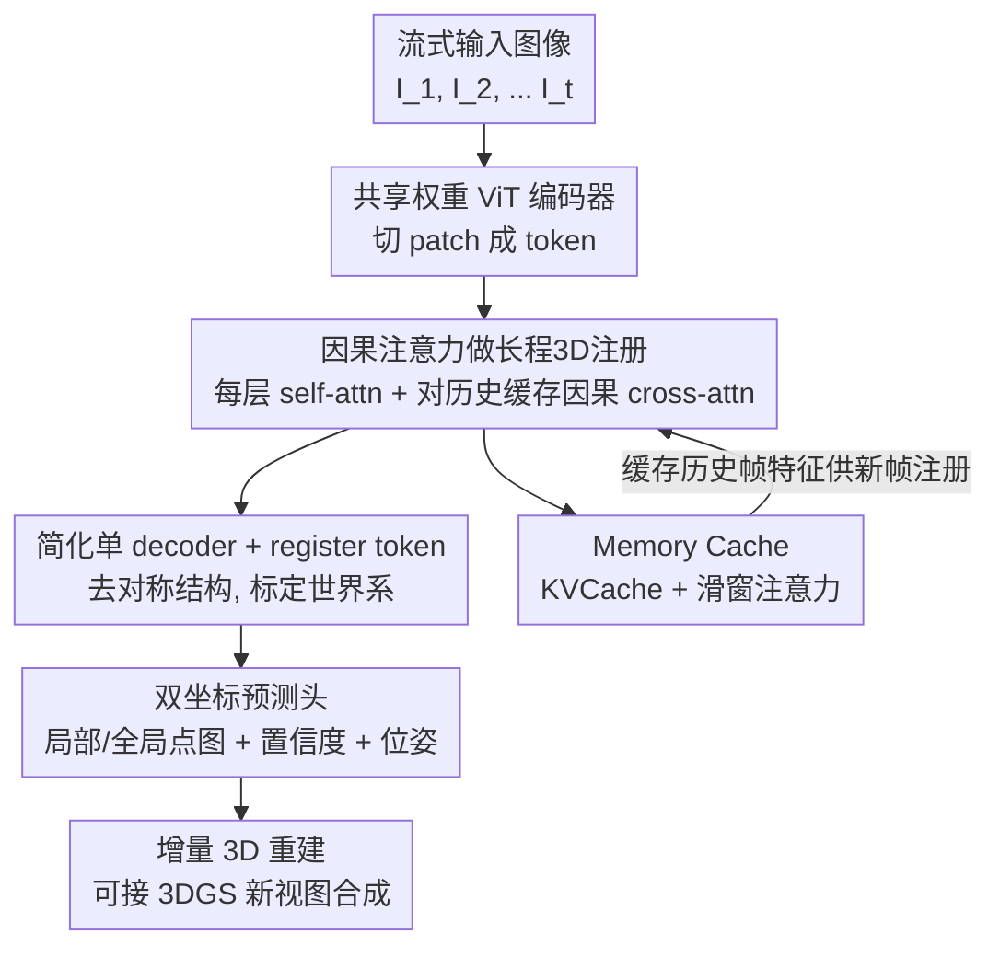

# STream3R: Scalable Sequential 3D Reconstruction with Causal Transformer

**会议**: ICLR 2026  
**OpenReview**: [https://openreview.net/forum?id=RTTYGeC2Io](https://openreview.net/forum?id=RTTYGeC2Io)  
**论文**: [项目主页](https://nirvanalan.github.io/projects/stream3r)  
**代码**: https://github.com/(见项目主页)  
**领域**: 3D视觉  
**关键词**: 流式3D重建, 因果Transformer, 点图回归, KVCache, 动态场景

## 一句话总结
STREAM3R 把稠密 3D 重建重新表述成「decoder-only Transformer 的逐帧因果注意力」问题——每来一张新图就让它对历史帧缓存做因果 cross-attention 并回归点图，从而像 LLM 一样用 KVCache / 滑窗注意力做在线增量重建，在静态和动态场景的深度估计与 3D 重建上都优于或持平现有流式方法，且推理更快。

## 研究背景与动机

**领域现状**：DUSt3R 开创了「直接用 Transformer 回归点图（pointmap）」的范式，把双视图立体重建变成稠密点图回归，联合估计深度、位姿、内参；MASt3R、Fast3R、VGG-T 等后续工作把它从两视图扩展到几十上百张图，给出更统一的多视图重建方案。

**现有痛点**：但这些方法都假设输入是**固定的一批图**。现实里很多场景是**流式**的——自动驾驶车在探索新环境、要处理一段很长的视频——每来一帧就要即时更新重建。此时 Fast3R / VGG-T 每来一张新图就得从头全量重算，既有大量冗余计算，又因为全注意力（full-attention）开销随序列长度暴涨而扛不住长视频。Spann3R 用一个固定大小的记忆模块做增量重建，但累积漂移严重、动态场景直接失败；最相关的并发工作 CUT3R 用 RNN 范式处理流式输入，但 RNN 与现代网络架构和硬件加速不兼容、记忆容量有限、难以建模长程依赖。

**核心矛盾**：流式 3D 重建的本质需求是「每一步都要在前面的重建结果之上、再融入新帧的内容」——这恰恰是 LLM 里**因果注意力 + KVCache** 的工作方式（每步预测复用之前的计算）。但现有 3D 重建方法要么用代价高昂的双向全注意力 / 全局优化（不可增量），要么用容量受限的 RNN 状态（建模能力弱）。两条路都没把「流式」这件事做对。

**本文目标**：设计一个能在线、增量处理无结构或流式图像输入的重建器，既要有强几何先验泛化到动态场景，又要天然兼容现代 LLM 的训练与推理基础设施。

**切入角度**：作者观察到——单向因果注意力的 transformer 在语言/音频任务里已经被证明能高效复用历史计算，而流式 3D 重建恰好需要「在历史观测基础上注册新帧」，二者结构高度同构。于是不像 Fast3R / VGG-T 那样用 BERT 式双向注意力，而是走 **decoder-only（GPT 式）** 路线。

**核心 idea**：把点图预测重新表述成「逐帧因果注册（sequential registration with causal attention）」——新帧只对**缓存的历史帧特征**做因果 cross-attention 并回归点图，从而像 LLM 一样用 KVCache 和滑窗注意力做线性开销的在线重建。

## 方法详解

### 整体框架
STREAM3R 输入是一串未标定的 RGB 图像 $(I)^N_t$（无结构图集或视频均可），逐帧输出每帧对应的局部坐标点图 $\hat{X}^{local}_t$、全局坐标点图 $\hat{X}^{global}_t$（以第一帧 $I_1$ 的相机坐标系为世界系）以及相对相机位姿 $\hat{P}_t \in \mathbb{R}^9$（含内外参）。

整条流水线沿用 DUSt3R 的骨架但改造了 decoder 一侧：每张新图先经共享权重的 ViT 编码器切成 $K$ 个 token $F_t = \text{Encoder}(I_t)$，送进**单个**因果 decoder；decoder 每层先做帧内 self-attention，再让当前帧 token 对**之前所有帧缓存下来的同层特征**做因果 cross-attention；解码完后用两个 DPT 头分别回归局部 / 全局点图与置信度、一个头回归位姿。处理过的帧特征被存进 Memory Cache（即 KVCache），作为后续新帧注册的参考——这样无需为每帧开一个独立 decoder，就能在线累积上下文、增量出 3D。

### 关键设计

**1. 因果注意力做流式 3D 注册：把点图预测变成 decoder-only 序列问题**

针对「全注意力不可增量、RNN 记忆太小」这个核心矛盾，STREAM3R 把每帧的解码改成对历史帧的因果 cross-attention。具体地，每个 decoder block 在做完帧内 self-attention 后，当前帧第 $i$ 层特征 $G^{i-1}_t$ 会去 cross-attend 到**同层所有历史帧**的特征：

$$G^i_t = \text{DecoderBlock}^i\left(G^{i-1}_t,\; G^{i-1}_0 \oplus G^{i-1}_1 \oplus \cdots \oplus G^{i-1}_{t-1}\right)$$

这与 DUSt3R 的双向对称 cross-attention（只能两视图）、VGG-T/Fast3R 的全序列双向注意力、CUT3R 的「与一个可学习状态交互」都不同：它是严格单向的，新帧只能看历史、看不到未来，因此推理时天然可用 KVCache 把历史观测的 token 一次性缓存、增量复用，避免每来一帧从头重算。作者发现这种逐帧注册的归纳偏置恰好契合在线重建「在已有重建上注册新内容」的需求，因此既收敛更快、又能建模长程依赖。

**2. 简化单 decoder + register token：从两视图对称结构扩到任意帧数**

DUSt3R 的 decoder 是对称双分支（$\text{Decoder}_1, \text{Decoder}_2$ 各管一个视图），本质只能吃两张图。要支持任意帧数，STREAM3R 砍掉对称设计、**只保留单个 decoder** $\text{Decoder} = \text{Decoder}_1$ 处理所有帧；每个 block 内含一个 SelfAttn（帧内）和一个 CrossAttn（对历史因果注意）。头两帧因缺历史上下文仍按 DUSt3R 双视图惯例处理，从第三帧起全部走式 (2) 的因果操作。

为了让模型知道「哪个是规范世界坐标系」，作者给第一帧 token 逐元素加一个可学习的 register token：$F_1 = F_1 + [\text{reg}]$。靠这个 [reg] 标记，模型学会以第一帧为世界系直接输出全局点，而**不必为 N 帧各开一个独立 decoder**。与 Fast3R 不同，这里为简洁起见没给其他帧加位置编码——逐帧注册本身已隐式编码了顺序。

**3. LLM 式 KVCache + 滑窗注意力：让缓存随帧数线性甚至常数增长**

decoder-only 的最大红利是天然兼容现代 LLM 训练/推理基础设施。双向方法把所有视图联合处理，naive 注意力的显存随序列长度二次增长；STREAM3R 逐帧处理、配合 FlashAttention，把显存从二次降到线性，KVCache 随帧数**线性**增长（100 帧时 STREAM3Rα 仅 16.32 GB，VGG-T 高达 63.63 GB）。

更进一步，它无需任何微调就支持滑窗注意力：STREAM3R-W[5] 始终只注意「第一帧 + 最近 5 帧」，KVCache 大小**恒定不变**（100 帧时仍稳定在 3.72 GB），却在视频深度评测上达到与全缓存相当甚至更好的精度。这把流式重建的显存彻底解耦于序列长度，是 RNN / 全局优化方法都给不了的可扩展性。

### 损失函数 / 训练策略
训练沿用并推广 DUSt3R 的点图损失。对局部/全局点图用置信度感知的回归损失：$L_{conf} = \sum_{(\hat{x},\hat{c})} \left( \hat{c} \cdot \lVert \frac{\hat{x}}{\hat{s}} - \frac{x}{s} \rVert^2 - \alpha \log \hat{c} \right)$，其中 $\hat{s}, s$ 是尺度归一化因子做尺度不变监督；对 metric-scale 数据集令 $\hat{s} := s$ 以输出度量尺度点图。位姿损失把 $\hat{P}_t$ 参数化为四元数 $\hat{q}_t$、平移 $\hat{\tau}_t$、焦距 $\hat{f}_t$，对三者取 L2。同时预测局部+全局两套冗余点图被证明能简化训练、并支持在只有部分标注的 3D 数据集上训练。模型用 AdamW、batch 64、学习率 1e-4 训 400K 步，每个 batch 随机采 4–10 帧，分辨率 $224^2$ 到 $512\times384$ 混采，8 张 A100 端到端训 7 天。

## 实验关键数据

### 主实验
单帧深度估计（zero-shot，未训练域）：STREAM3Rβ（从 VGG-T 初始化）在多数数据集上拿下最佳。

| 数据集 | 指标 | STREAM3Rβ | VGG-T | CUT3R |
|--------|------|-----------|-------|-------|
| Sintel | Abs Rel ↓ / δ<1.25 ↑ | **0.228 / 70.7** | 0.271 / 67.7 | 0.428 / 55.4 |
| Bonn | Abs Rel ↓ / δ<1.25 ↑ | **0.061 / 96.7** | 0.053 / 97.3 | 0.063 / 96.2 |
| KITTI | Abs Rel ↓ / δ<1.25 ↑ | **0.063 / 95.5** | 0.076 / 93.3 | 0.092 / 91.3 |
| NYU-v2 | Abs Rel ↓ / δ<1.25 ↑ | **0.057 / 95.7** | 0.060 / 94.8 | 0.086 / 90.9 |

视频深度估计（per-sequence scale 对齐，附 KITTI FPS）：在流式方法里 SOTA，且比 CUT3R 快约 40%。

| 方法 | 类型 | Sintel Abs Rel ↓ | KITTI Abs Rel ↓ | FPS ↑ |
|------|------|------------------|-----------------|-------|
| CUT3R | Stream | 0.421 | 0.118 | 16.58 |
| STREAM3Rβ | Stream | **0.264** | **0.080** | 12.95 |
| STREAM3Rβ-W[5] | Stream | 0.279 | 0.083 | **32.93** |
| STREAM3Rα | Stream | 0.478 | 0.116 | 23.48 |

3D 重建（7-Scenes，稀疏 3–5 帧）：STREAM3Rβ 在 Acc/Comp/NC 上匹敌甚至超过离线全局优化方法，比 CUT3R 快 50%+。

| 方法 | Acc(Mean) ↓ | Comp(Mean) ↓ | NC(Mean) ↑ | FPS ↑ |
|------|-------------|--------------|------------|-------|
| CUT3R | 0.126 | 0.154 | 0.727 | 17.00 |
| STREAM3Rβ | **0.122** | **0.101** | **0.746** | 20.12 |

### 消融实验
在相同数据集、相同 MASt3R 初始化、相同算力下，把本文的 decoder-only 架构与 CUT3R 的 RNN 架构对比（同迭代步数评测）。

| 配置 | Sintel Abs Rel ↓ | KITTI Abs Rel ↓ | 7-Scenes Acc(Mean) ↓ | 说明 |
|------|------------------|-----------------|----------------------|------|
| CUT3R (RNN) | 0.598 | 0.157 | 0.480 | 状态记忆容量受限 |
| STREAM3Rα (本文) | **0.535** | **0.141** | **0.328** | 因果注意 + 全缓存 |

### 关键发现
- **decoder-only 收敛反而更快**：尽管 STREAM3R 注意的上下文比 CUT3R 的常数状态更长，但同等时间内多跑 60% 训练步、收敛更快——原因是 CUT3R 每次状态读取后还要做一次状态更新，而 STREAM3R 直接 attend 已缓存特征，省掉了串行状态更新开销。
- **全局分支差距最大**：局部头 $\text{Head}_{local}$ 两种架构收敛相近，但全局头 $\text{Head}_{global}$ 本文明显更快——说明单一状态记忆容量有限，难以把新帧注册到全局世界系，而因果全缓存能保留足够历史信息。
- **滑窗近乎免费**：STREAM3Rβ-W[5] 只看 5 帧历史，KVCache 恒定，却在 Bonn / KITTI 上反超全缓存的 STREAM3Rβ，是流式方法中 FPS 最快的。
- **对首帧损坏更鲁棒**：用 Real-ESRGAN 退化管线破坏首帧后，CUT3R 的 Acc 从 0.126 暴涨到 0.335，STREAM3R 只从 0.122 升到 0.223。

## 亮点与洞察
- **把 3D 重建「LLM 化」**：核心洞见是流式重建与因果语言建模结构同构——「在历史观测上注册新帧」≈「在历史 token 上预测下一 token」。一旦这样表述，KVCache、滑窗注意力、FlashAttention、混合精度等整套 LLM 基础设施直接复用，可扩展性和工程成熟度白嫖。
- **单 decoder + register token 的极简扩展**：不靠 N 个 decoder、不靠位置编码，仅用一个可学习 [reg] token 标定世界系，就把两视图对称结构干净地扩到任意帧数，工程上非常轻。
- **冗余双坐标预测**：同时回归局部 + 全局点图看似冗余，却既简化训练又能在「只有部分标注」的 3D 数据集上训练——一个可迁移到其他多任务几何预测的 trick。
- **滑窗常数缓存**：恒定 KVCache 还能保精度，意味着真正可以无限长视频在线跑，这是 RNN 漂移和全局优化二次开销都给不了的。

## 局限与展望
- **头两帧仍走 DUSt3R 双视图惯例**：序列开头缺历史上下文，没完全统一到因果范式，初始化阶段是个特例。
- **依赖首帧作世界锚**：以第一帧定义全局坐标系是 DUSt3R 系传统；虽然实验显示首帧低质/低重叠时仍较鲁棒，但锚点选择本身仍是单点依赖，极端情况下的失败模式值得进一步研究。
- **算力受限的消融**：消融模型只在 $224^2$ 低分辨率训练，且作者明言因算力约束只训了 7 epoch、用了 CUT3R 数据集的一部分；更充分训练下的上限尚未探明。
- **改进方向**：把头两帧也纳入统一因果框架、引入多锚点或自适应世界系、以及在更长视频上验证滑窗的漂移累积，都是自然的延伸。

## 相关工作与启发
- **vs DUSt3R / MASt3R**：它们把立体重建做成点图回归但只吃两视图、且要昂贵全局对齐；本文保留点图表示的优点，用单 decoder + 因果注意把它扩到任意帧数并去掉全局对齐后处理。
- **vs Fast3R / VGG-T**：它们用双向全注意力做多视图融合，每来新帧从头重算、显存随序列二次增长，不可增量；本文走 decoder-only 因果路线，KVCache 线性增长、可在线增量。
- **vs Spann3R / CUT3R**：Spann3R 用固定记忆模块、漂移严重且动态场景失败；CUT3R 用 RNN 状态、容量小且与现代硬件加速不兼容。本文用因果全缓存 + 滑窗，既建模长程依赖又兼容 FlashAttention/KVCache，收敛更快、精度更高、首帧损坏更鲁棒。
- **vs MonST3R**：MonST3R 在 DUSt3R 上微调出动态场景点图但仍需滑窗式 per-video 全局对齐后处理；本文前馈直出 4D 重建，无需 per-video 优化或后处理对齐。

## 评分
- 新颖性: ⭐⭐⭐⭐⭐ 把流式 3D 重建重新表述为 decoder-only 因果注意力问题，建立了与 LLM 范式的清晰同构，视角新颖且打开了基础设施复用空间。
- 实验充分度: ⭐⭐⭐⭐ 覆盖单帧/视频深度、3D 重建、显存与 FPS、鲁棒性及 NVS 下游，对比丰富；但核心消融受算力限制只在低分辨率短训练下做。
- 写作质量: ⭐⭐⭐⭐⭐ 动机推导（流式↔因果同构）讲得清晰有力，方法与公式表述干净。
- 价值: ⭐⭐⭐⭐⭐ 在线/长序列 3D 感知是自动驾驶、机器人、VR 的刚需，恒定缓存 + LLM 基础设施兼容使其工程落地价值高。

<!-- RELATED:START -->

## 相关论文

- [\[ICLR 2026\] Streaming Visual Geometry Transformer](streaming_visual_geometry_transformer.md)
- [\[ICLR 2026\] IGGT: Instance-Grounded Geometry Transformer for Semantic 3D Reconstruction](iggt_instance-grounded_geometry_transformer_for_semantic_3d_reconstruction.md)
- [\[ICLR 2026\] NOVA3R: Non-pixel-aligned Visual Transformer for Amodal 3D Reconstruction](nova3r_non-pixel-aligned_visual_transformer_for_amodal_3d_reconstruction.md)
- [\[CVPR 2026\] ART: Articulated Reconstruction Transformer](../../CVPR2026/3d_vision/art_articulated_reconstruction_transformer.md)
- [\[ICLR 2026\] AssetFormer: Modular 3D Assets Generation with Autoregressive Transformer](assetformer_modular_3d_assets_generation_with_autoregressive_transformer.md)

<!-- RELATED:END -->
