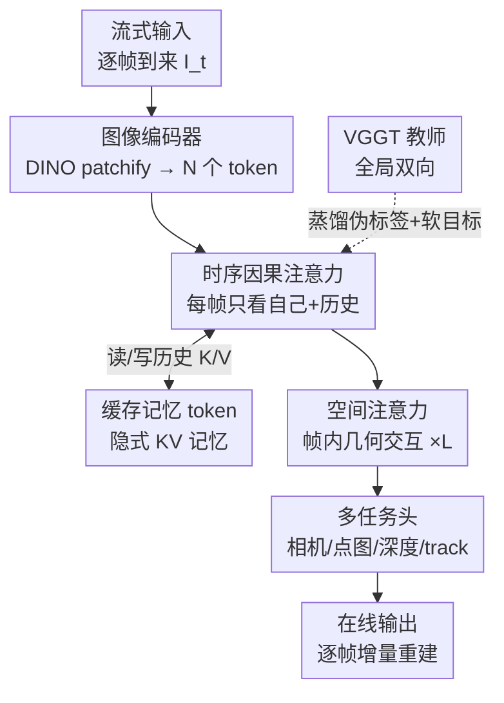

# Streaming Visual Geometry Transformer

**会议**: ICLR 2026  
**OpenReview**: [https://openreview.net/forum?id=5APgTKsnx8](https://openreview.net/forum?id=5APgTKsnx8)  
**论文**: [项目页](https://wzzheng.net/StreamVGGT/)  
**代码**: https://github.com/（项目页指向 StreamVGGT）  
**领域**: 3D视觉  
**关键词**: 流式3D重建, 因果Transformer, KV缓存记忆, 知识蒸馏, 在线感知

## 一句话总结
本文提出 StreamVGGT，把离线全局注意力的 VGGT 改造成「时序因果注意力 + 缓存记忆 token」的因果 Transformer，让 3D 几何重建可以随视频帧逐帧增量更新（延迟从 $O(N^2)$ 降到 $O(N)$），并用原版 VGGT 作教师蒸馏来低成本训练，在多个 3D 重建/深度/位姿基准上逼近离线 VGGT、超过现有流式方法。

## 研究背景与动机
**领域现状**：从视频里恢复 3D 几何（点云、深度、相机位姿）是计算机视觉的基础任务。近年的学习型方法（DUSt3R/MASt3R 的成对回归、Fast3R/VGGT 的前馈大模型）抛弃了 SfM/MVS 的显式几何约束与全局优化，直接端到端预测稠密 3D 结构。其中 VGGT 是一个 1.2B 参数的「视觉几何接地 Transformer」，让所有帧通过全局自注意力两两交互，一次前向就能联合预测内外参、深度、点图和 2D track，精度做到 SOTA。

**现有痛点**：VGGT 这类全局交互方法是**离线范式**——它的自注意力要求每来一张新图就把整段序列重新编码一遍。这带来两个问题：(1) token 对复杂度是 $O(N^2)$，序列越长显存和延迟暴涨（40 帧时 VGGT 单帧推理要 2089 ms、显存 11.4 GB）；(2) 这种「重算全序列」与人类感知的因果性（只能看到过去、不能回头看未来全序列）相悖，无法做逐帧增量重建。

**核心矛盾**：精度最高的全局注意力天生是非因果、不可增量的；而流式应用（自动驾驶、机器人、AR/VR）恰恰要求低延迟、逐帧更新。已有的流式方法（Spann3R、CUT3R、Point3R）虽然用外部记忆池/递归状态实现了增量，但要么在长/动态序列上漂移、要么递归训练昂贵，且因果架构的误差累积仍未解决。

**本文目标**：在保留 VGGT 级精度的前提下，把它改成能逐帧增量、低延迟、显存可控的流式模型，并把训练成本压下来。

**切入角度**：作者借鉴自回归大语言模型的哲学——LLM 用因果注意力 + KV 缓存就能流式生成 token，那么 3D 重建为什么不能把「历史帧的 key/value」当作隐式记忆缓存起来、用因果注意力逐帧推进？这避免了专门设计复杂的显式记忆读写机制。

**核心 idea**：用「时序因果自注意力」替换 VGGT 的全局自注意力，把历史帧的 K/V 当作隐式记忆缓存，实现 $O(N)$ 增量重建；再用稠密双向的 VGGT 当教师蒸馏因果学生，低成本拿到接近教师的精度。

## 方法详解

### 整体框架
StreamVGGT 沿用 VGGT 的三段式骨架——**图像编码器 → 时空解码器 → 多任务头**，但把解码器里所有全局自注意力层换成「空间注意力 + 时序因果注意力」交替的结构。输入是顺序到来的视频帧 $\{I_t\}_{t=1}^{T}$，每帧 $I_t\in\mathbb{R}^{3\times H\times W}$ 先被 DINO patchify 成 $N$ 个图像 token $F_t\in\mathbb{R}^{N\times C}$；解码器只让每个 token 注意「自己 + 历史帧」，输出几何 token $G_t$；最后三个任务头从 $G_t$ 逐帧预测点图、深度图、相机位姿和 track。第一帧用一个可学习的 camera token 标记为全局参考系，后续帧都在这个共享坐标系里增量对齐，因此整条流水线**无需后处理全局对齐**。

训练和推理用同一套权重但两种模式：**训练时**整段序列一次性喂入，靠因果 mask 保证每个 token 只能看历史，让模型学到「只用过去信息」的真实流式行为；**推理时**逐帧来图，把历史帧算过的 K/V 缓存成隐式记忆，当前帧只和缓存做 cross-attention，从而复现训练时的因果注意力，避免重算全序列。

### 关键设计

**1. 时序因果注意力：把全局 $O(N^2)$ 换成因果 $O(N)$**

这是替换离线范式的核心一刀。VGGT 的全局自注意力让每个 token 注意序列中所有其他 token，$\{G_t\}_{t=1}^{T}=\text{Decoder}(\text{Global SelfAttn}(\{F_t\}_{t=1}^{T}))$，精度高但复杂度 $O(N^2)$，且每来一帧必须重算整段。作者把解码器里的全局自注意力全部替换为时序因果注意力 $\{G_t\}_{t=1}^{T}=\text{Decoder}(\text{Temporal SelfAttn}(\{F_t\}_{t=1}^{T}))$，让每个 token 只能注意当前帧和它之前的帧，把延迟降到 $O(N)$。解码器内部是空间注意力（帧内 token 交互，建模单帧几何）与时序因果注意力（跨帧但只向历史看）交替堆叠 $L=24$ 层。这样既保留了跨帧的丰富上下文以维持空间一致性，又天然契合流式数据的因果结构——它和 LLM 把句子建模成因果序列是同一套哲学。

**2. 缓存记忆 token：用隐式 KV 缓存做增量推理**

训练时整段序列同时入模，但流式推理是逐帧来图，如果每帧都把历史重新前向就退化回离线了。作者引入隐式记忆机制，把历史帧产生的 token $M\in\mathbb{R}^{T\times N\times C}$（即各层的历史 key/value）缓存下来；当前帧 $T$ 到来时，只在「当前帧 token $F_T$」与「缓存记忆 $\{M_t\}_{t=1}^{T-1}$」之间做 cross-attention：

$$G_T = \text{Decoder}(\text{CrossAttn}(F_T, \{M_t\}_{t=1}^{T-1})),\quad M_T = \text{TokenCachedMemory}(G_T).$$

这等价于在推理阶段精确复现训练时的因果注意力——历史信息不必重算，只需复用缓存表示。消融显示，带缓存记忆的增量推理精度与「整段输入」几乎一致，证明缓存近似是无损的；而它带来的提速极其显著（第 5 帧推理从 850 ms 降到 88 ms，见表 10）。这正是 LLM「KV cache 让自回归生成不重算前缀」思路在 3D 重建上的移植。

**3. 基于 VGGT 的知识蒸馏：低成本训练因果学生**

因果架构虽适合低延迟推理，但从头跨数据集训练需要大量标注和工程。作者用稠密双向的 VGGT 当教师，把它的几何理解蒸馏进因果学生：教师对相机参数、深度、点图、track 都给出稠密**伪标签**，从而在没有完整真值、不做逐数据集工程的情况下统一多任务监督。训练损失沿用 VGGT 的设计 $L = L_{\text{camera}} + L_{\text{depth}} + L_{\text{pmap}}$，但把真值换成教师输出：相机用 Huber 损失 $L_{\text{camera}}=\sum_i\|\hat g_i - g_i\|_\epsilon$，深度/点图损失带教师给出的置信度加权和梯度项（如 $L_{\text{depth}}=\sum_i\|\hat\Sigma^D_i\odot(\hat D_i-D_i)\| + \|\hat\Sigma^D_i\odot(\nabla\hat D_i-\nabla D_i)\| - \alpha\log\hat\Sigma^D_i$）。教师的软目标和置信度估计充当有效正则，提升鲁棒性与泛化。消融（表 9）证明：同样训练预算下，不蒸馏的因果模型误差明显更高（7-Scenes Acc 0.202 vs 蒸馏后 0.129），蒸馏让学生逼近教师水平。整个微调只用 4 张 A800 训 7 天、约 9.5 亿参数 10 epoch。

**4. 长序列的窗口/K近邻剪枝：把缓存增长按住**

缓存记忆的代价是 token 数随序列线性增长，超长视频会让显存和延迟失控（200 帧无剪枝时单帧 733 ms、峰值显存 25.3 GB）。作者给出两种推理期剪枝策略来限定预算：**窗口流式**把序列切成固定长度的块，块内重建后用预测的相机外参把各块点云对齐，使峰值显存卡在预设上限；**K 近邻帧缓存**让每帧只注意最近 K 帧的 token。表 8 显示窗口（50 帧）策略在 200 帧序列上把显存压到 8.2 GB、延迟 219 ms，精度甚至略优于无剪枝（Acc 0.054 vs 0.058），说明对不太长的依赖，丢掉远端历史几乎无损——这是在「空间记忆存储 vs 精度」之间找到的一个实用折中。

### 损失函数 / 训练策略
- 总损失 $L = L_{\text{camera}} + L_{\text{depth}} + L_{\text{pmap}}$，全部以 VGGT 教师输出为伪真值。
- 相机用对离群点鲁棒的 Huber 损失；深度/点图损失含置信度加权项 + 梯度一致项，并带 $-\alpha\log\Sigma$ 的置信度正则。
- 用 VGGT 预训练权重初始化，冻结图像 backbone，微调约 9.5 亿参数 10 epoch；AdamW + 线性 warmup（前 0.5 epoch）后接 cosine 衰减，峰值 lr 1e-6；每次迭代随机采 10 帧，最长边 resize 到 518；4×A800 训 7 天。
- 训练集为 13 个多域数据集（Co3Dv2、ScanNet、ARKitScenes、MegaDepth、Waymo、Virtual KITTI 等）的混合，覆盖室内外、合成与真实、静态与动态。

## 实验关键数据

### 主实验
3D 重建（7-Scenes / NRGBD / ETH3D），Acc/Comp/Overall 越低越好：

| 数据集 | 指标 | StreamVGGT | CUT3R(流式SOTA) | VGGT(离线) |
|--------|------|-----------|-----------------|-----------|
| 7-Scenes | Acc Mean↓ | 0.129 | 0.126 | 0.088 |
| NRGBD | Comp Mean↓ | 0.074 | 0.076 | 0.077 |
| ETH3D | Overall↓ | **0.577** | 1.411 | 0.686 |

ETH3D 上 StreamVGGT 仅靠当前+历史帧就反超离线 VGGT（0.577 vs 0.686），并大幅领先 CUT3R（1.411）。单帧深度（表 4）在 Sintel/Bonn/KITTI/NYU 四个数据集上全面超过现有流式 SOTA，δ<1.25 在 Sintel 达 68.5%（VGGT 67.5%）。位姿估计（表 6）ScanNet ATE 0.048、TUM-dynamics ATE 0.026，逼近离线 VGGT 且独有流式能力。

效率对比（表 7，在线设置，单帧延迟/显存）：

| 帧数 | StreamVGGT (ms/GB) | CUT3R (ms/GB) |
|------|--------------------|---------------|
| 1 | 63 / 2.1 | 101 / 3.4 |
| 10 | 120 / 3.2 | 99 / 3.6 |
| 40 | 216 / 6.6 | 102 / 4.2 |

相比离线 VGGT（40 帧 2089 ms），StreamVGGT 216 ms 提速近 10×；CUT3R 延迟更平但精度更低。

### 消融实验
| 配置 | 7-Scenes Acc↓ | 说明 |
|------|---------------|------|
| StreamVGGT (w/ KD) | 0.129 | 完整模型 |
| StreamVGGT (w/o KD) | 0.202 | 去蒸馏，误差明显上升 |
| VGGT 教师 (全局) | 0.088 | 离线上界 |

缓存机制消融（表 10，第 5 帧）：

| 配置 | 推理时间 | 峰值显存 |
|------|---------|---------|
| w/o FlashAttn & Cache | 1135.9 ms | 5.4 GB |
| w/ FlashAttn | 850.7 ms | 2.3 GB |
| w/ FlashAttn & Cache | **88.2 ms** | 2.7 GB |

### 关键发现
- **缓存记忆 token 是提速主力**：单加 FlashAttention 只把显存降下来（850 ms→显存 2.3 GB），真正把延迟从 850 ms 砍到 88 ms 的是缓存机制，二者分工明确（一个降显存、一个降延迟）。
- **蒸馏是精度命脉**：同预算下去掉 KD，7-Scenes/NRGBD 误差几乎翻倍，说明因果学生在有限资源下难以自学到好表示，教师伪标签提供了关键的几何先验与正则。
- **长序列窗口剪枝近乎无损**：200 帧用 50 帧窗口，显存从 25.3 GB 压到 8.2 GB、延迟 733→219 ms，精度反而略好，印证「远端历史对当前重建贡献有限」。
- **代价是缓存随长度增长**：StreamVGGT 单帧延迟/显存随序列变长而上升（40 帧 6.6 GB），对超长序列不如 CUT3R 平坦，需靠剪枝策略兜底。

## 亮点与洞察
- **把 LLM 的 KV cache 范式搬到 3D 重建**：不再设计复杂的显式记忆读写（Spann3R 的 token 寻址、CUT3R 的递归状态），而是直接缓存历史 K/V 当隐式记忆，简单且与训练行为严格一致——这是最「啊哈」的迁移。
- **训练-推理一致性**：训练整段输入 + 因果 mask，推理逐帧 + 缓存复现同一注意力分布，保证了缓存近似无损，避免了因果架构常见的 train/test gap。
- **用强离线模型蒸馏弱因果模型**：把「精度高但不可流式」的 VGGT 当教师、「可流式但难训」的因果学生当学生，绕开逐数据集标注工程，是一个可迁移到其他「离线强模型→在线轻模型」场景的范式。
- **可直接复用 LLM 的高效算子**：因果结构让 FlashAttention-2 等为 LLM 优化的算子即插即用，工程红利现成。

## 局限与展望
- **缓存随序列线性膨胀**：超长视频显存/延迟仍会涨，必须依赖窗口或 K 近邻剪枝兜底，本质上没有根治长序列的存储瓶颈；K 近邻（K=50）在 200 帧上 Comp/精度明显劣于窗口策略，说明剪枝策略对场景敏感。
- **精度仍略逊离线 VGGT**：在 7-Scenes/NRGBD 等大多数指标上是「逼近但未超过」教师，因果性带来的信息损失客观存在（只是被蒸馏大幅缓解）。
- **动态场景仍是软肋**：虽在 TUM-dynamics 上做了 4D 重建验证，但作者也把「动态场景适配」列为未来工作，当前对剧烈运动/远离观测区域的外推鲁棒性有限。
- 作者展望：探索动态场景自适应与轻量记忆压缩，进一步弥合离线精度与移动端部署的差距。

## 相关工作与启发
- **vs VGGT（离线教师）**: VGGT 全局自注意力两两交互、精度上界，但 $O(N^2)$ 且每帧重算整段、非因果；本文用因果注意力 + 缓存把它改成 $O(N)$ 流式，精度逼近、延迟提速近 10×，且 VGGT 还反过来当教师。
- **vs CUT3R / Spann3R（流式记忆法）**: 它们设计**显式**记忆池/递归状态来存历史，长序列易漂移、递归训练贵；本文用**隐式** KV 缓存 + 因果注意力，无需专门记忆模块，训练-推理一致性更好，多数指标反超 CUT3R。
- **vs Point3R**: Point3R 用显式几何对齐的空间指针记忆 + 3D 分层 RoPE；本文走「LLM 因果 + 缓存」的更简路线，在单帧深度等任务上领先。

## 评分
- 新颖性: ⭐⭐⭐⭐ 把 LLM 因果+KV cache 范式干净地移植到 3D 几何重建，思路清晰但单项组件多为已有技术的重组。
- 实验充分度: ⭐⭐⭐⭐⭐ 覆盖 3D 重建/深度/位姿/4D 多任务、多达 10 个表，效率与剪枝消融到位。
- 写作质量: ⭐⭐⭐⭐ 结构清楚、图示直观，公式与动机交代完整。
- 价值: ⭐⭐⭐⭐ 为低延迟在线 3D 感知（机器人/AR/自动驾驶）提供了实用且可复用的因果+蒸馏方案。

<!-- RELATED:START -->

## 相关论文

- [\[ICLR 2026\] Quantized Visual Geometry Grounded Transformer](quantized_visual_geometry_grounded_transformer.md)
- [\[ICLR 2026\] FastVGGT: Fast Visual Geometry Transformer](fastvggt_fast_visual_geometry_transformer.md)
- [\[CVPR 2026\] LongStream: Long-Sequence Streaming Autoregressive Visual Geometry](../../CVPR2026/3d_vision/longstream_long-sequence_streaming_autoregressive_visual_geometry.md)
- [\[CVPR 2026\] Fast Spatial Tracking with Visual Geometry Transformer](../../CVPR2026/3d_vision/fast_spatial_tracking_with_visual_geometry_transformer.md)
- [\[CVPR 2026\] DVGT: Driving Visual Geometry Transformer](../../CVPR2026/3d_vision/dvgt_driving_visual_geometry_transformer.md)

<!-- RELATED:END -->
