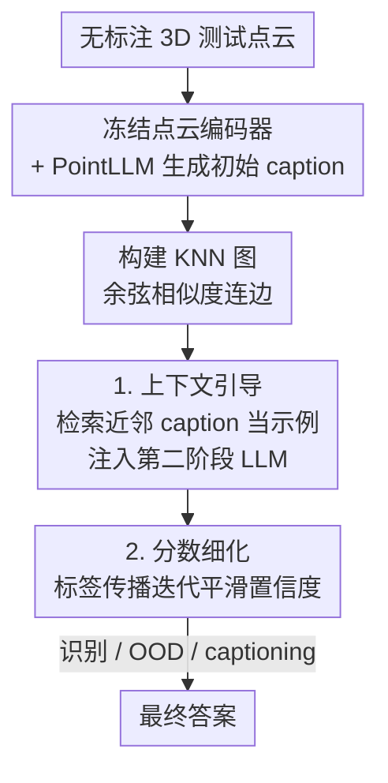

# Test-Time Optimization of 3D Point Cloud LLM via Manifold-Aware In-Context Guidance and Refinement

**会议**: ICLR 2026  
**OpenReview**: [https://openreview.net/forum?id=qsra0EsUpe](https://openreview.net/forum?id=qsra0EsUpe)  
**代码**: https://github.com/handsome999KK/PGLLM  
**领域**: 3D视觉 / 多模态VLM  
**关键词**: 3D点云LLM, 测试时优化, 上下文学习, 标签传播, OOD检测

## 一句话总结
本文提出 Point-Graph LLM（PGLLM），在不重训任何模型的前提下，于测试时把无标注支持集组织成一张 KNN 图，用近邻样本的 3D caption 作为上下文示例（in-context guidance）注入第二阶段 LLM，再用基于标签传播的置信度分数细化（score refinement）来纠正噪声预测，几乎零额外算力地提升了 3D 识别、OOD 检测和 captioning 的准确率与鲁棒性。

## 研究背景与动机

**领域现状**：把多模态大模型（MLLM）扩展到 3D 理解的主流做法，是给 LLM 配一个点云编码器，让它直接消化彩色 3D 物体点云。代表作 PointLLM 用「点云编码器 + LLaMA」的两阶段管线：第一阶段 PointLLM 先给点云生成一段文字描述（caption），第二阶段再用一个 LLM（如 GPT-4）读这段描述去做分类、captioning 等下游任务。

**现有痛点**：这类方法有一个致命缺陷——**每个点云都是孤立地被解读的**。3D 点云的类间视觉相似度很高（一个尖头黑色物体既像「快艇 boat」又像「浴缸 bathtub」），当模型只看单个样本的 caption 时，很容易把细粒度类别搞混；而且 LLM 输出的分类置信度经常过自信或失准（GPT-4 打分动不动给 0 或 100），导致 OOD 检测的 FPR95 几乎恒为 100。

**核心矛盾**：单样本推理丢掉了数据流形（manifold）的结构信息。同一类别的样本在特征空间里本应彼此靠近、互相佐证，但孤立解读把这种「集体一致性」浪费掉了。

**本文目标**：在不重训、不微调任何模型的约束下，于测试时（test-time）把流形结构利用起来，分两步解决：(1) 给查询样本找到合适的上下文示例；(2) 利用近邻一致性校准 LLM 的置信度分数。

**切入角度**：作者从 In-Context Learning（ICL）的成功获得灵感——LLM 能靠 prompt 里几个示例泛化到新任务，关键在于示例要「相关且有信息量」。那么对一个查询点云，**它在特征空间里的近邻天然就是最相关的示例**。把支持集组织成图，近邻检索即得示例。

**核心 idea**：用「测试时构建的数据流形图」同时干两件事——既从图上检索近邻 caption 当 in-context 示例丰富 prompt，又在图上做标签传播来平滑、纠正 LLM 的预测分数，全程零训练。

## 方法详解

### 整体框架
PGLLM 接收一批无标注的 3D 测试点云，输出每个样本在下游任务（识别 / OOD 检测 / captioning）上的最终答案。整体分三步走：先用冻结的点云编码器（Point-BERT）提特征，并用 PointLLM 对每个样本生成初始 caption；再在特征空间上构建 KNN 图捕捉局部几何关系；最后基于这张图做两层优化——**用近邻 caption 作上下文示例引导第二阶段 LLM 给出初始答案（in-context guidance），再用标签传播在图上迭代细化分数（score refinement）**，得到最终预测。三步全在测试时完成，不更新任何模型权重。

### 关键设计

**1. 流形图构建：把无标注支持集变成可检索的近邻结构**

这是整个方法的地基，针对「单样本孤立解读」的痛点。给定无标注支持集 $D_u=\{x_i\}_{i=1}^{N_u}$（可以是测试集本身，也可以是任意外部参考集），先用预训练点云编码器 $f_p$ 得到特征 $p_i=f_p(x_i)$，并用 PointLLM 配默认 prompt「What is this?」给每个样本生成 caption $c_i$。然后构建图 $G=(V,E)$，节点是点云、边权是特征余弦相似度，并按 K 近邻（KNN）裁剪成稀疏邻接矩阵：

$$W_{ij} = \begin{cases} e_{ij} & \text{if } e_{ij}\in \text{TopK}(\{e_{ij}\}_{j=1}^{N_u}) \\ 0 & \text{otherwise}\end{cases}, \quad e_{ij}=\frac{\langle p_i,p_j\rangle}{\|p_i\|\cdot\|p_j\|}$$

实验中 $K=3$。新来的查询样本无需重建图，按动态图扩展方案低开销挂进图里即可。这张图同时服务于后面的「检索示例」和「传播分数」两件事，是 in-context guidance 与 score refinement 的共同载体。

**2. 上下文引导：用近邻 caption 当示例，让 LLM 参照相似样本推理**

针对「LLM 只看单样本 caption 容易把相似类别搞混」的痛点。对查询样本 $x_i$，在图上取它的 $K$ 个最近邻，得到对应的 caption 集合 $C_i=\{c_{i1},\dots,c_{iK}\}$，把这些近邻 caption 作为示例追加到查询 prompt 里，再交给第二阶段 LLM（如 GPT-4）做上下文感知推理。直观效果见论文图 1：单独看一个「尖头黑色快艇」的 caption，PointLLM 会误判成 car；但当 prompt 里附上几个把同款物体描述成「长方形浴缸」的近邻 caption 后，LLM 会推理「boat 不在候选类别里，而相似样本都叫 bathtub」，从而改判为正确的 bathtub。这一步把流形上语义相关的知识在测试时注入 LLM 的推理过程，不需要任何重训。

**3. 标签传播分数细化：用近邻一致性纠正过自信的噪声预测**

针对「LLM 置信度失准、GPT-4 非 0 即 100 导致 OOD 检测崩坏」的痛点。本文不让 LLM 直接吐类别，而是让它给每个 caption 输出**逐类别置信度分数**，聚合成初始分数矩阵 $S_0\in\mathbb{R}^{l\times N_u}$，再在图 $W$ 上做标签传播迭代：

$$S_t = \alpha S_{t-1}\tilde{W} + (1-\alpha)S_0, \quad \tilde{W}=D^{-\frac{1}{2}}WD^{-\frac{1}{2}}, \quad \hat{y}_j=\arg\max_i (S_t)_{ij}$$

其中 $\tilde{W}$ 是对称归一化邻接矩阵，$\alpha$（取 0.5）平衡 LLM 原始输出与近邻传播分数，迭代 $T=5$ 次。对 3D 识别，$\hat{y}$ 取传播后最大分数对应类别；对 OOD 检测，LLM 给单一置信标量 $S(x_i)$，同样用上式（令 $l=2$）平滑后再与阈值 $\delta$ 比较判 ID/OOD。这一步让单样本上「孤证」式的离谱预测被近邻的集体一致性拉回正轨——也正是它把 GPT-4 那种非 0 即 100 的硬分数抹平成更均匀、可分的分布，从而把 FPR95 从 100 拉到 50 左右。对 captioning 任务则复用同一张图选近邻 caption 做 in-context 改写，让 LLM 在保持原语义的前提下纠错、润色。

### 一个例子：把「快艇」纠正成「浴缸」
取一个真值为 bathtub 的尖头黑色点云。PointLLM 单独看它，生成 caption「一个时尚的黑色快艇 boat」，第二阶段 LLM 一看 boat 不在类别表里、又觉得最像 car，于是误判为 car。换成 PGLLM：在 KNN 图上找到它的 3 个近邻，这些近邻的 caption 把同款物体描述成「卡通黑色浴缸 bathtub」「黑色陶瓷浴缸」。把这 3 条近邻 caption 附进 prompt 后，LLM 推理「虽然本样本被叫作 boat，但相似样本都叫 bathtub，且 boat 不在候选里」，改判 bathtub。随后 score refinement 再把这一判断在图上传播 5 轮，让周边同类样本互相加固，得到稳定的最终答案。

## 实验关键数据

### 主实验

3D OOD 检测（ModelNet40 / ShapeNetCore，AUROC↑ / FPR95↓，平均值）：

| 方法 | 2nd LLM | MN40 AUROC | MN40 FPR95 | SN AUROC | SN FPR95 |
|------|---------|-----------|-----------|----------|----------|
| MCM | – | 81.0 | 66.8 | – | – |
| GSP | – | 78.8 | 73.0 | 80.4 | 65.5 |
| PointLLM-7B | GPT-4 | 80.0 | 100.0 | 87.7 | 97.4 |
| **PGLLM_T (本文)** | GPT-4 | **85.9** | **52.1** | **91.1** | **29.6** |
| PGLLM_T (本文) | DeepSeek-V3 | 82.1 | 65.8 | 90.9 | 39.1 |
| **PGLLM_T (本文)** | MiniGPT-3D+GPT-4 | **88.1** | 45.0 | 90.8 | 44.9 |

3D 识别（ModelNet40 ACC↑）与 captioning（Objaverse）：

| 方法 | 2nd LLM | 识别平均 ACC | captioning GPT-4 |
|------|---------|------------|-----------------|
| MiniGPT-3D | GPT-4 | 60.9 | 57.1 |
| PointLLM-7B | GPT-4 | 52.6 | 44.9 |
| **PGLLM_T (本文)** | GPT-4 | **62.5** | 50.5 |
| PGLLM_T (本文) | DeepSeek-V3 | 62.3 | – |

PGLLM_T 在 ModelNet40 OOD 上把平均 AUROC 较此前最佳的 MCM 提升 +4.9%、FPR95 从 100 降到 52.1；识别上较最强 baseline MiniGPT-3D 提升 +1.6%，且换成成本更低的 DeepSeek-V3 仍达 62.3% 超过所有 GPT-4 baseline。

### 消融实验

| In-Context Guidance | Score Propagation | MN40 ACC | MN40 AUROC | MN40 FPR95 | SN ACC | SN AUROC | SN FPR95 |
|:---:|:---:|:---:|:---:|:---:|:---:|:---:|:---:|
| – | – | 52.5 | 80.4 | 100.0 | 55.5 | 88.2 | 54.9 |
| •（直接近邻无图） | – | 59.7 | 83.3 | 100.0 | 60.7 | 89.2 | 47.2 |
| ✓（图检索） | – | 60.2 | 83.1 | 100.0 | 61.0 | 89.5 | 46.0 |
| – | ✓ | 56.7 | 83.5 | 62.0 | 59.3 | 89.8 | 44.7 |
| ✓ | ✓ | **63.1** | **85.9** | **52.1** | **62.4** | **91.1** | **29.6** |

### 关键发现
- **两个模块互补、缺一不可**：只加 in-context guidance 能把识别 ACC 从 52.5 拉到 60.2，但 FPR95 还卡在 100（因为 GPT-4 仍非 0 即 100）；只加 score propagation 能把 FPR95 从 100 降到 62，但 ACC 提升有限；两者叠加才同时拿下 ACC 63.1 和 FPR95 52.1。score propagation 是 OOD 检测崩坏的关键解药。
- **图检索 > 无图近邻**：用 KNN 图检索示例（✓）比直接最近样本检索（•）在两个数据集上都稍好，说明图结构带来的局部几何关系是有用的。
- **方法增益来自机制而非闭源模型**：换上 Qwen3-VL-8B、GPT-oss-20B 等开源 LLM 作第二阶段，PGLLM 依旧稳定有效，最佳开源配置（MiniGPT-3D + Qwen3-VL/GPT-oss-20B）甚至接近或超过闭源结果；Llama3.1-8B 偏弱，作者归因于它偏对话、不擅长生成数值概率序列。
- **K 值与支持集**：K=3 时效果好；transductive（用全测试集当支持集，PGLLM_T）与用外部 Objaverse 子集（PGLLM_O）两种支持集都能超过 PointLLM baseline，体现方法对支持集来源的鲁棒性。

## 亮点与洞察
- **一张图同时干两件事**：同一张 KNN 流形图，既当 in-context 示例的检索源，又当标签传播的载体，结构极其经济，几乎零额外算力就把识别、OOD、captioning 三个任务一并提升。
- **诊断对症**：作者点破了「GPT-4 打分非 0 即 100 → FPR95 恒为 100」这一具体病灶，并用标签传播把硬分数抹平成可分布的软分数，是消融里 OOD 性能跃升的真正来源——这种「找到失准的具体形态再针对性修」的思路很值得借鉴。
- **纯测试时、即插即用**：整套方法不碰模型权重，可无缝套在 PointLLM、MiniGPT-3D 等任意 3D LLM 之上，也可换任意第二阶段 LLM，迁移到其他「编码器 + 两阶段 LLM」的多模态任务（如 2D few-shot 分类）也成立。

## 局限与展望
- **captioning 未达 SOTA**：作者承认在 3D captioning 上仍落后于最强 baseline，归因于测试集规模小、低数据下难以构出最优图结构。
- **依赖第二阶段 LLM 的数值能力**：方法要求 LLM 输出可靠的逐类别数值分数，Qwen-Plus、Llama3.1-8B 因不擅长生成长数值序列而明显掉点，说明对 LLM 的选型敏感。
- **支持集质量假设**：流形图的有效性建立在「支持集足够密、近邻确实同类」之上；若测试分布稀疏或类间高度混叠，近邻检索可能引入错误示例反而误导（一个自己发现的潜在风险）。
- **改进思路**：可引入自适应 K / 自适应 $\alpha$，或对近邻示例做置信度加权，缓解低数据与噪声近邻问题。

## 相关工作与启发
- **vs PointLLM / MiniGPT-3D**：它们孤立解读单个点云的 caption，本文在其之上叠一层测试时的流形图引导与分数细化，把孤立推理变成「参照近邻 + 集体校准」，且不改动它们的权重——本文是增量式的 test-time 包装，优势是即插即用，劣势是依赖底座 caption 质量。
- **vs 基于特征的零样本 OOD（MCM / NegLabel / ZLaP / GSP）**：这些方法走传统骨干或 VLM 的特征空间，不用 LLM 推理；本文首次把 LLM 框架引入 3D OOD 检测，并在 AUROC/FPR95 上超过它们。
- **vs 通用 ICL（Flamingo / many-shot prompting）**：以往 ICL 在 NLP 和 2D 视觉里靠人工或随机选示例，本文首次把流形学习接入 ICL 的示例选择，用图结构系统化地组织 prompt，解决了 3D 域「示例难构造」的痛点。

## 评分
- 新颖性: ⭐⭐⭐⭐ 首次把流形图同时用于 3D LLM 的 in-context 示例选择与标签传播分数细化，并首次在 LLM 框架下做 3D OOD 检测，角度新颖。
- 实验充分度: ⭐⭐⭐⭐ 覆盖 4 个数据集、3 个任务、多种闭源/开源第二阶段 LLM，消融清晰；但 captioning 未达 SOTA、真实场景仅 S3DIS 一处。
- 写作质量: ⭐⭐⭐⭐ 动机清晰、图示直观，方法公式完整；个别表述与排版略粗糙。
- 价值: ⭐⭐⭐⭐ 零训练、几乎零开销即插即用，对 3D LLM 落地与 OOD 鲁棒性有实用价值。

<!-- RELATED:START -->

## 相关论文

- [\[ICLR 2026\] TTT3R: 3D Reconstruction as Test-Time Training](ttt3r_3d_reconstruction_as_test-time_training.md)
- [\[ICLR 2026\] GOOD: Geometry-guided Out-of-Distribution Modeling for Open-set Test-time Adaptation in Point Cloud Semantic Segmentation](good_geometry-guided_out-of-distribution_modeling_for_open-set_test-time_adaptat.md)
- [\[CVPR 2026\] tttLRM: Test-Time Training for Long Context and Autoregressive 3D Reconstruction](../../CVPR2026/3d_vision/tttlrm_test-time_training_for_long_context_and_autoregressive_3d_reconstruction.md)
- [\[CVPR 2026\] Mamba Learns in Context: Structure-Aware Domain Generalization for Multi-Task Point Cloud Understanding](../../CVPR2026/3d_vision/mamba_learns_in_context_structure-aware_domain_generalization_for_multi-task_poi.md)
- [\[ICLR 2026\] Point-Focused Attention Meets Context-Scan State Space: Robust Biological Visual Perception for Point Cloud Representation](point-focused_attention_meets_context-scan_state_space_robust_biological_visual_.md)

<!-- RELATED:END -->
