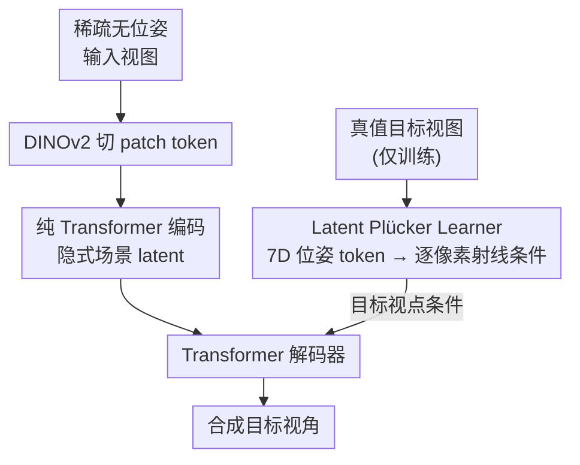

# The Less You Depend, the More You Learn: Synthesizing Novel Views from Sparse, Unposed Images with Minimal 3D Knowledge

**会议**: ICLR 2026  
**OpenReview**: [https://openreview.net/forum?id=QXc2NBJFHr](https://openreview.net/forum?id=QXc2NBJFHr)  
**代码**: 无  
**领域**: 3D视觉 / 新视角合成  
**关键词**: 前馈式新视角合成, 无位姿, 数据可扩展性, 隐式3D, Plücker射线  

## 一句话总结
本文系统论证了「越少依赖显式 3D 知识，越能从大数据中学到东西」这一可扩展性规律，并据此提出 UP-LVSM——一个完全不需要显式场景结构和相机位姿标注的纯 Transformer 前馈 NVS 框架，靠自监督学到的「Latent Plücker Learner」从无位姿的 2D 图像直接合成高保真新视角，性能反超了用真值位姿训练的方法。

## 研究背景与动机

**领域现状**：前馈式新视角合成（NVS）近年分裂成两条技术路线。一条是**偏置驱动（bias-driven）**：把人类先验的 3D 知识硬塞进架构里——比如用 NeRF / 3DGS 这类手工设计的显式 3D 表示、用 COLMAP 等 SfM 算法标注的相机位姿（代表作 MVSplat、NoPoSplat）。另一条是**数据驱动（data-centric）**：不预设 3D 结构，把场景隐式表示成 latent token，让空间理解从海量 2D 图像里自己学出来（代表作 LVSM、Rayzer）。

**现有痛点**：这两条路线都被证明有效，但谁也说不清——在数据越来越充裕的今天，哪一条更可扩展、最终能学得更好？偏置驱动方法靠强几何先验在小数据上表现亮眼，可它们到底是「永远更强」还是「只是赢在起跑线」？这个问题此前没有被系统量化过。

**核心矛盾**：显式 3D 知识其实是一把双刃剑。数据稀缺时，强结构偏置像一根**脚手架**，用先验补足信息不足；可一旦数据变多，这些同样的偏置就变成**枷锁**，限制模型直接从数据里学复杂模式，反而成为规模化的性能瓶颈。更隐蔽的是，SfM 标注的位姿本身建立在启发式几何算法上、常出错，依赖它训练等于间接依赖了一份有噪声的 3D 知识。

**本文目标**：先量化「3D 知识依赖度」与「数据可扩展性」的关系，验证规律；再据此设计一个把两类依赖（显式场景结构 + 位姿标注）全部去掉的框架，看它能否靠纯数据驱动反超有位姿的方法。

**切入角度**：作者把现有方法按「显式场景结构」和「位姿可得性」两个维度归类，在 RealEstate10K 上切出从 1K 到 66K 场景的递增子集，量化「训练数据每翻 4 倍，PSNR/SSIM/LPIPS 平均涨多少」作为可扩展性指标。结果一致地揭示：**越少依赖显式 3D 知识的方法，性能随数据增长加速越快，最终反超依赖 3D 知识的对手**——这就是标题里的 "the less you depend, the more you learn"。

**核心 idea**：既然依赖越少越能扩展，那就把依赖砍到底——提出 **UP-LVSM**（Unposed Large View Synthesis Model），既不用显式 3D 表示也不用任何位姿（输入、目标都不用），通过自监督的 Latent Plücker Learner 在 latent 空间里学一套相机几何，从纯 2D 图像解锁完整的数据扩展潜力。

## 方法详解

### 整体框架

UP-LVSM 处在最难的 **unposed 设定**下：输入视图没有位姿 $P_I$、目标视图也没有位姿 $P_T$，模型只能从「同一场景的多张图互为正样本」这个隐式信号里自己学出视点。整体是一个纯 Transformer 的 encoder-decoder：输入视图先用 DINOv2 切成 patch token，经 Transformer 编码成隐式的**场景 latent**（丢掉一份模板 latent，只留场景 latent）；解码器再吃下场景 latent + 描述目标视点的 **Latent Plücker** 条件，合成出目标视角图像。

关键的难点在于：渲染必须有「目标视点」这个条件，但 unposed 设定下根本没有 $P_T$ 的真值。本文的解法是在**训练时**额外挂一个 **Latent Plücker Learner**：它像一个自编码器，把真值目标图编码成一个极度紧凑的 7 维位姿 token，再解析地上采样成逐像素的 Plücker 射线条件喂给解码器。这样模型既拿到了渲染所需的视点信号，又因为 7 维瓶颈而学不到目标图内容本身，从而在没有任何 3D 监督的情况下自监督地学出一套有意义的相机位姿表示。

### 关键设计

**1. 去显式 3D 知识的纯 Transformer 隐式建模：把场景当成可学的 latent，而非手工 3D 表示**

针对「显式 3D 结构在大数据下成为瓶颈」这一痛点，UP-LVSM 沿用 LVSM 的思路，彻底放弃 NeRF/3DGS 这类预定义表示和它们配套的可微渲染公式，把场景 $S$ 表示成一组隐式 latent token，渲染函数 $R$ 也用可学的 Transformer 网络取代手工渲染。形式上仍是 $S = A(\cdot)$、$T = R(S, P_T)$，但 $A$ 和 $R$ 全是神经网络。这样做的好处是模型不被任何几何归纳偏置框死，能直接从数据里学复杂的空间模式——实验里正是这种「无结构偏置」让它在 66K 场景上把 MVSplat、NoPoSplat 远远甩开（数据每翻 4 倍 PSNR 平均涨 2.63 vs. NoPoSplat 仅 0.12）。

**2. Latent Plücker Learner：用 7 维瓶颈在自监督下学相机位姿，绕开位姿标注**

这是全文最核心的贡献，专治「unposed 设定下没有 $P_T$ 真值、无法给渲染提供视点条件」的难题。最朴素的想法是直接学一个高维 latent pose，但高维空间会发生严重的**信息泄漏**——latent 会顺手把目标图本身编码进去，模型就退化成「抄答案」而不是学视点；反过来维度太低又不足以指导像素级渲染。本文用一个自编码器架构在两者间巧妙取舍：encoder 先把目标图蒸馏成一个极紧凑的 **7 维位姿 token**（3 维平移 $x$ + 4 维四元数 $q$），这个低维瓶颈物理上就装不下图像内容，杜绝了泄漏；随后再把这 7 维 token **解析地上采样**成逐像素、细粒度的条件——做法是把经典的 Plücker 射线嵌入搬到这个学出来的 latent 空间里。

Plücker 射线嵌入本身是把相机位姿写进像素对齐 token 的成熟手段：给定图像 $I \in \mathbb{R}^{H\times W\times 3}$，每个像素的位姿编码为

$$\hat{P} = \mathrm{concat}(o \times d,\ d) \in \mathbb{R}^{H\times W\times 6}$$

其中 $o$ 是相机中心、$d$ 是该像素对应的射线方向。本文的创新在于让 $o,d$ 来自学到的 7 维 latent pose 而非真值位姿，于是既保留了 Plücker 那份丰富的逐射线条件，又把可学位姿参数压到极少。通过在所有场景间共享这套 latent 空间训练，模型最终在零 3D 监督下学到了有意义、可泛化的相机位姿表示。消融显示，这个设计比「直接用 SfM 标注位姿」（28.82 → 26.00 PSNR）和「换成 Sajjadi 等人的位姿估计器」（→20.92，大数据下不稳定）都明显更好。

**3. DINOv2 tokenizer 提供 3D 感知的起点：用预训练视觉特征当输入编码**

UP-LVSM 用 DINOv2 把输入图像切成 patch token 作为编码起点（因 patch size=14，分辨率从常见的 $256\times256$ 调成 $224\times224$ 对齐 DINOv2 原生配置）。这一选择并非随手为之：DINOv2 特征本身就携带较强的跨视图对应关系，给「从纯 2D 学 3D 感知」开了个好头。后文的 3D awareness 探针实验印证了这点——UP-LVSM 的对应估计精度逼近甚至局部超过 DINOv2，远高于 CLIP/MAE，说明这套隐式框架确实在 DINOv2 的底子上长出了真实的空间理解能力。

### 损失函数 / 训练策略

训练仅用一个**重建损失** $\mathcal{L}_{\mathrm{recon}}$，度量合成目标视图 $T$ 与真值 $\tilde{T}$ 的差异，没有任何位姿监督或 3D 监督。Latent Plücker Learner 只在训练时启用（推理时不需要真值目标图）。为保证公平对比，所有 baseline 都用相同的 $224\times224$ 分辨率、patch size=14 和相同训练划分从头重训，不用官方 checkpoint。

## 实验关键数据

### 主实验

RealEstate10K 上按输入视图重叠程度分级评测，UP-LVSM 在完全不用位姿的前提下全面超过依赖位姿的方法，尤其在重叠最小（最难）的场景优势最大：

| 配置 | 用输入位姿 | PSNR↑ | SSIM↑ | LPIPS↓ |
|------|:---:|------|------|------|
| MVSplat（3DGS, posed） | ✓ | 26.45 | 0.874 | 0.123 |
| LVSM（latent, posed） | ✓ | 27.60 | 0.874 | 0.117 |
| NoPoSplat（3DGS, posed-target） | ✗ | 25.46 | 0.854 | 0.137 |
| **UP-LVSM（unposed）** | ✗ | **28.82** | **0.891** | **0.104** |

小重叠子集上 UP-LVSM 达 24.54 PSNR，远超 LVSM 的 22.71，说明无位姿框架在弱约束输入下反而更鲁棒。

可扩展性是全文真正的主结果——量化「数据每翻 4 倍的平均增益」，依赖越少增益越大：

| 方法 | 无结构偏置 | 无输入位姿 | Avg. Gain (ΔPSNR) |
|------|:---:|:---:|------|
| NoPoSplat | ✗ | ✗ | 0.12 |
| MVSplat | ✗ | ✓(posed) | 0.39 |
| LVSM | ✓ | ✗ | 0.64 |
| PT-LVSM | ✓ | ✓ | 1.72 |
| **UP-LVSM** | ✓ | ✓✓(连目标位姿都不要) | **2.63** |

### 消融实验

针对 Latent Plücker Learner，对比不同的目标位姿 $P_T$ 来源：

| 配置 | PSNR↑ | SSIM↑ | LPIPS↓ | 说明 |
|------|------|------|------|------|
| (a) SfM 标注位姿 | 26.00 | 0.825 | 0.135 | 退回 posed-target，SfM 噪声拖累性能 |
| (b) Sajjadi 位姿估计器 | 20.92 | 0.521 | 0.558 | 小数据有效，大数据不稳定 |
| (c) **Latent Plücker Learner** | **28.82** | **0.891** | **0.104** | 7D 瓶颈 + Plücker 嵌入，避免泄漏 |

### 关键发现
- **依赖越少，扩展越快**：偏置驱动的 NoPoSplat 在 1K 场景上不输，但 66K 场景下几乎停滞（Avg. Gain 仅 0.12）；UP-LVSM 起步最低却加速最猛（2.63），最终反超所有方法——直接证明了「the less you depend, the more you learn」。
- **位姿标注是隐性瓶颈**：LVSM 和 PT-LVSM 同为数据驱动，唯一区别是前者要输入位姿，后者不要；结果不要位姿的 PT-LVSM 扩展性（1.72）显著强于 LVSM（0.64），作者归因于 SfM 位姿自带噪声。
- **零样本泛化反超本地训练**：RE10K→ACID 跨数据集测试（27.33 PSNR）甚至超过直接在 ACID 上训练（27.21），说明大数据量本身带来的收益压过了域差距。
- **隐式框架真学到了 3D**：3D awareness 探针上 UP-LVSM 对应估计精度逼近 DINOv2、远超 CLIP/MAE，注意力可视化也显示出清晰的跨视图对应。

## 亮点与洞察
- **把「设计哲学之争」变成可测量的规律**：作者没有停留在「哪种方法更好」的直觉争论，而是把「3D 知识依赖度」拆成结构偏置 + 位姿两个可控变量，用「数据翻倍增益」量化可扩展性，把一句口号变成可复现的趋势曲线——这种「先立规律再做方法」的叙事很值得借鉴。
- **7 维瓶颈治信息泄漏是点睛之笔**：自监督学 latent pose 最怕 latent 偷偷编码目标图。用一个 7 维（平移+四元数）的物理瓶颈强行卡住容量、再用解析的 Plücker 上采样补回渲染所需的细粒度，这种「先压瓶颈防泄漏、再解析展开保表达」的思路可迁移到任何「想学某个低维因子但又怕泄漏全图」的自监督任务。
- **「少即是多」的反直觉结论**：通常认为先验越强越好，本文却给出大数据时代的反例——先验是稀缺数据下的拐杖，数据充裕后应主动拆掉。

## 局限与展望
- **依赖大数据才成立**：UP-LVSM 起步性能明显低于偏置驱动方法（1K 场景上 21.03 vs. MVSplat 25.24），整个论点的前提是数据足够多；小数据场景下它并不占优，甚至在 ACID/DL3DV 的极小子集上出现 "Not Converged" 之外的低分。
- **结论的数据集范围**：核心可扩展性规律主要在 RealEstate10K 这类真实室内外场景上量化，Objaverse 物体级数据上 UP-LVSM 增益（2.11）虽仍最高但绝对性能落后 LVSM，说明规律在不同数据分布下强弱不一。
- **位姿仅训练时学**：Latent Plücker Learner 需要训练时的真值目标图做自监督，框架对「同场景多视图」这一隐式正样本结构有依赖，对单视图或视图极度稀疏的数据如何退化尚未充分探讨。

## 相关工作与启发
- **vs LVSM**: 同为纯 Transformer latent 场景建模，但 LVSM 仍需输入位姿 $P_I$；UP-LVSM 连输入位姿都不要，靠 Latent Plücker Learner 自监督补上视点信息，扩展性（2.63 vs. 0.64）和最终性能（28.82 vs. 27.60）双双反超。
- **vs NoPoSplat**: NoPoSplat 用 3DGS 显式表示 + posed-target 设定，结构偏置强；UP-LVSM 去掉显式结构和所有位姿，证明「拆脚手架」在大数据下换来更高天花板。
- **vs Sajjadi 等人的位姿估计器（SRT 系）**: 二者都想自监督学 latent pose，但 SRT 用 key-value query + masking，大数据下不稳定（20.92 PSNR）；本文用 7D 瓶颈 + Plücker 解析上采样，天然防泄漏且随数据稳定提升。

## 评分
- 新颖性: ⭐⭐⭐⭐⭐ 把设计哲学之争量化成可扩展性规律，并用 7D Plücker 瓶颈优雅解决无位姿自监督，立意和方法都新。
- 实验充分度: ⭐⭐⭐⭐⭐ 4 个数据集 × 多个数据规模的可扩展性曲线 + 重叠分级 + 零样本 + 3D 探针，论证链条完整。
- 写作质量: ⭐⭐⭐⭐ 「先立规律再做方法」的结构清晰，标题点题；部分关键实现细节放在附录略显单薄。
- 价值: ⭐⭐⭐⭐⭐ 给数据时代的 NVS（乃至更广的「先验 vs 数据」之争）提供了可操作的指导原则，影响面大。

<!-- RELATED:START -->

## 相关论文

- [\[ICLR 2026\] YoNoSplat: You Only Need One Model for Feedforward 3D Gaussian Splatting](yonosplat_you_only_need_one_model_for_feedforward_3d_gaussian_splatting.md)
- [\[ICCV 2025\] SpatialSplat: Efficient Semantic 3D from Sparse Unposed Images](../../ICCV2025/3d_vision/spatialsplat_efficient_semantic_3d_from_sparse_unposed_images.md)
- [\[ICLR 2026\] Fused-Planes: Why Train a Thousand Tri-Planes When You Can Share?](fused-planes_why_train_a_thousand_tri-planes_when_you_can_share.md)
- [\[ICLR 2026\] UFO-4D: Unposed Feedforward 4D Reconstruction from Two Images](ufo-4d_unposed_feedforward_4d_reconstruction_from_two_images.md)
- [\[CVPR 2025\] You See it, You Got it: Learning 3D Creation on Pose-Free Videos at Scale](../../CVPR2025/3d_vision/you_see_it_you_got_it_learning_3d_creation_on_pose-free_videos_at_scale.md)

<!-- RELATED:END -->
