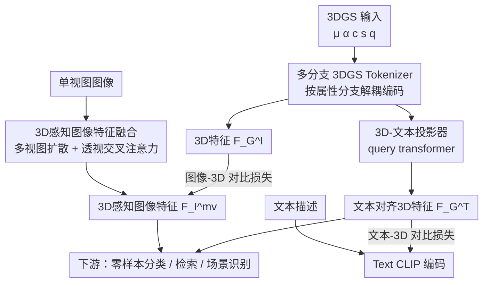

# TIGaussian: Disentangle Gaussians for Spatial-Aware Text-Image-3D Alignment

**会议**: ICLR 2026  
**OpenReview**: [https://openreview.net/forum?id=CbzCID5lkD](https://openreview.net/forum?id=CbzCID5lkD)  
**代码**: https://github.com/RUiN-jiarun/TIGaussian  
**领域**: 3D视觉 / 多模态对齐  
**关键词**: 3D高斯泼溅, 跨模态对齐, 属性解耦, 多视图融合, 对比学习

## 一句话总结
TIGaussian 把 3D 高斯（3DGS）的各个内在属性拆开分支编码、再用扩散先验把单视图图像补成多视图融合特征、并用一个 query transformer 把 3D 特征投影到文本空间，从而在文本-图像-3DGS 三模态对齐上全面刷新 SOTA。

## 研究背景与动机
**领域现状**：文本-图像对比预训练（CLIP/EVA-CLIP）已经把图文特征对齐得很好，近年大家想把"第三个模态"——3D——也拉进同一个嵌入空间，以支持零样本分类、跨模态检索、场景识别等下游任务。早期 3D 侧用点云（PointCLIP、ULIP、Uni3D）或体素（TriCoLo），最近 UniGS 第一次用 3D 高斯泼溅（3DGS）作为 3D 表示，靠蒸馏 Uni3D 预训练模型拿到了 SOTA。

**现有痛点**：作者把矛头对准当前最强的 3DGS 方法 UniGS，指出它两个具体缺陷。其一是**纠缠式 3D 编码**：3DGS 每个高斯基元有位置 $\mu$、不透明度 $\alpha$、颜色 $c$（球谐系数导出）、缩放 $s$、旋转 $q$ 等性质完全不同的属性，UniGS 把它们直接拼成一个同质特征向量一起编码，忽视了各属性的分布规律和几何意义，导致信息相互干扰、压缩后丢细节。其二是**退化的 3D 感知**：图像-3D 对齐时只随机抽一个单视图去和 3D 特征强行对齐，单一视角无法刻画全局上下文，跨视角一致性在对齐过程中被破坏，3D 特征的感知能力反而下降。

**核心矛盾**：3DGS 是一种属性异质、且天然多视角可渲染的显式表示，但现有方法既没有针对"属性异质"去解耦编码，也没有利用"多视角"去补全单视图的视角偏差——它把 3DGS 当成普通的同质点云在用，浪费了 3DGS 的特性。

**本文目标**：分解为三个子问题——(1) 怎么把 3DGS 的异质属性编成紧凑且泛化的 3D 潜表示；(2) 怎么消除图像-3D 对齐里的单视图视角偏差；(3) 怎么缩小连续 3D 特征空间和离散文本嵌入之间的模态鸿沟。

**核心 idea**：用一个**多分支 3DGS tokenizer** 解耦属性、用**扩散增强的多视图融合**补全图像侧 3D 感知、用一个**3D-文本投影器**对齐文本侧，三者组成一个面向 3DGS 特性定制的三模态对齐框架。

## 方法详解

### 整体框架
TIGaussian 接收三种模态输入——一个用普通 3DGS 表示的物体、它的单视图图像、以及一段文本描述——目标是把三者对齐到同一个 512 维嵌入空间。整体流程分三条支路协同：3D 支路用多分支 tokenizer 把高斯解耦编码出结构化潜特征 $F_G^I$；图像支路先用多视图扩散把单视图扩成 6 个视图、过 CLIP 后用透视感知的交叉注意力融成 3D 感知特征 $F_I^{mv}$；文本支路用 CLIP 编码文本 $F_T$，同时把 3D 特征经投影器映射到文本空间得到 $F_G^T$。最后用两条对比损失 $L(F_G^I, F_I^{mv})$ 和 $L(F_G^T, F_T)$ 把三模态拉进共享空间。由于文本-图像 CLIP 本身已预对齐，框架只需训练 3D 侧与图、文的对齐，不再额外算图文之间的对比损失。

### 关键设计

**1. 多分支 3DGS Tokenizer：按属性"分而治之"取代一锅炖**

这一设计直接针对 UniGS 的纠缠式编码痛点。一个高斯的属性集合 $G=\{\mu, \alpha, c, s, q\}$ 在数值范围和表征目的上差异巨大——位置 $\mu$ 是空间坐标、颜色 $c$ 是外观、缩放旋转 $s,q$ 是形态——硬塞进一个共享域里变换会相互干扰、造成信息损失。作者先按既有做法用最远点采样（FPS）把物体下采到 1024 个高斯、用 kNN 分成局部高斯 patch，然后把每个属性分别送进**各自的编码分支** $\{E_\mu, E_\alpha, E_c, E_s, E_q\}$。每个分支是三层 MLP，但针对属性特性定制：空间分支 $E_\mu$ 借鉴 PointNet、额外加可学习位置编码并用 max pooling 聚合成排列不变的全局描述子；外观分支 $E_\alpha, E_c$ 用 sigmoid 激活来约束值域、刻画外观的非线性变化；形态分支 $E_s, E_q$ 用归一化层标准化输出。作者从信息瓶颈视角（information bottleneck）解释：解耦后每个分支能在属性专属的瓶颈下自适应压缩、只保留任务相关信号，避免异质属性混在一起的次优对齐。各属性特征最后拼接、过两层 MLP 融成统一 token，再借鉴 UniGS 用预训练点云模型（Uni3D-S）的特征作 cross-attention guidance 注入先验，最后过 FC 层调到 $d=512$ 输出 $F_G^I$。论文用 Fig.1 那张床的例子点题：旧方法会忽略"白色条纹被子"这种细节，而解耦编码能把它凸显出来。

**2. 扩散增强的多视图图像融合：用扩散先验补全单视图的 3D 感知**

这一设计针对单视图对齐导致 3D 感知退化的痛点。直接拿一个随机视角的图像去对齐，会让 3D 特征过拟合该视角、在其他视角下匹配变差；而像 ULIP-2 那样堆多个图文-3D 三元组、或像 Duoduo-CLIP 那样直接用多视图图像表示 3D，又会牺牲计算效率或丢掉显式 3D 表示的简洁性。作者的折中是：对单视图 $I$ 先用预训练多视图扩散模型（Hunyuan3D-v1 的 MVD-std）在 $N$ 个预设相机角度 $\Phi$ 下生成多视图 $D(I,\Phi)=\{I_0,\dots,I_N\}$，每张过 CLIP 得到 $F_{I_i}$，再用**透视感知的交叉注意力**把它们融成一个 3D 感知特征：以原视图特征 $F_I$ 作 query，所有多视图特征拼接并加正弦位置编码 $PE(\Phi)$ 作 key/value，$Attn(Q,K,V)=\text{Softmax}(QK^\top/\sqrt{d})V$，最后残差加归一化得 $F_I^{mv}=\text{LayerNorm}(F_I+Attn)$。对齐时用 $F_I^{mv}$ 替换原来的 $F_I$，相当于把扩散模型隐含的 3D 一致性先验"灌"进了 3DGS 特征，让它具备多视角感知。这比真的去采集多视图三元组省数据，又比单视图更鲁棒。

**3. 3D-文本投影器：用可学习 query 把 3D 流形对齐到文本嵌入结构**

即便 3D 特征已经和多视图图像对齐，它和文本模态之间仍有鸿沟。作者借鉴 BLIP-2 式的 query transformer 架构，引入一组可学习 query $F_q\in\mathbb{R}^{N_q\times d}$ 作软提示，过 $L=6$ 层 transformer 迭代地从 3D 特征里抽取文本相关信息。每层做三件事并都带残差连接：自注意力精炼 query、交叉注意力（query 作 Q、$F_G^I$ 作 K/V）注入 3D 上下文、MLP 前馈。最终把精炼后的 query 展平、池化得到面向文本对齐的紧凑嵌入 $F_G^T$。它的作用是把 3DGS 的连续潜流形"扭"到匹配文本嵌入的结构，从而降低文本-3D 对齐的难度——文本检索用 $F_G^T$ 与文本 $F_T$ 算余弦相似度。

### 损失函数 / 训练策略
总损失是两条 InfoNCE 对比损失的加权和：
$$L = \lambda_T L(F_G^T, F_T) + \lambda_I L(F_G^I, F_I^{mv})$$
即文本侧用投影后的 $F_G^T$ 对文本、图像侧用原始 3D 特征 $F_G^I$ 对融合后的多视图特征，$\lambda_T=\lambda_I=0.5$。由于文图已预对齐，框架特意不算文本与融合图像之间的对比损失。文本-图像编码用 Open-CLIP ViT-B-16，3D token 用 Uni3D-S 引导。先在 Objaverse 上用 AdamW、学习率 $1\text{e-}4$ 训 15 epoch，再在 ABO / SUN RGBD 上各 finetune 20 epoch；4 张 A100 训练、单卡推理。

## 实验关键数据

### 主实验
零样本分类（Top-1，平均类别准确率）：

| 数据集 | 指标 | TIGaussian | UniGS | Duoduo CLIP | 提升(vs UniGS) |
|--------|------|------------|-------|-------------|------|
| Objaverse-LVIS | Top-1 | 41.76 | 37.64 | 38.05 | +4.12 |
| ABO | Top-1 | 61.70 | 52.33 | 57.82 | +9.37 |

跨模态检索（Top-1，Objaverse-LVIS / Objaverse）：

| 任务 | TIGaussian | UniGS | Uni3D |
|------|------------|-------|-------|
| 图像-3D 检索 Top-1 | 54.11 | 41.78 | 39.65 |
| 文本-3D 检索 Top-1 | 21.20 | 21.00 | 16.70 |

场景识别（SUN RGBD，Top-1）：TIGaussian 76.46 vs UniGS 68.92 vs Uni3D 61.72，提升约 7.5 个点。图像-3D 检索的提升最显著（ABO 上 Top-1 从 UniGS 的 26.69 跳到 66.15），印证了多视图融合对消除视角偏差的作用。

### 消融实验
在 Objaverse 上逐组件消融（Tkn.=多分支 tokenizer，MV.=用多视图图像，MVF.=多视图融合模块，TP.=3D-文本投影器；Cl./TR./IR.=分类/文本检索/图像检索 Top-1）：

| 配置 | Tkn | MV | MVF | TP | Cl. | TR. | IR. |
|------|-----|----|----|-----|-----|-----|-----|
| Exp1 (≈UniGS) | - | - | - | - | 33.64 | 18.50 | 39.87 |
| Exp2 | ✓ | - | - | - | 35.57 | 19.15 | 41.68 |
| Exp4 | ✓ | ✓ | ✓ | - | 38.68 | 19.20 | 53.75 |
| Exp5 | ✓ | - | - | ✓ | 35.71 | 20.80 | 40.52 |
| Exp6 (去 tokenizer) | - | ✓ | ✓ | ✓ | 37.72 | 17.80 | 52.26 |
| Exp7 (Full) | ✓ | ✓ | ✓ | ✓ | 41.76 | 21.20 | 54.11 |

### 关键发现
- **多分支 tokenizer 是 3D 上下文抽取的关键**：Exp1→Exp2 三个任务全涨，Exp6（去掉它）vs Exp7 全面掉点，说明它是不可或缺的 3D 上下文提取器。
- **多视图融合主要拉动图像检索**：Exp2→Exp4 图像检索从 41.68 飙到 53.75；而 Exp4→Exp3 去掉融合模块后明显下降，证明"光堆训练三元组"既费算力又不如显式融合有效。
- **3D-文本投影器专门提升文本检索**：Exp2→Exp5 文本检索 19.15→20.80，对图像/分类影响小，职责分工清晰。三个模块互补，Full 模型才达到最优。

## 亮点与洞察
- **"按属性解耦"把 3DGS 当 3DGS 用**：位置/外观/形态数值范围和语义都不同，分支化编码 + 属性专属激活（空间用 PointNet+maxpool、外观用 sigmoid、形态用归一化）是个很自然却被前人忽略的点，信息瓶颈视角的解释也站得住脚。
- **用扩散先验"白嫖"多视图一致性**：不真去采多视图三元组、而是让预训练多视图扩散模型生成视图再融合，既补了单视图视角偏差又省数据——这个"用生成模型当 3D 感知先验"的思路可迁移到其他单视图 3D 理解任务。
- **三模块职责清晰、消融可解释**：tokenizer 管 3D 抽象、融合管图像视角、投影器管文本对齐，消融表几乎能一一对应到三个任务，是少见的"模块-收益"对得很整齐的设计。

## 局限与展望
- 作者承认两点：(1) 泛化性——在遮挡多物体或真实室外场景上可能退化；(2) 文本标签依赖——文本-3D 对齐质量取决于训练标签，当前 benchmark 多用 LLM 生成标注，会引入偏差，未来可探索 LLM + 专家标注的混合监督。
- 自己看：多视图融合依赖一个外部预训练扩散模型（Hunyuan3D-v1），其生成质量直接影响 $F_I^{mv}$，论文未消融"扩散模型选型/视图数 $N$"的敏感性；文本-3D 检索的绝对提升（vs UniGS 仅 +0.2）相比图像检索小得多，说明文本侧鸿沟仍是瓶颈。
- 投影器、融合模块的层数/query 数等超参缺乏系统扫描，泛化到更大规模 3DGS 数据时的 scaling 行为只在附录略提。

## 相关工作与启发
- **vs UniGS**: 同样用 3DGS 做三模态对齐，但 UniGS 把所有高斯属性拼成同质特征整体编码、且用单视图对齐；本文把属性解耦成多分支编码、并用多视图扩散融合 + 3D-文本投影补全图文两侧，全面超过 UniGS（尤其图像检索）。
- **vs Uni3D**: Uni3D 是点云侧的 1B 大模型 SOTA，本文用它作 3DGS token 的 cross-attention 引导先验，但表示从点云升级到信息更丰富的 3DGS，并针对 3DGS 特性定制编码。
- **vs Duoduo-CLIP / ULIP-2**: 这类方法用多视图图像或多三元组表示 3D，牺牲了显式 3D 表示的简洁性和计算效率；本文保留 3DGS 显式表示、只在图像侧借多视图扩散补感知，分类/检索均更优。

## 评分
- 新颖性: ⭐⭐⭐⭐ 把 3DGS 属性解耦 + 扩散多视图先验 + 文本投影组合用于三模态对齐，针对性强但各组件多为已有思路的巧妙组装。
- 实验充分度: ⭐⭐⭐⭐ 覆盖分类/检索/场景识别/少样本探针多任务、消融逐组件且可解释，但缺扩散模型与超参敏感性分析。
- 写作质量: ⭐⭐⭐⭐ 动机-痛点-设计对应清晰，公式与图配合好，个别表述（如 spatial-awared）有小笔误。
- 价值: ⭐⭐⭐⭐ 多任务刷新 3DGS 跨模态 SOTA、代码开源，对 3D 多模态预训练有实用参考价值。

<!-- RELATED:START -->

## 相关论文

- [\[CVPR 2026\] Geometry-Aware Cross-Modal Graph Alignment for Referring Segmentation in 3D Gaussian Splatting](../../CVPR2026/3d_vision/geometry-aware_cross-modal_graph_alignment_for_referring_segmentation_in_3d_gaus.md)
- [\[ECCV 2024\] 3D Congealing: 3D-Aware Image Alignment in the Wild](../../ECCV2024/3d_vision/3d_congealing_3d-aware_image_alignment_in_the_wild.md)
- [\[CVPR 2026\] Text–Image Conditioned 3D Generation](../../CVPR2026/3d_vision/text-image_conditioned_3d_generation.md)
- [\[CVPR 2026\] SPAN: Spatial-Projection Alignment for Monocular 3D Object Detection](../../CVPR2026/3d_vision/span_spatial-projection_alignment_for_monocular_3d_object_detection.md)
- [\[CVPR 2026\] CrowdGaussian: Reconstructing High-Fidelity 3D Gaussians for Human Crowd from a Single Image](../../CVPR2026/3d_vision/crowdgaussian_reconstructing_high-fidelity_3d_gaussians_for_human_crowd_from_a_s.md)

<!-- RELATED:END -->
