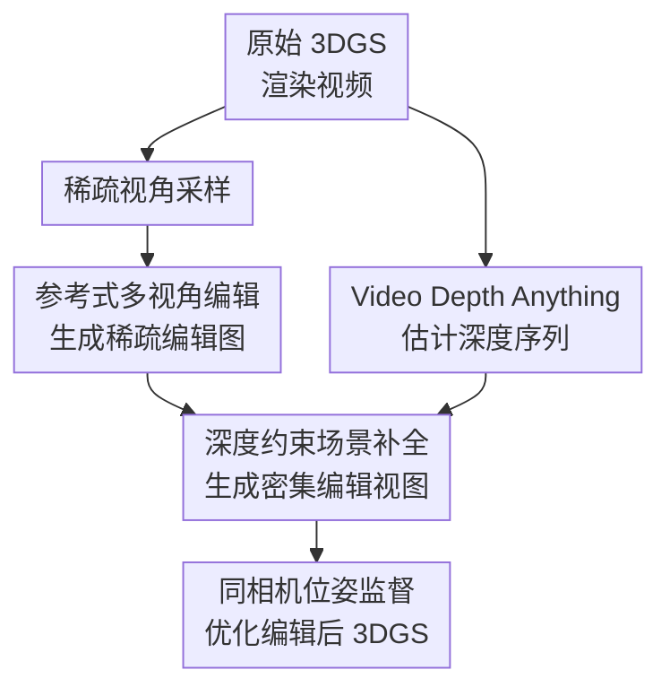

# TINKER: Diffusion's Gift to 3D--Multi-View Consistent Editing From Sparse Inputs without Per-Scene Optimization

**会议**: ICLR 2026  
**OpenReview**: [https://openreview.net/forum?id=j7Vt2lp2jX](https://openreview.net/forum?id=j7Vt2lp2jX)  
**代码**: 将在录用后公开  
**领域**: 3D视觉  
**关键词**: 多视角一致编辑, 3DGS编辑, 扩散模型, 稀疏视角, 场景补全

## 一句话总结
TINKER 把大规模 2D 图像编辑模型和视频扩散模型改造成面向 3D 的多视角一致编辑流水线，只用一张或少量已编辑参考图就能生成密集一致视角，并在无需逐场景优化编辑模型的情况下完成高质量 3DGS 编辑。

## 研究背景与动机
**领域现状**：当前 3D 场景编辑常见做法是先用 2D 扩散编辑器生成若干视角的编辑图，再把这些图作为监督去优化 NeRF 或 3D Gaussian Splatting。这个范式的吸引力在于可以借用 2D 生成模型的语义编辑能力，而最终结果又落在可渲染的 3D 表示上。

**现有痛点**：问题出在多视角一致性和实用成本。许多方法要么逐场景微调扩散模型或 3D 表示，要么需要反复调参来压住不同视角之间的漂移。即使单张图编辑很漂亮，不同相机位看到的物体颜色、纹理、风格也可能对不上；如果为了 3DGS 优化而先生成几十张一致编辑图，成本又会变得很高。

**核心矛盾**：大规模 2D 编辑模型已经很强，但它天然处理的是图像平面，不知道一个 3D 场景在不同视角下应该共享同一个编辑意图。作者观察到，把两个视角横向拼接后一起送入最新图像编辑模型，模型能在这两张图之间保持不错的局部一致性；但不同拼接对之间没有全局锚点，因此 pair 内一致、pair 间不一致。更直接的“拿一张已编辑图当参考，去编辑另一张未编辑图”也不能直接成功，因为基础模型预训练时没见过这种参考式多视角编辑配置。

**本文目标**：TINKER 要解决三个子问题：第一，让图像编辑模型学会根据一个已编辑参考视角把同一编辑传播到另一个视角；第二，从一张或少量稀疏编辑视角补全大量相机位上的编辑图；第三，把这些密集编辑视图稳定地用于 3DGS 优化，同时避免对每个测试场景重新训练编辑模型。

**切入角度**：作者没有从头训练一个 3D 编辑模型，而是“榨出”扩散模型已经学到的隐式 3D 感知。图像编辑模型负责高保真语义编辑，视频扩散模型负责沿相机轨迹补全连续视角，再用深度条件把视频生成的自由度收束到原始 3D 几何上。

**核心 idea**：用合成的参考式多视角编辑数据教会 2D 编辑模型“看着已编辑视角改另一视角”，再用深度约束的视频场景补全模型把稀疏编辑扩展成密集一致监督，从而绕开逐场景优化。

## 方法详解

### 整体框架
TINKER 的输入是一个原始 3DGS 场景 $G$、一条编辑指令，以及从该 3DGS 渲染出的若干相机轨迹视频。系统先从渲染视频中抽取一张或少量稀疏视角，用多视角一致图像编辑模型得到稀疏编辑参考；再估计整段视频的深度，并把稀疏参考图与深度序列交给场景补全模型，生成同一轨迹上密集的编辑视图；最后利用这些带原相机位姿的编辑图去优化原始 3DGS，得到编辑后的 $G'$。

few-shot 情况下，稀疏参考视角一次性覆盖场景中若干关键区域，场景补全模型直接生成其余视角。one-shot 情况下，系统只有一个初始参考视角，会先生成一批新的编辑视图，再把这些新视图继续作为参考向外传播，直到覆盖足够多的场景区域。注意这里“不需要逐场景优化”指的是编辑模型和补全模型不为测试场景重新训练；最终仍会用生成出的密集编辑图优化 3DGS 表示本身。

### 关键设计
**1. 参考式多视角编辑数据：把 pair 内一致性变成可学习的跨视角传播能力**

TINKER 的第一步不是直接相信基础图像编辑模型能理解“参考图”，而是先构造它缺失的训练分布。作者从 3D-aware 数据集中随机选取同一场景的两个不同视角 $I_a, I_b$，把它们横向拼接后连同 LLM 生成的编辑指令 $P$ 一起送入基础编辑模型 $E$，得到一对局部一致的编辑结果 $I'_a, I'_b$：$I'_a, I'_b = E(Concat(I_a, I_b), P)$。这种做法利用了基础模型在拼接图内保持一致的能力，但不把它直接当最终答案，而是把它变成训练数据来源。

为了避免把“没改成功”或“两个视角不一致”的坏样本喂回模型，作者用 DINOv2 特征做双重过滤。若原图和编辑图太相似，$s_{noedit}=max(sim(f(I_a), f(I'_a)), sim(f(I_b), f(I'_b)))$ 超过阈值 $	au_{noedit}$，说明编辑可能没发生；若两张编辑图之间的相似度 $s_{mv}=sim(f(I'_a), f(I'_b))$ 低于 $	au_{mv}$，说明多视角一致性不足。保留下来的样本被重组为“未编辑图 + 另一个视角的已编辑参考图”作为输入，“对应的编辑图 + 参考图”作为输出，再用 LoRA 微调基础模型。这样模型学到的不是简单拼接两张图一起改，而是从参考视角抽取编辑意图并传播到目标视角。

**2. 稀疏到密集的场景补全：把 3D 编辑重写成带参考图的重建问题**

只靠参考式图像编辑模型逐视角生成虽然可行，但效率低，而且每个视角单独编辑仍容易累积细节漂移。TINKER 因此引入场景补全模型：它不直接学习“把原视频编辑成目标视频”，因为真实的多视角编辑视频数据很难获得；作者改成学习“从稀疏视角和几何条件重建完整原场景”。训练时模型看到的是原始视频、若干参考帧和深度序列，目标是重建视频本身；测试时把参考帧替换成已编辑视角，就等价于把编辑外观沿场景补全到其他视角。

这个改写很关键。它把缺少编辑标注的问题转化为有大量 3D/视频数据可支持的重建任务，同时保留了编辑所需的接口：只要稀疏参考图已经包含“墙变蓝”“场景变油画”等目标外观，补全模型就会在深度约束下把这种外观传到相同几何结构的其他相机位。与让视频扩散模型自由生成一段新视频不同，TINKER 需要的是对原 3D 场景的严密补全，因此模型必须遵守相机轨迹和几何结构，而不是追求大幅运动或故事性变化。

**3. 深度条件优先于 ray map：用显式几何约束压住视频扩散的自由度**

很多多视角生成工作会把相机参数编码成 ray map 作为条件，但作者发现这对 3D 编辑不够硬：ray map 告诉模型光线方向和相机关系，却不直接约束画面中物体轮廓、遮挡和局部几何，生成结果容易出现形变或视角不对应。TINKER 改用深度图作为核心条件，因为深度既明确描述了场景结构，也隐含了相机运动下的空间布局。

具体实现上，作者以 Wan2.1 1.3B 为骨干，把深度图当作 RGB 图像处理成 token，把参考视图也按同样方式 token 化，再与目标视频的 noisy latent token 串接成输入：$X^t_{input}=Concat(Z_t,D,V)$。训练损失只施加在对应目标视频帧的 noisy latent 输出上，条件 token 的输出被丢弃，不参与 loss。这让模型把深度和参考视图当作约束信息，而不是把所有 token 都当作需要生成的目标。论文还固定文本 embedding，弱化文本生成自由度，使模型更专注于深度引导下的外观与几何一致补全。

**4. 位置编码绑定参考视角：让模型知道“这张参考图对应哪一帧”**

稀疏参考图如果只作为一组条件 token 输入，模型并不天然知道它们在目标轨迹上的位置。TINKER 给参考视图分配与目标第 $j$ 帧、该帧深度 token 相同的位置编码，即 $PE(V)=PE(D_j)=PE(X_j)$。这个看似小的设计解决了参考视角和目标视频帧之间的绑定问题：模型可以理解“这张参考图就是这个相机位附近的外观锚点”，再结合深度把颜色、纹理和风格传播到其他相邻或远处视角。

训练时，模型总是提供第一帧作为默认参考，并随机额外选择 0 到 2 张参考图。这个采样策略同时覆盖 one-shot 和 few-shot 使用场景：没有额外参考时模型要学会从单个锚点和深度序列补全；有更多参考时则要学会融合多个锚点，减少遮挡区域或大视角变化带来的不确定性。

### 一个完整示例
假设用户想把一个室内 3DGS 场景改成“吉卜力动画风格”。TINKER 先从原始 3DGS 渲染一段相机环绕视频，并抽出 1 张或 2 张代表性视角。多视角一致编辑模型把这些稀疏视角改成动画风格，保留原来的布局和物体关系。与此同时，Video Depth Anything 为整段渲染视频估计深度序列。

接着，场景补全模型接收“动画风格参考视角 + 每一帧深度图 + noisy video latent”，生成这条轨迹上所有相机位的动画风格画面。因为这些画面来自原始 3DGS 的相同相机位姿，它们可以直接作为监督图像输入 NeRFStudio/3DGS 优化流程。最终得到的编辑后 3DGS 在任意新视角渲染时都应保持同一种动画风格，而不是某些角度像动画、另一些角度仍像原照片。

one-shot 时，如果第一张参考图只覆盖了场景一侧，TINKER 会先补全一批可用编辑视图，再把其中质量较好的新视图作为后续参考继续传播。这个迭代不是逐场景训练模型，而是在推理时替换或补充参考视角，属于 test-time 使用策略。

### 损失函数 / 训练策略
多视角一致编辑模型采用 Flux Kontext 作为基础模型，用合成的参考式编辑数据做 LoRA 微调。数据构建时阈值设得较严格：$	au_{noedit}=0.95$ 用来过滤编辑不足样本，$	au_{mv}=0.9$ 用来过滤多视角不一致样本；最终数据集约 25 万个样本，每个样本包含两张原图、一张编辑参考图和编辑指令。LoRA rank 为 128，作用在 query、key、value 和 output 层，dropout 为 0.05，在 4 张 H100 上训练 30,000 iter，学习率 $2e^{-5}$，优化器为 AdamW。

编辑模型的训练目标使用 flow matching。原始拼接输入 $I=Concat(I_a,I'_b)$，目标拼接图 $I'=Concat(I'_a,I'_b)$，经 VAE $g$ 映射到 latent 后，优化预测速度与真实速度 $u$ 的差异：$Loss=E_{z_0,t}\|E_\theta(z_t,t,P)-u(z'_t)\|_2^2$。这里的关键不是公式本身，而是训练分布强制模型在一半图像中“看见参考编辑”，并在另一半图像中生成对应编辑。

场景补全模型采用 Wan2.1 1.3B，先在 OpenVid-1M 上预训练，再在 DL3DV、Re10k、ArkitScenes、WildRGBD、uCO3D 等 3D-centric 数据上微调；深度由 Video Depth Anything 生成。训练共 200,000 iter，使用 16 张 H100，学习率同为 $2e^{-5}$。它的 flow matching loss 写作 $Loss=E_{z_0,t}\|\Phi_\theta(X^t_{input},t)-u(Z_t)\|_2^2$，其中 $X^t_{input}$ 由 noisy latent、深度 token 和参考视图 token 串接而成。

## 实验关键数据

### 主实验
作者在 Mip-NeRF-360 和 IN2N 上比较最新 3D 编辑方法，评估指标包括 CLIP directional similarity（语义编辑方向）、DINO similarity（跨视角一致性）、Aesthetic score（视觉质量）、24G GPU 可运行性和平均编辑时间。TINKER 同时报告 one-shot 与 few-shot 设置。

| 方法 | CLIP-dir↑ | DINO↑ | Aesthetic↑ | 24G GPU 可运行 | 平均编辑时间↓ |
|------|-----------|-------|------------|----------------|---------------|
| DGE | 0.102 | 0.948 | 5.747 | 是 | 10min |
| GaussCtrl | 0.123 | 0.957 | 5.624 | 否 | 20min |
| TIP-Editor | 0.084 | 0.875 | 5.397 | 否 | 35min |
| EditSplat | 0.102 | 0.956 | 5.661 | 是 | 19min |
| TINKER one-shot | 0.143 | 0.958 | 6.214 | 是 | 15min |
| TINKER few-shot | 0.157 | 0.959 | 6.338 | 是 | 15min |

这组结果说明，TINKER 的优势不是单一指标上小幅领先，而是在语义编辑强度、跨视角一致性、视觉质量和消费级显卡可运行性之间同时取得较好平衡。few-shot 相比 one-shot 进一步提升 CLIP-dir 和美学分数，符合“更多参考视角带来更可靠外观传播”的直觉。

为了排除“只是把老方法里的 U-Net 编辑器换成 FLUX 就行”的解释，作者还实现了若干 FLUX-adapted baseline。结果显示 DGE-FLUX 和 GaussCtrl-FLUX 因架构不匹配失败，Instruct-GS2GS-FLUX 虽能运行但成本很高。

| 方法 | CLIP-dir↑ | DINO↑ | Aesthetic↑ | 24G GPU 可运行 | 平均编辑时间↓ |
|------|-----------|-------|------------|----------------|---------------|
| DGE-FLUX | FAIL | FAIL | FAIL | 否 | FAIL |
| GaussCtrl-FLUX | FAIL | FAIL | FAIL | 否 | FAIL |
| Instruct-GS2GS-FLUX | 0.107 | 0.932 | 6.082 | 否 | 133min |
| TINKER one-shot | 0.143 | 0.958 | 6.214 | 是 | 15min |
| TINKER few-shot | 0.157 | 0.959 | 6.338 | 是 | 15min |

### 消融实验
多视角一致编辑微调的消融显示，LoRA 微调明显改善了全局跨视角一致性，同时基本不牺牲文本编辑方向和美学质量。作者在 Mip-NeRF-360 上为每个场景使用 10 个 prompt，每个 prompt 生成 20 张图，然后用 DINO 相似度衡量同一 prompt 下的跨视角一致性。

| 配置 | DINO↑ | CLIP-dir↑ | Aesthetic↑ | 说明 |
|------|-------|-----------|------------|------|
| 微调前 | 0.862 | 0.277 | 7.058 | 基础编辑模型缺少参考式跨视角编辑能力 |
| 微调后 | 0.943 | 0.281 | 6.973 | 一致性大幅提升，语义编辑保持相近 |

场景补全部分的消融比较了不同条件和深度引导视频生成模型。TINKER 的深度条件版本在文本图像相似度、DINO 和美学分数上都优于 VACE、VACE+Mask、Framer 和 ray-map 条件版本。

| 配置 | Text-Image Similarity↑ | DINO↑ | Aesthetic↑ | 说明 |
|------|------------------------|-------|------------|------|
| VACE | 0.760 | 0.916 | 5.833 | 深度更像软参考，多视角一致性不足 |
| VACE+Mask | 0.799 | 0.954 | 6.118 | 局部控制更强，但细节一致性仍不足 |
| Framer | 0.773 | 0.973 | 6.227 | 插帧受首尾帧限制，缺少明确相机位姿接口 |
| Ours-Ray-Map | 0.783 | 0.931 | 6.214 | 相机射线约束不够显式，几何容易漂 |
| Ours-Depth | 0.821 | 0.978 | 6.586 | 深度约束最好地维持几何和外观一致 |

### 关键发现
- 参考式多视角编辑微调是全局一致性的关键来源。微调前模型可以在拼接 pair 内保持局部一致，却不能稳定根据一张已编辑参考图去改另一视角；微调后 DINO 从 0.862 提到 0.943，说明这种能力确实被学出来了。
- 简单拼接更多图不是解决方案。论文展示 2、3、4 张横向拼接的对比，发现图片数量越多，每张图被压缩得越厉害，细节模糊和质量下降明显；两张拼接在一致性和分辨率之间最合适。
- 深度条件比 ray map 更适合 3D 编辑。ray map 更偏相机参数提示，不能强制物体轮廓和遮挡关系；深度图直接约束场景结构，因此补全结果更适合后续 3DGS 优化。
- TINKER 还表现出 4D 编辑潜力。作者在 DyNeRF 动态场景上用相同流程优化 4DGS，可以做物体级和场景级编辑，并保持时间一致性。

## 亮点与洞察
- 这篇论文最巧妙的地方是没有把“2D 编辑模型不会全局多视角一致”看成死局，而是把它已有的 pair 内一致能力转化为数据生成器。先让基础模型产生局部可靠样本，再过滤、重组、微调，等于用模型自己的强项补它自己的短板。
- 把编辑任务改写成重建任务是很实用的绕法。真正的多视角编辑视频数据难做，但“从稀疏视角和深度重建原视频”数据更容易获得；测试时只换成已编辑参考图，就把重建模型变成了编辑传播模型。
- 深度条件在这里不是普通 control signal，而是为了让生成模型服从 3D 几何。这个思路可以迁移到其他需要“生成外观但不能乱改结构”的任务，例如机器人仿真场景编辑、室内数字孪生重渲染、动态场景风格化。
- 作者对 FLUX-adapted baseline 的分析也有启发：新一代 DiT/flow 模型不能直接塞进依赖 U-Net attention 特征对齐的老 3D 编辑方法里。强位置编码会改变跨视角特征匹配的性质，因此需要像 TINKER 这样从数据和任务形式上重新设计接口。

## 局限与展望
- 作者承认，多视角一致编辑数据由基础模型合成，仍可能在细节上带有不一致或错误样本。虽然 DINO 过滤能减少坏样本，但它不能完全判断语义编辑是否正确，也不能覆盖所有细粒度几何关系。
- 场景补全模型依赖深度约束，因此不擅长大幅几何形变。比如把椅子变成完全不同拓扑的物体、让墙体结构大规模改变，这类编辑会和原深度产生冲突。
- 最终 3DGS 仍需要用生成的密集视图做优化，TINKER 消除的是逐场景训练编辑/补全模型，而不是完全免优化地直接输出 3D 表示。实际使用中，生成视图质量、相机覆盖和 3DGS 优化设置仍会影响最终效果。
- 未来可以考虑更强的质量选择与主动参考视角选择策略，让 one-shot 推理时自动发现哪些新生成视角可靠、哪些区域需要补充参考，从而减少人工 test-time 试错。

## 相关工作与启发
- **vs Instruct-NeRF2NeRF / Instruct-GS2GS 类方法**: 这类方法通常迭代编辑训练视角并更新 3D 表示，优点是流程直观，缺点是大量依赖逐场景迭代和编辑器稳定性。TINKER 把大量视角生成交给预训练好的场景补全模型，减少了逐场景编辑循环的成本。
- **vs DGE / GaussCtrl**: 它们通过多视角特征或注意力对齐来提升一致性，和 U-Net 扩散结构绑定较深。TINKER 不在测试时强行对齐扩散特征，而是通过参考式编辑数据和深度补全模型预先学会一致传播，更适配 DiT/flow 基础模型。
- **vs TIP-Editor**: TIP-Editor 能做精细物体编辑，但需要较重的 per-scene fine-tuning，且场景级风格变化表现受限。TINKER 更强调 few-shot/one-shot 输入下的通用场景级和物体级编辑。
- **vs VACE / 深度引导视频生成**: VACE 主要面向视频创作，深度常作为软参考，允许生成模型自由发挥。TINKER 的目标是服务 3DGS 优化，因此深度必须更像硬几何约束，保持每个生成视图与原相机位姿对应。
- **vs Cat3D / ray-map 条件多视角生成**: ray map 能表达相机关系，但对局部几何约束不够直接。TINKER 的深度条件更适合“原场景结构基本不变、只改外观或风格”的 3D 编辑场景。

## 评分
- 新颖性: ⭐⭐⭐⭐⭐ 参考式多视角编辑数据、稀疏到密集深度补全、无逐场景编辑模型微调的组合很完整，且问题切得准。
- 实验充分度: ⭐⭐⭐⭐☆ 主实验、消融、FLUX baseline、用户研究和 4D 展示都比较扎实，但更多真实用户交互场景和失败案例分析会更有帮助。
- 写作质量: ⭐⭐⭐⭐☆ 方法动机清楚，核心模块解释充分；部分附录实验依赖图示较多，文本对具体失败模式还可以更细。
- 价值: ⭐⭐⭐⭐⭐ 如果代码和模型按承诺开放，TINKER 很可能成为稀疏输入 3D/4D 编辑的重要基线，尤其适合不想为每个场景训练一套编辑器的实际工作流。

<!-- RELATED:START -->

## 相关论文

- [\[CVPR 2026\] Multi-view Consistent 3D Gaussian Head Avatars 'without' Multi-view Generation](../../CVPR2026/3d_vision/multi-view_consistent_3d_gaussian_head_avatars_without_multi-view_generation.md)
- [\[ICLR 2026\] Nano3D: A Training-Free Approach for Efficient 3D Editing Without Masks](nano3d_a_training-free_approach_for_efficient_3d_editing_without_masks.md)
- [\[ICLR 2026\] Path Matters: Unveiling Geometric Implicit Bias via Curvature-Aware Sparse View Optimization](path_matters_unveiling_geometric_implicit_bias_via_curvature-aware_sparse_view_o.md)
- [\[ICLR 2026\] ReconViaGen: Towards Accurate Multi-view 3D Object Reconstruction via Generation](reconviagen_towards_accurate_multi-view_3d_object_reconstruction_via_generation.md)
- [\[ECCV 2024\] GaussCtrl: Multi-View Consistent Text-Driven 3D Gaussian Splatting Editing](../../ECCV2024/3d_vision/gaussctrl_multi-view_consistent_text-driven_3d_gaussian_splatting_editing.md)

<!-- RELATED:END -->
