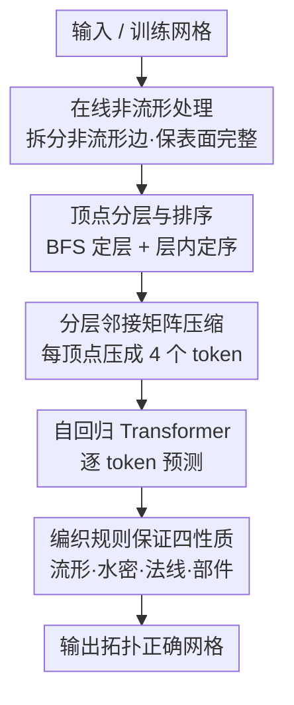

# Topology-Preserved Auto-regressive Mesh Generation in the Manner of Weaving Silk

- **会议**: ICLR 2026
- **arXiv**: [2507.02477](https://arxiv.org/abs/2507.02477)
- **代码**: [项目页面](https://gaochao-s.github.io/pages/MeshSilksong/)
- **领域**: 3D 视觉 / Mesh 生成
- **关键词**: Mesh Generation, Auto-regressive, Topology Preservation, Mesh Tokenization, Manifold, Watertight

## 一句话总结

提出一种类似"织丝"的网格 tokenization 算法，通过顶点分层和排序提供规范的拓扑框架，保证生成网格的流形性、水密性、法线一致性和部件感知性，同时达到 SOTA 压缩效率。

## 研究背景与动机

自回归网格生成是近期3D内容生成的重要方向，但现有方法（MeshAnything v2, EdgeRunner, BPT, DeepMesh）将网格视为简单的三角形集合，缺乏对整体拓扑结构的感知，导致：

**无法保证水密性**：生成存在孔洞，影响 3D 打印、物理模拟等应用

**无法保证部件感知**：缺乏连通分量概念，无法捕捉小但重要的部件（如眼睛）

**法线方向不一致**：面法线翻转导致渲染伪影

**非流形拓扑**：局部补丁方法（BPT, DeepMesh）无法保证流形

**核心贡献**：首个同时保证流形性、水密性检测、法线一致性和部件感知的网格 tokenization 算法。

## 方法详解

### 整体框架

方法把"网格生成"重新表述为"织丝"：先用一套规范的分层规则把无序的三角形面片整理成一层层有序排列的顶点（如同丝线一根根并排织就），再把每个顶点和它在本层、相邻层的连接关系压成紧凑 token 序列交给自回归模型预测。因为编织规则本身约束了边只能落在同层或相邻层之间，流形性、水密性、法线一致性、部件感知这些拓扑性质就被天然地写进了 tokenization，而不是事后修补。训练前还需对原始数据做一次在线非流形处理，把更多真实网格变成可训练样本。

### 关键设计

**1. 顶点分层与排序：给无序网格一个规范的"经纬"框架**

现有方法把网格当成一堆孤立三角形，丢失了整体拓扑，所以才无法保证流形与水密。这里对每个连通分量先按 y-z-x 坐标排序选定起始半边 $j$-$m$，再用 BFS 以到起点 $j$ 的最短图距离作为层索引 $L$，把全部顶点分配到一层层中；同一层内的顶点则沿半边遍历依次定序（其正确性可用类似数学归纳的方式逐层证明）。最终每个顶点被唯一标记为 $\mathcal{V}_i^L$，$L$ 是层索引、$i$ 是层内顺序。这一步等价于给网格铺好经纬线，后续所有连接都只需在"本层"和"相邻层"两个局部范围内描述。

**2. 分层邻接矩阵压缩：把连接关系压成每顶点 4 个 token**

有了分层框架，顶点连接自然分成两类。同层顶点之间的连接（蓝边）用对称 0-1 矩阵 $\mathcal{S}_L$（大小 $M \times M$）表示，采用固定窗口 $W=8$ 的二进制压缩即可覆盖 99.1% 的情况，极端稠密时退回 COO 格式；相邻层之间的连接（红边）用 0-1 矩阵 $\mathcal{B}_L$（大小 $M \times N$）表示，先做 RLE 式压缩把连续的 "1" 编码为 $(x, y)$（起始列索引, 长度），再进一步等价为 "Stars and Bars" 组合问题，使每行只需一个 token。打包后，每个顶点 $\mathcal{V}_i^L$ 只产生 4 个 token：2 个位置 token $V_{(L,i)}$（用 block-offset 表示压缩）、1 个自层拓扑 token $S_{(L,i)}$、1 个层间拓扑 token $B_{(L,i)}$，这正是它能达到 26.65 bits/face、0.22 压缩比的来源。

**3. 编织规则直接兑现四项几何性质**

分层加排序的编织方式让四项拓扑性质几乎免费获得。由于生成时边只可能出现在同层或相邻层、三角形逐层填充，**流形拓扑**被严格保证；孔洞只可能源于自层/层间矩阵里某个 0 被错误预测成连接，因而**水密性**可以被直接检测并修复；规定层 $L$ 的半边方向升序、层 $L-1$ 降序，每个三角面的顶点都按逆时针遍历，从而**法线一致**；再引入特殊 token $C$ 标记连通分量的起始，模型就能感知并生成像眼睛这类小而独立的**部件**。

**4. 在线非流形处理：让更多真实数据可训练**

真实数据里常有被 3 个以上面共享的非流形边，直接丢弃会损失大量训练样本。不同于 Libigl 按度数优先合并的做法，这里额外检测非流形顶点周围的"边图"结构 $\mathcal{G}$，并要求该边图形成纯环，以此保证拆分后表面仍然完整。这一在线处理让非流形数据也能进入训练集——消融显示加入非流形数据后 NC 从 0.688 提升到 0.801。

### 损失函数 / 训练策略

训练用标准交叉熵损失 $\mathcal{L}_{ce} = -\sum_{t=1}^{T-1} S_{t+1} \log \hat{S}_t$ 逐 token 监督。为缓解面数分布的长尾，采样上采用渐进式平衡策略，按 $p_j^{PB}(t) = (1 - t/T) p_j^{IB} + (t/T) p_j^{CB}$ 在训练进程 $t$ 中从实例平衡 $p_j^{IB}$ 逐步过渡到类别平衡 $p_j^{CB}$（每 100 面划为一类）：早期偏实例平衡先学简单样本，后期偏类别平衡再补上复杂网格。消融中该重采样使 CD 由 0.032 降到 0.025、NC 由 0.700 升到 0.792。

## 实验

### 数据集和评估指标

- **训练**：gObjaverse (~280k) + ShapeNetV2 + 3D-FUTURE + Toys4K (~100k)，无手动筛选
- **评估**：500 个 gObjaverse 保留样本
- **指标**：CD (Chamfer Distance), HD (Hausdorff Distance), NC (Normal Consistency), |NC|, Bits-per-face, Compression Ratio

### 主要结果

| 方法 | CD↓ | HD↓ | NC↑ | |NC|↑ | Bits/face↓ | Comp. Ratio↓ |
|------|-----|-----|-----|-------|------------|--------------|
| EdgeRunner* | 0.053 | 0.144 | 0.418 | 0.789 | 29.61 | 0.47 |
| TreeMeshGPT | 0.030 | 0.103 | 0.706 | 0.892 | 42.00 | 0.22 |
| BPT | 0.027 | 0.094 | 0.770 | 0.909 | 28.48 | 0.26 |
| **Ours** | **0.025** | **0.087** | **0.792** | **0.924** | **26.65** | **0.22** |

### 消融实验

| 消融 | CD↓ | HD↓ | NC↑ | |NC|↑ |
|------|-----|-----|-----|-------|
| w/ 重采样 | 0.025 | 0.087 | 0.792 | 0.924 |
| w/o 重采样 | 0.032 | 0.103 | 0.700 | 0.880 |
| 流形+非流形数据 | 0.022 | 0.080 | 0.801 | 0.932 |
| 仅流形数据 | 0.027 | 0.090 | 0.688 | 0.871 |

### 几何性质对比

| 方法 | 无损 | 流形 | 水密 | 法线一致 | 部件感知 |
|------|------|------|------|----------|----------|
| Ours | ✓ | ✓ | ✓ | ✓ | ✓ |
| MeshAnything v2 | ✓ | ✗ | ✗ | ✗ | ✗ |
| EdgeRunner | ✓ | ✓ | ✗ | ✗ | ✗ |
| BPT | ✓ | ✗ | ✗ | ✗ | ✗ |

## 亮点

1. **织丝的优雅类比**：层间编织的思想自然保证了拓扑性质，设计巧妙
2. **唯一同时保证 5 项几何性质**的 tokenization 方法
3. **SOTA 压缩效率**：26.65 Bits/face, 0.22 压缩比
4. **实用性强**：支持 3D 打印、物理模拟、动画绑定等下游应用
5. **在线非流形处理**：有效扩展可训练数据规模

## 局限性

1. 词表大小较高（最多 10,267），但在 bits-per-face 上仍最优
2. 需要预定义最大层顶点数 $m$，限制了极端复杂网格
3. 目前仅支持三角形网格，混合多边形支持是未来方向
4. 模型规模约 500M 参数，训练需 16×H800 约 15 天

## 相关工作

- **VQ-VAE 方法**：MeshGPT (Siddiqui et al., 2024) 用编码器-解码器进行 mesh tokenization
- **直接量化**：MeshXL, BPT 直接量化三角形顶点坐标
- **树遍历**：EdgeRunner, TreeMeshGPT 通过树结构保证流形但压缩效率低
- **强化学习**：DeepMesh 通过人类反馈微调提升美观度

## 评分

- **创新性**: ⭐⭐⭐⭐⭐ — 层间编织的思想原创且优雅
- **实用性**: ⭐⭐⭐⭐⭐ — 几何性质保证直接服务于工业应用
- **清晰度**: ⭐⭐⭐⭐ — 算法描述清晰，图示直观
- **意义**: ⭐⭐⭐⭐⭐ — 解决了自回归网格生成中的关键拓扑问题

<!-- RELATED:START -->

## 相关论文

- [\[ICCV 2025\] MeshPad: Interactive Sketch-Conditioned Artist-Reminiscent Mesh Generation and Editing](../../ICCV2025/3d_vision/meshpad_interactive_sketch-conditioned_artist-reminiscent_mesh_generation_and_ed.md)
- [\[ICLR 2026\] UFO-4D: Unposed Feedforward 4D Reconstruction from Two Images](ufo-4d_unposed_feedforward_4d_reconstruction_from_two_images.md)
- [\[ICLR 2026\] Reducing Class-Wise Performance Disparity via Margin Regularization](reducing_class-wise_performance_disparity_via_margin_regularization.md)
- [\[ICLR 2026\] Universal Beta Splatting](universal_beta_splatting.md)
- [\[ICCV 2025\] Repurposing 2D Diffusion Models with Gaussian Atlas for 3D Generation](../../ICCV2025/3d_vision/repurposing_2d_diffusion_models_with_gaussian_atlas_for_3d_generation.md)

<!-- RELATED:END -->
