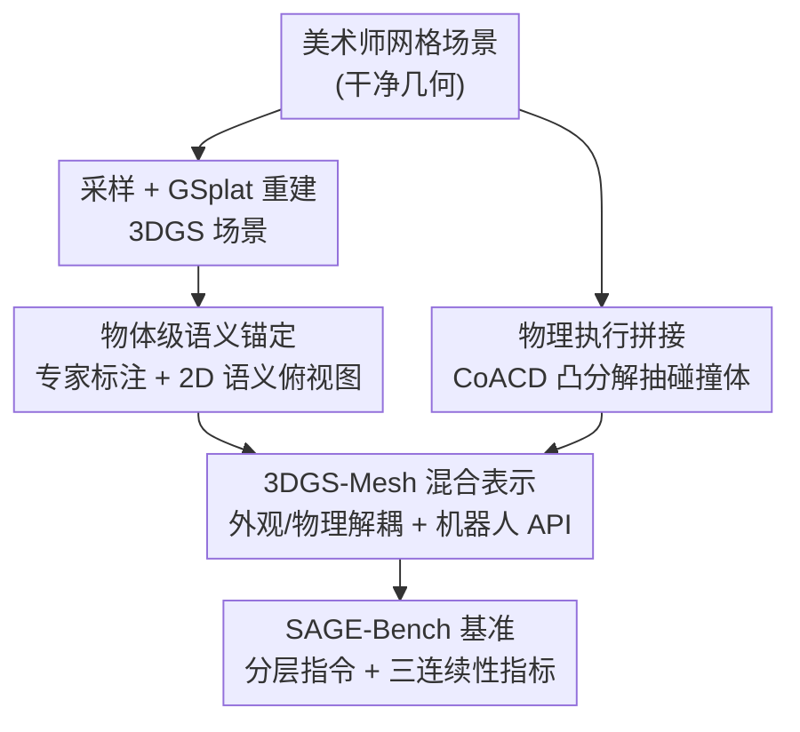

# Towards Physically Executable 3D Gaussian for Embodied Navigation

**会议**: ICLR 2026  
**OpenReview**: [https://openreview.net/forum?id=HB6KvsqcAn](https://openreview.net/forum?id=HB6KvsqcAn)  
**代码**: https://sage-3d.github.io  
**领域**: 3D视觉 / 具身导航 / 视觉语言导航(VLN)  
**关键词**: 3D高斯泼溅, 视觉语言导航, 物理仿真, 语义标注, 具身智能

## 一句话总结
本文提出 SAGE-3D 范式，给原本只能用来"渲染好看"的 3DGS 场景补上了**物体级语义**和**物理碰撞结构**，把它升级成可训练、可评测具身智能体的导航环境，并配套发布了 1k 标注场景的 InteriorGS 数据集与首个基于 3DGS 的 VLN 基准 SAGE-Bench（2M 轨迹-指令对）。

## 研究背景与动机
**领域现状**：视觉语言导航（VLN）需要在仿真环境里训练智能体跟随自然语言指令走动，因为真实世界训练既贵又危险。场景表示从早期的扫描网格（Matterport3D、HM3D）一路演化到最近的 3D 高斯泼溅（3DGS）——3DGS 渲染逼真、实时，被视为缩小 sim-to-real gap 的利器。

**现有痛点**：相比扫描网格，3DGS 有两个天然优势——它用离散高斯表示场景，物体可以直接被标注（网格是一整片连续表面，物体粘成一团很难分离）；而且它优化的是连续辐射场，任意视角都一致逼真（网格纹理在新视角下会出现接缝、拉伸、模糊）。但当前 3DGS **只被用来做高保真渲染**，根本没法直接拿来跑 VLN，因为它有两个硬伤：(1) 缺细粒度语义——现有 3DGS 场景只有颜色和密度，没有实例 ID 或物体属性，无法 ground 像"走到白色书架旁那把红椅子"这种指令；(2) 缺物理可执行结构——高斯泼溅本质是体渲染，很难从中抽出平滑表面和可靠的碰撞几何，智能体会直接"穿模"。

**核心矛盾**：3DGS 的逼真外观与"可执行的环境基座"之间存在断层——它有视觉，却没有语义和物理。想直接从高斯里反推表面/碰撞体既困难又易错，把语义和外观对齐也不简单。

**本文目标**：在**保留 3DGS 逼真渲染**的前提下，给它注入物体级语义 + 物理可执行性，让它成为能训练、能评测具身智能体的环境基座。

**切入角度**：作者发现 3DGS 场景其实是从美术师制作的网格场景采样重建出来的——既然源头有干净的网格，就可以**把外观和物理解耦**：用 3DGS 负责好看的外观，用源网格抽出的碰撞体负责物理，两者拼成一个混合表示。

**核心 idea**：用"3DGS（外观）+ Mesh 碰撞体（物理）+ 人工物体级标注（语义）"的混合范式，把纯感知的 3DGS 场景升级为可执行的 POMDP 导航环境。

## 方法详解

### 整体框架
SAGE-3D（Semantically and Physically Aligned Gaussian Environments）的核心是一个形式化升级：把一个 3DGS 的高斯原语集合 $G=\{g_i\}_{i=1}^{N}$，叠加语义层 $M$ 和物理层 $\Phi$，转化为可执行环境 $E_{exec}$：

$$G + M + \Phi \longrightarrow E_{exec}$$

最终环境被建模成一个语义+物理增强的 POMDP：$E = (U, S, A, O, T, Z; M, \Phi)$，其中 $U$ 是指令空间、$S$ 是连续状态空间、$A$ 是动作空间、$O$ 是多模态观测空间，$T, Z$ 分别是物理驱动的状态转移和渲染函数。

整条流水线从美术师设计的网格场景出发：先采样重建出 3DGS 场景（语义层 $M$ 由专家做物体级标注、再投影成 2D 语义俯视图）；再从源网格抽碰撞体作为物理层 $\Phi$，与 3DGS 拼成混合表示并接入机器人 API；最后基于这套环境生成 2M 条 VLN 数据，构成 SAGE-Bench 基准，并用三个连续性指标评测模型。

### 关键设计

**1. SAGE-3D 范式：把"只能看"的 3DGS 形式化成"能跑"的 POMDP**

痛点是 3DGS 长期只是个渲染器，缺一个统一的框架把它接入具身学习。本文先把它形式化为 $G + M + \Phi \to E_{exec}$ 这一升级过程，并落到 POMDP $E=(U,S,A,O,T,Z;M,\Phi)$ 上——关键在于 $T$ 和 $Z$ 是"物理驱动"的：状态转移由真实碰撞动力学决定、观测由 3DGS 渲染生成，智能体在**连续度量空间**里移动（不是全景节点间的瞬移）。这一形式化把"加语义、加物理"明确成两个正交的层 $M$ 和 $\Phi$，后面两个组件正好各补一层，从而既保住 3DGS 的逼真渲染，又让它具备语义可指代性和物理可执行性。

**2. 物体级语义锚定：给高斯补上实例 ID 和可指代的 2D 语义地图**

这一步针对"3DGS 没有实例语义、无法 ground 细粒度指令"的痛点。作者放弃从高斯反推语义，转而**从干净的美术师网格采样重建 3DGS**——平均每个场景渲染约 3000 个相机视角，用开源 GSplat 估计高斯参数，再对采样出的场景做**人工双重校验标注**，给每个物体打上类别、实例 ID、bounding box。这样得到 InteriorGS：1000 个场景（752 个住宅室内 + 248 个公共场景，覆盖音乐厅、健身房、游乐园、泳池等），含 554k 物体实例、755 个类别。

由于扫描网格那套 NavMesh 流程（靠遍历场景生成）在 3DGS 上不可行，作者额外设计了 **2D 语义俯视图**：把标注好的 3D 物体投影到地面，门按状态（开/关/半开）打标、墙标为不可通行。考虑到标注存的是轴对齐 3D 框、footprint 不准，他们对每个物体采表面点、投影、取 2D 凸包来精修轮廓：
$$M_k = \text{Fuse}\left(\text{Hull}\{\Pi_{top}(p) \mid p \in \text{Surf}(o_k)\}\right)$$
其中 $\text{Surf}(o_k)$ 是物体 $o_k$ 的采样表面点，$\Pi_{top}$ 是地面投影，$\text{Hull}(\cdot)$ 是 2D 凸包算子，$\text{Fuse}(\cdot)$ 把多视角 mask 融成一致 footprint。这张语义地图直接支撑了后面的指令生成和 A* 路径规划。

**3. 物理执行拼接：外观与物理解耦的 3DGS-Mesh 混合表示**

即便有了语义，3DGS 仍会"穿模"，无法直接当 VLN 环境。作者的做法是把外观和物理彻底解耦：拿每个物体的美术师三角网格，用 **CoACD 做凸分解**得到逐物体碰撞体，然后在 USDA 场景里把碰撞体写成**不可见的刚体**（负责接触和动力学），3DGS 文件保持可见（负责逼真外观）。每个物体被实例化为一个 USD prim，并配上刚体/接触参数 $\Phi_k$——静态场景物体默认静态刚体，少量精选物体配成可移动/可铰接以支持交互。这样运行时**无需对美术网格做光线追踪**，既保住 3DGS 的高保真渲染，又拿到精确碰撞几何。

Isaac Sim 5.0 起支持从 3DGUT 导出的 USDZ 渲染 3DGS（但导入的 3DGS 只有外观、不带物理），正好被这套混合表示补齐。仿真器对外暴露丰富机器人 API：支持足式/轮式地面平台（Unitree G1/Go2/H1）和空中无人机，动作接口兼顾离散命令（转/前进/停）和连续控制（地面机器人的速度命令 $(v,\omega)$、无人机的 6-DoF 速度/姿态），并同步提供 RGB、深度、语义分割、位姿、接触事件，内置碰撞检测与卡死/穿模监控恢复。离线生成的碰撞体被缓存以加速加载、保证可复现评测。

**4. SAGE-Bench 与三个连续性指标：从"端点成败"转向"全程运动质量"**

有了可执行环境，作者构建了首个基于 3DGS 的 VLN 基准 SAGE-Bench（2M 轨迹-指令对）。指令是**分层**的：高层指令强调任务语义和人类意图，分 5 类——Add Object（引入因果物体让轨迹有意义）、Scenario Driven（嵌入情境动机，如"我渴了，从冰箱拿瓶饮料"）、Relative Relationship（用空间关系区分相似目标）、Attribute-based（用颜色/状态等属性唯一锁定目标）、Area-based（指向功能区而非具体物体）；低层指令则是模板化的起止 waypoint 基础动作。高层指令由 MLLM 基于 2D 语义图里的类别、属性、空间关系生成；轨迹用 1.2m 高占据图 + 2D 语义图跑 A* 最短路生成。评测采用三轴框架（任务类型 × 指令层级 × episode 复杂度）。

更关键的是三个**自然连续性指标**，弥补传统指标只看端点、看不见全程运动质量的缺陷：
- **连续成功率 CSR**：传统 SR 只在终点做 0/1 判断，CSR 衡量智能体停留在参考路径容差走廊 $C$ 内（且满足任务条件）的时间比例，$\text{CSR}=\frac{1}{T}\sum_{t=1}^{T}s(t)$，反映"全程目标一致"的行为。
- **积分碰撞惩罚 ICP**：传统碰撞率 CR 不区分偶尔触碰和持续摩擦，ICP 对碰撞强度序列 $c(t)\in[0,1]$ 时间积分，$\text{ICP}=\frac{1}{T}\sum_{t=1}^{T}c(t)$，同时刻画碰撞频率和持续时间。
- **路径平滑度 PS**：由连续航向变化幅度算归一化平滑分，$\text{PS}=1-\frac{1}{T-1}\sum_{t=2}^{T}\min\left(\frac{|\Delta\theta_t|}{\pi},1\right)$，其中 $\Delta\theta_t=\theta_t-\theta_{t-1}$，值越高越平滑，越利于真机可行性。

## 实验关键数据

### 主实验
在 SAGE-Bench 上评测了闭源/开源 MLLM 和专用 VLN 模型。结果显示这个新基准对现有模型相当有挑战——除了 SOTA 的 NaVILA，其他模型 SR 都不超过 0.15。用 SAGE 数据微调后提升显著：

| 模型 | SR↑ | OSR↑ | SPL↑ | CSR↑ | ICP↓ | PS↑ |
|------|------|------|------|------|------|------|
| NaVid-base | 0.10 | 0.13 | 0.10 | 0.15 | 0.28 | 0.84 |
| NaVid-SAGE (本文) | 0.36 | 0.46 | 0.32 | 0.48 | 0.66 | 0.54 |
| NaVILA-base | 0.21 | 0.26 | 0.22 | 0.33 | 0.72 | 0.41 |
| NaVILA-SAGE (本文) | **0.46** | **0.55** | **0.48** | **0.57** | 0.54 | 0.74 |
| NaVILA (原版) | 0.39 | 0.47 | 0.34 | 0.48 | 0.61 | 0.68 |

NaVILA-SAGE 在所有任务完成度指标上都做到最佳，SR 从 base 的 0.21 提到 0.46。注意有些弱模型（SR<0.20）表现像"随机或单一动作预测"，它们的 CR/ICP/PS 不具可比性。

跨域泛化（仅用 SAGE-Bench 训练、不碰 VLN-CE 数据，测 VLN-CE R2R Val-Unseen）：

| 模型 | SR↑ | OSR↑ | SPL↑ |
|------|------|------|------|
| NaVILA-base | 0.29 | 0.38 | 0.27 |
| NaVILA-SAGE (本文) | 0.38 | 0.51 | 0.36 |
| NaVid-base | 0.22 | 0.32 | 0.17 |
| NaVid-SAGE (本文) | 0.31 | 0.42 | 0.29 |

NaVILA-SAGE 在 R2R Val-Unseen 上 SR 相对提升 **31%**（0.29→0.38）、OSR 相对提升 34%（0.38→0.51），印证 3DGS 数据因贴近真实世界而具强泛化性。

### 消融实验
渲染速度与收敛对比（NaVILA-base，H20 GPU，10k 训练 / 1k 验证）：

| 环境类型 | 渲染时间/帧(ms)↓ | 显存(MB)↓ | 到 SR=40% 迭代数(k)↓ | 耗时(h)↓ |
|----------|------------------|-----------|----------------------|----------|
| 扫描网格 (MP3D/HM3D) | 16.7 | 850 | 120 | 4.8 |
| 3DGS-Mesh 混合 (本文) | **6.2** | **220** | 160 | 6.2 |

数据规模影响（场景数 × 样本数）：800 场景 / 240k 样本时 SR 达 0.42；缩到 100 场景 / 60k 样本掉到 0.23，接近未微调的 NaVILA-base（0.21）。说明场景多样性和样本量都重要。

### 关键发现
- **3DGS 渲染更快但更难收敛**：3DGS 每帧 6.2ms、显存 220MB，远优于网格的 16.7ms/850MB；但达到同样 40% SR 需 160 次迭代（6.2h）vs 网格 120 次（4.8h）——因为 3DGS 数据更丰富逼真、更接近真实世界复杂度，所以训练更难。
- **传统指标会漏掉运动质量问题**：NaVILA 任务完成度尚可（0.39 SR）但 ICP 高达 0.61（持续碰撞）、PS 仅 0.68（转弯机械）。可视化 Case 1 里模型长时间贴墙走，传统 CR 只算 1，而 ICP 达 0.87——证明新指标能揭露传统指标看不见的"贴墙摩擦"。
- **高层指令远难于低层指令**：NaVILA 在低层指令上 SR 0.56，到高层（更自然的语义）只剩 0.39，凸显语义理解才是 VLN 的真正瓶颈。

## 亮点与洞察
- **"外观/物理解耦"是化解 3DGS 物理化难题的巧招**：与其费力从高斯反推平滑表面和碰撞体（SuGaR 等都很吃力），不如回到 3DGS 的源头网格抽碰撞体、让 3DGS 专心做渲染——两者在 USD 里拼成混合表示，运行时不用对网格做光追，既快又准。
- **三个连续性指标戳中 VLN 评测痛点**：现有 VLN 几乎都只看端点 SR/SPL，CSR/ICP/PS 把评测从"到没到"扩展到"走得稳不稳、撞不撞"，这套思路可直接迁移到任何连续控制/真机部署的导航评测。
- **数据本身就是泛化引擎**：仅靠 SAGE-Bench 训练就能在 VLN-CE 上涨 31%，说明逼真+多样的 3DGS 数据带来的真实世界对齐，比在目标域内调参更有价值。

## 局限与展望
- **依赖美术师制作的干净网格**：整套范式的物理层和语义采样都建立在"有干净网格源"之上，对真实扫描场景（只有点云/噪声深度）不直接适用，规模化采集成本不低。
- **3DGS 收敛更慢**：作者承认 3DGS 数据训练更难收敛（同等 SR 多花约 30% 时间），对算力预算有限的研究者是负担。
- **物理交互仍偏静态**：绝大多数物体配成静态刚体，仅少量精选物体可移动/铰接，离"丰富可操作环境"还有距离；指标里 ICP/PS 在低性能模型上不可比，评测覆盖面受限于模型能力。
- 改进方向：探索从真实扫描直接生成混合表示、扩大可交互物体比例、研究加速 3DGS-VLN 训练收敛的方法。

## 相关工作与启发
- **vs 扫描网格基准（VLN-CE / OctoNav-Bench 等）**：它们用 RGB-D 扫描重建的网格，几何是"估计"且物体粘连、新视角纹理崩坏；本文用 3DGS-Mesh 混合表示，几何是 ground truth、外观任意视角一致逼真，且首次提供带因果依赖的指令。
- **vs SuGaR 等"从高斯抽表面"的工作**：它们试图直接从高斯推断表面/碰撞，平滑表面难求；本文绕开这条路，从源网格抽碰撞体再与高斯拼接，规避了表面重建的不可靠性。
- **vs NaVILA / NaVid 等 VLN 模型**：本文不是提新模型，而是提供数据和环境基座——这些模型在 SAGE-SAGE 数据上微调后都能显著涨点并跨域泛化，说明瓶颈在数据与环境而非纯模型架构。

## 评分
- 新颖性: ⭐⭐⭐⭐⭐ 首次把 3DGS 系统升级为语义+物理可执行的 VLN 环境，并配套首个 3DGS VLN 基准，范式级贡献。
- 实验充分度: ⭐⭐⭐⭐ 覆盖 10+ 模型、跨域泛化、数据规模、渲染收敛多维消融，但可交互物体和真机验证偏少。
- 写作质量: ⭐⭐⭐⭐ 形式化清晰、图文对照到位，指标定义完整。
- 价值: ⭐⭐⭐⭐⭐ InteriorGS（1k 场景/554k 物体）+ SAGE-Bench（2M 数据）+ 三连续性指标，对具身导航社区是高复用的基础设施。

<!-- RELATED:START -->

## 相关论文

- [\[CVPR 2026\] Multi-Scale Gaussian-Language Map for Zero-shot Embodied Navigation and Reasoning](../../CVPR2026/3d_vision/multi-scale_gaussian-language_map_for_zero-shot_embodied_navigation_and_reasonin.md)
- [\[CVPR 2025\] RoomTour3D: Geometry-Aware Video-Instruction Tuning for Embodied Navigation](../../CVPR2025/3d_vision/roomtour3d_geometry-aware_video-instruction_tuning_for_embodied_navigation.md)
- [\[CVPR 2026\] MSGNav: Unleashing the Power of Multi-modal 3D Scene Graph for Zero-Shot Embodied Navigation](../../CVPR2026/3d_vision/msgnav_unleashing_the_power_of_multi-modal_3d_scene_graph_for_zero-shot_embodied.md)
- [\[ICLR 2026\] OpenFly: A Comprehensive Platform for Aerial Vision-Language Navigation](openfly_a_comprehensive_platform_for_aerial_vision-language_navigation.md)
- [\[AAAI 2026\] VPN: Visual Prompt Navigation](../../AAAI2026/3d_vision/vpn_visual_prompt_navigation.md)

<!-- RELATED:END -->
