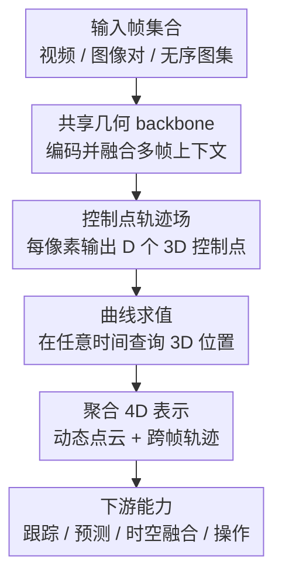

# Trace Anything: Representing Any Video in 4D via Trajectory Fields

**会议**: ICLR2026  
**OpenReview**: [https://openreview.net/forum?id=BqaChqppVh](https://openreview.net/forum?id=BqaChqppVh)  
**代码**: 将发布（论文称会释放代码与模型权重）  
**领域**: 3D视觉  
**关键词**: 4D视频表示、轨迹场、动态场景重建、3D点跟踪、前馈几何模型

## 一句话总结
Trace Anything 把视频里的每个像素表示成一条连续 3D 轨迹，并用一次前馈推理直接预测整段视频的轨迹场，从而在无需深度、光流、2D跟踪器或逐场景优化的情况下完成高效的 4D 动态场景表示。

## 研究背景与动机
**领域现状**：动态场景理解通常需要同时知道空间结构和时间演化。
传统 3D 重建、SLAM、动态 NeRF、动态 3D Gaussian Splatting，以及近年的 DUSt3R / VGGT / Fast3R 一类前馈几何模型，已经能从图像或视频中恢复相机、点云或几何结构。
但在动态视频里，很多方法仍然先得到每帧的点云、深度或局部几何，再借助光流、2D point tracking、额外跟踪器或后处理优化去建立跨帧对应。

**现有痛点**：这种“先重建、再对齐、再跟踪”的范式很容易把错误一层层传下去。
如果深度估计有偏、光流在遮挡处断掉，或者每帧点云没有被放到一致坐标系里，最后得到的 4D 表示就会在时间上漂移。
更麻烦的是，许多强方法依赖 per-scene optimization 或 pairwise inference，面对长视频、多帧输入、无序图片集合时成本很高，也不够像一个可直接部署的通用视频几何模型。

**核心矛盾**：视频的最小观测单位是像素，而现有 4D 表示常常把像素先压成某一帧的 3D 点，再在后续步骤里补对应关系。
本文认为这个顺序反了：如果一个像素本来就在真实世界里随时间走出一条轨迹，那么更自然的基本单元就不是“某帧的点”，而是“由这个像素触发的一条连续 3D 曲线”。

**本文目标**：作者希望建立一种足够原子的 4D 视频表示，使每个帧、每个像素都能查询到它在整段时间中的 3D 位置。
这个表示还要满足两个关键性质：静态区域的轨迹应该退化成几乎不动的点；不同帧中属于同一物体点的对应像素，应该落到同一条或一致的 3D 轨迹上。
同时，模型需要一次前馈完成预测，不依赖外部估计器，也不需要为每个测试视频单独优化。

**切入角度**：Trace Anything 的观察是，轨迹可以用少量控制点参数化。
如果网络不是逐时间步输出离散点云，而是为每个像素输出一组 3D 控制点，那么通过 B-spline 这样的曲线基函数，就能在任意时间 $t \in [0,1]$ 查询该像素对应的 3D 位置。
这让“视频表示”从一堆离散帧变成一个可连续查询的 4D 轨迹场。

**核心 idea**：用每像素 3D 参数曲线组成的 Trajectory Field 取代逐帧点云加跨帧匹配，并训练一个前馈网络 Trace Anything 直接从输入帧预测这些曲线的控制点。

## 方法详解

### 整体框架
Trace Anything 的输入是一组 RGB 帧，可以是顺序视频、图像对，也可以是捕捉同一动态场景的无序图片集合。
模型先用几何 backbone 把每帧编码成 token，再通过融合 Transformer 在帧内和帧间聚合上下文，最后由控制点头为每个像素输出一组 3D 控制点。
这些控制点定义连续轨迹；把轨迹在不同时间戳上求值，就能得到动态点云、跨帧 3D 对应关系，以及下游可用的 4D 表示。

从数学上看，Trajectory Field 是一个从离散像素域到连续 3D 曲线空间的映射：
$$
T:[N]\times[H]\times[W]\rightarrow C([0,1],\mathbb{R}^3),\quad (i,u,v)\mapsto x_{i,u,v}(\cdot).
$$
这里 $i$ 是帧索引，$(u,v)$ 是像素坐标，$x_{i,u,v}(t)$ 表示“第 $i$ 帧这个像素对应的世界点在时间 $t$ 的 3D 位置”。
论文实现中，每条轨迹由 $D$ 个控制点 $P^{(k)}_{i,u,v}\in\mathbb{R}^3$ 表示，并用三次 B-spline 基函数组合：
$$
x_{i,u,v}(t)=\sum_{k=0}^{D-1}P^{(k)}_{i,u,v}\phi_k(t).
$$
因此网络真正预测的不是一帧一帧的点，而是每个像素的一条可连续查询的 3D 曲线。

### 关键设计
**1. 轨迹场表示：把动态场景的基本单元从“点云帧”改成“像素触发的 3D 曲线”**

传统动态 3D 方法常把每个时刻的场景先恢复成点云，再用光流、2D tracking 或优化去回答“这些点在别的帧去哪了”。
Trace Anything 直接把这个问题编码进表示本身：每个输入帧的每个像素都对应一条完整时间范围内的 3D 轨迹。
当要知道第 $i$ 帧像素 $(u,v)$ 在第 $j$ 帧时间的 3D 位置时，只需把轨迹在 $t_j$ 上求值：$X_{i\rightarrow j}(u,v)=x_{i,u,v}(t_j)$。

这个设计的好处是，跨帧对应不再是后处理产物，而是轨迹场的自然查询结果。
静态背景的理想轨迹会退化成几乎重合的控制点；动态物体上同一个真实点从不同帧出发预测出的控制点序列应该一致。
论文把这两个性质分别称为 C1 和 C2，并在训练目标里专门约束它们。

**2. 控制点轨迹场：用少量控制点压缩连续 4D 运动**

如果网络直接输出每个像素在所有时间步的 3D 坐标，输出量会随帧数线性膨胀，而且难以支持任意时间查询。
本文选择为每个像素输出 $D$ 个 3D 控制点，再用三次 B-spline 得到连续轨迹。
控制点图 $P_i\in\mathbb{R}^{D\times H\times W\times 3}$ 与普通深度图或点云图类似，仍是 dense map，因此适合由卷积头或 Transformer 特征头预测；但它表达的是一整条曲线，而不只是当前帧的点。

这种参数化也让运动模型更平滑。
对于长程运动、遮挡、非刚体变形，模型不必在每个离散帧上独立猜位置，而是学习一条由控制点约束的连续路径。
在端点处，clamped B-spline 让 $x_{i,u,v}(0)$ 和 $x_{i,u,v}(1)$ 与首尾控制点对应，便于解释轨迹边界；在中间时刻，曲线基函数提供可微的插值和速度估计。

**3. 一次前馈的共享世界坐标预测：绕开外部估计器和逐场景优化**

Trace Anything 的网络由图像编码器、融合 Transformer 和控制点头组成。
每帧先经过共享 image encoder，再由 interleaved frame-wise / global attention 融合多帧信息；如果输入是顺序视频，模型会加入时间索引嵌入；如果输入是无序图片集合，架构仍然可以处理，只是时间信息需要由辅助 timestamp head 或元数据提供。
控制点头输出共享世界坐标系下的控制点，也可附带局部相机坐标系的辅助控制点头。

这个结构延续了 VGGT、Fast3R 等前馈几何模型的优点：所有帧一起进入网络，模型在一次推理中建立全局一致的几何关系。
与 CoTracker + VGGT、MonST3R、POMATO 或 St4RTrack 这类需要额外跟踪、pairwise 推理或全局对齐的组合相比，Trace Anything 把“估计 3D 几何”和“建立动态对应”合成一个端到端任务，运行时间也因此大幅下降。

**4. 合成数据平台与一致性正则：让轨迹场有可监督的稠密真值**

轨迹场需要每个像素在每个时间的 3D 位置真值，这在真实视频里非常难获得。
论文因此搭建了 Blender 合成平台，生成 10K+ 个训练视频，每个视频约 120 帧，包含室内外环境、人物和可动物体、相机运动，并提供 RGB、2D/3D 轨迹、深度、相机位姿、语义 mask 等密集标注。
这不是普通的渲染数据集，而是为“all-to-all 轨迹场估计”专门准备的数据源。

训练时，核心监督是让从帧 $i$ 的像素出发预测的轨迹，在帧 $j$ 的时间戳处落到对应 3D 真值上。
同时，静态区域控制点方差、刚体区域内部距离方差、跨帧对应控制点差异都会被惩罚。
这些正则项把表示定义中的 C1/C2 变成可优化目标，使网络不仅追求单点误差低，还要学会“静态该不动、对应该一致、刚体内部结构该保持”。

### 一个完整示例
假设输入是一段 30 帧视频：相机绕着桌面移动，一只手把杯子从左侧推到右侧，背景墙和桌面基本静止。
传统流程可能先估每帧深度，再跟踪杯子边缘上的若干点，最后把这些点提升到 3D；只要杯子被手短暂遮挡，2D 轨迹就可能断裂。

Trace Anything 的处理方式不同。
模型对所有帧一次前馈后，会给第 8 帧杯子边缘的某个像素输出 $D$ 个 3D 控制点。
读者可以在 $t=0.0,0.3,0.6,1.0$ 查询这条曲线，得到这个杯子表面点在整段视频中的 3D 位置；也可以对第 15 帧中同一个物理点对应的像素做同样查询，两条控制点序列应该非常接近。
对于背景墙上的像素，所有控制点会收缩到近似同一个 3D 位置，曲线几乎是一条“零速度”轨迹。

这个例子也解释了为什么本文的 benchmark 不只评 first-to-all point tracking。
如果只从第一帧抽点，模型可能只学会从开头往后跟。
Trace Anything 的目标是 all-to-all：任意帧的任意像素都应该能发起一条覆盖全时间段的轨迹，因此它更接近完整 4D 表示，而不是单向跟踪器。

### 损失函数 / 训练策略
训练的主损失是轨迹重投到目标时间的 3D 误差。
对第 $i$ 帧像素 $(u,v)$，模型预测其在第 $j$ 帧时间的 3D 位置 $X_{i\rightarrow j}(u,v)$，与真值 $X^{gt}_{i\rightarrow j}(u,v)$ 做平方误差：
$$
\ell_{i\rightarrow j}(u,v)=\|X_{i\rightarrow j}(u,v)-X^{gt}_{i\rightarrow j}(u,v)\|_2^2.
$$

为了处理遮挡、反光、动态边界等不确定区域，控制点头还预测每个控制点的置信度 $\hat{\Sigma}^{(k)}_{i,u,v}$。
这些置信度同样通过曲线基函数聚合到目标时间：
$$
\hat{\Sigma}_{i\rightarrow j}(u,v)=\sum_{k=0}^{D-1}\hat{\Sigma}^{(k)}_{i,u,v}\phi_k(t_j).
$$
最终的 confidence-adjusted loss 形如 $\hat{\Sigma}\ell + \alpha\log\hat{\Sigma}$，既允许模型降低不可靠点的权重，又用对数项防止它把所有点都说成低置信度。

此外，论文加入四类辅助约束。
时间戳监督用 $L_1$ 损失训练 timestamp head。
静态正则 $L_{static}$ 最小化静态像素控制点的方差。
刚体正则 $L_{rigid}$ 约束同一刚体区域内像素对的控制点距离在时间上保持稳定。
对应正则 $L_{corr}$ 直接拉近已知跨帧匹配像素的控制点序列。
总体目标为：
$$
L=L_{traj-conf}+\lambda_{time}L_{time}+\lambda_{static}L_{static}+\lambda_{rigid}L_{rigid}+\lambda_{corr}L_{corr}.
$$

## 实验关键数据

### 主实验
论文在自建 Trace Anything benchmark 上做了两类定量评测。
视频输入设置处理 30 帧 clip，要求 all-to-all 预测；图像对设置从相隔 5 帧的两张图估计隐含运动。
指标包括 3D endpoint error、静态退化偏差 SDD、对应一致性 CA，以及视频设置中的 APD3D / AJ。

| 设置 | 方法 | EPEmix↓ | EPEdyn↓ | CA↓ | SDD↓ | Runtime↓ |
|------|------|---------|---------|-----|------|----------|
| 30帧视频 | POMATO* | 0.270 | 0.303 | 5.71 | 1.29 | 80.8s |
| 30帧视频 | St4RTrack* | 0.264 | 0.355 | 6.13 | 1.60 | 21.7s |
| 30帧视频 | Easi3R | 0.308 | 0.324 | 5.15 | 1.55 | 130.9s |
| 30帧视频 | Trace Anything | **0.234** | **0.295** | **5.09** | **1.06** | **2.3s** |
| 图像对 | POMATO* | 0.175 | 0.313 | 17.72 | 0.66 | 4.20s |
| 图像对 | St4RTrack* | 0.203 | 0.318 | 13.49 | 0.64 | 1.41s |
| 图像对 | RAFT-3D | 0.281 | 0.324 | 17.50 | 0.98 | 0.37s |
| 图像对 | Trace Anything | **0.135** | **0.304** | **12.41** | **0.54** | **0.20s** |

视频设置里，Trace Anything 的 EPEmix 从 POMATO* 的 0.270 降到 0.234，动态区域 EPE 从 0.303 降到 0.295，同时运行时间从几十秒量级降到 2.3 秒。
图像对设置里，它也在总体误差、静态误差、动态误差、CA、SDD 上均为最佳，并且比多数 3D 重建或优化型 baseline 更快。
这说明本文的优势不只是“快”，而是速度提升没有以牺牲几何一致性为代价。

### 消融实验
| 配置 | EPEmix↓ | EPEsta↓ | EPEdyn↓ | CA↓ | SDD↓ | 说明 |
|------|---------|---------|---------|-----|------|------|
| w/o $L_{static}$ | 0.305 | 0.273 | 0.334 | 8.52 | 1.65 | 静态区域明显漂移，整体误差最大 |
| w/o $L_{rigid}$ | 0.247 | 0.236 | 0.321 | 6.22 | 1.13 | 刚体内部结构保持变弱 |
| w/o $L_{corr}$ | 0.241 | 0.220 | 0.303 | 6.17 | 1.10 | 跨帧对应一致性下降 |
| Full loss | **0.234** | **0.218** | **0.295** | **5.09** | **1.06** | 三类结构正则共同带来最佳结果 |

### 关键发现
- 静态正则是消融里影响最大的项；去掉 $L_{static}$ 后 EPEmix 从 0.234 上升到 0.305，SDD 从 1.06 上升到 1.65，说明静态区域“轨迹退化成点”不是网络自动学好的，需要显式约束。
- 对应正则和刚体正则的收益更偏向几何一致性；它们的退化幅度小于静态正则，但 CA 和动态区域误差都会变差，说明轨迹场不是只靠逐点监督就能自然对齐。
- 运行时间是本文很强的卖点。表 1 中很多 baseline 需要 20 到 200 秒，Trace Anything 是 2.3 秒；图像对设置中也达到 0.20 秒，符合一次前馈表示的预期。
- 定性实验展示了 DAVIS 动态视频、BridgeData V2 机器人图像对、运动外推和时空融合，说明轨迹场既能当 tracking 输出，也能作为更通用的 4D 几何中间表示。

## 亮点与洞察
- 最核心的亮点是把 4D 视频表示的“原子”选成每像素 3D 轨迹，而不是每帧点云。
  这个选择让跨帧对应、动态点云、速度估计和时空融合都变成同一个表示的不同查询方式。
- 控制点图是一个很聪明的接口。
  它像深度图一样 dense、局部、适合网络输出，但每个像素携带的是完整时间曲线，因此能用较小参数量表达连续 4D 运动。
- 本文没有把“动态 3D”做成一堆外部工具的级联。
  深度、光流、2D tracking、global alignment 都被统一进前馈轨迹场预测，这减少了错误传播，也让推理速度变得非常突出。
- 自建数据平台是方法成立的重要条件。
  如果没有稠密 3D 轨迹真值，Trajectory Field 很难端到端监督；这也提醒后续工作，通用 4D 世界模型可能同样需要专门的数据生成与评测协议。
- all-to-all benchmark 的定义很有价值。
  它比 first-to-all point tracking 更严格，因为任意源帧像素都要能发起完整轨迹，更能检验模型是否真的学到了全局动态场。

## 局限与展望
- 训练主要依赖合成数据平台，虽然场景和运动很多样，但真实世界中的反光、透明物、极端形变、复杂接触和长时间遮挡仍可能存在 domain gap。
- 轨迹由固定数量控制点表示，适合平滑运动，但对突发碰撞、拓扑变化、快速非连续运动可能不够灵活；增加自适应控制点或分段曲线可能是后续方向。
- 方法输出的是几何中心的轨迹场，不直接解决照片级渲染问题。
  若要做动态 novel view synthesis，还需要与动态 3DGS、NeRF 或其他 appearance representation 结合。
- 论文展示了 goal-conditioned manipulation、运动外推和时空融合，但这些更像能力展示而不是完整下游系统评测。
  后续可以在机器人控制成功率、长程预测误差、动态重建渲染质量上做更完整验证。
- 计算量虽然远低于优化型方法，但对高分辨率、长视频、密集 all-to-all 查询仍可能有显存压力。
  更轻量的 token 压缩、分块推理或流式轨迹场更新会很有实际意义。

## 相关工作与启发
- **vs DUSt3R / VGGT / Fast3R**: 这些方法推动了前馈几何重建，但主要面向静态或近静态几何，输出更偏点图、相机和空间结构。
  Trace Anything 借鉴其一次性多帧几何推理能力，却把输出扩展成连续 3D 轨迹，从而更适合动态场景。
- **vs MonST3R / POMATO / Easi3R / St4RTrack**: 这些方法已经开始处理动态 3D 重建或 3D tracking，但通常仍依赖逐帧点云、pairwise 关系、2D tracks 或额外优化。
  本文的区别是直接预测共享世界坐标下的轨迹场，跨帧对应不再是后处理。
- **vs CoTracker / SpatialTracker / DELTA**: 这些工作关注点跟踪，尤其是长程 2D/3D 点轨迹。
  Trace Anything 与它们的目标有重叠，但更强调 dense、all-to-all、可作为 4D 表示的轨迹场，而不只是给定查询点的跟踪结果。
- **vs 动态 NeRF / 动态 3DGS**: 动态辐射场和动态 Gaussian 更关注可渲染外观，常需要相机、点云或优化初始化。
  Trace Anything 更像几何前端；它的轨迹场可以作为动态 3DGS 初始化、时空融合或机器人操作中的几何先验。
- 对自己的研究启发是，可以把轨迹场当作“视频世界模型的几何层”。
  在此之上接语言条件、动作条件或物理约束，可能比直接从像素预测动作或未来帧更可解释，也更容易与机器人和 3D 场景编辑结合。

## 评分
- 新颖性: ⭐⭐⭐⭐⭐ 轨迹场本身不是完全凭空出现的概念，但把每像素连续 3D 曲线作为通用视频 4D 表示，并用前馈网络直接预测，问题定义和工程落点都很清楚。
- 实验充分度: ⭐⭐⭐⭐☆ 有新 benchmark、强 baseline、消融和多种能力展示；如果真实机器人闭环和更长视频评测更多，会更完整。
- 写作质量: ⭐⭐⭐⭐☆ 论文主线清楚，公式和图能支撑方法理解；部分应用展示偏简略，需要读附录才能看更多实现细节。
- 价值: ⭐⭐⭐⭐⭐ 这篇论文把动态视频几何从“拼装 pipeline”推进到“可查询表示”，对 4D 重建、点跟踪、机器人操作和动态世界模型都有直接参考价值。

<!-- RELATED:START -->

## 相关论文

- [\[ICLR 2026\] Depth Anything with Any Prior](depth_anything_with_any_prior.md)
- [\[ICLR 2026\] DA$^{2}$: Depth Anything in Any Direction](da2_depth_anything_in_any_direction.md)
- [\[CVPR 2026\] DetAny4D: Detect Anything 4D Temporally in a Streaming RGB Video](../../CVPR2026/3d_vision/detany4d_detect_anything_4d_temporally_in_a_streaming_rgb_video.md)
- [\[ICLR 2026\] EasyCreator: Empowering 4D Creation through Video Inpainting](easycreator_empowering_4d_creation_through_video_inpainting.md)
- [\[CVPR 2025\] RelationField: Relate Anything in Radiance Fields](../../CVPR2025/3d_vision/relationfield_relate_anything_in_radiance_fields.md)

<!-- RELATED:END -->
