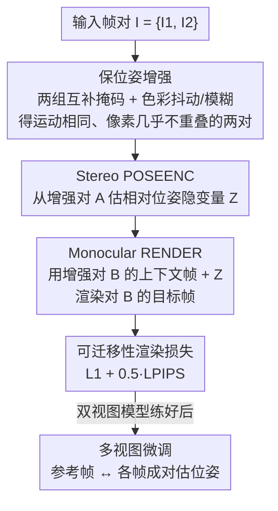

# True Self-Supervised Novel View Synthesis is Transferable

**会议**: ICLR 2026  
**OpenReview**: [https://openreview.net/forum?id=aJJppqAm6r](https://openreview.net/forum?id=aJJppqAm6r)  
**论文**: [Project Page](https://www.mitchel.computer/xfactor/)  
**代码**: 无（仅项目页）  
**领域**: 3D视觉  
**关键词**: 新视角合成, 自监督, 可迁移性, 相机位姿, geometry-free

## 一句话总结
本文提出用「可迁移性」作为判断一个模型是否真正会做新视角合成（NVS）的核心判据，并据此设计出 XFactor——第一个完全不依赖多视图几何、纯自监督就能学到可跨场景迁移的相机位姿表示的模型，靠「双视图单目模型 + 保位姿增强的可迁移性目标」两个简单设计大幅超越 RayZer / RUST。

## 研究背景与动机

**领域现状**：当下的 NVS（新视角合成）几乎都建立在多视图几何之上——先用 COLMAP 这类 structure-from-motion 算法把多视图图像预处理成 $\mathrm{SE}(3)$ 相机位姿，再训练网络在给定位姿下渲染逼真新视角。为了摆脱对位姿标注的依赖、用上更大规模的真实视频，近年出现了自监督 NVS：让一个位姿估计模块和渲染模块端到端联合训练。

**现有痛点**：作者指出，现有自监督方法（RayZer、RUST）虽然渲染结果看起来不错，但它们预测出来的「位姿」其实**不可迁移**——同一组位姿放到不同的 3D 场景里，会渲染出不同的相机轨迹。这意味着用户没法用「从场景 A 提取的相机轨迹」去精确控制「场景 B 该渲染哪个视角」。换句话说，这些模型并不是真正在推理视角，而是在对上下文帧做**插值**（interpolation）。

**核心矛盾**：自监督 NVS 的训练目标通常是「自编码」——只要能用同一序列里的场景表示和位姿把目标帧重建出来即可。这个目标太弱：模型完全可以走捷径，把「怎么在当前几张上下文帧之间插值」编码进所谓的「位姿」隐变量里，而这种捷径恰好满足自编码损失，却完全不具备跨场景控制能力。

**本文目标**：抛开多视图几何的词汇，重新问「不依赖几何先验时，NVS 到底是什么」，并把它当作一个纯机器学习问题来解：(1) 给出一个不依赖 $\mathrm{SE}(3)$ 的、刻画「什么才算真 NVS」的判据；(2) 设计一个 geometry-free、完全自监督却能满足该判据的模型。

**切入角度**：作者识别出 NVS 的本质性质是**可迁移性**——一组从某序列提取的相机位姿，必须能在任意其他场景里复现同一条相机轨迹。位姿表示的合法性标准不在于它能否被识别成 $\mathrm{SE}(3)$，而在于它能否跨场景渲染出同一条轨迹。

**核心 idea**：用一个「永远只能外推、不能插值」的双视图单目模型作为骨架，再把可迁移性本身直接写成训练目标（配合一种几乎不改变相机运动、却把像素内容打散的增强），逼模型学出纯几何、可跨场景迁移的位姿隐变量——全程不引入任何 3D 归纳偏置。

## 方法详解

### 整体框架

XFactor（Transferable Latent Factorization）把 NVS 形式化成一个隐变量模型：一个位姿编码器 `POSEENC`、一个场景编码器 `SCENEENC` 和一个渲染器 `RENDER`。作者先用一个**判据**重新定义「真 NVS」：设两个序列 $I^A, I^B$ 的目标帧共享相同相机运动（即 $\mathrm{ORACLE}[I^A_T]=\mathrm{ORACLE}[I^B_T]$），若用序列 A 提取的目标位姿 $Z^A_T$ 去渲染序列 B 的场景表示 $S^B$ 能得到 $\mathrm{RENDER}[S^B, Z^A_T]\approx I^B_T$，则该模型的位姿是**可迁移的**。这条判据等价于「可控性」，而传统自编码目标（$I^A=I^B$ 的特例）只是它的退化情形，根本约束不到迁移。

围绕这个判据，训练管线（下图）非常简洁：给一对输入帧，先做**保位姿增强**生成两组「相机运动相同、像素内容几乎不重叠」的帧；双视图 `POSEENC` 从第一组提取相对位姿隐变量 $Z$；单目 `RENDER` 拿第二组的上下文帧加上 $Z$ 去重建第二组的目标帧；损失就是这个跨组渲染的可迁移性损失。两视图模型练好后，再做一次**多视图微调**扩展到多帧序列。需要强调：判据里用到的 `ORACLE`（本文取 VGGT）以及评测指标 TPS **只在测评时使用**，训练全程不依赖任何预训练或人工设计的几何 oracle，所以下图的训练流程里看不到它。

### 关键设计

**1. 可迁移性判据与 TPS 指标：把「真 NVS」从几何词汇里解放出来**

本文最根本的贡献是换了一套衡量标准。过去判断一个位姿表示是否合法，是看它能不能对上 $\mathrm{SE}(3)$；本文主张这无关紧要，真正重要的是位姿能否**跨场景复现同一条轨迹**。为把它量化，作者提出 **True Pose Similarity (TPS)**：给定一个位姿 oracle 和一个轨迹比较指标 $d_{\mathrm{SE}(3)^n}$（如相对旋转精度 RRA、相对平移精度 RTA，或二者合成的 AUC），两序列的 TPS 定义为各自 oracle 位姿之间的相似度 $\mathrm{TPS}(I^A,I^B)\equiv d_{\mathrm{SE}(3)^n}(\mathrm{ORACLE}[I^A],\mathrm{ORACLE}[I^B])$。评测一个模型时，就用第二序列的场景表示 $S^B$ 加第一序列的目标位姿 $Z^A_T$ 渲染出新轨迹，再用 oracle 量它和原轨迹是否一致：$\mathrm{TPS}(I^A_T, \mathrm{RENDER}[S^B, Z^A_T])$。作者也诚实地指出，该指标只衡量「几何一致」这一半，可能被 $\mathrm{RENDER}[S^B,Z^A_T]\approx I^A_T$ 的退化解钻空子，因此必须配一个感知度量（如 FID）来验证渲染是否忠于上下文场景。这个判据是后续所有设计的「靶子」，且 oracle 只用于打分、不进训练。

**2. Stereo-Monocular 模型：用「只能外推」的结构堵死插值捷径**

RayZer 和 RUST 的位姿编码器与渲染器都能看到**多张**上下文视图，这恰恰给了模型偷懒的空间——它会把「如何在这几张上下文帧之间插值」编码进位姿隐变量，而这种「位姿」换个场景（上下文帧不同）自然失效。针对这个痛点，作者把模型退到最极端的情形：只有单张上下文、单张目标（$I=\{I_1,I_2\}$，$I_C=\{I_1\}$，$I_T=\{I_2\}$）。此时 `POSEENC` 变成一个两视图立体（stereo）模型，`SCENEENC` 被 `RENDER` 吸收，`RENDER` 是单目（monocular）的：$\mathrm{POSEENC}[I_1,I_2]=Z_2$，$\mathrm{RENDER}[I_1,Z_2]=\tilde I_2$。因为渲染器手里只有一张图、无图可插，插值这条捷径被物理性切断，优化只能被逼向「学真正可迁移的位姿」。这一思路与表示学习里的 CroCo 相通——用单目渲染器逼模型学深度线索。

**3. 可迁移性目标与保位姿增强：把判据直接写进损失、并造出训练所需的配对**

双视图单目结构虽堵死了插值，但 `POSEENC` 仍可能把目标像素信息（而非纯几何位姿）夹带进隐变量，给渲染器留一条「解码偷运来的像素」的小后门。作者的对策是把可迁移性**显式**写成目标：给两对共享相同相对位姿的帧 $I^A=\{I^A_1,I^A_2\}$、$I^B=\{I^B_1,I^B_2\}$，要求从 A 提取的位姿隐变量能渲染出 B 的目标帧，$L\equiv d_I\big(I^B_2,\ \mathrm{RENDER}[I^B_1,\ \mathrm{POSEENC}[I^A_1,I^A_2]]\big)$。问题是真实视频里很难现成拿到这种「位姿相同、内容不同」的配对。第三个关键洞察解决了这点：对任意序列做两个**保持真实相机位姿不变**的逐帧增强 $\mathrm{AUG}$、$\overline{\mathrm{AUG}}$（即 $\mathrm{ORACLE}[\mathrm{AUG}[I]]=\mathrm{ORACLE}[\overline{\mathrm{AUG}}[I]]=\mathrm{ORACLE}[I]$），就能凭空造出「运动相同、像素几乎不重叠」的两组序列。实现上，把图像分块平面切成四象限、随机两两分组得到两个等面积、并集覆盖全图的互补掩码（可得左右、上下乃至对角划分），再叠加色彩抖动与模糊；另留 5% 概率不加掩码，使该样本退化为整图自编码、给模型一个看全图推理的机会。增强只在训练时用，推理不用。正是「逼模型把 A 的位姿用到内容迥异的 B 上」这一点，逼出了纯几何、可迁移的位姿表示。

**4. 多视图微调：在不重新引入插值偏置的前提下扩到多帧**

双视图单目模型只能处理单上下文，无法一次前向覆盖超宽基线。作者在第二训练阶段对 `[POSEENC, RENDER]` 做微调以扩展到多视图：把多帧序列拆成上下文集和单张随机目标帧，参考帧 $I_R$ 取「与其余各帧最大基线最小」的那张（最居中的一帧）作为所有位姿的表达基准；继续对所有帧施加保位姿增强；`POSEENC` 成对地估计参考帧与其余各帧之间的相对位姿隐变量，`RENDER` 再按可迁移性目标用第二序列的上下文与位姿渲染目标帧。这样既获得多视图的覆盖能力，又通过「成对估位姿 + 可迁移性目标」避免把多视图插值偏置重新放回来。

### 损失函数 / 训练策略

`POSEENC` 与 `RENDER` 均为多视图 ViT。图像距离 $d_I$ 取像素 $L_1$ 与 LPIPS 感知损失的线性组合，LPIPS 权重为 $0.5$。增强掩码按 batch 逐样本生成（四象限随机两两划分）。所有模型在 RE10K、DL3DV、MVImgNet、CO3Dv2 聚合而成的大规模真实视频数据集上训练，帧先中心裁剪再缩放到 $256\times 256$。

## 实验关键数据

### 主实验：可迁移性测试（Table 1，TPS）

对每个数据集随机抽 4000 对序列、各取 5 个等间隔目标帧，用第二序列场景 + 第一序列目标位姿渲染新轨迹，再用 TPS（RRA/RTA/AUC，10° 间隔阈值）量两条轨迹是否一致；FID 衡量迁移渲染质量。

| 指标（AUC@20°↑ / FID↓） | XFactor | RayZer | RUST |
|--------|---------|--------|------|
| RE10K · AUC@20° | **55.2** | 7.6 | 13.8 |
| DL3DV · AUC@20° | **57.2** | 5.9 | 10.8 |
| MVImgNet · AUC@20° | **53.4** | 2.6 | 4.1 |
| CO3Dv2 · AUC@20° | **31.2** | 2.7 | 5.4 |
| RE10K · FID | **4.5** | 43.0 | 16.2 |

XFactor 的 AUC@20° 约为 RayZer / RUST 的 5 倍以上。关键结论：RayZer 和 RUST 即便能渲出看似合理的图，也**彻底通不过迁移性测试**，因此并不是真 NVS——这正是端到端多视图自编码训练诱导出「插值隐变量」的后果。RUST 略好于 RayZer，因其「从完整视图与部分视图之间估位姿」的策略把目标推到了可迁移与自编码之间。

### 位姿探针（Table 2）

冻结各模型 `POSEENC`，训一个三层 MLP 从位姿隐变量预测 oracle 的 $\mathrm{SE}(3)$ 真值位姿。XFactor 的隐变量对真实位姿的刻画整体最强（10°/20° 的 AUC 显著领先），说明「双视图单目 + 可迁移性目标」同时也是一个有效的 3D 相机位姿自监督表示学习方法。有意思的是，在探针任务上 RayZer / RUST 并未完全失败、也学到了较有信息量的表示——这说明**可迁移性能改善几何推理，但几何推理强并不自动带来可迁移性**。

### 消融实验（Table 3）

以 stereo-monocular XFactor 为起点，消融两大支柱（双视图单目结构、可迁移性目标）。

| 配置 | 关键现象（迁移性） | 说明 |
|------|---------------------|------|
| XFactor（完整） | 最佳 | stereo-monocular + 可迁移性目标 |
| Additional View: Decoder | 退化 | 给 RENDER 加一张上下文视图（≈端到端多视图 XFactor） |
| Additional View: Enc+Dec | **彻底崩溃** | POSEENC 与 RENDER 都加上下文视图 |
| Bottleneck（16 维隐变量） | 与 XFactor 相当 | 但对真实位姿刻画弱于 XFactor，且会限制描述能力 |
| Unconstrained（256 维，自编码） | 较弱 | 无任何约束的双视图单目基线 |
| SE(3) & Plücker | **显著变差** | 强制预测 SE(3) 位姿 + Plücker 嵌入 |

### 关键发现
- **多视图是迁移性的毒药**：从只给 RENDER 加一张上下文视图开始，迁移性逐步退化，等 POSEENC 也看到额外视图时彻底崩溃——证实「多视图 = 插值后门」的判断。
- **显式 $\mathrm{SE}(3)$ 反而有害**：反直觉地，逼模型把位姿参数化成 $\mathrm{SE}(3)$ + Plücker 嵌入会**显著降低**迁移性，甚至不如无约束基线；可见可迁移位姿无需任何几何归纳偏置。
- **可迁移性目标 vs. 瓶颈**：瓶颈（16 维）在迁移性上与 XFactor 接近，但会牺牲描述力（如无法编码光照变化）；可迁移性目标则在不加显式约束的前提下提升迁移性，更通用。

## 亮点与洞察
- **重新定义问题本身**：不靠多视图几何的词汇，而用「可迁移性」这一输入-输出行为来定义「真 NVS」，并配上可量化的 TPS 指标——这把一个被几何先验绑死的 3D 问题，干净地翻译成了纯机器学习问题。
- **用「结构限制」代替「显式约束」**：堵插值捷径靠的不是加正则或参数化，而是退到「单目渲染器无图可插」的极端结构，物理性地切断捷径，比 RayZer 的 SE(3) 瓶颈更有效也更通用。
- **保位姿增强可迁移到任何「需要配对却没有配对」的自监督任务**：用「保持某种不变量、却打散无关内容」的双增强来人造训练配对（这里是互补掩码保相机运动、毁像素重叠），这一招在表示学习里有广泛价值。
- **诚实地承认指标可被 hack**：作者主动指出 TPS 只覆盖几何一致性、需配感知度量验证忠实度，这种自我设防比单报一个漂亮数字更可信。

## 局限与展望
- **超宽基线受限**：`POSEENC` 被限制为双视图模型，无法在单次前向里估计超宽基线位姿；多视图 `POSEENC` 在监督下很强，但在自监督下不引入插值偏置仍是开放问题。
- **确定性模型的渲染瑕疵**：迁移帧在目标位姿远离上下文时会出现模糊与扭曲伪影，作者归因于 XFactor 是确定性而非生成式模型、缺乏消解不确定性的手段；展望是引入相机可控的生成式模型来缓解。
- **自评的潜在局限**：实验全部围绕真实视频数据集与 oracle（VGGT）打分，oracle 自身的位姿误差会传入 TPS；不同数据集（场景级 vs 物体级）难度差异大，跨数据集的绝对数值不宜直接横比。

## 相关工作与启发
- **vs RayZer**：RayZer 把潜在位姿参数化为刚体 $\mathrm{SE}(3)$ 变换以做信息瓶颈，渲染质量高但位姿不可迁移；本文证明这种显式参数化在多视图下不仅给不出迁移性、反而比无约束基线更差，主张用结构限制 + 可迁移性目标取代几何参数化。
- **vs RUST**：RUST 同样 geometry-free，靠「从场景表示 + 部分目标视图估位姿」的信息瓶颈防偷看，比 RayZer 略好（目标介于可迁移与自编码之间），但仍受多视图插值偏置和「掩码消不掉太多像素重叠」之累；本文的互补掩码增强更彻底地打散像素内容。
- **vs latent action models（Genie 等）**：二者都从相邻视频帧提取转移隐变量，但 latent action 关注各类自我中心动作，本文专注于恢复「可迁移的相机位姿」表示。

## 评分
- 新颖性: ⭐⭐⭐⭐⭐ 用「可迁移性」重新定义真 NVS 并给出 TPS 指标，再用极简的结构限制 + 增强目标实现，视角新且自洽。
- 实验充分度: ⭐⭐⭐⭐ 四个大规模真实数据集 + 迁移测试/探针/消融三套实验，但暂无开源代码、对比方法为自行复现。
- 写作质量: ⭐⭐⭐⭐⭐ 从判据到方法层层递进，公式与动机咬合紧密，且主动指出指标可被 hack。
- 价值: ⭐⭐⭐⭐⭐ 第一个 geometry-free 全自监督真 NVS 模型，且其位姿表示可直接用作 3D 位姿的自监督表示学习。

<!-- RELATED:START -->

## 相关论文

- [\[CVPR 2026\] From None to All: Self-Supervised 3D Reconstruction via Novel View Synthesis](../../CVPR2026/3d_vision/from_none_to_all_self-supervised_3d_reconstruction_via_novel_view_synthesis.md)
- [\[ICCV 2025\] RayZer: A Self-supervised Large View Synthesis Model](../../ICCV2025/3d_vision/rayzer_a_self-supervised_large_view_synthesis_model.md)
- [\[CVPR 2026\] WildRayZer: Self-supervised Large View Synthesis in Dynamic Environments](../../CVPR2026/3d_vision/wildrayzer_self-supervised_large_view_synthesis_in_dynamic_environments.md)
- [\[ICLR 2026\] EA3D: Event-Augmented 3D Diffusion for Generalizable Novel View Synthesis](ea3d_event-augmented_3d_diffusion_for_generalizable_novel_view_synthesis.md)
- [\[ICLR 2026\] Aligned Novel View Image and Geometry Synthesis via Cross-modal Attention Instillation](aligned_novel_view_image_and_geometry_synthesis_via_cross-modal_attention_instil.md)

<!-- RELATED:END -->
