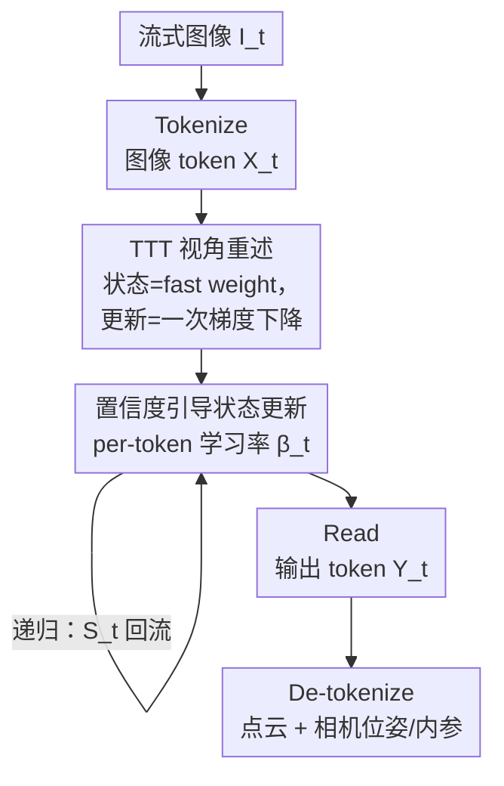

# TTT3R: 3D Reconstruction as Test-Time Training

**会议**: ICLR 2026  
**OpenReview**: [https://openreview.net/forum?id=aMs6FtNaY5](https://openreview.net/forum?id=aMs6FtNaY5)  
**代码**: https://rover-xingyu.github.io/TTT3R  
**领域**: 3D视觉  
**关键词**: 在线3D重建, 测试时训练, 循环神经网络, 长度泛化, 自适应学习率

## 一句话总结
把循环式 3D 重建模型 CUT3R 的状态更新重新解读为一个测试时在线学习问题，用记忆状态与新观测之间的对齐置信度推导出一个闭式的、逐 token 的自适应学习率来门控状态更新，从而在不训练、不加参数的前提下大幅缓解长序列遗忘——全局位姿精度比基线提升 2×，同时仍保持 20 FPS、6 GB 显存处理上千张图像。

## 研究背景与动机

**领域现状**：3D 重建基础模型要从一组 RGB 图像里同时预测相机位姿和场景几何（像素对齐的 pointmap）。Transformer 全注意力方法（DUSt3R、VGGT、Fast3R）凭借全局 all-to-all 注意力拿到了 SOTA，但计算和显存随序列长度二次增长，本质是离线的——每来一帧就要把所有图像重跑一遍。要做实时流式重建，循环架构（RNN）成了有吸引力的替代：把历史压进一个固定长度的状态，每步只依赖当前状态和新观测，计算复杂度 $O(1)$、显存恒定。CUT3R 就是这条路线的代表。

**现有痛点**：RNN 路线最大的毛病是**遗忘**。CUT3R 大多在 64 帧以内的序列上训练，一旦输入视图数涨到几百上千帧，重建质量急剧退化——位姿漂移、几何破碎、鬼影。这就是"长度泛化"问题：模型在超出训练上下文长度时表现崩坏。Point3R 试图用显式的点云记忆缓解遗忘，但记忆随重建点累积而线性增长，又把恒定显存的优势丢掉了，700 帧后就 OOM。

**核心矛盾**：CUT3R 的状态更新用的是 softmax 交叉注意力。softmax 权重沿观测 token 维度归一化求和恒为 $1.0$，这等价于强制让一个固定为 $\beta_t = 1.0$ 的学习率把新观测**全盘**写进状态，于是模型永远优先吸收最新观测、不断覆盖历史记忆，导致灾难性遗忘。问题的根子在于缺一个**灵活的、能在"保留历史"与"吸收新信息"之间权衡的门控**。

**本文目标**：在不重新训练、不加任何可学习参数的前提下，给 CUT3R 这类循环 3D 重建模型补上长度泛化能力。

**切入角度**：作者把现代 RNN 研究里的一个视角搬过来——测试时训练（Test-Time Training, TTT）。在 TTT 里，循环状态被看成"快权重"（fast weight），它在推理时通过梯度下降从输入上下文里在线学习；而冻结的模型参数是"慢权重"，扮演元学习器，决定梯度和学习率怎么算。从这个视角看，CUT3R 的状态更新恰好就是一次 TTT 式的在线学习，而它遗忘的病因正是那个被锁死成 $1.0$ 的学习率。

**核心 idea**：用记忆状态与新观测之间的**对齐置信度**算出一个逐 token 自适应的学习率 $\beta_t$，替换掉 CUT3R 里隐含的常数 $1.0$，从而显式门控每个状态 token 的更新强度——置信度高就多更新，置信度低（如无纹理区域）就抑制，得到一个训练免费、即插即用的状态更新规则。

## 方法详解

### 整体框架

TTT3R 不改 CUT3R 的网络、不重新训练，只在前向推理时把状态更新那一步的规则换掉。整条流水线仍是序列建模的通用四步：对每帧流式图像 $I_t$ 先 **Tokenize** 成图像 token $X_t$，再用 $X_t$ 把上一时刻状态 $S_{t-1}$ **Update** 成 $S_t$，然后从 $S_t$ 里 **Read** 出输出 token $Y_t$，最后 **De-tokenize** 成像素对齐的点云 $P_t$、相机位姿 $T_t$ 和内参 $C_t$。

$$\bX_t = \texttt{Tokenize}(\bI_t),\quad \bS_t = \texttt{Update}(\bS_{t-1}, \bX_t),\quad \bY_t = \texttt{Read}(\bS_t, \bX_t),\quad \bP_t = \texttt{De-tokenize}(\bY_t)$$

本文的全部创新集中在中间那个 $\texttt{Update}$ 算子上。作者先把这一步重述成 TTT 的形式——状态是 fast weight，更新 = 一次梯度下降 $\bS_t = \bS_{t-1} - \beta_t \nabla(\bS_{t-1}, \bX_t)$；再指出 CUT3R 原本的 softmax 更新等价于把学习率 $\beta_t$ 锁死成 $1.0$，这正是遗忘的源头；最后用交叉注意力的对齐置信度算出一个逐 token 的 $\beta_t$ 把它替换掉。整条 pipeline 中真正属于本文贡献的只有"置信度引导的状态更新"这一个节点，其余都是 CUT3R 既有的脚手架。

### 关键设计

**1. 把循环式状态更新重述为测试时训练：让"遗忘"有了可解释的病因**

作者先用一个统一的序列建模视角把全注意力方法和 RNN 方法都装进 $\texttt{Update}/\texttt{Read}$ 两个算子里。全注意力（VGGT、Fast3R）的更新是状态不断 append 键值对、长度随帧数 $O(t)$ 增长；RNN（CUT3R）的更新则是新帧与固定长度状态做一对一交叉注意力 $\bS_t = \bS_{t-1} + \texttt{softmax}(\bQ_{\bS_{t-1}}\bK_{\bX_t}^\top)\bV_{\bX_t}$，复杂度 $O(1)$。

关键的一步是把 RNN 这条更新规则改写成 TTT 的标准形式 $\bS_t = \bS_{t-1} - \beta_t \nabla(\bS_{t-1}, \bX_t)$：状态被当成 fast weight，在测试时通过梯度下降从 in-context token 里学习，而冻结的网络参数（slow weight）充当元学习器、负责产出梯度函数和学习率。对照之后会发现，CUT3R 的梯度项就是 $\nabla = -\texttt{softmax}(\bQ_{\bS_{t-1}}\bK_{\bX_t}^\top)\bV_{\bX_t}$——交叉注意力的对齐分数决定"往哪个状态 token 写"（key 是索引）、对应的 value 决定"写什么"。这个重述的价值在于：它精确暴露了 CUT3R 遗忘的病因——softmax 权重沿观测维度归一化恒为 $1.0$，相当于学习率被结构性地锁成常数 $\beta_t = 1.0$，于是状态被强迫完全适配最新观测、无法保留历史，这正是与标准 TTT（有灵活学习率）的结构性差异。把"遗忘"从一个经验现象变成"缺一个可调学习率"的具体缺口，后面的修法才有的放矢。

**2. 置信度引导的逐 token 学习率：用对齐置信度当软门控来抑制低质量更新**

既然病根是学习率被锁成 $1.0$，本文就显式造一个自适应学习率 $\beta_t \in \mathbb{R}^{n\times 1}$ 替换它。回想交叉注意力 $\bQ_{\bS_{t-1}}\bK_{\bX_t}^\top$ 把图像空间维度 $m = \{1,\dots,h\}\times\{1,\dots,w\}$ 的信息聚合进 $n$ 个状态 token，作者直接复用这套注意力 logits：对每个状态 token，把它与所有观测 key 的注意力分数沿空间维度取均值再过 sigmoid，得到该 token 的学习率

$$\beta_t = \sigma\!\left(\textstyle{\sum_m} \bQ_{\bS_{t-1}}\bK_{\bX_t}^\top\right),\qquad \textstyle\sum_m \equiv \tfrac{1}{m}\textstyle\sum_{i=1}^m$$

于是完整的闭式状态更新规则变成 $\bS_t = \bS_{t-1} - \beta_t\big(-\texttt{softmax}(\bQ_{\bS_{t-1}}\bK_{\bX_t}^\top)\bV_{\bX_t}\big)$：原来的 softmax 加权和保留不动（决定写什么、写到哪），但乘上一个逐 token 的软门 $\beta_t$（决定更新多强）。直觉上，对齐置信度高意味着状态与观测匹配好、不确定性低，就放大更新步长；像无纹理区域那种低质量匹配，置信度低就把更新压住——作者发现若对所有状态一视同仁地更新，恰恰会因为这些低质量更新而退化。这个门控只用到了模型内部已有的注意力统计量，不引入任何新参数、也不需要微调，是个纯前向的即插即用干预，却把灾难性遗忘缓解到能做在线 loop closure 的程度。

**3. 可选的状态重置：用周期性复位绕开"未探索状态分布"问题**

置信度门控缓解了遗忘，但没有从根上解决——长序列下递归会把状态推到训练时从未见过的分布（"未探索状态"假说），这部分退化光靠调学习率治不了。作者因此提供一个可选的 TTT3R + State Reset 变体：每隔一段就把状态复位回初始值，从而避免状态过拟合到 OOD 区域；被切成的若干 chunk 之后用全局度量位姿对齐，不需要额外优化。这一招同样保持了 CUT3R 的推理速度和显存效率，是个轻量的兜底选项，在精度和稳定性优先时按需启用。

### 损失函数 / 训练策略
本文最大的特点是**完全不训练**：TTT3R 是对预训练好的 CUT3R 的一个推理时干预，所有改动都发生在前向传播里，不微调任何权重、不加任何可学习参数。学习率 $\beta_t$ 直接由模型已有的交叉注意力 logits 计算得到，因此没有新的训练目标或优化策略。

## 实验关键数据

评测覆盖三类任务：相机位姿估计、视频深度估计、3D 重建，统一在单张 48GB GPU 上把输入视图数从 50 扫到 1000，OOM 即提前终止。全注意力的 VGGT（离线）保留全部历史、无遗忘，被当作在线方法的精度上界。

### 主实验（长序列表现，趋势性结论）

| 任务 / 数据集 | 指标 | TTT3R | CUT3R | 其他在线基线 |
|--------|------|------|----------|------|
| 相机位姿 / ScanNet、TUM-D | ATE (m) ↓ | 全局位姿精度比 CUT3R **提升 2×** | 长序列漂移、精度差 | Point3R 精度更好但 >700 帧 OOM；StreamVGGT 高延迟、易 OOM |
| 视频深度 / KITTI、Bonn | Abs Rel ↓ / δ<1.25 ↑ | 全程最佳，无需微调 | 长序列退化 | Point3R 短序列(≤300帧)强、长序列退化且度量尺度不准 |
| 3D 重建 / 7-scene | Chamfer ↓ / Normal Consistency ↑ | 长序列稳定，Chamfer 低于 Point3R，逼近离线 VGGT | 遗忘致严重退化 | VGGT/StreamVGGT 很快 OOM |
| 效率 | FPS / 显存 | **20 FPS / 6 GB**，处理上千图像 | 同等效率（恒定显存） | VGGT/Point3R 显存随帧数涨、易 OOM |

> 注：原文长序列结果以折线图（图 7-9）形式给出，未提供逐点数值表，上表为趋势性归纳；"提升 2×"是作者对全局位姿估计的核心量化结论。

### 消融实验

| 配置 | 效果 | 说明 |
|------|---------|------|
| TTT3R（置信度引导 $\beta_t$） | 缓解遗忘、支持在线 loop closure | 完整方法 |
| 退化为常数 $\beta_t = 1.0$（即 CUT3R） | 灾难性遗忘 | softmax 归一化锁死学习率，永远优先新观测 |
| 对所有状态 token 均匀更新 | 次优，被低质量更新拖累 | 不区分置信度，无纹理区域的低质量更新损害性能 |
| + State Reset（可选） | 进一步抑制状态过拟合 | 周期性复位避免状态漂进 OOD 区域 |

### 关键发现
- **遗忘的根因是被锁死的学习率，而非容量不足**：把 CUT3R 重述为 TTT 后看清，softmax 归一化等价于恒定 $\beta_t=1.0$，强制全盘吸收新观测。仅仅把这个常数换成置信度门控就拿到 2× 位姿提升，且零额外计算成本。
- **逐 token 自适应是必要的**：均匀更新所有状态会被无纹理等低质量区域的更新拖垮，按对齐置信度逐 token 加权才能稳住长序列。
- **效率不打折**：因为只是把已有注意力 logits 复用为门控，TTT3R 与 CUT3R 同速同显存（20 FPS / 6 GB），却能处理上千帧——而 Point3R、StreamVGGT、VGGT 都在几百帧内 OOM。
- **缓解但未根治**：TTT3R 仍未达到离线 VGGT 的重建精度，长序列的"未探索状态"退化要靠可选的 State Reset 兜底。

## 亮点与洞察
- **把成熟领域的视角迁移过来解新问题**：作者没有发明新结构，而是把语言模型那边 TTT / fast weight / 自适应学习率（DeltaNet、Mamba-2、Titans、GLA）的成熟分析框架搬到 3D 重建，立刻把"长序列遗忘"翻译成"学习率被锁死"，让原本模糊的退化现象有了精确的下手点——这是个很值得复用的研究套路。
- **训练免费、即插即用**：整个方法只是前向里乘一个由现成注意力 logits 算出的门控，不加参数、不微调，几乎零成本就能贴到 CUT3R 上，工程落地门槛极低。
- **置信度门控的思想可迁移**：用模型内部注意力统计量估计"这次更新可不可信、该更新多狠"，这套"内部置信度选择性过滤更新"的思路（论文也指出与同期 LLM 测试时推理工作相通）可以推广到任何带记忆/状态的流式模型。

## 局限与展望
- 作者承认 TTT3R **只缓解、不根治**遗忘，长序列重建精度仍不及保留全历史的离线 VGGT；这与"未探索状态"假说一致——短上下文训练的模型递归后状态会漂出训练分布。
- State Reset 虽能兜底，但周期性复位 + chunk 对齐本质上是工程折中，复位周期等超参的选择、跨 chunk 对齐误差如何控制，文中（正文）着墨不多。
- 评测主要给的是折线图趋势而非逐点数值表，"2× 提升"等结论的精确数值和不同数据集上的方差读者难以从正文直接核对。
- 作者指出 TTT 的设计空间还远未探索，未来可往更有效、更稳定、可并行的循环架构方向走，把重建精度和长度泛化一起推上去。

## 相关工作与启发
- **vs CUT3R**：同样是 RNN + 固定长度状态的在线重建，CUT3R 用 softmax 交叉注意力更新（隐含 $\beta_t=1.0$）因而遗忘；TTT3R 在其之上换成置信度引导的逐 token 学习率，训练免费地把长序列位姿精度提升 2×，效率不变。
- **vs Point3R**：Point3R 用显式点云记忆缓解遗忘，但记忆随重建点累积而线性增长、700 帧后 OOM；TTT3R 走相反路线，保持隐式定长状态、显存恒定，靠改更新规则而非加记忆来换长度泛化。
- **vs StreamVGGT / VGGT**：后两者基于全注意力，VGGT 离线、StreamVGGT 用因果注意力做增量，但状态都随帧数 $O(t)$ 增长、几百帧内 OOM；TTT3R 以 $O(1)$ 显存实时运行，逼近 VGGT 精度。
- **vs Test3R / CVD（测试时优化类）**：它们在测试序列上微调预训练模型最小化自监督几何一致性损失，需要反传更新权重；TTT3R 把"测试时学习"放进前向状态更新里，无需任何微调。

## 评分
- 新颖性: ⭐⭐⭐⭐ 视角迁移（TTT 解读循环 3D 重建）很巧妙，但底层机制借自现代 RNN，是漂亮的"重述+小改"而非全新结构。
- 实验充分度: ⭐⭐⭐⭐ 三类任务、长序列扫描、效率对比都覆盖到，但多为折线图、缺逐点数值表。
- 写作质量: ⭐⭐⭐⭐⭐ 从统一序列建模到 TTT 重述再到闭式更新规则，推导链条清晰、动机层层递进。
- 价值: ⭐⭐⭐⭐⭐ 训练免费、即插即用、零额外成本就把在线长序列 3D 重建的遗忘问题大幅缓解，实用性很高。

<!-- RELATED:START -->

## 相关论文

- [\[CVPR 2026\] Scal3R: Scalable Test-Time Training for Large-Scale 3D Reconstruction](../../CVPR2026/3d_vision/scal3r_scalable_test-time_training_for_large-scale_3d_reconstruction.md)
- [\[CVPR 2026\] ZipMap: Linear-Time Stateful 3D Reconstruction via Test-Time Training](../../CVPR2026/3d_vision/zipmap_linear-time_stateful_3d_reconstruction_via_test-time_training.md)
- [\[CVPR 2026\] tttLRM: Test-Time Training for Long Context and Autoregressive 3D Reconstruction](../../CVPR2026/3d_vision/tttlrm_test-time_training_for_long_context_and_autoregressive_3d_reconstruction.md)
- [\[CVPR 2026\] Low-Rank Test-Time Training for Pre-Trained Point Cloud Models](../../CVPR2026/3d_vision/low-rank_test-time_training_for_pre-trained_point_cloud_models.md)
- [\[ICLR 2026\] SpaceControl: Introducing Test-Time Spatial Control to 3D Generative Modeling](spacecontrol_introducing_test-time_spatial_control_to_3d_generative_modeling.md)

<!-- RELATED:END -->
