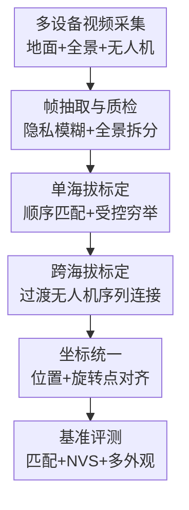

# ULTRA-360: Unconstrained Dataset for Large-scale Temporal 3D Reconstruction across Altitudes and Omnidirectional Views

**会议**: ICLR 2026  
**OpenReview**: [https://openreview.net/forum?id=7W2w6pPvGA](https://openreview.net/forum?id=7W2w6pPvGA)  
**代码**: 无  
**领域**: 3D视觉  
**关键词**: 大规模3D重建、时序场景重建、全景视角、多海拔采集、相机标定

## 一句话总结
ULTRA-360 构建了一个覆盖校园级建筑、四季外观、地面与空中多海拔、透视与 360 全景相机的大规模真实图像数据集，并用半自动标定流程和多类重建基准揭示了当前大规模时序 3D/4D 重建在跨海拔匹配、doppelganger 消歧、密集化和多外观建模上的关键短板。

## 研究背景与动机
**领域现状**：NeRF、3D Gaussian Splatting 以及一系列大场景神经渲染方法已经能在不少室内、物体级、街景级或航拍场景上生成高质量新视角图像。另一方面，SfM、局部特征匹配、场景图优化和层级 Gaussian 表示也在不断改进，使得从普通相机图片恢复相机位姿和稠密场景变得越来越可行。

**现有痛点**：这些进展常常被拆散在不同 benchmark 上评估：有的数据集只看地面视角，有的只看航拍视角，有的只有单一季节和光照，有的虽然来自真实互联网照片但时间、相机、外观都不可控。这样的方法评测很容易只证明某个模块在一个受限设置下有效，却无法回答更现实的问题：如果要把一个真实校园或城市区域数字化成可自由探索的 3D/4D 资产，现有自动标定和稠密重建到底会在哪些环节失效？

**核心矛盾**：大规模沉浸式重建需要同时满足几件互相拉扯的条件：地面图像有丰富细节但只能看到立面和近处，航拍图像能覆盖屋顶和整体结构但缺少地面细节；跨季节、昼夜和天气能带来真实时序变化，却会让匹配和外观建模更加困难；全景相机有沉浸式视场，但拆分、遮挡和操作者区域又会给数据处理带来额外噪声。现有数据集往往只覆盖其中一部分，因此很难成为端到端 3D/4D 重建的压力测试。

**本文目标**：作者希望建立一个更接近真实数字孪生需求的数据集：它既要有校园级空间范围，也要有跨两年的多季节、多时段采集；既要有地面普通相机和 360 全景，也要有 60m、100m、120m 等多海拔无人机视角；同时还要提供经过人工核验的相机标定结果，让研究者可以系统评估特征匹配、SfM、场景图优化、稠密重建和多外观 NVS。

**切入角度**：论文没有只提出一个新的重建模型，而是把数据集、标定流程和基准实验打包成一个端到端测试场。作者的观察是：如果 benchmark 本身不包含跨海拔、全景、多季节和重复建筑纹理这些真实困难，那么模型很容易在漂亮的插值视角上得高分，却无法暴露自由探索时的 floaters、错误几何和外观过拟合。

**核心 idea**：用一个真实校园中 20 栋建筑、37.7K 张标定图像和多模态采集设置，把大规模时序 3D 重建从“单场景漂亮渲染”推进到“跨海拔、跨季节、跨相机类型的端到端现实压力测试”。

## 方法详解

### 整体框架
ULTRA-360 的核心产物不是一个单一网络，而是一套可复现实验场：先用消费级设备在真实校园中采集跨季节、跨海拔、跨视场的视频，再把视频抽帧、质检、隐私模糊和全景拆分成可用于 SfM 与 NVS 的图像集合，随后通过半自动场景图和坐标对齐流程得到统一相机系统，最后用特征匹配、场景图优化和稠密重建方法进行基准评测。输入是围绕每栋建筑采集的 iPhone、Insta360 和 DJI 无人机视频，输出是覆盖 20 栋建筑、统一坐标系下的多外观图像与相机标定，以及一组能揭示现有方法失败模式的 benchmark 结果。

数据采集覆盖 20 栋校园 academic halls，面积约 140 acres，时间跨度约两年。统计上，iPhone 提供 19 段视频和 7134 帧，主要来自夏秋季、晴天/阴天/夜间、约 $70^\circ$ FoV 的地面透视视角；Insta360 提供 31 段视频和 23260 帧，覆盖春冬季、晴天/阴天/夜间、地面 $360^\circ$ FoV；DJI Mini 3 提供 81 段视频和 7334 帧，覆盖春冬季、晴天/阴天/夜间以及 60m、100m、120m 多个空中高度。全景帧被拆成四个水平透视面，每个约 $120^\circ$ FoV，保留水平 360 度覆盖，丢弃主要是天空的上方面和含固定操作者的下方面；包含人脸或车牌等 PII 的区域通过自动算法模糊。

标定流程采用 divide-and-conquer。作者先在单一海拔内标定图像，再利用人工核验的跨海拔集合合并地面与航拍相机，最后把不同建筑对齐到一个校园级坐标系统。这样做的原因很直接：如果把所有图像直接丢给 COLMAP 或类似 SfM 软件，不仅计算量会爆炸，更严重的是重复窗户、对称立面、相似楼体会造成 doppelganger 匹配，让相机系统折叠到错误几何。

### 关键设计
**1. 多海拔全景时序采集：让 benchmark 同时包含细节、覆盖和真实外观变化**

ULTRA-360 最重要的设计是把地面、全景和航拍视角放进同一个数据集，而不是让它们分别服务于不同 benchmark。地面 iPhone/全景视频负责捕获建筑立面、门窗、草地、玻璃、岩石和树木等近距离细节；无人机在 60m、100m、120m 的环绕轨迹提供屋顶、整体外形和大尺度结构；跨两年的春夏秋冬、昼夜和晴阴天气则让场景外观不再是单一静态贴图，而是具有真实时间变化。

这个设计的价值在于，它让“能否重建”不再等价于“能否在训练相机附近插值”。例如，只有航拍图像时，地面视角可能缺少立面细节；只有地面图像时，从空中看会出现大量天空 floaters 和屋顶空洞；只有单季节数据时，appearance embedding 的过拟合问题又不容易暴露。ULTRA-360 把这些矛盾放在一起，使得大规模重建方法必须同时处理覆盖、细节和外观一致性。

**2. 半自动场景图标定：用人工约束减少 doppelganger，而不是盲目穷举匹配**

大规模建筑图像中最危险的错误不是“匹配太少”，而是“匹配到看起来很像但物理位置完全不同的地方”。作者把图像集合表示为场景图 $G=(I,P)$，其中节点 $I$ 是图像，边 $P=\{(I_i,I_j)\}$ 表示需要做特征匹配的图像对。航拍图像视野更全，视觉歧义相对少，因此 aerial graph 可以采用 exhaustive matching；地面图像因为窗户、立柱、对称立面大量重复，直接穷举会制造大量 doppelganger。

为此，论文将地面多外观序列写成 $I_i^x$，其中 $x$ 是视频序列，$i$ 是序列内帧号。序列内只匹配时间上接近的帧，即 $P^x_{within}=\{(I_i^x,I_j^x)||i-j|\leq 10\}$，用视频连续性约束空间距离；序列间则人工把帧分到建筑 front/back 两个 bucket，只允许 front-to-front 和 back-to-back 匹配：$P^{x,y}_{between}=\{(I_i^x,I_j^y)|i\in S^x_{front},j\in S^y_{front}\}\cup\{(I_i^x,I_j^y)|i\in S^x_{back},j\in S^y_{back}\}$。这不是完全自动的优雅解，但它非常贴近真实工程：用少量可解释人工结构换来更可靠的全局几何，避免敏感匹配器在重复建筑纹理上“热情过度”。

**3. 过渡无人机序列连接跨海拔：把地面和航拍之间的巨大 baseline 拆成可匹配路径**

地面相机和 120m 航拍相机之间的视角差太大，直接匹配很难找到足够准确的对应点。ULTRA-360 的采集流程专门保留无人机从地面升到约 60m 的 ascending videos，并且在建筑前后两侧各录一段。这些过渡序列像桥一样把地面视角和空中视角接起来，避免跨海拔标定完全依赖极端 baseline 匹配。

在跨海拔场景图中，作者显式去掉 ground-aerial 直接匹配，即 $P^{grd}_{aerial}=\emptyset$，因为这类边通常贡献少、计算贵且错误风险高；ground-transition 和 transition-transition 仍用 front/back bucket 控制歧义，transition-aerial 与 aerial-aerial 则可用更密集的 exhaustive matching。对应点由 SP+SG 和 RoMa 等方法计算，再交给 COLMAP 做 SfM，最终从不同 matcher 结果中选择最佳标定。这一设计说明 ULTRA-360 并不是简单“收很多图”，而是在采集阶段就为后续几何恢复设计了可连接的视角路径。

**4. 位置加旋转点的坐标对齐：让不同标定块真正落到同一校园坐标系**

SfM 得到的每个建筑、每个子系统都有任意尺度、旋转和平移，因此需要把 ground-only、aerial-only、cross-elevation 和 campus-wide calibration 对齐。普通 Procrustes alignment 只根据共享 3D 点或相机中心优化 $s,r,t$，形式上是 $s^*,r^*,t^*=\arg\min_{s,r,t}\sum_i\|s(rp_X^i+t)-p_Y^i\|^2$。但只看相机中心可能让位置对齐还可以，朝向却出现偏差。

作者因此把相机旋转也转成可对齐的“旋转点”：以相机中心 $P^i_{pos}$ 为起点，沿旋转矩阵方向反投影三个点 $P^i_{rot}=P^i_{pos}+s_XR^{i,X}$，其中 $s_X$ 由相机中心分布的标准差尺度确定。最终优化同时惩罚中心误差和旋转点误差：$\sum_i\|s(rP^{i,X}_{pos}+t)-P^{i,Y}_{pos}\|^2+\|s(rP^{i,X}_{rot}+t)-P^{i,Y}_{rot}\|^2$。附录实验显示，在 Mip-NeRF 360 的对齐测试中加入旋转点能把平均旋转误差从 0.196 降到 0.156，说明这个小改动对多块标定合并很关键。

### 损失函数 / 训练策略
本文主要是数据集和基准论文，没有提出新的端到端训练损失。训练与优化策略集中在两类实验设置上。

第一类是相机标定与特征匹配实验。跨海拔匹配用 ground-aerial 图像对评估，指标是 AUC@10，基于 Relative Rotation Accuracy 与 Relative Translation Accuracy 的角度误差，在 10 度阈值下取两者较小值的 AUC。对比方法包括 SIFT、SP+SG、SP+LG、LoFTR、RoMa、SP+RoMa、DaD+RoMa，以及 VGGSfM、VGGT、MASt3R、MASt3R-SfM 等 feed-forward 方法。

第二类是稠密重建和 NVS 实验。作者选择 10 栋建筑，训练集拆成 ground-only、aerial-only、ground+aerial 三种配置，测试视角也分 ground 和 aerial。对比方法包括 Block-MERF、Splatfacto-W、CityGaussianV2、Scaffold-GS、Octree-GS 和 EVER，指标包括 PSNR、SSIM 和 DreamSim。由于跨季节和跨光照时像素级 ground truth 不完全可比，论文在跨海拔渲染中更强调 DSIM 这类感知相似性指标。

多外观实验用 Wild-GS 和 Gaussian-Wild 作为代表，比较 test image embedding、nearest train image embedding、farthest train image embedding 和 time embedding。作者特别关心 embedding 是否真正表示同一时间/外观，还是把视角方向也编码进去导致测试时依赖 test image。

## 实验关键数据

### 主实验
跨海拔相机匹配是 ULTRA-360 暴露问题最直接的实验。表中选取论文 Table 3 的代表性结果：许多传统或 feed-forward 方法在 ground-aerial 极大 baseline 下几乎完全失败，RoMa 系列能找到更多真阳性，但需要特征过滤来压制假阳性。

| 方法 | Building #10 | #24 | #34 | #49 | #54 | 主要现象 |
|------|--------------|-----|-----|-----|-----|----------|
| SIFT | 0 | 0 | 0 | 0 | 0 | 对跨海拔视角变化基本无能为力 |
| SP+SG | 0 | 0 | 0 | 0 | 0 | 更保守，特异性强但召回不足 |
| RoMa | 0.0854 | 0.0023 | 0.0036 | 0 | 0.1388 | 有跨海拔召回，但假阳性多、结果不稳定 |
| SP+RoMa | 0.3738 | 0 | 0 | 0 | 0.5966 | 用 SuperPoint 过滤后部分建筑改善 |
| DaD+RoMa | 0.6941 | 0.8000 | 0.7915 | 0.7440 | 0.6380 | 整体最好，但仍有建筑失败 |
| VGGT | 0.1384 | 0 | 0 | 0 | 0 | feed-forward 几何模型仍难泛化到该设置 |

多海拔重建实验显示，简单把 ground 和 aerial 图像合并训练并不一定更好。下面摘取论文 Table 4 中代表性配置，数值体现出 Octree-GS、Scaffold-GS 在多海拔数据上更稳，但跨海拔泛化仍明显困难。

| 训练 / 测试 | Block-MERF PSNR/SSIM/DSIM | Splatfacto-W PSNR/SSIM/DSIM | Scaffold-GS PSNR/SSIM/DSIM | Octree-GS PSNR/SSIM/DSIM | 结论 |
|-------------|---------------------------|------------------------------|------------------------------|----------------------------|------|
| G / G | 21.020 / 0.609 / 0.118 | 21.925 / 0.657 / 0.166 | 21.551 / 0.658 / 0.122 | 21.360 / 0.667 / 0.109 | 地面训练测地面时，各方法差距有限 |
| GA / G | 19.655 / 0.574 / 0.235 | 21.569 / 0.647 / 0.183 | 21.140 / 0.635 / 0.154 | 21.184 / 0.653 / 0.116 | 加入航拍后不总是提升地面渲染 |
| A / A | 27.451 / 0.779 / 0.015 | 29.440 / 0.860 / 0.016 | 30.286 / 0.878 / 0.006 | 29.950 / 0.874 / 0.005 | 航拍测航拍时层级/LOD 方法效果较好 |
| GA / A | 13.453 / 0.106 / 0.407 | 23.206 / 0.669 / 0.042 | 26.135 / 0.748 / 0.022 | 26.488 / 0.759 / 0.024 | 多海拔联合训练下 Octree-GS 和 Scaffold-GS 更稳 |

### 消融实验
论文没有传统意义上“去掉某模块训练同一模型”的消融，而是通过重建配置、Gaussian 数量和 appearance embedding 方式分析失败原因。下面两张表分别对应 Table 5 和 Table 6 的关键结论。

| 训练配置 | Splatfacto-W Gaussians | CityGS V2 Gaussians | Octree-GS Gaussians | EVER Gaussians | 说明 |
|----------|------------------------|---------------------|---------------------|----------------|------|
| G | 340244 | 569325 | 3191058 | 535701 | 地面数据能密集覆盖立面细节 |
| A | 630093 | 287026 | 527991 | 70738 | 航拍覆盖大结构，但细节密度不同 |
| GA | 309018 | 241688 | 2230053 | 262366 | 联合训练反而更少 Gaussian，说明密集化被多方向梯度拉扯 |

| 外观编码方式 | Wild-GS PSNR / SSIM / DSIM | Gaussian-Wild PSNR / SSIM / DSIM | 说明 |
|--------------|-----------------------------|------------------------------------|------|
| Test Image Embedding | 28.133 / 0.864 / 0.015 | 26.528 / 0.767 / 0.020 | 使用测试图像外观，评测条件不够真实 |
| Nearest Train Image Embedding | 28.003 / 0.863 / 0.014 | 26.567 / 0.757 / 0.020 | 近邻训练图像可近似同外观 |
| Farthest Train Image Embedding | 22.506 / 0.770 / 0.061 | 25.621 / 0.757 / 0.023 | 远视角 embedding 导致 Wild-GS 明显掉点，暴露视角-外观纠缠 |
| Time Embedding | 27.973 / 0.860 / 0.014 | 26.277 / 0.762 / 0.021 | 不依赖测试图像，且保持接近最佳的 3D 一致外观 |

### 关键发现
- DaD+RoMa 在跨海拔匹配中最强，但仍不能保证所有建筑正确标定；这说明 foundation-model dense matcher 的敏感性很有价值，却必须配合更可靠的假阳性过滤和全局一致性判断。
- Exhaustive matching 在地面建筑序列上往往最糟，因为它会把相似立面、重复窗户和对称结构误连起来；Doppelganger++ 可以缓解，但不同 matcher 下仍可能变形，人工核验和结构化场景图目前仍不可省。
- 单海拔训练到同海拔测试通常更容易，多海拔联合训练反而可能让 Gaussian 数量减少，暗示现有 densification 规则在来自地面和空中的梯度同时作用时不够稳定。
- Ground-only 重建从空中看容易出现天空 floaters；Splatfacto-W 的背景建模和作者在 Octree-GS 中加入的隐式天空模型能明显缓解这类伪影。
- Per-image appearance embedding 可能把视角方向和外观混在一起。ULTRA-360 因为同一外观下有多视角 ground truth，能直接检验这种过拟合，而不仅仅看测试图像附近的插值结果。

## 亮点与洞察
- ULTRA-360 的最大亮点是把“数据集设计”当成研究贡献来做。它不是单纯堆更多图片，而是有意识地把跨海拔、360 视角、跨季节、重复建筑纹理和统一坐标系这些现实困难组合在一起，让 benchmark 本身能逼出现有 pipeline 的薄弱点。
- 过渡无人机序列是一个很实用的采集 trick。跨地面和高空直接匹配太难，采集时加入从地面上升到空中的桥接视频，相当于在数据层面给 SfM 提供连续路径，比事后强行调 matcher 更可靠。
- 论文对“自动化”的态度很诚实。它没有宣称完全自动标定已经解决，而是展示了当前方法在敏感性和特异性之间的真实矛盾：能匹配远距离视角的方法更容易误匹配相似建筑，保守方法又找不到跨海拔对应。
- 多外观实验的洞察值得迁移到其他 in-the-wild 重建任务：如果 appearance code 是按图片学习的，就必须检查它是否只是记住了某个相机方向的局部外观；按时间或条件建模可能比测试时拿 test image embedding 更接近真实部署。
- 对生成式 3D 和城市数字孪生而言，ULTRA-360 可以成为几何可信度的压力测试。一个模型即使能生成视觉上好看的新视角，也需要在自由视角、跨高度和跨季节下保持结构一致，否则很容易在这个数据集上暴露。

## 局限与展望
- 数据集范围仍是一个校园和 20 栋 academic buildings，虽然有 140 acres 和多种外观，但建筑类型、城市道路、交通动态、室内外连接等复杂性还不能代表完整城市。
- 标定流程依赖人工 bucket、人工核验和从多个 matcher 结果中选择最佳解，说明该数据集本身可以评估自动化方法，但其构建过程还不是完全自动可扩展的城市级流水线。
- 论文主要评估图像重建和 NVS，没有系统加入 LiDAR、GPS/IMU、语义标注或动态对象轨迹；对于机器人和自动驾驶等应用，这些模态会影响可用性。
- 多季节变化更多体现为外观和部分结构变化，但尚未形成完整的动态 4D 监督，例如建筑施工、树木生长、临时物体长期变化等可量化标注还比较有限。
- 后续方向可以包括：更全局的 doppelganger 消歧模型、适合多海拔梯度冲突的 Gaussian densification、显式天空/远场建模、按时间条件化的外观场，以及把 ULTRA-360 扩展到更多建筑和更长时间跨度。

## 相关工作与启发
- **vs Phototourism / MegaScenes**: 这类互联网照片数据有丰富外观，但采集时间、相机和覆盖不可控，评测时常需要 test-view 图像来估计外观；ULTRA-360 的优势是同一场景有系统采集和多视角 ground truth，更适合检验 zero-shot NVS 和外观一致性。
- **vs Block-NeRF / KITTI-360 / NuScenes**: 驾驶数据集有城市级地面 360 视角，但主要沿道路采集，屋顶和建筑上方区域缺失；ULTRA-360 加入无人机多海拔视角，更适合研究完整建筑体和沉浸式自由探索。
- **vs Mill-19 / OMMO / UrbanScene3D**: 航拍大场景数据能覆盖整体结构，但地面细节不足；ULTRA-360 把地面普通相机、全景相机和航拍序列对齐到同一坐标系，使得跨海拔重建成为核心评测问题。
- **vs MatrixCity**: MatrixCity 有 ground+aerial 和城市级规模，但来自合成环境，真实光照、季节、材质变化和采集噪声不够自然；ULTRA-360 用真实校园采集补上了 realism 和 temporal appearance 的压力。
- **vs Wild-GS / Gaussian-Wild**: 这些方法解决 unconstrained photo collections 的多外观重建，但常依赖测试图像 embedding；ULTRA-360 展示了这种 embedding 可能与视角纠缠，并提供了用 time embedding 评估零样本渲染的更公平场景。

## 评分
- 新颖性: ⭐⭐⭐⭐⭐ 数据集本身的组合很有辨识度，把全景、跨海拔、多季节和统一标定放到同一真实 benchmark 中，补齐了现有数据集的空缺。
- 实验充分度: ⭐⭐⭐⭐⭐ 覆盖特征匹配、场景图优化、稠密重建、多海拔 NVS 和多外观 embedding，实验不只是报分数，还分析了具体失败模式。
- 写作质量: ⭐⭐⭐⭐ 论文结构清晰，数据集构建和实验动机讲得扎实；不足是部分表格较密，附录可视化对理解失败案例很重要。
- 价值: ⭐⭐⭐⭐⭐ 对大规模 3D 重建、城市数字孪生、in-the-wild NVS 和 3DGS 鲁棒性研究都有直接价值，尤其适合作为下一代端到端重建系统的现实压力测试。

<!-- RELATED:START -->

## 相关论文

- [\[ICLR 2026\] SkyEvents: A Large-Scale Event-Enhanced UAV Dataset for Robust 3D Scene Reconstruction](skyevents_a_large-scale_event-enhanced_uav_dataset_for_robust_3d_scene_reconstru.md)
- [\[ICLR 2026\] Point-MoE: Large-Scale Multi-Dataset Training with Mixture-of-Experts for 3D Semantic Segmentation](point-moe_large-scale_multi-dataset_training_with_mixture-of-experts_for_3d_sema.md)
- [\[ICLR 2026\] Signal Structure-Aware Gaussian Splatting for Large-Scale Scene Reconstruction](signal_structure-aware_gaussian_splatting_for_large-scale_scene_reconstruction.md)
- [\[NeurIPS 2025\] Look and Tell: A Dataset for Multimodal Grounding Across Egocentric and Exocentric Views](../../NeurIPS2025/3d_vision/look_and_tell_a_dataset_for_multimodal_grounding_across_egocentric_and_exocentri.md)
- [\[ICLR 2026\] UP2You: Fast Reconstruction of Yourself from Unconstrained Photo Collections](up2you_fast_reconstruction_of_yourself_from_unconstrained_photo_collections.md)

<!-- RELATED:END -->
