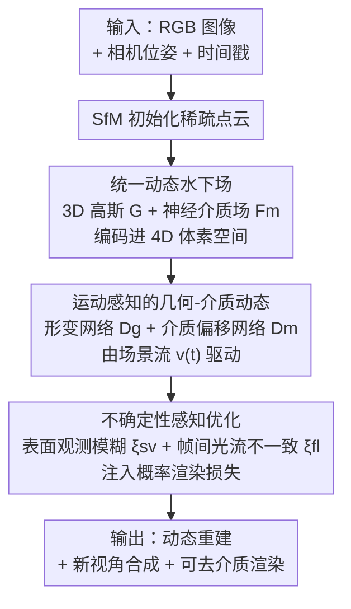

# Uncertainty-Aware 3D Reconstruction for Dynamic Underwater Scenes

**会议**: ICLR 2026  
**OpenReview**: [https://openreview.net/forum?id=96DTvuYq4h](https://openreview.net/forum?id=96DTvuYq4h)  
**项目主页**: [https://underwater-dynamic-field.github.io/UDF](https://underwater-dynamic-field.github.io/UDF)  
**领域**: 3D视觉  
**关键词**: 水下三维重建, 动态场景, 3D Gaussian Splatting, 介质建模, 异方差不确定性

## 一句话总结
本文提出 UDF（Uncertainty-aware Dynamic Field），在一个统一的 4D 场里同时建模水下动态几何与随时间变化的参与介质，并用「表面观测模糊 + 帧间光流不一致」推出的逐像素不确定性去加权渲染损失，从而在受控和野外水下视频上同时拿到高质量重建与新视角合成。

## 研究背景与动机
**领域现状**：NeRF 和 3DGS 已经能在空气中把静态/动态场景重建得很逼真，后续的 4DGS、形变场等也把它们扩展到了带运动的场景。水下方向则一般沿用「修正的水下成像模型」，把沿光线的辐射拆成物体表面的直接反射和水体的后向散射两部分，再嵌进体渲染里（如 SeaThru-NeRF、WaterSplatting）。

**现有痛点**：这些方法几乎都建立在「刚性静态场景」假设上。水下真实场景里物体在游动、水面在变形、介质属性（衰减/散射）也随时间在变，刚性假设无法刻画这些非刚性动态；同时野外水下视频（尤其是网上抓来的片段）能见度差、各视角/各帧噪声水平不一致，直接重建会产生鬼影和时序抖动。

**核心矛盾**：一方面，几何线索和介质引起的衰减在图像强度里是耦合的，动态场景下还要同时让几何和介质都随时间演化，这本身就难；另一方面，观测噪声是**输入相关**（input-dependent）的——它随表面朝向、场景运动而变，但现有水下方法基本都用统一的逐像素确定性损失，对所有观测一视同仁，无法识别哪些区域的观测本就不可靠。

**本文目标**：拆成两个子问题——(1) 用一个统一表示同时建模随时间变化的水下几何与参与介质；(2) 显式量化输入相关的观测不确定性，在训练时把低置信度观测的影响压下去。

**切入角度**：作者观察到水下重建的两类不可靠区域有明确物理来源——当光线方向几乎贴着表面法线时，散射和直接辐射难以解耦，高频外观容易被误判成几何（表面观测模糊）；而非刚性运动或外观漂移会让帧间对应关系变得含糊（帧间不一致）。这两个量都能从已有的几何/运动估计里近似算出来，不需要额外标注。

**核心 idea**：把动态几何与运动感知的介质统一进一个 4D 神经体素场，再用物理可解释的逐像素异方差不确定性去自适应加权渲染损失，让模型自己学会忽略「靠不住」的观测。

## 方法详解

### 整体框架
给定一组带相机位姿和归一化时间戳的 RGB 图像，UDF 的目标是联合重建水下场景的几何、介质效应及其随时间的演化。整个 pipeline 分三段串行：先用 SfM 初始化一套嵌在体积介质场里的 3D 高斯，得到**规范水下表示**（canonical representation）；再把这套表示编码进一个共享的 4D 神经体素空间，用形变网络和介质偏移网络分别预测高斯和介质属性的时变更新，得到**水下动态建模**；最后在渲染损失里注入由表面观测模糊和帧间光流不一致组成的逐像素不确定性，做**不确定性感知优化**。三段共享同一个 4D 体素骨干，几何与介质在其中被联合表示。

### 关键设计

**1. 统一动态水下场：把几何和介质塞进同一个 4D 体素空间**

针对「动态水下场景里几何和介质都在随时间变、但二者又相互耦合」这个痛点，UDF 不再把场景当成静态，而是构造一个同时承载结构和介质的统一表示。规范表示由一组从 SfM 点云初始化的 3D 高斯椭球 $\mathcal{G}$ 加一个体积介质场 $\mathcal{F}_m$ 组成：每个高斯是显式的几何基元，带中心 $\mu$ 和协方差 $\Sigma=RSS^\top R^\top$；周围水体则由一个以光线方向 $\omega$ 为条件的神经介质场建模。渲染上，沿光线的颜色被拆成结构项和介质项 $C(r)=C_{str}(r)+C_{med}(r)$，透射率也相应分解为高斯遮挡 $T^{str}$ 和介质指数衰减 $T^{med}$ 的乘积 $T_n(s)=\prod_{j=1}^{n-1}(1-\alpha_j)\cdot\exp(-\sigma_{med}s)$；介质系数进一步按水下成像模型拆成衰减系数 $\sigma_{att}$ 和后向散射系数 $\sigma_{bs}$，且都是 RGB 三通道向量，以刻画波长相关的衰减/散射。

为了让这套表示能编码时序，UDF 借助平面分解（K-planes）把 4D 时空域拆成六个正交 2D 平面 $\{(x,y),(x,z),(y,z),(x,t),(y,t),(z,t)\}$，结构和介质各自挂一组可学习特征图 $f^{str}_k$、$f^{med}_k$。查询一个时空点 $Q(x_{3d},t)$ 时在各平面做双线性插值再逐元素相乘融合，得到时空特征 $F^{str}$ 和 $F^{med}$。这个共享骨干让动态几何和时变介质在同一空间里被一致地表示，是后续动态建模的基础。

**2. 运动感知的几何-介质动态：用场景流驱动介质更新**

针对「介质属性会随场景运动变化、但常规 4DGS 只形变几何、不管介质」的问题，UDF 在时空特征上接两个时间条件网络。形变网络 $D_g$ 从 $F^{str}$、$F^{med}$ 预测每个规范高斯的平移、缩放、旋转偏移 $\Delta\mu(t),\Delta S(t),\Delta R(t)=D_g(F^{str}(\mu,t),F^{med}(\mu,t))$，把高斯从规范空间形变到当前时刻的状态；由于同时吃了结构和介质特征，形变能更贴合水下的实际动态。

关键的差异在于介质也跟着运动更新：先把高斯中心的时间差投影到图像平面，算出 2D 场景流 $v(t)=\big(\text{Proj}(\mu+\Delta\mu(t+\Delta t))-\text{Proj}(\mu+\Delta\mu(t))\big)/\Delta t$，它编码了水下结构在图像平面上的运动线索；再由介质偏移网络 $D_m$ 结合 $v(t)$ 和视角 $\omega$ 输出时变介质属性 $c_{med}(t),\sigma_{att}(t),\sigma_{bs}(t)=D_m(F^{med}(x,t),v(t),\omega)$。这样介质的衰减与散射不再是固定的，而是被场景运动「带着走」，实现了对环境动态的完整建模。

**3. 异方差不确定性：从物理线索推出逐像素置信度并加权损失**

针对「野外水下观测噪声输入相关、但旧方法用统一确定性损失」的痛点，UDF 把两路物理可解释的不确定性融进概率渲染损失。第一路是**表面观测模糊** $\xi_{sv}$：当光线方向贴着表面法线时散射难以从直接辐射里解耦，作者用深度图梯度构造伪法线 $n$，定义 $\xi_{sv}^2=(\max(0,\omega\cdot n))^2$——法线与视线越对齐，模糊度越高。第二路是**帧间光流不一致** $\xi_{fl}$：用可见高斯的场景流聚合出逐像素运动 $v_{pixel}$，再用 Horn-Schunck 光流约束衡量它和图像梯度的对齐程度 $\xi_{fl}^2=(\nabla I\cdot v_{pixel}+\partial I/\partial t)^2+\epsilon_0$，残差越大说明对应越含糊。

两路合成总方差 $\xi_{total}^2=\xi_{sv}^2+\xi_{fl}^2$，渲染损失写成把每个像素颜色当作正态分布的负对数似然：

$$\mathcal{L}_c=\frac{\lVert\hat{C}(r)-C(r)\rVert^2}{2\xi_{total}^2}+\frac{1}{2}\log\xi_{total}^2$$

第一项让高不确定区域自动降权，第二项是防止模型把方差无限放大的正则。值得注意的是 $\xi_{sv}$ 只作为软线索调制光度损失权重，不直接改渲染出的颜色或几何（消融也显示整体鲁棒性不依赖完美的伪法线）。这套异方差形式让模型在含糊区域抑制噪声、同时保持物理合理性，相比对所有像素一视同仁的确定性损失，重建更稳定、时序更一致。

### 损失函数 / 训练策略
总损失为概率渲染损失加一个总变差平滑项 $\mathcal{L}=\mathcal{L}_c+\mathcal{L}_{tv}$，$\mathcal{L}_{tv}$ 约束预测颜色序列的平滑性。训练分两步：先单独优化高斯 $\mathcal{G}$ 和谱介质场 $\mathcal{F}_m$ 做 warm-up，再联合训练 $D_g$ 和 $D_m$ 并启用不确定性感知损失。数值稳定常数 $\epsilon_0=1\times10^{-4}$；Horn-Schunck 光流第二项用简化的帧间差近似以降开销。Adam 优化器，学习率从 $1\times10^{-3}$ 指数衰减到 $1.5\times10^{-4}$；推理时关闭不确定性建模，只用渲染模块出最终结果。硬件为 i9-14900K + RTX 4090，3DGS 光栅化用 CUDA、其余用 PyTorch。

## 实验关键数据

### 主实验
在受控数据集（DRUVA、SeaThru）和野外视频（NUSR）上评测，指标用 PSNR / SSIM / LPIPS，结果对五次运行取平均。

NUSR 上对比之前的动态/静态方法（节选 Turtle、Coral 场景）：

| 数据集/场景 | 指标 | 本文 UDF | WaterSplatting | NUSR |
|--------|------|------|----------|------|
| NUSR Turtle | PSNR↑ | **33.73** | 25.20 | 28.10 |
| NUSR Turtle | SSIM↑ | **0.965** | 0.879 | 0.899 |
| NUSR Turtle | LPIPS↓ | **0.051** | 0.233 | 0.216 |
| NUSR Coral | PSNR↑ | **28.72** | 28.67 | 26.17 |
| NUSR Coral | LPIPS↓ | **0.085** | 0.098 | 0.157 |

DRUVA / SeaThru 上与最强 baseline WaterSplatting、4DGS 对比（节选）：

| 数据集/场景 | 指标 | 本文 UDF | 之前最佳 | 提升 |
|--------|------|------|----------|------|
| DRUVA A11 | PSNR↑ | **34.03** | 32.33 (WaterSplatting) | +1.70 |
| DRUVA A11 | LPIPS↓ | **0.123** | 0.207 (WaterSplatting) | -0.084 |
| SeaThru Panama | PSNR↑ | **32.95** | 25.90 (4DGS) | +7.05 |
| SeaThru Panama | LPIPS↓ | **0.065** | 0.277 (4DGS) | -0.212 |

整体上 UDF 在 PSNR、LPIPS 上几乎全面领先；少数静态内容为主的序列 SSIM 略低于 WaterSplatting，作者解释为静态方法已能重建大部分背景结构、UDF 的动态优势在 SSIM 上体现不出来。盲测用户研究中，40 名学生在 1500 张渲染图上有超过 90% 的情况选 UDF 为最佳。

### 消融实验

模型组件消融（NUSR Turtle）：

| 配置 | PSNR↑ | SSIM↑ | LPIPS↓ | 说明 |
|------|---------|------|------|------|
| Full ($\mathcal{F}_m+D_g+D_m$) | 33.73 | 0.965 | 0.051 | 完整模型 |
| w/o $D_m$ | 30.84 | 0.951 | 0.072 | 去介质偏移网络，掉点最多 |
| w/o $D_g$ | 31.46 | 0.953 | 0.068 | 去形变网络 |
| w/o $\mathcal{F}_m$ | 31.53 | 0.954 | 0.052 | 去神经介质场 |
| 全去 | 29.90 | 0.948 | 0.075 | 退化为基础重建 |

不确定性消融（NUSR Turtle）：

| 配置 | PSNR↑ | SSIM↑ | LPIPS↓ | 说明 |
|------|---------|------|------|------|
| $\xi_{sv}+\xi_{fl}$ | 33.73 | 0.965 | 0.051 | 完整不确定性 |
| w/o $\xi_{sv}$ | 32.48 | 0.951 | 0.062 | 去表面观测模糊 |
| w/o $\xi_{fl}$ | 31.52 | 0.954 | 0.063 | 去帧间光流不一致 |
| 全去 | 30.83 | 0.941 | 0.070 | 统一确定性损失 |

### 关键发现
- 介质偏移网络 $D_m$ 贡献最大：去掉它 PSNR 从 33.73 跌到 30.84，说明「让介质跟着运动更新」是动态水下场景的关键，而不仅是几何形变。
- 两路不确定性都不可或缺：单去 $\xi_{fl}$ 掉到 31.52、单去 $\xi_{sv}$ 掉到 32.48，全去则跌到 30.83，验证了用统一确定性损失的局限。
- 模型对超参不敏感：介质 MLP 隐层在 {64,128,256} 间 PSNR 仅波动 0.2 dB，不确定性损失权重变动带来 <0.5 dB 波动；初始化用 COLMAP 还是 VGGT 结果相当，说明 pipeline 对初始化和标定都较鲁棒。

## 亮点与洞察
- **介质也「动起来」**：常规动态 3DGS 只形变几何，本文额外让介质属性被 2D 场景流驱动更新，这是水下相比空气场景的核心区别——水体本身在流动、衰减/散射也在变，抓住这点是大幅领先 4DGS 的关键。
- **不确定性有明确物理出处**：$\xi_{sv}$ 用「视线-法线夹角」量化散射难解耦的区域、$\xi_{fl}$ 用光流残差量化帧间含糊，都是从已有几何/运动估计里近似算出的，不需要额外网络或标注，异方差损失的两项可解释性强。
- **可迁移的 trick**：「把输入相关噪声写成异方差负对数似然损失、用物理线索构造逐像素方差」这套思路可以迁到任何带退化观测的重建任务（如雾天、夜间、内窥镜），只要能找到对应的物理模糊线索即可。

## 局限与展望
- 不确定性建模在推理时被关闭，只用于训练加权；它本身不输出可用的置信度图供下游使用，稍显可惜。
- $\xi_{sv}$ 依赖深度图梯度推出的伪法线，水下深度本就噪声大；作者用「只作软线索、不改几何」来规避，但在极端低能见度下伪法线质量仍可能影响加权。
- 介质偏移网络用 2D 投影场景流近似驱动，遮挡或大位移下 2D 流估计误差会传导到介质更新；用更鲁棒的 3D 运动表示或显式遮挡处理可能进一步改善。
- 评测仍以 PSNR/SSIM/LPIPS 的逐帧重建质量为主，对长时序一致性、动态物体的几何精度缺乏更直接的度量。

## 相关工作与启发
- **vs WaterSplatting / SeaThru-NeRF**：它们把可学习介质参数嵌进渲染，但基本是静态假设、且对所有像素用确定性损失；UDF 在统一 4D 场里让几何和介质都时变，并加异方差不确定性，因而在动态场景和野外噪声数据上明显更强。
- **vs 4DGS / UDR-GS**：4DGS 系方法擅长动态建模却忽略参与介质（UDR-GS 直接套 4DGS + 深度先验、不管介质），在水下会把介质衰减误当几何；UDF 显式分离动态几何与介质，SeaThru Panama 上比 4DGS 高 7 dB PSNR。
- **vs NeRF 不确定性方法**：早期工作多在静态场景下用贝叶斯/变分估计逐光线方差，少有人处理「几何和外观同时随时间变」的动态条件；UDF 把表面观测模糊和帧间光流不一致组合进异方差渲染损失，专门面向动态水下退化观测。

## 评分
- 新颖性: ⭐⭐⭐⭐ 「统一动态几何+介质场」与「物理可解释的逐像素异方差不确定性」组合，针对水下动态这个 underexplored 问题切口扎实。
- 实验充分度: ⭐⭐⭐⭐ 三个数据集 + 两组消融 + 超参/初始化/标定鲁棒性 + 用户研究，覆盖较全。
- 写作质量: ⭐⭐⭐⭐ 动机推导清晰，公式与图示对应到位，少数符号略密集。
- 价值: ⭐⭐⭐⭐ 在海洋监测、水下导航等场景有实用价值，不确定性建模思路可迁移到其他退化重建任务。

<!-- RELATED:START -->

## 相关论文

- [\[ICLR 2026\] Uncertainty Matters in Dynamic Gaussian Splatting for Monocular 4D Reconstruction](uncertainty_matters_in_dynamic_gaussian_splatting_for_monocular_4d_reconstructio.md)
- [\[ICLR 2026\] Horseshoe Splatting: Handling Structural Sparsity for Uncertainty-Aware Gaussian-Splatting Radiance Field Rendering](horseshoe_splatting_handling_structural_sparsity_for_uncertainty-aware_gaussian-.md)
- [\[CVPR 2025\] SpectroMotion: Dynamic 3D Reconstruction of Specular Scenes](../../CVPR2025/3d_vision/spectromotion_dynamic_3d_reconstruction_of_specular_scenes.md)
- [\[ICLR 2026\] COOPERTRIM: Adaptive Data Selection for Uncertainty-Aware Cooperative Perception](coopertrim_adaptive_data_selection_for_uncertainty-aware_cooperative_perception.md)
- [\[ICLR 2026\] Mango-GS: Enhancing Spatio-Temporal Consistency in Dynamic Scenes Reconstruction using Multi-Frame Node-Guided 4D Gaussian Splatting](mango-gs_enhancing_spatio-temporal_consistency_in_dynamic_scenes_reconstruction_.md)

<!-- RELATED:END -->
