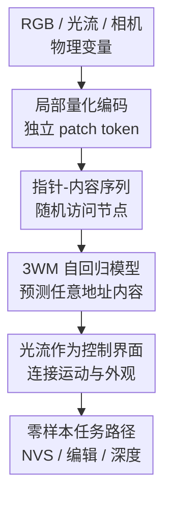

# Unified 3D Scene Understanding Through Physical World Modeling

**会议**: ICLR2026  
**OpenReview**: [https://openreview.net/forum?id=NQq9JLMfNN](https://openreview.net/forum?id=NQq9JLMfNN)  
**代码**: 待确认  
**领域**: 3D视觉  
**关键词**: 3D场景理解, 物理世界模型, 光流控制, 新视角合成, 深度估计

## 一句话总结
3WM 把 RGB 图像块、光流块和相机位姿统一成一个可随机访问的概率图模型，用 GPT 式自回归预测在同一套提示接口下零样本完成新视角合成、3D 物体操控和自监督深度估计，并在多个真实场景基准上超过专门模型。

## 研究背景与动机
**领域现状**：3D 场景理解通常被拆成若干相对独立的任务：深度估计负责从单张图恢复几何层次，新视角合成负责从已有观测渲染未见视角，3D 物体操控负责在固定相机下移动或旋转局部物体。这些任务都在回答同一个物理问题：如果观察者或物体发生变化，场景里的可见表面、遮挡关系和像素运动会如何变化。

**现有痛点**：主流方法往往为每个任务单独建模。深度模型可以给可见区域排序，却很难推断被遮挡的背面或下方结构；新视角合成模型可以生成图像，但容易牺牲几何一致性或相机控制精度；基于拖拽或扩散反演的物体编辑方法能做局部变化，却常在真实图片上出现背景漂移、物体身份改变、原位置残影等问题。更麻烦的是，这些系统之间无法自然共享训练信号：一个模型在物体运动中学到的遮挡知识，通常不能直接转移给深度估计或相机运动推理。

**核心矛盾**：3D 理解需要的是一个能在多种变量之间做条件推理的物理场景模型，而不是一组固定输入输出的任务模型。现有范式把任务边界写死在网络结构和训练目标里，导致模型只能回答训练时规定好的问题；一旦用户想组合操作，比如先把障碍物移开再向前移动相机，系统就缺少统一的状态表示和可组合的推理路径。

**本文目标**：作者希望构建一个统一模型，让 RGB、光流和相机位姿都成为同一概率图中的节点。这样一来，新视角合成可以被看成“给定 RGB 和运动场，预测下一帧 RGB”，物体操控可以被看成“给定 RGB 和局部光流约束，预测编辑后的 RGB”，深度估计可以被看成“给定 RGB 和相机平移，预测由几何产生的光流，再由视差反推深度”。

**切入角度**：论文选择光流作为物理控制界面。光流既是局部的、可编辑的，又直接描述像素如何因相机或物体运动发生位移；相比只用相机位姿，光流绕开了尺度歧义；相比只用文本或隐式控制，它能精确指定哪个区域移动、移动多少、背景是否保持不动。

**核心 idea**：用“局部量化 token + 指针地址 + 随机访问自回归序列”把物理场景建成一个可查询的概率图模型，让不同 3D 任务变成同一个模型中的不同条件推理路径。

## 方法详解

### 整体框架
3WM 的输入不是固定的一张图或一个深度图，而是一组带地址的局部变量：某个时空 patch 的 RGB token、某个 patch 的 optical flow token，以及全局相机位姿 token。模型学习一个条件分布 $\Psi(X, p)$：给定已经观察到的指针-内容集合 $X$ 和一个尚未填入的地址 $p$，预测该地址可能取到的离散内容 token。

这个设计把多个 3D 任务统一成“观察哪些节点、预测哪些节点”的问题。若观察第一帧 RGB 和一个稠密光流场，预测第二帧 RGB，就是新视角合成或光流控制的图像生成；若观察 RGB 和稀疏拖拽光流，先预测稠密光流再生成 RGB，就是物体操控；若观察 RGB 和相机平移，预测相机诱导的光流，再由光流幅值反推深度，就是自监督深度估计。

### 关键设计
**1. 局部随机访问序列：把图模型问题改写成可训练的 GPT 式预测**

论文的核心抽象是把场景变量视作概率图模型中的节点。每个节点有一个唯一指针 $p$，代表它在时空 patch 网格和模态中的地址；节点值 $v$ 来自离散码本 $V$。模型学习的是 $\Psi:(X,p)\mapsto \{Pr[(p,v)|X]:v\in V\}$，也就是在任意已观测节点集合 $X$ 下，预测某个未观测节点的内容分布。

为了让这个概率图模型能用现成的大规模自回归训练，作者把样本序列化为交错的指针和内容 token：$(p_0,v_0,p_1,v_1,\ldots)$。指针 token 可以由外部指定，因此解码顺序不必按图像 raster order 从左到右扫描，而是可以随机访问任意 patch。训练时使用随机顺序，让模型习惯在不同观察子集下补全任意位置；推理时用户可以把“下一步要预测哪个节点”变成控制变量。这一点很关键，因为 3D 任务天然不是单一顺序：有时需要并行补全整张 flow，有时需要先补局部再生成图像，有时需要在相机、光流和 RGB 之间来回切换。

**2. 严格局部 HLQ：让局部编辑真的只作用在局部变量上**

如果用普通 VQGAN 或全局 latent 表示一帧图像，一个 token 往往混有远处区域的信息，局部覆盖或局部重采样会变得不可预期。3WM 使用 Hierarchical Local Quantizer (HLQ)，用受限感受野的卷积自编码器把每个 patch 独立编码成短 token 序列。第一个 code 提供粗略外观，后续 code 逐步补细节。

这个设计服务于两件事。第一，它让模型中的“节点”更接近真正的局部物理变量：修改某个 patch 的 flow 或 RGB，不会在编码层面暗中污染整帧。第二，它降低了随机访问建模的难度，因为每个 patch 的内容可以在给定邻近上下文时被条件预测，而不必先解出一个全局 latent。消融结果也支持这一点：100M 模型中 Local & Random 在 WildRGB-D NVS 上达到 PSNR 17.28、LPIPS 0.236，明显优于 Local & Raster 的 PSNR 15.00、LPIPS 0.385；说明“局部 token + 随机顺序”不是实现细节，而是控制性和效率的来源。

**3. 光流作为因果中间变量：用可控运动场连接几何推理和图像生成**

3WM 采用近似的因果顺序 $[RGB, C]\rightarrow Flow\rightarrow RGB$。光流在这里不是附加监督，而是一个可被观察、预测、改写的中间变量。给定 RGB 和相机位姿，模型可以预测由相机运动诱导的光流；给定 RGB 和稠密光流，模型可以生成运动后的图像；给定 RGB 和稀疏光流，模型可以先补成稠密运动场，再生成编辑结果。

这种中间表示比“直接给相机位姿生成图像”更可控。相机位姿到像素运动之间有场景尺度和深度歧义，单靠位姿条件很难精确指定每个区域怎么动；光流则直接定义了像素层面的运动约束。论文的光流消融很有说服力：在 WildRGB-D NVS 上，去掉 flow 中间变量的 $3WM_{rgb}$ 只有 PSNR 14.49、LPIPS 0.346，而完整 3WM 达到 PSNR 18.02、LPIPS 0.185；在 NYU 深度估计上，AbsRel 从 0.173 降到 0.078，$\delta_1$ 从 0.825 升到 0.940。

**4. 任务由推理路径定义：同一个模型零样本切换 NVS、编辑和深度估计**

3WM 没有为 NVS、物体编辑和深度估计分别训练任务头。它把任务定义成不同的条件查询。新视角合成时，先用外部深度估计器把输入图像反投影成点云，施加目标相机刚体变换，再投影回图像平面得到 2D flow，最后走 $\Psi(RGB_0,F_{0\rightarrow1})\rightarrow RGB_1$ 生成目标视角。物体操控时，用目标物体的 3D 变换生成物体表面的 flow，并把背景 flow 设为 0，从而要求模型只移动目标而保持环境稳定。

深度估计的路径更有意思：模型并不直接输出 depth，而是在给定 RGB 和一个向下的 in-plane camera translation 时预测相机诱导的光流，再把光流幅值当作视差近似反推深度，形式上可写成 $D_{depth}\propto 1/F_{flow}$，其中 $F_{flow}=\Psi(RGB,C_{in\text{-}plane})$。这说明模型学到的不是某个数据集标签，而是“相机运动会让近处物体产生更大视差”这样的物理关系。

### 一个完整示例
假设输入是一张室内走廊图片，画面中央有一辆自行车挡住通道。传统系统可能需要一个物体编辑模型先移走自行车，再把编辑结果交给另一个 NVS 模型做前进视角渲染；两个模型的几何假设和外观表示不一致，很容易在交接处产生断裂。

在 3WM 中，可以先给自行车区域施加一个向右的稀疏 flow prompt，同时给背景区域设置零 flow。模型先通过 $\Psi(RGB_0,F_{sparse})\rightarrow F_{0\rightarrow1}$ 补全自行车整体的稠密运动场，再通过 $\Psi(RGB_0,F_{0\rightarrow1})\rightarrow RGB_1$ 得到“自行车被移开”的新图。随后，用户再根据希望的相机前进和转向，把该图与相机运动诱导的 flow 一起作为条件，生成沿走廊前进后的视角。这个过程没有换模型，状态变量始终是 RGB、flow 和相机节点，因此遮挡区域、背景补全和新视角几何可以在同一套世界模型里连贯处理。

### 损失函数 / 训练策略
3WM 的序列模型使用标准 next-token cross-entropy 训练，batch size 为 512，sequence length 为 4096。RGB 与相机位姿 token 先训练 500K steps，学习率经过 2K warmup 到 $3\times10^{-4}$ 并保持；随后加入 optical flow token 继续训练 200K steps，最后 100K steps 线性衰减到 0。

HLQ 分 RGB 和 flow 两个版本训练。RGB HLQ 在 ImageNet 与 OpenImages 上训练 200K iterations，目标包含 $\ell_1$ 重建损失、低分辨率损失和 DinoV2 感知损失，AdamW 学习率 $1\times10^{-4}$。Flow HLQ 使用与序列模型相同的视频数据，光流由 DPFlow 提取，先 warmup 2K steps，再固定学习率训练 300K iterations，最后 200K iterations 线性衰减。

训练数据由大规模互联网视频 BVD 和多个 3D 视觉数据集组成，包括 ScanNet++、CO3D、RealEstate10K、MVImgNet、DL3DV 与 EgoExo4D。BVD 约 7000 小时，作者用 LLaMA 3 生成的搜索查询抓取包含丰富物理运动和环境变化的视频，并用光流强度和 CLIP 关键词过滤，减少动画、游戏菜单、新闻画面等不适合物理建模的内容。

## 实验关键数据

### 主实验
| 任务 / 数据集 | 指标 | 3WM | 最强对比方法 | 提升或结论 |
|--------|------|------|----------|------|
| NVS / WildRGB-D | PSNR ↑ / LPIPS ↓ | 18.02 / 0.185 | ZeroNVS 16.14 / SEVA 0.278 | 重建质量和感知距离均最好 |
| NVS / DL3DV | PSNR ↑ / LPIPS ↓ | 19.02 / 0.252 | ViewCrafter 16.59 / 0.253 | 场景级轨迹上 PSNR 明显领先 |
| 3D 物体操控 / 3DEditBench | PSNR ↑ / LPIPS ↓ / EA ↑ | 22.73 / 0.133 / 0.797 | LightningDrag 19.52 / 0.184 / 0.722 | 编辑精度和外观保持都更好 |
| 自监督深度 / NYUD-v2 | AbsRel ↓ / $\delta_1$ ↑ | 0.078 / 0.940 | IndoorDepth 0.116 / 0.864 | 不用深度监督仍超过自监督专门模型 |
| 自监督深度 / BONN | AbsRel ↓ / $\delta_1$ ↑ | 0.084 / 0.942 | IndoorDepth 0.154 / 0.846 | 动态室内场景优势更明显 |
| 自监督深度 / TUM | AbsRel ↓ / $\delta_1$ ↑ | 0.137 / 0.869 | IndoorDepth 0.205 / 0.697 | 对含人体运动的场景更稳 |

### 消融实验
| 配置 | 关键指标 | 说明 |
|------|---------|------|
| Local & Random | WildRGB-D PSNR 17.28, SSIM 0.530, LPIPS 0.236 | 局部 token 加随机访问顺序，整体最好 |
| Local & Raster | WildRGB-D PSNR 15.00, SSIM 0.459, LPIPS 0.385 | 同样局部 token，但 raster 顺序限制随机查询能力 |
| VQGAN & Random | WildRGB-D PSNR 17.16, SSIM 0.515, LPIPS 0.238 | 随机顺序有效，但全局式 token 控制性略弱 |
| VQGAN & Raster | WildRGB-D PSNR 15.71, SSIM 0.454, LPIPS 0.298 | 两个关键设计都弱化后表现下降 |
| $3WM_{rgb}$ | NVS PSNR 14.49, LPIPS 0.346；NYU AbsRel 0.173 | 不使用光流中间变量，控制与深度推理显著变差 |
| 3WM | NVS PSNR 18.02, LPIPS 0.185；NYU AbsRel 0.078 | 光流作为因果中间变量带来主要提升 |
| Amodal completion / 3WM | AbsRel 0.0263, Log10 0.0120, $\delta_1$ 0.9740 | 移动物体后重建被遮挡区域深度，优于 DragAnything、Diffusion Handles、LightningDrag |

### 关键发现
- 光流中间变量是论文最关键的控制抓手。它不仅提升 NVS 质量，也让深度估计从“生成图像后再估 flow”的间接路线变成“直接预测相机诱导 flow”的几何路线。
- 随机访问序列优于 raster order，说明模型需要学习任意节点条件补全，而不是只沿固定扫描顺序做图像生成。
- 3DEditBench 中 3WM 的 EA 为 0.797，高于 LightningDrag 的 0.722，表明它不是只生成好看的图，而是更准确地遵守了目标物体的 3D 变换。
- 在 BONN 和 TUM 这类包含动态人体或隐含运动的室内数据上，传统自监督深度模型受静态场景假设限制更大；3WM 从开放视频中的光流学习物理运动，因此对动态场景更鲁棒。
- 定性结果显示，模型还能组合路径：移动障碍物后导航、沿复杂 egocentric trajectory 揭示隐藏区域、逐个移除附着物做 amodal completion，以及为透明物体生成多种可能深度。

## 亮点与洞察
- 这篇论文的亮点不只是“一个模型做三个任务”，而是把任务边界从训练目标挪到了推理路径上。只要变量在同一个概率图里，用户改变观察节点和预测节点，就能组合出新任务。
- 光流作为控制表面很巧妙。它比深度更直接服务图像生成，比相机位姿更接近像素运动，比文本或拖拽点更精确，因此天然适合连接 NVS、编辑和深度。
- HLQ 的严格局部性看似是 tokenizer 细节，其实决定了模型能否可靠做局部物理干预。对 3D 编辑而言，局部 token 的“可覆盖性”比全局 latent 的压缩率更重要。
- 深度估计路径提供了一个有启发的范式：不一定要把所有任务都变成直接预测标签，很多感知结果可以从模型内部的物理中间量派生出来。
- 对未来通用视觉世界模型来说，3WM 展示了一条比“扩散模型加控制模块”更统一的路线：把可控变量变成显式 token，让控制和生成共用同一个条件分布。

## 局限与展望
- 模型仍然不是实时系统。自回归生成和大模型推理成本较高，距离交互式机器人或实时 AR 应用还有工程差距。
- 大位移物体操控会偶发运动模糊，因为训练视频本身含有真实运动模糊；这说明模型忠实学习了数据分布，但在精细编辑场景下未必总是理想。
- 物体编辑依赖分割质量。若目标 mask 错误，背景零 flow 约束会被施加到不该固定的区域，导致几何扭曲或不可预测结果。
- 模型有时会在原位置留下物体残影，说明对“物体已离开后原区域应如何补全”的 amodal 推理还不稳定。
- NVS 流程仍借助外部深度模型或 DUSt3R/DepthAnythingV2 来构造相机运动对应的 flow，统一性还没有完全覆盖从相机位姿到可控渲染的端到端链条。
- 后续可以探索更高效的解码、更多真实交互数据、显式不确定性建模，以及把这种物理世界模型接入导航和规划评测。

## 相关工作与启发
- **vs ZeroNVS / ViewCrafter / SEVA**: 这些方法主要围绕新视角合成优化，常依赖扩散生成、点云渲染或特定相机控制机制；3WM 把 NVS 只是作为 RGB-flow-RGB 推理路径之一，因此可以继续和物体编辑、深度估计组合。
- **vs DiffusionHandles / LightningDrag / DragAnything**: 这些方法更像图像或视频编辑工具，控制入口通常是拖拽点、深度条件或扩散反演；3WM 用局部 flow 场表达 3D 物体运动，因此在真实图像上更容易保持背景、物体身份和几何约束。
- **vs SC-DepthV2 / IndoorDepth**: 自监督深度方法通常依赖相邻帧的静态几何一致性，动态场景会破坏训练信号；3WM 直接在开放视频中学习 RGB、光流和相机/运动之间的条件关系，因此能把动态对象视作可解释的物理变化。
- **vs 3D LLM / Scene LLM**: 语言驱动 3D 模型多在已重建点云或场景表示上做语义问答，重点是“理解已有 3D”；3WM 的重点是从 2D 观测推断物理结构和未来观测，解决的是生成式几何推理。
- **启发**: 如果把更多物理变量纳入同一指针-token 图模型，例如接触、力、材质、可抓取性或语义 affordance，未来可能把视觉生成、几何推理和机器人交互进一步统一起来。

## 评分
- 新颖性: ⭐⭐⭐⭐⭐ 用 PGM + 随机访问自回归序列统一 3D 任务，概念完整且和现有控制扩散路线明显不同。
- 实验充分度: ⭐⭐⭐⭐⭐ 覆盖 NVS、3D 编辑、深度估计、消融和几何推理案例，且有新建 3DEditBench 支撑物体操控评估。
- 写作质量: ⭐⭐⭐⭐☆ 主线清楚，图示有效；但部分推理路径依赖外部深度/分割组件，方法统一性和系统边界需要读附录才能完全理顺。
- 价值: ⭐⭐⭐⭐⭐ 对 3D 视觉和通用世界模型都很有参考价值，尤其适合启发可组合、多模态、可控的物理场景建模。

<!-- RELATED:START -->

## 相关论文

- [\[ICLR 2026\] FantasyWorld: Geometry-Consistent World Modeling via Unified Video and 3D Prediction](fantasyworld_geometry-consistent_world_modeling_via_unified_video_and_3d_predict.md)
- [\[ICLR 2026\] Omni-View: Unlocking How Generation Facilitates Understanding in Unified 3D Model based on Multiview images](omni-view_unlocking_how_generation_facilitates_understanding_in_unified_3d_model.md)
- [\[ICLR 2026\] UniUGG: Unified 3D Understanding and Generation via Geometric-Semantic Encoding](uniugg_unified_3d_understanding_and_generation_via_geometric-semantic_encoding.md)
- [\[CVPR 2026\] CoSMo3D: Open-World Promptable 3D Semantic Segmentation through LLM-Guided Canonical Spatial Modeling](../../CVPR2026/3d_vision/cosmo3d_open-world_promptable_3d_semantic_segmentation_through_llm-guided_canoni.md)
- [\[AAAI 2026\] Point Cloud Quantization through Multimodal Prompting for 3D Understanding](../../AAAI2026/3d_vision/point_cloud_quantization_through_multimodal_prompting_for_3d_understanding.md)

<!-- RELATED:END -->
