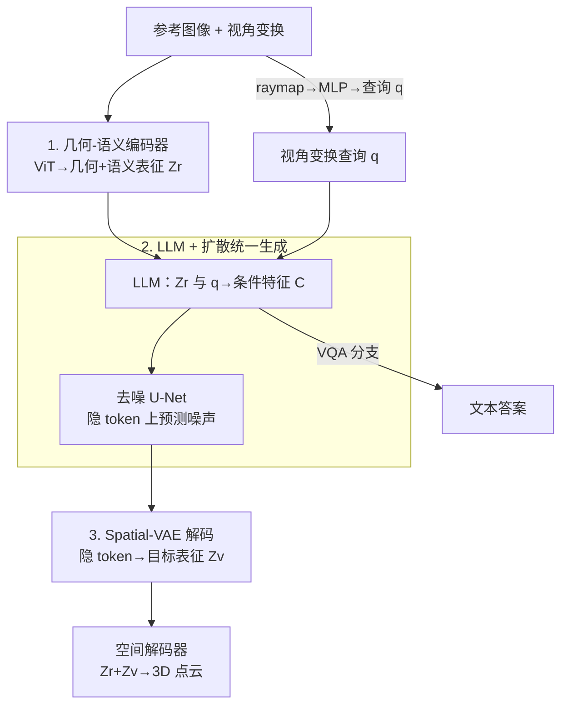

# UniUGG: Unified 3D Understanding and Generation via Geometric-Semantic Encoding

**会议**: ICLR 2026  
**OpenReview**: [https://openreview.net/forum?id=XbMp83tvK7](https://openreview.net/forum?id=XbMp83tvK7)  
**项目页**: [https://fudan-zvg.github.io/UniUGG](https://fudan-zvg.github.io/UniUGG)  
**领域**: 3D视觉 / 多模态VLM / 扩散模型  
**关键词**: 统一理解与生成, 3D场景生成, 几何-语义编码, Spatial-VAE, 空间VQA

## 一句话总结
UniUGG 是第一个面向 3D 模态的「统一理解与生成」框架：用一个几何-语义联合预训练的 ViT 编码视觉表征，再让 LLM 结合扩散模型在压缩后的隐 token 上做条件去噪，从一张参考图 + 任意视角变换「想象」出几何一致的 3D 场景，同时保留空间 VQA 能力，在 VSI-Bench 上比次优方法高 17.9%。

## 研究背景与动机
**领域现状**：2D 的「统一理解与生成」已经很成熟——主流做法是把自回归 LLM 和扩散图像解码器耦合起来，LLM 吃文本+图像、吐出一组可学习 query，回归到扩散隐空间后由扩散模型合成图像；或者干脆用 VQ tokenizer 把文本和图像统一成离散 token 自回归生成。

**现有痛点**：但这套范式搬到 3D 上几乎没人能跑通。已有的空间理解工作要么暴力——直接拿海量空间 VQA 数据微调 LLM，效果有限；要么依赖额外模态（深度图、点云、场景图），需要专门采集设备或对整个场景做显式建模，落地很难。而 3D **生成**这一侧在统一框架里基本是空白。

**核心矛盾**：作者把瓶颈归结为两个根本问题。其一是**视觉表征的局限**：当前 LLM 用的视觉编码器都是在 2D 语义任务上预训练的（CLIP、DINOv2 等），天生不会建模 3D 几何，导致空间理解上限被卡死。其二是**3D 生成与 LLM 不兼容**：LLM 靠 tokenization 做自回归，图像规整、能切成固定数量 token，但点云这类 3D 数据是不规则的，没法干净地 token 化，这个「token 化鸿沟」让 LLM 难以自回归地生成 3D。

**本文目标**：在一个 LLM 框架里同时解决这两个问题——既要有「懂 3D 几何」的视觉表征，又要有「能让 LLM 生成 3D」的可行通路。

**切入角度**：作者受 DUSt3R/MASt3R 这条多视角几何路线启发——把多视角像素对齐到统一全局坐标系，模型就能从纯 2D 输入重建 3D 并预测空间关系。这意味着「2D 输入也能学到 3D 几何」，不必依赖额外传感器。

**核心 idea**：用「几何-语义联合预训练的编码器」补齐 3D 表征短板；用「Spatial-VAE 压缩 + 扩散在隐 token 上去噪」绕开点云不可 token 化的难题，让 LLM 只需输出条件特征、把生成交给扩散模型完成。

## 方法详解

### 整体框架
UniUGG 要做的事是：给一张参考图像和一个目标视角变换，输出该视角下几何一致的 3D 场景（点云），同时还能回答空间 VQA 问题。整个系统围绕一个 LLM 展开，训练分三阶段串行进行——阶段 1 预训练几何-语义视觉编码器，阶段 2 预训练 Spatial-VAE（把视觉表征压成紧凑隐空间），阶段 3 冻结 ViT 和 VAE、只训 LLM/projector/扩散模型做统一的理解+生成。

推理时的数据流是：参考图像经 ViT 得到几何-语义表征 $Z_r$；视角变换被编码成 Plücker raymap，再过 MLP 变成变换查询 $q$；LLM 吃下 $Z_r$ 和 $q$ 产出条件特征 $C$；去噪 U-Net 在一个高斯噪声初始化的隐 token 上、以 $C$ 为条件反复去噪；得到的隐 token 由 Spatial-VAE 解码器还原成目标视角表征 $Z_v$；最后参考表征 $Z_r$ 和目标表征 $Z_v$ 一起喂给空间解码器，解码出完整 3D 场景。理解任务则直接走 LLM 的自回归 VQA 分支。

### 关键设计

**1. 几何-语义编码器预训练：让 2D 编码器同时学会几何与语义**

这一步正面回应「视觉表征不懂 3D」的痛点。骨干用 ViT-L/16，从 RADIOv2.5-L 初始化（24 层、隐维 1024），后面接一个从 MASt3R 初始化的 ViT-Base 解码器。预训练同时拉两根绳子：**几何**这一侧借用 MASt3R 框架——成对图像 $I_i, I_j$ 经共享权重编码器得到 $Z_i, Z_j$，过两层带 GeLU 的视觉 projector 后送进双向 cross-attention 解码器，回归出点图（pointmap）、置信图和稠密匹配描述子，用 MASt3R 的置信度回归损失 $L_{conf}$ 和匹配损失 $L_{match}$ 监督；同时额外挂一个 RGB head 重建颜色，用 $L_{rgb}=\lambda_{L1}\|\hat I-I\|_{L1}+\lambda_{LP}\text{LPIPS}(\hat I,I)$ 约束，让表征带上色彩感知。**语义**这一侧则把 RADIOv2.5 当 teacher 做蒸馏，对随机采样的 token 子集 $C$ 用余弦距离加 smooth-L1 的加权和对齐方向和幅度：

$$L_{KD}=\alpha\left(1-\frac{1}{n}\sum_{i\in C}\cos(z_i,\hat z_i)\right)+\beta\frac{1}{n}\sum_{i\in C}\|z_i-\hat z_i\|_{L1}.$$

和单纯做多 teacher 特征蒸馏的工作不同，这里的训练目标是「几何感知」本身（端到端的多视角几何重建），而非泛化的表征融合，因此学出来的 ViT 在 Feat2GS、深度估计、空间 VQA 上同时占优。值得一提的是，这一阶段顺手训出来的 MASt3R 解码器（含 projector 和各预测头，统称**空间解码器**）会被后续生成阶段复用——它正是把视觉表征解码回 3D 场景的那个模块。

**2. LLM + 扩散的统一生成：把不可 token 化的 3D 生成交给条件去噪**

这一步回应「3D 生成与 LLM 不兼容」的痛点。作者不强行让 LLM 自回归吐点云，而是让 LLM 只负责「理解条件、产出条件特征」，把真正的生成交给扩散模型。具体地，参考图与目标视角之间的相对变换被表示为 Plücker raymap $P\in\mathbb{R}^{N_h\times N_w\times 6}$，再经 MLP 变成查询 $q$；LLM 吃下参考表征 $Z_i$ 和 $q$，输出条件特征 $C$。目标视角表征 $Z_j$ 先被 VAE 编码成隐 token $T^j$，逐步加噪得到 $\tilde T^j_t$，去噪 U-Net 学习在条件 $C$ 下预测噪声：

$$L_{gen}=\mathbb{E}_{T^j,\epsilon\sim\mathcal N(0,1),t}\left\|\epsilon_\theta(\tilde T^j_t|C,t)-\epsilon\right\|^2.$$

推理时从纯噪声 $\tilde T_T$ 出发，按 $\tilde T_{t-1}=\tilde T_t-\epsilon_\theta(\tilde T_t|C,t)$ 反复去噪 $T$ 步，最终隐 token 经 VAE 解码器还原成目标视角表征。与此并行，LLM 还在空间 VQA 上做监督微调——给定图像表征 $Z$ 和问题 $q$，用 teacher forcing 的 token 级交叉熵 $L_{vqa}=-\sum_t\log p_\theta(a_t|Z,q,a_{<t})$ 训练自回归答题。这样「生成」和「理解」共享同一个 LLM、互不冲突，这也是统一框架的关键所在。

**3. Spatial-VAE 隐空间压缩：让高维 3D 表征可被高效稳定地生成**

直接在高维视觉表征上做扩散又贵又不稳，Spatial-VAE 就是为此设计的「中间层」。它是一个编码器-解码器结构，把图像对的视觉表征 $Z_i,Z_j\in\mathbb{R}^{N_h\times N_w\times d}$ 压成 4 维隐 token $T^i,T^j\in\mathbb{R}^{L_h\times L_w\times 4}$，再重建回 $\bar Z_i,\bar Z_j$。优化由三项构成：重建损失 $L_{mse}=\|\bar Z_i-Z_i\|^2$、KL 正则 $L_{KL}=D_{KL}(q(T^i|Z^i)\|p(T^i))+D_{KL}(q(T^j|Z^j)\|p(T^j))$、以及空间损失 $L_s$，合成 $L_{vae}=L_s+L_{mse}+\gamma L_{KL}$。

这里有个容易被忽视但很关键的设计：重建表征 $\bar Z$ 和原始表征 $Z$ 之间总有差异，直接拿预训练好的空间解码器去解码 $\bar Z$ 会「水土不服」、解出来的 3D 场景质量大跌。作者的做法是把重建表征喂回空间解码器、和 Spatial-VAE 一起端到端联合微调，让解码器适应压缩后的表征、同时反过来引导 VAE 学到对 3D 解码更友好的压缩方式。消融显示，一旦去掉这个「解码器联调」（w/o Dec. finetune），FID 从 55 飙到 150，说明它是生成成功的命门。

### 损失函数 / 训练策略
三阶段、由粗到细：**阶段 1** 在 ARKitScenes + ScanNet++（几何）和 LAION-400M（语义）混合数据上预训练编码器，8×A6000 跑约 25 小时；**阶段 2** 在 200 万共视图像对上训 Spatial-VAE（KL 权重 $\gamma=10^{-4}$），8×A6000 约 12 小时；**阶段 3** 冻结 ViT 和 VAE 编码器，分三小步训 LLM/projector/扩散——先用 LCS-558K 对齐 projector，再在 240 万空间指令数据 + 200 万共视对上联合优化，最后在 SPAR/EMOVA + 额外 200 万空间样本上微调增强泛化。LLM 用 Qwen2.5-3B-Instruct，扩散用 Stable-Diffusion-v1.5，AdamW + cosine 衰减、global batch 256。

## 实验关键数据

### 主实验
空间理解（VSI-Bench / BLINK / 3DSRBench / SPAR，对比开源 LMM、GPT-4o 与 2D 统一框架 Janus-Pro）：

| 方法 | VSI | BLINK | 3DSR | SPAR-Avg |
|------|-----|-------|------|----------|
| GPT-4o | 34.0 | **60.0** | 44.2 | 38.1 |
| InternVL2.5-8B | 32.5 | 54.8 | 50.9 | 36.3 |
| Qwen2.5-VL-7B | 30.3 | 56.4 | 48.4 | 33.1 |
| Janus-Pro-7B | - | 40.5 | **53.7** | 28.6 |
| **UniUGG-3B (本文)** | **40.1** | 43.6 | 52.1 | **47.2** |

VSI-Bench 上仅 3B 参数就比次优高 17.9%，SPAR 平均也大幅领先；BLINK 偏纯语义任务上不及 GPT-4o，符合其「空间专长」的定位。

3D 生成质量（投影回 2D 后用 FID/KID/LPIPS 对比，含消融）：

| ID | 配置 | ARKit FID↓ | ARKit KID↓ | ScanNet++ FID↓ |
|----|------|-----------|-----------|----------------|
| (a) | w/ RADIO 编码器 | 64.16 | .0518 | 73.69 |
| (b) | w/ MASt3R 编码器 | 81.18 | .0691 | 86.79 |
| (e) | CUT3R | 138.54 | .1128 | 130.76 |
| (f) | LVSM | 269.45 | .3088 | 414.63 |
| **(g)** | **UniUGG (本文)** | **55.01** | **.0425** | **55.64** |

### 消融实验

| 配置 | ARKit FID↓ | 说明 |
|------|-----------|------|
| (g) Full UniUGG | 55.01 | 完整模型 |
| (a) w/ RADIO（纯语义编码器） | 64.16 | 只有语义、缺几何 |
| (b) w/ MASt3R（纯几何编码器） | 81.18 | 只有几何、缺语义 |
| (c) w/o Dec. finetune | 149.97 | 不联调空间解码器，质量崩塌 |
| (d) w/o Diffusion | 87.51 | LLM 直接回归目标表征 |

### 关键发现
- **几何和语义必须融合**：单用 RADIO（语义）或 MASt3R（几何）都明显劣于二者合一（55 vs 64 vs 81），印证「只加一种信息不够」。
- **空间解码器联调是命门**：去掉后 FID 从 55 暴涨到 150，是所有消融里掉得最狠的，说明压缩表征与解码器之间的「适配」比压缩本身更重要。
- **隐 token + 扩散不可省**：让 LLM 直接预测目标表征（w/o Diffusion）FID 退到 87；连同 Spatial-VAE 一起去掉、在原始高维表征上训生成则直接失败，证明「压缩 + 条件去噪」这条通路是 3D 生成跑通的关键。
- **空间增强不牺牲通用语义**：UniUGG 编码器在 RealWorldQA、SEED-I 等通用 QA 上仍有竞争力，说明几何注入没有损害语义泛化。

## 亮点与洞察
- **「LLM 出条件、扩散做生成」绕开 token 化鸿沟**：不去硬啃点云的自回归 token 化，而是让 LLM 只产条件特征、把不规则 3D 的生成交给扩散在隐空间完成——这是把 2D 统一范式迁到 3D 的关键解耦，思路可复用到任何「目标模态难 token 化」的统一生成场景。
- **空间解码器是预训练的「副产品」却被一鱼两吃**：编码器预训练时为做多视角几何而训的 MASt3R 解码器，直接被生成阶段拿来把表征解码成 3D 场景，省掉了单独设计 3D 解码器的成本。
- **用 Plücker raymap 把「视角变换」编码成 LLM 能吃的条件**：把抽象的相机位姿/视角变化转成 6 维 raymap 再过 MLP 成 query，让 LLM 天然支持「按指定视角想象」，这种几何条件注入方式很巧。
- **3B 小模型打过 GPT-4o 的空间任务**：在 VSI-Bench/SPAR 上以小博大，说明「表征里有没有 3D 几何」比「模型大不大」对空间理解更决定性。

## 局限与展望
- 作者承认：目前不支持**语言驱动的可控生成**，也不能对生成内容做自由编辑；作为统一 3D 建模的初步探索，还不支持**多轮交互式**的场景生成与编辑。
- 在 SQA3D/ScanQA/ScanRefer 等纯 3D benchmark 上，相比「3D 增强」方法仍有差距——因为 UniUGG 设计为从 2D 多视角输入学几何，并不直接吃点云/网格。
- 生成依赖参考图 + 视角变换这一固定输入形式，对极端视角变换的鲁棒性、以及生成的几何一致性边界还需更系统的评估。
- 个人看法：三阶段训练 + 多数据源（ARKit/ScanNet++/LAION/SPAR…）的流水线偏重，复现门槛较高；隐 token 仅 4 维，压缩率与生成上限之间的权衡值得进一步探究。

## 相关工作与启发
- **vs 2D 统一框架（Janus-Pro 等）**：它们把理解+生成统一在 2D 图像层面，UniUGG 第一个把这套统一范式推到 3D/空间层面——既答空间 VQA，又按视角生成 3D 场景；在空间任务（VSI/SPAR）上大幅领先，但在纯 2D 语义任务上不占优。
- **vs 几何路线（DUSt3R/MASt3R/CUT3R/VGGT）**：这些方法擅长多视角几何重建但缺语义、难做语言引导；UniUGG 复用其几何训练范式，却额外注入语义蒸馏并接上 LLM，从「重建已观测」走向「想象未观测」。消融中 CUT3R/LVSM 的生成 FID 远高于本文，正因为它们缺乏「想象」能力。
- **vs 多 teacher 蒸馏（RADIO 系列）**：同样想融合语义与几何，但目标是通用表征融合；本文的训练目标专门面向「空间统一」的几何感知，因此在 3D awareness 代理任务（Feat2GS）上更强。

## 评分
- 新颖性: ⭐⭐⭐⭐⭐ 第一个面向 3D 模态的统一理解+生成框架，几何-语义编码与「LLM 出条件、扩散隐空间生成」的解耦都很有想法。
- 实验充分度: ⭐⭐⭐⭐ 覆盖表征/理解/生成三类评测且消融到位，但纯 3D benchmark 上仍有短板、缺可控生成的量化。
- 写作质量: ⭐⭐⭐⭐ 两大瓶颈—两个解法的对应关系清晰，三阶段训练讲得明白，图表信息量大。
- 价值: ⭐⭐⭐⭐⭐ 为「统一 3D 建模」打开了一条可行通路，空间理解上以小博大，工程与思路都有可迁移性。

<!-- RELATED:START -->

## 相关论文

- [\[ICLR 2026\] Omni-View: Unlocking How Generation Facilitates Understanding in Unified 3D Model based on Multiview images](omni-view_unlocking_how_generation_facilitates_understanding_in_unified_3d_model.md)
- [\[ICLR 2026\] Positional Encoding Field](positional_encoding_field.md)
- [\[ICLR 2026\] One2Scene: Geometric Consistent Explorable 3D Scene Generation from a Single Image](one2scene_geometric_consistent_explorable_3d_scene_generation_from_a_single_imag.md)
- [\[CVPR 2026\] Uni3R: Unified 3D Reconstruction and Semantic Understanding via Generalizable Gaussian Splatting from Unposed Multi-View Images](../../CVPR2026/3d_vision/uni3r_unified_3d_reconstruction_and_semantic_understanding_via_generalizable_gau.md)
- [\[ECCV 2024\] nuCraft: Crafting High Resolution 3D Semantic Occupancy for Unified 3D Scene Understanding](../../ECCV2024/3d_vision/nucraft_crafting_high_resolution_3d_semantic_occupancy_for_unified_3d_scene_unde.md)

<!-- RELATED:END -->
