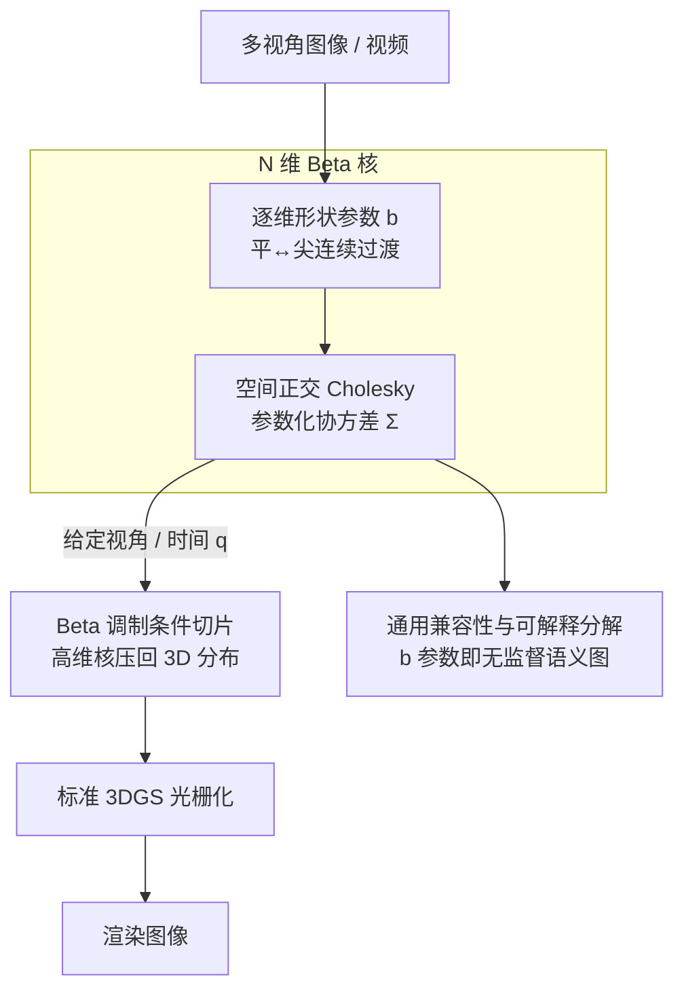

# Universal Beta Splatting

- **会议**: ICLR 2026
- **arXiv**: [2510.03312](https://arxiv.org/abs/2510.03312)
- **代码**: [项目页面](https://rongliu-leo.github.io/universal-beta-splatting/)
- **领域**: 3D 视觉 / 神经渲染
- **关键词**: 3D Gaussian Splatting, Beta Kernel, N-Dimensional, View-Dependent, Dynamic Scene, Real-Time Rendering

## 一句话总结

提出 Universal Beta Splatting (UBS)，将 3D 高斯 Splatting 推广为 N 维各向异性 Beta 核，通过逐维度形状控制在单一表示中统一建模空间几何、视角依赖外观和场景动态，实现了可解释的场景分解和 SOTA 渲染质量。

## 研究背景与动机

3D 高斯 Splatting (3DGS) 通过显式基元实现了实时渲染，但高斯核固定的钟形轮廓存在根本限制：

**空间维度**：锐利边界需要大量小基元，效率低

**角度维度**：视角依赖效果需要额外的球谐编码（48参数），碎片化表示

**时间维度**：动态场景需要额外变形网络，增加复杂度

**核心洞察**：不同场景性质需要不同的核行为——空间几何需要自适应锐度，角度外观从漫反射到镜面反射不等，时间动态从静态到快速运动。高斯核在所有维度强制相同的对称轮廓，而 Beta 核可以提供逐维度的形状控制。

## 方法详解

### 整体框架

UBS 要解决的是 3DGS 钟形高斯核「形状固定」的根本约束：锐利边界要堆大量小基元，视角依赖外观要外挂球谐、动态场景要外挂变形网络。UBS 把它换成一个可逐维度调形状的 **N 维各向异性 Beta 核**，让空间几何、视角依赖外观和场景动态都用同一种基元表示。整条管线是这样转的：每个基元在统一的 $N$ 维分布里同时携带位置、协方差和一组 Beta 形状参数 $\mathbf{b}$，其中协方差用空间正交 Cholesky 分块参数化以保住 3DGS 的几何结构；渲染时给定当前视角/时间 $\mathbf{q}$，先把非空间维度做 Beta 调制的条件切片压回 3D 分布，再走与 3DGS 完全一致的光栅化管线输出图像。因此它既继承了实时渲染，又能在每个维度上自适应锐度；而学到的 $\mathbf{b}$ 还顺带给出一张无监督的场景分解图。

### 关键设计

**1. N 维 Beta 核：用逐维度形状参数取代固定钟形轮廓**

高斯核在所有维度强制相同的对称轮廓，锐利边界要堆大量小基元，视角与时间还得外挂球谐和变形网络。UBS 把基元密度写成 $\sigma(\mathbf{x}, \mathbf{q}) = \mathcal{B}(\mathbf{x}, \mathbf{q}; \boldsymbol{\mu}, \boldsymbol{\Sigma}, \mathbf{b}) \cdot o$，其中 $\mathbf{x} \in \mathbb{R}^3$ 是空间坐标，$\mathbf{q} \in \mathbb{R}^{N-3}$ 编码视角/时间等额外维度，$\mathbf{b} \in \mathbb{R}^{N-2}$ 控制每个维度的 Beta 形状。关键在于每维的 Beta 指数 $\beta_i = 4\exp(b_i)$ 可以独立调节：负的 $b_i$ 给出平坦轮廓，适合光滑表面、静态元素、漫反射；正的 $b_i$ 给出尖锐峰值，适合精细纹理、快速运动、镜面反射。于是同一表示就能按场景性质在「平」与「尖」之间连续过渡，不再受单一对称核拖累。

**2. 空间正交 Cholesky 参数化：在升到 N 维时保住 3DGS 的几何结构与向后兼容**

直接对 $N$ 维协方差做无约束分解会破坏空间子块的旋转-缩放语义，也丢掉对 3DGS 权重的兼容。UBS 把协方差的 Cholesky 因子写成分块下三角形式

$$\mathbf{L} = \begin{pmatrix} \mathbf{R}_x \text{diag}(\mathbf{s}_x) & \mathbf{0} \\ \mathbf{L}_{qx} & \mathbf{L}_q \end{pmatrix}$$

左上角 $\mathbf{R}_x \in SO(3)$（用一阶 Taylor 近似保持正交）配 $\text{diag}(\mathbf{s}_x)$ 复用 3DGS 的旋转-缩放参数化，$\mathbf{L}_{qx}$ 专门编码空间与额外维度之间的跨维相关性，$\mathbf{L}_q$ 描述额外维度自身。这样既保留了空间几何的可解释结构，又能在 $\mathbf{q}$ 维度退化时无缝回落到原始 3DGS。

**3. Beta 调制条件切片：把高维核压回 3D 渲染，并在压回时注入 Beta 调形**

给定一帧的视角/时间 $\mathbf{q}$，需要从 $N$ 维基元得到当前要光栅化的 3D 分布。UBS 用条件高斯切片得到

$$\boldsymbol{\mu}_{x|q} = \boldsymbol{\mu}_x + \boldsymbol{\Sigma}_{xq} \boldsymbol{\Sigma}_q^{-1} \text{diag}(\tilde{\boldsymbol{\beta}}_q) (\mathbf{q} - \boldsymbol{\mu}_q)$$

$$\boldsymbol{\Sigma}_{x|q} = \boldsymbol{\Sigma}_x - \boldsymbol{\Sigma}_{xq} \boldsymbol{\Sigma}_q^{-1} \text{diag}(\tilde{\boldsymbol{\beta}}_q) \boldsymbol{\Sigma}_{qx}$$

与标准条件高斯的差别就在 $\text{diag}(\tilde{\boldsymbol{\beta}}_q)$ 这一项——它把第 1 点的 Beta 形状参数施加到非空间维度上，让条件均值和协方差随 $\mathbf{q}$ 的偏移按 Beta 形状而非固定线性方式变化。不透明度也同步被 Beta 调制：$o(\mathbf{q}) = o \prod_{i=1}^C (1 - d_i)^{4\beta_{q_i}}$，其中 $d_i = \tanh(d_i^{raw}) \in [0,1)$ 把逐维度的 Mahalanobis 距离映射到有界值，保证基元在远离 $\mathbf{q}$ 中心时不透明度平滑衰减且有界。

**4. 通用兼容性与可解释分解：同一组 Beta 参数既统一了已有方法，又免费给出场景分解**

这一点是前三点的两个直接红利。一方面，因为 Beta 核以高斯为极限，只要设定维度数 $N$ 和形状参数 $\mathbf{b}$ 就能复现一族已有基元，等于给整族方法提供了统一上层框架：

| $\mathbf{b}$ 设置 | 等价方法 |
|---------|---------|
| $N=3$, $b_x=0$ | ≈ 3DGS |
| $N=3$, $b_x \neq 0$ | ≈ DBS |
| $N=6$, $\mathbf{b}=\mathbf{0}$ | ≈ 6DGS |
| $N=7$, $\mathbf{b}=\mathbf{0}$ | ≈ 7DGS |

由于 Beta 参数初始化为零就从高斯极限起步，模型天然带性能下界，再逐步学到非零形状去超越基线。这套统一参数化也带来明显减参：静态场景比 3DGS 少 **41%** 参数（不再需要 48 参数球谐），动态场景比 4DGS 少 **73%** 参数。另一方面，由于每个维度的 $b$ 直接对应「平/尖」的物理含义，训练收敛后无需任何额外监督就能读出场景结构：空间 $b_x$ 负值对应光滑表面、正值对应精细纹理；角度 $b_d$ 负值对应漫反射、正值对应镜面反射；时间 $b_t$ 负值对应静态元素、正值对应动态元素。也就是说，几何、外观和运动的分解被免费编码进了同一组形状参数里。

### 损失函数

训练目标在 3DGS 的重建项基础上加两个正则：

$$\mathcal{L} = (1-\lambda_{SSIM})\mathcal{L}_1 + \lambda_{SSIM}\mathcal{L}_{SSIM} + \lambda_o \sum_i |o_i| + \lambda_\Sigma \sum_i \|\mathbf{s}_i\|_1$$

不透明度的 $\ell_1$ 正则确保 MCMC 致密化有效地裁剪冗余基元，尺度惩罚则促进基元重定位到更需要它们的区域。

## 实验

### 静态场景

**NeRF Synthetic**（UBS-6D vs 3DGS vs 6DGS）：

| 场景 | 3DGS PSNR | 6DGS PSNR | UBS-6D PSNR |
|------|-----------|-----------|-------------|
| chair | 35.60 | 35.55 | **36.72** |
| ficus | 35.49 | 34.62 | **36.90** |
| materials | 30.50 | 30.63 | **32.90** |
| lego | 36.06 | 35.22 | **36.95** |

PSNR 提升最高达 **+8.27 dB**（6DGS-PBR 数据集）。

### 动态场景

**D-NeRF 和 7DGS-PBR**（UBS-7D vs 4DGS vs 7DGS）：
- PSNR 提升最高达 **+2.78 dB**
- 在复杂时空角度关联场景（心脏运动、日光变化、半透明变形）上优势明显

### 关键发现

1. **Beta 参数初始化为零**保证从高斯极限开始收敛
2. 空间正交 Cholesky 的一阶近似与精确旋转精度相当，计算更快
3. MCMC 优化策略对 Beta 核同样有效
4. 实时渲染性能与 3DGS 相当

### 训练效率

- 30K 迭代
- 静态：单张 RTX 4090，约 8-10 分钟
- 动态：单张 V100，与 4DGS/7DGS 基线一致

## 亮点

1. **统一框架**：单一 Beta 核基元同时处理空间/角度/时间，取代多种专用编码
2. **向后兼容**：Beta=0 时退化为高斯，保证性能下界
3. **无监督分解**：学习到的 Beta 参数自然分离几何、外观和运动
4. **大幅减参**：41-73% 参数减少，同时性能提升
5. **实时渲染**：完整 CUDA 加速实现

## 局限性

1. N 维 Cholesky 参数化的参数数量随维度增长
2. Beta 核的有界支撑在极远场可能需要更多基元
3. 目前仅验证到 7 维，更高维度的效果待考
4. 训练时需要 batch size 4 处理动态场景（显存消耗较大）
5. 一阶旋转近似在极端旋转角度下可能不够精确

## 相关工作

- **核设计替代**：GES, TNT-GS, Half-GS, Disc-GS 修改 3D 高斯；DBS 引入 3D Beta 核
- **高维高斯**：6DGS（空间+视角）、7DGS（空间+视角+时间）通过条件分布建模
- **动态场景**：D-NeRF 用变形场；4DGS 直接扩展时间维度
- **替代基元**：3D Convex Splatting, Triangle Splatting 等

## 评分

- **创新性**: ⭐⭐⭐⭐⭐ — N 维 Beta 核统一框架是优雅的理论贡献
- **实用性**: ⭐⭐⭐⭐⭐ — 即插即用兼容性 + 实时渲染
- **清晰度**: ⭐⭐⭐⭐ — 数学推导清晰，但符号较多
- **意义**: ⭐⭐⭐⭐⭐ — 为辐射场渲染建立了通用基元框架

<!-- RELATED:START -->

## 相关论文

- [\[CVPR 2025\] DUNE: Distilling a Universal Encoder from Heterogeneous 2D and 3D Teachers](../../CVPR2025/3d_vision/dune_distilling_a_universal_encoder_from_heterogeneous_2d_and_3d_teachers.md)
- [\[ICCV 2025\] SplatTalk: 3D VQA with Gaussian Splatting](../../ICCV2025/3d_vision/splattalk_3d_vqa_with_gaussian_splatting.md)
- [\[ICLR 2026\] UFO-4D: Unposed Feedforward 4D Reconstruction from Two Images](ufo-4d_unposed_feedforward_4d_reconstruction_from_two_images.md)
- [\[ICLR 2026\] Reducing Class-Wise Performance Disparity via Margin Regularization](reducing_class-wise_performance_disparity_via_margin_regularization.md)
- [\[ICLR 2026\] Topology-Preserved Auto-regressive Mesh Generation in the Manner of Weaving Silk](topology-preserved_auto-regressive_mesh_generation_in_the_manner_of_weaving_silk.md)

<!-- RELATED:END -->
