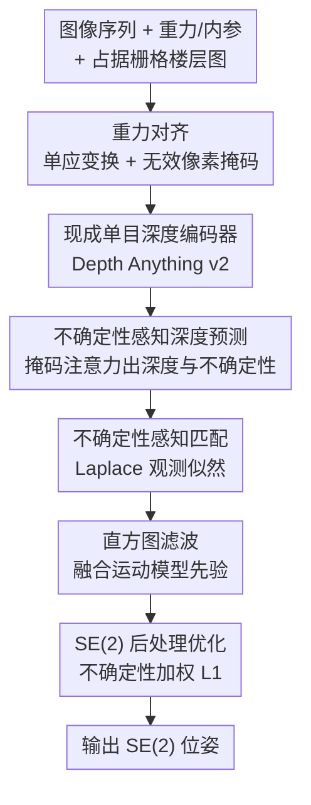

# UnLoc: Leveraging Depth Uncertainties for Floorplan Localization

**会议**: ICLR 2026  
**OpenReview**: [https://openreview.net/forum?id=TNfjckDeh4](https://openreview.net/forum?id=TNfjckDeh4)  
**代码**: https://github.com/matthias-wueest/UnLoc  
**领域**: 3D视觉 / 视觉定位  
**关键词**: 楼层图定位、单目深度、不确定性建模、直方图滤波、序列定位

## 一句话总结
UnLoc 把单目预测的"楼层图深度"显式建模成带不确定性的 Laplace 分布，再用现成的预训练单目深度模型（Depth Anything v2）替换掉逐场景训练的专用深度网络，在序列视觉楼层图定位上对 SOTA（F3Loc）实现大幅提升——在真实数据集 LaMAR HGE 的 15 帧短序列上召回率提升 42.2 倍。

## 研究背景与动机
**领域现状**：室内相机定位是 AR / 机器人的基础问题。传统方案依赖预建 3D 模型或大规模图像库，存储开销大、维护成本高，难以扩展到新场景。相比之下，**楼层图（floorplan）** 是一种轻量、易获取、且对外观变化（家具挪动、光照变化）天然鲁棒的 2D 表示，成为室内定位的理想地图。其中 F3Loc 是当前最强的序列楼层图定位方法：它用单目深度估计算出"到最近占据区域的楼层图深度"，再用直方图滤波把多帧观测随时间融合，在多个数据集上显著超过此前所有 baseline。

**现有痛点**：F3Loc 有两个限制实际部署的硬伤。其一是**缺乏不确定性建模**——它假设所有深度预测精度一致，但室内场景里玻璃墙、敞开的门洞、大片无纹理墙面会让深度估计极不可靠；融合序列时这些错误深度被当成可信观测一视同仁地参与，直接污染位姿估计。其二是**深度网络绑定场景**——F3Loc 为每个数据集/环境单独训练一个专用深度网络，为每个新环境采集深度数据重训既不现实、也违背"快速部署"的诉求。

**核心矛盾**：定位的鲁棒性依赖深度预测的质量，但深度预测在挑战性区域必然不可靠，而旧方法既没法"知道"自己哪里不可靠、也没法在融合时区别对待；同时"专用深度网络"把方法锁死在训练过的场景里，泛化能力差。

**本文目标**：(1) 给楼层图深度预测装上不确定性，让序列融合时按可信度加权；(2) 摆脱逐场景训练，直接复用大规模预训练单目深度模型。

**切入角度**：把每一列图像对应的楼层图深度**不再看作一个确定值，而看作一个概率分布**——以预测深度为中心、以预测的不确定性为尺度参数的 Laplace 分布。Laplace 的重尾对大误差更鲁棒，且能闭式计算似然，恰好适配实时直方图滤波。

**核心 idea**：用"带不确定性的 Laplace 深度分布 + 现成预训练单目深度模型"替换 F3Loc 的"等权重深度 + 逐场景专用网络"，从而在融合阶段下调不可靠观测的权重、并把方法变成即插即用。

## 方法详解

### 整体框架
UnLoc 要解决的是：给定一段 RGB 图像序列、帧间相对位姿、重力方向、相机内参，以及一张**只有占据栅格、没有语义标注**的楼层图，估计相机在 2D 楼层图坐标系下的 SE(2) 位姿 $s_t=[s_{x,t}, s_{y,t}, s_{\phi,t}]$（位置 + 朝向）。

整条管线在每个时间步 $t$ 这样流转：先把图像按重力方向对齐（顺带产生一张标记无效像素的掩码），送入预训练单目深度编码器提特征；特征 + 掩码经一个掩码注意力模块，输出两条 1D 向量——楼层图深度 $\hat{d}_t$ 和对应的不确定性 $\hat{b}_t$；这两条向量被解释成一组等角射线，与楼层图占据图做**不确定性感知匹配**，得到所有候选位姿的观测似然体；直方图滤波把该似然与上一帧通过运动模型传播来的先验信念融合，得到当前后验；最后对最近 $k$ 帧做一次轻量的 SE(2) 后处理优化，消除累积漂移，输出最可能的位姿。

其中"重力对齐"和"深度编码器→掩码注意力"中提特征的部分是通用脚手架：重力对齐用相机的滚转 $\psi$ 与俯仰 $\theta$ 构造旋转 $R_{cg}=R_y(\theta)\cdot R_x(\psi)$，再用单应 $H=K\cdot R_{gc}\cdot K^{-1}$ 把图像 warp 到重力对齐坐标系，同时产出标记 warp 后无效像素的二值掩码（手机/头显的重力方向与内参通常可直接读传感器，缺失时可用 GeoCalib 估计）。真正的贡献集中在下面四个设计上。

### 关键设计

**1. 现成预训练单目深度编码器：摆脱逐场景训练**

这一设计直接打掉 F3Loc"每个环境重训专用深度网络"的痛点。以往视觉楼层图定位方法（含 F3Loc）多用 ImageNet 分类预训练的编码器（如 ResNet-50），但分类任务和"楼层图深度估计"相去甚远。作者的观察是：在大规模深度数据上预训练的单目深度编码器，本身就给楼层图深度预测提供了更好的特征。于是 UnLoc 把深度模型当成**即插即用模块**，选用 Depth Anything v2（室内微调版）的编码器，取最后一层特征做双线性插值对齐到掩码注意力所需的空间尺寸。整个管线对具体深度网络不可知，将来有更强的模型可以无缝替换。消融实验证实，同尺寸下单目深度编码器（DepthPro、Depth Anything v2-L）确实优于通用编码器 DINOv2，且在 Depth Anything v2 内部性能随模型规模正向扩展——这说明"用深度任务的先验来做深度"这条直觉是对的。

**2. 不确定性感知深度预测：把深度建模成 Laplace 分布**

这是全文核心，对应 F3Loc"假设所有深度等可信"的痛点。UnLoc 用一个受 F3Loc 启发的掩码注意力机制，从插值后的编码器特征预测出两条 1D 向量：深度 $\hat{d}_t$ 和不确定性 $\hat{b}_t$。具体地，编码器特征先经一层卷积降通道作为注意力的 key/value，1D query 由平均池化得到，query 的位置编码来自 1D 坐标、key/value 的来自对应 2D 图像坐标；重力对齐掩码被施加进注意力，让模型只关注图像里可观测的区域。注意力输出再过两条并行全连接层，分别吐出 $\hat{d}_t$ 与 $\hat{b}_t$。训练时最小化 Laplace 分布的负对数似然：

$$L_d=\sum_{i=1}^{D}\left(\log(\hat{b}_i)+\frac{|\hat{d}_i-d_i(s)|}{\hat{b}_i}\right)$$

其中 $d_i(s)$ 是真值位姿下第 $i$ 列的真值楼层图深度。这个损失一边鼓励深度预测准、一边让模型为难以预测的列主动输出大不确定性；对数项 $\log(\hat{b}_i)$ 则防止模型把不确定性放飞到无穷大来逃避惩罚。建模的是 aleatoric（数据）不确定性——专门捕捉玻璃面、门洞、无纹理墙这类场景固有的观测歧义；作者出于实时直方图滤波的计算效率考虑，没有去估更贵的 epistemic 不确定性。

**3. 不确定性感知匹配 + 直方图滤波：让不可信观测自动降权**

有了深度与不确定性，就要把它们变成对所有候选位姿的观测似然，再随时间融合。匹配阶段把每条预测深度看作从一个分布里采样而来，观测似然定义为各射线 Laplace 分布的连乘：

$$p(o_t\mid s_t)=\prod_{j=1}^{R}\frac{1}{2\tilde{b}_{t,j}}\exp\left(-\frac{|\tilde{d}_{t,j}-d_j(s_t)|}{\tilde{b}_{t,j}}\right)$$

这里 $\tilde{d}_{t,j}$、$\tilde{b}_{t,j}$ 是在射线角 $\alpha_j$ 处由 $\hat{d}_t$、$\hat{b}_t$ 插值得到的深度与不确定性，$d_j(s_t)=r_j(s_t)\cdot\cos(\alpha_j)$ 是从位姿 $s_t$ 沿 $\alpha_j$ 方向射线长度算出的楼层图深度，$R$ 是射线数。选 Laplace 有两个理由：一是重尾比高斯对挑战性室内场景里常见的大误差更鲁棒；二是闭式似然计算适配实时滤波。关键机制在于——**当某射线不确定性 $\tilde{b}_{t,j}$ 高时，对应 Laplace 分布变平**，该观测在位姿估计里被自然下调权重，于是滤波器更信赖那些自信的预测、对不靠谱的预测保持鲁棒。融合阶段用直方图滤波（沿用 F3Loc 的实现思路）按贝叶斯公式更新后验：

$$p(s_t\mid o_t,t_t)=\frac{1}{Z}\sum_{s_t}p(s_t\mid s_{t-1},t_t)\cdot p(o_t\mid s_t)$$

其中运动模型 $s_t=s_{t-1}\oplus t_t+\omega_t$（$\omega_t$ 为高斯转移噪声）给出转移概率 $p(s_t\mid s_{t-1},t_t)$，实现上把平移与旋转解耦成两个滤波器以提效。值得强调的是：深度不确定性 $\hat{b}_t$ 正是通过似然项 $p(o_t\mid s_t)$ 直接作用于这条后验更新——这就是"不确定性感知"贯穿到序列融合的落点。

**4. SE(2) 后处理优化：用不确定性加权抹掉累积漂移**

主管线已经能给出准确位姿，但残余漂移和与局部深度的失配会随时间累积。UnLoc 在序列末尾对最近 $k$ 帧（实验取 $k=10$）做一次轻量优化：先取末帧最优位姿 $\hat{s}_T=\arg\max_{s_T}p(s_T\mid o_T,t_T)$，再用无噪声的逆运动模型 $\hat{s}_t=\hat{s}_{t+1}\ominus t_{t+1}$ 反推出这 $k$ 帧轨迹；然后引入一个作用于 XY 平面的全局 SE(2) 校正 $\Delta s(\theta,p)$（一个面内旋转 + 平移），把整段轨迹刚性地拧一下：$\tilde{s}_t(\theta,p)=\Delta s(\theta,p)\cdot\hat{s}_t$。优化目标是这 $k$ 帧所有射线上、预测深度与楼层图深度之差的**不确定性加权 L1**：

$$L_{post}(\theta,p)=\sum_{t=T-k+1}^{T}\sum_{j}\frac{1}{\tilde{b}_{t,j}}\cdot|\tilde{d}_{t,j}-d_j(\tilde{s}_t(\theta,p))|$$

权重 $1/\tilde{b}_{t,j}$ 让高不确定性的帧对优化贡献更小，使精修对噪声预测保持鲁棒；只用全局 SE(2) 校正（而非逐帧自由变形）保证了在局部窗口里强制全局一致、又足够轻量。用梯度优化器解出 $(\theta^*,p^*)$ 即可。实验里这一步对短序列收益尤其大——15 帧序列上后处理带来约 16 个点的 SR 提升，甚至超过用真值深度的版本。

### 损失函数 / 训练策略
训练只优化深度预测分支的 Laplace 负对数似然 $L_d$（式上文），监督来自真值位姿下的真值楼层图深度，$D$ 为预测深度的图像列数。直方图滤波与后处理优化均不含可学习参数（后处理是测试时的梯度优化）。训练集为 Gibson(f)（24,779 段 4 帧序列）；真实场景在 LaMAR HGE 上用 12 个 session（3,820 张图）训练。

## 实验关键数据

### 主实验
评测三个数据集：合成的 Gibson(t)（118 条轨迹）、真实的 LaMAR HGE（约 22,500 ㎡、窄 FoV 48°、遮挡从低到高）及其裁剪版。指标为成功率 SR（最近 10 帧落在真值 X 米半径内算成功）与 RMSE。

Gibson(t) 上不同序列长度的 SR@1m（%）：

| 方法 | T=100 | T=50 | T=35 | T=20 | T=15 |
|------|-------|------|------|------|------|
| GT Depth（上界） | 100.0 | 98.7 | 91.0 | 76.0 | 72.0 |
| F3Loc fusion | 94.6 | 94.6 | 69.4 | 46.0 | 41.8 |
| F3Loc mono | 89.2 | 70.5 | 55.9 | 34.0 | 28.4 |
| F3Loc mono + Depth Anything v2 | 94.6 | 89.7 | 76.6 | 60.5 | 56.3 |
| UnLoc w/o 后处理 | 97.3 | 92.3 | 88.3 | 70.5 | 65.3 |
| **UnLoc** | **97.3** | **94.9** | **92.8** | **86.5** | **81.3** |

UnLoc 在 15 帧短序列上比 F3Loc mono 提升 52.9 个点，且短序列 SR 始终 >80%，而 F3Loc 至少要 50 帧才到这水平——短序列定位对"上线即定位"的实时应用尤为关键。

LaMAR HGE（真实、最具挑战）上 SR@1m（%）：

| 方法 | T=100 | T=50 | T=35 | T=20 | T=15 |
|------|-------|------|------|------|------|
| GT Depth（上界） | 100.0 | 91.7 | 85.7 | 73.1 | 56.5 |
| F3Loc mono | 36.4 | 16.7 | 5.7 | 1.6 | 1.2 |
| F3Loc mono + Depth Anything v2 | 100.0 | 66.7 | 42.9 | 23.8 | 9.4 |
| UnLoc w/o 后处理 | 100.0 | 75.0 | 60.0 | 36.5 | 20.0 |
| **UnLoc** | **100.0** | **75.0** | **74.3** | **63.5** | **50.6** |

15 帧序列 SR 从 F3Loc 的 1.2% 提到 50.6%（42.2 倍），100 帧从 36.4% 提到 100%（2.7 倍）。

### 消融实验
LaMAR HGE 上不同编码器、加/不加不确定性的 SR@1m（%，无后处理）：

| 编码器 | T=100 | T=50 | T=35 | T=20 | T=15 |
|--------|-------|------|------|------|------|
| DINOv2 (L) | 90.9 | 45.8 | 20.0 | 9.5 | 3.5 |
| DINOv2 (L) w/ 不确定性 | 100.0 | 54.2 | 31.4 | 15.9 | 5.9 |
| DepthPro | 90.9 | 62.5 | 40.0 | 17.5 | 4.7 |
| DepthPro w/ 不确定性 | 100.0 | 70.8 | 51.4 | 31.7 | 14.1 |
| Depth Anything v2 (B) | 90.9 | 62.5 | 28.6 | 12.7 | 2.4 |
| Depth Anything v2 (B) w/ 不确定性 | 100.0 | 66.7 | 42.9 | 30.2 | 12.9 |
| Depth Anything v2 (L) | 100.0 | 66.7 | 42.9 | 23.8 | 9.4 |
| Depth Anything v2 (L) w/ 不确定性 | 100.0 | 75.0 | 60.0 | 36.5 | 20.0 |

### 关键发现
- **不确定性建模对每个编码器都涨点**：无论 DINOv2、DepthPro 还是各尺寸 Depth Anything v2，加上不确定性后 SR 全线提升。尤其 base 模型 + 不确定性可逼平 large 模型——不确定性估计能"补偿"小模型，且不增加额外计算。
- **后处理对短序列收益最大**：Gibson 15 帧上后处理带来约 16 个点 SR 提升，甚至超过 GT 深度版本；两项改进（不确定性 + 后处理）互补叠加。
- **跨场景泛化**：在 LaMAR CAB（用 HGE 训练的模型迁移到另一栋楼）上，UnLoc 在 100 帧上仍有 50% SR，而 F3Loc 完全失败（0%），证明摆脱逐场景训练带来的泛化收益。
- **代价**：用现成大深度模型让单帧深度预测变慢（LaMAR 上约 0.18s/帧、匹配约 0.88s/帧），但作者认为实际中较低帧率可接受，且 UnLoc 用更少帧就能准定位。

## 亮点与洞察
- **把"深度等权重"这一被忽视的隐性假设显式拆掉**：UnLoc 最"啊哈"的点在于指出 F3Loc 把所有深度当同等可信是问题根源，并用一个 Laplace 尺度参数就让滤波器学会"对玻璃墙/门洞的预测少信一点"——机制极简却直击痛点。
- **不确定性一以贯之**：同一个 $\hat{b}_t$ 既进观测似然（式 1）影响滤波后验，又进后处理的加权 L1（式 8），训练目标也是 Laplace NLL，三处共用一套不确定性，设计自洽优雅。
- **即插即用的深度模型**：把单目深度网络解耦成可替换模块，是个可直接迁移到其他几何定位/SLAM 任务的工程范式——随基础深度模型进步而自动受益，无需重训。
- **小模型 + 不确定性 ≈ 大模型**：消融里 base+不确定性逼平 large，提示在算力受限的移动端，"补不确定性"可能比"换大模型"更划算。

## 局限与展望
- **只建模 aleatoric 不确定性**：作者为实时性放弃了 epistemic（模型）不确定性，而后者恰恰对分布外/全新场景最有用，留作未来工作。
- **依赖外部输入**：方法需要重力方向、相机内参、帧间相对位姿（ego-motion）等，虽然手机/头显多可提供或可用 GeoCalib 估计，但这些输入的误差会传导进定位。
- **运行成本上升**：现成大深度模型让每帧推理变慢（LaMAR 上接近 1s/帧），高帧率实时场景仍有压力；后处理虽轻量（约 0.96s）但只在序列末尾做一次，长序列中途的漂移要等到最后才纠。
- **仍依赖楼层图质量与 2D 假设**：只估 SE(2) 位姿、假设楼层图占据图准确，对多层/高度歧义场景的适配未深入讨论。

## 相关工作与启发
- **vs F3Loc**：同样是单目深度 + 直方图滤波的序列楼层图定位，但 F3Loc 假设深度等可信、且每个环境重训专用深度网络；UnLoc 把深度建成 Laplace 分布显式带不确定性、并改用现成预训练单目深度模型，从而在融合时给不可靠观测降权、并获得跨场景泛化。两者滤波框架一脉相承，UnLoc 是在观测模型与深度来源上做关键升级。
- **vs LASER / LaLaLoc(++)**：这类方法把楼层图与图像嵌入到共享空间做匹配（LASER 用 PointNet 嵌可见点），偏单帧/全景；UnLoc 走的是"深度→射线→占据图匹配→序列滤波"的几何路线，强调时序融合与不确定性。
- **vs OrienterNet**：OrienterNet 在 OpenStreetMap 这类 2D 公开地图上做神经匹配，但聚焦室外；UnLoc 面向室内楼层图、且显式处理室内特有的玻璃/门洞歧义。
- **vs PF-Net**：PF-Net 用可微粒子滤波 + 学习的图像-地图相似度，观测模型是学出来的、泛化存疑；UnLoc 的观测似然有明确的 Laplace 概率含义，不确定性可解释。

## 评分
- 新颖性: ⭐⭐⭐⭐ 把"深度不确定性"以 Laplace 形式贯穿匹配/滤波/后处理，并解耦出现成深度模型，是对 F3Loc 干净而到位的升级。
- 实验充分度: ⭐⭐⭐⭐⭐ 合成 + 真实 + 跨楼栋三场景、多序列长度、编码器与不确定性双消融、运行时分析齐备。
- 写作质量: ⭐⭐⭐⭐ 动机清晰、公式与方法对应明确，pipeline 易读。
- 价值: ⭐⭐⭐⭐ 在真实数据上把短序列召回提升数十倍且即插即用，对移动端室内定位有实际意义。

<!-- RELATED:START -->

## 相关论文

- [\[CVPR 2026\] Fusion of Depth and Semantics for Probabilistic Floorplan Localization](../../CVPR2026/3d_vision/fusion_of_depth_and_semantics_for_probabilistic_floorplan_localization.md)
- [\[ICLR 2026\] A Scene is Worth a Thousand Features: Feed-Forward Camera Localization from a Collection of Image Features](a_scene_is_worth_a_thousand_features_feed-forward_camera_localization_from_a_col.md)
- [\[ICLR 2026\] Large Depth Completion Model from Sparse Observations](large_depth_completion_model_from_sparse_observations.md)
- [\[ICLR 2026\] ORCaS: Unsupervised Depth Completion via Occluded Region Completion as Supervision](orcas_unsupervised_depth_completion_via_occluded_region_completion_as_supervisio.md)
- [\[CVPR 2026\] RoSAMDepth: Robust Self-supervised Depth Estimation Leveraging Segment Anything Model](../../CVPR2026/3d_vision/rosamdepth_robust_self-supervised_depth_estimation_leveraging_segment_anything_m.md)

<!-- RELATED:END -->
