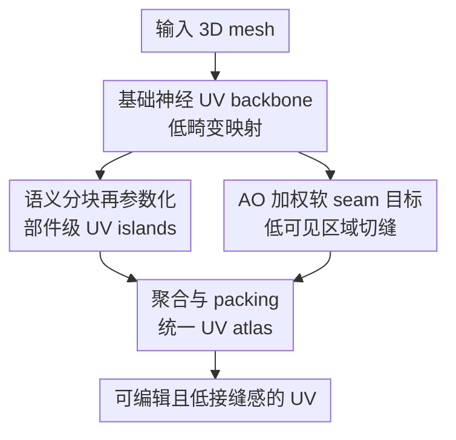

# Unsupervised Representation Learning for 3D Mesh Parameterization with Semantic and Visibility Objectives

**会议**: ICLR2026  
**OpenReview**: [https://openreview.net/forum?id=9LYsvna4Sk](https://openreview.net/forum?id=9LYsvna4Sk)  
**代码**: https://github.com/AHHHZ975/Semantic-Visibility-UV-Param  
**领域**: 3D视觉  
**关键词**: 3D网格参数化, UV展开, 语义感知, 可见性感知, 无监督表示学习  

## 一句话总结
这篇论文把无监督神经 UV 参数化从“只追求低几何畸变”推进到“服务真实贴图工作流”：先用语义分块让 UV island 对齐 3D 部件，再用环境光遮蔽引导 seam 落到不显眼区域，从而得到更适合编辑、纹理生成和资产复用的 3D mesh UV atlas。

## 研究背景与动机
**领域现状**：3D mesh 参数化，也就是常说的 UV mapping，是把三维表面摊平成二维纹理坐标的步骤。传统方法和近年的学习式方法大多围绕几何性质优化，例如角度保持、面积保持、边长保持、避免重叠、减少 chart 数量等。这些目标对一个可用的 UV atlas 很重要，因为纹理坐标一旦严重扭曲，后续贴图、烘焙和渲染都会出问题。

**现有痛点**：问题在于，真实的 3D 内容生产并不只关心几何畸变。一个 UV island 如果跨过兔子的身体、耳朵和腿，即使局部角度保持得不错，艺术家编辑纹理时也很难把“同一个语义部件”当成一块处理；反过来，如果 seam 被放在模型正面或高曝光区域，即使几何指标漂亮，贴上 checkerboard 或生成纹理后也容易看到明显接缝。也就是说，现有自动 UV 方法经常把参数化当成纯几何问题，却忽略了它最终要服务纹理编辑、纹理迁移和渲染观感。

**核心矛盾**：UV 参数化里有一个很实际的矛盾：低畸变通常要求在几何复杂处切开表面，但人真正看到的是“这些切口是否破坏语义部件、是否出现在显眼位置”。如果算法只优化 conformality、equiareality 或 bijectivity，它可能选择几何上方便但语义上割裂、视觉上突兀的 seam；如果只追求语义或视觉偏好，又可能牺牲基本的几何可用性。

**本文目标**：作者希望把 UV 参数化学习扩展成一个更面向下游任务的无监督框架。具体来说，第一，输出的 UV charts 要尽量与有意义的 3D 部件一致，方便局部编辑、纹理迁移和跨形状对应；第二，切缝要尽量落在不容易被观察到的表面区域，降低贴图后的可见 seam artifacts；第三，这些目标不能脱离几何基础，仍要保持可接受的角度、面积和重叠控制。

**切入角度**：论文的观察很清楚：语义一致性可以先从 3D 表面分区入手，把整网格拆成若干语义上连贯的 connected submesh，再分别学习每一块的 UV island；可见性则可以用 ambient occlusion 作为曝光程度的近似，训练时让 seam 的软掩码尽量避开高 AO 的可见区域。这两个信号都不需要人工标注，因此适合接入无监督神经 UV backbone。

**核心 idea**：用“语义分块后逐块参数化”解决 UV island 与 3D 部件不一致的问题，用“AO 加权的可微 seam 目标”解决接缝落在显眼区域的问题，并把两者叠加在已有的双向 cycle mapping UV backbone 上。

## 方法详解
### 整体框架
论文的方法可以理解为在一个已有的神经 UV 参数化 backbone 上增加两个感知目标。基础 backbone 负责把 mesh 顶点 $V$ 映射到二维 UV 坐标 $Q$，并通过 wrap、cycle、repel、distortion 等无监督损失维持低畸变和近似双射；本文真正新增的是两条上层管线：语义感知管线先分割 3D mesh，再逐块学习和打包 UV；可见性感知管线则在训练中检测 soft seam，并用 AO 值惩罚“显眼位置上的 seam”。

整体流程不是把两个目标硬塞进同一个黑盒损失，而是把它们分别对应到 UV 工作流里的两个关键决策：哪些表面区域应该被组织成同一个 chart，以及 seam 应该放在哪里。语义目标决定 chart 的组织方式，可见性目标决定切缝位置，基础几何损失则保证摊平结果仍然可用。

基础 backbone 来自近年的神经 surface parameterization 思路，本身不是这篇论文宣称的新贡献。它包含 DeformNet、WrapNet、CutNet 和 UnwrapNet 四个点式 MLP，构成 $2D \rightarrow 3D \rightarrow 2D$ 和 $3D \rightarrow 2D \rightarrow 3D$ 两个 cycle。直观上，模型先从规则二维网格出发，把它变形并包到 3D 表面上，再通过切割和展开回到二维；另一路则从真实 3D 顶点出发，切开、展开，再重新 wrap 回 3D。若 UV 映射发生重叠、畸变或不可逆，这些问题会体现在 cycle reconstruction、normal consistency、repulsion 和 distortion losses 里。

在语义感知部分，输入 mesh 会先通过 Shape Diameter Function 得到部件级分割。ShDF 把每个表面位置附近的“局部厚度”压成一个标量，类似兔子的耳朵、身体、腿、把手这类部件通常会呈现不同的厚度模式。论文用 GMM 拟合 ShDF 值，再结合相邻 face 的平滑代价和 graph cut refinement 得到连通的 semantic submeshes。之后每个 submesh 单独跑同一个 UV backbone，生成独立 UV island，最后把所有 island 规则地放进一个统一 UV atlas。

在可见性感知部分，论文先为每个顶点计算 ambient occlusion。AO 在这里被当成“从典型视角看是否暴露”的几何代理：$AO=1$ 表示很暴露，$AO=0$ 表示很遮蔽。训练时模型根据 3D 邻域在 UV 空间中的距离跳变来软检测 seam 顶点，然后最小化 seam 顶点的 AO 加权平均值。这样一来，模型如果把 seam 放到高曝光的表面区域，损失会变大；把 seam 移到凹陷、背面或遮蔽区域，损失会变小。

### 关键设计
**1. 语义分块再参数化：让 UV island 对齐可编辑的 3D 部件**

传统自动 UV 展开经常把切割看成降低畸变的几何操作，因此一个 UV chart 可能跨过多个语义部件，或者同一个部件被切得很碎。本文的语义感知管线反过来先问一个更贴近内容创作的问题：如果用户要给兔子耳朵、身体、腿分别编辑纹理，那么 UV island 是否也应该按这些部件组织？为此，论文用 Shape Diameter Function 做无监督 3D partition。对 mesh 中的 surface sample $p$，ShDF 通过沿 inward normal 附近的锥形方向发射多条射线，估计局部物体厚度，并用归一化和 log-like 压缩稳定数值范围。

得到 ShDF 标量场后，方法用一维 GMM 产生 per-face 软类别似然，再把它和相邻 face 的几何平滑项组成 graph-cut energy。这个设计比直接按厚度阈值切分更稳，因为 GMM 提供了数据驱动的部件候选，graph cut 则避免标签在局部噪声处频繁跳变；后续 connected-component relabeling 进一步保证每个最终 label 对应一个连通 submesh。这样得到的不是人工语义标注意义上的完美分割，而是足够连贯、足够可编辑的几何部件划分，正好适合作为 per-part UV parameterization 的输入。

**2. 部件级 UV 学习与确定性 packing：把语义一致性转成 atlas 结构**

有了 semantic submeshes 之后，论文没有在整网格上强行加一个抽象的“语义损失”，而是直接改变参数化单位：对每个部件 $M_k=(V_k,F_k)$ 单独训练一套基础 UV backbone，得到部件内的 UV island $Q_k$。每个 part 的损失仍然是几何型的，形式上可以写作 $L^{(k)}_{part}=L^{(k)}_{wrap}+L^{(k)}_{cycle}+L^{(k)}_{repel}+L^{(k)}_{dist}$。这一步的好处是具体的：小而连通的部件通常比完整复杂 mesh 更容易摊平，局部几何畸变更容易控制，UV island 也天然对应一个可理解的 3D 部件。

所有 $Q_k$ 归一化到单位方形后，论文用一个简单确定性的 grid packing 把它们合成单个 atlas。若有 $K$ 个部件，取 $G=\lceil\sqrt{K}\rceil$，把单位 UV sheet 划成 $G \times G$ 网格，每个 island 用统一缩放 $s=(1-2\cdot pad)/G$ 和平移 $t_{r,c}$ 放进一个 cell，最终 $u_{final}(v)=T_k(u_{\theta_k}(v))$。这个 packing 不是最优空间利用方案，但它有两个优点：一是复现简单，二是所有部件 texel density 一致，便于纹理烘焙和编辑。论文也在附录说明，这个 aggregator 可以替换为 Maya、Blender、Houdini 等更高级 packing solver，而不影响前面的 per-part learning。

**3. AO 加权软 seam 目标：把切缝推向低曝光区域**

可见性感知部分瞄准的是另一个常见失败：UV seam 如果出现在模型正面、亮处或常见视角中，即使几何展开没问题，贴图后仍会很刺眼。论文用 ambient occlusion 作为 seam 可见性的代理。对表面点 $p$ 和法向 $n(p)$，AO 定义为半球方向上的余弦加权可见性平均：$AO(p)=\frac{1}{\pi}\int_{\Omega^+(p)}V(p,\omega)(n(p)\cdot\omega)d\omega$。在论文约定中，$AO(p)=1$ 表示完全暴露，$AO(p)=0$ 表示完全遮蔽，因此 seam 应该尽量落在低 AO 区域。

关键难点是 seam 本身不是一个固定标签，而是当前 UV 映射训练过程中不断变化的结果。论文用一个可微近似来从 UV 空间里软检测 seam：对顶点 $i$，找它在 3D 表面上的近邻 $j$，若这些点在 3D 上相邻但在 UV 中距离突然很远，就说明中间可能被切开。硬最大距离 $\eta_i=\max_j\|q_i-q_{i,j}\|_2$ 被 log-sum-exp 近似替代，再通过 $s_i=\sigma(\beta(\eta_i-\tau))$ 得到软 seam membership。最后的 AO seam loss 是 $L_{AO}=\frac{\sum_i s_i AO_i}{\sum_i s_i+\epsilon}$。这个公式很直接：高 seam 权重乘上高 AO 会被惩罚，模型自然把 seam 移到低曝光区域。

**4. 几何 backbone 与感知目标解耦：承认 trade-off，并让用户调权重**

论文没有声称语义和可见性目标会免费提升所有几何指标，而是把它们作为可调的上层偏好接到基础几何损失上。可见性感知训练的完整目标可以概括为 $L_{vis}=L_{wrap}+L_{cycle}+L_{repel}+L_{dist}+\lambda_{vis}L_{AO}$。当 $\lambda_{vis}$ 增大时，seam 更倾向于低 AO 区域；当几何项权重更高时，结果会更接近传统低畸变 UV。

这个设计的意义在于，它把“几何保真”和“内容生产可用性”的权衡暴露出来，而不是把某一个单一指标包装成绝对目标。实验也印证了这一点：纯几何方法在 conformality 或 equiareality 上往往更强，但它们没有 semantic alignment 和 seam visibility 的保证；本文方法会牺牲一部分面积保持，尤其是纯 visibility-aware global atlas，但换来更符合编辑与观看需求的 atlas 结构。

### 一个完整示例
假设输入是一只兔子 mesh。传统方法可能为了降低整体畸变，在身体和耳朵之间、腿部附近或表面显眼处选择一组几何上方便的 seam，然后生成若干不太好解释的 UV islands。艺术家想单独给耳朵上色时，可能发现耳朵的一部分和身体在同一张 island 上，或者同一个耳朵被拆到了多个位置。

本文的语义感知流程会先计算每个 face 的 ShDF 厚度特征。兔子耳朵细长、身体厚、腿部和头部厚度模式不同，GMM 和 graph cut 会把这些区域分成若干连通 semantic parts。接着每个 part 独立训练 UV backbone：耳朵得到自己的 UV island，身体得到自己的 island，腿部也被组织成相对清晰的区域。最后这些 island 被统一放入 atlas 网格中，保持相近 texel density。这样下游如果做纹理编辑或跨兔子模型的纹理迁移，就能更容易把二维纹理区域对应回三维语义部件。

再看可见性流程。模型先计算兔子各顶点 AO，耳朵内侧、腿部交界、身体下方通常更遮蔽，正面凸起区域更暴露。训练过程中，如果当前 UV seam 穿过高曝光的脸部或身体正面，$s_i AO_i$ 会变大，$L_{AO}$ 促使模型调整切缝；如果 seam 移到背面、凹陷或较少被看到的区域，损失下降。最后贴 checkerboard 或生成纹理时，肉眼更难在常见视角看到突兀断裂。

### 损失函数 / 训练策略
基础 UV backbone 的训练目标由四类无监督几何损失组成。$L_{wrap}$ 用 Chamfer distance 和 normal consistency 让 WrapNet 输出的 3D 点贴近真实 mesh；$L_{cycle}$ 约束 $\hat{Q}$ 与 $\hat{Q}_{cycle}$、真实 $P$ 与重建 $\tilde{P}$ 保持一致；$L_{repel}$ 用局部 UV repulsion 减少重叠；$L_{dist}$ 通过 differential distortion loss 和 triangle distortion loss 控制角度、面积等局部几何畸变。

语义感知训练对每个 semantic submesh 单独优化同一组几何损失，因此它更像“改变训练样本粒度”而不是新增一个复杂语义监督项。可见性感知训练则在基础损失上增加 $\lambda_{vis}L_{AO}$，论文算法中示例权重为 $0.004$。训练时每轮先得到当前 UV，归一化后计算基础几何损失，再用 3D 邻域和 UV 距离跳变估计 soft seam，最后用 AO 加权 seam loss 更新网络参数。

计算代价上，语义管线虽然需要多个 part 分别训练，但每个 submesh 更小，论文实测总训练时间反而可能低于 FlexPara 的 multi-chart 训练。可见性管线则明显更慢，因为每轮都要做 seam extraction：对每个顶点检查 3D 邻居、比较 UV 距离并计算 soft seam，这部分约占额外训练开销的主要比例。

## 实验关键数据

### 主实验
论文从定性、定量和用户研究三个层面评估方法。语义感知部分与 xatlas、Blender SmartUV、Autodesk Maya automatic UV、FlexPara multi-chart 比较；可见性感知部分与 FlexPara single-chart 和 OptCuts 比较。关键指标包括 semantic Hamming distance、Rand Index、mean seam AO、conformality、equiareality 和运行时间。

| 任务 | 指标 | 本文最好结果 | 主要对比方法 | 结论 |
|------|------|--------------|--------------|------|
| 可见性感知 UV | Mean seam AO ↓ | Visibility-Aware: 0.6065 | OptCuts: 0.7855 / FlexPara: 0.8604 | seam 更集中在低曝光区域 |
| 可见性感知 UV | Conformality ↑ | Visibility-Aware: 0.9175 | OptCuts: 0.9341 / FlexPara: 0.9097 | 角度保持接近或优于 FlexPara，但低于 OptCuts |
| 可见性感知 UV | Equiareality ↑ | Visibility-Aware: 0.6093 | OptCuts: 0.8934 / FlexPara: 0.6759 | 面积保持有明显代价 |
| 语义感知 UV | Hamming Distance ↓ | Semantic-Aware: 0.3188 | FlexPara: 0.5980 / xatlas: 0.8896 | 语义分区一致性显著更好 |
| 语义感知 UV | Rand Index ↑ | Semantic-Aware: 0.8151 | FlexPara: 0.6902 / Blender: 0.7173 | 顶点对分组一致性更强 |
| 语义感知 UV | Inference Time ↓ | Semantic-Aware: 15s | Blender/Maya: <1s / FlexPara: 2s | 质量提升换来更高推理成本 |

从表中能看到，本文方法最强的不是传统几何指标，而是直接对应语义与可见性的指标。Visibility-Aware 的 mean seam AO 从 FlexPara 的 0.8604 降到 0.6065，说明 seam 从高曝光区域明显移向更遮蔽区域；Semantic-Aware 的 Hamming distance 从 FlexPara 的 0.5980 降到 0.3188，说明 UV charts 与参考语义分区更一致。但面积保持并没有免费提升，尤其 visibility-aware global atlas 的 equiareality 只有 0.6093，低于 FlexPara 的 0.6759 和 OptCuts 的 0.8934。

用户研究更接近真实感知质量。专家组 45 人中，Visibility-Aware 评估里本文获得 93.70% 偏好，OptCuts 只有 1.48%，FlexPara 4.81%；Semantic-Aware 评估里本文获得 80.22% 偏好，Maya 8.44%，Blender 5.33%，FlexPara 3.33%，xatlas 2.66%。普通用户组也有类似趋势：可见性任务本文 91.42%，语义任务本文 74.29%。这说明即便传统几何指标有损失，人眼和内容生产相关的偏好仍明显倾向本文结果。

### 消融实验
| 配置 | 关键指标 | 说明 |
|------|----------|------|
| Semantic-Aware Param (ShDF) | Conformality 0.9123 / Equiareality 0.6707 | 默认 ShDF 分块，在几何保持上比 SAMesh 更均衡 |
| Semantic-Aware Param (SAMesh) | Conformality 0.8694 / Equiareality 0.6270 | 替换分割器后语义可能更现代，但 UV 几何指标下降 |
| Semantic-Aware Param (PartField) | Conformality 0.8999 / Equiareality 0.6921 | 某些复杂形状上分割更细，但不必然带来最佳 UV 几何 |
| Base Neural UV Arch. | Conformality 0.9097 / Equiareality 0.6759 | 纯几何 backbone，作为 FlexPara 式基线 |
| Visibility-Aware Param | Conformality 0.9175 / Equiareality 0.6093 | seam 可见性改善，但 global atlas 面积保持下降 |
| Visibility+Semantic-Aware Param | Conformality 0.9153 / Equiareality 0.6369 | 结合分块与可见性后，面积保持优于纯 visibility-aware |
| w/o visibility loss | seam AO 分布更偏高 | 去掉 AO loss 后，seam 更容易停留在显眼区域 |

消融结果有两个重要信息。第一，分割器本身会影响最终 UV 几何质量，但这种关系不是单调的：更强的语义分割器不一定产生更好的 conformality 或 equiareality，因为 3D segmentation 目标并不直接优化 UV 展开。第二，visibility loss 是移动 seam 的关键；如果没有 AO 加权项，模型没有理由把切缝主动推向低曝光区域。

训练与推理时间也暴露了方法的工程代价。语义管线在 Rabbit、Potion、Squidward House 三个 mesh 上平均训练时间 648 秒，低于 FlexPara multi-chart 的 10353 秒，因为它把大 mesh 切成小 submeshes 后分别训练；但推理时要做分割、多个 backbone 调用和 packing，所以慢于 Blender/Maya 和 FlexPara。可见性管线平均训练时间 31160 秒，远高于 FlexPara single-chart 的 1285 秒，主要瓶颈是每轮 seam extraction 的邻域距离计算。

### 关键发现
- 语义目标最直接的收益是 UV atlas 可解释性：island 与 3D 部件一致后，纹理绘制、局部编辑和跨形状纹理迁移更自然。
- 可见性目标确实改变了 seam 的空间分布：mean seam AO 明显下降，checkerboard 渲染中显眼接缝减少。
- 传统几何指标与感知目标存在真实 trade-off；本文不是全面刷新 conformality/equiareality，而是把 UV 优化目标从“几何漂亮”扩展到“贴图可用”。
- ShDF 是一个简单但有效的默认分块器，复杂场景中可以替换为 SAMesh、PartField 或未来更强的 3D segmentation 方法。
- 计算开销是当前版本最大的工程问题，尤其 visibility-aware 训练中的 soft seam extraction 需要进一步 GPU 化、缓存邻域或用空间哈希加速。

## 亮点与洞察
- 把 UV 参数化的目标重新对准内容生产工作流是这篇论文最有价值的地方。很多 UV 方法只报告 distortion，但真实用户更关心能不能编辑、接缝明显不明显、纹理生成后是否自然。
- 语义感知设计很朴素但有效：不是强行学习一个神秘的 semantic UV embedding，而是先分割再逐块参数化。这个选择让方法逻辑清楚，也方便替换分割器和 packing solver。
- AO seam loss 的公式非常直观：用 soft seam membership 加权 AO，低 AO seam 得分低，高 AO seam 得分高。它把“接缝不该放在显眼处”这件审美判断转成了可微优化目标。
- 论文诚实呈现了 geometry-preservation trade-off。它没有把所有指标都说成胜利，而是说明 semantic/visibility 目标在某些任务中比单纯 equiareality 更重要，这种叙述对实际系统更可信。
- 这套思想可以迁移到其他 3D 生成任务。例如 texture generation 可以把 UV island 的语义一致性作为 layout prior，3D asset retargeting 可以利用 per-part atlas 做跨模型局部纹理对应，自动材质编辑也可以把低可见 seam 作为生成约束。

## 局限与展望
- 语义分块依赖 ShDF 或外部分割器，分割质量会直接影响 UV atlas。对于厚度模式不明显、拓扑复杂或语义边界不等于几何厚度边界的物体，ShDF 可能切得不够符合人类语义。
- 默认 grid packing 很简单，空间利用率未必高。论文虽然说明可以替换为高级 packing solver，但主方法本身没有联合优化 UV 空间利用率、texel density 和 island 形状。
- 可见性用 AO 近似“人是否会看到 seam”，这个代理合理但有限。真实使用中相机分布、动画姿态、场景灯光和材质都会影响 seam 可见性，静态 AO 无法覆盖所有情况。
- visibility-aware 训练开销较大，尤其 seam extraction 随顶点数增长会变慢。若要进入交互式建模工具或大规模 3D 资产流水线，需要明显优化实现。
- 语义与可见性目标目前仍主要在 UV 参数化阶段优化，未来可以与纹理生成联合训练，让模型直接最小化生成纹理后的可见 seam 和语义错配。

## 相关工作与启发
- **vs 传统参数化方法**: LSCM、ABF++、SLIM、OptCuts 等方法重心在角度、面积、双射和 cut layout。本文保留这些几何目标的必要性，但指出它们不足以保证语义可编辑性和视觉 seam 质量。
- **vs FlexPara**: FlexPara 代表近年的神经 surface parameterization backbone，能够快速学习低畸变 UV。本文基本沿用这类 bi-directional cycle mapping 作为基础，并把贡献放在 semantic-aware 与 visibility-aware objectives 上。
- **vs xatlas / Blender / Maya 自动 UV**: 这些工具成熟、快速、工程上好用，但通常不显式优化“UV island 是否对应语义部件”。本文在速度上吃亏，但在语义组织和用户偏好上明显更强。
- **vs SAMesh / PartField 等 3D 分割方法**: 这些方法本身不是 UV 参数化算法，却可以作为本文 pipeline 的前端。论文的启发是：更好的 3D segmentation 可以直接变成更好的 semantic-aware UV layout。
- **vs 可见 seam 相关工作**: Seamster、Invisible Seams、OptCuts 等工作关注 seam placement，但本文把 AO-weighted seam objective 接入可微神经 UV 学习，使 seam 位置能随着 UV mapping 训练端到端调整。

## 评分
- 新颖性: ⭐⭐⭐⭐☆ 把语义分块和 AO 可见性目标接入无监督神经 UV 参数化很有实际价值，基础 backbone 不是新贡献。
- 实验充分度: ⭐⭐⭐⭐☆ 有定量指标、用户研究、可视化和多组消融，但数据集规模与更复杂生产场景仍可继续扩大。
- 写作质量: ⭐⭐⭐⭐☆ 方法动机清楚，关键公式完整，附录解释充分；部分表述略重复，工程细节分散在正文和附录中。
- 价值: ⭐⭐⭐⭐⭐ 对 3D 内容生产、纹理生成和自动 UV 工作流很有启发，尤其适合作为生成式 3D 管线里的可编辑 UV 前处理模块。

<!-- RELATED:START -->

## 相关论文

- [\[ICLR 2026\] CLAP: Unsupervised 3D Representation Learning for Fusion 3D Perception via Curvature Sampling and Prototype Learning](clap_unsupervised_3d_representation_learning_for_fusion_3d_perception_via_curvat.md)
- [\[CVPR 2026\] GM-R²: Generative Matching Learning for Unsupervised Geometric Representation and Registration](../../CVPR2026/3d_vision/gm-r2_generative_matching_learning_for_unsupervised_geometric_representation_and.md)
- [\[ICLR 2026\] Learning Unified Representation of 3D Gaussian Splatting](learning_unified_representation_of_3d_gaussian_splatting.md)
- [\[AAAI 2026\] Point-SRA: Self-Representation Alignment for 3D Representation Learning](../../AAAI2026/3d_vision/point-sra_self-representation_alignment_for_3d_representation_learning.md)
- [\[ICLR 2026\] Open-Set Semantic Gaussian Splatting SLAM with Expandable Representation](open-set_semantic_gaussian_splatting_slam_with_expandable_representation.md)

<!-- RELATED:END -->
