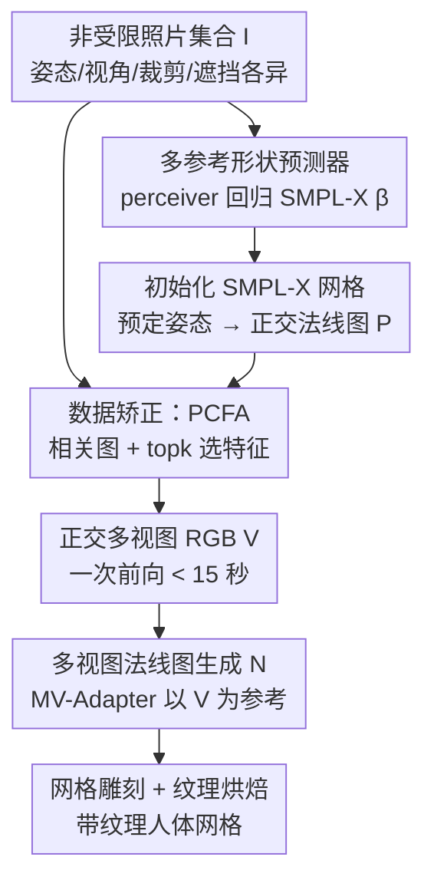

# UP2You: Fast Reconstruction of Yourself from Unconstrained Photo Collections

**会议**: ICLR 2026  
**OpenReview**: [https://openreview.net/forum?id=oFsNco4aMm](https://openreview.net/forum?id=oFsNco4aMm)  
**代码**: 论文称模型与代码将开源（暂未提供链接）  
**领域**: 3D视觉  
**关键词**: 着装人体重建, 非受限照片, 数据矫正器, 姿态相关特征聚合, SMPL-X  

## 一句话总结
UP2You 提出"数据矫正器"范式，把一堆姿态/视角/裁剪/遮挡各不相同的随手照片，用一次前向在几秒内矫正成干净的正交多视图 RGB 与法线图，再交给传统重建算法生成高保真带纹理人体网格，整套流程 1.5 分钟、显存几乎恒定，几何与纹理指标全面超过此前需要数小时优化的方法。

## 研究背景与动机
**领域现状**：从图像重建着装 3D 人体已研究多年，输入形式从密集多视图、单目视频，逐步扩展到单图。近年扩散模型与 SDS（Score Distillation Sampling）让"重建即条件生成"成为主流，能从可见像素合理脑补出背面与遮挡区域。

**现有痛点**：这些方法几乎都假设输入是"干净的"——全身、姿态简单、相机同步标定。但真实场景里我们手头往往只有个人相册：人物被部分截取或遮挡、相机视角极端、身体姿态动态变化、长宽比五花八门。这种"非受限照片"里外观信息是有的，但散落在各张图中，且相机与身体姿态几乎从不同步，连最先进的人体估计器都难以建立可靠的 2D-3D 对应。

**核心矛盾**：面对这种乱糟糟的输入，已有的两条路都不够好。一条是 PuzzleAvatar 代表的"数据压缩器"：把照片切成局部/全局块或拆成衣服/头发/脸等资产，用 DreamBooth 把它们蒸馏成可学习 token，再用 SDS 文本到 3D 组装出人体。但 DreamBooth 微调 + SDS 优化要数小时且不稳定，还得依赖真值 SMPL-X 网格初始化，更糟的是这种有损压缩会让扩散先验盖过个体特征，产生 PuzzleAvatar 自己承认的"不可预测的幻觉"。另一条是把单图补成正交环视图，但这些方法本质是"数据修补器"（从可见视图补不可见视图），只吃单图、无法利用多张非受限照片，精度也不随输入增多而提升。

**本文目标**：做第一个真正面向"非受限照片集合"的解决方案，需要同时啃下三块硬骨头——(1) 有效聚合姿态/视角/裁剪/遮挡差异巨大的多张参考图信息；(2) 处理数量不定的输入（1 张到几十张）而不让计算量爆炸；(3) 摆脱对真值人体形状的依赖。

**切入角度**：与其在表征层做有损压缩，不如做"数据矫正器"——把脏的、不完整的捕获直接矫正成干净完整的正交环视（带规范姿态），让传统重建算法接手。关键在于矫正过程不仅整理了输入数据，还通过在高保真 3D 人体合成多视图渲染上继续训练，refine 了生成模型的先验，从而在身份与视角上都更一致。

**核心 idea**：用"数据矫正器"替代"数据压缩器/修补器"，把无约束照片一次前向矫正成正交多视图，再用传统算法重建——快、稳、且重建质量随输入照片数量增长。

## 方法详解

### 整体框架
UP2You 的目标是从相机参数与人体姿态都未知的非受限照片，重建出高质量带纹理网格。整条流水线串成四步：先从若干参考照片回归出 SMPL-X 形状参数并用预定姿态/表情初始化人体网格（提供后续的姿态条件），然后以 SMPL-X 法线图作为视角条件、用 PCFA 模块从参考图中选择性聚合特征，一次前向生成 6 张正交视角的干净 RGB 图，接着由这些正交 RGB 再生成对应的多视图法线图提供几何线索，最后做网格雕刻与纹理烘焙，得到最终网格。整套流程把"脏输入"在前两步就矫正成"干净正交视图"，后两步就退化成传统重建算法擅长的标准问题。

### 关键设计

**1. 数据矫正器范式：把脏输入一次前向变成干净正交视图**

这一设计直接针对"非受限照片无法建立可靠 2D-3D 对应、传统算法接不住"的根本痛点。与其像 PuzzleAvatar 那样把照片有损压缩成 token 再做耗时数小时的 SDS 文本到 3D，UP2You 把问题倒过来：用一个前向网络把姿态/视角/裁剪/遮挡各异的输入 $I$，矫正成 6 张正交视角、规范姿态的干净 RGB $V$（含对应法线图），让传统的多视图重建算法（mesh carving + texture baking）直接接手。骨干采用 MV-Adapter，它用 ReferenceNet 当参考图编码器、把 raymap 注入扩散 UNet 当视角条件以合成正交视图；UP2You 把原本只吃单图的 MV-Adapter 扩展成能吃多张非受限照片，并改用正交 SMPL-X 法线图作为视角条件。这样做的有效性在于：矫正不只是整理输入，还通过在高保真 3D 人体的合成多视图渲染上继续训练，把"3D 一致 + 身份保持"刻进了生成模型的先验里，从而避免了压缩范式那种身份丢失和"不可预测幻觉"，同时把端到端时间从 4 小时压到 1.5 分钟。

**2. PCFA 姿态相关特征聚合：按目标姿态选最有用的参考特征，显存几乎恒定**

朴素地把所有参考图特征都喂进生成模型，会让显存随参考数线性增长，而且很多参考像素对某个目标视角根本无关（比如用背面参考去合成正面）。PCFA 的核心想法是：把"人体身份特征"和"视角相关性信息"解耦，按目标姿态自适应地决定每张参考图的贡献。具体地，对每个目标姿态 $P_i$，用姿态编码器 $E_{pose}$ 和 DINOv2 编码器 $E_{ref}$ 分别提取 $X_i^{pose}=E_{pose}(P_i)$ 和所有参考特征 $X^{ref}=E_{ref}(I)$，送入一个含自注意力+交叉注意力的 transformer 块 $T$（$X_i^{pose}$ 当 query/key/value 做自注意力、当 query 做交叉注意力，$X^{ref}$ 当交叉注意力的 key/value），得到融合了与目标姿态相关参考信息的输出 $O_i=T(X_i^{pose}, X^{ref})$。再算注意力图 $A^i=\frac{W_q O_i \cdot (W_k X^{ref})^\top}{\sqrt{d}}$，沿 token 维取均值、AvgPool 平滑、ReLU 抑负，得到逐像素的参考相关图 $C^i$。和以往依赖关键点相似度的方法不同，PCFA 的相关图建立在目标人体与参考 DINO 特征的细粒度语义相关上，能编码更丰富的服饰细节。

拿到相关图后，**特征选择**用 topk 策略真正省下算力：用 ReferenceNet 抽多尺度参考特征 $F=\{F_k\}$，把相关图插值对齐到第 $k$ 层空间尺寸得 $\hat{C}^i$，对每个目标视角按 $\hat{C}^i$ 取 top $\gamma S_k$ 个索引（$\gamma$ 控制保留比例）并 sort 保序，最后用这些索引取出加权后的参考特征 $\hat{F}_k^i = F_k[\cdot]\cdot \hat{C}^i[\cdot]$ 喂给生成模型 $V=D_{rgb}(\hat{F}, P_{rgb}(P))$。正因为每个视角只保留最有用的一小撮特征，显存几乎不随参考数增长（实验中 3→12 张参考显存仅 18.65→20.88 GB），却让重建质量随输入增多而上升——印证了"2D 看得越多，3D 感知越准"。

**3. 多参考形状预测器：从多张乱照片直接回归 SMPL-X 形状，摆脱真值模板**

整条流水线高度依赖初始 SMPL-X 网格——它既给多视图生成提供姿态条件 $P$，又是网格重建的基底。SMPL-X 网格 $T(\beta,\theta,\psi)$ 中姿态 $\theta$ 和表情 $\psi$ 可预设（如 T-pose/A-pose + 中性表情），但形状 $\beta$ 必须从输入图估计。已有形状预测器多为单图设计，面对多张脏参考时结果极不稳定：同一个人有时被预测得过瘦、有时过胖、甚至直接失败，根本说不清哪个才对。UP2You 用 perceiver 风格架构解决这点：$\beta_{pred}=S(\tau, X^{ref})$，其中 $\tau$ 是可学习的 query token，$X^{ref}$ 是参考图的 DINOv2 特征，perceiver 用 query token 高效聚合多视图信息，预测头是类似相机头设计的轻量 transformer。这是首个从多张非受限输入估计 SMPL-X 形状的方法，靠多输入互补显著降低了单图方法的高方差和不稳定，且参考越多形状越准。

### 损失函数 / 训练策略
多视图图像生成、法线图生成、形状预测三个模型在 THuman2.1、Human4DiT、2K2K、CustomHumans 等数据集上训练（在高保真 3D 人体的合成多视图渲染上继续训练以注入 3D 一致先验）。法线图生成沿用以 SMPL-X 法线渲染为额外条件保证多视图一致；网格雕刻从初始 SMPL-X 网格出发、用生成法线 $N$ 细化几何并从 $V$ 投影逐顶点颜色，手部区域替换回初始网格（参照 ECON）以保手部几何，最后用生成的多视图 RGB 做纹理烘焙。

## 实验关键数据

### 主实验
在 PuzzleIOI、4D-Dress（有带纹理 3D 真值）和自采的 in-the-wild（12 个身份）上评测，默认用 12 张参考图。

| 数据集 | 指标 | 本文(Mesh) | PuzzleAvatar | AvatarBooth |
|--------|------|------|----------|----------|
| PuzzleIOI | PSNR↑ | 24.539 | 21.664 | 16.879 |
| PuzzleIOI | LPIPS↓ | 0.0474 | 0.0639 | 0.1544 |
| PuzzleIOI | Chamfer↓ | 2.724 | 3.204 | 6.635 |
| PuzzleIOI | P2S↓ | 2.605 | 3.165 | 6.697 |
| 4D-Dress | PSNR↑ | 25.540 | 21.376 | 18.186 |
| 4D-Dress | LPIPS↓ | 0.0654 | 0.1081 | 0.1718 |
| 4D-Dress | Chamfer↓ | 1.140 | 1.956 | 6.846 |
| in-the-wild | CLIP-I↑ | 0.971 | 0.907 | 0.878 |

UP2You 在几何（PuzzleIOI Chamfer −15%、P2S −18%）与纹理（4D-Dress PSNR +21%、LPIPS −46%）上全面领先，且单图重建也超过专门的单图方法 PSHuman（Chamfer 0.927 vs 2.759，PSNR 26.651 vs 24.134），说明在更难的非受限任务上训练能反哺更简单的受限场景。

### 消融实验

| 配置 | PuzzleIOI PSNR↑ | 4D-Dress PSNR↑ | 说明 |
|------|---------|---------|------|
| Full (Corr.+topk+RefNet) | 23.896 | 25.848 | 完整模型 |
| A. Mean 聚合 | 17.412 | 19.614 | 简单平均，掉 6.5/6.2 |
| B. Concat 聚合 | 20.545 | 23.366 | 拼接，掉 3.4/2.5 |
| C. Corr.+sum（非 topk） | 20.167 | 23.412 | 加权和不如 topk |
| D. 编码器换 CLIP | 20.152 | 23.405 | 掉 3.7/2.4 |
| E. 编码器换 DINOv2(代替RefNet) | 19.744 | 23.393 | 特征抽取不如 ReferenceNet |

形状预测消融（V2V↓）显示：参考从 3 增到 12 时本文 mean 8.819→8.336 且方差稳定（7.4 左右），而单图方法 PromptHMR 方差随参考数飙到 19.4，Semantify 始终在 11 上下，perceiver 也明显优于 MLP。

### 关键发现
- 特征聚合方式是最大胜负手：从 Mean（17.4）到完整 PCFA（23.9）PSNR 提升超 6 分，且 topk 选择优于加权和（C），说明"选最相关的少数特征"比"全用但加权"更有效。
- 显存随参考数几乎恒定：3→12 张参考时本文显存 18.65→20.88 GB，而 Concat 从 18.02 飙到 37.96 GB；同时质量从 PSNR 24.16 升到 25.85，验证"看得越多、感知越准"且不付出显存代价。
- 编码器选择上 DINOv2 优于 CLIP 与 DINOv1（4D-Dress PSNR 25.848 vs 23.876 vs 24.170），因为 DINOv2 更擅长捕捉 2D-3D 对应。

## 亮点与洞察
- "数据矫正器 vs 数据压缩器"是这篇最提纲挈领的洞察：与其改进生成模型去硬扛 3D 一致，不如先把脏输入整理成生成模型本来就擅长的干净格式，把难题挪到数据侧而非模型侧——这套思路可迁移到任何"输入分布太脏导致下游算法失效"的重建任务。
- PCFA 用相关图 + topk 实现"显存恒定、质量随输入增长"非常巧妙：传统多参考方法要么显存爆炸要么信息利用不充分，PCFA 把"该看谁"显式建模成姿态相关图，再用稀疏选择落地，鱼和熊掌兼得。
- 用 perceiver query token 聚合多张脏图回归形状，把单图 HMR 的高方差问题转成多视图互补，这种"用冗余换稳健"的设计可复用到任何单图估计不稳的回归任务。

## 局限与展望
- 流水线仍依赖 SMPL-X 参数化人体模型，对非常宽松的服饰、配饰或非标准体型（如儿童、非人）可能受参数化先验限制，论文虽展示了 loose clothing 案例但泛化边界未充分量化。
- 形状预测的 V2V 误差随参考数增加改善有限（8.819→8.336），说明多视图互补在形状维度收益已趋饱和，主要增益来自外观/纹理而非体型精度。
- 矫正质量上限受训练数据（合成多视图渲染）约束，真实世界极端遮挡/缺失部位（论文 Fig.12/13 单独展示）下的表现可能不如受控测试集稳定。
- 依赖现成 MV-Adapter / DINOv2 / ReferenceNet 等组件，整体偏工程化集成，单一模块替换对最终质量的边际影响还可进一步拆解。

## 相关工作与启发
- **vs PuzzleAvatar**: 它用 DreamBooth 把照片蒸馏成 token + SDS 优化（>4 小时、需真值 SMPL-X、易幻觉），属"数据压缩器"；本文是 tuning-free 的"数据矫正器"，1.5 分钟出结果、直接回归形状、身份保持更好。
- **vs AvatarBooth**: 同属 few-shot 个性化 + SDS 路线，本文在所有几何与纹理指标上大幅领先（PuzzleIOI PSNR 24.5 vs 16.9）。
- **vs PSHuman（单图法）**: PSHuman 只吃单图；本文把单图视为非受限设定的特例，靠多视图一致引导在单图重建上仍超过它（Chamfer 0.927 vs 2.759），尤其肢体重建更准。
- **vs 单图形状预测（Semantify / PromptHMR）**: 它们单图输入、面对脏图方差极大；本文用 perceiver 聚合多参考，更稳更准且随参考增多持续改善。

## 评分
- 新颖性: ⭐⭐⭐⭐⭐ 首个面向非受限照片集合的"数据矫正器"范式，PCFA 与多参考形状预测都是针对性原创设计。
- 实验充分度: ⭐⭐⭐⭐⭐ 三数据集、多基线、形状/单图/多参考全维度消融，显存-质量曲线尤其有说服力。
- 写作质量: ⭐⭐⭐⭐ 范式对比清晰、图文对应到位，公式部分 OCR 略乱但核心机制讲得明白。
- 价值: ⭐⭐⭐⭐⭐ 把数小时的个人 3D 重建压到 1.5 分钟且质量更高，直接面向"随手拍相册建模"的真实刚需，并附带姿态控制与免训练虚拟试衣。

<!-- RELATED:START -->

## 相关论文

- [\[CVPR 2026\] Long-Tail Internet Photo Reconstruction](../../CVPR2026/3d_vision/long-tail_internet_photo_reconstruction.md)
- [\[ICLR 2026\] FastAvatar: Towards Unified and Fast 3D Avatar Reconstruction with Large Gaussian Reconstruction Transformers](fastavatar_towards_unified_and_fast_3d_avatar_reconstruction_with_large_gaussian.md)
- [\[CVPR 2026\] Generalizable Sparse-View 3D Reconstruction from Unconstrained Images](../../CVPR2026/3d_vision/generalizable_sparse-view_3d_reconstruction_from_unconstrained_images.md)
- [\[ICLR 2026\] FastVGGT: Fast Visual Geometry Transformer](fastvggt_fast_visual_geometry_transformer.md)
- [\[ICLR 2026\] Fast Estimation of Wasserstein Distances via Regression on Sliced Wasserstein Distances](fast_estimation_of_wasserstein_distances_via_regression_on_sliced_wasserstein_di.md)

<!-- RELATED:END -->
