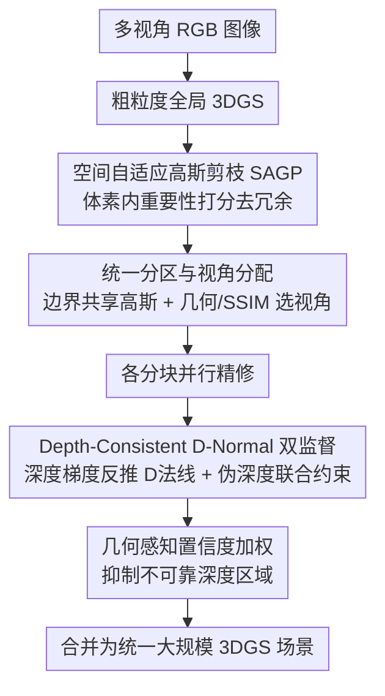

# UrbanGS：面向几何精确的大规模城市高斯泼溅的高效可扩展架构

**会议**: ICLR 2026  
**OpenReview**: [https://openreview.net/forum?id=L3utaw6SD9](https://openreview.net/forum?id=L3utaw6SD9)  
**代码**: 暂未公开（论文承诺接收后在 GitHub 发布）  
**领域**: 3D视觉  
**关键词**: 高斯泼溅, 大规模场景重建, 城市重建, 深度-法线正则, 自适应剪枝

## 一句话总结
UrbanGS 用「深度一致的 D-Normal 双监督正则 + 几何感知置信度加权 + 空间自适应高斯剪枝 + 统一分区」四件套，把 3DGS 扩展到城市级场景，在渲染质量、几何精度和显存效率上同时超过 CityGaussian-v2、VCR-GauS 等方法，且单卡 A5000 也能跑不爆显存。

## 研究背景与动机

**领域现状**：3D Gaussian Splatting（3DGS）用一堆各向异性的 3D 高斯椭球显式表示场景，配合高度优化的光栅化器，实现了高质量、实时的新视角合成，已成为有界小场景重建的主流。把它扩展到城市级大场景是自然的下一步，CityGaussian、VastGaussian 等通过分块（block-wise partitioning）并行训练让规模化成为可能。

**现有痛点**：但直接放大到城市尺度后，三个问题集中爆发。其一，**几何不准**——原版 3DGS 的高斯是无结构的，难以精确贴合表面；只用单目法线先验去监督渲染法线，虽然能更新高斯的旋转参数，却几乎更新不动位置参数，而位置参数恰恰对表面重建最关键，于是出现建筑物错位、街道扭曲。其二，**显存爆炸**——3DGS 在天空、远处建筑立面这类同质区域会疯狂增殖冗余高斯，朴素的全局阈值剪枝要么过度简化局部结构、要么误删远景细节。其三，**计算可扩展性差**——现有分区方案会处理大量无关视角、并在块边界产生几何不连续的拼接缝。CityGS-v2 引入 2DGS 虽提升了几何精度，却牺牲了渲染质量。

**核心矛盾**：城市级重建本质上要在「几何精度 ↔ 显存效率 ↔ 可扩展性」三者之间同时取胜，而现有方法每解决一个就恶化另一个——这正是缺一个统一框架的原因。

**本文目标**：构建一个统一框架，同时把（a）所有几何参数（位置+旋转）都优化到位、（b）冗余高斯按局部几何复杂度自适应剪掉、（c）分区与视角分配无缝衔接不留接缝。

**切入角度**：作者观察到，与其直接监督渲染法线（更新不动位置），不如从**渲染深度的空间梯度**反推出一种"深度法线"（D-Normal），再用伪法线先验去监督它——这样几何约束就内在地与深度绑定，位置参数也能被有效更新。

**核心 idea**：用「深度梯度反推的 D-Normal + 伪深度」双重监督来全面更新所有高斯几何参数，再叠加几何感知置信度加权和空间自适应剪枝，把精度、显存、扩展性一次性拿下。

## 方法详解

### 整体框架

UrbanGS 的训练流水线（论文图 2a）是一条"先粗后精、剪枝后分块、分块并行再合并"的链路：输入多视角 RGB 图像，先得到一个粗粒度的全局 3DGS；接着用**空间自适应高斯剪枝（SAGP）**把冗余高斯去掉得到紧凑的先验；然后对场景做收缩与分区，在块边界保留共享高斯以避免拼接缝；再用几何 + SSIM 准则给每个块分配相关相机视角；各块**并行精修**，精修时施加深度一致的 D-Normal 双监督正则与几何感知置信度加权；最后把所有块合并成统一的大规模 3DGS 场景。其中几何模块（D-Normal + 置信度）负责"准"，SAGP 负责"省显存"，分区策略负责"能并行、不留缝"。

### 关键设计

**1. 空间自适应高斯剪枝（SAGP）：按局部几何复杂度决定剪谁**

城市场景空间高度异质——前景细节区需要稠密高斯，远景却被海量冗余高斯撑爆显存。传统剪枝用全局指标或固定不透明度阈值，对这种异质场景要么过度简化局部、要么误删重要的远场高斯。SAGP 改成在**局部体素**里做决策：先按全局高斯密度自适应确定体素边长 $\ell = \lambda (V_{scene}/N)^{1/3}$（$\lambda=1.2$ 略放大格子以稳定局部统计），然后在每个体素内算第 $t$ 分位（$t=90\%$）的高斯体积 $\vartheta_{local}^{(t)}$，并对单个高斯体积做亚线性归一化 $w_{v,i} = \big(\min(v_i/\vartheta_{local}^{(t)}, 1)\big)^{\kappa}$（指数 $\kappa=0.5$ 即开方，压缩体积比的动态范围、放大细尺度结构、抑制过大背景高斯）。最终每个高斯的重要性分数取三项归一化属性之积：

$$S_i = \phi_i \cdot \tau_i \cdot w_{v,i}$$

其中 $\phi_i$ 是归一化的光线相交频率（训练中第 $i$ 个高斯被采样光线击中的次数，衡量可见度/被观测频度），$\tau_i = \sigma(a_i)$ 是 Sigmoid 映射的不透明度，$w_{v,i}$ 是上面的亚线性体积权重。三者相乘意味着一个高斯只有同时满足"高可见、被多视角频繁观测、几何尺度合适"才会被保留——且这种连乘形式天然免去了手调加权超参。这是作者声称的首个专为城市级 3DGS 设计的剪枝框架。

**2. 统一分区与视角分配：消除接缝、只看相关视角**

这一步在 CityGS 分区方案基础上改进，解决"分块训练引入边界不连续 + 处理无关视角浪费算力"两个痛点。具体做法：先在拿到全局粗 3DGS 时就用 SAGP 剪掉冗余高斯，避免这些冗余高斯在后续分块训练里"吸引"非贡献视角、放大计算负载；进入分区阶段时，在每个子块的边界保留公共（共享）高斯基元，从而避免块间几何不连续导致的可见融合伪影。视角分配用几何与 SSIM 准则挑出每个块真正相关的相机，再各块并行精修后合并。其余分区细节沿用 CityGS。它和原始分块策略的区别在于"剪枝前置 + 边界共享"，这让大场景既能并行扩展、又不在拼接处露馅。

**3. Depth-Consistent D-Normal 双监督正则：让位置参数也能被更新**

这是全文的几何核心，针对"只监督渲染法线只能更新旋转、更新不动位置"的痛点。作者不直接监督渲染法线，而是从**渲染深度图**反推 D-Normal：先用相机内参把渲染深度反投影成点云 $\{d_k(n,p)\}$，再对相邻点取水平/垂直有限差分，两组差分叉乘并归一化得到深度法线

$$N^d(n,p) = \frac{\nabla_v d(n,p) \times \nabla_h d(n,p)}{|\nabla_v d \times \nabla_h d|}$$

再用预训练单目模型给出的伪法线先验 $N$ 去监督它，得到 D-Normal 正则 $L_{dn} = \|N^d - N\|_1 + (1 - N^d \cdot N)$。由于 $N^d$ 是从深度算出来的，监督它就等于建立了一个内在绑定深度的几何约束，旋转和位置参数都能被全面更新。但 D-Normal 又依赖渲染深度的准确性，于是作者加上**伪深度直接监督**构成"双监督机制"：用 DepthAnything-v2 预测稠密相对深度，借 COLMAP 的稀疏 SfM 点按视角拟合 scale/shift 对齐到重建的统一度量尺度，再用倒数深度损失 $L_{id}(u,v) = |\hat{D}^{-1}(u,v) - D_{ext}^{-1}(u,v)|$（在倒数深度上算，平衡远近距离的优化敏感度、提升远处表面精度）。总损失为 $L_{total} = L_{RGB} + \lambda_1 L_n + \lambda_2 L_{dn} + \lambda_3 (w_d \cdot L_{id})$。

**4. 几何感知置信度加权：抑制不可靠的多视角深度**

伪深度监督有个隐患：单目深度本身可能在某些区域不准，硬监督反而把误差灌进表面。作者用一个几何感知置信度 $w_d$ 给倒数深度损失逐像素加权，由两个几何线索融合而成。其一是深度梯度的余弦相似度 $\cos\phi = \frac{\nabla\hat{D}\cdot\nabla D_{ext}}{\|\nabla\hat{D}\|_2\|\nabla D_{ext}\|_2}$，衡量局部表面朝向的一致性（梯度方向越一致越可信）；其二是归一化的倒数深度偏差 $\epsilon_d(u,v) = \frac{L_{id}(u,v)}{\text{median}(\hat{D}^{-1})}$，用来压制高差异区域。两者经指数衰减组合：

$$w_d = \exp\!\Big(\frac{\cos\phi - 1}{0.01}\Big) \cdot \exp\!\Big(\frac{-\epsilon_d}{0.1}\Big)$$

其中 $\gamma_d=0.01$、$\tau=0.1$ 分别平衡方向敏感度与幅度敏感度。这样一来，只有梯度方向一致、偏差又小的像素才会获得高权重，从而动态降低深度误差对表面重建的影响，强化多视角几何对齐的鲁棒性。

### 损失函数 / 训练策略

总目标 $L_{total} = L_{RGB} + \lambda_1 L_n + \lambda_2 L_{dn} + \lambda_3(w_d \cdot L_{id})$：$L_{RGB}$ 含 L1 + D-SSIM；$L_n$ 是渲染法线的 L1 + 余弦监督；$L_{dn}$ 是 D-Normal 正则；$L_{id}$ 是带置信度加权的倒数深度损失。训练在 8 张 RTX A5000 上进行（对比方法多在 A800 上跑），用 PyTorch 2.0+、Open3D 0.18.0+，伪先验来自 DepthAnything-v2 与 Dsine；图像宽度超 1600 像素的做下采样。SAGP 在训练中**渐进式**施加。

## 实验关键数据

数据集覆盖 4 个城市数据集的 7 个场景：Mill-19 的 Building/Rubble、UrbanScene3D 的 Residence/Sci-Art、GauU-Scene 的 Residence/Russian/Modern Building。

### 主实验

新视角合成（Mill-19 + UrbanScene3D，部分指标）：

| 场景 | 指标 | UrbanGS | CityGaussian | CityGS-v2 |
|------|------|---------|--------------|-----------|
| Building | SSIM ↑ | **0.802** | 0.778 | 0.650 |
| Rubble | PSNR ↑ | **26.25** | 25.77 | 23.75 |
| Rubble | LPIPS ↓ | **0.210** | 0.228 | 0.322 |
| Residence | SSIM ↑ | **0.823** | 0.813 | 0.769 |

表面重建（GauU-Scene，F1 分数）：

| 场景 | UrbanGS F1 ↑ | CityGS-X | CityGS-v2 | 2DGS |
|------|--------------|----------|-----------|------|
| Residence | **0.493** | 0.456 | 0.467 | 0.458 |
| Russian | **0.546** | 0.542 | 0.544 | 0.531 |
| Modern | **0.503** | 0.487 | 0.492 | 0.485 |

效率与显存（GauU-Scene，对比 CityGS 系列）：

| 场景 | 方法 | PSNR ↑ | F1 ↑ | #GS(M) ↓ | Size(G) ↓ | Mem(G) ↓ |
|------|------|--------|------|----------|-----------|----------|
| Residence | CityGS | 23.17 | 0.453 | 8.05 | 0.44 | 31.5 |
| Residence | CityGS-v2 | 23.46 | 0.465 | 8.07 | 0.44 | 14.2 |
| Residence | **Ours** | **23.78** | **0.493** | **7.78** | **0.37** | **13.2** |
| Russian | **Ours** | **24.53** | **0.546** | **6.56** | **0.35** | **11.4** |

Rubble 上训练仅需 2 小时 10 分（130 min），快于 3DGS（190m）、VastGS（185m）、CityGS-v2（145m），同时 PSNR 26.52 也最高。VCR-GauS 在 A5000 上直接 OOM 而 UrbanGS 能跑。

### 消融实验

SAGP & 分区消融（Russian 数据集）：

| 配置 | PSNR ↑ | F1 ↑ | GS(M) ↓ | Time ↓ | Mem ↓ | 说明 |
|------|--------|------|---------|--------|-------|------|
| Baseline | 22.54 | 0.516 | 6.43 | 235 | OOM | 无剪枝无分区 |
| +ST（分区） | 24.68 | 0.543 | 6.37 | 188 | 26.3 | 加本文分区 |
| +LP | 24.53 | 0.528 | 3.02 | 134 | 17.1 | 换 LightGaussian 剪枝 |
| +SAGP（Ours） | 24.66 | **0.546** | **2.45** | 122 | **14.4** | 本文剪枝，F1 最高、高斯最少 |
| STPG | 24.57 | 0.536 | 2.73 | 119 | 13.9 | 换 CityGS 分区+本文剪枝 |

几何正则消融（Modern Building）：

| 配置 | PSNR ↑ | SSIM ↑ | LPIPS ↓ | F1 ↑ |
|------|--------|--------|---------|------|
| w/o D-Normal | 25.02 | 0.743 | 0.215 | 0.463 |
| w/o Depth Consistency | 24.59 | 0.792 | 0.201 | 0.453 |
| w/o Geometry-Aware Confidence | 26.02 | 0.795 | 0.163 | 0.493 |
| Full | **26.44** | **0.805** | **0.157** | **0.503** |

### 关键发现
- **SAGP 是显存与几何的双赢**：相比 LightGaussian 的 LP，SAGP 在把高斯数从 3.02M 进一步压到 2.45M、显存从 17.1G 降到 14.4G 的同时，F1 反而从 0.528 升到 0.546——说明"按局部几何复杂度剪"确实保住了关键结构而非一刀切。
- **深度一致性约束贡献最大**：去掉 Depth Consistency 后 F1 从 0.503 掉到 0.453（掉 0.05）、PSNR 从 26.44 掉到 24.59，是几何正则里掉点最狠的一项；几何感知置信度去掉后 F1 仅微降到 0.493，说明它是锦上添花的鲁棒性增强项。
- **本文分区优于 CityGS 分区**：同样用 SAGP，本文分区（Ours）的 PSNR/SSIM/F1 都高于换成 CityGS 分区的 STPG，验证边界共享高斯确实更好地保持了块间结构一致性。

## 亮点与洞察
- **从深度梯度反推法线（D-Normal）来撬动位置参数**，是个很巧的间接监督：直接监督渲染法线更新不动位置，但把法线"挂"到深度上后，监督法线就连带优化了深度对应的位置参数——一个换源头的小改动解决了大问题。
- **重要性分数用连乘而非加权和**（$S_i = \phi_i \tau_i w_{v,i}$），天然实现"一票否决"语义（任一项低则整体低）且省掉手调权重，这个 trick 可迁移到任何需要多准则联合筛选的剪枝/采样场景。
- **置信度的双指数衰减设计**把"方向一致性"和"幅度偏差"两类异质线索统一进 $[0,1]$ 权重，是处理不可靠伪标签监督的可复用范式——凡是用预训练模型伪标签做监督的任务都能借鉴。
- **"剪枝前置"工程洞察**：先剪冗余高斯再分块，避免冗余高斯吸引无关视角放大算力，这是把效率优化提前到流水线上游的典型思路。

## 局限与展望
- 几何监督重度依赖外部预训练模型（DepthAnything-v2 伪深度、Dsine/单目伪法线）的质量；在这些模型本身就失准的极端区域，置信度加权只能缓解、无法根治误差来源。
- 双监督 + 置信度引入 $\lambda_1,\lambda_2,\lambda_3,\gamma_d,\tau,\lambda,t,\kappa$ 等多个超参，论文给了经验值但未充分分析其跨数据集的敏感度与可迁移性。
- 分区策略大量沿用 CityGS，本文增量主要在"剪枝前置 + 边界共享"，分区本身的创新性相对有限。
- 评测集中在 Mill-19 / UrbanScene3D / GauU-Scene 三个航拍城市数据集，对街景级、动态物体、季节/光照剧变等更复杂城市场景的泛化未验证。

## 相关工作与启发
- **vs VCR-GauS**：两者都用深度-法线正则做高斯表面重建，但 VCR-GauS 主要面向小/中场景且在 A5000 上城市级会 OOM；UrbanGS 用 D-Normal 双监督 + 置信度加权强化多视角一致性，并配 SAGP 压显存，把同类思路真正推到城市尺度。
- **vs CityGaussian / CityGS-v2**：CityGS 系列靠分块并行提速但几何精度有限、需耗时后处理剪枝/蒸馏，CityGS-v2 引入 2DGS 提精度却牺牲渲染质量；UrbanGS 在 PSNR/SSIM/F1 与显存上全面持平或反超，且训练更快。
- **vs CityGS-X**：CityGS-X 从系统视角做并行分层 + 多任务监督消除分区合并管线，但高保真城市细节的表面质量仍受限；UrbanGS 在 GauU-Scene 各场景 F1 全面更高（主要靠提升 recall）。
- **vs LightGaussian（LP）**：LP 用全局指标剪枝，城市异质场景下会误删远场或过度简化；SAGP 改成体素内自适应打分，剪得更狠还更准。

## 评分
- 新颖性: ⭐⭐⭐⭐ D-Normal 双监督撬动位置参数 + 首个城市级 SAGP 剪枝，思路扎实但部分模块（分区）为改进式
- 实验充分度: ⭐⭐⭐⭐ 7 场景 4 数据集，渲染/几何/效率/显存全覆盖，消融拆解清晰
- 写作质量: ⭐⭐⭐⭐ 方法叙述与公式完整，三大模块动机明确
- 价值: ⭐⭐⭐⭐ 提供了几何精度、显存、扩展性三者兼顾的城市级重建系统方案，工程落地价值高

<!-- RELATED:START -->

## 相关论文

- [\[ICLR 2026\] EgoNight: Towards Egocentric Vision Understanding at Night with a Challenging Benchmark](egonight_towards_egocentric_vision_understanding_at_night_with_a_challenging_ben.md)
- [\[ICLR 2026\] Signal Structure-Aware Gaussian Splatting for Large-Scale Scene Reconstruction](signal_structure-aware_gaussian_splatting_for_large-scale_scene_reconstruction.md)
- [\[ICLR 2026\] Fracture-GS: Dynamic Fracture Simulation with Physics-Integrated Gaussian Splatting](fracture-gs_dynamic_fracture_simulation_with_physics-integrated_gaussian_splatti.md)
- [\[ICLR 2026\] Open-Set Semantic Gaussian Splatting SLAM with Expandable Representation](open-set_semantic_gaussian_splatting_slam_with_expandable_representation.md)
- [\[ICLR 2026\] ReSplat: Degradation-agnostic Feed-forward Gaussian Splatting via Self-guided Residual Diffusion](resplat_degradation-agnostic_feed-forward_gaussian_splatting_via_self-guided_res.md)

<!-- RELATED:END -->
