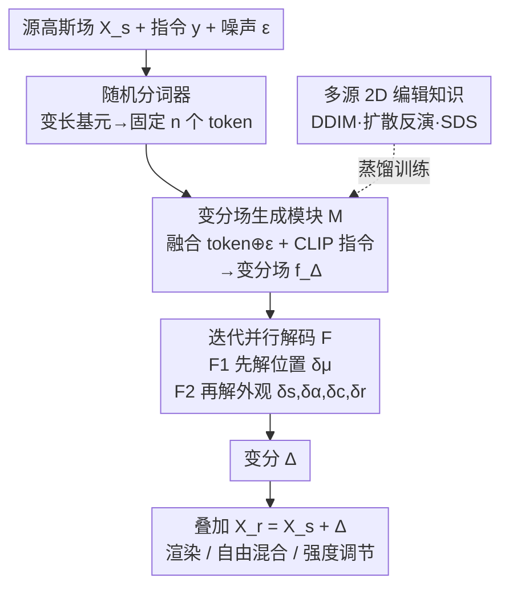

# Variation-Aware Flexible 3D Gaussian Editing

**会议**: ICLR 2026  
**OpenReview**: [https://openreview.net/forum?id=N8PDzscNhg](https://openreview.net/forum?id=N8PDzscNhg)  
**代码**: 无  
**领域**: 3D视觉  
**关键词**: 3D高斯编辑, 变分预测, 知识蒸馏, 前馈编辑, 多视角一致性

## 一句话总结
VF-Editor 把 3D 高斯编辑重新定义为「逐基元属性变分预测」问题，用一个从多源 2D 编辑知识蒸馏出来的前馈变分预测器，约 0.3 秒就能原生地编辑整个高斯场，既根除了「先 2D 编辑、再 3D 重建」范式的多视角不一致，又支持自由混合、强度调节等灵活编辑。

## 研究背景与动机
**领域现状**：当前 3D 高斯泼溅（3DGS）的文本编辑主流是「间接编辑」范式——先用 2D 编辑器（如 IP2P）对场景的多个渲染视角逐张编辑，再拿这些编辑后的图像重新重建 3D 场景（代表作 Instruct-NeRF2NeRF、GaussianEditor、DGE）。

**现有痛点**：这条路有两个绕不开的毛病。其一，2D 编辑器无法保证不同视角上的编辑模式一致，重建出来的 3D 结果会出现视角间冲突（比如换成红球后，各视角看到的球大小不一，重建后扭曲）。其二，每一轮编辑都要「2D 编辑 + 3D 重建」走一遍，既慢又割裂，限制了编辑的灵活性和效率。后续工作靠在 2D 编辑时交换各视角的注意力图来缓解不一致，但神经网络是黑箱，这种修补无法从根上解决问题；而且不同编辑轮次之间能否灵活交互，几乎没人研究。

**核心矛盾**：多视角不一致的根源在于 2D 编辑器本身是一个概率流过程，输出天然带随机性。想让各视角一致就得压制这种随机性，可一压制，3D 编辑结果的多样性又没了——一致性和多样性在间接范式里是对立的。

**本文目标**：训练一个**原生**的前馈 3D 编辑器，直接在 3D 空间出结果，从而绕开「2D 编辑→3D 重建」这条会引入不一致的回路。子问题是：(1) 训练数据极度稀缺，无法用标准监督学习直接训出前馈 3D 编辑器；(2) 直接预测编辑后结果的高斯编辑器很难收敛。

**切入角度**：3DGS 是**显式**表示，每个基元都有明确属性（位置、尺度、不透明度、颜色、旋转）。如果不去预测「编辑后的完整结果」，而是预测每个基元属性的**变分量** $\Delta$，再把变分叠加回原属性，就能大大减轻学习负担；而且逐属性给出精确变分量，天然支持对编辑区域和强度的细粒度控制、以及多段编辑的组合。同时，2D 编辑领域积累了海量先验，可以蒸馏过来填补 3D 数据的空缺。

**核心 idea**：把 3DGS 编辑重定义为「前馈变分预测」，用一个变分预测器把多源 2D 编辑知识蒸馏进单一模型，并在蒸馏时**保留**而非压制 2D 编辑的概率流，从根上化解一致性与多样性的矛盾。

## 方法详解

### 整体框架
VF-Editor 的核心是一个变分预测器 $P_\theta$。给定源 3D 高斯场 $\mathcal{X}^s$、编辑指令 $y$、以及一份从标准高斯分布采的噪声 $\varepsilon$，$P_\theta$ 输出五种属性的变分集合 $\Delta=\{\delta_\mu,\delta_s,\delta_\alpha,\delta_c,\delta_r\}$（分别对应均值/位置、尺度、不透明度、颜色、旋转），编辑结果直接由叠加得到：$\mathcal{X}^r=\mathcal{X}^s+\Delta$。整个推理约 0.3 秒。

$P_\theta$ 内部串三个模块：**随机分词器** $\mathcal{T}$ 先把数量不定的高斯基元压成固定数目的 token；**变分场生成模块** $\mathcal{M}$ 把这些 3D token、关键噪声 $\varepsilon$、以及 CLIP 编码的指令融合成一个变分场 $f_\Delta$；**迭代并行解码函数** $\mathcal{F}$ 再以每个高斯的属性为 query、变分场为 condition，逐基元并行地解出它的变分。训练阶段，$P_\theta$ 通过把多源 2D 编辑器/策略（DDIM 推理、扩散反演、SDS）的知识蒸馏进来获得编辑能力。

### 关键设计

**1. 变分预测重构：把编辑变成「算变化量」而非「画结果」**

直接让模型预测编辑后的完整 3DGS 难以收敛——五种非结构化属性互相耦合，模型会无所适从。本文利用 3DGS 显式表示的特点，把任务改写成预测每个基元的属性变分 $\Delta$，最终结果由叠加得到：$P_\theta:(\mathcal{X}^s,y,\varepsilon)\to\Delta$，$\mathcal{X}^r=\mathcal{X}^s+\Delta$。这样做有三重好处：相比直接预测完整结果，建模「增量」让学习负担显著降低，因为大部分基元在一次编辑里变化很小甚至不变；逐属性精确赋值天然支持对编辑区域和强度的细粒度控制；多次编辑产生的多份 $\Delta$ 可以叠加、混合、缩放，组合出更个性化的结果——这正是后文「灵活编辑」的物理基础。

**2. 随机分词器：让模型吃得下任意数量的高斯基元**

不同场景的高斯基元数量天差地别，而 transformer 需要固定长度输入。分词器从 $\mathcal{X}^s$ 中随机选 $n$ 个基元作锚点，其余作数据点；对每个锚点，取空间上最近的 $k-1$ 个数据点组成一个 group，从而把场景拆成 $n$ 个维度为 $k\!*\!f$ 的 3D token（$f$ 是单个基元的属性维度），再用 MLP 做维度变换。一个关键细节是：选锚点用的是**随机采样**而非点云里常用的最远点采样（FPS）。因为高斯基元的空间分布非常不均匀，FPS 会过度偏向稀疏的边缘基元；随机采样反而能得到更合理的锚点分布。实现上取 $n=256$、$k=128$，token 经 MLP 映到 4096 维。

**3. 变分场生成与关键噪声保留：从根上化解多视角不一致**

这是 VF-Editor 解决一致性—多样性矛盾的核心。作者认为多视角不一致的根因，是 2D 编辑方法内在的**概率流**带来的输出随机性。既然如此，与其像前人那样去压制这种随机性（代价是丢多样性），不如把 2D 编辑的可能结果**存进** $P_\theta$，即在蒸馏时**保留**概率流。具体做法是保留与概率流强相关的关键噪声 $\varepsilon$（如 DDIM 推理的初始噪声），把它和 3D token 拼接后一起喂给 $\mathcal{M}$。$\mathcal{M}$ 由 transformer block 堆叠，指令 $y$ 经 CLIP 文本编码器编码后通过交叉注意力注入 token，生成变分场：

$$f_\Delta=\mathcal{M}(\mathcal{T}(\mathcal{X}^s)\oplus\varepsilon;\,y)$$

由于 DDIM 采样器的确定性，初始噪声与编辑图像一一对应，把 $\varepsilon$ 作为输入、且只用**单个视角**的编辑结果做监督，模型就被强制为「同一份噪声 + 同一指令 → 同一份 3D 变分」，从而各视角天然一致；而换一份噪声又能得到不同的合理编辑，多样性得以保留。这种「用关键噪声保留概率流」的思路此前已在扩散加速领域被验证有效。此外，把变分量统一压进隐空间，也避免了传统变分建模（如三平面）需要的多轮优化。

**4. 迭代并行解码：先挪位置再改外观，避免「只改色不挪形」**

变分场不被转成三平面，而是用一组解码函数 $\mathcal{F}$ 逐基元并行解码。$\mathcal{F}$ 用去掉自注意力的 transformer 实现，以每个高斯的全部属性为 query、变分场为 key/value，各基元独立解码，因此对基元数呈**线性**复杂度且可并行加速。关键在于「迭代」二字：作者把均值 $\mu$（位置）从其余属性里分离出来，分两步预测——先解位置、再在更新后的位置上解外观：

$$[\delta_\mu]=\mathcal{F}_1(\mathcal{X}^s_\mu,\mathcal{X}^s_\alpha,\mathcal{X}^s_s,\mathcal{X}^s_c,\mathcal{X}^s_r;f_\Delta)$$
$$[\delta_s,\delta_\alpha,\delta_c,\delta_r]=\mathcal{F}_2(\mathcal{X}^s_\mu+\delta_\mu,\mathcal{X}^s_\alpha,\mathcal{X}^s_s,\mathcal{X}^s_c,\mathcal{X}^s_r;f_\Delta)$$

这是为了对治一个具体毛病：如果五种属性同时改，由于属性互相耦合，模型会倾向于「改外观」来满足指令、而不愿「挪位置」——比如让它戴帽子，它可能直接给头顶染色而不是真的生成/移动基元。先单独解位置变分、再让外观解码以更新后的位置为条件，就强迫模型先处理几何位移。$\mathcal{F}$ 末尾还插了「zero linear」（零初始化线性层），保证 $P_\theta$ 初始输出为零，给训练提供更有效的初始梯度。

### 损失函数 / 训练策略
$P_\theta$ 完全靠蒸馏多源 2D 编辑知识来训练，作者用了三种蒸馏策略，把不同 2D 编辑器/策略 $\{E_{T_1},\dots,E_{T_N}\}$ 的知识压进同一个 $P_\theta$：

- **DDIM 推理**：对 RObj/GObj，用 IP2P 编辑渲染图，存「初始噪声–指令–编辑图」三元组（DDIM 确定性保证一一对应）；对场景数据，因 IP2P 不擅上色，改用 CtrlColor 采集上色三元组。
- **扩散反演**：用 DDPM 反演策略采集适合「替换」任务的三元组；DDPM 采样不确定，只保留反演最后一步从高斯分布采的噪声作 $\varepsilon$，靠数据稀疏性让模型仍能收敛到一条退化的概率流。

蒸馏主损失是「编辑结果渲染图」对齐「2D 编辑目标图」的 MSE：

$$\mathcal{L}_{din}=\mathbb{E}_{\mathcal{X}^r}\left[d\big(R(\mathcal{X}^r),x_e\big)\right],\quad \mathcal{X}^r=P_\theta(\mathcal{X}^s,y,\varepsilon)+\mathcal{X}^s$$

其中 $R$ 是可微光栅化渲染，$x_e$ 是编辑目标图，$d$ 取 MSE。

- **SDS（得分蒸馏采样）**：另可用 $\mathcal{L}_{sds}$ 无需离线采集三元组、且不受 2D 编辑图质量影响地蒸馏。但 SDS 只提供隐式验证而非直接监督，常导致编辑结果模式坍缩、丢多样性，因此不作主蒸馏手段，仅用来得到一个泛化不错的鲁棒 baseline。

实现上 $\mathcal{L}_{din}$ 用 batch 16、4×A100 训 52 小时；$\mathcal{L}_{sds}$ 用 batch 32、单 A100 训 90 小时。共采集约 3,348 个 3D-指令对、32,566 个三元组。

## 实验关键数据

### 主实验
在重建物体（RObj）、生成物体（GObj）、场景（Scene）三类数据上与 I-gs2gs、GaussianEditor、DGE 对比，指标含 Inception Score（IS，多样性/质量）、CLIP 方向相似度（Csim）、CLIP 方向一致性（Ccon）、图像美学评分（IAA）。VF-Editor-S 在单域数据训练，VF-Editor-M 在多域数据训练。

| 方法 | RObj IS↑ | RObj Csim↑ | GObj IS↑ | Scene IS↑ | IAA↑ |
|------|----------|-----------|----------|-----------|------|
| I-gs2gs | 3.86 | 0.193 | 3.51 | 3.37 | 4.74 |
| GaussianEditor | 3.25 | 0.261 | 3.19 | 3.65 | 4.89 |
| DGE | 3.10 | 0.252 | 2.95 | 3.54 | 5.05 |
| **VF-Editor-M** | **4.32** | 0.296 | 4.15 | **4.06** | **5.24** |
| **VF-Editor-S** | 4.31 | **0.292** | **4.24** | 4.04 | 5.19 |

VF-Editor 在 IS 上大幅领先：DGE 虽靠跨视角一致性约束拿到较高 Csim/Ccon，但 IS 明显偏低（一致性约束压低了多样性）；VF-Editor 用「容纳而非限制多样性」的思路，在保证质量的同时显著提升多样性，IAA 最高说明结果更贴合人类偏好。另一个有意思的发现：面对缺乏先验信息的简单指令（如「make its color look like rainbow」），间接编辑方法几乎失效，而 VF-Editor 仍能正常工作。

### 消融实验

| 配置 | IS↑ | Csim↑ | Ccon↑ | IAA↑ | 说明 |
|------|-----|-------|-------|------|------|
| Direct Decoding | 4.71 | 0.254 | 0.801 | 5.21 | 不分离位置，五属性同时解 |
| Triplane | 4.57 | 0.246 | 0.782 | 5.09 | 用三平面表示变分场 |
| **VF-Editor-M** | 4.66 | **0.259** | **0.803** | **5.22** | 迭代并行解码（完整） |

泛化实验另收集 50 重建物体 + 50 生成物体 + 10 生成场景作未见测试集，训练集→测试集 Csim 从 0.268 轻微降到 0.241、IAA 从 5.24 到 5.16，仍维持良好水平。

### 关键发现
- **迭代解码主要救「位置变化」类指令**：定量指标看 Direct Decoding 似乎差别不大，但定性上对需要基元位移的指令（如「戴派对帽」「给红头发」）直接解码会失效——因属性耦合，模型偷懒改外观而不挪位置；迭代分离位置后才正常。这说明聚合指标会掩盖几何编辑能力的退化。
- **三平面会让变分模糊**：用三平面表示变分场时，空间相邻的高斯会抽到高度相似的特征、解出相似变分，导致区域边界不清、整体发糊，且基元越多越严重；逐基元并行解码不施加邻域先验约束，能学到更精细的变分。
- **多域数据几乎不损收敛**：$P_\theta$ 面对多域数据时收敛过程几乎不受影响，验证了统一设计的通用性，故后续实验均用多域数据训练。

## 亮点与洞察
- **「保留概率流」是反直觉但巧妙的一招**：前人都在想办法压制 2D 编辑的随机性来求一致，本文反其道把关键噪声 $\varepsilon$ 当输入存进模型，让「噪声→3D 变分」确定化，于是一致性靠确定映射拿到、多样性靠换噪声拿到，一举化解了原本对立的两个目标。
- **变分（增量）建模可迁移**：把「预测完整结果」改成「预测显式表示上的增量」，既降低学习负担、又让结果天然可组合（混合/缩放/局部选择），这套思路对任何显式 3D 表示（点云、网格属性）的编辑都值得借鉴。
- **属性解耦顺序很关键**：先解几何位移、再以新位置为条件解外观，用一个简单的两步迭代就治住了「模型偷懒只改色」的通病，提示在多属性耦合的预测任务里，解码顺序本身就是一种强先验。

## 局限与展望
- **不支持域外编辑**：仅采集约 3,348 个 3D-指令对，模型对域内未见数据泛化良好，但还不能处理训练分布外的编辑；作者计划高效扩充 $P_\theta$ 的知识覆盖。
- **SDS 难以有效融合**：单用 $\mathcal{L}_{sds}$ 会坍缩到每条指令一个解，朴素地与 $\mathcal{L}_{din}$ 联合又会发散；如何有效整合二者以进一步增强能力仍是开放问题。
- **挪动既有基元会轻微影响周边**：VF-Editor 在物体添加上效果好，但重定位已有基元时偶尔会对周边区域产生轻微影响；作者认为引入专门的基元生成分支或可改善。
- 笔者补充：评测高度依赖 CLIP 类指标和 IAA，缺乏人类主观研究的大规模验证；且对比 baseline 因编辑耗时只在 RObj/GObj 各随机抽 100 对测试，统计稳健性有待加强。

## 相关工作与启发
- **vs 间接编辑（Instruct-NeRF2NeRF / GaussianEditor / DGE）**：它们都要把 3D 转成 2D 图、编辑后再重建，多视角不一致无法根治、且每轮编辑慢；VF-Editor 原生在 3D 空间前馈出变分，不经 2D 重建回路，0.3 秒完成且天然一致。DGE 用对极几何注意力注入提升一致性，但替换目标在不同视角的大小差异仍会让重建结果扭曲。
- **vs 单一类型 3D 编辑（GSS 改色系数 / 3DSceneEditor 增删物体）**：这些只支持单一编辑类型，灵活性不足；VF-Editor 用统一变分预测器容纳多源知识，覆盖上色、风格迁移、替换、局部细节等多类指令。
- **vs 原生 3D 扩散编辑（3D-LATTE / VoxHammer）**：它们依赖预训练 3D 生成器，数据分布受限；VF-Editor 蒸馏成熟的 2D 编辑先验，绕开 3D 生成器的分布瓶颈。

## 评分
- 新颖性: ⭐⭐⭐⭐⭐ 把 3DGS 编辑重定义为变分预测、并用「保留概率流」化解一致性—多样性矛盾，是少见的原生前馈 3D 编辑思路。
- 实验充分度: ⭐⭐⭐⭐ 三类数据 + 多基线 + 迭代/三平面消融 + 泛化实验较完整，但缺人类主观评测、对比测试样本偏少。
- 写作质量: ⭐⭐⭐⭐ 动机推导清晰、方法层次分明；部分符号（如 $\mathcal{F}$ 结构）需对照图才好懂。
- 价值: ⭐⭐⭐⭐ 实时、灵活、可组合的原生 3D 编辑器对 VR/游戏/工业设计有实用潜力，变分建模思路可迁移。

<!-- RELATED:START -->

## 相关论文

- [\[ICLR 2026\] MAVEN: A Mesh-Aware Volumetric Encoding Network for Simulating 3D Flexible Deformation](maven_a_mesh-aware_volumetric_encoding_network_for_simulating_3d_flexible_deform.md)
- [\[CVPR 2025\] Perturb-and-Revise: Flexible 3D Editing with Generative Trajectories](../../CVPR2025/3d_vision/perturb-and-revise_flexible_3d_editing_with_generative_trajectories.md)
- [\[CVPR 2026\] ObjectMorpher: 3D-Aware Image Editing via Deformable 3DGS](../../CVPR2026/3d_vision/objectmorpher_3d-aware_image_editing_via_deformable_3dgs.md)
- [\[ICLR 2026\] Gradient-Direction-Aware Density Control for 3D Gaussian Splatting](gradient-direction-aware_density_control_for_3d_gaussian_splatting.md)
- [\[ICLR 2026\] Frequency-Aware Dynamic Gaussian Splatting](frequency-aware_dynamic_gaussian_splatting.md)

<!-- RELATED:END -->
