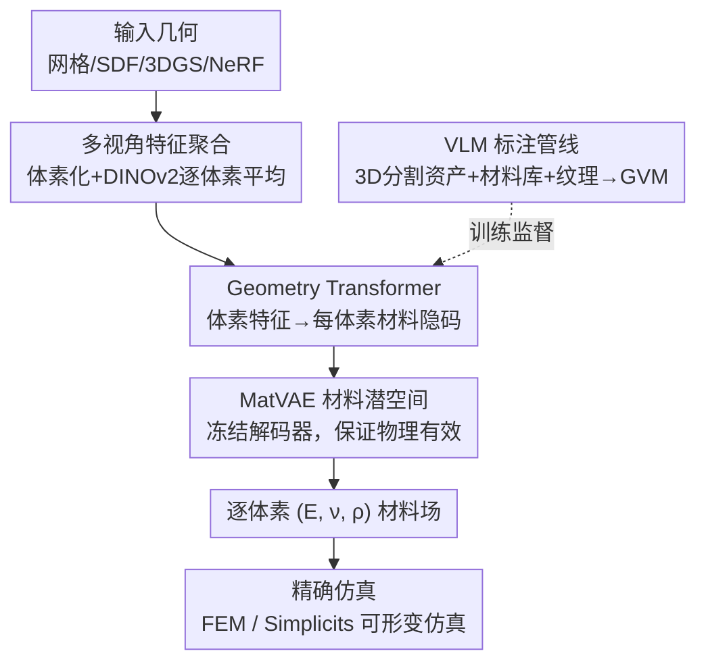

# VoMP: Predicting Volumetric Mechanical Property Fields

**会议**: ICLR 2026  
**OpenReview**: [https://openreview.net/forum?id=aTP1IM6alo](https://openreview.net/forum?id=aTP1IM6alo)  
**论文**: [NVIDIA Project Page](https://research.nvidia.com/labs/sil/projects/vomp)  
**代码**: 暂未公开（项目页：research.nvidia.com/labs/sil/projects/vomp）  
**领域**: 3D视觉 / 物理仿真材料预测  
**关键词**: 体积材料预测, 杨氏模量, 前馈推理, 材料潜空间, 多视角特征聚合

## 一句话总结
VoMP 是首个前馈式预测 3D 物体**体内**力学材料场（杨氏模量 $E$、泊松比 $\nu$、密度 $\rho$）的方法：把任意可体素化、可渲染的 3D 表示（网格 / 高斯泼溅 / NeRF / SDF）逐体素聚合多视角 DINOv2 特征，经 Geometry Transformer 预测每体素材料隐码，再由约束在"物理可行材料流形"上的 MatVAE 解码出真实材料三元组，几秒内即可给出可直接用于精确仿真的材料，精度与速度都大幅超越此前方法。

## 研究背景与动机
**领域现状**：物理仿真（数字孪生、Real-2-Sim、Sim-2-Real）的前提是给被仿真物体的**每一点**赋予准确的力学材料参数——局部各向同性材料模型里最常用的就是杨氏模量 $E$、泊松比 $\nu$、密度 $\rho$ 这组三元组。但常见的 3D 采集方法（如高斯泼溅）和 3D 资产库几乎都不带这类标注。

**现有痛点**：现状是艺术家/工程师手工"猜"或套用粗糙的材料预设，主观且耗时。已有的学习类方法也各有硬伤：NeRF2Physics、PUGS 这类需要对每个物体做**逐物体优化**（优化语言嵌入特征场），慢，且 NeRF/泼溅内部缺乏有意义特征，预测不了物体**内部**的材料；另一类从视频生成模型蒸馏信号、反传穿过快速近似仿真器来优化材料，结果是**仿真器专属**参数，跨框架不可移植，也偏离真实物理量；还有一类只输出**粗材料类别**，需要人工映射到仿真参数。

**核心矛盾**：要么慢（逐物体优化）、要么只覆盖表面（缺内部特征）、要么输出的是仿真器专属/类别化的近似量而非真实可移植的物理材料。前馈、跨表示、体内、物理有效——这四点此前没有方法能同时做到。

**本文目标**：训一个前馈模型，输入任意可体素化+可渲染的 3D 几何，直接输出**物体体内**逐体素的、**物理有效**的真实材料三元组 $(E,\nu,\rho)$，且与任意精确仿真器兼容。

**切入角度**：作者把问题拆成两件正交的事——"学什么材料是合法的"和"学怎么给某个物体的各处分配材料"。前者用一个在真实测量材料上训练的 VAE 把合法材料压成低维潜空间来兜底，保证任何输出（甚至插值点）都落在某种真实材料的范围内；后者用一个 3D Transformer 在这个潜空间里做逐体素回归。

**核心 idea**：用一个**材料潜空间（MatVAE）当连续 tokenizer 兜底物理有效性**，再用**多视角特征 + Geometry Transformer 做前馈逐体素材料隐码预测**，把"材料合法性"与"材料分配"解耦。

## 方法详解

### 整体框架
VoMP 的输入是任意能被体素化并从环视视角渲染的 3D 几何（网格、SDF、3D 高斯泼溅、NeRF），输出是该几何体**内部+表面**每个体素上的力学材料三元组 $(E,\nu,\rho)$，可直接灌入精确仿真器（如高分辨率有限元 FEM）做可形变仿真。整条管线分三步串起来：先把几何体素化并把多视角 DINOv2 图像特征"提升"到每个体素（含内部体素）；再用 Geometry Transformer 把这些体素特征映射成每体素的材料隐码；最后用一个**冻结的** MatVAE 解码器把隐码逐体素解成真实材料三元组。其中 MatVAE 是独立预训练的——它先在一个真实测量材料数据集上学好"什么材料合法"的二维潜空间，训练 Transformer 时只借用它的冻结解码器，从而把"合法性"这件事从"分配"中剥离出来。

### 关键设计

**1. MatVAE 材料潜空间：把"物理合法性"做成兜底的连续 tokenizer**

最棘手的痛点是：直接回归 $(E,\nu,\rho)$ 没法保证结果是真实存在的材料，插值出来的值很可能物理上不成立。VoMP 的解法是先在一个真实测量材料数据集上训练 MatVAE，把三元组 $(E,\nu,\rho)\in\mathbb{R}^3$ 映射到二维潜空间 $z\in\mathbb{R}^2$ 再重建。虽然 $\mathbb{R}^3\to\mathbb{R}^2$ 压缩很小，但这个 2D 空间易于可视化、采样和插值，且让单位差异极大的三元组之间有一致的"距离"；更关键的是它像一个**连续 tokenizer**，保证 VoMP 的任意输出都落进某种真实材料的范围内。重建损失是归一化后的 MSE（$E$、$\rho$ 先取 $\log_{10}$ 再归一到 $[0,1]$，$\nu$ 直接归一），作者发现不做 log 变换会得到重尾分布、不利于学习。

在标准 VAE 上作者做了三处针对性修改，都对应训练中观察到的具体病：其一，编码器输出经一个径向 Normalizing Flow 变换，得到更灵活的后验 $q_\phi(z\mid m)$，应对 $E$、$\rho$ 重尾、$\nu$ 归一后挤在边界的复杂分布；其二，按总相关 $\mathrm{TC}(z)=\mathrm{KL}(\bar q_\phi(z)\,\|\,\prod_j \bar q_\phi(z_j))$ 拆解 ELBO 的 KL 项并直接惩罚它，解决"密度被同时编码进两个维度"的强耦合问题；其三，加一个基于 free-nats 的容量约束 $\delta\times z_{\dim}$，逼两个潜维都被用上，避免潜空间坍缩到只重建好某一个属性。最终目标函数为
$$\mathcal{L}_{\text{MatVAE}}=\mathcal{L}_{\text{Recon}}+\gamma\cdot \mathrm{MI}(z)+\beta\cdot \mathrm{TC}(z)+\alpha\sum_{j=1}^{d}\max\big(\delta,\,\mathrm{KL}(q_\phi(z_j)\,\|\,p(z_j))\big),$$
其中 $(\gamma,\beta,\alpha)=(1.0,2.0,1.0)$、$\delta=0.1$。

**2. 多视角特征聚合：把图像特征提升到体内体素，而非只覆盖表面**

要预测物体**内部**的材料，就不能像以往工作那样只在表面提特征。VoMP 把输入几何体素化后，对 $N^3$ 网格中的每个活跃体素中心 $p_i$，沿相机投影 $\Pi_j$ 投到每个渲染视角，取对应的 DINOv2 patch-token 特征图 $F_j$ 上双线性采样的特征，再对所有视角取平均得到该体素的特征：
$$f_i=\mathrm{Average}\Big(\big\{F_j(\Pi_j(p_i))\mid j\in J\big\}\Big)\in\mathbb{R}^{1024}.$$
与前作（Wang、Dutt、Xiang 等）只处理表面不同，VoMP **连物体内部也体素化并处理**——这样多视角信息被传播到内部体素，模型才有信号去学习物体内部的材料构成。对高斯泼溅这种难体素化的表示，作者还提出一个三阶段体素化器：先把高斯按 99 百分位等值面当实心椭球体素化，再从数十个视角渲染深度图，最后用深度图把外部空体素"雕"掉、但保留看不见的内部体素，得到物体的实心近似（测试物体 31 ms 即可体素化）。

**3. Geometry Transformer：在材料潜空间里做前馈逐体素回归**

核心网络 $\mathcal{F}$ 是把体素化图像特征映到 MatVAE 材料隐表示的 Transformer，骨干沿用 TRELLIS 的 encoder/decoder 并用其权重初始化。编码器处理变长的活跃体素集合 $X=\{(p_i,f_i)\}_{i=1}^L$：先把体素特征序列化，再用从 3D 坐标导出的正弦位置编码注入空间感知，并采用 3D 移位窗口注意力。为应对不同尺寸资产，作者设定最大序列长度 $L_N$（实验取 32768）：体素数 $L\le L_N$ 时用全集，$L>L_N$ 时每个 epoch 起始**随机重采样** $L_N$ 个体素，让模型在不同 epoch 见到资产不同部位、等效扩大可处理体素上限。每体素隐码送入**冻结的** MatVAE 解码器得到 $(E,\nu,\rho)$，训练用预测材料与真值的 MSE（在当前迭代体素集 $S$ 上平均）：
$$\mathcal{L}_{\mathcal{F}}=\frac{1}{|S|}\sum_{i\in S}\big\|\mu_\theta(\mathcal{F}(X_S)_i)-((E_i,\nu_i,\rho_i)_N)^{T}\big\|_2^2,$$
其中 $\mu_\theta$ 是冻结 MatVAE 解码器。推理时再把体素材料用最近邻插值搬回原表示（泼溅均值 / FEM 的四面体 / 仿真求积点等）。

**4. VLM + 多源知识的标注管线：解决"体积材料训练数据几乎不存在"**

训练 Geometry Transformer 缺的是带体内材料标注的 3D 数据集。作者构建两个数据集：MTD（Material Triplet Dataset）从多个在线材料数据库收集 100,562 条真实测量三元组（按材料有效范围大小成比例采样、去重），专供 MatVAE。GVM（Geometry with Volumetric Materials）则用一条自动管线标注 3D 资产——收集 1624 个**部件级分割**的高质量网格（共 8089 个部件，每个部件视为各向同性材料，带英文材料名和真实 PBR 纹理）。对每个部件，喂给 VLM（实验选 Qwen 2.5-VL-72B）的不仅是整物体渲染，还包括把该部件视觉材料映到球面的细节渲染、材料名、以及按材料名在 MTD 中检索到的三个最近真实材料的取值范围。这样 VLM 不是凭空猜，而是**被真实材料数值和多源线索约束**着输出三元组，再映射到部件内所有体素，最终标注出 3700 万个带 $(E,\nu,\rho)$ 的体素。这正是它相对 Phys4DGen 等"裸 VLM 聚合"基线更准、更物理可信的原因。

### 损失函数 / 训练策略
MatVAE 用式 (2) 的 $\mathcal{L}_{\text{MatVAE}}$；Geometry Transformer 用式 (4) 的逐体素材料 MSE，MatVAE 解码器全程冻结。MTD 与 GVM 都按 80-10-10 划分 train/val/test。渲染用 Omniverse + Blender，DINOv2 用优化实现。全部实验在 4×80GB A100 上完成，MatVAE 训约 12 小时、Transformer 训约 5 天。

## 实验关键数据

### 主实验（GVM 新基准上的材料估计精度）
GVM 测试集含 166 个高质量 3D 物体、约 490 万点级标注，远大于以往（如 NeRF2Physics 仅 11 物体 31 点）。指标为各属性的 ALDE / ALRE / ADE / ARE（越低越好）。

| 方法 | $E$ ALDE↓ | $E$ ALRE↓ | $\nu$ ARE↓ | $\rho$ ADE↓ | $\rho$ ARE↓ |
|------|-----------|-----------|------------|-------------|-------------|
| NeRF2Physics | 2.80 | 0.135 | — | 1432.0 | 1.037 |
| PUGS | 3.39 | 0.169 | — | 3568.2 | 3.243 |
| Phys4DGen⋆ | 4.90 | 0.223 | 0.147 | 1865.6 | 1.439 |
| **VoMP（本文）** | **0.379** | **0.041** | **0.082** | **142.7** | **0.092** |

作者据 §D.4 的仿真探查给出可解释门槛：$E$ 的 ALRE < 0.05、其它属性 ARE < 0.15 时仿真效果相近——VoMP 的 $E$ ALRE = 0.041 已跨过该门槛，意味着在精确仿真器下能比对手产生更忠实的仿真。NeRF2Physics、PUGS 甚至不输出泊松比 $\nu$。

### 速度对比（单 A100 + 64 CPU，100 次平均，约 53.9K 高斯/物体）

| 方法 | 端到端时间 (s) |
|------|----------------|
| NeRF2Physics | 1454.55 |
| PUGS | 1058.33 |
| Pixie（并发工作） | 201.63 |
| Phys4DGen⋆ | 51.65 |
| **VoMP（本文）** | **3.59** |

VoMP 时间分解：渲染 2.11s、DINOv2 计算 0.86s、DINOv2 重建 0.58s、体素化 0.03s，而 Geometry Transformer 仅 0.008s、MatVAE 仅 0.0003s——瓶颈全在渲染/预处理，纯网络推理几乎免费。整体比对手快 5–100×，根本原因是它是唯一的纯前馈方法（无逐物体优化）。

### 关键发现
- **物理有效性是设计出来的**：在 MTD 真实材料范围上度量"输出离最近真实材料范围的相对误差"，VoMP 平均输出远比基线更接近真实材料——因为它被显式约束在 MatVAE 材料流形上，而基线没有这种兜底。
- **网络几乎不是瓶颈**：Transformer + MatVAE 合计 < 9ms，几秒的总耗时几乎全花在渲染和 DINOv2，说明前馈范式把"算材料"这件事变得近乎实时。
- **跨表示泛化**：同一模型可处理网格、SDF、3DGS、NeRF，质性上能驱动多物体掉落、可形变碰撞等真实仿真且无需任何手工调参。
- **质量提升来源**：基线掉点多因偶发误标部件（Phys4DGen）、噪声估计（NeRF2Physics/PUGS）以及对物体内部估计不准；VoMP 体内体素化 + 潜空间兜底正好补上这些短板。

## 亮点与洞察
- **"合法性"与"分配"解耦**：用一个独立预训练、推理时冻结的 MatVAE 当连续 tokenizer，把"输出必须是真实材料"这件硬约束从主网络里剥离出来。这个思路可迁移到任何"回归值必须落在合法物理/语义流形内"的任务（如反射率、BRDF、热学参数预测）。
- **内部体素化是关键差异点**：以往多视角特征提升只覆盖表面，VoMP 坚持把内部也体素化并用多视角平均特征"灌"进去，这是它能预测体内材料、而非只贴表面标签的根本。
- **VLM 不裸用而是被数值约束**：把 MTD 里检索到的真实材料取值范围连同纹理球面渲染一起喂给 VLM，相当于给"幻觉重灾区"加了物理护栏——这比直接信 VLM 的部件级材料标注稳健得多。
- **借力 TRELLIS 骨干 + 随机体素重采样**：用 TRELLIS 权重初始化省训练成本，再用 epoch 级随机重采样把大资产的有效体素上限撑大，是处理变尺寸 3D 资产的实用工程招法。

## 局限与展望
- **依赖渲染/体素化质量**：瓶颈在渲染与 DINOv2 预处理（占总耗时绝大部分），对无法良好渲染或体素化的几何会受限；高斯泼溅还需专门的三阶段体素化器。
- **部件级各向同性假设**：GVM 标注把每个部件当成单一各向同性材料，难以表达部件内部的连续渐变或各向异性材料。
- **VLM 标注上限**：训练监督来自 VLM（即便有数值约束），其精度上限受 VLM 与材料库覆盖度制约，植被等子集甚至无法公开。
- **数据/代码可得性**：训练依赖 NVIDIA 内部高质量资产，部分数据不可公开，复现门槛较高；代码尚未释出。
- **改进方向**：把渲染/特征提取进一步优化以逼近实时；支持各向异性与部件内连续材料场；探索把仿真反馈回灌到材料预测里做闭环。

## 相关工作与启发
- **vs NeRF2Physics / PUGS**：它们对每个物体优化语言嵌入特征场来查粗刚度类别与密度，慢且因 NeRF/泼溅内部无有意义特征而预测不了体内材料、也不输出 $\nu$；VoMP 前馈、体内、输出完整三元组，速度快 300–400×、精度大幅领先。
- **vs Phys4DGen**：直接聚合 VLM 预测并映射到物理参数，易误标且噪声大；VoMP 把 VLM 只用在**离线标注训练集**且用真实材料数值约束，再训前馈模型，运行时不再依赖脆弱的大模型聚合。
- **vs PhysSplat / 视频蒸馏类**：这些预测的是 MPM 等仿真器专属的材料偏移权重、不重真实物理量、跨框架不可移植；VoMP 输出真实测量量级的 $(E,\nu,\rho)$，与任意精确仿真器及依赖这三量的本构模型（Neo-Hookean、StVK、Co-Rotated 等）兼容。
- **vs Pixie（并发前馈工作）**：Pixie 训练样本来自语义分割、用 NeRF 密度过滤的点，偏向表面，且预处理含逐物体优化；VoMP 体素化包含内部结构、专注预测物理可行材料、端到端更快。
- **vs SOPHY / PhysX-3D（生成式）**：它们是生成新带物理属性形状的生成模型、无法增强已有资产；VoMP 把材料预测当确定性推理，专门给现有 3D 资产增材料。

## 评分
- 新颖性: ⭐⭐⭐⭐⭐ 首个前馈、跨表示、体内、物理有效的力学材料场预测方法，并首次提出材料潜空间。
- 实验充分度: ⭐⭐⭐⭐⭐ 新建 490 万点级基准 + 速度/精度/有效性/质量多维评测，全面碾压前作。
- 写作质量: ⭐⭐⭐⭐ 动机与设计解耦讲得清楚，但部分核心结果（部分图）在正文以图编号引用、阅读需对照。
- 价值: ⭐⭐⭐⭐⭐ 把"给 3D 资产配仿真材料"从手工几小时变成几秒前馈，对数字孪生/Real-2-Sim 流程实用价值大。

<!-- RELATED:START -->

## 相关论文

- [\[ICML 2026\] Adaptive Volumetric Mechanical Property Fields Invariant to Resolution](../../ICML2026/3d_vision/adaptive_volumetric_mechanical_property_fields_invariant_to_resolution.md)
- [\[ICLR 2026\] EgoNight: Towards Egocentric Vision Understanding at Night with a Challenging Benchmark](egonight_towards_egocentric_vision_understanding_at_night_with_a_challenging_ben.md)
- [\[ICLR 2026\] Splat the Net: Radiance Fields with Splattable Neural Primitives](splat_the_net_radiance_fields_with_splattable_neural_primitives.md)
- [\[ICLR 2026\] Einstein Fields: A Neural Perspective To Computational General Relativity](einstein_fields_a_neural_perspective_to_computational_general_relativity.md)
- [\[ICLR 2026\] MAVEN: A Mesh-Aware Volumetric Encoding Network for Simulating 3D Flexible Deformation](maven_a_mesh-aware_volumetric_encoding_network_for_simulating_3d_flexible_deform.md)

<!-- RELATED:END -->
