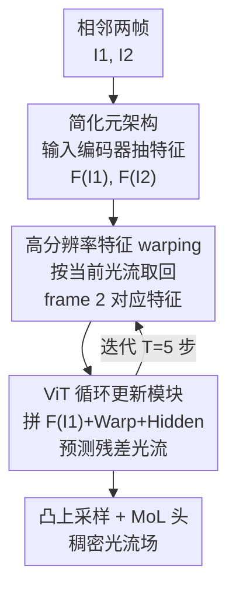

# WAFT: Warping-Alone Field Transforms for Optical Flow

**会议**: ICLR 2026  
**OpenReview**: [https://openreview.net/forum?id=HTqGE0KcuF](https://openreview.net/forum?id=HTqGE0KcuF)  
**代码**: https://github.com/princeton-vl/WAFT  
**领域**: 3D视觉 / 光流  
**关键词**: 光流估计, 特征 warping, 代价体, 迭代更新, 元架构

## 一句话总结
WAFT 用高分辨率的特征 warping 彻底替换掉光流方法里被奉为标配的代价体（cost volume），靠一个 DPT/ViT 的迭代更新模块隐式处理大位移，在 Spring、Sintel、KITTI 上拿下第一档精度的同时显存只用同类方法的 1/3、速度快 1.3–4.1 倍。

## 研究背景与动机
**领域现状**：现代光流主流是「代价体 + 迭代更新」范式（RAFT、SEA-RAFT、FlowFormer 等）。代价体显式计算 frame 1 每个像素与 frame 2 邻域像素的视觉相似度，被认为是比单纯图像特征更强的表征，尤其擅长建模大位移，是绝大多数 SOTA 方法的核心组件。

**现有痛点**：代价体在时间和显存上都很贵，开销随邻域半径平方增长。即便用 partial cost volume（只在对应像素邻域内查找）规避完整 4D 代价体，显存依然居高不下——论文实测 SEA-RAFT 在 1/2 分辨率下直接 OOM。为了能跑，几乎所有方法都被迫在 1/8 分辨率上构建并查询代价体。

**核心矛盾**：代价体的高显存逼着方法在低分辨率上索引；而预测出的稠密光流场要降采样到 1/8 才能查代价体，这个降采样不可避免地引入误差，导致物体边界模糊（论文 Figure 3 里现有方法在边界角落明显糊掉）。精度和效率被代价体死死绑住。

**本文目标**：在不构建代价体的前提下，既要 SOTA 精度，又要高分辨率索引带来的清晰边界，还要低显存高速度。

**切入角度**：作者重新审视了被冷落约 8 年的 warping 操作。Warping 不算相似度，只是「按当前光流估计去 frame 2 把对应像素的特征向量取回来」，天然便宜、显存友好，因此能直接在高分辨率上索引。它唯一的短板是丢掉了代价体显式建模大位移的能力——而这一点恰好可以交给 ViT 的注意力机制隐式补上。

**核心 idea**：用「高分辨率特征 warping + ViT 迭代更新」替代「低分辨率代价体 + 迭代更新」，并顺手砍掉 context encoder，得到一个极简、几乎无光流专属设计的元架构。

## 方法详解

### 整体框架
WAFT 整体沿用 RAFT 系的「输入编码 + 循环更新」两段式骨架，但把中间的代价体换成 warping。给定相邻两帧 $I_1, I_2 \in \mathbb{R}^{H\times W\times 3}$，先用一个输入编码器各自抽取特征 $F(I_1), F(I_2)$；然后循环更新模块迭代 $T$ 步（训练/推理都用 $T=5$）逐步精化光流。每一步的关键动作是：用当前光流估计 $f_{cur}$ 对 frame 2 的特征做轻量的反向 warping，$\text{Warp}(f_{cur})_p = F(I_2)_{p+(f_{cur})_p}$，把对应像素的特征「拉回」到 frame 1 的坐标系，再和 $F(I_1)$、隐藏状态拼起来喂给更新模块预测残差光流。整条链路没有任何代价体，因而能在 1/2 这种高分辨率上索引。

### 关键设计

**1. 高分辨率特征 warping 替代代价体：用便宜的取特征换掉昂贵的算相似度**

这是全文的命门，直击「代价体逼着低分辨率索引、低分辨率索引糊边界」这个核心矛盾。代价体对 frame 1 的每个像素都要和 frame 2 的一片邻域算点积相似度 $V_{p,p'}=F(I_1)_p\cdot F(I_2)_{p'}$，开销随半径平方膨胀；warping 则只取一个向量——按当前光流 $f_{cur}$ 直接索引 frame 2 在对应位置的特征 $\text{Warp}(f_{cur})_p=F(I_2)_{p+(f_{cur})_p}$。两者的共同点是都用「当前光流估计去索引特征图」，这与经典光流的不动点优化（Brox 等）一脉相承；差别在于 warping 放弃了显式枚举相似度。代价直接换来收益：论文实测 WAFT-Twins-a2 训练显存在 1/2 分辨率仅 9.2 GiB，而 SEA-RAFT 同分辨率直接 OOM；省下的显存正好用来做高分辨率索引，从而拿到更清晰的边界和更低误差。消融里把索引从 1/2 降到 1/8，Spring 的 1px 指标从 1.43 明显变差到 1.82，印证了「高分辨率索引」才是精度来源，而非单纯堆 backbone。

**2. ViT/DPT 循环更新模块：用注意力把 warping 丢掉的大位移建模能力补回来**

Warping 只看一个对应像素，没法像代价体那样显式覆盖大范围位移，这是它过去打不过代价体的根本原因。WAFT 的答案是把更新模块换成一个改装版 DPT（基于 ViT），靠注意力机制的长程依赖隐式建模大位移。每步把 frame 1 特征 $F(I_1)$、warp 后的 frame 2 特征 $\text{Warp}(f_{cur})$、以及隐藏状态 $\text{Hidden}_t\in\mathbb{R}^{h\times w\times d}$ 拼接送入模块，预测残差光流更新。这个 transformer 设计被证明是「让 warping 重新work」的关键：消融里把 DPT 换成纯 CNN（ResNet18）后 Sintel(Clean) 从 1.18 暴涨到 7.23，换成 ConvGRU 也掉到 2.79——这恰好解释了为什么 2017 年前后用 CNN 实现 warping 的早期方法（FlowNet2、SpyNet）干不过代价体方法：不是 warping 不行，是当年缺了能建模长程依赖的架构。

**3. 极简元架构：砍掉 context encoder，直接复用现成预训练骨干**

去掉代价体之后，作者顺势把另一个光流专属组件——context encoder（给更新模块额外喂特征）也一并删掉，消融显示它只增加计算量、对精度几乎没贡献（论文指出它本质上等价于 WAFT 第一次迭代的直接回归）。这样 WAFT 退化成一个「输入编码器 + 更新单元」的干净元架构，两个子模块都不需要光流专属设计，可以直接换上现成的预训练模型：作者试了 ImageNet 预训练的 Twins、深度预训练的 DAv2、自监督的 DINOv3，并给出两种适配方式——a1 冻结整个 DAv2 只接 DPT head + ResNet18 微调，a2 只冻 backbone、放开 DPT head 并用 3 个 ResNet block 做 side-tuning（更通用也更强）。这种「无定制设计 + 可加载标准预训练权重」的特性既提升了泛化，也让直接法与迭代法第一次能做苹果对苹果的公平对比。

### 损失函数 / 训练策略
预测头沿用 SEA-RAFT 的 Mixture-of-Laplace（MoL）损失：每步用隐藏状态预测 $M\in\mathbb{R}^{h\times w\times 6}$ 的 MoL 参数，再通过凸上采样（convex upsampling）恢复到原图分辨率。训练遵循 SEA-RAFT 流程：先在 TartanAir 上预训练 300k 步（batch 32，lr $4\times10^{-4}$），再在 FlyingChairs（50k）、FlyingThings（200k）上微调，提交各 benchmark 时按数据集分别 fine-tune。

## 实验关键数据

### 主实验
Spring 排行榜（540p 协议，越低越好除 WAUC）：

| 方法 | 1px↓ | EPE↓ | Fl↓ | WAUC↑ |
|------|------|------|-----|-------|
| SEA-RAFT(M) | 3.686 | 0.363 | 1.347 | 94.534 |
| DPFlow | 3.442 | 0.340 | 1.311 | 94.980 |
| WAFT-Twins-a2 | 3.268 | 0.331 | 1.282 | 94.786 |
| **WAFT-DINOv3-a2** | **3.182** | 0.325 | 1.246 | **95.051** |

Sintel(EPE)/KITTI(Fl) + 推理开销（RTX3090，540p）：

| 方法 | Sintel-Clean↓ | KITTI-All↓ | #MACs(G) | Latency(ms) |
|------|------|------|------|------|
| Flowformer++ | 1.07 | 4.52 | 1713 | 374 |
| CCMR+ | 1.07 | 3.86 | 12653 | 999 |
| DPFlow | 1.04 | 3.56 | 414 | 131 |
| WAFT-DAv2-a2 | 0.95 | 3.31 | 807 | 240 |
| WAFT-DINOv3-a2 | 0.94 | 3.56 | 732 | 212 |

WAFT 在 Spring 三项指标全部第一、KITTI 非遮挡像素第一/全部像素第二、Sintel(Clean) 第一，同 backbone 下精度与效率双双超过代价体 SOTA Flowformer++，比有竞争力的方法快 1.3–4.1×。

零样本跨数据集泛化（在 Chairs+Things 训练后直接测）：WAFT-Twins-a2 把 KITTI(train) 的 EPE 从 3.37 降到 2.98、Fl 从 11.1 降到 9.9，取得最佳泛化，误差降低约 11%。

### 消融实验
基于 WAFT-DAv2-a1，零样本测 Sintel(train) / Spring(sub-val)：

| 配置 | Sintel-Clean↓ | Spring-1px↓ | 说明 |
|------|------|------|------|
| Full model（DPT-S, 1/2 索引） | 1.18 | 1.43 | 完整模型 |
| 更新模块换 ResNet18 | 7.23 | 2.93 | 失去长程建模，崩 |
| 更新模块换 ConvGRU | 2.79 | 2.71 | 明显变差 |
| 索引降到 1/8 + warp | 1.15 | 1.82 | 边界误差上升 |
| DAv2 不用预训练 | 1.42 | 1.77 | 预训练权重重要 |
| 直接回归（T=1） | 2.36 | 10.5 | 迭代远胜直接法 |
| 图像空间 warp | 1.28 | 1.37 | 比特征空间贵且略差 |
| 不做 warp 直接精化 | 2.04 | 9.44 | warping 不可或缺 |
| 加 Context encoder | 1.22 | 1.70 | 加计算不涨点 |

### 关键发现
- **更新模块的架构比 warping 本身更决定成败**：DPT 换 CNN 后 Sintel(Clean) 从 1.18 崩到 7.23，说明 warping 能复活的前提是有注意力来隐式建模大位移；这也回溯解释了早期 CNN-warping 方法为何被代价体方法碾压。
- **高分辨率索引是精度真来源**：同样用 warp，1/2 → 1/8 后 Spring 1px 从 1.43 退到 1.82；而 1/8 下 warp 与代价体精度相当，但代价体要 2.2× 训练显存（21.2 vs 9.5 GiB）。
- **特征空间 warp 优于图像空间 warp**：后者每次迭代要重抽特征，1902G MACs 远高于前者 858G，精度还略逊——特征空间 warp 复用特征，省算又稍准。
- **迭代远胜直接回归**：T=1 的直接变体在 Spring 1px 高达 10.5，迭代 5 步降到 1.43，验证迭代范式在该元架构下的必要性。

## 亮点与洞察
- **「做减法」做到 SOTA**：同时砍掉代价体和 context encoder 两个公认标配，反而更快更准更省显存——证明这两个组件并非强性能的必要条件，挑战了领域八年来的共识。
- **复活被遗弃的老 idea**：warping 上一次登顶榜单还要追溯到 2017 年，WAFT 让它在 EPE 上比当年 warping 方法降低至少 64%（Sintel）、70%（Spring），是「老技术 + 新骨干」的范例。
- **可迁移的诊断思路**：把一个组件的失效归因到「缺了合适的架构」而非「这个组件本身不行」（warping 配 CNN 不行、配 ViT 就行），这种归因方式对任何「某经典操作过时了」的判断都值得复盘。
- **元架构即公平对比平台**：去掉光流专属设计后，直接法与迭代法、不同 backbone 能在同一框架下做苹果对苹果比较，方法学上很干净。

## 局限与展望
- **依赖大规模预训练骨干与 ViT**：核心增益部分来自 DAv2/DINOv3 等强预训练 + transformer 的长程建模，纯轻量 CNN 路线下 warping 仍会崩，落地到极端算力受限场景不直接。
- **延迟并非全场最优**：WAFT 比同精度方法快，但绝对延迟（212–290ms@540p）仍高于 DPFlow（131ms）等，对实时性极敏感的应用要权衡。
- **隐式建模大位移的边界未充分刻画**：注意力补位大位移在何种极端位移/遮挡下会失效，论文未给出系统的失败分析（Sintel Final 的 Ambush 1 异常序列已暴露一些脆弱性）。
- **改进方向**：探索更轻的更新模块在保住长程建模下降低延迟，或把 warping-only 思路推广到立体匹配、场景流等同样被代价体主导的任务。

## 相关工作与启发
- **vs RAFT / SEA-RAFT**: 同为迭代范式，但它们用（partial）代价体在 1/8 分辨率索引，WAFT 用高分辨率特征 warping，去掉代价体和 context encoder；结果是同骨干下显存大降、边界更清、精度更高。
- **vs FlowFormer / Flowformer++**: 它们设计 transformer block 去处理代价体，WAFT 把 transformer 用在更新模块本身、根本不建代价体，同 Twins backbone 下精度效率双超 Flowformer++。
- **vs 直接法（CroCoFlow / DDVM）**: 直接法从大规模预训练 ViT 一把回归光流，WAFT 证明在同一元架构下迭代索引显著优于直接回归（T=1 变体大幅落后），且直接法要么精度差要么算力贵。
- **vs 早期 warping 法（FlowNet2 / SpyNet）**: 同样用 warping，但 WAFT 把更新模块从 CNN 换成 ViT，EPE 在 Sintel/Spring 上降低 60%+，说明决定性差异在更新架构而非 warping 操作本身。

## 评分
- 新颖性: ⭐⭐⭐⭐⭐ 反主流地证明代价体非必需，复活并重塑 warping 路线。
- 实验充分度: ⭐⭐⭐⭐⭐ 三大 benchmark + 零样本 + 十余项消融，显存/延迟均量化。
- 写作质量: ⭐⭐⭐⭐⭐ 动机—矛盾—方案逻辑清晰，消融针对性强。
- 价值: ⭐⭐⭐⭐⭐ 更简单更省显存的 SOTA 元架构，对光流及相关稠密匹配任务有范式意义。

<!-- RELATED:START -->

## 相关论文

- [\[CVPR 2026\] Optical Flow Matching: Reframing Optical Flow as Continuous Transport Dynamics](../../CVPR2026/3d_vision/optical_flow_matching_reframing_optical_flow_as_continuous_transport_dynamics.md)
- [\[ICLR 2026\] RobustSpring: Benchmarking Robustness to Image Corruptions for Optical Flow, Scene Flow and Stereo](robustspring_benchmarking_robustness_to_image_corruptions_for_optical_flow_scene.md)
- [\[CVPR 2026\] Flow4DGS-SLAM: Optical Flow-Guided 4D Gaussian Splatting SLAM](../../CVPR2026/3d_vision/flow4dgs-slam_optical_flow-guided_4d_gaussian_splatting_slam.md)
- [\[ICLR 2026\] Positional Encoding Field](positional_encoding_field.md)
- [\[NeurIPS 2025\] E-MoFlow: Learning Egomotion and Optical Flow from Event Data via Implicit Regularization](../../NeurIPS2025/3d_vision/e-moflow_learning_egomotion_and_optical_flow_from_event_data_via_implicit_regula.md)

<!-- RELATED:END -->
