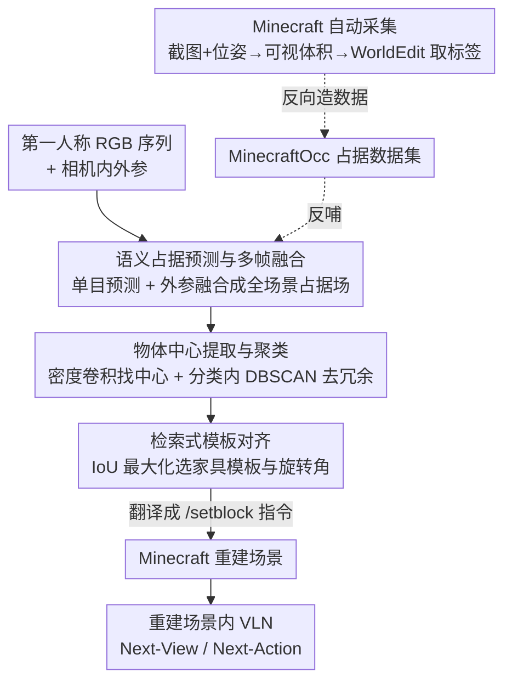

# World2Minecraft: Occupancy-Driven Simulated Scenes Construction

**会议**: ICLR 2026  
**arXiv**: 无（Project page: https://world2minecraft.github.io/）  
**论文**: [ICLR 2026 OpenReview](https://world2minecraft.github.io/)  
**代码**: 项目页 https://world2minecraft.github.io/ （有）  
**领域**: 3D视觉 / 具身智能仿真 / 3D语义占据预测  
**关键词**: 语义占据预测, real-to-sim, Minecraft, 视觉语言导航, 数据集构建

## 一句话总结
把真实世界室内场景用「3D 语义占据预测」转成体素对齐的 Minecraft 可编辑环境，并顺手造了一个能直接跑 VLN 的仿真平台；同时反向用 Minecraft 自动批量生成 10 万张占据标注（MinecraftOcc 数据集），既当难 benchmark 又当真实数据集的增强料。

## 研究背景与动机
**领域现状**：具身智能（embodied AI）严重依赖高保真、可交互的仿真环境。主流做法分两类：一类是 Habitat 这种基于真实扫描（real scan）的平台，画面真但带几何/视觉伪影、而且**不可编辑**；另一类是 Minecraft 这种体素世界，可定制、物理一致、适合强化学习，但方块画风和真实世界存在巨大的 reality gap。

**现有痛点**：把真实场景搬进仿真（real-to-sim）的几条路都不顺——NeRF / 3D Gaussian Splatting 渲染逼真但产物是**隐式场**，不可编辑、没有物理属性；CAD 检索类方法（Scan2CAD 等）场景干净，但要精确实例分割 + 尺度对齐，且重建结果**不能直接拿来跑下游任务**。结果就是「真实感」和「可交互/可编辑」总是二选一。

**核心矛盾**：要想既保真又可编辑可交互，需要一种**离散、带语义、和仿真世界天然对齐**的中间表示。隐式场（NeRF/3DGS）连续不可编辑，mesh 转方块又很复杂。

**本文目标**：(1) 找一种能把真实场景直接翻译成可编辑 Minecraft 环境的桥梁；(2) 在重建场景里真的能跑通 VLN；(3) 解决重建质量受限于占据模型泛化差的问题。

**切入角度**：作者注意到 **3D 语义占据（3D semantic occupancy）的离散体素结构和 Minecraft 的方块天然一一对应**——一个被占据的语义体素，就是一个对应类别的方块。于是占据预测既是感知，又直接是「建造指令」，绕开了复杂的 mesh-to-block 转换。

**核心 idea**：用「3D 语义占据预测」当 real-to-sim 的中间表示，把多帧 RGB → 统一语义占据场 → Minecraft 建造指令；并反过来利用 Minecraft 可控渲染**自动量产**占据数据集，反哺占据模型本身的泛化。

## 方法详解

### 整体框架
World2Minecraft 实际上是一个**双向闭环**：正向把现实搬进 Minecraft，反向用 Minecraft 造数据喂回占据模型。

正向管线（real → Minecraft）：输入一串第一人称 RGB 图 $I=\{I_1,\dots,I_N\}$ 和相机内参 $K$。先用单目占据预测器 $\mathcal{F}_{mono}$ 对每帧出一张语义占据栅格 $O^i_{mono}$；再用相机外参 $E$ 把多帧融成全场景统一语义占据场 $\hat{O}_{scene}$；然后做后处理——找物体中心、聚类去冗余、检索家具模板对齐朝向——把每个实例换成最匹配的模板，最后翻译成 Minecraft 的 `/setblock` 建造指令执行，重建出场景。重建场景里直接定义 Next-View / Next-Action 两个子任务做 VLN。

反向管线（Minecraft → 占据数据集 MinecraftOcc）：在 Minecraft 里用 mod 工具自动截图并记录相机位姿，按视角朝向分两类几何情形定义可视体积，再用 WorldEdit 查询方块类型得到体素级语义标签，自动产出大规模占据标注。

这是个多阶段串行 pipeline，画框架图如下：

### 关键设计

**1. 占据即桥梁：多帧语义占据融合当 real-to-sim 中间表示**

针对「隐式场不可编辑、mesh 转方块太复杂」这个核心矛盾，本文选用离散语义占据当桥。单目预测器对每帧给出体素级语义栅格

$$O^i_{mono} = \mathcal{F}_{mono}(I_i, K) \in \{0,1,\dots,C-1\}^{X\times Y\times Z}$$

每个体素被赋一个语义类别（$C$ 类）。再用外参 $E$ 把所有单帧融成统一场景表示

$$\hat{O}_{scene} = \mathcal{F}_{embodied}(\{O^i_{mono}\}_{i=1}^N, K, E)$$

之所以有效，是因为占据是**离散体素 + 带语义**：一个占据体素直接对应一个 Minecraft 方块，语义类别直接决定放哪种方块，建造指令几乎是「读栅格、逐体素 setblock」，天然可编辑、有物理属性、能直接跑下游任务——这正是 NeRF/3DGS/CAD 三条路都缺的那一环。实现上 $\mathcal{F}_{mono}/\mathcal{F}_{embodied}$ 用预训练的 EmbodiedOcc。

**2. 中心提取 + 分类内 DBSCAN 聚类：从体素堆里抽出干净的物体实例**

直接把占据场逐体素摆方块会很脏（噪声、冗余），需要先识别「这里有几个物体、各在哪」。做法是先把多类语义场二值化成 $\hat{O}_{binary}$（任意物体类记 1，空记 0），再用均匀核 $\mathcal{K}\in\mathbb{R}^{k\times k\times k}$ 做 3D 卷积得到局部占据密度图 $D$，用阈值 $\tau$ 挑出候选中心：

$$C = \{v \mid D(v)\ge\tau,\ D=\mathcal{K}*\hat{O}_{binary}\}$$

这些初始中心通常很冗余，于是**在每个语义类别内部独立**用 DBSCAN（L2 距离、阈值 $\eta$）聚类，每个簇取质心得到精炼中心集 $C'=\{c'_k\}$。关键在「分类内聚类」——保证不同语义标签的点不会被并到一起，维持物体的类别完整性，避免把一把椅子和旁边的桌子腿聚成一个东西。

**3. 检索式模板对齐：用 IoU 最大化解决朝向歧义、保证几何保真**

光有中心和体素块，家具的朝向、形状仍然糙。最后一步是检索匹配：拿每个实例的占据栅格 $O_k$ 去一个候选家具模板库 $L=\{T_j\}$ 里找最像的，并枚举一组离散旋转角 $\delta$ 来消除朝向歧义，选让两者空间重叠（IoU）最大的模板+角度：

$$ (j^*, \delta^*) = \arg\max_{j,\delta} \frac{|O_k \cap \text{Rot}(T_j,\delta)|}{|O_k \cup \text{Rot}(T_j,\delta)|} $$

选中的模板再翻译成建造指令渲染。这一步把「预测占据的粗糙轮廓」替换成「库里干净的标准家具几何」，既补全了预测缺失，又让重建场景在几何上更整齐可信。

**4. MinecraftOcc 反向数据管线：用仿真世界自动量产占据标注**

这是反哺占据模型的核心，解决「占据模型泛化差是因为真实标注数据又贵又少」。在 Minecraft 里用 `Screen with Coordinates` mod 自动截图并同步记录相机位姿（位置+朝向），由此算出每张图的内外参。给每张图定义固定大小可视体积 $V$（含 $v_{min},v_{max}$），按 yaw 角 $\theta$ 分两种几何情形——**轴对齐**（视线平行坐标轴，把玩家放在体积后面中心）和**对角**（视线 45° 斜向，把玩家放在 $v_{min}$ 角），由函数 $f$ 统一计算：

$$ (v_{min}, v_{max}) = f(P_{player}, \theta, w, h, d) $$

对角视角因 Minecraft 空间离散会在边缘大量丢体素，于是加一个**视角感知的回退策略**：对包围盒角点加校正偏移 $\epsilon$（$v'_{min}=v_{min}+\epsilon,\ v'_{max}=v_{max}+\epsilon$），从相邻微调视角补结构信息，只牺牲极小景深、显著提升标签完整性。最后用 WorldEdit 把可视体积内每个坐标 $v$ 查成方块语义标签 $s_v=\mathcal{M}_{world}(v)$，组成体素级占据栅格 $O=\{s_v\}$。整套全自动、低成本、可扩展，产出的 MinecraftOcc 有 100,165 张高分辨率图、156 个室内场景（约 1000 房间）、1,452 个原始类别。

### 一个完整示例
以一次「把客厅搬进 Minecraft 并导航到冰箱」为例走一遍正向流程：相机沿房间转一圈拍下若干第一人称 RGB（View 1/2/3...），$\mathcal{F}_{mono}$ 给每帧出占据 $O_1,O_2,O_3$，外参融合成全屋占据场 $\hat{O}_{scene}$；二值化+密度卷积找出一堆候选中心，分类内 DBSCAN 把「沙发」类的几十个冗余中心收成 1 个质心、「桌子」类收成 1 个……得到 $C'$；每个实例用 IoU 检索到家具库里最匹配的模板+旋转角，翻译成一串 `/setblock` 指令在 Minecraft 里建出客厅。然后下指令「穿过主门去客厅找冰箱」，Next-View 任务要模型根据三张历史图判断当前到第几步、再选下一张最匹配的视角图；Next-Action 任务则根据当前视角选下一个动作（前进/左转/右转/停）。论文还用 Gemini-2.5-Pro 当控制器在重建场景里实时执行「Go to the piano」，一步步成功走到钢琴。

### 损失函数 / 训练策略
本文方法本身（占据→重建）主要是预测+后处理，无新训练损失。VLN 部分把 Qwen2.5-VL-3B/7B 在 MinecraftVLN 上分别做 **SFT**（基于 LLaMA-Factory）和 **RFT**（强化微调，基于 EasyR1）两种微调，对比 No-Train / SFT / RFT 三种条件。占据实验则用 EmbodiedOcc-ScanNet 训占据模型、用 MinecraftOcc 评测及做混合训练增强。

## 实验关键数据

### 主实验

数据集统计对比（MinecraftOcc 在规模与分辨率上远超现有室内占据数据集）：

| 数据集 | 图像数 | 场景数 | 类别数 | 总语义体素 | 平均体素/场景 | 分辨率 |
|--------|--------|--------|--------|------------|----------------|--------|
| NYUv2 | 1,449 | 464 | 13 | 10.8M | ~23.2K | 640×480 |
| OccScanNet | 65,119 | 674 | 13 | 201M | ~298.5K | 640×480 |
| **MinecraftOcc** | **100,165** | 156 (~1000 房间) | **1,452** | **733M** | **~4.7M** | **1920×1129** |

MinecraftVLN 上 Qwen2.5-VL 准确率（节选 Combined 设置，No-Train / SFT / RFT）：

| 模型 | 任务 | No-Train | SFT | RFT |
|------|------|----------|-----|-----|
| Qwen2.5-VL-3B | Next-View | 0.2288 | 0.5609 | 0.3137 |
| Qwen2.5-VL-3B | Next-Action | 0.3037 | 0.4835 | 0.6570 |
| Qwen2.5-VL-7B | Next-View | 0.2878 | 0.6642 | 0.6753 |
| Qwen2.5-VL-7B | Next-Action | 0.3760 | 0.6281 | 0.6219 |

### 消融实验

图像质量无参考指标对比（MinecraftOcc 画质显著更好）：

| 数据集 | NIQE ↓ | PIQE ↓ | LV ↑ |
|--------|--------|--------|------|
| NYUv2 | 14.96 | 47.40 | 57,369 |
| OccScanNet | 17.63 | 58.78 | 10,352 |
| **MinecraftOcc** | **9.97** | **45.23** | **274,305** |

占据模型在 MinecraftOcc（8k）上表现 + 联合训练增益：

| 配置 | IoU | mIoU | 说明 |
|------|-----|------|------|
| MonoScene @8k | 40.66 | 20.93 | 现有方法整体偏低，但 MonoScene 反而最稳 |
| Symphonies @8k | 39.11 | 21.56 | mIoU 最高，但绝对值仍低 |
| ISO @8k | 33.82 | 14.83 | 在新数据集上崩得最狠 |
| Symphonies + NYUv2 联合训练 | +0.43 (IoU) | +0.21 (mIoU) | MinecraftOcc 当增强料能补真实数据集 |

### 关键发现
- **现有 SOTA 占据模型在 MinecraftOcc 上普遍掉点**，说明它对当前方法是个真·难 benchmark；作者推测 NYUv2 上很强的方法是过拟合了 NYUv2，换数据就垮（ISO 从 NYUv2 强势变成这里 mIoU 仅 14.83 最低）。MonoScene 在 NYUv2 上平庸却在这里最稳，侧面印证了过拟合假说。
- **MinecraftOcc 当辅助训练数据能反哺真实 benchmark**：和 NYUv2 联合训练 Symphonies，IoU/mIoU 同时 +0.43/+0.21，证明它「难 benchmark + 有效增强料」双重价值。
- **VLN 微调策略不统一**：多图的 Next-View 任务上 SFT 对小模型(3B)更有效，7B 上 SFT/RFT 差距收窄；Next-Action 上则看数据——Base 集 SFT 更好、更多样的 Extend/Combined 集 RFT 更好。⚠️ 不同设置/任务难度不同，不可直接横向比大小。

## 亮点与洞察
- **「占据=方块」这个观察是全文枢纽**：把感知任务的输出直接当成仿真世界的建造单元，省掉 mesh-to-block，一个表示同时满足真实感、可编辑、可交互、可下游——这是巧妙之处。
- **双向闭环**：现实→仿真用占据，仿真→数据又造占据标注反哺占据模型，形成自洽飞轮；这种「用可控仿真低成本造高质量标注」的思路可迁移到任何缺标注的 3D 感知任务。
- **分类内 DBSCAN + IoU 检索对齐**是把「糙预测」洗成「干净场景」的实用工程组合，值得复用。
- 用 mod（WorldEdit / Screen with Coordinates / TMEO）把游戏改造成可批量产数据的「数据工厂」，是低成本的好 trick。

## 局限与展望
- **重建质量受限于占据模型**：作者自己承认初始自动重建质量 sub-optimal，VLN 实验里 30 个场景挑了 15 个**人工精修**才用，说明全自动管线还达不到实用保真度。
- **依赖家具模板库**：检索式对齐受限于模板库覆盖度，库里没有的物体/形状会对不上。
- **sim-to-real 仍有 gap**：虽然用 mod 做了 PBR 渲染缩小差距，但 Minecraft 体素离散本身（尤其对角视角丢体素）是结构性限制，回退偏移 $\epsilon$ 只是缓解。
- ⚠️ 无 arXiv 公开版，部分实现细节（如 $\mathcal{F}_{embodied}$ 融合细节、模板库规模）以原文/附录为准。
- 改进方向：更强的占据模型 + 自动家具检索/生成（而非固定模板库），减少人工精修依赖。

## 相关工作与启发
- **vs NeRF / 3D Gaussian Splatting**: 它们渲染逼真但产物是隐式连续场、不可编辑无物理；本文用离散语义占据换取可编辑+可交互+可直接下游，牺牲一点视觉真实感。
- **vs CAD 检索类（Scan2CAD 等）**: 都用检索对齐，但 CAD 法需精确实例分割+尺度对齐且不能直接下游；本文以占据为底、分类内聚类找实例，绕开严苛分割并能直接跑 VLN。
- **vs Minecraft 原生 RL 工作（GROOT / ROCKET-1 / JARVIS-VLA）**: 它们在原生方块画风里训练、reality gap 大；本文用高保真 mod + 真实场景重建缩小视觉/结构 gap，提供更接近现实的具身仿真。
- **vs WonderWorld / SceneCraft 等生成式 3D**: 它们擅长从抽象输入造新内容但不为忠实重建特定真实场景设计；本文目标是把**具体已存在的真实场景**搬进仿真。

## 评分
- 新颖性: ⭐⭐⭐⭐⭐ 「占据即方块」的 real-to-sim 桥 + 双向数据飞轮，角度新颖
- 实验充分度: ⭐⭐⭐⭐ 覆盖重建/VLN/占据三块，但重建仍靠人工精修、绝对指标偏低
- 写作质量: ⭐⭐⭐⭐ 逻辑清晰、图文配合好，公式与流程交代到位
- 价值: ⭐⭐⭐⭐⭐ 同时贡献可编辑仿真平台 + 大规模占据数据集 + 难 benchmark，具身 AI 社区实用

<!-- RELATED:START -->

## 相关论文

- [\[ICLR 2026\] GIQ: Benchmarking 3D Geometric Reasoning of Vision Foundation Models with Simulated and Real Polyhedra](giq_benchmarking_3d_geometric_reasoning_of_vision_foundation_models_with_simulat.md)
- [\[ICLR 2026\] Progressive Gaussian Transformer with Anisotropy-aware Sampling for Open Vocabulary Occupancy Prediction](progressive_gaussian_transformer_with_anisotropy-aware_sampling_for_open_vocabul.md)
- [\[CVPR 2026\] PolarGuide-GSDR: 3D Gaussian Splatting Driven by Polarization Priors and Deferred Reflection for Real-World Reflective Scenes](../../CVPR2026/3d_vision/polarguide-gsdr_3d_gaussian_splatting_driven_by_polarization_priors_and_deferred.md)
- [\[ICLR 2026\] DiffWind: Physics-Informed Differentiable Modeling of Wind-Driven Object Dynamics](diffwind_physics-informed_differentiable_modeling_of_wind-driven_object_dynamics.md)
- [\[ICLR 2026\] Uncertainty-Aware 3D Reconstruction for Dynamic Underwater Scenes](uncertainty-aware_3d_reconstruction_for_dynamic_underwater_scenes.md)

<!-- RELATED:END -->
