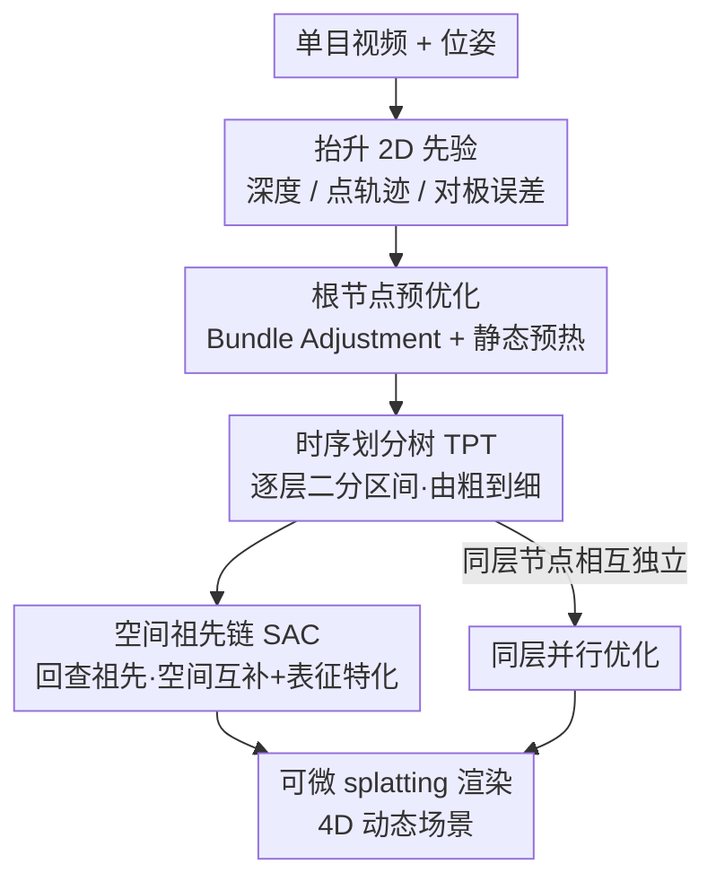

# WorldTree: Towards 4D Dynamic Worlds from Monocular Video Using Tree-Chains

**会议**: ICLR 2026  
**论文**: [OpenReview / ICLR 2026](https://openreview.net/)（⚠️ 以原文为准）  
**代码**: https://github.com/iCVTEAM/WorldTree  
**领域**: 3D视觉 / 动态重建 / 4D 重建  
**关键词**: 单目动态重建, 4D 重建, 3D Gaussian Splatting, 时序分层, 树结构

## 一句话总结
WorldTree 用一棵「时序划分树」把单目视频按时间二分成由粗到细的子区间逐层优化，再用「空间祖先链」把每个子节点和它的所有祖先节点串起来做空间互补与运动表征特化，从而在单目动态重建上同时解决「全局时序优化」和「层级空间耦合」两大顽疾，LPIPS 在 NVIDIA-LS 上比次优方法降 8.26%、mLPIPS 在 DyCheck 上降 9.09%。

## 研究背景与动机

**领域现状**：动态新视角合成（dynamic NVS / 4D 重建）近年随 NeRF、3D Gaussian Splatting（3DGS）的发展进步飞快，但主流高质量方法严重依赖**时间同步的多视角视频**——要么布一圈相机、要么固定拍摄场景，应用面被卡死。真正海量、随手可得的其实是**单目视频**，所以单目动态重建才是更实用的目标。

**现有痛点**：单目重建的已有工作主要在「设计高效的运动表征」上发力，却没认真分析视频模态本身的时空结构，结果分成几路各有毛病：① 一类方法（如 MoSca）在**整段时间区间上做全局优化**，无视视频里不同时段形变模式不同；② 一类用**全局空间运动图融合**，得到一种「无定形（amorphous）」的运动表征，且照样忽略时序；③ 一类（如 HiMoR）把 3D 形变拆成**全局-局部层级**，但层级之间的运动**互相耦合**，粗层估计一旦不准，局部干扰会引发优化冲突。

**核心矛盾**：单目视频天然带一种**时空层级结构**——不同时间区间的形变模式不一样（源于物体非匀速的 3D 运动），而任意一个时间区间的形变又会**继承父区间的属性**，同时父区间提供了对当前区间的**空间补充**。也就是说，时间和空间存在一种「带祖先关联的树状结构」，但已有方法要么只做时序、要么只做空间，从没把它统一成一个分解框架。

**本文目标**：构造一个统一的优化流水线，既能按视频的时序特性做分层（处理变化的形变模式），又能在空间上做层级互补表征（且不引入层级耦合）。

**核心 idea**：把单目视频显式建成一棵树——**时序上**沿时间轴二分递归切区间（Temporal Partition Tree, TPT）做由粗到细优化；**空间上**让每个节点递归回查它的祖先链（Spatial Ancestral Chains, SAC）拿到多尺度空间补充，并对每个祖先节点的运动表征做特化，从而把层级运动解耦。

## 方法详解

### 整体框架
给定一段单目视频 $I=\{I_t\}_{t\in[1,T]}$ 及对应位姿 $P=\{P_t\}$，目标是重建包含静态背景与运动前景的动态场景。流程先抽 2D 先验（单目深度、点轨迹跟踪、光流/对极误差）抬升到 3D，初始化树根（整段视频）的动态高斯表征；然后 TPT 沿时间轴 BFS 逐层把区间二分成更细的子区间，每个新节点都像根节点一样独立优化一遍；与此同时 SAC 为每个节点回查从根到自身的祖先链，把祖先节点的高斯表征叠进来做空间互补，最后按 splatting 渲染。整套方法是「先抽先验 → 根节点预热 → 时序分层（含空间链查询）→ 渲染」的多阶段串行流水线。

### 关键设计

**1. 时序划分树 TPT：用一棵继承式二分树把整段视频拆成由粗到细的时间区间**

针对「全局优化无视时序特性」这个痛点，TPT 不再把视频当成一整段去优化，而是建一棵继承式划分树。树根 $\zeta_r(M_r,G_r)$ 深度 $d_r=0$、代表整段区间 $[T^L_r,T^R_r]$，承载最粗的动态建模（运动基 $M_r$ + 动态高斯 $G_r$）。建树用 BFS：每个已优化好的节点 $\zeta_j$ 在中点 $T^P_j=\lfloor(T^L_j+T^R_j)/2\rfloor$ 处二分成左右孩子，左孩子取 $[T^L_j,T^P_j)$、右孩子取 $[T^P_j,T^R_j]$。划分同时切运动基与高斯基元——运动基按 $M_{2j}=\{M^{(\psi)}_t\in M_j\mid t<T^P_j\}$、$M_{2j+1}=\{M^{(\psi)}_t\in M_j\mid t\ge T^P_j\}$ 分到两侧，高斯基元同理按其规范时间 $t_n^j$ 分流。树越深、区间越窄越精细，从而让模型对「不同时段的不同形变模式」分别建模。实践中作者限制孩子从祖先继承的高斯数量以平衡效率，并在训练前重置不透明度，帮助跳出局部鞍点。

**2. 空间祖先链 SAC：让每个子节点回查全部祖先，补回被切掉的空间信息并做表征特化**

TPT 在时间上切区间会带来一个副作用：高斯基元在继承过程中被不断截断，子节点的**空间视觉信息越切越少**。SAC 就是为补这个空间缺口而设。对每个节点 $\zeta_j$，SAC 构造一条从根到该节点的动态表达链
$$C_j=\Big\{\zeta^j_k(M^j_k,G^j_k)\mid k\in\lfloor j/2^\alpha\rfloor,\ \alpha=1\ldots\log_2 j\Big\},$$
其中 $\alpha$ 是相对 $j$ 的上溯层数。节点自身只建模**局部时序动态**，而祖先链提供**多层级的空间上下文**。最终时刻 $\tau$ 的形变高斯点集为节点自身的高斯与各祖先节点高斯的并集
$$P_j=\big\{G^j_n(M_j,\tau)\big\}_{\zeta_j}\ \cup\ \Big\{\cup_k\{G^k_n(M^j_k,\tau)\}\Big\}_{\zeta^j_k\in C_j}.$$
关键在于：不同节点的公共祖先**彼此独立**（互不共享参数）但有**相同的优化初始化**，等于对每个祖先节点的运动表征做了**特化（specialization）**。这正好规避了两种旧毛病——既不像全局融合那样产生「无定形」表征，也不像 HiMoR 那样让层级运动互相耦合，实现了优化解耦下的层级互补表征。

**3. 同层并行优化：靠同深度节点的相互独立把优化次数从指数压到线性**

同一深度的节点虽然共享祖先链的初始化，但优化过程中相互独立、互不影响。利用这一属性，WorldTree 对同一层节点做**并行优化**：在并行算力充足时，整体优化次数只需 $O(\delta)$（$\delta$ 为最大深度）；若串行，则要做 $O(2^{\delta+1})$ 次独立优化。这让树结构带来的额外开销在工程上变得可接受，是 TPT 能够「逐层逐节点都重新优化一遍」却仍可落地的前提。

**4. 根节点预优化：用 Bundle Adjustment 与静态预热给整棵树一个稳的起点**

动态重建里相机位姿往往拿不准，而后续整棵树都建立在根节点表征之上，根没建好会层层放大误差。为此根节点先做两步预热：① **Bundle Adjustment**——沿用基于 tracklet 的束调整，在动态优化前先把相机位姿初始化得更准；② **静态区域预热（Static Warm-up）**——在做动态前景重建前先把静态背景预优化到稳定，让模型在后续阶段更专注于动态部分的建模。消融显示这两步对 PSNR/LPIPS 都有显著独立贡献（见下）。

### 损失函数 / 训练策略
每个节点训练沿用主流单目动态重建的常用正则项，包括光度损失（photometric loss）与深度损失（depth loss）等综合优化（更多细节在原文附录）。整体训练即「根节点预热 → 按 BFS 逐层建树并优化每个节点（同层并行）→ 每个节点叠加 SAC 祖先链表征」。TPT 树高 $\delta$ 取 2（从 0 计），在质量与效率间权衡。

## 实验关键数据

### 主实验
在 NVIDIA-LS（作者重构的加长版，单目区间扩到 160 帧，并用 SAM2 标注动态 mask 仅用于评测）与 DyCheck 上评测。指标含整图 PSNR/SSIM/LPIPS/AVGE，以及只看动态区的 mPSNR/mSSIM/mAVGE/mLPIPS。

| 数据集 | 指标 | 本文 | 次优方法 | 提升 |
|--------|------|------|----------|------|
| NVIDIA-LS | LPIPS↓ | 0.100 | MoSca 0.109 | -8.26% |
| NVIDIA-LS | mPSNR↑ | 18.55 | MoSca 17.89 | 优于 SOTA |
| NVIDIA-LS | mSSIM↑ | 0.692 | MoSca 0.664 | 优于 SOTA |
| DyCheck | mLPIPS↓ | 0.240 | MoSca 0.264 | -9.09% |
| DyCheck | mPSNR↑ | 19.75 | MoSca 19.32 | 优于 SOTA |

在 NVIDIA-LS 上 WorldTree（无 CIP/MPP 先验）相对 HiMoR 的 mPSNR 提升 21.40%、相对 SplineGS 的 mSSIM 提升 12.16%、相对 MoSca 的 mAVGE 提升 8.91%。

### 消融实验
四个组件 BA（Bundle Adjustment）、SW（静态预热）、TPT、SAC 逐一开关（NVIDIA-LS）：

| 配置 (BA/SW/TPT/SAC) | LPIPS↓ | mPSNR↑ | 说明 |
|------|--------|--------|------|
| ✗✗✗✗ | 0.139 | 16.82 | 纯 baseline |
| ✗✗✓✗ | 0.121 | 17.41 | 仅加 TPT |
| ✗✗✓✓ | 0.113 | 17.85 | TPT+SAC |
| ✓✓✗✗ | 0.115 | 17.73 | 仅根预热 |
| ✓✓✓✗ | 0.105 | 18.36 | 根预热+TPT |
| ✓✓✓✓ | **0.100** | **18.55** | 完整模型 |

### 关键发现
- **TPT 是主力，SAC 是有效补充**：在已有基础上加 TPT，LPIPS、mAVGE 分别提升 8.70%、8.65%；再加 SAC 进一步提升 4.76%、3.16%，印证 SAC 在 TPT 的时序由粗到细之上补回了空间层级表征。
- **根预热独立有用**：单独激活 BA+SW（无 TPT/SAC）就把 LPIPS 从 0.139 拉到 0.115，说明位姿初始化和静态背景预热本身就是动态重建的稳定器。
- **树越高质量越好，但要权衡效率**：重建质量与树高（时间区间划分粒度）在多个指标上高度正相关；为平衡质量与效率最终取最大树高 $\delta=2$。
- **对外部先验鲁棒**：换不同深度/跟踪先验（Metric3D-V2+BootsTAPIR、UniDepth+CoTracker3）时本文始终优于 MoSca，mAVGE 相对各自 Base 提升 10.27%~12.00%。

## 亮点与洞察
- **把「时空层级」显式建成树+链两件套**：时序用树二分（TPT）、空间用祖先链回查（SAC），一个管「不同时段形变不同」，一个管「子区间被切掉的空间信息要补回来」，分工干净，思路很可迁移到任何「需要同时做时序分解+空间互补」的重建/视频任务。
- **祖先节点表征特化 = 解耦的关键**：让公共祖先彼此独立但同初始化，既共享了空间上下文又避免了 HiMoR 那种层级运动耦合，是「层级表征但不耦合」的一个巧解。
- **同层独立 → 并行优化**：树结构本会带来指数级优化开销，但靠「同深度节点相互独立」把它压成 $O(\delta)$，是让树方法真正可落地的工程洞察。
- **顺手做了数据集贡献**：把 NVIDIA 扩成 160 帧的长序列 NVIDIA-LS 并用 SAM2 标动态 mask，使长时序、变化形变模式下的动态区评测更可信。

## 局限与展望
- 树高带来的质量-效率权衡仍是硬约束：质量随树高单调上升却要为效率止步于 $\delta=2$，更长视频是否需要更深树、深树的并行开销如何，原文留待附录/未来。
- 方法重度依赖 2D 先验（深度/跟踪/光流）的质量，虽证明了对几种先验组合的鲁棒性，但极端运动或先验大幅失准时的表现未充分展开。
- 二分中点 $T^P_j=\lfloor(T^L_j+T^R_j)/2\rfloor$ 是固定二分策略，并非按形变剧烈程度自适应切分，理论上自适应分割点可能进一步提质（作者也批评 MoDec-GS 的手工分割，但自身用的是均匀二分）。

## 相关工作与启发
- **vs MoSca（Lei et al. 2025）**：MoSca 用运动基「脚手架图」做全局空间融合、在整段区间上全局优化，得到无定形表征且无时序分层；WorldTree 在其先验抽取/形变表征基础上叠了 TPT 的时序分层与 SAC 的层级空间特化，全面超过它。
- **vs HiMoR（Liang et al. 2025）**：HiMoR 也用树结构把运动拆成由粗到细的全局-局部层级，但层级间运动耦合、依赖精确的粗形变估计，易被局部干扰带偏；WorldTree 通过祖先节点表征特化实现优化解耦，规避了层级耦合。
- **vs MoDec-GS（Kwak et al. 2025）**：它用自适应时间区间做时序切分，但依赖手工设定时段、且是固定划分+两阶段优化，提质有限；WorldTree 是统一的 BFS 逐层细化框架，且同层可并行。

## 评分
- 新颖性: ⭐⭐⭐⭐⭐ 把单目视频的时空结构统一成「时序树+空间祖先链」，TPT/SAC 组合是此前未见的分解视角。
- 实验充分度: ⭐⭐⭐⭐ 两数据集 SOTA + 四组件消融 + 树高/先验敏感性分析齐全，唯长视频/极端运动场景略欠。
- 写作质量: ⭐⭐⭐⭐ 动机与图示清晰，符号体系略重，需对照公式细读。
- 价值: ⭐⭐⭐⭐ 降低对多视角同步采集的依赖，单目 4D 重建实用性强，框架可迁移。

<!-- RELATED:START -->

## 相关论文

- [\[ICLR 2026\] Uncertainty Matters in Dynamic Gaussian Splatting for Monocular 4D Reconstruction](uncertainty_matters_in_dynamic_gaussian_splatting_for_monocular_4d_reconstructio.md)
- [\[ICLR 2026\] Mono4DGS-HDR: High Dynamic Range 4D Gaussian Splatting from Alternating-exposure Monocular Videos](mono4dgs-hdr_high_dynamic_range_4d_gaussian_splatting_from_alternating-exposure_.md)
- [\[CVPR 2026\] 4DEquine: Disentangling Motion and Appearance for 4D Equine Reconstruction from Monocular Video](../../CVPR2026/3d_vision/4dequine_disentangling_motion_and_appearance_for_4d_equine_reconstruction_from_m.md)
- [\[CVPR 2026\] Mesh4D: 4D Mesh Reconstruction and Tracking from Monocular Video](../../CVPR2026/3d_vision/mesh4d_4d_mesh_reconstruction_and_tracking_from_monocular_video.md)
- [\[AAAI 2026\] MoBGS: Motion Deblurring Dynamic 3D Gaussian Splatting for Blurry Monocular Video](../../AAAI2026/3d_vision/mobgs_motion_deblurring_dynamic_3d_gaussian_splatting_for_blurry_monocular_video.md)

<!-- RELATED:END -->
