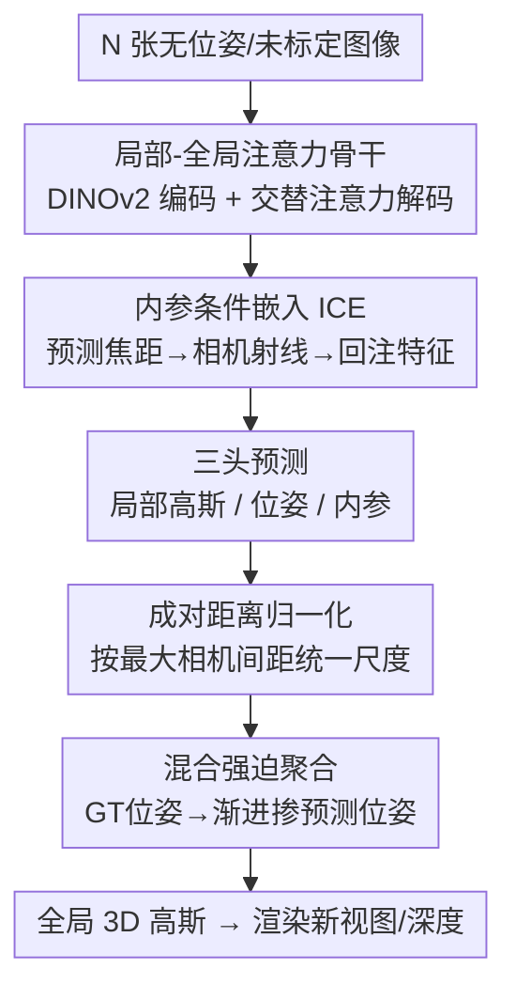

# YoNoSplat: You Only Need One Model for Feedforward 3D Gaussian Splatting

**会议**: ICLR 2026  
**OpenReview**: [https://openreview.net/forum?id=ImRhA9xmay](https://openreview.net/forum?id=ImRhA9xmay)  
**项目页**: [botaoye.github.io/yonosplat](https://botaoye.github.io/yonosplat/)  
**代码**: 待确认（项目页未给出明确仓库链接，⚠️ 以原文为准）  
**领域**: 3D视觉  
**关键词**: 前馈3D高斯、无位姿重建、混合强迫训练、尺度歧义、内参预测

## 一句话总结
YoNoSplat 用一个前馈模型，从任意数量、无位姿、无标定的多视图图像里直接预测每视图局部 3D 高斯 + 相机位姿 + 内参，再聚合成全局场景；靠"混合强迫（mix-forcing）"训练策略和成对距离归一化 + 内参条件嵌入两招，解决位姿/几何纠缠和尺度歧义，在有位姿/无位姿两种设定下都做到 SOTA，100 张图 2.69 秒重建一个场景。

## 研究背景与动机

**领域现状**：前馈高斯泼溅（Feedforward 3DGS）是当下加速 3D 重建的热门方向——给一组图像，神经网络直接吐出 3D 高斯参数，跳过 NeRF / 原版 3DGS 那种每场景几十分钟的优化。代表作如 pixelSplat、MVSplat、DepthSplat。

**现有痛点**：现有前馈模型都带着各种"硬约束"，实际场景里很难满足：要么必须给准确的相机位姿（pixelSplat、DepthSplat），要么必须给标定好的内参（NoPoSplat），要么只能吃固定的、很少的视图数（通常 2–4 张）。最近的无位姿方法（NoPoSplat、Flare）把高斯直接预测进一个统一的"标准空间（canonical space）"，2–4 张稀疏图很惊艳，但视图一多就崩——标准空间范式根本扩不上去。

**核心矛盾**：想做一个"什么都能吃"的通用模型（视图数任意、有位姿无位姿都行、有标定无标定都行），就得让模型自己同时学几何（3D 高斯）和相机参数（位姿、内参）。但这两件事是**高度纠缠**的：位姿估计错了会污染高斯的学习信号，高斯学歪了又会带偏位姿。再加上训练数据的位姿大多是 SfM 解出来的、只定义到任意尺度，存在**尺度歧义**，联合估内参和外参本身就是病态问题。

**本文目标**：(1) 设计一个能扩展到大量视图的输出范式；(2) 化解位姿与几何的联合学习纠缠；(3) 解决尺度歧义，让模型能吃未标定图像。

**切入角度**：放弃"标准空间"范式，改走 **local-to-global**——先预测每视图的**局部**高斯和位姿，再用预测/给定的位姿把它们聚合到全局坐标系。局部预测天然可扩展、且能无缝兼容"有位姿可用就用 GT 位姿聚合"的工作流。难点全压在"怎么把局部聚合训稳"上，作者用一套课程式训练化解。

**核心 idea**：用"混合强迫"训练——先用 GT 位姿建立稳定的几何基础，再渐进掺入模型自己预测的位姿做聚合——同时避免自强迫的训练不稳和教师强迫的曝光偏差；配上成对距离归一化 + 内参条件嵌入解决尺度歧义。

## 方法详解

### 整体框架

YoNoSplat 要解决的是：给 $V$ 张无位姿图像 $(I_v)_{v=1}^V$，学一个前馈网络 $f_\theta$，直接输出每个像素一个 3D 高斯（中心、不透明度、旋转、尺度、颜色），外加每视图的相机位姿 $p_v=[R_v, t_v]$ 和内参 $k_v$。整条管线是：图像切 patch → DINOv2 编码器（同时挂一个内参 token 预测内参）→ 解码器做局部-全局交替注意力融合多视图 → 三个头分别预测高斯、位姿、内参 → 用预测或给定的位姿把局部高斯变换聚合成全局 3D 高斯，再渲染新视图。

训练时最关键的不是网络结构（结构主要沿用 VGGT/π³ 的 ViT backbone + 局部-全局注意力），而是**怎么把"局部高斯 + 位姿聚合"这件纠缠的事训稳**——这就是混合强迫策略；以及**怎么消尺度歧义**——这就是成对距离归一化 + 内参条件嵌入（ICE）。下图把这三块串起来：

### 关键设计

**1. 局部预测范式：用 local-to-global 替代标准空间，换来可扩展性**

前馈重建的第一个根本选择是输出空间。无位姿方法（NoPoSplat、Flare）把所有视图的高斯直接预测进一个统一标准空间，视图少时对齐很自然；但作者实测（Tab. 7）视图一多性能就掉，和点云预测领域（VGGT）的发现一致。YoNoSplat 改成"每视图先预测**局部**高斯 + 对应相机位姿，再聚合到全局"。这个设计同时解锁两条路：用预测位姿聚合 → 无位姿重建；用 GT 位姿聚合 → 兼容地图重建这类需要对齐已有精确位姿分布的工作流。代价是把训练难度转嫁到"聚合"上，由下面的混合强迫来化解。骨干上用 VGGT 式的局部-全局交替注意力（每块含逐帧自注意力做局部精修 + 全局拼接自注意力做跨帧信息流），比 NoPoSplat 用的 cross-attention 更能随视图数扩展。

**2. 混合强迫训练：用课程式聚合策略破解位姿-几何纠缠**

这是全文最核心的创新，针对的就是"位姿和几何互相污染"这个痛点。聚合局部高斯需要位姿，而位姿来源有两种极端：① **自强迫（self-forcing）**——全程用模型自己预测的位姿聚合，两个任务紧耦合，训练不稳、性能最差（Fig. 2a）；② **教师强迫（teacher-forcing）**——全程用 GT 位姿聚合，信号稳定但带来**曝光偏差**：模型训练时从没见过自己预测的"不完美位姿"，推理时一旦只能靠预测位姿就垮（Fig. 2b）。

作者提出 **mix-forcing** 课程：训练初期纯用 GT 位姿（teacher-forcing）打好稳定的几何地基；跑过预设步数 $t_{start}$ 后，**线性提升**"用模型预测位姿做聚合"的概率，到 $t_{end}$ 步达到最终混合比 $r$。这样模型先建立强 3D 结构先验，再逐渐适应"自己预测的位姿分布"和 GT 位姿分布两者，既不失稳也不被曝光偏差坑。实测（Tab. 5）混合强迫在无位姿设定下最好，同时在有位姿设定下也保持竞争力，是唯一两头都强的策略。

**3. 尺度歧义消解：成对距离归一化 + 内参条件嵌入（ICE）双管齐下**

尺度歧义来自两处：训练数据的 SfM 位姿只定义到任意尺度；联合估内外参本身病态。作者两路解决。

第一路是**场景归一化**。给相机中心 $\{c_i\}_{i=1}^N$，作者比较了三种归一化：按**最大成对距离** $s=\max_{i,j}\|c_i-c_j\|_2$、按平均成对距离、按最大平移 $s=\max_i\|c_i\|_2$。结论是最大成对距离归一化最好（Tab. 6），因为它和训练用的**相对位姿监督**直接对齐——既然位姿是成对相对的，按成对距离定尺度才能给相机平移一个一致的参考。不归一化时性能严重退化。

第二路是**内参条件嵌入 ICE**（Fig. 3b），解决"内参对恢复尺度很关键、但以前方法推理时还得给 GT 内参"的依赖。做法：在编码器阶段挂一个可学习的内参 token，让它聚合图像信息后经 MLP 预测焦距 $f_x, f_y$；预测出的内参转成**相机射线**，过一个线性层得到嵌入特征，**加回原始图像特征**，从而把"这张图的内参是多少"注入高斯预测。有 GT 内参时直接用 GT 做条件（更准）；没有时用预测内参。一个训练细节：训练时始终用 **GT 内参**做条件而非预测内参；作者也试过"让解码器拿编码器预测的内参做条件"，结果训练不稳直至失败。内参预测放在编码器阶段（单图即可推断），而位姿预测需要跨帧信息、放在解码器阶段——两者职责分得很清楚。

### 损失函数 / 训练策略

总损失是多任务加权：

$$L = L_{image} + \lambda_{intrin}L_{intrin} + \lambda_{pose}L_{pose} + \lambda_{opacity}L_{opacity}.$$

- **渲染损失** $L_{image}$：MSE + LPIPS 的线性组合，监督高斯质量。训练时随机采 4 个目标视图，用其 GT 位姿渲染后和 GT 图比。
- **内参损失** $L_{intrin}$：预测焦距与 GT 焦距的 $\ell_2$ 距离。
- **位姿损失** $L_{pose}$：沿用 π³ 的成对相对位姿损失。对每对视图 $(i,j)$ 算相对位姿 $\hat p_{i\leftarrow j}=\hat p_i^{-1}\hat p_j$，旋转项 $L_R=\arccos((\mathrm{tr}(R_{i\leftarrow j}^\top \hat R_{i\leftarrow j})-1)/2)$，平移项用 Huber 损失 $L_t=H_\delta(\hat t_{i\leftarrow j}-t_{i\leftarrow j})$，对所有视图对取平均——这让模型对输入图像顺序不变。
- **不透明度损失** $L_{opacity}=\frac{1}{M}\sum_i |o_i|$：因为每像素一个高斯，视图越多高斯爆炸，用稀疏正则促剪枝，最后剪掉 $o_i<0.005$ 的，实测能去掉约 20%–70% 的高斯。

骨干、高斯中心头、相机位姿头从 π³ 初始化，其余随机。训练随机选 2–32 个输入视图、采 4 个目标视图，先在 $224\times224$ 训 150k 步，再以此初始化在 $280\times518$ 训 150k 步。位姿头输出 12D 向量（平移 + 9D 旋转表示，经 SVD 正交化成 $R_v$）。还有一个可选的快速后优化：固定其余参数，只优化预测位姿 + 高斯中心 + 颜色，能进一步涨点。

## 实验关键数据

### 主实验

DL3DV 数据集上的新视图合成对比（节选 PSNR↑），p/k 表示是否用 GT 位姿/内参：

| 方法 | p | k | 6 视图 | 12 视图 | 24 视图 |
|------|---|---|--------|---------|---------|
| MVSplat | ✓ | ✓ | 22.66 | 21.29 | 19.98 |
| DepthSplat | ✓ | ✓ | 23.42 | 21.91 | 20.09 |
| NoPoSplat | | ✓ | 22.77 | 19.38 | 17.86 |
| AnySplat | | | 19.03 | 18.94 | 19.70 |
| **本文（无位姿无内参）** | | | **24.53** | **22.93** | **22.17** |
| **本文（有位姿有内参）** | ✓ | ✓ | **24.72** | **23.29** | **22.66** |

最有冲击力的一行：YoNoSplat 即使在**最苛刻的无位姿、无内参**设定下，PSNR 仍全面超过用 GT 位姿+内参的 SOTA 方法 DepthSplat（如 24 视图 22.17 vs 20.09），说明训练学到的几何/外观先验强到能补偿相机信息的缺失。视图越多，"额外给 GT 外参"带来的增益越明显（大场景位姿估计本身更难）。

跨数据集泛化（DL3DV 训练 → ScanNet++ 测试，对手 AnySplat 是直接在 ScanNet++ 上训的）：

| 方法 | 32v PSNR | 64v PSNR | 128v PSNR |
|------|----------|----------|-----------|
| AnySplat（训于 ScanNet++） | 14.05 | 15.98 | 16.99 |
| 本文 w/o GT 内参 | 16.89 | 17.37 | 17.64 |
| 本文 w/ GT 内参 | **17.94** | **18.83** | **19.28** |

哪怕对手占了训练域优势，YoNoSplat 仍全面胜出，且视图越多越好——印证它能有效融合更多信息。位姿估计上（AUC@5°/10°/20°），$224\times224$ 模型已超 MASt3R/VGGT/π³，$518\times280$ 进一步领先；DL3DV→RE10K 的零样本设定下也最强，说明"带渲染损失训练"反过来也帮了位姿估计。效率上 100 视图（$280\times518$）在单张 GH200 上只要 2.69 秒。

### 消融实验

| 配置 | 无位姿 PSNR↑ | 有位姿 PSNR↑ | 说明 |
|------|-------------|-------------|------|
| Mix-forcing（本文） | **25.59** | 25.21 | 两头都强 |
| Self-forcing | 24.65 | 24.15 | 纠缠致不稳，两头都最差 |
| Teacher-forcing | 25.30 | **25.23** | 有位姿强，无位姿因曝光偏差掉 |

| 归一化策略 | PSNR↑ | SSIM↑ | LPIPS↓ |
|-----------|-------|-------|--------|
| 最大成对距离（本文） | **25.21** | **0.848** | **0.133** |
| 平均成对距离 | 24.95 | 0.845 | 0.135 |
| 最大平移 | 22.74 | 0.756 | 0.184 |
| 不归一化 | 22.66 | 0.757 | 0.185 |

### 关键发现
- **混合强迫是核心增益来源**：自强迫两头都最差（证实纠缠确实导致不稳），教师强迫只在"有位姿"强、"无位姿"被曝光偏差拖累；只有混合强迫在无位姿设定拿到最好结果、有位姿设定也几乎追平教师强迫，是唯一兼顾两端的策略。
- **归一化策略影响巨大**：从"最大平移/不归一化"的 ~22.7 PSNR 跳到"最大成对距离"的 25.2，差了 2.5 个点——尺度参考选对（和相对位姿监督对齐）是训得起来的前提。
- **视图越多越好**：与标准空间范式相反，YoNoSplat 在 ScanNet++ 上 32→64→128 视图性能单调上升，说明局部预测范式真的"喂越多越准"。

## 亮点与洞察
- **把"训练-推理 gap"框成曝光偏差来治**：mix-forcing 本质是借鉴序列生成里 teacher-forcing/scheduled sampling 的思想，把它迁移到"局部高斯聚合"这个 3D 场景——这种"让模型逐渐吃自己的预测"的课程思路，可迁移到任何"中间量由模型自己预测、又要拿去做下游聚合/解码"的纠缠任务。
- **归一化要和监督信号对齐**，而不是随便选个尺度：作者明确点出"用相对位姿监督，就该按成对距离定尺度"，这个"归一化方式 ↔ 损失定义"的一致性观点很有启发。
- **内参预测放编码器、位姿预测放解码器**：依据是"内参单图可推断、位姿需跨帧"，职责切分干净，也顺手用预测内参化解尺度歧义，让模型真正吃得下未标定图。
- **一个模型通吃所有设定**：有/无位姿、有/无标定、任意视图数，同一套权重在测试时按可用先验灵活切换，工程上极有价值。

## 局限与展望
- **依赖相对位姿监督和归一化假设**：整套尺度处理建立在"训练数据有 SfM 相对位姿"之上，若数据连相对位姿都缺，归一化策略可能失效（自己发现）。
- **混合强迫引入额外超参**：$t_{start}$、$t_{end}$、最终混合比 $r$ 都需调，论文未给出敏感性分析（自己发现，⚠️ 以原文为准），不同数据集上的最优课程可能不一样。
- **每像素一个高斯导致数量爆炸**：虽然用不透明度正则剪掉 20%–70%，但超大视图数下的显存/存储仍是隐忧。
- **训练成本高**：16–32 张 GH200、两阶段各 150k 步，复现门槛不低。
- **改进思路**：把混合比 $r$ 做成可学习/自适应（按当前位姿预测质量动态调），或引入更省的高斯表示（如锚点/各向异性合并）压数量。

## 相关工作与启发
- **vs NoPoSplat / Flare（标准空间无位姿）**: 他们把高斯直接预测进统一标准空间，2–4 视图稀疏场景很强但扩不上去且需 GT 内参；本文走局部预测 + 聚合，可扩展到任意视图、还能自己预测内参吃未标定图。
- **vs DepthSplat / MVSplat（位姿依赖）**: 他们必须给准确 GT 位姿；本文无位姿无内参也能超过它们，靠的是更强的学习先验 + 混合强迫训练。
- **vs AnySplat（并发、无约束视图）**: 最接近的并发工作，但 AnySplat 无法利用可用的内参/外参先验；本文能在有先验时灵活吸收，加上精心设计的训练范式和归一化，性能显著更强。
- **vs DUSt3R / VGGT / π³（前馈点云预测）**: 他们都需 GT 深度监督、且点云不连续不能做新视图合成；本文以 3D 高斯为输出，既能合成新视图，又能用 RealEstate10K 这类无深度标注的数据训练。骨干结构沿用了 π³/VGGT 的局部-全局注意力并从 π³ 初始化。

## 评分
- 新颖性: ⭐⭐⭐⭐⭐ mix-forcing 把曝光偏差视角引入前馈高斯聚合，配合归一化-监督对齐，是真正的新见解
- 实验充分度: ⭐⭐⭐⭐⭐ 三数据集、多视图数、有/无位姿/内参、跨域泛化、位姿估计、消融齐全
- 写作质量: ⭐⭐⭐⭐ 动机和图示清晰，部分超参/实现细节略简
- 价值: ⭐⭐⭐⭐⭐ "一个模型通吃所有设定" + 2.69 秒/100 视图，实用性极高

<!-- RELATED:START -->

## 相关论文

- [\[ICLR 2026\] SurfSplat: Conquering Feedforward 2D Gaussian Splatting with Surface Continuity Priors](surfsplat_conquering_feedforward_2d_gaussian_splatting_with_surface_continuity_p.md)
- [\[ICLR 2026\] The Less You Depend, the More You Learn: Synthesizing Novel Views from Sparse, Unposed Images with Minimal 3D Knowledge](the_less_you_depend_the_more_you_learn_synthesizing_novel_views_from_sparse_unpo.md)
- [\[ICLR 2026\] DiMeR: Disentangled Mesh Reconstruction Model with Normal-only Geometry Training](dimer_disentangled_mesh_reconstruction_model_with_normal-only_geometry_training.md)
- [\[CVPR 2025\] Perceptual Inductive Bias is What You Need Before Contrastive Learning](../../CVPR2025/3d_vision/perceptual_inductive_bias_is_what_you_need_before_contrastive_learning.md)
- [\[ICLR 2026\] UFO-4D: Unposed Feedforward 4D Reconstruction from Two Images](ufo-4d_unposed_feedforward_4d_reconstruction_from_two_images.md)

<!-- RELATED:END -->
