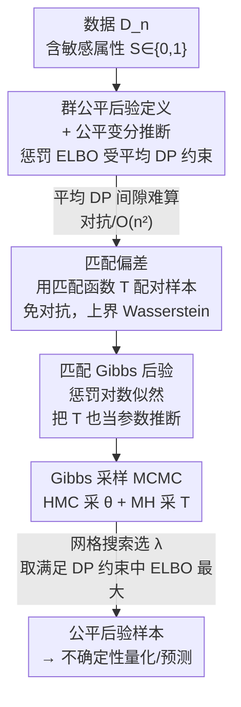

# A Fair Bayesian Inference through Matched Gibbs Posterior

**会议**: ICLR2026  
**OpenReview**: [https://openreview.net/forum?id=sIjFXzEOOH](https://openreview.net/forum?id=sIjFXzEOOH)  
**代码**: https://github.com/JihuLee/MatchedGibbs  
**领域**: AI 安全 / 算法公平 / 贝叶斯推断  
**关键词**: 群公平、贝叶斯推断、Gibbs 后验、不确定性量化、匹配偏差

## 一句话总结
针对"公平模型只给一个点估计、不会量化预测不确定性"的痛点，本文把群公平约束塞进贝叶斯框架，提出以**匹配偏差（matched deviation）**为惩罚项的 **matched Gibbs 后验**，把匹配函数 $T$ 也当成可学习参数来回避对抗训练，从而用一个每步 $O(n)$ 的 Gibbs 采样器同时拿到"满足人口学平价约束"和"校准良好"的后验分布。

## 研究背景与动机
**领域现状**：在可信 AI 里，**群公平（group fairness）**是研究最多的公平概念，最常用的判据是**人口学平价（Demographic Parity, DP）**——要求模型输出 $f(X,S)$ 与敏感属性 $S$ 独立，即两个敏感组上的预测分布 $P_{f,0}$ 与 $P_{f,1}$ 尽量一致。主流做法是在"找一个准确的预测模型"时加一条 DP 约束，得到**单个**公平的点估计模型。

**现有痛点**：这些方法只产出一个确定性模型，**完全没有量化预测的不确定性**。而现代深度网络高度过参数化、容易过拟合并给出过度自信的预测；在医疗诊断这类高风险、数据本身又对敏感属性有偏的场景里（如带偏的皮肤癌 / 阿尔茨海默诊断数据集），不确定性量化（UQ）恰恰是辅助医生决策不可或缺的一环。换句话说，"既要公平、又要可靠的不确定性"这件事一直缺位。

**核心矛盾**：贝叶斯推断天生擅长 UQ，但要把它和群公平结合非常难。理由有二：(1) 真正"严格公平"的后验——把全贝叶斯后验截断在公平模型集合 $\{f:\Delta_\psi(f)\le\delta\}$ 上——这个约束空间对深度网络根本无法解析刻画，且该集合后验概率极小，接受-拒绝采样不可行；(2) 退而求其次用变分推断（VI）时，每步梯度更新都要算"平均 DP 间隙" $\mathbb{E}_{\theta\sim\nu}\Delta_\psi(f_\theta)$，而常见偏差度量（KL、IPM）需要**对抗学习**找判别器，计算昂贵又数值不稳；即便用免对抗的 MMD，复杂度也是 $O(n^2)$，大数据上吃不消。

**本文目标**：(1) 给"后验分布的群公平程度"下一个可操作的定义；(2) 设计一个不需要对抗学习、计算可行的公平变分推断方法；(3) 在真实数据上同时改善"效用–公平"和"不确定性–公平"两条权衡曲线。

**切入角度**：作者借用 **Gibbs 后验**这一工具——它不需要指定完整似然，只要把某个目标函数（如惩罚负对数似然）当作 log-likelihood，就能得到一个后验分布，并能用标准 MCMC 直接采样、不受参数空间约束的牵绊。

**核心 idea**：用一个**新的群公平度量"匹配偏差"**作为惩罚项构造 Gibbs 后验，并把度量里的**匹配函数 $T$ 也当作待推断的参数**，这样就把"求 DP 间隙"从一个需要对抗优化的内层问题，变成 Gibbs 采样里可以直接采的另一组变量，彻底绕开对抗训练。

## 方法详解

### 整体框架
本文要解决的是"**在保证群公平的同时，给出能量化不确定性的后验分布**"。整体思路是一条从"定义公平后验 → 写出带公平惩罚的变分目标 → 用 Gibbs 后验做代理分布 → 用 Gibbs 采样器同时采模型参数和匹配函数"的链路。

输入是数据 $D_n=\{(x_i,y_i,s_i)\}$（$s_i\in\{0,1\}$ 为敏感属性）；输出是一个对参数 $\theta$ 的后验分布 $\nu_M(\theta,T\mid\lambda)$，从中采样即可做预测分布估计、校准、不确定性量化等下游贝叶斯任务。中间的关键转折是：把"平均 DP 间隙 $\le\delta$"这个难算的约束，替换成"以**匹配偏差** $\Delta_M(\theta,T)$ 为惩罚项的惩罚对数似然"，再令对应的 Gibbs 后验作为公平 VI 的代理分布；而匹配偏差里的匹配函数 $T$ 不去优化、而是和 $\theta$ 一起被采样，从而把对抗内循环变成一个可直接采样的条件分布。

### 关键设计

**1. 群公平后验的定义：把"公平"从单模型搬到分布上**

现有公平判据都是针对单个模型 $f$ 定义的（DP 间隙 $\Delta_\psi(f)=\psi(P_{f,0},P_{f,1})$），但贝叶斯推断要的是一个分布，必须先回答"一个后验分布 $\nu$ 公平到什么程度"。作者给了两档定义：**严格 $\psi$-公平**要求 $\nu\{f:\Delta_\psi(f)\le\delta\}=1$，即后验几乎处处落在公平模型集合里——这个条件太苛刻，连线性模型的均场高斯 VI 都没有任何变分分布能满足它。于是放松为**$\psi$-公平**：$\mathbb{E}_{f\sim\nu}\Delta_\psi(f)\le\delta$，称 $\mathbb{E}_{f\sim\nu}\Delta_\psi(f)$ 为**平均 DP 间隙**。两者由一步拒绝采样桥接：先求一个 level 为 $\eta<\delta$ 的弱公平后验 $\nu^{(w)}$，再令 $\nu^{(s)}(\cdot)\propto\nu^{(w)}(\cdot)\,\mathbb{1}(\Delta_\psi(\cdot)\le\delta)$；由 Markov 不等式 $\nu^{(w)}\{f:\Delta_\psi(f)\le\delta\}>1-\eta/\delta$，说明拒绝采样接受率有保证。这一步把"难以解析刻画的截断后验"换成了"约束在期望上、可优化"的目标，是后面一切的前提。

**2. 匹配偏差：用样本配对把 DP 间隙变成一个免对抗、$O(n)$ 的量**

直接算 $\Delta_\psi$ 是整套方法的算力瓶颈：IPM 类度量 $\Delta_{\mathrm{IPM}_\mathcal{G}}(f)=\sup_{g\in\mathcal{G}}\big|\int g(f(x,0))P_{n,0}(dx)-\int g(f(x,1))P_{n,1}(dx)\big|$ 要对每个 $\theta\sim\nu$ 都解一个对抗优化找判别器 $g$，实际不可行；MMD 虽免对抗但 $O(n^2)$。作者引入**匹配函数** $T:\mathcal{X}_1\to\mathcal{X}_0$（满足 $T_\#P_1=P_0$，经验分布下就是两组样本间的一一配对），并定义**匹配偏差**

$$\Delta_M(\theta,T):=\mathbb{E}_{X_1\sim P_1}\big(\|f_\theta(X_1,s{=}1)-f_\theta(T(X_1),s{=}0)\|_2\big),$$

即"把组 1 的每个样本配到组 0 的一个样本上，看两者输出差多大"。它的理论价值由两条定理撑起：**定理 4.1（$\Delta_M\Rightarrow\Delta_W$）** 对任意 $T$，只要 $\Delta_M(\theta,T)\le\delta$ 就有 Wasserstein 间隙 $\Delta_W(\theta)\le\delta$——即匹配偏差是 Wasserstein 距离的上界，控住它就控住了真正的群公平；**定理 4.2（$\Delta_{TV}\Rightarrow\Delta_M$）** 反过来说，任何在 total variation 意义下公平的模型，都存在一个 $T$ 使 $\Delta_M$ 很小，保证这个代理度量不会"误杀"本就公平的模型。关键是给定 $T$ 后 $\Delta_M$ 就是一个对配好对的样本求平均的量，既不需要对抗、复杂度也降到 $O(n)$。

**3. 匹配 Gibbs 后验：把匹配函数 $T$ 也当作待推断的参数**

有了匹配偏差，就可以写出惩罚对数似然 $\ell(\theta)-\lambda n\Delta_M(\theta,T)$ 并构造对应的 Gibbs 后验：

$$\nu_M(f,T\mid\lambda)\propto\exp\big(\ell(f)-\lambda n\,\Delta_M(f,T)\big)\,\pi(f)\,\pi(T).$$

这里最巧的一笔是**把 $T$ 和 $f$ 一起当参数来推断**，而不是像求 IPM 那样把"找最优配对/判别器"当成一个内层优化问题。这样做的好处是：原本"为每个 $\theta$ 都解一次对抗 $\sup_g$"被替换成"在采样 $\theta$ 的同时，也从 $T$ 的条件后验里采一个配对"，对抗内循环消失了，代价只是多采一组变量。定理 4.1/4.2 正是这一步的动机来源——4.1 说明可以靠调 $\lambda$ 控制最小化者的群公平程度，4.2 说明公平模型总配得到一个小 $\Delta_M$ 的 $T$。此外该后验在某些情形有简单形式：当回归噪声高斯、$f$ 先验为高斯过程且 $\sigma^2$ 已知时，$\nu_M(f\mid T,\lambda)$ 仍是高斯过程，可直接采样；否则用 HMC 采。

**4. Gibbs 采样 MCMC：HMC 采 $\theta$、Metropolis–Hastings 采离散的 $T$**

后验里 $\theta$ 连续、$T$ 是离散的样本配对，作者用 **Gibbs 采样器**交替采 $\theta\sim p(\theta\mid T,D_n)$ 与 $T\sim p(T\mid\theta,D_n)$。采 $\theta$ 这一步等价于固定 $T$ 后从 $\nu_n(\theta;\lambda)$ 采，直接用 **HMC**。采 $T$ 这一步用 **MH**：先给 $T$ 设一个基于"能量"的先验 $\pi(T)\propto e(T)$，

$$e(T;\tau)=\exp\Big(-\sum_{i=1}^{n_1} d\big(X^{(0)}_i,\,T(X^{(1)}_i)\big)\big/ n_0\tau\Big),$$

即倾向于把彼此距离近（用度量 $d$、温度 $\tau$ 调节）的样本配在一起；提议 $T\to T'$ 时随机选 $k$ 个索引做一次随机置换，由于提议完全随机，接受概率直接由后验比给出，便于计算。$\lambda$ 则用**网格搜索**选：对候选集里每个 $\lambda$ 采样并算 ELBO 与平均 DP，最后在"平均 DP $<\delta$"的候选里取 ELBO 最大的那个。整套算法每步更新 $O(n)$，相比 MMD 的 $O(n^2)$ 是实打实的可扩展性提升。

## 实验关键数据

实验在 5 个常用群公平基准上做：表格数据 **ADULT / DUTCH / CRIME**、图像数据 **CELEBA**（预测 Attractive，敏感属性 Male）、文本数据 **CIVIL**（CivilComments，黑人 vs 亚裔两组毒性评论）。预测模型统一用 DNN（因其易过拟合、正需要 UQ）。对比包含 3 个公平贝叶斯方法（均场高斯+MMD `variational_mmd`、Gibbs+MMD `gibbs_mmd`、本文 `gibbs_matched`）和 3 个确定性 DP SOTA（`gapreg`、`reduction`、`adv`）。评估方式是画**帕累托前沿**：横轴是群公平水平 $\Delta_W^{1/2}=W_2(P_{f,0},P_{f,1})$，纵轴是效用/不确定性指标。

### 主实验（帕累托前沿比较）

| 数据集 / 模态 | 效用 Acc 趋势 | 不确定性 Nll·brier 趋势 | 结论 |
|--------------|--------------|------------------------|------|
| CRIME（表格） | `gibbs_matched` 在各公平水平下权衡更优 | 优于全部基线 | MMD 两法即便在中等规模也非有力竞争者 |
| ADULT / DUTCH（表格） | 权衡曲线占优 | 占优；ADULT 上 Ece 权衡最佳 | 公平约束严格时 Ece 略逊（见下） |
| CELEBA（图像） | Acc 大幅领先 | 不确定性指标一致最低（最好） | 贝叶斯天然改善 UQ |
| CIVIL（文本） | Acc 领先 | Nll/brier 持续最优 | `gapreg`/`reduction` 随公平变严反而过拟合致 Nll 上升 |

> 关于 $\Delta_W^{1/2}$：对 Wasserstein 间隙取平方根以保持 $W_2$ 原尺度，越小越公平；指标里 Acc 越高越好，Nll / brier / Ece 越低越好。

### 消融实验

| 配置 | 考察点 | 说明 |
|------|--------|------|
| 改变温度 $\tau$ | $T$ 先验能量的尖锐度 | 各 $\tau$ 下仍保持优越权衡 |
| 预训练 epoch 数 | 初始化影响 | 权衡稳健 |
| 翻转敏感标签（改 $T$ 方向） | $T$ 方向对称性 | 结论不变 |
| 先验选择 | $\pi(\theta)$ 鲁棒性 | 仍维持优势 |

### 关键发现
- **MMD 路线在实践上不成立**：`variational_mmd`/`gibbs_mmd` 因 $O(n^2)$ 只能在 CRIME 这种中等规模上跑，且 Acc/Nll/brier 表现也不好——说明本文用匹配偏差换掉 MMD 不只是为提速，效果同样更好。
- **Ece 单看会误导**：在 CRIME/DUTCH 上公平约束很严时 `gibbs_matched` 的 Ece 权衡变差，但作者指出"恒定输出 0.5 置信度"也能拿到接近 0 的 Ece 却毫无用处，故低 Ece 不等于好模型，要结合 Acc/Nll 一起看。
- **附带改善个体公平**：因为匹配偏差直接拉近不同个体的输出，`gibbs_matched` 在一致性分数 Con（个体公平指标）上也优于基线——这是群公平方法少见的"白送"性质。
- MCMC 收敛性通过 $\theta$ 的轨迹图与 $T$ 的接受概率验证，收敛良好。

## 亮点与洞察
- **把对抗内循环"采样化"**：最巧的一招是把 IPM 里那个需要对每个 $\theta$ 都解一遍的 $\sup_g$，改写成"对匹配函数 $T$ 的条件后验采样"。同样是处理"两组分布的差距"，从优化变成采样后，既免对抗又天然融进 Gibbs 框架，这个思路可迁移到任何"度量含内层对抗 sup"的公平/分布匹配任务。
- **代理度量两头都有定理护栏**：定理 4.1 保证"控住 $\Delta_M$ 就控住 Wasserstein"（不放过不公平），定理 4.2 保证"公平模型必有小 $\Delta_M$ 的配对"（不误杀公平），两条夹住让匹配偏差成为一个理论上靠谱的代理，而不是拍脑袋的启发式。
- **公平 + UQ 一次拿到**：现有公平方法基本只给点估计，本文把整套搬进贝叶斯，使得"既公平又能给校准的不确定性"成为可能，对医疗等高风险场景特别有意义。
- **可复用 trick**：基于样本间距离的能量先验 $\pi(T)\propto\exp(-\sum d/n_0\tau)$ + 随机置换提议的 MH，是一种采离散配对/置换变量的通用配方。

## 局限与展望
- **主要限于二元敏感属性**：方法在正文聚焦 $S\in\{0,1\}$，多元敏感属性只在附录给了延伸思路、留待后续完整算法与结果。
- **聚焦人口学平价**：以 DP（independence 判据）为主，对 Equalized Odds 等只在附录扩展；separation/sufficiency 类判据未深入。
- **缺理论一致性结果**：作者自己指出 matched Gibbs 后验的后验一致性等理论性质值得研究但本文未给。
- **$T$ 带来额外采样开销**：把 $T$ 当参数虽免了对抗，但多采一组离散配对变量、还要调 $\tau$/$k$ 等超参；当 $\mathcal{X}$ 非度量空间（类别/文本）时不能用最优传输固定 $T$ 来省算力。
- **评估以帕累托前沿为主**：论文没有给出单点的数值对照表，跨方法的绝对数值差距需读图判断，复现时需注意。

## 相关工作与启发
- **vs 确定性 DP 方法（GapReg / Reduction / Adv）**：它们只产出单个公平点估计、不量化不确定性，且在公平变严时易过拟合（Nll 上升）；本文给的是公平后验分布，UQ 指标一致更优。
- **vs MMD 类公平贝叶斯（variational_mmd / gibbs_mmd）**：同为免对抗，但 MMD 是 $O(n^2)$、大数据不可行，且实测 Acc/Nll 也更差；匹配偏差降到 $O(n)$ 且效果更好。
- **vs IPM/对抗式公平度量**：IPM 需对每个采样模型解内层对抗 $\sup_g$，昂贵又不稳；本文用"把匹配 $T$ 当参数采样"替代对抗优化。
- **vs Kim et al. (2025a) 的最优传输固定匹配**：该工作固定 $T$ 为最优传输、在度量空间上有改善个体公平等好性质；本文把 $T$ 学起来，既继承了个体公平的好处，又能用于类别/文本这类非度量空间。

## 评分
- 新颖性: ⭐⭐⭐⭐⭐ 把群公平塞进贝叶斯框架，并用"匹配偏差 + 把匹配函数当参数采样"巧妙绕开对抗，是一个干净且有理论支撑的新角度
- 实验充分度: ⭐⭐⭐⭐ 覆盖表格/图像/文本五数据集、效用与不确定性双权衡、含多项消融与扩展，但以帕累托前沿图为主、缺单点数值对照表
- 写作质量: ⭐⭐⭐⭐ 定义—挑战—方法的推进逻辑清晰，定理与动机衔接到位；部分细节散落附录
- 价值: ⭐⭐⭐⭐⭐ 让"公平 + 校准良好的不确定性"在高风险决策中同时可得，且 $O(n)$ 可扩展，实用价值高

<!-- RELATED:START -->

## 相关论文

- [\[ICLR 2026\] A Bayesian Nonparametric Framework for Private, Fair, and Balanced Tabular Data Synthesis](a_bayesian_nonparametric_framework_for_private_fair_and_balanced_tabular_data_sy.md)
- [\[ICML 2026\] How Does Bayesian Sampling Help Membership Inference Attacks?](../../ICML2026/ai_safety/how_does_bayesian_sampling_help_membership_inference_attacks.md)
- [\[ICLR 2026\] Fair Conformal Classification via Learning Representation-Based Groups](fair_conformal_classification_via_learning_representation-based_groups.md)
- [\[ICML 2026\] Singular Bayesian Neural Networks](../../ICML2026/ai_safety/singular_bayesian_neural_networks.md)
- [\[ICLR 2026\] Memorization Through the Lens of Sample Gradients](memorization_through_the_lens_of_sample_gradients.md)

<!-- RELATED:END -->
