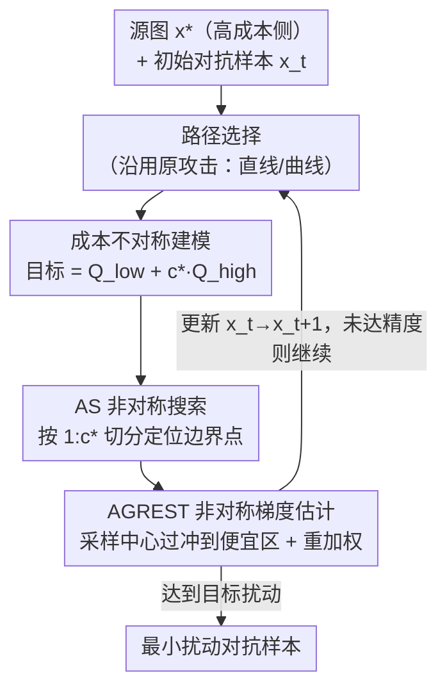

# A General Framework for Black-Box Attacks Under Cost Asymmetry

**会议**: ICLR 2026  
**OpenReview**: [https://openreview.net/forum?id=G1fFulgfd8](https://openreview.net/forum?id=G1fFulgfd8)  
**代码**: https://github.com/mahdisalmani/Asymmetric-Attacks  
**领域**: AI 安全 / 对抗攻击  
**关键词**: 决策型黑盒攻击, 成本不对称, 边界搜索, 梯度估计, 重要性采样

## 一句话总结
针对"不同查询代价不一样"（如向 NSFW 检测器提交违规图片会触发封号）的现实场景，本文提出一个能适配**任意成本比 $c^\star$** 的决策型黑盒攻击通用框架：用非对称搜索 AS 替换二分搜索、用非对称梯度估计 AGREST 替换标准蒙特卡洛梯度估计，在不丢弃原攻击核心组件的前提下把总查询成本压到最低，扰动范数最多再降 40%。

## 研究背景与动机
**领域现状**：决策型黑盒攻击（decision-based attack）只能观察分类器对输入返回的**最终决策**（而非概率），通过反复查询逼近决策边界，构造尽量小的对抗扰动。从 Boundary Attack 到 HSJA、GeoDA、CGBA，这条线把所需查询数压低了一到三个数量级，主流做法都默认"每次查询代价相等"，于是优化目标就是**最小化总查询数**。

**现有痛点**：现实里查询代价并不对称。攻击者去欺骗 NSFW（不适宜上班浏览）检测器时，被判定为违规的查询（flagged query）代价远高于正常查询——平台对违规内容会触发额外审核、封号、处罚。论文给了个很直观的数字：在 X 上一个账号一天能发 2400 条，但累计 5~10 次违规就会被封；而现有决策型攻击里约有**一半查询是 flagged 的**，于是攻击者发约 20 条就被封了。只数总查询数，根本反映不了这种代价差异。

**核心矛盾**：前作 Debenedetti et al.（2024）的 stealthy attack 注意到了这点，但它把问题做窄了——它**隐式假设正常查询代价为 0**（只压 flagged 查询数），又因为没法把 HSJA 的蒙特卡洛梯度估计改造成 stealthy 版本，只能退回到效率更差的 OPT 式梯度估计。结果是：为了少发 100 次 flagged 查询，它会产生 $10^6$ 量级的正常查询——而这些"便宜"查询累加起来，造成的封号账号反而更多（论文估算 100 次 flagged 约换 10 个新号，$10^6$ 次正常查询约换 400 个新号）。所以"只压贵查询"本身是片面的。

**本文目标**：设计一个**对任意成本比都有效、且不丢弃原攻击任何核心组件**（既保留二分搜索的思想，也保留高效的蒙特卡洛梯度估计）的通用框架。

**切入角度**：决策型攻击的两个核心操作——沿路径搜索边界点、估计梯度方向——恰好是"高成本查询"的两大来源（二分搜索约一半查询落在贵区、梯度估计采样球约一半落在贵区）。只要把这两个操作的**查询分布**朝便宜区偏移，就能在保持有效性的同时降成本。

**核心 idea**：把"最小化查询数"改写成"最小化总成本 $\text{cost}=Q_{\text{non-flagged}}+Q_{\text{flagged}}\cdot c^\star$"，并据此重新设计搜索（按 $1:c^\star$ 而非 $1:1$ 切分区间）和梯度估计（把采样中心推向便宜区并重加权），让一个连续旋钮 $c^\star$ 统一覆盖 vanilla（$c^\star{=}1$）和 stealthy（$c^\star{=}\infty$）两个极端。

## 方法详解

### 整体框架
一个决策型黑盒攻击迭代地做两件事：① **选路径**（直线如 HSJA/GeoDA，或曲线如 SurFree/CGBA）；② **沿路径搜索 + 估计梯度**，把上一轮的对抗样本 $x_t$ 更新到离源图 $x^\star$ 更近的 $x_{t+1}$。本文不重做攻击，而是把这套流程里"花贵查询最凶"的两个零件**就地替换**：边界搜索从二分搜索换成 **AS**，梯度估计从标准蒙特卡洛换成 **AGREST**，路径选择沿用原攻击。因此它是个"插件式"框架，能直接套到 HSJA、GeoDA、CGBA、SurFree 上得到 A-HSJA、A-GeoDA 等变体。

整个攻击优化的目标从"查询数"换成"总成本"。先写出原始成本 $\text{cost}=Q_{\text{total}}\cdot c_0+Q_{\text{flagged}}\cdot c_{\text{flagged}}$，因为只有相对大小重要，归一化为

$$\text{cost} := Q_{\text{non-flagged}} + Q_{\text{flagged}}\cdot c^\star,\qquad c^\star=\frac{c_{\text{flagged}}+c_0}{c_0}.$$

$c^\star{=}1$ 退化成普通攻击（数总查询），$c^\star{=}\infty$ 退化成 stealthy（只数 flagged），本文要在**任意 $c^\star$** 下都最优。其中被检测器判为对抗（$\phi(x'){=}-1$）的查询称为高成本查询，其余为低成本查询。

### 关键设计

**1. 成本不对称建模：把"少发贵查询"改成"总成本最小"**

stealthy attack 的根本局限是把正常查询当成免费的，只盯着 flagged 查询数。本文把目标显式写成 $Q_{\text{non-flagged}}+c^\star Q_{\text{flagged}}$，用单一参数 $c^\star$ 描述"一次贵查询相当于多少次便宜查询"。这一步看似只是换记号，却带来两个实质后果：其一，它让 vanilla（$c^\star{=}1$）和 stealthy（$c^\star{=}\infty$）成为同一框架的两个端点，中间所有现实成本比都被覆盖；其二，后面 AS 和 AGREST 的所有取舍（区间怎么切、采样中心推多远、权重怎么配）都从"最小化期望成本"这个统一准则推出来，而不是各自拍脑袋。攻击者的形式化目标仍是 $\min_{x'}\lVert x^\star-x'\rVert$ s.t. $\phi_{x^\star}(x'){=}1$，只是评价"代价"时换成了成本而非查询数。

**2. AS（非对称搜索）：按 $1:c^\star$ 切分区间，而不是对半砍**

沿路径找边界点时，二分搜索每次把区间对半切，是"最小化期望查询数"的最优比较算法；但在不对称成本下，它的期望成本是 $\Theta(c^\star\log(1/\tau))$，因为约一半查询落在贵的一侧。AS 的洞察是：既然贵区查询代价是便宜区的 $c^\star$ 倍，就应该**少往贵区试探**。具体做法是把当前区间 $[b_l\tau,b_u\tau]$ 按 $1:c^\star$ 切，中点取 $b_m=b_l+\big\lceil\frac{b_u-b_l}{c^\star+1}\big\rceil$：若 $\phi(T(b_m\tau)){=}1$（落在便宜的对抗侧）就往右半段继续，否则往左半段。这样大部分试探点都偏向便宜区。$c^\star{=}1$ 时 AS 正好退回二分搜索，$c^\star{=}\infty$ 时退化成逐点 $\tau,2\tau,3\tau,\dots$ 的线搜索（即 stealthy 的策略），两端无缝衔接。定理 1 证明 AS 的期望成本是 $O\!\big(c^\star\log_{c^\star+1}(1/\tau)\big)$，相对二分搜索改进了 $\Theta(\log(c^\star+1))$ 倍；在 $c^\star{=}10^3$ 时二分搜索成本约是 AS 的 2.5 倍。

**3. AGREST（非对称梯度估计）：采样中心过冲到便宜区 + 重要性重加权**

标准蒙特卡洛梯度估计 $\widehat{\nabla S}(x_t)=\frac{1}{n_t}\sum_i\phi(x_t+\delta u_i)u_i$ 把采样球心放在边界点 $x_t$ 上，于是约一半采样落在贵的一侧。AGREST 改成在一个**推离源图的点** $x_t'=x_t+\omega_t\frac{x_t-x^\star}{\lVert x_t-x^\star\rVert_2}$ 处采样（$\omega_t$ 是过冲量），中心一旦偏向对抗（便宜）区，落在贵区的查询自然变少，且偏移幅度 $\omega_t$ 直接控制这个频率。但只偏移会让估计偏，于是再做重要性重加权：用权重函数 $\hat\phi_t(x)=(1-\beta_t)\mathbb{1}\{\phi(x){=}1\}-\beta_t\mathbb{1}\{\phi(x){=}-1\}$（$\tfrac12\le\beta_t<1$）给高/低成本查询配不同权重，降低估计方差。

参数 $(\omega_t,\beta_t,n_t)$ 怎么选有完整理论支撑。直接最大化"估计方向与真梯度的余弦相似度"难算，论文在**局部线性**假设下（$S(x_t'+\delta u)\approx S(x_t)+\langle\nabla S(x_t),x_t'+\delta u-x_t\rangle$，且边界点 $S(x_t){=}0$）用引理 1 的超球冠公式算出低成本查询概率 $p_t(\omega_t)$，再借测度集中把目标近似成易算的 $J(x_t,\omega_t,\beta_t,n_t)$（定理 2 给出 $O(d^{-z})$ 的逼近界）。在成本约束 $n_t(c^\star-(c^\star-1)p_t(\omega_t))\le c_t$ 下求解，定理 3 给出最优解：$\beta_t^\star=p_t(\omega_t^\star)$，$n_t^\star=c_t\,(c^\star-(c^\star-1)p_t(\omega_t^\star))^{-1}$，而 $\omega_t^\star$ 是某个 $\hat J_t(\omega_t)$ 在区间上的最大值点（$I_d$ 闭式复杂，用 QUADPACK 数值积分 + Nelder–Mead 数值优化求）。落地时还有两处工程化：① $\alpha_t$（$x_t-x^\star$ 与梯度方向 $g_t$ 的夹角）在黑盒下不可知，先用定理 4 估初值 $\mathbb{E}[\cos\alpha_1]$，再用调度器 $\alpha_{t+1}=\arccos(1-(1-\cos\alpha_1)(t{+}1)^{-m})$ 外推（$m$ 是新引入的过冲调度率超参）；② $\beta_t$ 在实践中用经验概率 $\tfrac{n_L}{n_L+n_H}$ 代替理论值以进一步降方差。正因为保留了蒙特卡洛梯度估计这个高效组件，AGREST 才能比 stealthy 退化用的 OPT 式估计强得多。

### 一个完整示例
拿 AS 沿一条从干净图（被判违规、flagged）到对抗图（non-flagged）的路径找边界点为例，设 $c^\star{=}2$、区间归一化到 $[b_l,b_u]$。第一步切点取 $b_m=b_l+\lceil\frac{b_u-b_l}{3}\rceil$（不是对半，而是靠近便宜端 $1/3$ 处），查询该点：若落在 non-flagged（便宜、$\phi{=}1$）侧，就把搜索收进右侧 $[b_m,b_u]$；若落在 flagged（贵）侧，收进左侧。如此重复直到区间宽度 $\le\tau$ 命中边界。和二分对半相比，AS 每一步都更愿意往便宜侧多走、少去贵侧试探，最终多数查询是便宜的——这正是图 2(右) 里那条"红点（flagged）少、绿点（non-flagged）多"的搜索轨迹。

### 损失函数 / 训练策略
本文是无训练的攻击算法，不涉及网络训练。"目标函数"即总成本 $Q_{\text{non-flagged}}+c^\star Q_{\text{flagged}}$，AS 与 AGREST 的参数都由前述定理在成本约束下解析/数值求出。关键超参为过冲调度率 $m$，对 HSJA、GeoDA、CGBA 分别取 0.02、0.06、0.06；其余沿用各原攻击的默认设置（SurFree 的子空间从 DCT$_{8\times8}$ 改为 DCT$_{\text{full}}$ 以与 GeoDA/CGBA 公平对比）。

## 实验关键数据

### 主实验
**设置**：ImageNet 上的 ResNet-50、ViT-B/32、ViT-B/16、CLIP；取 500 张分类正确的验证样本作源图；指标为"给定总成本下扰动与原图的中位 $\ell_2$ 距离"（越小越好）。

消融表给出 4 个攻击在不同 $c^\star$ 下、用 VA / +AS / +AGREST / +两者（A-*）的中位 $\ell_2$（ResNet-50 节选）：

| 攻击 | 变体 | $c^\star{=}2$ | $c^\star{=}5$ | $c^\star{=}10^2$ | $c^\star{=}10^3$ |
|------|------|------|------|------|------|
| SurFree | VA | 4.09 | 5.19 | 5.21 | 17.49 |
| SurFree | +AS (A-SurFree) | 3.45 | 3.52 | 3.80 | **7.59** |
| HSJA | VA | 2.24 | 2.77 | 4.66 | 23.72 |
| HSJA | +AGREST | 2.19 | 2.51 | 2.49 | 14.62 |
| HSJA | +AS+AGREST (A-HSJA) | 2.13 | 2.39 | 2.16 | **12.28** |
| GeoDA | VA | 2.80 | 3.21 | 4.02 | 10.80 |
| GeoDA | +AS+AGREST (A-GeoDA) | 2.93 | 2.8 | 2.11 | **5.78** |
| CGBA | VA | 1.21 | 1.42 | 2.22 | 9.97 |
| CGBA | +AS+AGREST (A-CGBA) | 1.15 | 1.33 | 1.58 | **6.23** |

在 $c^\star{=}10^3$ 这种强不对称下，HSJA 的扰动从 23.72 砍到 12.28、GeoDA 从 10.80 砍到 5.78、SurFree 从 17.49 砍到 7.59，提升非常显著。

### 消融实验
上表本身就是 AS / AGREST 的拆解消融，关键观察：

| 配置 | 现象 | 说明 |
|------|------|------|
| 仅 +AGREST | 大 $c^\star$ 下 $\ell_2$ 约降 40% | 梯度估计是高成本查询的主要来源，单换 AGREST 收益最大 |
| 仅 +AS | 中小幅改进 | 搜索占查询预算比例较小，单换 AS 收益有限 |
| +AS+AGREST (A-*) | 在 AGREST 基础上再降 | 两者叠加最优 |
| $c^\star{=}2,5$ | 改进较小 | 贵/便宜查询代价接近时，二分搜索和标准梯度估计本就够好 |

### 关键发现
- **AGREST 是主力**：单独使用 AGREST 在所有情形把 $\ell_2$ 范数降约 40%，因为基于梯度估计的攻击把大部分查询预算花在梯度逼近上，而非搜索；AS 的增益相对小但在大 $c^\star$ 下仍有效。
- **越不对称越赚**：$c^\star$ 越大（贵查询越贵），相对 vanilla 的优势越明显；$c^\star{=}2,5$ 时几乎打平。
- **碾压 stealthy**：在 $c^\star{=}10^4,10^5,\infty$ 下，A-HSJA / A-GeoDA / A-CGBA / A-SurFree 全面优于 Stealthy HSJA。尤其 A-HSJA 保留了 Stealthy HSJA 被迫丢弃的蒙特卡洛梯度估计，却仍然更好——图 1 显示 A-HSJA 用 610 次 flagged / 71 万总查询达到中位 $\ell_2{=}10$，而 Stealthy HSJA 要 636 次 flagged / $10^7$ 总查询；A-GeoDA 更是只要 205 / 21 万。

## 亮点与洞察
- **一个旋钮统一两端**：用单参数 $c^\star$ 把 vanilla（$c^\star{=}1$，二分搜索）和 stealthy（$c^\star{=}\infty$，线搜索）连成连续谱，AS 在两端自动退化到对应已知算法——这种"已有方法是我特例"的设计既优雅又好验证。
- **"便宜查询也要算账"是真正被忽视的点**：stealthy 把正常查询当免费导致海量正常查询，本文用账号封禁的数字把这个隐藏成本说透，动机非常具体可信。
- **过冲采样 + 重要性重加权是可迁移的 trick**：当某类采样落点代价不均时，"把采样中心朝便宜区平移，再用重要性权重纠偏"这套组合可迁移到任何带不对称查询/标注代价的主动采样、黑盒优化场景。
- **理论与工程闭环**：从余弦相似度目标 → 局部线性近似 → 测度集中近似 $J$ → 定理 3 解析最优参数 → 数值求积分/优化 + 调度器估 $\alpha_t$，一路把"理想目标不可算"逐步落到可执行算法，方法论完整。

## 局限与展望
- **强依赖局部线性假设**：$p_t(\omega_t)$、定理 2/3/4 都建立在边界局部线性上，对高度非线性或多分段的决策边界，最优参数可能偏；论文也承认要靠经验概率 $\tfrac{n_L}{n_L+n_H}$ 替代理论 $\beta_t$ 来稳住方差。
- **$\alpha_t$ 是启发式外推**：调度器 $\alpha_{t+1}=\arccos(1-(1-\cos\alpha_1)(t{+}1)^{-m})$ 借用了 HSJA 的 $\cos$ 收敛速率结论，引入新超参 $m$ 且需逐攻击调（0.02~0.06），对超参有一定敏感性。
- **攻击视角的双刃性**：这是更高效的对抗攻击框架，对内容审核/NSFW 检测等安全系统是现实威胁；论文未展开对应防御，后续可研究"成本不对称下的鲁棒训练/查询代价感知防御"。
- **评测局限**：指标集中在中位 $\ell_2$ 与查询成本，未充分覆盖 $\ell_\infty$、不同检测器决策粒度、以及真实平台封号策略的随机性。

## 相关工作与启发
- **vs Stealthy Attacks（Debenedetti et al., 2024）**：他们用 egg-dropping 式线搜索替换二分、且把蒙特卡洛梯度估计换成 OPT 式估计，只压 flagged 查询、隐式设正常查询代价为 0；本文用 $c^\star$ 显式建模任意成本比、用 AS 统一两端、并**保留**高效蒙特卡洛梯度估计（AGREST），在 $c^\star{=}\infty$ 这个 stealthy 的主场仍大幅胜出。
- **vs HSJA / GeoDA / CGBA / SurFree**：这些是对称成本（$c^\star{=}1$）下的 SOTA 决策型攻击，本文不替换它们而是作为"插件"嵌入——把它们的二分搜索换成 AS、蒙特卡洛梯度估计换成 AGREST，得到对应的 A-* 版本，路径选择等其余组件几乎原样保留。
- **vs Boundary Attack / OPT 系**：早期 Boundary Attack 需十万级查询、OPT 式梯度估计效率偏低；本文站在更高效的蒙特卡洛梯度估计一侧，并把"代价"从查询数升级为成本，方向上是对这条线的"成本感知化"延伸。

## 评分
- 新颖性: ⭐⭐⭐⭐⭐ 首个覆盖任意成本比、且不丢弃原攻击核心组件的决策型黑盒攻击框架，$c^\star$ 统一 vanilla/stealthy 两端
- 实验充分度: ⭐⭐⭐⭐ 覆盖 4 个攻击 × 4 种架构 × 多个 $c^\star$ 的消融 + 与 stealthy 的正面对比，较扎实；指标维度可再丰富
- 写作质量: ⭐⭐⭐⭐⭐ 动机用封号数字讲得极具体，理论（4 个定理）与算法（3 个 Alg）衔接清晰
- 价值: ⭐⭐⭐⭐ 揭示"成本不对称下便宜查询也要算账"这一被忽视维度，对内容审核类安全系统的攻防都有现实意义

<!-- RELATED:START -->

## 相关论文

- [\[ICLR 2026\] SeRI: Gradient-Free Sensitive Region Identification in Decision-Based Black-Box Attacks](seri_gradient-free_sensitive_region_identification_in_decision-based_black-box_a.md)
- [\[ICLR 2026\] Black-Box Privacy Attacks on Shared Representations in Multitask Learning](black-box_privacy_attacks_on_shared_representations_in_multitask_learning.md)
- [\[ICLR 2026\] Traceable Black-box Watermarks for Federated Learning](traceable_black-box_watermarks_for_federated_learning.md)
- [\[ICLR 2026\] Fairness via Independence: A General Regularization Framework for Machine Learning](fairness_via_independence_a_general_regularization_framework_for_machine_learnin.md)
- [\[CVPR 2026\] SEBA: Sample-Efficient Black-Box Attacks on Visual Reinforcement Learning](../../CVPR2026/ai_safety/seba_sample-efficient_black-box_attacks_on_visual_reinforcement_learning.md)

<!-- RELATED:END -->
