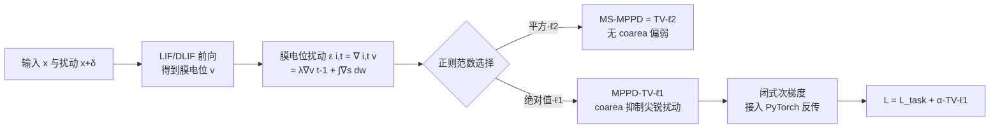

# A Unified Total Variation Framework for Membrane Potential Perturbation Dynamic

**会议**: ICLR 2026  
**OpenReview**: [https://openreview.net/forum?id=LDo9numrx6](https://openreview.net/forum?id=LDo9numrx6)  
**代码**: [https://github.com/laizhr/MPPD-TV](https://github.com/laizhr/MPPD-TV)  
**领域**: AI Safety / 脉冲神经网络对抗鲁棒性  
**关键词**: Spiking Neural Network, Membrane Potential, Total Variation, Adversarial Robustness, Coarea Formula  

## 一句话总结
本文证明了脉冲神经网络（SNN）中用于刻画对抗扰动的「膜电位扰动动态（MPPD）」本质上就是一个全变分（TV）算子，进而把现有的均方 MPPD 正则等价为 TV-ℓ2 框架，并提出更强的 **TV-ℓ1 框架**——借助 coarea 公式获得对尖锐对抗噪声更好的抑制能力，在高斯/对抗训练下都把 SNN 的鲁棒精度刷到新高。

## 研究背景与动机
- **领域现状**：SNN 因稀疏激活而省电省算，被视为深度学习的低功耗方向；但和 ANN 一样，SNN 同样容易被对抗样本攻破，阻碍其在安全敏感场景的落地。一个有前景的防御思路是：观察到 LIF 神经元的膜电位里藏着对抗扰动信息，于是 Ding et al. (2024a) 提出膜电位扰动动态（MPPD），并用其均方（MS-MPPD）作为正则项稳定 SNN。
- **现有痛点**：完整的 MPPD 公式里其实包含「MPPD 主项 + 神经元复位项」两部分。原方法觉得复位项会让动态产生剧烈波动，于是**直接把它丢掉**只留主项。这种处理虽然直观，但论文指出它在「扰动刻画」上是不充分的——你凭直觉删项，缺乏理论依据，也可能漏掉扰动信息。
- **核心矛盾**：MS-MPPD 用的是均方（ℓ2）形式，而 ℓ2 的平方 TV 项**不满足 coarea 公式**，对尖锐噪声缺乏鲁棒性；同时 L2 函数空间比 L1 更小，能承载的膜电位函数类更受限。也就是说，现有框架既没说清 MPPD 到底是什么，又用了一个先天偏弱的范数。
- **本文目标**：给 MPPD 建立完整的数学理论——回答「它到底是什么」，并据此造一个更鲁棒的训练框架。
- **核心 idea**：**【洞察】MPPD 就是膜电位关于「节点 + 时间步」二维的全变分（TV）**。一旦认出这层身份，就能：① 证明 MS-MPPD = TV-ℓ2；② 顺理成章地升级到信号重建里更鲁棒的 **TV-ℓ1**，让 coarea 公式来对抗扰动。

## 方法详解

### 整体框架
论文不改 SNN 骨架，而是重新解释并升级膜电位上的正则项。先把 MPPD 的递推式 $\epsilon^l_i[t]=\lambda\epsilon^l_i[t-1]+\sum_j w^l_{ij}\Delta s^{l-1}_j[t]$ 翻译成 $(i,t)$ 二维上的局部变分，证明它是 TV，于是均方正则 $L_{\text{MS-MPPD}}=\sum_{i,t}(\epsilon^L_i[t])^2$ 恰好是 TV-ℓ2；再换成绝对值形式得到 TV-ℓ1，并补齐它训练所需的三块理论：coarea 公式、被支配（dominated）TV 性质、闭式次梯度。最终只需把训练目标 $\min_w\{L_{\text{task}}+\alpha\cdot L_{\text{MPPD}}\}$ 里的正则项从 ℓ2 换成 ℓ1，其余训练流程（STBP + 三角替代梯度）不变。

### 关键设计

**1. 把 MPPD 认成 TV：扰动 = 膜电位的局部变分（Theorem 1）。** 论文的起手式是给 MPPD 一个测度论身份。把节点索引 $i$、时间步 $t$、输入 $x$ 都当作自变量，扰动项要逼近的正是纯净膜电位与被扰动膜电位之差 $v(i,t,x)-v(i,t,x+\delta)$。只要扰动 $\delta$ 能写成 $(i,t)$ 的可测函数 $\delta(i,t)$，这个差就**恰好是 $v$ 在 $(i,t)$ 维度上的局部变分** $\epsilon(i,t,x):=\nabla_{(i,t)}v(i,t,x)$。这一步的关键直觉是：扰动 $\delta(i,t)$ 可以被嵌进 SNN 的某个节点/时间步里，于是 SNN 的时间-神经元演化天然就在「累积膜电位的增量」——这正是 TV 的定义。由此 MS-MPPD 正则 $\sum(\epsilon^L_i[t])^2=\int|\nabla_{(i,t)}v|^2$ 被坐实为标准的 **TV-ℓ2 框架**。「$\delta$ 可测」是唯一的根本前提，直观含义是「不同强度的扰动能被不同的节点+时间步组合区分出来」，这也解释了为何用更多节点和时间步能更准地识别对抗扰动。

**2. 升级到 TV-ℓ1：让 coarea 公式来抑制尖锐扰动（Theorem 2 & 3）。** 既然认出了 TV 身份，自然要用信号重建里更鲁棒的那个范数。把递推沿时间累加得 $\nabla_{(i,t)}v=\sum_{k=0}^{t-1}\lambda^k\int_{J(i)}\nabla_{(j,t)}s(j,t-k,x)\,dw$，它直接是脉冲扰动的求和，所以取**绝对值**（而非平方）才精确度量扰动幅度。TV-ℓ1 的杀手锏是 coarea 公式 $\int_\Theta|\nabla_{(i,t)}v|\,d\mu=\int_{-\infty}^{\infty}\phi(\{(i,t):v=\psi\})\,d\psi$：它按膜电位取值 $\psi$ 把定义域切成等高集，对每个取值统计「有多少 $(i,t)$ 落在这里」的 Hausdorff 测度再沿 $\psi$ 积分。直觉是——如果某个取值区间聚集了大量点（往往就是对抗扰动制造的尖锐结构），它的 TV 贡献就大，从而在最小化目标里被重点压制。而 TV-ℓ2 用平方项，**没有 coarea 公式**，对尖锐噪声就钝。另外因为有限测度下 L2 ⊂ L1，TV-ℓ1 的函数空间更大，能容纳更多类膜电位函数，适用性更广。

**3. 被支配 TV 性质：用脉冲的 TV 卡住膜电位的 TV（Theorem 4）。** 要让正则项真能稳住网络，必须保证膜电位的 TV 是有界、可控的。论文证明膜电位 TV 被脉冲 TV 所支配：$\int|\nabla_{(i,t)}v|\le\|w^l\|_1\log_\lambda(\tfrac{1}{e})\int|\nabla_{(j,t)}s|$（离散形式因子为 $\tfrac{\|w^l\|_1}{1-\lambda}$）。由于脉冲来自 Heaviside 函数，$|\nabla_{(j,t)}s|\le 1$ 且积分上限有限，右端必然有界，于是左端被牢牢控住。支配因子里 $\|w^l\|_1$ 表示边权造成的能量扩散，$\log_\lambda(\tfrac{1}{e})$ 表示时间演化的缩放效应——$\lambda$ 越接近 1（实践常用，以保持时间平滑），需要的脉冲 TV 缩放就越大才能压住膜电位 TV，这把「平滑性」与「稳定性」两个诉求统一在了一个不等式里。

**4. 闭式次梯度：让不可微的 ℓ1 项能进 PyTorch 反传（Proposition 5）。** TV-ℓ1 的绝对值项关于权重 $w(i,j(i))$ 不可微，主流框架训不动。论文给出闭式次梯度：对求和项取 $\mathrm{sign}(\cdot)$ 再乘以脉冲变分 $\sum_k\lambda^k\nabla_{(j,t)}s$，形式上与标准梯度计算一致、不增加额外计算复杂度，于是 MPPD-TV-ℓ1 可无缝接入 STBP 训练。更妙的是这个次梯度**无论膜电位是否越过阈值、是否复位都在每个时间步捕捉 TV 对权重的敏感度**——这正好补上了原 MPPD「丢掉复位项」的缺口：通过最小化 TV，权重被逼着产生整体更平滑、对小扰动更不敏感的膜电位轨迹，连阈下的小扰动也被抑制。

## 实验关键数据

设置：VGG11 / WRN16 + DLIF 神经元，时间步 8；数据集 CIFAR-10/100、Tiny ImageNet；训练扰动用高斯噪声、对抗训练（AT）、AT+Reg 三种；测试攻击含 FGSM、C&W、PGD(7~40)、APGD、AutoAttack，强度统一 $\zeta=8/255$。对比 8 个 SOTA（SNN-BP / HIRE-SNN / SNN-RAT / FEEL / SR / ANN-PGD-AT / ANN-RiFT / MPPD-TV-ℓ2）+ Non-MPPD 消融。

### 主实验表格（CIFAR-10，对抗训练 AT，精度 %）

| 模型 (VGG11) | Clean | APGD10-CE | APGD10-DLR | FGSM | PGD20 | C&W | AutoAttack |
|---|---|---|---|---|---|---|---|
| Non-MPPD | 85.03 | 29.82 | 34.35 | 46.96 | 34.24 | 60.64 | 16.39 |
| MPPD-TV-ℓ2 | 85.17 | 27.78 | 35.30 | 46.51 | 32.26 | 63.05 | 19.75 |
| **MPPD-TV-ℓ1** | **86.11** | **36.59** | **45.26** | **51.89** | **41.15** | **66.68** | **23.04** |

### 消融实验表格（Non-MPPD vs ℓ2 vs ℓ1，CIFAR-10 / WRN16，AT+Reg）

| 模型 | Clean | APGD10-CE | FGSM | PGD20 | AutoAttack |
|---|---|---|---|---|---|
| Non-MPPD | 84.64 | 35.50 | 56.88 | 34.87 | 11.16 |
| MPPD-TV-ℓ2 | 84.22 | 33.53 | 58.32 | 32.70 | 13.69 |
| **MPPD-TV-ℓ1** | **85.40** | **36.68** | 57.44 | **35.90** | **18.01** |

### 关键发现
- **TV-ℓ1 全面压制 TV-ℓ2 与 Non-MPPD**：在 AT 训练下，VGG11 的 AutoAttack 鲁棒精度从 ℓ2 的 19.75% 提到 23.04%，最强白盒攻击 APGD-DLR 从 35.30% 提到 45.26%，且 Clean 精度不降反升（86.11% > 85.17%）——鲁棒性与干净精度同时改善。
- **干净精度也受益**：因为 TV-ℓ1 让膜电位轨迹更平滑，泛化更好，在高斯/AT/AT+Reg 三种训练下 Clean 精度普遍最高。
- **高斯训练下整体脆弱但 ℓ1 仍最优**：纯高斯训练对强白盒攻击几乎全军覆没（多数 0%），但 MPPD-TV-ℓ1 仍能保住个位数微弱优势（如 AutoAttack 0.29% vs 0.00%），佐证 ℓ1 对尖锐扰动更敏感。

## 亮点与洞察
- **「认身份」式的理论贡献**：不发明新结构，而是证明一个已有经验方法（MPPD）就是经典算子（TV），既给原方法补了理论依据，又顺势打开升级通道。这种「先认出本质再升级范数」的研究范式很优雅。
- **coarea 公式当防御工具**：把图像信号处理里 TV-ℓ1 优于 TV-ℓ2 的经典结论迁移到 SNN 的膜电位上，理论动机清晰，不是拍脑袋调范数。
- **理论闭环完整**：从 TV 等价 → coarea → dominated TV（保证有界可控）→ 闭式次梯度（保证可训练），四块定理环环相扣，落地无缝。

## 局限与展望
- **任务面窄**：实验只覆盖图像分类（CIFAR/Tiny-ImageNet）+ VGG11/WRN16 两种骨架，未验证更大模型、检测/分割等任务或事件相机等 SNN 原生数据。
- **绝对鲁棒精度仍偏低**：AutoAttack 下最好也只有 ~23%，离实用安全还远；高斯训练几乎不抗强攻击，说明 TV 正则更像「锦上添花」而非独立防御。
- **λ 接近 1 的依赖**：dominated TV 性质要求 $\lambda$ 设得很接近 1，对超参较敏感，论文未充分探讨 $\lambda$/$\alpha$ 的鲁棒性区间。
- **理论可测性假设**：核心前提「$\delta$ 是 $(i,t)$ 的可测函数」在真实攻击下是否总成立、不成立时退化多少，缺乏实证刻画。

## 相关工作与启发
- **MPPD 原作（Ding et al., 2024a）**：本文的直接前身，提出 MPPD 与 MS-MPPD 正则，被本文证明为 TV-ℓ2 特例并升级。
- **Total Variation（Rudin et al., 1992；Chan et al., 2006）**：图像去噪/重建的经典工具，TV-ℓ1 vs TV-ℓ2 与 coarea 公式是本文的理论根基。
- **SNN 对抗鲁棒（SNN-RAT、HIRE-SNN、FEEL、SR）**：一系列从输入编码、泄漏因子、梯度稀疏等角度做防御的工作，本文从「膜电位正则的数学本质」切入，正交且可叠加。
- **启发**：很多深度学习里的经验正则项也许都能找到经典泛函/测度论的「真身」，认出身份后既能解释为何 work，也能用数学社区现成的更优变体替换——这是一条低风险高回报的研究路径。

## 评分
- **新颖性**: ⭐⭐⭐⭐ — 把 MPPD 严格证明为 TV 并升级到 TV-ℓ1 是漂亮的理论洞察，coarea 当防御工具有新意；但范数从 ℓ2 到 ℓ1 的「升级」在方法层面属增量。
- **实验充分度**: ⭐⭐⭐ — 攻击种类与对比方法齐全、消融清晰，但任务/骨架较窄，绝对鲁棒精度仍低，缺大模型与非分类任务验证。
- **写作质量**: ⭐⭐⭐⭐ — 理论推导（4 定理 + coarea + 次梯度）层次分明、动机交代到位，符号略密但逻辑自洽。
- **价值**: ⭐⭐⭐⭐ — 为 SNN 鲁棒训练提供了有理论依据、可即插即用的更优正则，且示范了「认身份再升级」的通用研究范式，对 SNN 安全社区有参考价值。

<!-- RELATED:START -->

## 相关论文

- [\[AAAI 2026\] MPD-SGR: Robust Spiking Neural Networks with Membrane Potential Distribution-Driven Surrogate Gradient Regularization](../../AAAI2026/ai_safety/mpd-sgr_robust_spiking_neural_networks_with_membrane_potential_distribution-driv.md)
- [\[ICLR 2026\] Unified Privacy Guarantees for Decentralized Learning via Matrix Factorization](unified_privacy_guarantees_for_decentralized_learning_via_matrix_factorization.md)
- [\[ICLR 2026\] A General Framework for Black-Box Attacks Under Cost Asymmetry](a_general_framework_for_black-box_attacks_under_cost_asymmetry.md)
- [\[ICLR 2026\] RESFL: An Uncertainty-Aware Framework for Responsible Federated Learning by Balancing Privacy, Fairness and Utility](resfl_an_uncertainty-aware_framework_for_responsible_federated_learning_by_balan.md)
- [\[ICLR 2026\] DPQuant: Efficient and Private Model Training via Dynamic Quantization Scheduling](dpquant_efficient_and_private_model_training_via_dynamic_quantization_scheduling.md)

<!-- RELATED:END -->
