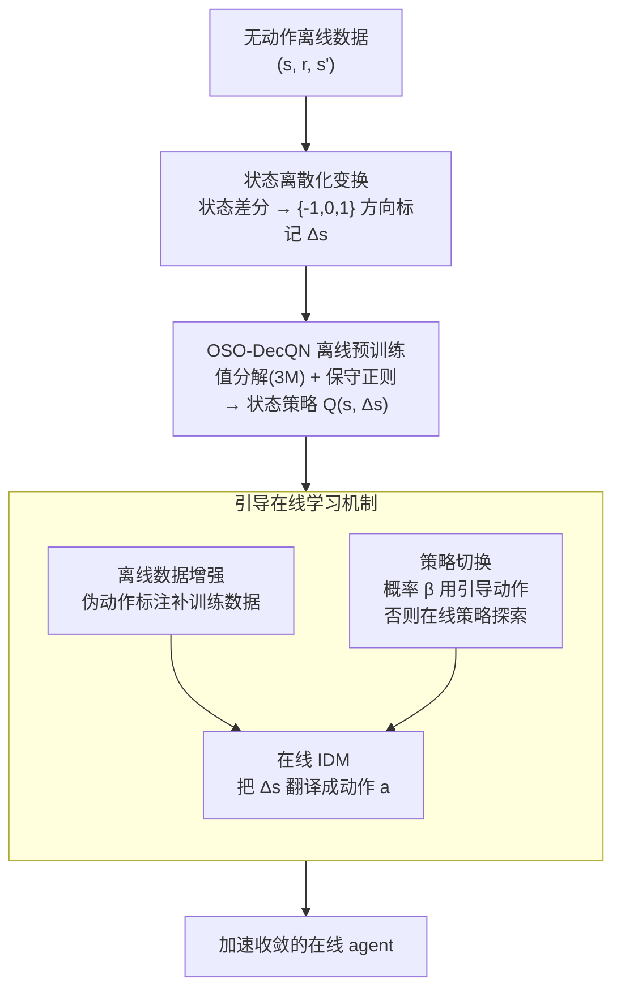

# Action-Free Offline-to-Online RL via Discretised State Policies

**会议**: ICLR 2026  
**arXiv**: [2602.00629](https://arxiv.org/abs/2602.00629)  
**代码**: 有（补充材料提供）  
**领域**: AI安全  
**关键词**: 无动作离线RL, 状态策略, 状态离散化, DecQN, 引导在线学习

## 一句话总结

首次形式化"无动作离线到在线RL"设定，提出OSO-DecQN算法：通过将连续状态差分离散化为{-1, 0, 1}三类标记，在仅含(s, r, s')元组的数据上预训练状态策略（预测期望的下一状态变化方向而非动作），再通过策略切换机制+在线训练的逆动力学模型将状态策略转化为可执行动作，引导在线agent加速学习，在D4RL和DeepMind Control Suite上（含78维状态空间）一致提升收敛速度和渐近性能。

## 研究背景与动机

**领域现状**：离线RL已能从静态数据集学习策略，但几乎所有方法都假设数据集包含完整的动作标签$(s, a, r, s')$。

**现有痛点**：大量实际场景中动作信息天然缺失——医疗记录中治疗决策因隐私被剔除、金融交易中具体操作因专有策略保护被隐去、机器人传感器日志中控制信号因存储限制未被记录。这类仅含$(s, r, s')$的数据广泛存在却无法被标准离线RL利用。

**已有尝试的局限**：(1) Edwards et al. (2020)和Hepburn et al. (2024)的$Q_{SS'}$方法虽然估计状态转移的价值，但训练时仍依赖动作标签；(2) Zhu et al. (2023)用Decision Transformer学习无动作状态策略，但计算成本高、在线引导效果不稳定且未在多样化环境中验证；(3) Seyde et al. (2022)的动作离散化策略依赖有界动作范围，不适用于无动作数据集。**没有现有方法同时满足：无动作离线数据学习 + 高维可扩展 + 有效引导在线学习。**

**核心矛盾**：无动作数据无法直接用于任何基于值或基于策略的标准RL算法。直接在连续空间回归预测下一状态会导致不稳定和过拟合。

**核心 idea**：不学"做什么动作"而学"状态应往哪变"——将连续状态差分离散化为方向性标记{-1, 0, 1}，把不适定的连续回归问题转化为结构化的分类问题，既绕过了动作空间又保留了足够的决策信息。

## 方法详解

### 整体框架

整篇要解决的是一个看似无解的问题：手里只有$(s, r, s')$却没有动作标签，怎么把它当成离线RL数据用起来？OSO-DecQN的回答是绕开"预测动作"，改去"预测状态该往哪个方向变"，再到在线阶段才把方向翻译成动作。整条流水线分两段：先是**离线预训练**，把无动作数据的状态差分离散化成方向标记后，学一个状态策略$Q(s, \Delta s)$，其中$\Delta s \in \{-1, 0, 1\}^M$记录每个状态维度期望的离散变化方向；然后是**引导在线学习**，用这个预训练好的状态策略，通过策略切换加一个在线训练的逆动力学模型(IDM)把$\Delta s$翻译成可执行动作，去加速在线agent的收敛。

### 关键设计

**1. 状态离散化变换：把不适定的连续回归改写成结构化分类**

最直接的想法是直接回归预测$s'$或状态差分$s'-s$，但这条路实验里几乎不可行——连续回归预测得到的策略性能接近随机。问题出在连续目标上回归既不稳定又容易过拟合，决策信息被噪声淹没。这里的做法是先对状态差分做z-score标准化，再用一个阈值$\epsilon$把每一维映射成三个方向标记（减小/不变/增大）：

$$\delta_i^\epsilon(s,s') = \begin{cases} -1 & s'_i - s_i < -\epsilon \\ 1 & s'_i - s_i > \epsilon \\ 0 & \text{otherwise} \end{cases}$$

这样一来连续预测就变成了离散分类，既保留了"往哪走"的决策信息，又把回归的不稳定性消掉了。z-score标准化带来尺度不变性，不用逐维度去调阈值；离散化本身也有可控的理论代价——$k$-bin离散化引入的值函数误差是$O(H\sqrt{M}/k)$，随bin数增加而递减，所以粗离散并不会埋下系统性偏差。

**2. OSO-DecQN离线预训练：用值分解把$3^M$的组合空间压成线性**

离散后每个维度三选一，$M$维状态联合起来就是$3^M$的组合爆炸，直接学一个联合Q值不可行。这里借用DecQN的值分解思路，但把它从原本的动作维度迁到了状态差分维度——总Q值写成各维度效用分支的均值：

$$Q_\theta(s, \Delta s) = \frac{1}{M}\sum_{j=1}^M U^j_{\theta_j}(s, \Delta s_j)$$

每个状态维度独立维护一个效用分支$U^j$，于是复杂度从指数级的$3^M$降到线性的$3M$，这正是方法能扩展到78维状态空间的关键。训练上再叠加集成变体和双Q学习来压住方差。离线设定还要额外防过估计，这里加了一项保守正则：

$$R_\theta = \sum_{(s,\Delta s)\sim D} \log \| \exp(Q_\theta(s, \cdot)) \|_1 - Q_\theta(s, \Delta s)$$

它等价于离散设定下的CQL惩罚，一举解决两件事：压低数据外动作的过估计偏差，同时把策略约束在数据可达的状态转移上。消融里去掉这一项后所有任务几乎全线失败，说明它是离线阶段能跑起来的必要条件而非锦上添花。

**3. 引导在线学习机制：把离线状态策略的知识翻译给在线agent**

状态策略只会输出方向$\Delta s$，环境却只接受动作，二者之间需要一座桥。这里用三个配合的机制把离线知识迁到在线：一是**策略切换**，以概率$\beta$采用离线引导动作$a = I_\phi(s, \arg\max_{\Delta s} Q(s, \Delta s))$，否则交给在线策略$\pi_{on}(s)$去探索，让引导和自主探索按比例交替；二是**在线IDM训练**，用在线采集的$(s, a, s')$以L1损失训练一个轻量逆动力学模型$I_\phi$，专门负责把$\Delta s$映射回动作；三是**离线数据增强**，对离线样本用当前在线策略$\pi_{on}(s_{off})$标注伪动作，给IDM补充训练数据。IDM被刻意保持简单（固定架构跨所有环境），这样性能提升才能归因于状态策略本身的质量，而不是翻译器变强。

### 损失函数 / 训练策略

- **离线阶段**：$\theta \leftarrow \arg\min_\theta \sum (y_1 - Q_\theta(s, \Delta s))^2 + \alpha R_\theta$，其中$y_1 = r + \gamma \bar{Q}_\theta(s', \Delta s')$，$\Delta s'$按$Q_\theta(s', \cdot)$的softmax采样
- **IDM训练**：$L(\phi) = \|a_{on,off} - I_\phi(s, \Delta s_{off})\|_1 + \|a - I_\phi(s, \Delta s)\|_1$，L1损失因近似中位数而对离群值更鲁棒

## 实验关键数据

### 主实验：离线预训练性能（Table 1精选）

OSO-DecQN在D4RL和DeepMind Control Suite上与多种基线的归一化平均回报对比（5种子×10回合均值±标准误）：

| 数据集 | BC(有动作) | BC $s'$ | BC $s'-s$ | BC $\Delta s$ | DecQN_N(无正则化) | **OSO-DecQN** |
|--------|-----------|---------|-----------|--------------|-------------------|---------------|
| Hopper-medium-replay | 26.6 | 5.8 | 4.9 | 29.2±3.7 | 7.7±1.3 | **65.7±2.6** |
| Hopper-expert | 110.6 | 2.2 | 9.9 | 106.9±2.4 | 1.9±0.45 | **111.6±0.08** |
| HalfCheetah-medium-expert | 60.1 | -0.25 | -0.25 | 54.7±3.9 | -1.6±0.13 | **87.8±2.7** |
| Walker2d-medium-replay | 23.5 | 6.4 | -0.32 | 37.5±6.1 | -0.41±0.26 | **84.8±2.2** |
| Walker2d-medium-expert | 107.7 | 2.3 | -0.71 | 84.4±3.4 | -0.24±0.06 | **108.8±0.13** |
| Cheetah-Run-medium-expert | 61.6 | 1.7 | 1.7 | 48.0±3.4 | 1.2±0.32 | **90.0±3.8** |
| Quadruped-Walk-expert (78维) | 97.7 | 6.6 | 6.6 | 96.7±6.4 | 0.1±0.04 | **100.7±1.2** |

**关键观察**：(1)连续回归方法(BC $s'$, BC $s'-s$)在多数任务上性能接近0甚至为负；(2)离散化后的BC $\Delta s$已接近有动作BC水平；(3)OSO-DecQN通过RL进一步大幅超越模仿学习，尤其在medium-replay和medium-expert等混合质量数据集上优势明显；(4)无正则化的DecQN_N几乎完全失效。

### 引导在线学习实验

在1M步在线学习中，OSO-DecQN引导的TD3/DecQN_N vs 无引导基线：

| 环境 | 状态维度 | 动作维度 | 在线基线 | OSO-DecQN引导效果 |
|------|---------|---------|---------|-------------------|
| HalfCheetah | 17 | 6 | TD3 | 收敛速度和渐近性能均显著提升 |
| Walker2D | 17 | 6 | TD3 | 早期加速明显，渐近性能提升 |
| Hopper | 11 | 3 | TD3 | 改善较小（任务本身简单） |
| Quadruped-Walk | 78 | 12 | DecQN_N | 早期阶段持续改善，验证高维可扩展性 |
| Cheetah-Run | 17 | 6 | DecQN_N | 收敛速度和最终性能均提升 |

与Zhu et al. (2023)的AF-Guide对比：AF-Guide在全部三个D4RL环境上均**低于**无预训练的TD3基线，而OSO-DecQN在所有环境上均**高于**基线。

### 消融实验

| 消融项 | 结果 | 结论 |
|--------|------|------|
| 去掉离散化（用$s'$或$s'-s$） | 归一化回报骤降至接近随机策略水平 | 离散化是核心，连续回归完全不可行 |
| 去掉正则化（DecQN_N） | 所有任务几乎完全失败（回报约0） | 正则化防止过估计+确保状态可达性 |
| $\epsilon$阈值敏感性 | 在较宽范围内性能稳定 | 方法对$\epsilon$不敏感 |
| 2-bin vs 3-bin离散化 | 性能相近 | 粗离散化即足够有效 |
| IDM架构/批量大小变化 | 性能基本不变 | 改善来自状态策略而非IDM |
| $\beta$引导比例敏感性 | 合理范围内均有改善 | 超参鲁棒 |
| TD3 → SAC作为在线agent | 同样有效 | 方法与具体在线算法解耦 |

### 关键发现

- **连续回归彻底失败**：BC $s'$和BC $s'-s$的离散差分预测误差接近随机策略水平（如Walker2d中误差约16-17，随机策略为17），证实连续预测不可行
- **离散化信息损失极小**：BC $\Delta s$已能匹配有动作BC的性能，OSO-DecQN通过RL进一步显著超越
- **正则化是必要条件**：无正则化版本不仅回报接近零，状态预测误差也飙升至随机水平，同时遭受过估计偏差和状态不可达两重问题
- **首次在78维状态空间上验证无动作离线到在线RL的有效性**（Quadruped-Walk）

## 亮点与洞察

- **问题形式化的价值**：首次将"无动作离线到在线RL"定义为独立研究问题并给出完整框架，为医疗、金融等动作缺失场景的RL应用开辟了新路径
- **"方向标记"的精妙设计**：将状态差分离散化为{-1, 0, 1}看似简单粗暴，但恰好在"信息保留"和"预测稳定性"之间找到了最佳平衡点——理论上有可控误差界，实践中匹配甚至超越有动作基线
- **跨域迁移的架构设计**：DecQN值分解从多智能体RL迁移到状态空间分解，CQL正则化从动作约束迁移到状态可达性约束，两个跨域借鉴都非常自然
- **消融实验的说服力极强**：Table 1和Table 2从回报和预测误差两个互补角度完整证明了离散化和正则化的必要性，逻辑链闭合

## 局限与展望

- **离散化粒度固定为3-bin {-1,0,1}**：虽然理论证明更细粒度可降低误差，但未实验探索自适应离散化（如Growing Q-Networks的渐进式方法）
- **IDM假设了状态到动作的局部光滑逆映射**：在强不连续动力学或高度多模态逆映射场景下，简单IDM可能失效
- **未扩展到视觉观测**：所有实验基于向量化状态，image-based环境需要额外的编码器和奖励提取机制
- **理论分析局限于离散化误差界**：缺少整个框架（预训练+引导在线学习）的端到端收敛性保证
- **引导比例$\beta$为固定超参**：未探索基于在线agent学习进度的自适应衰减策略
- 改进方向：(1)结合Farebrother et al. (2024)的分类式值函数替代回归；(2)自适应离散化；(3)更强的IDM架构用于复杂动力学环境；(4)视觉RL扩展

## 相关工作与启发

- **vs QSS' (Edwards et al., 2020; Hepburn et al., 2024)**：同样估计状态转移价值，但训练时仍需动作标签。本文完全移除动作依赖
- **vs AF-Guide (Zhu et al., 2023)**：唯一的直接竞争者，用Decision Transformer学习无动作状态策略+奖励塑形引导在线学习，但计算昂贵且实验显示其在线引导甚至不如不引导的TD3基线
- **vs DecQN (Seyde et al., 2022)**：原始DecQN用于连续动作离散化，OSO-DecQN将相同的值分解思想从动作空间迁移到状态差分空间，并添加保守正则化适配离线设定
- **启发**：(1)状态策略的概念可泛化——任何能预测期望状态转移方向的信号都可作为在线学习的引导；(2)离散化作为稳定化手段可应用于其他连续预测不稳定的RL场景

## 评分

- 新颖性: ⭐⭐⭐⭐ 问题形式化有开创性，状态离散化解法设计精巧
- 实验充分度: ⭐⭐⭐⭐⭐ 5个环境×4种数据集质量，消融极为完整，每个设计决策都有充分验证
- 写作质量: ⭐⭐⭐⭐ 结构清晰，分析深入，why-discretisation和why-regularisation的分析章节尤为出色
- 价值: ⭐⭐⭐⭐ 为动作缺失场景的RL开辟了实用路径，但应用验证仍停留在模拟环境

<!-- RELATED:START -->

## 相关论文

- [\[ICLR 2026\] LingoLoop Attack: Trapping MLLMs via Linguistic Context and State Entrapment into Endless Loops](lingoloop_attack_trapping_mllms_via_linguistic_context_and_state_entrapment_into.md)
- [\[ICLR 2026\] TrojanTO: Action-Level Backdoor Attacks Against Trajectory Optimization Models](trojanto_action-level_backdoor_attacks_against_trajectory_optimization_models.md)
- [\[ICLR 2026\] Sample-Efficient Distributionally Robust Multi-Agent Reinforcement Learning via Online Interaction](sample-efficient_distributionally_robust_multi-agent_reinforcement_learning_via_.md)
- [\[ICML 2026\] Alignment Risks from Capability-Seeking RL Training](../../ICML2026/ai_safety/alignment_risks_from_capability-seeking_rl_training.md)
- [\[ICLR 2026\] FERD: Fairness-Enhanced Data-Free Adversarial Robustness Distillation](ferd_fairness-enhanced_data-free_adversarial_robustness_distillation.md)

<!-- RELATED:END -->
