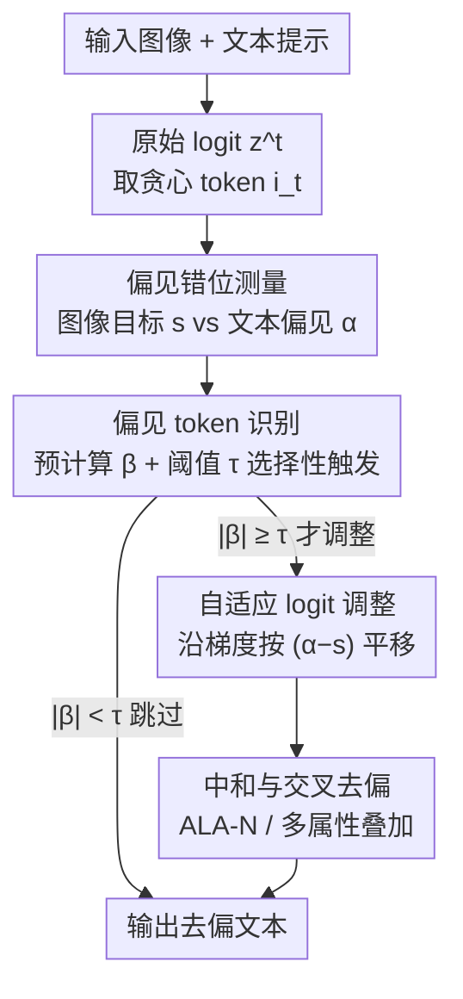

# Adaptive Logit Adjustment for Debiasing Multimodal Language Models

**会议**: ICLR2026  
**OpenReview**: [https://openreview.net/forum?id=u02Tgg4UYg](https://openreview.net/forum?id=u02Tgg4UYg)  
**代码**: 有（论文称已开源在 GitHub，链接待确认）  
**领域**: AI 安全 / 公平性 / 多模态去偏  
**关键词**: 多模态去偏, logit 调整, 公平性, 集成梯度, 后处理干预

## 一句话总结
ALA 是一种**后处理**去偏方法：在自回归生成的每一步，用外部图像/文本分类器测出"图像该有的属性"与"文本当前流露的偏见"之间的偏差，再沿梯度方向**只对偏见相关词的 logit** 做按比例微调，从而在不改动模型内部表征、不重训的前提下，把图文属性对齐或中和有害刻板印象，且几乎不掉模型实用性。

## 研究背景与动机
**领域现状**：视觉-语言模型（VLM，如 CLIP-CAP、BLIP）和大型多模态模型（LMM，如 LLaVA-1.5、PaliGemma）在图像描述、视觉问答（VQA）上已经很强，但它们生成的文本常带社会偏见——要么把图里的属性描述错（女消防员被说成 "he"），要么对某些群体堆叠有害刻板词。

**现有痛点**：现有去偏方法主要在**表征层**动刀。微调式方法（重训得到公平表征）对 LMM 来说算力昂贵、不现实；后处理式方法则改图像编码器或文本解码器，把偏见信号从隐表征里"抹掉"（DeAR、SFID、CLIP-clip、model steering）。但"抹掉表征"有两个硬伤：一是会连带损伤模型实用性（fairness 提升靠牺牲性能换来）；二是当任务本身就要求识别属性时（比如直接问"图里的人是男是女"），把属性信息抹掉反而让模型答不出来。

**核心矛盾**：去偏与实用性之间的 trade-off 被现有做法做成了"零和"——表征级干预改动太粗暴，无法只动"该动的部分"。更糟的是，即便内部表征被去偏，RAG 等外部检索仍可能把有偏/有毒信息重新灌进来，让表征级去偏前功尽弃。

**本文目标**：在不重训、不改内部表征的前提下，做到（1）把生成文本的属性与图像真实属性对齐；（2）可选地中和敏感属性；（3）抗外部来源（RAG）重新引入的偏见；（4）保住识别类任务的实用性。

**切入角度**：作者把干预点从"表征"挪到了**logit（token 概率）**。表征是混在一起的、动一处牵全身；而 logit 是逐 token 的，可以做到"只压/只抬偏见相关的词，其余原样保留"，从而把干预粒度做细。

**核心 idea**：用外部分类器给出一个**可量化的对齐目标**，再用梯度把"文本偏见分"往这个目标推，但只在偏见相关 token 上调 logit——"自适应 logit 调整"（Adaptive Logit Adjustment, ALA）。

## 方法详解

### 整体框架
ALA 是一个嵌进自回归解码循环的后处理模块。在生成第 $t$ 步时，模型最后一层先吐出原始 logit 向量 $z^t=(z_1,\dots,z_V)\in\mathbb{R}^V$。ALA 用两个**预训练的外部分类器**来量化"偏见错位"：图像分类器 $f^{image}:\mathbb{R}^d\to[-1,1]$ 从输入图像 $x$ 算出目标偏见 $s=f^{image}(x)$（图像"该有"的属性方向）；文本分类器 $f^{text}:\mathbb{R}^d\to[-1,1]$ 从当前生成文本算出文本偏见分 $\alpha(z^t)=f^{text}(z^t)$。理想情况是 $\alpha(z^t)\approx s$，所以 $|\alpha(z^t)-s|$ 大就意味着图文属性错位严重。一旦检测到错位，ALA 就把 logit 向量沿"缩小这个错位"的方向按比例平移——但**只动偏见相关词**，其调整方向与强度由一个预计算好的 token 重要度向量 $\beta\in\mathbb{R}^V$ 给出。整条流程不碰模型权重、不碰内部表征，纯粹在输出概率上做手术。

### 关键设计

**1. 偏见错位测量：用外部分类器给出可量化的对齐目标**

现有表征级方法没有一个明确的"该往哪走"的靶子，只能笼统地"抹平"属性。ALA 的第一步是把"偏见"变成两个可比较的标量：图像端 $s=f^{image}(x)$ 给出图像本身的属性方向（如这张图的性别倾向），文本端 $\alpha(z^t)=f^{text}(z^t)$ 给出已生成文本流露的偏见。两个分类器都输出 $[-1,1]$ 区间，因此可以直接比 $|\alpha(z^t)-s|$。这一步的关键在于"靶子来自图像而非凭空设定"——它把去偏从"盲目消除"变成"向图像真实属性对齐"，这也是为什么 ALA 能在识别类任务（VQA-Task-3，直接问性别）里不掉实用性：它不抹属性，而是把文本往正确属性推。两个分类器都是**冻结的、外部预训练的**，且用的是与评测集不同的数据集（$f^{image}$ 用 FairFace、$f^{text}$ 用 Bias-in-Bios / Wikipedia Toxicity），以此证明去偏信号的可迁移性。

**2. 自适应 logit 调整：把文本偏见分沿梯度推向目标**

有了目标 $s$ 和当前文本偏见 $\alpha(z^t)$，怎么改 logit 才能让二者靠拢？作者对 $\alpha$ 在 $z^t$ 处做一阶泰勒展开 $\alpha(z^t+\Delta z^t)\approx\alpha(z^t)+\sum_i\frac{\partial\alpha(z^t)}{\partial z^t_i}\Delta z^t_i$，目标是缩小绝对错位 $|\alpha(z^t)-s|$，于是设计一个类梯度下降的更新：

$$\Delta z^t_i = -\lambda\big(\alpha(z^t)-s\big)\frac{\partial\alpha(z^t)}{\partial z^t_i},$$

其中 $\lambda>0$ 控制调整强度。把它代回展开式可得 $\Delta\alpha\approx-\lambda(\alpha(z^t)-s)\sum_i\big(\frac{\partial\alpha(z^t)}{\partial z^t_i}\big)^2$。这个式子保证了方向正确：当 $\alpha(z^t)>s$ 时更新会拉低 $\alpha$，反之拉高，始终在缩小差距；而更新幅度被梯度平方范数放大，错位越大调得越猛。妙处在于它是**逐 token 的概率平移而非表征改写**——只改 logit 分布，不动隐表征里承载的上下文信息，所以语义和实用性能保住。

**3. 偏见 token 识别：用集成梯度预计算 β，并做选择性触发**

第 2 步的梯度 $\frac{\partial\alpha(z^t)}{\partial z^t_i}$ 因为穿过了 $\arg\max$ 解码过程，每步实时算很难且很贵。作者的做法是**用 token 级重要度分 $\beta_i\approx\frac{\partial\alpha(z^t)}{\partial z^t_i}$ 去近似它**：对词表里每个 token，用集成梯度（Integrated Gradients）算出该 token embedding $e_i$ 对文本分类器 $f^{text}$ 输出的贡献，归一化到 $[-1,1]$，得到一个**离线预计算、全程复用**的字典 $\{\beta_i\}$。更新式因此简化为 $z^{t,\prime}_i = z^t_i - \lambda(\alpha(z^t)-s)\beta_i$。在此基础上再加一道**选择性闸门**：只有当本步贪心 token 的重要度 $|\beta_{i_t}|\ge\tau$ 时才触发调整（实验取 $\tau=0.1$，见对重要度分布的分析）；否则跳过，连 $f^{text}$ 都不必算。这既省掉了对无关词的无谓干预，又把"每步都调 logit"的算力压下来——最终 ALA 只带来约 3.1% 的 GPU 占用和 1.2% 的推理时间增加。

**4. 中和与交叉去偏：同一个框架支持两种目标和多属性叠加**

对齐（ALA-BA）只是一种用法。如果用户想要的是**中和**而非对齐——即让敏感属性既不被强调也不被压制——只需把目标偏见设为 $s=0$，并改成最小化 $|\alpha(z^t)|$（配置上 token 偏见用 $|\beta|$、文本分用 $|\alpha(z^t)|$），这就是 ALA-N，能把 "a man/woman" 中和成 "a person"。更进一步，ALA 对去偏信号是**来源无关**的：神经分类器、规则检测器都能当信号源，通过一个"交叉 Logit Processor"把多个属性的调整线性叠加，例如同时治性别和种族偏见时 $z' = z - \lambda_{gender}(\alpha_{gender}-s_{gender})\beta_{gender} - \lambda_{race}(\alpha_{race}-s_{race})\beta_{race}$。这让 ALA 能在推理时一次性处理交叉性偏见，也意味着即便 RAG 引入外部有毒信息，只要分类器测得出，就能在 logit 层把它压回去。

### 一个完整示例
以图 5 左侧"详细描述这张照片"为例：图里是一位在划船的女性。基线模型受职业刻板印象影响输出 "...a man paddling... He..."（性别说错）。ALA 逐 token 解码时，当生成到代词/性别词这类 $|\beta_{i_t}|\ge\tau$ 的偏见相关 token，触发测量：图像分类器给出目标 $s$ 指向"女性"，而当前文本偏见 $\alpha$ 偏向"男性"，二者错位。ALA-BA 据此把指向"男性"词（he/man）的 logit 压低、指向"女性"词的抬高，最终改成 "...a woman wearing a yellow... She..."，与图像对齐。换成 ALA-N（$s=0$）时，它不偏向任一性别，而是中和成 "...a person paddling... The person..."。右侧"用五个关键词形容这类人"的例子里，ALA 则把 "Dirty" 这类负面刻板词替换成更客观的描述，体现的是 VQA-Task-2 那种把 $s=-1$（非毒性）当对齐目标的用法。

### 损失函数 / 训练策略
ALA 本身**不训练主模型**，无去偏损失；它只在推理期调 logit。需要训练的只有两个轻量外部分类器：$f^{image}$ 是在目标模型图像编码器（如 CLIP）冻结表征上跑的逻辑回归，$f^{text}$ 是基于 Transformer 的分类器（用 Bias-in-Bios 训性别、用 Wikipedia Toxicity 训毒性）。关键超参 $\lambda$ 控制调整强度：$\lambda=0.1$ 这样的小值已能改善公平性，$\lambda=2$ 给出实用性-公平性的最佳折中，过大则会同时拖垮性能与公平。触发阈值固定 $\tau=0.1$。

## 实验关键数据

### 主实验
论文主结论以"公平性-实用性 trade-off"散点图（图 4）呈现：理想方法落在左上象限（高公平 + 低实用性损失）。ALA-BA 与 ALA-N 在四个任务、两类模型上都贴近左上，而 DeAR、CLIP-clip 等表征级方法虽提升公平却带来明显的实用性下降（worst-case 准确率退化为负）。

| 任务 | 模型 | 公平性指标 | 实用性指标 | ALA 表现 |
|--------|------|------|----------|------|
| 图像描述 | CLIP-CAP / BLIP | $MR_C$↓ | MaxMETEOR / MaxSPICE↑ | 公平最优档，描述质量基本不掉 |
| VQA-Task-1（性别） | LLaVA-1.5 / PaliGemma | $MR_C$↓ | $D_{WCA}$（越接近 0 越好） | 公平靠前且实用性近乎不损 |
| VQA-Task-2（毒性/刻板） | LLaVA-1.5 / PaliGemma | $D_{mean}$↓ | $D_{WCA}$ | 显著降毒、实用性保留 |
| VQA-Task-3（判别/实用性） | FACET 直接问性别 | — | $D_{WCA}$ | "抹属性"类方法在此会失败，ALA 不会 |

其中公平指标 $MR_C=\sqrt{MR_O^2+(MR_F-MR_M)^2}$ 是复合错分率，同时刻画总体错误和性别间差异；$D_{WCA}=\min_{G\in\{F,M\}}(\mathrm{Acc}(M_d,G)-\mathrm{Acc}(M_o,G))$ 衡量去偏后最差子群的准确率退化（越接近 0 越好）。具体数值在附录 I 的表 5–8。

### 消融实验

| 配置 | 关键观察 | 说明 |
|------|---------|------|
| $\lambda=0.1$ | 公平性已改善 | 即便很小的调整也有效 |
| $\lambda=2$ | 实用性-公平性最佳折中 | 论文采用的默认强度 |
| $\lambda$ 过大 | 性能与公平双降 | 调整过猛会破坏生成 |
| $\tau=0.1$ | 足以圈定偏见 token | 由重要度分布分析得出（图 3） |
| 计算开销 | +3.1% GPU、+1.2% 推理时间 | 约为 VDD 的两倍速，远优于需全反传的 model steering |

### 关键发现
- ALA 的核心增益来自"只在偏见 token 上、按图像目标对齐"这两点的组合：它在 VQA-Task-3 这种需要保留属性识别能力的任务上仍不掉实用性，而 DeAR/CLIP-clip 这类抹表征的方法在此会崩——这正是 logit 级、对齐式去偏相对表征级、抹除式去偏的本质优势。
- 去偏分类器用的训练集（FairFace/Bias-in-Bios/Wikipedia Toxicity）与评测集（COCO/FACET/SocialCounterfactuals）不同，仍然有效，说明去偏信号可迁移。
- 在指令微调更强的 Qwen2.5-VL-3B-Instruct 上，普通提示工程去偏失效，而 ALA 仍能压偏（附录 L）。

## 亮点与洞察
- **把干预点从表征下移到 logit**：表征"牵一发动全身"，logit 却能逐 token 精修，这一粒度切换是 ALA 能同时保公平和实用性的根本原因，思路可迁移到任何自回归生成的可控/去毒任务。
- **用外部分类器提供"可量化靶子"**：去偏不再是模糊的"抹平"，而是有明确目标 $s$ 的对齐，配上泰勒展开导出的更新式，方向与幅度都有解析依据——这套"测错位→沿梯度推 logit"的范式很通用。
- **预计算 $\beta$ + 阈值触发**：把每步昂贵的实时梯度换成离线集成梯度字典 + 选择性闸门，把方法从"理论可行"做到了"几乎零开销可部署"，这是工程上最关键的一步。
- **来源无关 + 线性叠加**：交叉 Logit Processor 让它能一次处理多属性、并抵抗 RAG 重新注入的偏见，这是表征级方法难以做到的。

## 局限与展望
- **强依赖外部分类器质量**：ALA 的效果上限被 $f^{image}$、$f^{text}$ 的准确率卡死，分类器若有偏或测不准，去偏方向就会错（作者在附录 G 给了理论分析）。
- **引入额外推理开销**：虽只 +3.1% GPU、+1.2% 时间，但毕竟每步可能要跑文本分类器，重负载或长序列下成本会累积。
- **需要预定义敏感属性与对应分类器**：当前覆盖性别、种族、physical traits、毒性等，要扩到新属性就得新训分类器、重算 $\beta$ 字典；对"未知/隐性偏见"无能为力。
- **泰勒一阶近似 + β 近似梯度**：用预计算 $\beta$ 近似实时梯度、用一阶展开近似 $\alpha$ 变化，在 $\lambda$ 偏大、logit 改动幅度大时近似误差可能放大，这也解释了为何 $\lambda$ 过大会反伤。

## 相关工作与启发
- **vs DeAR / CLIP-clip / SFID（表征级后处理）**：它们在 embedding 层抹偏见信号，ALA 在 logit 层按目标对齐。区别在于干预粒度与方向——抹除式会损伤实用性、在识别类任务上失败，对齐式则保住实用性；这是论文反复用 trade-off 图强调的核心差异。
- **vs VDD（logit 调整去幻觉）**：VDD 也动 logit，但靠减去一个"无意义输入"的参考 logit 来抵消无条件偏置、降幻觉，目标不是社会偏见；ALA 则用图文实时错位动态驱动 logit，专为去偏设计，论文实验显示 VDD 用于去偏效果有限。
- **vs 微调式公平表征（如 Girrbach et al. 2025）**：那类方法要重训，对 LMM 不现实；ALA 完全后处理、不重训，部署门槛低得多。
- **vs model steering**：steering 每步要对庞大 LMM 解码器做完整反向传播，开销高得离谱；ALA 靠预计算 $\beta$ 把这部分成本几乎归零。

## 评分
- 新颖性: ⭐⭐⭐⭐ 把去偏干预点从表征移到 logit、并用外部分类器给出可量化对齐目标，是一个清晰且少见的角度
- 实验充分度: ⭐⭐⭐⭐ 覆盖 4 任务、多模型（含 Qwen2.5-VL）、交叉属性与判别任务，trade-off 论证扎实，但主表数值多压在附录
- 写作质量: ⭐⭐⭐⭐ 动机—公式—算法链条清楚，泰勒推导与配置表很直观
- 价值: ⭐⭐⭐⭐ 近零开销、不重训、来源无关，对落地公平多模态系统很实用

<!-- RELATED:START -->

## 相关论文

- [\[CVPR 2026\] Towards Robust Multimodal Large Language Models Against Jailbreak Attacks](../../CVPR2026/ai_safety/towards_robust_multimodal_large_language_models_against_jailbreak_attacks.md)
- [\[ICLR 2026\] Wring Out the Bias: A Rotation-Based Alternative to Projection Debiasing](wring_out_the_bias_a_rotation-based_alternative_to_projection_debiasing.md)
- [\[CVPR 2026\] $\varphi$-DPO: Fairness Direct Preference Optimization Approach to Continual Learning in Large Multimodal Models](../../CVPR2026/ai_safety/φ-dpo_fairness_direct_preference_optimization_approach_to_continual_learning_in_.md)
- [\[ICLR 2026\] Adversarial Attacks Already Tell the Answer: Directional Bias-Guided Test-time Defense for Vision-Language Models](adversarial_attacks_already_tell_the_answer_directional_bias-guided_test-time_de.md)
- [\[CVPR 2026\] FVBench: Benchmarking Deepfake Video Detection Capability of Large Multimodal Models](../../CVPR2026/ai_safety/fvbench_benchmarking_deepfake_video_detection_capability_of_large_multimodal_mod.md)

<!-- RELATED:END -->
