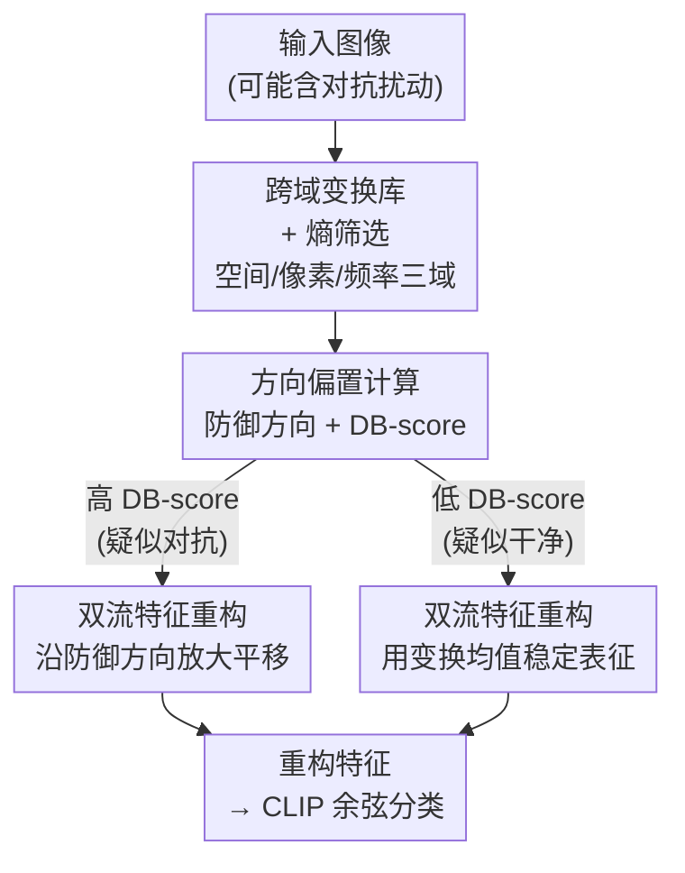

# Adversarial Attacks Already Tell the Answer: Directional Bias-Guided Test-time Defense for Vision-Language Models

**会议**: ICLR2026  
**OpenReview**: [https://openreview.net/forum?id=UqC2oFRRyc](https://openreview.net/forum?id=UqC2oFRRyc)  
**代码**: https://github.com/liuls2002/DBD  
**领域**: AI 安全 / 对抗鲁棒性 / 视觉-语言模型 / 测试时防御  
**关键词**: 对抗防御, CLIP, 测试时防御, 方向偏置, 特征重构

## 一句话总结
作者发现对抗样本在 CLIP 特征空间里经过多种图像变换后会沿一个"主方向"集体偏移（而干净样本是发散的），这个方向恰好指回正确类别中心，于是提出无需训练的测试时防御 DBD：估计"防御方向"并用基于 DB-score 的双流特征重构修复表征，在 15 个数据集上不仅刷新对抗鲁棒性 SOTA，还出现"对抗准确率反超干净准确率"的反直觉现象。

## 研究背景与动机

**领域现状**：以 CLIP 为代表的视觉-语言模型（VLM）凭借大规模图文预训练具备强大的零样本泛化能力，但对人眼难以察觉的对抗扰动极其脆弱——一点扰动就能让分类全错，这在安全敏感场景里是致命隐患。提升鲁棒性的主流路线是对抗训练（Adversarial Fine-Tuning、Adversarial Prompt Tuning），但它们都需要任务相关的标注数据、训练昂贵，而且在有限数据上优化往往削弱零样本迁移能力。

**现有痛点**：为绕开训练成本，近期兴起"测试时防御"，分两类：(1) 基于提示（prompt-based，如 R-TPT、TAPT）为每个样本自适应调整文本提示，效果不错但推理延迟大幅上升；(2) 基于变换（transformation-based，如反击扰动 TTC、高斯噪声注入 AOM）直接改输入图像，简单高效，但常常牺牲干净图像的性能，且对模型架构敏感（TTC 在 ViT-B/16 上只有 12.5% 鲁棒精度）。

**核心矛盾**：基于变换的方法虽然知道"各种变换能缓解对抗效果"，但**为什么能缓解、变换到底改变了特征空间的什么**一直没人深究，导致防御设计停留在经验试错，难以进一步突破。

**切入角度**：作者去 CLIP 的隐特征空间里看变换到底干了什么。一个关键观察：对同一张图施加多种变换，**干净图像的变换特征会发散地散布在原特征周围，而对抗图像的变换特征却一致地朝某个特定方向偏移**（图 1a，用 MDS + $1-\cos$ 相似度可视化）。这个"方向偏置"非常显著，作者据此设计了一个 DB-score 来量化这种方向集中度，发现它在干净/对抗样本上呈现清晰的双峰分布，可以直接阈值分离。

**核心 idea**：回想对抗攻击的本质是把特征推离正确类中心，那么变换特征集体偏移的这个"主方向"很可能与对抗位移**反平行**——也就是指回正确类中心。作者把这个方向称为**防御方向（Defense Direction）**，并提出"沿防御方向线性平移特征即可修复"的训练-free 防御。换言之：**对抗攻击在制造扰动时，已经把真实决策边界的方向先验偷偷编码进去了，我们只要把它读出来反着用**。

## 方法详解

### 整体框架
DBD（Directional Bias-guided Defense）是一个纯测试时、不改 CLIP 任何权重的防御框架。给定一张待分类图像（可能是对抗样本），它的处理链路是：先对图像施加一大批跨域变换并用熵筛掉低质量的变换特征 → 由这些高质量变换特征估计"防御方向"并算出 DB-score → 根据 DB-score 把样本分流到两条重构路径，得到一个更鲁棒的重构特征 → 用重构特征和文本特征做常规的 CLIP 余弦相似度分类。整套流程的输入是一张图，输出是修正后的类别预测，中间不需要任何梯度反传或参数更新。

### 关键设计

**1. 跨域变换库 + 熵筛选：用多样变换造出可靠的参考特征**

单一变换有先天缺陷——随机裁剪可能裁到背景、滤波可能糊掉关键细节，靠任何单一变换得到的特征都不可靠。DBD 因此构建了一个覆盖三个域的变换库：(1) **空间域**——随机裁剪、缩放、翻转，改变物体位置/尺寸/朝向，破坏对抗扰动赖以生效的结构化对齐；(2) **像素域**——位深压缩（量化）、JPEG 压缩-解压、加性高斯噪声，直接扭曲或覆写细粒度扰动；(3) **频率域**——高斯/均值/中值滤波，平滑高频成分以削弱对抗噪声同时保住语义。对每张输入施加 $n=31$ 个变换（连原图共 32 张）。

由于不同变换质量参差不齐，作者借鉴测试时自适应里常用的做法，用模型预测的熵作为质量度量：对第 $i$ 个变换特征算熵 $E_i = -\sum_c p_{i,c}\log p_{i,c}$，熵越低说明预测越确信、特征越干净。然后选熵最低的 $k=16$ 个变换特征 $F_{ref}=\{f_i\mid i\in I_k\}$ 进入后续计算。这一步保证了"方向"是从一批高质量参考特征里估出来的，而不是被随机的坏变换带偏。

**2. 方向偏置计算：定义防御方向并用 DB-score 量化方向集中度**

拿到 $k$ 个高质量变换特征 $\{f_i\}$ 和原特征 $f_0$ 后，先把每个变换相对原特征的位移归一化为单位方向向量 $d_i = (f_i - f_0)/\|f_i - f_0\|_2$。**防御方向**定义为平均位移的方向：

$$\bar{d} = \frac{1}{k}\sum_{i=1}^{k}(f_i - f_0), \qquad d_{def} = \frac{\bar{d}}{\|\bar{d}\|_2}$$

而 **DB-score** 衡量这些单个位移方向与防御方向的平均一致性：

$$S_{db} = \frac{1}{k}\sum_{i=1}^{k}\langle d_i, d_{def}\rangle$$

它的物理含义很直白：如果各个变换特征都朝同一方向偏（对抗样本），$S_{db}$ 就高；如果它们四散发散（干净样本），互相抵消后 $S_{db}$ 就低。实验里 $S_{db}$ 在干净/对抗上呈清晰双峰，简单设阈值 $\tau$ 就能把两类样本分开。这一步把"对抗样本方向集中、干净样本方向发散"这个现象量化成了一个可判别、可阈值的标量。

**3. 双流特征重构：按 DB-score 分流，对抗样本放大平移、干净样本稳态增强**

防御方向若与对抗位移反平行，就指回正确分类区域，那直接沿它平移特征即可修复。但变换的随机性会让估计出的防御方向不完美，对干净样本盲目平移反而有害。于是作者按 DB-score 设阈值 $\tau$ 做双流处理：

$$\hat{f} = f_0 + l\cdot d_{def}, \qquad l = \begin{cases}\|\bar{d}\|_2, & S_{db}\le\tau \\ \lambda\cdot\|\bar{d}\|_2, & S_{db}>\tau\end{cases}$$

(1) **高 DB-score 流（$S_{db}>\tau$，疑似对抗）**：方向估计可靠，沿防御方向**放大**平移（放大系数 $\lambda$），把特征更强地推回正确区域；(2) **低 DB-score 流（$S_{db}\le\tau$，疑似干净）**：方向不可靠，平移量退化为 $\|\bar{d}\|_2$，相当于直接用变换特征的均值做测试时增强（test-time augmentation）来稳定表征，而不去冒险大幅平移。位移幅度以"变换均值到原特征的距离 $\|\bar{d}\|_2$"为基准再乘 $\lambda$。最后用重构特征 $\hat{f}$ 走 CLIP 余弦分类。这套分流让 DBD 在大力修对抗样本的同时不误伤干净样本，拿到鲁棒/干净精度的最佳权衡。

### 损失函数 / 训练策略
DBD 是纯测试时方法，**没有任何训练或损失函数**，CLIP 权重全程冻结。两个关键超参 $\tau=0.8$（DB-score 阈值）和 $\lambda=2.5$（平移放大系数）从 ImageNet 验证集（5 万张）估出后固定。每张输入用 $n=31$ 个变换、熵筛选保留 $k=16$ 个。攻击设置：低强度用 PGD-10（$\epsilon=1/255$，CLIP-ResNet50），高强度用 PGD-100（$\epsilon=4/255$，CLIP-ViT-B/32 与 ViT-B/16），步长 $\alpha=\epsilon/4$。威胁模型假设攻击者能完全访问原始 CLIP 但不知道防御机制（符合"基础模型公开、防御私有部署"的现实）。

## 实验关键数据

### 主实验
在 10 个细粒度数据集 + 5 个 ImageNet-OOD 基准（共 15 个）上评测，对比 TeCoA（对抗微调）、APT（对抗提示微调，16-shot）、R-TPT（测试时提示微调，前 SOTA）、TTC（测试时输入变换）和原始 CLIP。下表为 CLIP-ViT-B/32、PGD-100（$\epsilon=4/255$）下 10 个细粒度数据集的平均结果（Acc=干净准确率，Rob=鲁棒准确率，%）：

| 方法 | 干净 Acc. | 鲁棒 Rob. | 说明 |
|------|-----------|-----------|------|
| CLIP | 63.7 | 0.0 | 零样本强但对抗全崩 |
| TeCoA | 32.8 | 11.4 | 对抗微调，干净精度大跌 |
| APT (16-shot) | 56.1 | 22.0 | 提示微调，依赖少样本数据 |
| TTC | 54.3 | 27.2 | 输入变换，对架构敏感 |
| R-TPT | 60.2 | 38.1 | 前 SOTA，保干净精度 |
| **DBD** | **64.1** | **91.3** | 干净精度反超原 CLIP，鲁棒精度碾压 |

在 CLIP-ViT-B/16 上 DBD 鲁棒精度达 93.8%，ImageNet-OOD 上更高达 97.7%——**对抗准确率反超干净准确率**。即使在不依赖真值标签的伪标签攻击设置下（用 CLIP 自身预测当伪标签引导 PGD），DBD 仍达 66.8%、逼近 67.5% 的干净精度。在 FGSM/CW/AutoAttack 及其四个分量攻击（Square/FAB/APGD-CE/APGD-DLR）下，DBD 在 ViT-B/16 上平均鲁棒精度 69.2%，远超 R-TPT 的 50.4%，且 AA 下的 69.8% 仍超过 67.5% 的平均干净精度。

### 消融实验
15 个数据集 × 3 种攻击设置平均结果（%）：

| 配置 | 干净 Acc. | 鲁棒 Rob. | 说明 |
|------|-----------|-----------|------|
| 无防御（原特征） | 60.6 | 0.0 | baseline |
| 单一变换 + 特征平移 | 24.1~55.7 | 82.4~91.2 | 防御强但伤干净精度 |
| 多变换聚合（无平移，$\lambda=1$） | 61.5 | 34.8 | 干净精度最好，防御弱 |
| 多变换 + 特征平移（无阈值） | 58.9 | 92.1 | 鲁棒大涨但牺牲部分干净精度 |
| **Full（+ DB-score 阈值双流）** | **61.2** | **91.7** | 权衡最佳 |

超参消融：平移系数 $\lambda$ 从 0（无防御）→1.0（变换均值，鲁棒 34.8%）→2.5（鲁棒 92.1%），说明"沿防御方向放大平移"才是修复关键；DB-score 阈值 $\tau=0.8$ 给出最佳总体精度。

### 关键发现
- **几何验证最有说服力**：估计出的防御方向与"干净方向"（对抗特征→对应干净特征）平均余弦相似度高达 $\approx0.95$，与"类中心方向"（对抗特征→真类中心）$\approx0.90$。这直接证明防御方向确实指回正确决策区域，不是巧合。
- **双流阈值是干净/鲁棒权衡的关键**：去掉 DB-score 阈值（统一大力平移）鲁棒最高但伤干净精度；加上阈值后用极小的鲁棒代价（91.7 vs 92.1）换回干净精度（61.2 vs 58.9）。
- **多变换聚合自带干净增强**：DBD 在干净图像上甚至略超原 CLIP（ImageNet-OOD 52.7%→55.0%），来自多样变换 + 熵筛选产出的更鲁棒特征。

## 亮点与洞察
- **"攻击已经透露了答案"这个洞察非常漂亮**：对抗扰动是用真值标签引导生成的，因此天然把真实决策边界的方向先验编码进去了；DBD 把这个被攻击者"无意泄露"的方向反着用，于是对抗样本反而比干净样本更好分类——这是全文最"啊哈"的地方。
- **DB-score 既是检测器又是开关**：同一个标量既能判别样本是否对抗（双峰分布 + 阈值），又决定重构强度，一石二鸟，设计极简。
- **纯测试时、零训练、可即插即用**：不碰 CLIP 权重、不需任何标注数据，方法可直接迁移到任意冻结的 VLM；"多变换估方向 + 沿方向平移修特征"的思路也可迁移到其他需要训练-free 防御/鲁棒推理的场景。
- **几何验证把"假设"坐实成"证据"**：很多防御论文止于刷点，本文用余弦相似度直接量化防御方向与干净方向/类中心方向的吻合度，把直觉变成可检验的几何事实。

## 局限与展望
- **威胁模型偏弱**：假设攻击者不知道防御机制（黑盒于防御）。若攻击者已知 DBD 存在并据此设计自适应攻击（比如让变换后特征故意发散来压低 DB-score），防御是否还成立，论文未充分探讨。
- **"对抗反超干净"高度依赖攻击用真值标签**：PGD 用 ground-truth 标签生成扰动，方向先验才指向真类；伪标签设置下优势已收窄到与干净精度持平（66.8 vs 67.5），更现实的无标签/迁移攻击下增益可能进一步缩水。
- **超参跨域固定的鲁棒性存疑**：$\tau=0.8$、$\lambda=2.5$ 是在 ImageNet 上估的并固定到所有数据集，跨域时方向偏置的尺度是否一致、阈值是否需要重标定，缺乏更细致的敏感性分析。
- **计算开销随变换数线性增长**：每张图要算 32 次前向（31 变换 + 原图），虽比逐样本提示微调便宜，但仍比单次推理重，论文未给端到端延迟对比。

## 相关工作与启发
- **vs R-TPT / TAPT（基于提示的测试时防御）**: 它们逐样本优化文本提示，需要多步反传、推理延迟大；DBD 完全在图像特征侧操作、无梯度反传，效率更高且鲁棒精度全面反超（如 ViT-B/16 上 93.8% vs 43.2%）。
- **vs TTC / AOM（基于变换的测试时防御）**: 它们用反击扰动或高斯噪声直接改图，知其然不知其所以然，常伤干净精度且对架构敏感（TTC 在 ViT-B/16 仅 12.5%）；DBD 先在特征空间揭示"方向偏置"机制，再据此精准重构，既保干净精度又稳定跨架构。
- **vs TeCoA / APT（对抗微调/提示微调）**: 它们需任务标注数据、训练昂贵且削弱零样本迁移；DBD 零训练、零标注，即插即用还顺带略涨干净精度。

## 评分
- 新颖性: ⭐⭐⭐⭐⭐ "对抗扰动隐含真实边界方向先验"是反直觉又被几何验证坐实的全新洞察
- 实验充分度: ⭐⭐⭐⭐⭐ 15 数据集 × 3 攻击 + 7 种攻击类型 + 伪标签 + 几何验证，覆盖扎实
- 写作质量: ⭐⭐⭐⭐ 现象→假设→方法→验证的叙事清晰，图 1/图 2 直观
- 价值: ⭐⭐⭐⭐ 训练-free、即插即用，对 VLM 安全部署有现实意义，但自适应攻击下的鲁棒性待验证

<!-- RELATED:START -->

## 相关论文

- [\[CVPR 2026\] A Provable Energy-Guided Test-Time Defense Boosting Adversarial Robustness of Large Vision-Language Models](../../CVPR2026/ai_safety/a_provable_energy-guided_test-time_defense_boosting_adversarial_robustness_of_la.md)
- [\[CVPR 2026\] TTP: Test-Time Padding for Adversarial Detection and Robust Adaptation on Vision-Language Models](../../CVPR2026/ai_safety/ttp_test-time_padding_for_adversarial_detection_and_robust_adaptation_on_vision-.md)
- [\[ICML 2026\] Towards Fine-Grained Robustness: Attention-Guided Test-Time Prompt Tuning for Vision-Language Models](../../ICML2026/ai_safety/towards_fine-grained_robustness_attention-guided_test-time_prompt_tuning_for_vis.md)
- [\[ICLR 2026\] Test-Time Poisoned Sample Detection by Exploiting Shallow Malicious Matching in Backdoored CLIP](test-time_poisoned_sample_detection_by_exploiting_shallow_malicious_matching_in_.md)
- [\[CVPR 2026\] When CLIP Sees More, It Fights Back Harder: Multi-View Guided Adaptive Counterattacks for Test-Time Adversarial Robustness](../../CVPR2026/ai_safety/when_clip_sees_more_it_fights_back_harder_multi-view_guided_adaptive_counteratta.md)

<!-- RELATED:END -->
