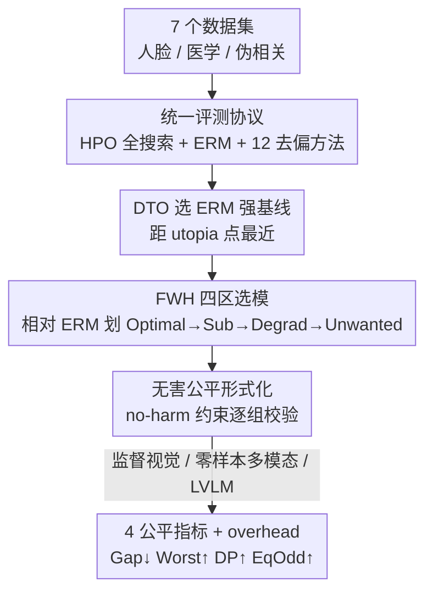

# Benchmarking Bias Mitigation Toward Fairness Without Harm from Vision to LVLMs

**会议**: ICLR 2026  
**OpenReview**: [https://openreview.net/forum?id=GLPmZhhCAE](https://openreview.net/forum?id=GLPmZhhCAE)  
**代码**: https://github.com/osu-srml/NH-Fair  
**领域**: AI 安全 / 公平性 / 多模态 VLM  
**关键词**: 公平性评测、fairness without harm、偏见缓解、LVLM、模型选择

## 一句话总结
本文提出 NH-Fair，一个覆盖经典视觉模型与大型视觉语言模型（LVLM）、统一了数据/指标/训练协议的"无害公平"评测基准，并通过两阶段选模（DTO 选 ERM 基线 + FWH 四区选缓解方法）系统证明：很多专门的去偏算法并不能稳定超过精调的 ERM，数据增强反而是最实用的无害提升路径，而单纯把模型做大并不会让模型更公平。

## 研究背景与动机
**领域现状**：机器学习模型会继承并放大训练数据中的社会偏见，于是涌现了大量公平性指标（demographic parity、equalized odds、overall accuracy parity、max-min fairness 等）和缓解方法（预处理 / 训练中 / 后处理三类）。近年又出现一支"无害公平（fairness without harm）"的工作，主张在缩小群体差距的同时不让任何一个群体的性能变差。

**现有痛点**：公平性研究的横向比较极其混乱——数据集异构、公平指标口径不一、视觉模型和多模态模型被割裂评估、超参调优普遍不充分。很多论文在固定超参、欠训基线的前提下就宣称自己"state-of-the-art"。已有基准（MEDFAIR 只覆盖医学、FFB 偏老方法且调参不足、ABCFair 只做表格数据且固定超参）都没法回答几个关键问题。

**核心矛盾**：公平干预天然和性能存在张力。以 demographic parity 为例，如果两个群体的基础正例率不同，强行让 $P[h(X)=y\mid A=a]$ 跨群体相等，就会把预测从各群体最优值 $p_0$ 拉偏，抬高整体风险，极端情况下甚至退化成"把所有群体一起拉低"的平庸分类器——这就是公平性研究里臭名昭著的"race to the bottom"。

**本文目标**：在统一协议下回答三个问题——(1) 同样充分调参后，专门的去偏方法到底能不能打过精调的 ERM？哪些训练选择对公平最关键？(2) 单纯放大模型规模能带来公平吗？(3) 在基础大模型时代，多模态/LVLM 是否已经"足够公平"？

**切入角度**：作者认为，与其继续堆公平算法，不如先建一个"tuning-aware"的公平基准，把 ERM 当成一个被认真调过的强基线，再用统一的无害准则去衡量所有方法。

**核心 idea**：用一个跨视觉与 LVLM 的统一基准 NH-Fair，配合 DTO + FWH 两阶段选模，把"在不伤害任何群体的前提下提升公平"这件事做成可复现、可公平比较的评测。

## 方法详解

### 整体框架
NH-Fair 是一个评测**流水线**而非新模型。它先在七个带人口学/伪相关标注的图像数据集上，对 ERM 和 12 种去偏方法做充分的超参搜索；然后用 DTO 准则从一堆候选 ERM 里挑出一个真正强的 ERM 基线；再用 FWH 准则把各去偏方法相对这个 ERM 基线划进四个"区"，按"无害优先"的顺序选出每个方法的代表模型；最后在监督视觉、零样本多模态匹配（CLIP/BLIP2）、LVLM 图文问答三种范式下，用统一的四个公平指标 + overhead 做对比，并额外做训练选择研究和 LVLM 规模研究。

整条流水线最核心的是"用一个被精调和精选过的 ERM 当公平性的参照系"，所有方法的好坏都相对这个参照系来判断。

### 关键设计

**1. 无害公平的问题形式化：给"公平"加一道"不许伤害任何群体"的硬约束**

传统群体公平只要求各群体指标拉平，却不管是"把弱势群体抬上来"还是"把优势群体砍下去"实现的，后者就是 race to the bottom。本文把 ERM 训出的基线分类器 $h_{\text{erm}}=\arg\min_{h}\sum_i R(h(x_i),y_i)$ 作为参照，要求公平增强后的模型在**每一个**群体上的风险都不超过基线：

$$\mathbb{E}_{X,Y\mid A=a}\big[R(h(X),Y)\big]\le \mathbb{E}_{X,Y\mid A=a}\big[R(h_{\text{erm}}(X),Y)\big],\quad \forall a\in A.$$

这条 no-harm 约束把评测重心从"差距有多小"转成"差距是怎么被缩小的"，让"靠牺牲优势群体换来的公平"无所遁形。它是后面 FWH 四区划分的理论依据。

**2. DTO 选 ERM 强基线：先把基线本身调到接近理论上限，比较才公平**

公平性论文常被诟病的一点是 ERM 基线没调好、被随便一个去偏方法"碾压"。本文反其道而行，先把 ERM 当成一等公民认真对待：在每个数据集上独立搜索优化器（SGD/Adam）、学习率、weight decay、预训练权重，得到一大堆候选 ERM 模型（图中每个绿点是一个候选在两个敏感群体上的精度坐标）。然后用 **Distance to Optimal（DTO）** 选出最强的那个——定义 utopia 点为两个群体各自达到的最高精度构成的坐标（红星），选出到 utopia 点欧氏距离最短的模型当 ERM 基线。这样得到的基线同时兼顾整体性能和群体差距，是一个"被认真选过的"参照系，而不是随手训的弱靶子。

**3. FWH 四区选模：用相对 ERM 的位置把每个去偏方法的成色一眼分清**

有了 ERM 基线，怎么判断一个去偏方法是真无害还是在偷工减料？本文按候选模型相对 ERM 的群体精度，把它们划进四个区：**Optimal（无害公平）**——两群体精度都优于 ERM，此时选 accuracy gap 最小的；**Sub-optimal（妥协式公平）**——靠压低优势群体来抬高弱势群体，Optimal 区没人时退而求其次选 gap 最小者；**Degradation（双伤式公平）**——两群体都比 ERM 差，只能选离 ERM 的 L2 距离最近者以保住基本效用，避免方法靠"全体退化成随机猜"来拉平精度；**Unwanted**——优势群体更好、弱势群体更差，加剧不公，直接弃用。选择顺序固定为 Optimal → Sub-optimal → Degradation，确保在无害前提下再谈公平。这个四区分类把抽象的"trade-off"变成了可操作、可复核的选模规则，论文还在验证集划分后到测试集上交叉核对（Match 列）。

**4. 统一评测协议：把视觉与 LVLM、监督与零样本拉到同一张评测桌上**

碎片化是公平比较失效的根因，本文用一套协议把所有维度对齐：七个数据集横跨人脸属性（CelebA/UTKFace/FairFace/Facet）、医学影像（HAM10000/Fitz17k）、伪相关（Waterbirds）；12 个方法分成"数据中心型"（RandAug、Mixup、Resampling、BM、FIS）和"算法型"（Decoupled、LAFTR、FSCL、GapReg、MCDP、GroupDRO、DFR、OxonFair）两大类，覆盖预/中/后处理；评估范式从监督分类，延伸到 CLIP/BLIP2 的零样本图文匹配，再到 LLaVA-1.6、Qwen2.5-VL、Gemma 3、Llama 等 LVLM 的图文问答；公平指标统一报四项——Overall Accuracy Parity（Gap↓）、Max-Min Fairness（Worst↑）、Demographic Parity（DP↑）、Equalized Odds（EqOdd↑），外加 overhead。整套基准耗费超过 10,000 A100 GPU 小时，保证每个方法都在充分调参下被公平对待。

## 实验关键数据

### 主实验（单模态视觉，节选自 Table 2）
五次运行平均，ERM 用 DTO 选、去偏方法用 FWH 选；优于 ERM 的标灰。

| 数据集 | 指标 | ERM | RandAug | GapReg | MCDP | DFR |
|--------|------|------|---------|--------|------|-----|
| CelebA | ACC | 86.57 | 86.72 | 85.62 | 80.26 | 86.58 |
| CelebA | Gap↓ | 6.76 | 6.80 | 5.90 | 7.52 | 6.74 |
| CelebA | EqOdd↑ | 81.91 | 81.73 | 93.94 | 89.63 | 81.83 |
| CelebA | DP↑ | 67.20 | 67.37 | 75.91 | 93.11 | 67.30 |
| Waterbirds | ACC | 85.63 | 86.09 | 86.45 | 85.98 | 89.83 |
| Waterbirds | Gap↓ | 2.87 | 3.14 | 1.47 | 2.31 | 1.47 |

关键观察：精调 ERM 在 Gap/Worst/DP/EqOdd 上始终具竞争力，没有任何单一去偏方法能在所有数据集上压制它（Friedman + Nemenyi 检验下多数方法与 ERM 无显著差异）；GapReg/MCDP 这类把公平约束写进 loss 的方法虽然 DP/EqOdd 漂亮，却常以 ACC 甚至 Worst-group 精度下滑为代价（CelebA 上 MCDP 的 ACC 从 86.57 掉到 80.26），是典型的公平-效用 trade-off。

### FWH 四区分布（Table 2 验证/测试集）
"Optimal | Sub-optimal | Degradation | Unwanted" 计 7 个数据集上落区数。

| 方法 | 验证集分布 | 测试 Match |
|------|-----------|-----------|
| RandAug | 7\|0\|0\|0 | 7/7 |
| DFR | 7\|0\|0\|0 | 2/7 |
| Mixup | 4\|1\|2\|0 | 5/7 |
| GapReg | 4\|1\|2\|0 | 4/7 |
| GroupDRO | 2\|3\|2\|0 | 4/7 |
| Decoupled | 0\|0\|6\|0 | 3/7 |

RandAug 在全部 7 个数据集上都落进 Optimal 区且测试集 7/7 复现，是唯一稳定无害提升的方法；而把公平写进 loss 的 GapReg、退化严重的 Decoupled 等在验证集表现亮眼但测试集 Match 率明显下滑，说明"验证集上调出来的公平"未必能泛化。

### 关键发现
- **训练选择里优化器和初始化最关键**：预训练 vs. 从头训、优化器（及其学习率，如 CelebA 上 SGD、Fitz17k 上 Adam）会显著左右公平-效用平衡；而 batch size、weight decay、模型深度影响弱且不一致——所以 HPO 资源应优先砸在优化器和预训练权重上。
- **数据增强是最便宜的无害公平路径**：RandAug 本不是为去偏设计，却在多个数据集上同时提升公平和精度，印证"增加数据多样性能自然缓解偏见"，应在尝试复杂专用算法之前优先考虑。
- **伪相关数据集会高估算法效果**：很多方法能在 Waterbirds 上同时提升效用和公平，但在有真实社会群体差距的数据集上就难得多——背景-物体的伪相关比系统性的受保护群体差距更易解决，过度依赖 Waterbirds 这类数据集会低估公平问题的真实难度。
- **LVLM 并非天生更公平**：Qwen2.5-VL 72B 在评测 LVLM 里综合最优，但在 CelebA、Facet 等更难数据集上仍有明显群体差距，Worst-group 精度常比 ERM 还差（CelebA 上 LLaVA-1.6-34B 的 ACC 仅 44.83、Worst 32.69、Gap 高达 20.75）；BLIP-2、CLIP 即便用 FairerCLIP/SFID 去偏也没真正解决问题。
- **放大模型规模不够**：把 LVLM 做大（如 Gemma-3-27B、Llama3.2-90B）能提升平均精度，但群体差距仍非平凡甚至有时变大；换模型家族带来的公平收益远大于单纯 scaling，说明训练协议比模型尺寸更决定公平。

## 亮点与洞察
- **把 ERM 从"弱靶子"扶正成"强参照系"**：DTO 选模让基线本身接近 Pareto 前沿，于是"去偏方法打不过 ERM"这个反直觉结论才站得住脚——这是整篇基准最有冲击力的设计，直接质疑了一批宣称 SOTA 的去偏工作。
- **FWH 四区把抽象 trade-off 变成可操作规则**：用"两群体相对 ERM 的精度位置"四象限分类，一眼区分"真无害 / 妥协 / 双伤 / 加剧"，比单看一个 gap 数字信息量大得多，可直接迁移到任何需要"无害"判定的多目标选模场景。
- **"换家族 > 放大尺寸"的可迁移结论**：在公平敏感场景，先做模型/架构选择再谈 scaling，这条经验对部署方很实用且省算力。

## 局限与展望
- 只考虑群体公平，明确排除了 individual fairness 和 counterfactual fairness（前者需个体相似度函数、后者需因果图，在图像上难定义），适用范围受限。
- 算力约束下未穷尽所有敏感属性（如 UTKFace 的 gender），只挑了差距明显的属性，可能漏掉某些隐性偏见维度。
- 数据集层面承认偏见来源（图像质量/类别不平衡/伪相关）常同时存在、难以归因，因此没做数据集级的偏见来源分析。
- 结论高度依赖"精调 ERM"这一前提；若实际部署中无法承担同等规模的 HPO（>10000 A100 小时量级），ERM 是否仍这么强存疑。

## 相关工作与启发
- **vs MEDFAIR / FFB / ABCFair**：已有公平基准要么局限单一领域（MEDFAIR 只医学、ABCFair 只表格），要么方法偏老、调参不足（FFB）；NH-Fair 的差异在于跨视觉与 LVLM 统一协议 + 充分 HPO + 无害准则，覆盖面和严谨度都更高。
- **vs 各类去偏算法（GapReg/MCDP/GroupDRO/FSCL...）**：这些方法各自在特定设定下宣称有效，本文把它们拉到同一张桌子上充分调参后发现多数不显著优于 ERM；其中 FSCL（对比学习拉近同类跨组表示）和数据增强类是少数能在保精度的同时提公平的"无害"路径。
- **vs 单纯 scaling LVLM 的乐观假设**：与"大模型自带公平"的直觉相反，本文实证规模红利远小于换家族/调协议，给"用更大模型解决公平"泼了冷水。

## 评分
- 新颖性: ⭐⭐⭐⭐ 不是新算法而是新基准+新选模协议，但 DTO+FWH 两阶段选模与"ERM 是被低估的强基线"的视角足够有洞见。
- 实验充分度: ⭐⭐⭐⭐⭐ 7 数据集 × 12 方法 × 多范式 × 充分 HPO，逾万 A100 小时并配 Friedman/Nemenyi 显著性检验，扎实。
- 写作质量: ⭐⭐⭐⭐ 问题动机清晰、takeaway 明确可操作，但表格密集、部分结论需翻附录核对。
- 价值: ⭐⭐⭐⭐⭐ 给公平性研究提供了可复现的 tuning-aware 评测基线，并纠正了"去偏算法普遍优于 ERM""大模型更公平"两个流行误解，对实践指导价值高。

<!-- RELATED:START -->

## 相关论文

- [\[ICLR 2026\] PluriHarms: Benchmarking the Full Spectrum of Human Judgments on AI Harm](pluriharms_benchmarking_the_full_spectrum_of_human_judgments_on_ai_harm.md)
- [\[CVPR 2026\] DSO: Direct Steering Optimization for Bias Mitigation](../../CVPR2026/ai_safety/dso_direct_steering_optimization_for_bias_mitigation.md)
- [\[ICLR 2026\] Benchmarking Stochastic Approximation Algorithms for Fairness-Constrained Training of Deep Neural Networks](benchmarking_stochastic_approximation_algorithms_for_fairness-constrained_traini.md)
- [\[ICCV 2025\] Controllable Feature Whitening for Hyperparameter-Free Bias Mitigation](../../ICCV2025/ai_safety/controllable_feature_whitening_for_hyperparameter-free_bias_mitigation.md)
- [\[ICLR 2026\] Wring Out the Bias: A Rotation-Based Alternative to Projection Debiasing](wring_out_the_bias_a_rotation-based_alternative_to_projection_debiasing.md)

<!-- RELATED:END -->
