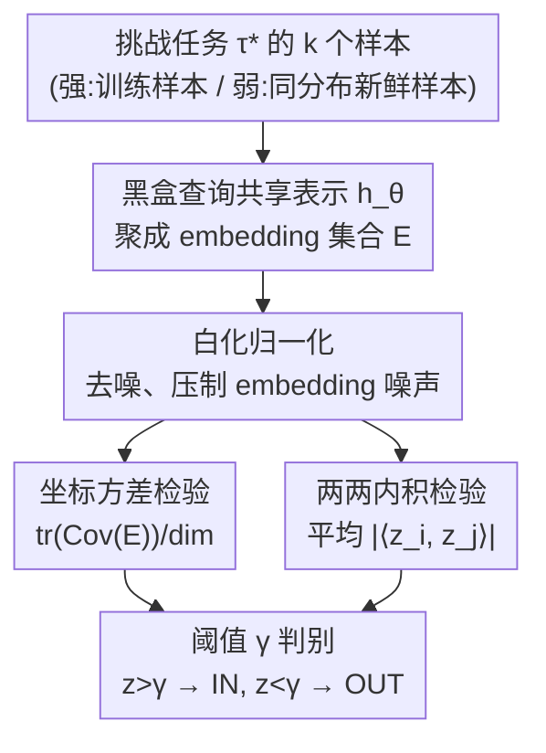

# Black-Box Privacy Attacks on Shared Representations in Multitask Learning

**会议**: ICLR2026  
**OpenReview**: [https://openreview.net/forum?id=mTsWEVhcZM](https://openreview.net/forum?id=mTsWEVhcZM)  
**代码**: https://github.com/johnmath/task-inference-attacks  
**领域**: AI安全 / 隐私攻击  
**关键词**: 多任务学习, 共享表示, 任务推断, 隐私泄露, 黑盒攻击  

## 一句话总结
本文提出"任务推断（task-inference）"威胁模型，证明仅靠对多任务学习共享表示的黑盒查询、拿到同一任务若干样本的 embedding，攻击者就能在不训练影子模型、不用任何参考数据的前提下，判断某个任务是否被纳入了训练集——核心抓手是同一任务的 embedding 之间存在强协同依赖。

## 研究背景与动机
**领域现状**：多任务学习（MTL）是一种让多方在尽量少共享原始数据的前提下联合训练的范式。它的做法是学一个**共享表示** $h:\mathcal{X}\to\mathcal{Z}$（通常是一个神经网络编码器），把所有任务的样本映射到一个低维特征空间里，让跨任务的相似样本聚到一起；每个任务再各自挂一个轻量的线性分类头 $g_i$ 在 embedding 上做预测。这种"只共享表示、不共享任务头"的设计在联邦学习、个性化推荐里被认为是隐私友好的，因为共享表示被视作"为了把多个小样本任务一起学好所必须交换的最小信息单元"。

**现有痛点**：但"最小信息单元"不等于"零泄露"。共享表示虽然名义上只编码跨任务的通用模式，却可能无意中记住特定任务（乃至某个用户、某个子群体）的信息。已有的 MTL 隐私攻击工作（Yan et al., 2024）有两个硬假设：一是只做**样本级**成员推断，二是要求攻击者能查询**任务专属的分类头**、还能训练参考/影子模型。前者粒度太细、后者的访问权限和先验知识在现实里往往拿不到——尤其当攻击目标是"整个任务是否参与训练"这种更粗粒度的问题时。

**核心矛盾**：共享表示既要足够泛化（捕捉跨任务共性），又被默认为"泄露最少"。可一旦模型为了把稀疏任务学好而对任务分布本身产生"分布级记忆"，泛化与隐私之间就出现了张力——表示越能区分不同任务，越容易被反推出某个任务在不在训练集里。

**本文目标**：在**纯黑盒**、**最小先验**的条件下回答一个问题——只给攻击者对共享表示编码器的查询权限，再加上目标任务分布的少量样本，能不能判断这个任务是否被用于训练 MTL 模型？并且要拆清楚：当攻击者手里是真·训练样本（强）还是只是同分布的新鲜样本（弱）时，攻击能力差多少。

**切入角度**：作者借鉴了成员推断里"训练样本的 embedding 对增广（如随机旋转）更稳健"这一观察，把它推广成一个更朴素的假设——**同一任务的不同样本，本身就是彼此的"天然增广"**，因此它们的 embedding 之间会表现出强协同依赖。攻击者一旦能同时拿到同一任务的多个样本，就能把分散在单样本里的微弱成员信号叠加放大。

**核心 idea**：不训练任何影子模型，直接用"同任务多个 embedding 之间的统计相关性（方差 / 两两内积）"作为检验统计量，对 IN/OUT 任务做阈值判别——把样本级成员推断升格为任务级的"任务推断"。

## 方法详解

### 整体框架
论文要解决的是一个二选一判别问题：给定一个挑战任务 $\tau^*$ 的一批样本 $X^*$，外加对共享表示 $h_\theta$ 的黑盒查询权限，判断 $\tau^*$ 是 IN（被用于训练）还是 OUT（没被用过）。整条攻击非常轻：拿样本去查编码器拿一组 embedding，在这组 embedding 上算一个反映"它们有多协同"的标量统计量 $z$，再卡一个阈值 $\gamma$ 给出 IN/OUT。关键在于"为什么这个统计量能区分 IN 和 OUT"——这由一个均值估计的简化模型从理论上奠定，再落到两种具体的统计量上。

威胁模型用一个安全博弈刻画：挑战者拿 $T$ 个从任务分布 $Q$ 抽出的任务训练共享表示 $h_\theta$；随机抛硬币 $b\in\{0,1\}$，$b=1$ 时挑战任务取自训练集、$b=0$ 时取自 $Q$ 但不在训练集；攻击者拿到挑战任务的一批样本 $X^*$ 和对 $h_\theta$ 的查询权，输出猜测 $\hat b$。这里有一个关键区分：**强攻击者**在 $b=1$ 时拿到的是真正参与训练的样本，**弱攻击者**只拿到同一任务分布里全新的、训练时没见过的样本。整个攻击不需要影子模型、不需要带标注的参考数据。

### 关键设计

**1. 任务推断威胁模型：把成员推断从样本级抬到任务级**

现有成员推断问的是"某条具体样本在不在训练集"，而现实里更值得担心的常常是"某个用户 / 某个子群体 / 某个标签类别整体在不在训练集"。本文提出的 task-inference 把博弈对象从单个样本换成**整个任务**：攻击者只需拥有目标任务**分布**的样本（不必是训练用的那几条），就尝试推断该任务是否被纳入训练。这个模型的精妙之处在于它是一个**统一插值框架**——当任务=用户时它等价于 user-inference；若进一步限定每个用户只有一条样本，就退化成经典成员推断；当任务由标签 / 学习问题定义时，它又对应 property / dataset inference。一个威胁模型按"任务"的语境定义不同，覆盖了好几种已有攻击的粒度。同时它把访问面收缩到最克制的程度：只查共享表示这个"最小交换单元"，不碰任务头（碰任务头会让任务级判别变得平凡）。

**2. 均值估计上的可解理论：解释强弱攻击者为何都能赢、强者凭什么更强**

为了说明黑盒攻击为什么有效，作者构造了一个 MTL 的简化对应物——高斯混合上的均值估计。设 $T$ 个任务均值 $\mu_i$ i.i.d. 采自 $N(\bar\mu,\bar\sigma^2 I_d)$，每个任务再采 $N$ 个样本，多任务样本均值 $\hat\mu=\frac{1}{T}\sum_i(\frac{1}{N}\sum_j X_{i,j})$。攻击者拿挑战任务的 $k$ 个样本算均值 $\mu_B$，构造检验统计量

$$z=\langle\,\hat\mu-\bar\mu\,,\,\mu_B-\bar\mu\,\rangle$$

这是把成员推断里"释放的统计量与攻击者样本之间的相关性"搬过来用。理论给出干净的期望分离：任务 OUT 时 $\mathbb{E}[z_{\text{OUT}}]=0$；任务 IN 时，强攻击者 $\mathbb{E}[z_{\text{IN}}]=\frac{d}{T}(\bar\sigma^2+\frac{\sigma^2}{N})$，弱攻击者 $\mathbb{E}[z_{\text{IN}}]=\frac{d}{T}\bar\sigma^2$。两件事由此说清：其一，统计量随数据维度 $d$ 增长、随任务总数 $T$ 衰减——任务越多、"人多遮丑"，单个任务越难被追踪，这正是成员推断（$T=1,k=1$ 退化到期望 $\Theta(d/N)$）的自然推广；其二，强攻击者比弱攻击者多出一项 $\frac{d}{TN}\sigma^2$，对应"我手里就是训练那几条样本"带来的额外优势，而弱攻击者只吃到 $\frac{d}{T}\bar\sigma^2$ 这项"我了解任务分布"的红利。方差近似相当，于是强者的 IN/OUT 期望间距更大、攻击成功率必然更高。

**3. 坐标方差攻击：用"同任务 embedding 在每个坐标上的散布"当成员信号**

落到真实模型上，第一个攻击直接量化"同任务 embedding 有多协同"。攻击者用 $k$ 个任务样本查编码器得到 embedding 集合 $E=\{h_\theta(x_1),\dots,h_\theta(x_k)\}$，算它们的经验协方差矩阵，取其迹除以 embedding 维度作为统计量 $z$——等价于所有坐标方差之和。直觉是：作者假设共享表示发生了**分布级记忆**，即编码器对训练过的任务分布"过拟合"，会把同一个被训练任务的样本压缩到 embedding 空间里更紧的一簇；而没训练过的 OUT 任务样本散得更开。于是 IN 任务的坐标方差更小、OUT 更大（实际按方向取阈值），$z<\gamma$ 判 IN。这个攻击在低 FPR 区间尤其有优势。

**4. 两两内积攻击：用整向量相似度而非逐坐标方差**

第二个攻击换一个角度衡量协同：不看逐坐标的散布，而看整条 embedding 向量之间的相似度。对每一对不同样本 $(x_i,x_j)$ 算其 embedding 内积（或余弦相似度）的绝对值，存进集合 $S$，取均值 $\bar S$ 作统计量再卡阈值。它捕捉的是"同任务样本是否被映射到方向高度一致的向量"。两个攻击各有所长：方差攻击在极低 FPR 处 TPR 更高；内积攻击在较高 FPR 区间更好。在 LoRA 个性化的生成式模型（Reddit/Gemma）上方差攻击更稳，因为低秩适配会让训练用户的 embedding 在空间里散开，而生成式 embedding 本就不是为分类聚簇而生，内积反而失灵。

此外有一个共用的**白化归一化（whitening）**预处理：因为攻击者本来就有任务样本和查询权，可以借此对 embedding 做白化变换压制噪声，提升信噪比。值得强调的是，与所有训影子模型 / 元分类器的成员、property 推断不同，这里只用了对编码器的查询权——简单阈值就足够拿到高成功率，把"纯黑盒"这一点贯彻到底。

### 一个完整示例
以 Stack Overflow 个性化（话题分类）为例：用 BERT Small 当共享表示，256 个任务（128 IN、128 OUT），每个任务是一个发帖用户。弱攻击者拿到某用户全新的若干帖子 → 查编码器拿到一批 embedding → 白化 → 算两两内积均值 $\bar S$。由于经验上每个用户只写很少几个话题（中位数 256 个话题里只覆盖约 31 个、占 12.1%），训练过的用户在表示空间里区分度极高，于是强攻击者两种攻击都拿到近乎完美的 AUC、在 75/90 分位阈值下经验 FPR 为 0%；固定 FPR=1% 时强攻击者 TPR 高达 98.5%，弱攻击者（内积）也有 8.2% 的非平凡 TPR。

## 实验关键数据

### 主实验
评测覆盖视觉（CelebA、FEMNIST）与语言（Stack Overflow、Reddit/Gemma 3 270M），以及两种 MTL 用法：个性化（每个用户一个任务）与多学习问题（每个任务是一个独立分类问题）。指标用 ROC-AUC、固定低 FPR 下的 TPR。攻击极轻量：最少 4 个样本、单张 RTX 4090 上每次黑盒查询+预测约 0.1 秒。

下表为**个性化**设置下坐标方差攻击的 AUC（强 / 弱）：

| 数据集（个性化） | 方差攻击 强 AUC | 方差攻击 弱 AUC | 备注 |
|--------|------|------|------|
| CelebA | 0.917 | 0.552 | FPR=1% 时 TPR 61.2% / 2.9% |
| FEMNIST | 0.691 | 0.574 | 稀疏任务，强弱差距大 |
| Stack Overflow（分类）| 1.000 | 0.556 | 强者近乎完美 |
| Reddit（生成，LoRA）| 0.844 | 0.766 | 强弱都高，FPR=1% TPR 19.7%/19.0% |

### 消融实验
对比两种 MTL 用法下"强 vs 弱攻击者"差距的变化（Stack Overflow 上方差攻击 AUC）：

| 配置 | 强 AUC | 弱 AUC | 说明 |
|------|---------|------|------|
| 个性化（任务=用户）| 1.000 | 0.556 | 任务头不解决独立问题，强弱分离明显 |
| 多学习问题（任务=话题）| 0.918 | 0.909 | 标签直接绑定任务，模型必须在训练任务上高效用，强弱差距坍缩 |

### 关键发现
- **强弱攻击者的差距取决于 MTL 用法**：当任务=用户（个性化）时，弱攻击者只吃到"了解任务分布"的红利，强弱分离很大（CelebA 强 0.917 vs 弱 0.552）；当任务直接对应训练标签（多学习问题）时，模型为解题必须在训练任务上达到高效用，导致 IN 任务被强记，强弱攻击者几乎打平（SO 多学习问题 0.918 vs 0.909）。
- **泄露与泛化间隙强相关**：作者在不同训练阶段测 Stack Overflow 模型的攻击 AUC，发现任务推断成功率随 IN/OUT 损失差（泛化间隙）增大而上升，和成员推断规律一致。
- **方差 vs 内积各有适用面**：判别式模型（embedding 为分类聚簇）上两者都强；生成式 LoRA 个性化模型上内积失灵、方差更稳。
- **弱攻击者也危险**：即便只拿训练时从未见过的新鲜样本，弱攻击者在多个设置下仍能取得远高于随机的 TPR（如 SO 多学习问题 0.2% FPR 下 19.6% TPR）。

## 亮点与洞察
- **"同任务样本互为天然增广"是个很轻却很有力的抓手**：它把成员推断里靠增广稳健性区分成员的思路，换成了"同分布多样本天然相关"，于是攻击者只要能同时拿一批同任务样本，就能无监督地把信号叠加放大——不需要影子模型这一最贵的先验，落地门槛极低。
- **统一插值的威胁模型很优雅**：一个 task-inference 按"任务"语境定义不同，分别退化为成员 / user / property / dataset inference，把零散的攻击谱系收进一个框架，理论上也好讲。
- **理论与现象对得上**：均值估计简化模型预言的"$z$ 随 $d/T$ 走、强者多一项 $\sigma^2/N$"，与真实模型上"任务越多越难追踪、强者总占优"的经验观察一致，这种 theory-to-practice 的呼应让结论更可信。
- **可迁移的防御启示**：既然泄露绑定泛化间隙，那么任何压缩 IN/OUT 损失差的手段（更强正则、DP-SGD、限制任务头对共享表示的过拟合）都可能直接削弱该攻击——这给"只共享表示就安全"的乐观假设敲了警钟。

## 局限与展望
- **威胁模型偏理想化的 MTL 实现**：评测沿用 Caruana(1997) 的原始 MTL（约等于集中式 FedSGD），所有任务共享除分类头外的一切；更复杂的个性化 / 联邦变体下攻击是否同样有效有待验证。
- **白盒/灰盒未覆盖**：本文聚焦纯黑盒查询编码器；若攻击者能访问任务头或部分参数，攻击会更强但也偏离了"最小交换单元"的设定，文中只做了概念性讨论（可构造 OUT 校准集做单边精确检验）。
- **理论建立在高斯均值估计的简化模型上**：它解释趋势很到位，但与深度表示的真实记忆机制之间仍有 gap，"分布级记忆"目前更多是经验假设而非被严格刻画的现象。
- **防御侧只是点到为止**：论文主旨是揭示攻击面，没有系统评估 DP 等防御对攻击的量化削弱程度，这是自然的后续方向。

## 相关工作与启发
- **vs 样本级成员推断（Shokri et al., 2016; Carlini et al., 2022）**：它们判别单条样本是否在训练集、通常要训影子模型校准；本文把对象升到整个任务、且纯黑盒无需任何参考模型，靠同任务多 embedding 的协同信号取胜。
- **vs MTL 上的成员推断 / 模型抽取（Yan et al., 2024）**：他们假设能查询任务专属分类头并训练参考模型，这会让任务级判别变平凡；本文只查共享表示这一最小单元，问题更难也更贴近真实威胁。
- **vs 表示上的攻击（Song & Raghunathan, 2020; Liu et al., 2021a）**：那些工作针对对比学习显式拉开样本 embedding 的模型；本文针对的是为多个监督下游任务隐式学到的泛化表示，泄露来源不同。
- **vs property / dataset / user inference（Ateniese et al., 2015; Maini et al., 2024; Kandpal et al., 2023）**：这些都是粗粒度推断的特例，本文的 task-inference 把它们统一进同一个按任务语境插值的威胁模型里。

## 评分
- 新颖性: ⭐⭐⭐⭐⭐ 提出统一插值的任务推断威胁模型 + 无影子模型的纯黑盒攻击，是成员推断到任务级的实质推广。
- 实验充分度: ⭐⭐⭐⭐ 覆盖视觉/语言、判别/生成、两种 MTL 用法，但防御侧评估偏薄。
- 写作质量: ⭐⭐⭐⭐⭐ 理论简化模型与经验现象互相印证，攻击描述清晰可复现。
- 价值: ⭐⭐⭐⭐⭐ 直接挑战"只共享表示即隐私安全"的常见假设，对联邦/个性化部署有现实警示意义。

<!-- RELATED:START -->

## 相关论文

- [\[ICLR 2026\] Traceable Black-box Watermarks for Federated Learning](traceable_black-box_watermarks_for_federated_learning.md)
- [\[ICLR 2026\] A General Framework for Black-Box Attacks Under Cost Asymmetry](a_general_framework_for_black-box_attacks_under_cost_asymmetry.md)
- [\[CVPR 2026\] SEBA: Sample-Efficient Black-Box Attacks on Visual Reinforcement Learning](../../CVPR2026/ai_safety/seba_sample-efficient_black-box_attacks_on_visual_reinforcement_learning.md)
- [\[ICLR 2026\] SeRI: Gradient-Free Sensitive Region Identification in Decision-Based Black-Box Attacks](seri_gradient-free_sensitive_region_identification_in_decision-based_black-box_a.md)
- [\[CVPR 2026\] What Your Features Reveal: Data-Efficient Black-Box Feature Inversion Attack for Split DNNs](../../CVPR2026/ai_safety/what_your_features_reveal_data-efficient_black-box_feature_inversion_attack_for_.md)

<!-- RELATED:END -->
