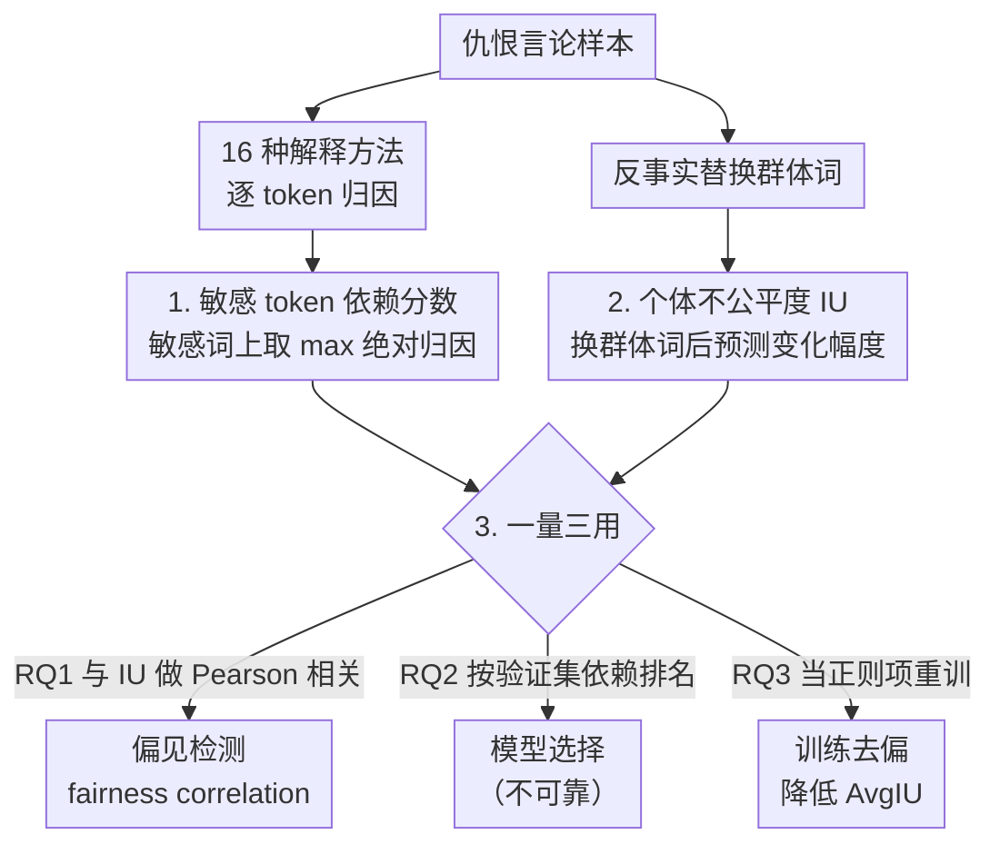

# Bridging Fairness and Explainability: Can Input-Based Explanations Promote Fairness in Hate Speech Detection?

**会议**: ICLR 2026  
**arXiv**: [2509.22291](https://arxiv.org/abs/2509.22291)  
**代码**: [https://github.com/Ewanwong/fairness_x_explainability](https://github.com/Ewanwong/fairness_x_explainability)  
**领域**: AI安全 / 公平性  
**关键词**: 公平性, 可解释性, hate speech detection, input attribution, 偏差缓解

## 一句话总结
首次系统性量化分析输入归因解释（input-based explanations）与公平性的关系：发现解释能有效检测有偏预测、可作为训练正则化减少偏见，但不能用于自动选择公平模型。

## 研究背景与动机
**领域现状**：NLP 模型在仇恨言论检测等敏感任务中常复现或放大训练数据中的社会偏见。可解释性被普遍认为是促进公平性的关键——如果能通过解释发现模型依赖了敏感特征（种族、性别词），就能检测偏见并施加约束。

**现有痛点**：(a) 部分研究质疑解释方法的忠实度——它们未必反映真实决策过程 (b) 减少敏感特征依赖可能同时损害性能和公平性 (c) 模型可被刻意训练为在解释中隐藏对敏感特征的使用。现有研究多为定性分析或小规模实验。

**核心矛盾**：可解释性和公平性的关系被过度简化——"解释能发现偏见→就能消除偏见"这一假设缺乏大规模定量验证。

**本文目标** 三个研究问题：(RQ1) 解释能否检测有偏预测？ (RQ2) 解释能否选择公平模型？ (RQ3) 解释能否在训练中减少偏见？

**切入角度**：在仇恨言论检测上，用 16 种解释方法 × encoder/decoder 模型 × 多种去偏技术 × 两个数据集做大规模实验。

**核心 idea**：输入归因解释在偏见检测和训练减偏中有效，但在模型选择中不可靠——可解释性和公平性的关系是 task-specific 且方法选择敏感的。

## 方法详解

### 整体框架
这篇论文不提出新模型，而是把"用解释促进公平"这个被默认成立的命题拆成三个可量化的研究问题来逐一检验。整条分析建在两把共享的尺子上：一是模型对输入里敏感词的依赖程度（敏感 token 依赖分数），从 16 种解释方法的 token 级归因里压出来；二是逐样本的个体不公平度（IU），度量把句子里的群体词换掉后预测变了多少。两把尺子都落在样本级，于是同一对量能在三个 RQ 里反复复用，只是用法不同：RQ1 把依赖分数和 IU 做 Pearson 相关，看解释能不能"看出"哪些预测有偏；RQ2 用验证集上的依赖分数给候选模型排名，看能不能据此挑出测试集上更公平的模型；RQ3 把依赖分数当正则项塞进训练损失，看主动压低敏感词依赖能不能真的减少偏见。

整套实验铺得很开，覆盖 16 种解释方法 × 2 类模型（encoder 端 BERT/RoBERTa、decoder 端 Llama3.2/Qwen3）× 7 种去偏方法 × 2 个数据集 × 3 种偏见类型，正是这个规模才让"解释能/不能促进公平"的结论从定性猜测变成统计结论。

### 关键设计

**1. 敏感 token 依赖分数：把"模型有多看重敏感词"压成一个可比的标量**

三个 RQ 都要回答"模型在多大程度上依赖了种族、性别词"，但 16 种解释方法给出的是 token 级的归因分数，粒度太细、量纲也不一致，没法直接拿来比较或当优化目标。这里的做法是对每个样本，只看它的敏感 token（如 "black"、"female"、"Muslim"），取其中归因绝对值最大的那个作为该样本的依赖分数：

$$\text{reliance}(\mathbf{x}, c) = a^c_{j^*}, \quad j^* = \arg\max_{j \in \{g_1,\dots,g_m\}} \left| a^c_j \right|$$

其中 $a^c_j$ 是第 $j$ 个敏感 token 对预测类别 $c$ 的归因。取绝对值是为了不在乎归因的正负方向，取最大是为了捕捉"只要有一个敏感词被重度依赖就算依赖"（原文也试过 sum / average 聚合，结论相近）。压成标量后，它在 RQ1 里和个体不公平度做相关、在 RQ2 里给模型排名、在 RQ3 里当正则化目标，三处复用同一个量，保证三个结论是在同一把尺子下得出的。

**2. 个体不公平度（IU）：在样本级度量偏见，才能和解释逐样本对齐**

要验证"解释分数高的样本是不是真的不公平"，就得有一个同样落在样本级的公平性度量——群体公平是整体统计量，没法和单条解释做相关。个体不公平度衡量的是：把同一句话里的社会群体词换成别的群体后，模型预测变了多少：

$$IU(\mathbf{x}_i) = \left|f_{\hat{y}_i}(\mathbf{x}_i) - \frac{1}{|G|-1}\sum_{g'} f_{\hat{y}_i}\big(\mathbf{x}_i^{(g')}\big)\right|$$

> ⚠️ 公式表达以原文为准。

其中 $\mathbf{x}_i^{(g')}$ 是把敏感词反事实替换成群体 $g'$ 后的版本，$f_{\hat{y}_i}$ 是模型在原预测类别上的输出。一个理想公平的模型换了群体词也不该改预测，所以 $IU$ 越大越不公平；在整个数据集上取平均得到 $\text{Avg}_{IU}$，反映模型整体的个体不公平水平。因为它和敏感 token 依赖分数都是逐样本定义的，RQ1 才能把两者拉到一起算 Pearson 相关，直接量出"解释看到的依赖"和"实际的不公平"对得有多齐。

**3. 一量三用：同一个依赖分数分别当相关量、排名量、正则项**

有了依赖分数和 IU 这两把尺子，论文的真正贡献是用它们搭出三条不同的流水线，分别回答三个 RQ——而结论恰恰不一致，这正是全文最有信息量的地方。

*RQ1 偏见检测（当相关量）*：对每个"预测类别–群体"对，算敏感 token 依赖分数与 $IU$ 的 Pearson 相关（取绝对值再平均），称为 fairness correlation。相关越高，说明解释越能"看出"哪些预测有偏。Occlusion 和 L2 范数类方法在这里显著有效，且即使模型已经过去偏训练，检测能力仍保持——否定了"去偏后解释失效"的担忧。

*RQ2 模型选择（当排名量）*：用验证集上的平均绝对依赖分数给候选模型排名，希望排在前面的就是测试集上更公平的模型。但这条路不可靠——它的 MRR@1 始终达不到"直接用验证集 $IU$ 排名"这一 baseline。原因是去偏会改变模型行为和归因模式，跨模型比较解释分数不稳，而同一模型内逐样本比较仍然有效（这正解释了为什么 RQ1 行、RQ2 不行）。

*RQ3 训练去偏（当正则项）*：既然依赖分数能反映偏见，训练时直接把它压低就有可能减偏。损失在原任务损失上加一项去偏正则，惩罚输入中所有敏感 token 的平均依赖：

$$L = L_{task} + \alpha L_{debias}$$

embedding 级归因用 L1 或 L2 范数惩罚（对应压低 mean 或 L2 依赖分数）。权重 $\alpha$ 在 $\{0.01, 0.1, 1, 10, 100\}$ 上搜索，并且**不是只看准确率来选**，而是用兼顾准确率和 unfairness 的公平性平衡指标来挑——这正是它能比早期同类工作（要么损失性能、要么损失公平）做得更好的关键：用对的指标在性能和公平之间找平衡点，而不是把敏感词依赖一压到底。

## 实验关键数据

### RQ1：偏见检测（Fairness Correlation）

| 解释方法 | BERT (Race) | BERT (Gender) | Qwen3-4B (Race) | Qwen3-4B (Gender) |
|---------|-------------|---------------|-----------------|-------------------|
| Grad L2 | 高 | 中 | 高 | 高 |
| Occlusion | 高 | 高 | 中 | 中 |
| IxG L2 | 高 | 中 | 高 | 高 |
| Attention | 低 | 低 | 低 | 低 |

最佳方法（Occlusion/L2 范数类）在大多数设置中实现显著的 fairness correlation。

### RQ2：模型选择
解释方法的验证集指标与测试集公平性的 Spearman 相关不稳定，MRR@1 始终低于直接使用验证集 IU 的 baseline。结论：**解释不可靠用于模型选择**。

### RQ3：训练去偏

| 方法 | Race AvgIU↓ | Gender AvgIU↓ | Religion AvgIU↓ |
|------|------------|---------------|-----------------|
| Default BERT | 3.17 | 0.66 | 1.27 |
| Best 解释正则化 | **~1.5** | **~0.4** | **~0.8** |
| CDA（最佳传统去偏） | 0.50 | 0.50 | 0.90 |

解释正则化能显著降低 AvgIU，尤其在 race 偏见上。部分方法的去偏效果接近或超过传统去偏技术。

### 关键发现
- **RQ1 ✓**：Occlusion 和 L2 范数类方法能有效检测有偏预测，fairness correlation 在统计上显著。即使模型经过去偏训练，检测能力仍然保持——否定了"去偏后解释失效"的担忧。
- **RQ2 ✗**：解释方法不能替代直接计算验证集公平性来选择模型。原因是去偏改变了模型行为和归因模式，跨模型比较解释不可靠，而同一模型内比较仍然有效。
- **RQ3 ✓**：将敏感 token 依赖作为正则项训练有效降低偏见，效果与或优于部分传统去偏方法。
- **LLM 生成的理由不如输入归因可靠**：LLM 的自然语言解释在偏见检测上不如 Occlusion/L2 方法。

## 亮点与洞察
- **三维度系统评估**：首次将"解释 → 公平"的关系拆解为检测/选择/减偏三个维度，给出了差异化的结论（2/3 有效），而非简单的"有用/无用"。
- **Mean vs L2 的发现**：Mean 聚合的归因分数在偏见检测中显著劣于 L2 聚合和 Occlusion，原因是 Mean 需要准确判断每个 token 贡献的方向，而 L2 和 Occlusion 不受方向影响。这对选择可解释性方法有直接指导意义。
- **解释忠实度 ≠ 公平检测能力**：附录分析发现，解释方法的忠实度（faithfulness）与其偏见检测能力无关——一个"不忠实"的解释也可能很好地捕捉敏感特征的使用。

## 局限与展望
- 仅在仇恨言论检测任务上验证，结论推广到其他分类任务（如招聘、贷款审批）需进一步实验。
- 解释正则化需要预先定义敏感词表，对隐式偏见（如 proxy features）无能为力。
- 未包含推理模型（reasoning models）和 CoT prompting——发现这类模型的归因主要落在中间推理步骤而非输入，需要不同的分析框架。
- 16 种解释方法的计算开销差异很大（KernelSHAP 极慢），未针对效率做权衡分析。

## 相关工作与启发
- **vs Dimanov et al. (2020)**：他们发现解释正则化可能同时损害性能和公平性。本文用更大规模实验和更精细的超参搜索（用公平性指标而非仅准确率）证明了解释正则化可以有效去偏。
- **vs Slack et al. (2020)/Pruthi et al. (2020)**：他们展示模型可被训练为在解释中隐藏偏见。本文发现即使经过去偏训练，解释仍能检测残留偏见——但确认了跨模型比较时解释不可靠。
- **对 ASIDE/AlphaSteer 的启示**：ASIDE 在结构上分离指令和数据，可能也会影响归因分布。本文的分析框架可用于评估这类安全方法是否同时改善了公平性。

## 评分
- 新颖性: ⭐⭐⭐⭐ 首个大规模量化研究，三维度设计有体系性
- 实验充分度: ⭐⭐⭐⭐⭐ 16 种方法 × 5 个模型 × 7 种去偏 × 2 个数据集 × 3 种偏见，极度全面
- 写作质量: ⭐⭐⭐⭐ 结构清晰，RQ 驱动的叙事逻辑好
- 价值: ⭐⭐⭐⭐ 为可解释性在公平 AI 中的应用给出了清晰的指南（哪些有效、哪些无效）

<!-- RELATED:START -->

## 相关论文

- [\[ACL 2025\] Towards Fairness Assessment of Dutch Hate Speech Detection](../../ACL2025/ai_safety/towards_fairness_assessment_of_dutch_hate_speech_detection.md)
- [\[ICLR 2026\] ATEX-CF: Attack-Informed Counterfactual Explanations for Graph Neural Networks](atex-cf_attack-informed_counterfactual_explanations_for_graph_neural_networks.md)
- [\[AAAI 2026\] CoRe-Fed: Bridging Collaborative and Representation Fairness via Federated Embedding Distillation](../../AAAI2026/ai_safety/core-fed_bridging_collaborative_and_representation_fairness_via_federated_embedd.md)
- [\[ICLR 2026\] FERD: Fairness-Enhanced Data-Free Adversarial Robustness Distillation](ferd_fairness-enhanced_data-free_adversarial_robustness_distillation.md)
- [\[ICLR 2026\] Beyond Match Maximization and Fairness: Retention-Optimized Two-Sided Matching](beyond_match_maximization_and_fairness_retention-optimized_two-sided_matching.md)

<!-- RELATED:END -->
