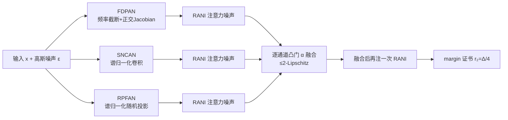

# HyCAS：用混合卷积与注意力随机性，同时打通认证鲁棒与经验鲁棒

**会议**: ICLR 2026  
**OpenReview**: [https://openreview.net/forum?id=sYk9GaFHEf](https://openreview.net/forum?id=sYk9GaFHEf)  
**代码**: [https://github.com/misti1203/HyCAS](https://github.com/misti1203/HyCAS)  
**领域**: AI 安全 / 对抗鲁棒性  
**关键词**: 认证鲁棒性, 随机平滑, Lipschitz 约束, 谱归一化, 经验鲁棒性, 医学影像  

## 一句话总结
HyCAS 把确定性的 1-Lipschitz 谱归一化卷积，和两类架构内部随机性（谱归一化随机投影 + 随机注意力噪声）耦合成一个全局 ≤2-Lipschitz 的随机化网络，从而在同一个模型里同时拿到可证明的 ℓ₂ 认证半径，和对强 ℓ∞ 攻击（APGD/AutoAttack）的经验鲁棒性。

## 研究背景与动机
对抗鲁棒性长期分裂成两条互不相通的路线：**经验防御**（以对抗训练为代表）能扛住 ℓ∞ 大扰动攻击，但给不出任何理论保证，常被精心设计的自适应攻击一击即破，陷入"猫鼠游戏"；**认证防御**（确定性 Lipschitz 约束、随机平滑 RS）能给出"半径 r 内预测不变"的可证明保证，但代价高昂——随机平滑要么用大噪声预算换大半径却牺牲干净精度，要么用小噪声只能认证很窄的 ℓ₂ 半径，且其保证只针对 ℓ₂ 范数，对 ℓ∞ 攻击形同虚设。

**核心矛盾**在于：确定性 Lipschitz 网络虽然鲁棒，却暴露了一个*固定的梯度场*，攻击者可以稳定地沿它寻找对抗样本；而纯输入噪声的随机平滑又被自适应攻击通过"对内部噪声求平均"绕过。更糟的是，大多数随机化防御只在自然图像上验证，几乎没人在医学影像这类高风险分布上、用 SOTA 经验攻击同时考核认证与经验两侧。

**本文目标**是造一个单一架构，既保留随机平滑的形式化认证，又能扛强 ℓ∞ 攻击，还能跨多种成像基准泛化。**核心 idea**：把随机性*注入到架构内部*而非只在输入端——用确定性的 1-Lipschitz 骨干保证最坏情况界，再叠两层数据无关的随机平滑模块，让攻击者每次前向看到的梯度场都在变，整体仍被严格控制在 ≤2-Lipschitz，从而推出一个简单的基于 margin 的 ℓ₂ 证书。

## 方法详解

### 整体框架
HyCAS 把标准 CNN 骨干里的每个卷积层替换成三条并行的 Lipschitz 受限随机流：FDPAN（频率感知确定性投影 + 注意力噪声）、SNCAN（谱归一化卷积 + 注意力噪声）、RPFAN（随机投影滤波 + 注意力噪声）。每条流都由"确定性 1-Lipschitz 核 + 随机注意力残差（RANI）"构成，单独 ≤2-Lipschitz；三条流再经一个数据无关的逐通道凸门 $\alpha_{b,c}$ 融合，凸组合是非扩张映射，所以融合后以及堆叠后的整网仍 ≤2-Lipschitz。最终模型在内部随机性 $\Omega=(\xi,\psi,M_\omega)$ 和输入高斯噪声 $\varepsilon\sim\mathcal N(0,\sigma^2 I)$ 上取期望，得到平滑分类器 $g_\theta(x)=\arg\max_c P_{\varepsilon,\Omega}[f_\theta(x+\varepsilon;\Omega)=c]$。

### 关键设计

**1. RANI：把确定性梯度场"搅浑"的随机注意力噪声残差。** 这是贯穿三条流的核心随机化原语，专治"1-Lipschitz 网络梯度场固定可被利用"的痛点。给定确定性特征 $h\in\mathbb R^{H\times W\times C}$，RANI 每次前向都独立采一份噪声 $\omega\sim\mathcal N(0,I)$，生成一个与特征*无关*、取值落在 $[0,1]^d$ 的有界注意力掩码 $M_\omega$，再做 Hadamard 调制 $\hat h = h\odot M_\omega$。因为对角矩阵 $D_\omega=\mathrm{diag}(M_\omega)$ 的每个元素都在 $[0,1]$，有 $\|D_\omega\|_2\le1$，于是残差映射 $I+D_\omega$ 的谱范数 $\le2$——这恰好把一个 1-Lipschitz 的确定性块抬成 2-Lipschitz 的随机化块（Lemma 1）。关键在于噪声是*每次前向重采、且在训练和推理都注入*，攻击者无法通过对噪声求期望来还原一个稳定梯度，这正是经验鲁棒性提升的来源。

**2. 三流分工：频率、谱、随机投影各防一类漏洞。** SNCAN 最直接，把每个卷积换成谱归一化卷积（SNC，$\|K_e\|_{op}\le1$）再叠 RANI，输出 $G_{\text{SNCAN}}=(I+D_\omega)C_{K_e}(x)$，在保住 1-Lipschitz 最坏界的同时引入梯度扰动。FDPAN 针对"对抗扰动藏在高频 DCT 系数 + 跨模型通用的通道梯度规律"：它是四级级联——低通 DCT 掩码（切掉脆弱高频）→ 正交 Jacobian $1\times1$ 矩阵打乱通道梯度 → SNC 控谱 → RANI 注噪，确定性核写成 $H(x)=C_{K_e}(U\Phi^\top(\Lambda\odot\Phi x))$（$\Phi$ 是正交 DCT，$\Lambda$ 是低通掩码，$U$ 是正交通道混合），再叠两段独立 RANI 仍 ≤2-Lipschitz。RPFAN 继承随机投影滤波（RPF）的 Johnson–Lindenstrauss 嵌入保证，加了"能量守恒通道预混（正交 $U$ 让各通道等能量进入投影空间）"和"逐样本两步幂迭代谱归一化"两个创新让投影严格 1-Lipschitz，再叠 RANI——于是同时获得来自随机投影本身和来自 RANI 的*双重随机性*。三条流互补，共同覆盖频域、谱域、投影域的攻击面。

**3. 凸门融合 + margin 证书：把"≤2-Lipschitz"翻译成可证半径。** 三流输出由可学习、数据无关的 logit $\lambda_{b,c}$ 经 softmax 得到凸权 $\alpha_{b,c}=\frac{\exp(\lambda_{b,c})}{\sum_{b'}\exp(\lambda_{b',c})}$（满足 $\sum_b\alpha_{b,c}=1,\alpha_{b,c}\ge0$）融合。凸组合非扩张，故 $\mathrm{Lip}(x\mapsto z(x))\le\max_b\mathrm{Lip}(G_b)\le2$（Prop. 4），且对 $\Omega$ 取期望不改变 Lipschitz 常数（Lemma 2），所以期望 logit 映射 $Z(x)=\mathbb E_\Omega[s_\theta(x;\Omega)]$ 仍 ≤2-Lipschitz。由此推出 HyCAS 的逐点 ℓ₂ 证书（Corollary 1）：设 top-2 logit 间隔 $\Delta(x)=Z^{(1)}(x)-Z^{(2)}(x)$，则 $r_2(x)=\frac{\Delta(x)}{4}$ 是有效认证半径——任何 $\|\delta\|_2<r_2(x)$ 都不会改变预测。门是数据无关的，会自动下调高敏感流的权重，进一步削弱朴素攻击。整网用 $\mathcal L_{\text{HyCAS}}=\zeta\odot\mathcal L_{\text{FDPAN}}+\varphi\odot\mathcal L_{\text{SNCAN}}+\nu\odot\mathcal L_{\text{RPFAN}}+\kappa\odot\mathcal L_{\text{RANI}}$（各系数可学习）联合优化。

## 实验关键数据

### 主实验：认证鲁棒（ℓ₂ 在预设半径 r 的认证精度 %）
CIFAR-10 与 ImageNet（节选 σ=0.50）：

| 方法 | 数据集 | r=0.0 | r=0.75 | r=1.5 | r=2.0 |
|------|--------|-------|--------|-------|-------|
| RS | CIFAR-10 | 65.2 | 32.4 | 9.34 | 0 |
| ARS | CIFAR-10 | 78.4 | 38.9 | 19.7 | 8.47 |
| **HyCAS** | CIFAR-10 | **80.7** | **44.3** | **23.4** | **12.5** |
| ARS | ImageNet | 68.1 | 43.4 | 30.6 | 22.4 |
| **HyCAS** | ImageNet | **69.2** | **45.6** | **32.7** | **24.8** |

医学/人脸数据（r=1.0 认证精度）：CelebA 36.9%、HAM10000 38.5%、NIH-CXR 41.4%，在 NIH-CXR 上比最强基线 ARS 高 **+3.5–7.3%**，干净精度也持平或更高。

### 主实验：经验鲁棒（ℓ∞ 攻击下 robust accuracy %，节选 ε=16/255）

| 方法 | NIH-CXR APGD-20 | NIH-CXR AA-20 | HAM10000 APGD-20 | EyePACS APGD-20 |
|------|------|------|------|------|
| AT | 66.9 | 64.1 | 46.5 | 50.1 |
| CTRW | 73.1 | 72.6 | 52.8 | 57.7 |
| **HyCAS** | **77.3** | **74.4** | **55.3** | **60.5** |

HyCAS 比次优经验防御 CTRW 高约 **+1.5–4.2%**，比认证防御 ARS/DRS 在强扰动下领先 **+12%** 以上。

### 关键发现
- **噪声级 σ 是可调旋钮**：σ 从 0.25→0.50，CIFAR-10 在 r=0.75 几乎不变（44.3%），但 r=2.0 从 8.52%→12.5%；ImageNet 在 r=2.0 从 5.42%→24.8%——给出可控而非固定的精度-鲁棒前沿。
- **抗强攻击不崩**：在 CIFAR-10/100 上随 APGD 扰动从 ε=0.01→0.08、迭代从 10→100 步增强，所有基线（含 TRADES、HR）单调退化，HyCAS 始终在最优包络，100 步时仍领先最近竞争者 7–12%。
- **认证-经验 Pareto 前沿**揭示两个固有现象：小扰动区经验曲线明显高于认证曲线（证书天然保守），大半径区差距进一步拉大（ℓ₂ 保证难转 ℓ∞ 的"范数错配尾隙"）。

## 亮点与洞察
- **把随机性"搬进架构内部"是关键转折**：传统随机平滑只在输入端注噪，确定性 Lipschitz 防御内部又完全确定；RANI 在每个谱归一化块后、以及融合输出处都注入数据无关随机注意力，既保住形式化证书又打散了攻击者依赖的固定梯度场。
- **"确定性核 + 随机残差"是个优雅的 Lipschitz 记账法**：1-Lipschitz 核加上谱范数 ≤1 的残差，三角不等式直接给出 ≤2 的整体界，证明简单且模块可堆叠，凸门融合不增加常数。
- **真正在医学影像上验证**：CelebA/HAM10000/NIH-CXR/NCT-CRC-HE-100K/EyePACS 等高风险分布上同时考核认证与经验鲁棒，补上了该领域长期缺失的评测。

## 局限与展望
- 证书是 **ℓ₂** 的，而强经验攻击是 **ℓ∞**，论文自己的 Pareto 图就显示存在"范数错配尾隙"——ℓ₂ 保证无法直接翻译成 ℓ∞ 性能，未来需要更紧的 ℓ∞ 证书。
- 全局界只到 **≤2-Lipschitz**，相比纯 1-Lipschitz 确定性防御放松了一倍，认证半径 $r_2=\Delta/4$ 的分母也因此更大、半径偏保守。
- 三流并行 + 每层 RANI 重采样 + 随机平滑推理多次采样，**计算/认证开销不小**，作者也把"更轻量的认证采样器"列为未来工作。
- 干净精度有"小幅但一致"的下降作为代价，在极致干净精度场景需权衡。

## 相关工作与启发
- **确定性认证**：谱归一化/正交参数化（Miyato 2018）、LOT（Xu 2022）、SLL（Araujo 2023）——HyCAS 继承其 1-Lipschitz 骨干，但用随机分支补回精度损失。
- **随机平滑系**：RS（Cohen 2019）、Dual RS、Incremental RS、Adaptive RS——HyCAS 不再只对输入噪声平滑，而是注入内部双重随机性同时保住 ≤2-Lipschitz 证书。
- **经验随机化防御**：PNI（He 2019）、Learn2Perturb、CTRW、RPF（Dong & Xu 2023）——这些无认证保证且常被"对内部噪声求平均"的自适应攻击绕过；HyCAS 的启发在于用 Lipschitz 约束把随机化"锚定"住，使其既随机又可证。

## 评分
- 新颖性: ⭐⭐⭐⭐ — "确定性 1-Lipschitz 核 + 内部随机注意力残差"统一认证与经验两条路线的思路清晰，RANI 把固定梯度场搅浑的动机扎实；但各组件（谱归一化、随机投影、DCT 截断、RS）多为已有积木的组合。
- 实验充分度: ⭐⭐⭐⭐ — 8 个基准（含 5 个医学/人脸）、认证与经验双侧、APGD/AutoAttack 多强度、5 seeds 带方差，覆盖很全；缺更紧的 ℓ∞ 认证与开销分析。
- 写作质量: ⭐⭐⭐⭐ — 定理-推论链条完整、图 1 总览清晰、动机递进流畅；个别公式排版（如 Prop.1 的"4-Lipschitz"笔误）略有瑕疵。
- 价值: ⭐⭐⭐⭐ — 给安全攸关（尤其医学）部署提供了一个可调"认证↔经验"旋钮的实用防御，弥合了长期割裂的两条路线，落地意义明确。

<!-- RELATED:START -->

## 相关论文

- [\[ICLR 2026\] Dataless Weight Disentanglement in Task Arithmetic via Kronecker-Factored Approximate Curvature](dataless_weight_disentanglement_in_task_arithmetic_via_kronecker-factored_approx.md)
- [\[ICLR 2026\] Expressiveness of Multi-Neuron Convex Relaxations in Neural Network Certification](expressiveness_of_multi-neuron_convex_relaxations_in_neural_network_certificatio.md)
- [\[ICLR 2026\] Optimizing Canaries for Privacy Auditing with Metagradient Descent](optimizing_canaries_for_privacy_auditing_with_metagradient_descent.md)
- [\[ICLR 2026\] Robust Federated Inference](robust_federated_inference.md)
- [\[ICLR 2026\] Sample-Efficient Distributionally Robust Multi-Agent Reinforcement Learning via Online Interaction](sample-efficient_distributionally_robust_multi-agent_reinforcement_learning_via_.md)

<!-- RELATED:END -->
