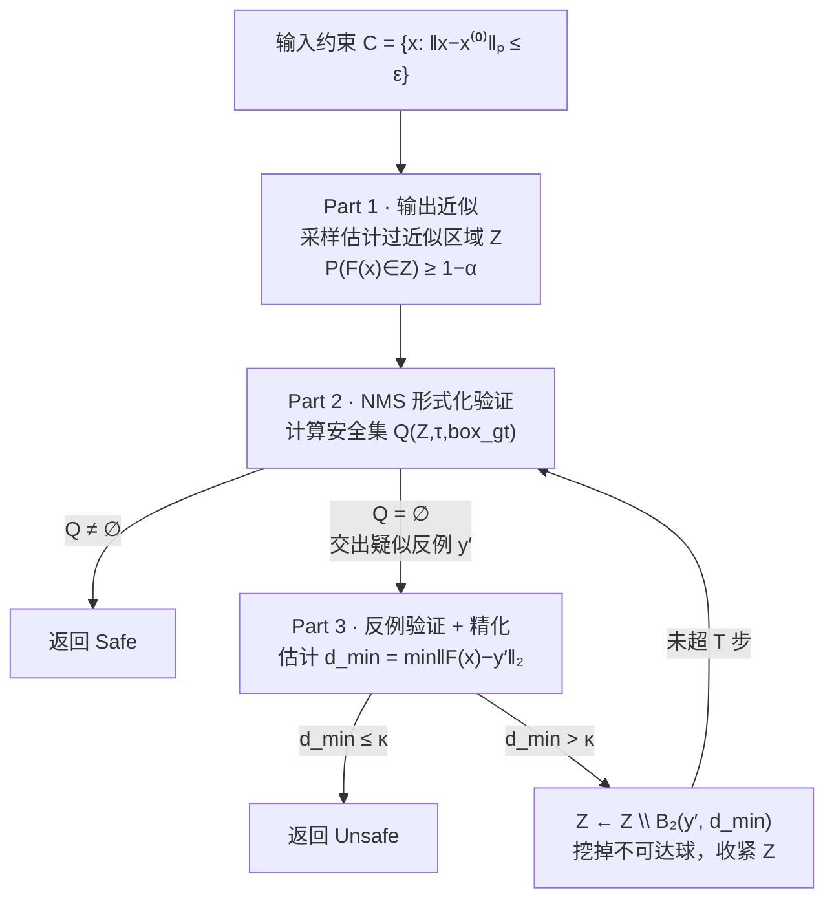

# Certifying the Full YOLO Pipeline: A Probabilistic Verification Approach

**会议**: ICLR 2026  
**OpenReview**: [https://openreview.net/forum?id=AMCFpquOtZ](https://openreview.net/forum?id=AMCFpquOtZ)  
**代码**: 待确认  
**领域**: AI 安全 / 神经网络鲁棒性验证  
**关键词**: 目标检测验证, PAC 验证, 物体消失威胁, NMS, YOLO, 概率鲁棒性保证  

## 一句话总结
本文提出 ODPV——首个能在**实际规模**上验证完整 YOLO 检测流水线（含 NMS 后处理）对"物体消失"攻击鲁棒性的 PAC 概率验证框架，用"输出近似 → NMS 形式化验证 → 反例精化"三步把高维检测网络的认证变成可行的采样问题。

## 研究背景与动机
**领域现状**：目标检测被广泛部署在自动驾驶、监控等安全攸关场景，但神经网络对微小输入扰动（传感器噪声等）极其敏感。其中最危险的是**物体消失（Object Disappearance, OD）威胁**：一个本应被检出的有效目标，在人眼无法察觉的扰动下被网络漏检，可能直接导致灾难性后果。因此验证检测系统的鲁棒性是可靠部署的前提。

**现有痛点**：现有验证方法分三类——形式化验证（Formal）对所有扰动输入给确定性保证，但 ReLU 网络的精确验证是 NP-完全的，对 640×640×3 输入的 YOLO 仅基础 bound propagation 就要 5000 GB 以上内存，完全不可行；概率验证（Probabilistic）需访问网络内部节点，无法扩展到大模型；PAC 验证只靠采样、不碰内部节点，扩展性最好，但 DeepPAC 这类维度相关的方法在 YOLO 上需要的样本量大到不可承受。

**核心矛盾**：检测网络验证还有两个检测特有的难点叠加在"参数规模大"之上——一是 **NMS 等关键后处理步骤完全落在现有形式化验证范围之外**（NMS 含排序、IoU 比较、贪心选择，不是可微的网络层）；二是检测的输入输出维度极高，使依赖维度的 PAC 方法计算上不可行。正因如此，即便是专门为检测设计的近期工作（Cohen et al. 2024、Elboher et al. 2024）也只能处理简化模型或干脆忽略 NMS。

**本文目标**：在合理时间内、不修改原网络的前提下，给出**包含 NMS 的完整 YOLO 流水线**对 OD 威胁的概率鲁棒性认证。

**核心 idea**：**把"是否安全"重写成 PAC 概率命题**——验证 $P_{x\sim C}(\exists\, \text{box}_i \in N(F(x)),\ \text{IoU}(\text{box}_i, \text{box}_{gt}) \ge \tau \wedge \text{Class}=q) \ge 1-\alpha$ 是否以置信度 $1-\beta$ 成立，再用"先黑盒采样把输出空间套进一个有概率保证的过近似区域 $Z$，在 $Z$ 上对 NMS 做形式化验证，发现疑似反例就估计它到真实输出空间的距离并把对应球挖掉精化"的三步循环来求解。**关键区别**：与随机平滑（randomized smoothing）只对"平滑后"的修改版分类器给保证不同，本文不动原网络，直接为原始检测器提供统计保证。

## 方法详解

### 整体框架
ODPV 把 OD PAC 验证问题（Definition 1）拆成三个互相衔接的部分，外层用 Algorithm 1 串成一个"验证—找反例—精化"的迭代循环。核心对象是一个把真实但未知的输出集合 $\{F(x)\}_{x\in C}$ 套住的**有概率保证的过近似区域 $Z$**：Part 1 用采样把 $Z$ 估出来；Part 2 在 $Z$ 上形式化验证 NMS 是否对所有可能输出都能正确检出目标，若是则判 Safe，若否则交出一个疑似反例 $y'$；Part 3 估计 $y'$ 到真实输出空间的最小距离 $d_{min}$，若 $d_{min}\le\kappa$ 说明反例确实可达、判 Unsafe，否则把 $y'$ 周围半径 $d_{min}$ 的球从 $Z$ 中挖掉（因为这块区域被证明不属于真实输出），收紧 $Z$ 后回到 Part 2，直到判定或耗尽 $T$ 步精化。

### 关键设计

**1. 输出空间过近似：用 RCPN 把无穷约束压成有限采样（Part 1）**——验证的第一道关卡是把"对所有 $x\in C$ 的网络输出"装进一个可处理的区域。本文构造 $Z = \{F(x^{(0)})+\epsilon : |\epsilon|\le c_1 v_{max}\}$，其中 $v_{max}$ 由 $N_1$ 个采样点的逐分量最大偏差给出（再加小常数 $\zeta$ 防零），而缩放系数 $c_1$ 本应解 $c_1=\min_{c\ge 0} c$ s.t. $|F(x)-F(x^{(0)})|\le c v_{max},\ \forall x\in C$——这是个无穷多约束的半无限规划，直接解不可行。关键一招是注意到每条约束对 $c$ 都是凸的，于是用 **RCPN（随机凸规划）** 只采 $N_2$ 个样本求 $c_1=\max_{i\in[N_2],j}\frac{|F(x^{(i)})_j-F(x^{(0)})_j|}{(v_{max})_j}$。Proposition 1 给出：只要 $N_2\ge \frac{2\ln(1/\beta)}{\alpha}+2+\frac{2\ln(2/\alpha)}{\alpha}$，就能以概率 $1-\beta$ 保证 $P_{x\sim C}(F(x)\in Z)\ge 1-\alpha$。这把一个不可解的无穷约束问题换成了样本数只依赖 $\alpha,\beta$（而**与维度无关**）的有限采样，是整个框架能扩展到 YOLO 的根基。

**2. NMS 验证：用"安全 IoU 阈值"把贪心后处理变成逐框可解的 MIQCP（Part 2）**——NMS 含排序与 IoU 比较，没法直接塞进网络验证器。本文绕开"模拟 NMS"，转而定义**安全集** $Q(Z,\tau,\text{box}_{gt})$：索引 $i$ 进入安全集当且仅当（1）对 $Z$ 中所有可能输出 $z^k$，第 $i$ 个框都类别正确、置信度 $\ge\iota$ 且 $\text{IoU}(\text{box}_i^k,\text{box}_{gt})\ge\tau$；（2）不存在能把它"压制掉"的更高分同类框。Proposition 2 证明只要 $Q\ne\emptyset$，则 $Z$ 中每个输出经 NMS 后都至少留下一个正确检出目标的框——于是验证 NMS 安全性就**归约为判断安全集是否非空**。为算安全集，定义**安全 IoU 阈值** $\tau(i,Z,\text{box}_{gt})=\inf\{\tau': i\notin Q\}$，并由 Lemma 2 拆成 $\tau(i)=\min(\tau_1(i),\tau_2(i))$，其中 $\tau_1$ 刻画框自身与 GT 的最坏 IoU、$\tau_2$ 刻画被同类高分框压制的最坏情形。这两个 min 被编码成**混合整数二次约束规划（MIQCP）**交给 Gurobi 求解（Appendix I），把对无穷输出集的全称验证落成有限个可解优化。

**3. 反例精化：两步估计 $d_{min}$ 把过近似"挖洞"收紧（Part 3）**——Part 2 给出的疑似反例 $y'$ 可能只是 $Z$ 过大造成的"假反例"，真实输出 $\{F(x)\}_{x\in C}$ 根本到不了那里。判定的关键量是 $d_{min}=\min_{x\in C}\|F(x)-y'\|_2$，但高维下直接取采样输出到 $y'$ 的最小距离收敛极慢、不可靠。Algorithm 4 用两步带保证的估计：**Step One** 反复采样点对、用比值 $\frac{B_i'}{A_i'-B_i'}$（$A_i',B_i'$ 为某点到其邻域采样的最大/最小距离）估出刻画 $F$ 局部变化的常数 $C$；**Step Two** 用 $C$ 与新样本给出保守估计 $d_{min}\leftarrow\max\{\frac{B_m-C(A_m-B_m)}{1+2C},0\}$。Theorem 1 保证：在 $N\cdot((1-2\epsilon)^M)>\frac{1}{\alpha}\ln\frac{1}{\beta}$ 等条件下，以概率 $\ge 1-\beta-2(1-\epsilon)^{M_2}$ 有 $V(y,d_{min})\le\alpha$（即被挖掉的球与真实输出集相交概率极小）。若 $d_{min}>\kappa$ 就把 $B_2(y',d_{min})$ 从 $Z$ 中剔除，循环收紧。

**4. 端到端的复合概率保证**——Theorem 2 把 Part 1（Prop. 1）、Part 2（Prop. 2，确定性）、Part 3（Thm. 1）的保证复合起来：若算法在至多 $T$ 步精化后输出 Safe，则以概率 $\ge 1-T(\beta+2(1-\epsilon)^{M_2})-\beta$ 有 $P_{x\sim C}(x\ \text{safe})>1-(1+T)\alpha$。一个具体配置（$N_1{=}30000, N_2{=}5000, N{=}3000, M{=}10, M_2{=}2000, \alpha{=}\beta{=}0.0099, \epsilon{=}1/200, T{=}1$）只需 **37000 个样本**（Part 1 样本在 Part 3 Step One 复用）即可达成"98% 置信度下 OD 威胁发生概率 $\le 2\%$"。且所有保证**只依赖 i.i.d. 假设、对任意采样分布成立**，不限于均匀分布。

## 实验关键数据

**基本设置**：在 Ultralytics 的 YOLOv3/v5/v8/YOLO11（medium 与 large 版本）上验证，COCO 验证集随机选 100 张图（共 520+ 个目标）；IoU 阈值 $\tau\in\{0.5,0.7\}$，NMS 常数 $\eta=0.45,\iota=0.25$，扰动半径 $\varepsilon\in\{1/255, 2/255\}$，默认均匀分布采样。

### 主实验：与 RCPN 基线对比（Table 1）
$\Delta$PGD 为相对 PGD 攻击的 IoU 下界平均绝对差（越小越紧）。

| 模型 | $\varepsilon$ | 方法 | 时间(s) | $\Delta$PGD ($\tau{=}0.5$) | $\Delta$PGD ($\tau{=}0.7$) |
|------|------|------|---------|------|------|
| v3spp | 1/255 | **Ours** | **109.0** | **0.49** | **0.45** |
| v3spp | 1/255 | RCPN | 563.5 | 0.55 | 0.53 |
| v8m | 1/255 | **Ours** | **50.7** | **0.48** | **0.44** |
| v8m | 1/255 | RCPN | 455.0 | 0.52 | 0.52 |
| v5m | 1/255 | **Ours** | **43.6** | **0.42** | **0.39** |
| v5m | 1/255 | RCPN | 445.5 | 0.47 | 0.47 |
| 11x | 1/255 | **Ours** | **147.2** | **0.49** | **0.45** |
| 11x | 1/255 | RCPN | 618.1 | 0.54 | 0.54 |

**结论**：本文方法在所有模型上的验证时间约为 RCPN 的 **1/5～1/10**（如 v5m 从 445s 降到 44s），且 IoU 下界更紧（$\Delta$PGD 更小、更贴近真实攻击），即用更少样本拿到更好的认证界。

### 鲁棒性认证评估（Table 2，$\tau=0.5$，$10^6$ 次均匀扰动）
正例=被本文判为鲁棒的检测；CRA=认证鲁棒准确率；ABI=不做精化时认证 IoU 下界的平均提升。

| 模型 | $\varepsilon$ | TPR(%) | FPR(%) | TNR(%) | CRA(%) | ABI |
|------|------|--------|--------|--------|--------|-----|
| yolov8x | 1/255 | 95.1 | **0.0** | **100.0** | **100.0** | 0.09 |
| yolov8x | 2/255 | 89.7 | 0.6 | 99.4 | 99.7 | 0.14 |
| yolo11x | 1/255 | 94.9 | 2.9 | 97.1 | 98.9 | 0.10 |
| yolo11x | 2/255 | 85.2 | 1.4 | 98.6 | 99.4 | 0.17 |
| yolov8m | 1/255 | 97.3 | 2.6 | 97.4 | 98.9 | 0.08 |
| yolov5xu | 1/255 | 94.8 | 0.7 | 99.3 | 99.7 | 0.09 |

### 关键发现
- **认证可靠性高**：CRA 普遍 ≥98.6%（yolov8x 达 100%），说明被判为鲁棒的检测几乎都确实鲁棒，假阳率（FPR）很低，验证是 sound 的。
- **扰动越大越保守**：$\varepsilon$ 从 1/255 增到 2/255 时 TPR 下降（如 yolo11x 94.9%→85.2%）、FNR 上升，但 CRA 反而更高，体现方法在更难的设置下倾向保守、不轻易误判鲁棒。
- **精化确有增益**：ABI 0.08～0.17 表明 Part 3 的"挖洞"精化能切实提升认证 IoU 下界。

## 亮点与洞察
- **第一个验证完整检测流水线（含 NMS）的实用规模框架**：以往工作要么砍掉 NMS、要么只验简化模型，本文把 NMS 这个"非可微贪心后处理"通过安全集与安全 IoU 阈值的归约，干净地变成可由 Gurobi 求解的 MIQCP，补上了检测验证最缺的一环。
- **样本复杂度与维度解耦**：靠 RCPN 与 PAC 框架，把样本数变成只依赖 $\alpha,\beta$ 的常数，而非检测输入输出的高维度——这是它能跑在 640×640 YOLO 上、而形式化/维度相关 PAC 方法跑不动的根本原因。
- **不修改原网络**：明确与随机平滑划清界限——保证的是原始检测器本身，而非平滑后的替身模型，认证结论可直接用于部署的真实网络。
- **分布无关的保证**：所有定理只靠 i.i.d. 假设，对均匀/高斯/椒盐等任意分布都成立（Appendix X 还验证了 False Appearance 等其他威胁），实用弹性强。

## 局限与展望
- **PAC ≠ 确定性保证**：本质是概率认证（98% 置信下威胁概率 $\le 2\%$），对要求绝对零失效的极端安全场景仍有残余风险，无法替代形式化验证的确定性结论。
- **小扰动半径限制**：实验只用 $\varepsilon\in\{1/255,2/255\}$，作者坦言更大半径会让网络过于脆弱、几下采样就能找到反例，从而失去方法间区分度——也意味着对较大扰动的认证能力未被充分检验。
- **Part 3 迭代受限**：高维输出下为防计算爆炸限制了精化步数 $T$，过近似区域的收紧程度有上限，可能影响紧致性。
- **依赖 MIQCP 求解器**：NMS 验证落到 Gurobi 上，框数 $n_x$ 很大或类别极多时 MIQCP 规模与求解时间如何随之增长，文中未深入压力测试。

## 相关工作与启发
- **神经网络验证三范式**：形式化验证（Katz et al. Reluplex、α,β-CROWN）给确定性但 NP-完全难扩展；概率验证（Weng et al. 2019）需内部节点；PAC 验证（DeepPAC, Li et al. 2022）靠采样可扩展但样本量大。本文站在 PAC 一脉，用 RCPN 把样本复杂度压到与维度无关。
- **检测验证的前序工作**：Cohen et al. 2024 传播 bound 认证 IoU、Elboher et al. 2024 把 IoU 编进网络给现有验证器——两者都忽略 NMS 且不能扩展到真实检测器，本文正是补这两个缺口。
- **与随机平滑的对照**：median/randomized smoothing（Cohen et al. 2019, Chiang et al. 2020）认证的是修改后的平滑模型，本文坚持验证原网络，给出的是对部署模型直接可用的统计保证。
- **启发**：把"非可微、组合性的后处理"（NMS、Top-k、匈牙利匹配等）通过定义"安全集 + 单调阈值"归约成 MIQCP/凸优化，是处理端到端流水线验证的一条通用思路，可能迁移到 DETR 类匹配、跟踪关联、分割后处理等同样含离散组合步骤的系统。

## 评分
- **新颖性**: ⭐⭐⭐⭐⭐ 首个在实用规模上验证含 NMS 完整检测流水线的框架，把贪心后处理归约为可解优化、用 RCPN 解耦样本复杂度与维度，思路清晰且填补真实空白。
- **实验充分度**: ⭐⭐⭐⭐ 覆盖 YOLOv3/v5/v8/11 多版本、COCO 真实数据、$10^6$ 次扰动评估 CRA，并与 RCPN 对比时间与紧致性；但扰动半径偏小、缺大模型/大扰动压力测试。
- **写作质量**: ⭐⭐⭐⭐ 三部分框架与定理链条（Prop.1→Prop.2→Thm.1→Thm.2）组织严谨，图 4 直观；理论密度高，部分关键证明推到附录。
- **价值**: ⭐⭐⭐⭐⭐ 直击安全攸关检测系统部署前的鲁棒性认证刚需，给出可在合理时间跑通的工程化方案，对自动驾驶/监控等落地有直接意义。

<!-- RELATED:START -->

## 相关论文

- [\[ICML 2025\] Solving Probabilistic Verification Problems of Neural Networks Using Branch and Bound](../../ICML2025/ai_safety/solving_probabilistic_verification_problems_of_neural_networks_using_branch_and_.md)
- [\[ICLR 2026\] PluriHarms: Benchmarking the Full Spectrum of Human Judgments on AI Harm](pluriharms_benchmarking_the_full_spectrum_of_human_judgments_on_ai_harm.md)
- [\[ICLR 2026\] Concept-based Adversarial Attack: a Probabilistic Perspective](concept-based_adversarial_attack_a_probabilistic_perspective.md)
- [\[AAAI 2026\] ProbLog4Fairness: A Neurosymbolic Approach to Modeling and Mitigating Bias](../../AAAI2026/ai_safety/problog4fairness_a_neurosymbolic_approach_to_modeling_and_mitigating_bias.md)
- [\[ICML 2026\] Fairness in Aggregation: Optimal Top-$k$ and Improved Full Ranking](../../ICML2026/ai_safety/fairness_in_aggregation_optimal_top-k_and_improved_full_ranking.md)

<!-- RELATED:END -->
