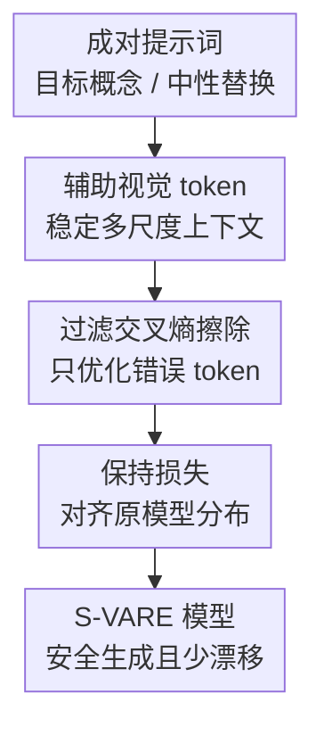

# Closing the Safety Gap: Surgical Concept Erasure in Visual Autoregressive Models

**会议**: ICLR 2026  
**OpenReview**: [https://openreview.net/forum?id=tlYSbw5GXY](https://openreview.net/forum?id=tlYSbw5GXY)  
**代码**: https://github.com/ndhg1213/S-VARE  
**领域**: AI安全 / 视觉自回归生成 / 概念擦除  
**关键词**: 概念擦除, 视觉自回归模型, 文生图安全, NSFW防护, 模型编辑  

## 一句话总结
这篇论文针对视觉自回归文生图模型缺少安全概念擦除机制的问题，提出 VARE 与 S-VARE，用辅助视觉 token 稳定擦除训练，并用过滤交叉熵和保持损失实现“只删目标概念、尽量不伤生成能力”的外科式概念擦除。

## 研究背景与动机
**领域现状**：文生图模型已经从扩散模型扩展到视觉自回归模型（Visual Autoregressive Model, VAR）。这类模型不再按像素栅格顺序生成，也不预测扩散过程里的噪声，而是把图像表示成多尺度离散视觉 token，并按从粗到细的尺度逐级预测。Infinity 这类模型进一步用 bit-wise quantization 支撑高分辨率文生图，说明 VAR 正在成为扩散模型之外的一条重要生成路线。

**现有痛点**：安全治理却没有同步跟上。扩散模型里已经有不少概念擦除（Concept Erasure, CE）方法，可以擦掉 nudity、暴力、特定物体、特定艺术风格等不希望模型生成的概念；但这些方法大多围绕 U-Net、cross-attention 或扩散噪声预测设计。把它们直接搬到 VAR 上，会遇到两个问题：一是 VAR 的预测目标是离散视觉 token 或 bit 概率，不是连续噪声；二是 VAR 的 next-scale 生成强依赖前面尺度，某一层 token 对齐出错会在后续尺度里逐级放大。

**核心矛盾**：安全擦除需要足够强的参数更新，才能让模型在看到危险概念提示词时不再生成对应内容；但 VAR 的自回归尺度链条又非常脆弱，粗尺度的小偏差会影响细尺度的所有后续预测。于是，“擦得干净”和“图像质量、语义一致性不崩”之间形成了比扩散模型更尖锐的 trade-off。

**本文目标**：作者要解决的不是一般的图像生成质量提升，而是 VAR 文生图模型的后训练安全编辑：给定一个需要移除的目标概念，让微调后的模型在相关提示词下不再生成该概念，同时仍能保持无关概念、正常人体部位、其他物体类别、整体风格和 prompt-following 能力。

**切入角度**：作者观察到，扩散式 CE 失败的根源不是“有没有替换提示词”这么简单，而是 VAR 训练时的 token 条件不稳定。若在目标提示词和中性提示词之间独立对齐各尺度输出，训练看到的是不断漂移的条件上下文，导致误差沿尺度累积。与其让模型自己在不稳定 token 序列里硬对齐，不如给视觉 Transformer 提供由原模型生成的辅助视觉 token，把搜索空间缩小到“在同一套稳定视觉上下文中改变目标概念响应”。

**核心 idea**：用辅助视觉 token 固定 VAR 的生成上下文，再只对真正错误且和目标概念相关的 token/bit 施加擦除压力，同时用教师模型保持损失约束无关提示词下的输出分布。

## 方法详解
本文的方法分两层：第一层是 VARE 框架，解决“扩散 CE 如何稳定迁移到 VAR”的输入和条件问题；第二层是 S-VARE 损失，解决“在 VAR 的 bit 概率空间里如何精确擦除、避免过度优化”的目标函数问题。最终训练时只微调 Infinity-2B 的 cross-attention 和 FFN 模块，原模型作为 teacher 提供辅助 token 与保持目标。

### 整体框架
整体流程从一组成对提示词开始：$c^*$ 是包含待擦除概念的目标提示词，例如包含 nudity、church 或 Van Gogh；$c$ 是语义上尽量一致、但去掉或替换目标概念的中性提示词。原始 VAR 模型先在中性提示词下生成辅助视觉 token 序列 $r^{ori}$，微调模型随后在同一套辅助 token 条件下处理目标提示词，只需把目标概念对应的视觉响应推向中性概念，而不必重新学习整条多尺度生成链。

如果不用辅助 token，最直接的做法是把扩散模型里的 MSE 对齐改写成逐尺度 token 对齐：让微调模型在 $c^*$ 下的预测接近原模型在 $c$ 下的预测。但 VAR 的尺度条件 $r_{<i}$ 是一串历史预测，当前尺度的轻微错误会改变下一尺度的输入，后面所有尺度都会在错误上下文里继续优化。VARE 的关键变化是把条件写成 $p_{\theta^*}(r_i \mid r^{ori}_{<i}, c^*)$ 与 $p_{\theta}(r_i \mid r^{ori}_{<i}, c)$ 的对齐：两边共享来自原模型的辅助视觉 token，从而把问题从“不稳定自回归轨迹之间的追赶”变成“稳定轨迹上的概念响应修正”。

在这个框架上，S-VARE 不再使用连续空间 MSE 作为主损失。Infinity 的预测经过 binary spherical quantization（BSQ），每个 token 可以看成多个 bit 上的二分类概率，因此作者改用 bit-wise cross entropy 来衡量目标 token 是否被正确推向中性替换，并且只保留真正需要改的 token。最后，保持损失让微调模型在中性提示词 $c$ 下模仿原模型，避免为了擦除一个概念而把语言理解、图像多样性或无关类别一起破坏掉。

### 关键设计
**1. 辅助视觉 token：把 VAR 擦除从漂移轨迹拉回稳定上下文**

扩散 CE 方法默认不同 timestep 的噪声预测可以相对独立对齐，但 VAR 的每个尺度都依赖前面尺度的 token。若训练时让目标提示词 $c^*$ 和中性提示词 $c$ 各自生成自己的历史 token，再对齐第 $i$ 个尺度的输出，两个分支的历史条件本身就可能已经不一致。这样优化出的误差不是“目标概念差异”，而是“目标概念差异 + 历史 token 漂移 + 尺度累积误差”的混合物，很容易把图像结构也拖垮。

VARE 的处理方式是用原模型在中性提示词下生成的 $r^{ori}$ 作为辅助视觉 token，并把它作为微调模型和 teacher 的共同条件。原始的朴素损失可以写成 $\|p_{\theta^*}(r_i \mid r_{<i}, c^*) - p_{\theta}(r_i \mid r_{<i}, c)\|_2^2$，而 VARE 改成 $\|p_{\theta^*}(r_i \mid r^{ori}_{<i}, c^*) - p_{\theta}(r_i \mid r^{ori}_{<i}, c)\|_2^2$。这个变化看似只是替换条件 token，实质上是在消除 VAR 自回归链条里最危险的变量：模型不再被迫在两个不断分叉的视觉历史之间对齐，而是在同一条参考视觉轨迹上学习“看到危险词时应输出什么”。

**2. 过滤交叉熵擦除：只打击目标概念相关的错误 bit**

VARE 先解决稳定性，但如果继续用 MSE 回归概率或 token 表示，仍然和 Infinity 的训练范式不匹配。Infinity 使用 BSQ，把视觉 token 的预测转成 bit-wise 概率空间；对这样的模型来说，cross entropy 比 MSE 更接近原始训练目标，也更适合表达“某个 bit 是否应该翻转”。S-VARE 因此把擦除目标写成过滤交叉熵（Filtered Cross Entropy, $L_{FCE}$），先在 bit 级别计算二元交叉熵，再根据 token 内错误 bit 比例决定这个 token 是否纳入优化。

过滤机制的关键是避免“本来已经对的 token 也被反复优化”。作者用 $\gamma=-\log(1/2)$ 作为 bit 级阈值：如果某个 bit 的交叉熵高于随机猜测水平，说明它在当前目标上还不够可靠。然后在 token 级别统计错误 bit 的比例，只有当错误比例超过 $\alpha$ 时，mask $F_i$ 才让该 token 参与损失；论文默认 $\alpha=25\%$，与 Infinity 训练中的 bit-wise self-correction 范围一致。直观上，这等于只对“足够不像中性目标”的 token 加压力，而不是把所有 token 都朝同一方向推。

**3. 保持损失：用原模型约束无关概念与生成多样性**

安全擦除常见副作用是 language drift 和 diversity reduction：模型虽然不生成目标概念了，但也可能听不懂细粒度提示词，或者把许多无关概念一起误删。对 VAR 来说，这个问题尤其明显，因为 cross-attention 和 FFN 一旦被强力微调，文本条件到视觉 token 的映射会整体偏移。S-VARE 因此加入 preservation loss，让微调模型在中性提示词 $c$ 下对齐原模型的输出分布。

这个保持项不是简单约束参数变化，而是在每个尺度上用 KL divergence 对齐 teacher 与 student：$L_{Pre}=\sum_i D_{KL}(p_{\theta}(r_i \mid r^{ori}_{<i}, c) \| p_{\theta^*}(r_i \mid r^{ori}_{<i}, c))$。这样做的好处是约束直接落在生成行为上：对不含危险概念的提示词，微调模型应该像原模型一样预测 token 分布；只有当提示词包含待擦除概念时，$L_{FCE}$ 才推动它偏离原来的危险响应。最终目标为 $L_{FCE}+L_{Pre}$，两项权重相同。

**4. 只微调 CA + FFN：把修改集中在文本-图像交互和语义变换处**

论文并没有全量微调 Infinity-2B，而是选择 cross-attention（CA）和 feed-forward network（FFN）作为优化目标。CA 直接承担文本条件到视觉 token 的关联，目标概念是否触发图像里的对应元素，很大程度上通过 CA 传递；FFN 则提供后续非线性语义变换和稳定性。只调 self-attention 对复杂提示词的擦除不够强，只调 CA 又容易让图像偏离原模型，CA + FFN 在 erasure 和 preservation 之间更均衡。

这个选择也体现了“surgical”的含义：方法不是把模型整体能力洗掉，而是尽量把更新限制在与目标概念响应最相关的模块。附录实验显示，加入 SA 虽然可以略微降低攻击成功率，但 FID/CLIP 和计算成本会变差，因此默认不纳入优化。

### 损失函数 / 训练策略
训练数据由 50 对提示词构成，每对包含一个目标概念提示词 $c^*$ 和一个语义一致的中性替换提示词 $c$。基础模型是 Infinity-2B，训练 500 iterations，batch size 为 2，优化器为 AdamW，学习率 $2 \times 10^{-3}$，量化精度 bf16，分辨率为 $1024 \times 1024$。作者在 NSFW、object、style 三类擦除任务上使用同一组训练超参，强调方法不依赖任务特定调参。

总损失由两部分组成：$L_{FCE}$ 负责把目标概念下的视觉 token 推向中性替代，$L_{Pre}$ 负责在中性提示词上保持原模型行为。两者权重相同，因此训练目标不是“越强擦除越好”，而是在 target response 和 non-target preservation 之间找一个稳定平衡点。默认过滤阈值 $\alpha=25\%$：如果阈值过低，擦除强但生成质量略差；如果阈值过高，更多 token 被过滤掉，图像质量可能提升但攻击成功率明显上升。

## 实验关键数据

### 主实验
论文把 S-VARE 与改造到 VARE 框架内的 UCE、FMN、ESD、AC 等扩散 CE 基线比较，覆盖 NSFW 擦除、物体擦除和风格擦除。最重要的结论是：很多基线也能降低目标概念出现率，但代价是图像质量、无关类别准确率或 prompt-following 大幅下降；S-VARE 的优势在于擦除强度和保持能力同时较好。

| 任务 | 指标 | 原模型 | 最强相关基线 | S-VARE | 结论 |
|------|------|--------|--------------|--------|------|
| NSFW 擦除 | Sensitive count ↓ | 158 | ESD-u: 21 / FMN: 22 | 5 | S-VARE 几乎清除 nudity 相关敏感内容 |
| NSFW 擦除 | Common count ↑ | 112 | UCE: 100, 但擦除弱 | 57 | 保留正常人体/普通内容优于多数强擦除基线 |
| 物体擦除 church | ACCe ↓ | 94.2% | ESD-x: 3.8% | 4.4% | 擦除目标类别接近最强基线 |
| 物体擦除 church | ACCi ↑ | 76.0% | AC-N: 68.9% | 75.7% | 无关类别几乎不受影响 |
| 风格擦除 Van Gogh | ACC ↓ | 76.0% | AC-M: 12.8% | 8.2% | 能有效抑制指定艺术风格 |
| 通用质量 | FID ↓ / CLIP ↑ | 31.1 / 31.7 | 多数基线 FID 33.2-37.8 | 32.1-32.8 / 31.3-31.6 | 质量退化很小 |

在 Imagenette 多类别物体擦除上，S-VARE 对不同类别也比较稳定。平均来看，目标类别准确率从 77.9% 降到 2.5%，无关类别准确率只从 77.9% 降到 76.9%，CLIP 从 31.7 变为 31.4。这说明方法不是只对 church 一个例子有效，而是能泛化到 cassette player、chain saw、gas pump、golf ball 等不同视觉概念。

| 实验设置 | 目标概念指标 | 无关概念指标 | FID | CLIP | 说明 |
|----------|--------------|--------------|-----|------|------|
| Imagenette 平均原模型 | ACCe 77.9% | ACCi 77.9% | 31.1 | 31.7 | 未擦除时目标类和无关类都能生成 |
| Imagenette 平均 S-VARE | ACCe 2.5% | ACCi 76.9% | 32.1 | 31.4 | 目标类被清除，无关类基本保留 |
| 同时擦除 1 类 | ACCe 3.8% | - | 32.4 | 31.7 | 单概念擦除最稳定 |
| 同时擦除 10 类 | ACCe 3.7% | - | 34.2 | 30.8 | 多概念擦除仍可行，但质量略降 |

### 消融实验
消融集中在两类问题：损失函数是否真的必要，以及过滤阈值/优化模块如何影响 erasure-preservation 平衡。以 church 擦除为例，VARE 的基础损失已经能把 ACCe 降到 9.8%，但无关类别 ACCi 只有 68.9，FID 为 35.3；加入 $L_{FCE}$ 后，ACCe 降到 4.1%，ACCi 提升到 73.5，FID 降到 32.4；再加 $L_{Pre}$ 后，ACCe 仍保持 4.4%，ACCi 进一步到 75.7，FID 到 31.5，CLIP 到 31.6。

| 配置 | ACCe ↓ | ACCi ↑ | FID ↓ | CLIP ↑ | 说明 |
|------|--------|--------|-------|--------|------|
| VARE basic | 9.8 | 68.9 | 35.3 | 30.6 | 辅助 token 稳定了训练，但质量保持不够 |
| + $L_{FCE}$ | 4.1 | 73.5 | 32.4 | 31.2 | 过滤交叉熵提升擦除精度并减少视觉崩坏 |
| + $L_{Pre}$ | 4.4 | 75.7 | 31.5 | 31.6 | 保持损失进一步恢复无关生成能力 |

过滤阈值 $\alpha$ 的消融也很直观：在 Ring-A-Bell adversarial prompt 上，$\alpha=0$ 时 ASR 为 7.2%、FID 33.6；$\alpha=25\%$ 时 ASR 7.4%、FID 32.8、CLIP 31.3，是论文默认选择；当 $\alpha$ 提高到 50% 和 75%，ASR 分别升到 21.7% 和 40.2%，说明过滤过强会让太多目标 token 逃过优化。

### 关键发现
- VARE 是把扩散 CE 基线迁移到 VAR 的前提；没有辅助视觉 token，直接逐尺度对齐会导致严重质量崩坏。
- $L_{FCE}$ 主要负责“擦得准”：它把损失从连续 MSE 改到 bit-wise CE，并用 token mask 避免无差别过度优化。
- $L_{Pre}$ 主要负责“别误伤”：它让中性提示词下的微调模型贴近原模型，因此无关类别 ACCi 和 CLIP/FID 恢复明显。
- 在对抗提示词上，S-VARE 也能降低 nudity 触发率，例如 Ring-A-Bell 的 ASR 从 75.9% 降到 7.4%，Normal prompts 的 ASR 从 53.0% 降到 3.0%。
- 多概念擦除会带来一定质量损失，但目标类别准确率仍能维持在 4% 左右，说明方法有扩展到批量安全策略的潜力。

## 亮点与洞察
- 最有价值的点是作者没有把“扩散 CE 方法迁移失败”归因于实现细节，而是抓住了 VAR 的 next-scale dependency。辅助视觉 token 这个设计非常朴素，但正好卡住了误差累积的源头。
- S-VARE 的“外科式”主要体现在 token/bit 粒度过滤，而不是只在参数层面少调几个模块。它只优化错误比例超过阈值的 token，让擦除压力集中在真正需要改的地方。
- preservation loss 的设计很实用：它不依赖人工列出大量无关概念，而是用同一批中性提示词把原模型输出分布当作 teacher，成本低且和 VAR 多尺度输出天然匹配。
- 这篇论文提示了一个更广的安全问题：生成模型安全方法不能默认扩散模型范式成立。随着自回归、flow matching、统一多模态模型增多，安全编辑必须贴合每类生成机制的预测目标和条件结构。
- 对实际部署来说，50 对 prompt、500 iterations、只调 CA + FFN 的设置相对轻量，适合在发现新危险概念后做后训练热修复，而不是重新清洗数据和重训模型。

## 局限与展望
- 实验基础模型主要是 Infinity-2B，因为当前公开可用的大规模文生图 VAR 模型有限；方法能否无缝迁移到更多 VAR 或统一多模态生成架构，还需要后续验证。
- 论文主要评估 nudity、Imagenette 物体类别和 Van Gogh 风格三类概念，对更抽象的安全概念、组合型危险意图、上下文依赖的有害内容覆盖还不够。
- adversarial prompt 评估借用了扩散模型中的攻击数据集，并非专门针对 VAR 设计。真正的 VAR white-box 或 black-box 攻击可能会暴露新的失败模式。
- 多概念擦除虽然可行，但擦除数量增加后 FID 和 CLIP 有下降趋势。未来可以研究概念间冲突建模、动态阈值或分层擦除策略，减少批量安全策略的累积损伤。
- 方法仍然需要构造成对提示词。如果中性替换词选择不当，模型可能学习到错误的语义迁移；后续可以引入自动 prompt pair 质量评估或基于人类偏好的安全目标。

## 相关工作与启发
- **vs ESD / AC**: ESD 和 AC 在扩散模型里通过对齐噪声预测实现概念擦除，S-VARE 则指出 VAR 没有同样的噪声预测目标，直接用 MSE 对齐 token 会造成尺度误差累积。S-VARE 的优势是更贴合自回归 token 生成机制，劣势是需要访问 VAR 的 token/bit 预测过程。
- **vs FMN**: FMN 通过压低目标词相关 attention activation 来遗忘概念，但在 VAR 上会产生明显色块和图像质量下降。S-VARE 不只看 attention 强度，而是直接在视觉 token 概率空间里控制目标概念输出，因此更接近最终生成行为。
- **vs UCE**: UCE 的闭式编辑高效，但在本文的 VAR 场景几乎擦不动目标概念，作者认为 T5 文本编码器和视觉 Transformer 对词嵌入扰动很鲁棒。S-VARE 需要微调，成本更高，但效果明显更可靠。
- **vs 传统安全过滤**: 预训练数据过滤和后处理安全分类器都不是模型内部能力编辑：前者重训成本高，后者容易被绕过且不能改变模型倾向。S-VARE 属于后训练模型编辑，更适合在新风险概念出现后快速补洞。
- **启发**: 对其他非扩散生成模型做安全编辑时，应先问两个问题：模型真正预测的对象是什么，历史条件是否会累积漂移。只要这两点不同，安全损失就不能直接照搬扩散模型。

## 评分
- 新颖性: ⭐⭐⭐⭐⭐ 首次系统处理 VAR 文生图模型的概念擦除，并把辅助 token、过滤 CE、保持损失组合成专门框架。
- 实验充分度: ⭐⭐⭐⭐ 覆盖 NSFW、物体、风格、对抗提示词、多概念和多组消融，但公开模型和安全概念类型仍偏有限。
- 写作质量: ⭐⭐⭐⭐ 问题定义和实验结论清楚，部分公式符号与损失正负号表述略需读者结合上下文确认。
- 价值: ⭐⭐⭐⭐⭐ 对文生图安全部署很直接，尤其适合 VAR/Infinity 这类新生成范式的后训练风险修补。

<!-- RELATED:START -->

## 相关论文

- [\[CVPR 2026\] ClusterMark: Towards Robust Watermarking for Autoregressive Image Generators with Visual Token Clustering](../../CVPR2026/ai_safety/clustermark_towards_robust_watermarking_for_autoregressive_image_generators_with.md)
- [\[CVPR 2026\] Selective Amnesia using Contrastive Subnet Erasure for Class Level Unlearning in Vision Models](../../CVPR2026/ai_safety/selective_amnesia_using_contrastive_subnet_erasure_for_class_level_unlearning_in.md)
- [\[CVPR 2026\] Hidden Dangers of Compositional Generation: Diagnosing Semantic Safety Failures in Text-to-Image Models](../../CVPR2026/ai_safety/hidden_dangers_of_compositional_generation_diagnosing_semantic_safety_failures_i.md)
- [\[CVPR 2026\] Roots Beneath the Cut: Uncovering the Risk of Concept Revival in Pruning-Based Unlearning for Diffusion Models](../../CVPR2026/ai_safety/roots_beneath_the_cut_uncovering_the_risk_of_concept_revival_in_pruning-based_un.md)
- [\[ICLR 2026\] Concept-Aware Privacy Mechanisms for Defending Embedding Inversion Attacks](concept-aware_privacy_mechanisms_for_defending_embedding_inversion_attacks.md)

<!-- RELATED:END -->
