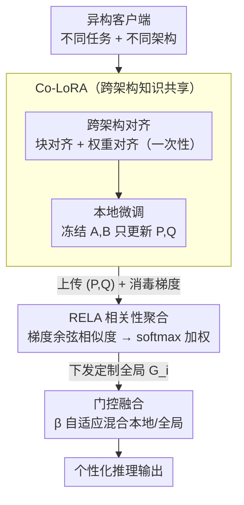

# Co-LoRA: Collaborative Model Personalization on Heterogeneous Multi-Modal Clients

**会议**: ICLR2026  
**arXiv**: [2506.11024](https://arxiv.org/abs/2506.11024)  
**代码**: [https://github.com/snumprlab/fedmosaic](https://github.com/snumprlab/fedmosaic)  
**领域**: AI安全  
**关键词**: personalized federated learning, LoRA, model heterogeneity, multimodal, knowledge sharing

## 一句话总结
提出 FedMosaic 框架解决个性化联邦学习中的双重异构问题：RELA 通过梯度相似度度量任务相关性实现定制化聚合（解决数据异构），Co-LoRA 通过维度不变的 $P \in \mathbb{R}^{r \times r}, Q \in \mathbb{R}^r$ 模块实现跨异构架构（如 Llama vs Qwen）的知识共享（解决模型异构），在新提出的 40 任务多模态 PFL benchmark DRAKE 上大幅超越 SOTA。

## 研究背景与动机

**领域现状**：个性化联邦学习（PFL）让各客户端协作学习但保留隐私。现有 PFL 方法如 DITTO、FedDAT 通过双 adapter（本地+全局）设计处理数据异构，但假设所有客户端使用相同模型架构。

**现有痛点**：(a) **数据异构**——现有 benchmark 用同一数据集的 non-IID 切分模拟异构，不真实（真实世界中客户端做不同任务）；(b) **模型异构**——不同客户端有不同硬件，使用不同模型族（Llama vs Qwen）和规模（1B vs 3B），LoRA 矩阵维度不同无法直接平均；(c) 现有处理模型异构的方法（HETLoRA、FlexLoRA）假设基础架构相同只是 rank 不同，不支持真正异构的架构。

**核心矛盾**：LoRA 的 $A \in \mathbb{R}^{r \times d_I}$ 和 $B \in \mathbb{R}^{d_O \times r}$ 矩阵依赖模型特定的隐藏维度 $d_I, d_O$，不同架构维度不同→无法聚合。同时朴素平均不同任务的模型会产生参数干扰。

**本文目标** 同时处理数据异构（客户端做不同任务）和模型异构（客户端用不同架构/规模），在真实多模态 PFL 场景中实现有效协作。

**切入角度**：在 LoRA 中间插入仅依赖 rank $r$ 的维度不变模块 $P, Q$——只聚合这些模块就能跨架构传递知识。

**核心 idea**：用维度不变的 Co-LoRA 模块实现跨架构知识共享 + 用梯度相似度驱动的相关性聚合减少任务干扰。

## 方法详解

### 整体框架
FedMosaic 要在「客户端做不同任务、还用不同模型架构」的双重异构下让各方有效协作。正式联邦训练开始前，先做一次性的跨架构对齐（块对齐 + 权重对齐），让不同模型族的冻结 $A, B$ 子空间可比。之后每一轮通信里，客户端在本地用 Co-LoRA 微调，把维度不变的 $(P_i, Q_i)$ 模块连同一份消毒过的梯度 $\tilde{g}_i$ 上传；服务端用 RELA 根据梯度算出客户端两两之间的任务相关性，据此为每个客户端单独拼出一个定制化的全局 Co-LoRA $G_i$ 再下发，客户端拿到后冻结使用。推理时，本地 LoRA 携带的个性化知识和全局 Co-LoRA 携带的共享知识，通过一个可学习的门控 $\beta$ 自适应融合。整套设计把「跨架构传知识」和「跨任务选着传」拆给了 Co-LoRA 和 RELA 两个模块各自负责。

### 关键设计

**1. Co-LoRA（Collaborative LoRA）：插一个只依赖 rank 的模块，让不同架构的知识能直接相加**

普通 LoRA 的 $A \in \mathbb{R}^{r \times d_I}$、$B \in \mathbb{R}^{d_O \times r}$ 维度都绑死在模型隐藏维 $d_I, d_O$ 上，Llama 和 Qwen 这种异构架构维度不同，矩阵根本没法对齐相加。Co-LoRA 把一个新模块塞进 $A$ 和 $B$ 中间：

$$h_O = W_p h_I + B(PA h_I + Q)$$

其中 $P \in \mathbb{R}^{r \times r}$、$Q \in \mathbb{R}^r$ 的尺寸只跟 rank $r$ 有关、与隐藏维无关，因此不同架构上的 $P, Q$ 可以直接聚合。训练时冻结 $A, B$ 以保持表征对齐，只更新 $P, Q$，聚合的也只是这两个小矩阵。

要让冻结的 $A, B$ 在不同模型间真正可比，需要两步对齐。**块对齐**解决「哪一层对哪一层」：CKA 分析显示不同深度的模型在相对位置上的层表征最相似，于是把模型按相对深度切成 $N_B$ 块，每块最后一层挂一个 Co-LoRA，只在对应块之间做聚合，避免深浅模型层数不等时层与层错配。**权重对齐**解决「同一层的子空间怎么对齐」：$A$ 矩阵用 L2 loss 在少量公共数据上对齐到统一的 $r$ 维表征；$B$ 矩阵用 CCA 找出最大相关的投影空间，先投到共享空间、用完再反投回各自模型，并施加正交约束以最大化表达能力（Theorem 1 证明此时权重更新张成的空间为 $r^2$ 维）。相比需要传公共数据 logits 的联邦蒸馏，Co-LoRA 只交换小矩阵，更轻量也更隐私安全；相比只能处理「同架构、不同 rank」的 HETLoRA，它能跨真正异构的模型族。

**2. RELA（Relevance-Guided Aggregation）：按任务相关性定制聚合，而不是一刀切平均**

朴素平均所有客户端的模型，会把不相关任务的参数硬揉到一起、相互干扰，这正是 FedAvg 在真实异构场景里反而不如不协作的根源。RELA 的做法是让聚合「看任务亲疏」：每个客户端从一个小预训练模型里提取最后一层的梯度 $g_i$ 作为任务画像，用 EMA 更新它以反映分布漂移，再加高斯噪声、做随机维度采样把它消毒成 $\tilde{g}_i$ 后上传。服务端计算两两余弦相似度矩阵 $S_{ij} = \cos(\tilde{g}_i, \tilde{g}_j)$，经 softmax 归一化得到权重，再做加权聚合 $G_i = \sum_j w_{ij} L_j$——于是每个客户端只重点吸收与自己任务相近的同伴知识，冲突更小。这里用 EMA 梯度而非累计梯度，是因为前者反映模型「当前」的知识状态（把遗忘也算进去了），对相关性的刻画更准。

**3. 门控融合：让每层自己决定全局知识占多少**

本地 LoRA 偏个性化、全局 Co-LoRA 偏共享，二者该按什么比例混合并非固定——不同层、不同任务对全局知识的需求量不一样。于是用一个可学习门控自适应调节：

$$h_O = W_p h_I + (1-\tilde{\beta})h_L + \tilde{\beta}h_G, \quad \tilde{\beta} = \sigma(\beta)$$

$\tilde{\beta}$ 由可学习参数 $\beta$ 过 sigmoid 得到，训练中自动学出每处该更靠本地还是更靠全局。

### 损失函数 / 训练策略
$A/B$ 的对齐只在联邦训练正式开始前做一次，属一次性开销，之后整个联邦过程不再重复。通信上只需上传 $P \in \mathbb{R}^{r \times r}$ 和 $Q \in \mathbb{R}^r$，比传完整 LoRA 小得多。隐私上靠「梯度 EMA + 高斯噪声 + 随机维度采样」三件套来消毒上传的梯度画像。

## 实验关键数据

### 主实验（DRAKE Benchmark，40 任务）

| 方法 | 同构设置 (Avg Acc) | 异构设置 (Avg Acc) | 说明 |
|------|-------------------|-------------------|------|
| Local only | 基线 | 基线 | 无联邦协作 |
| FedAvg | 低于 Local | 不适用 | 朴素平均有害 |
| DITTO | 中等 | 不适用 | 双 adapter 但不支持异构 |
| FedDAT | 中等偏上 | 不适用 | 同上 |
| HETLoRA | - | 中等 | 只处理 rank 异构 |
| **FedMosaic** | **最优** | **最优** | 显著超越所有方法 |

### 消融实验

| 配置 | Acc 变化 | 说明 |
|------|---------|------|
| Full FedMosaic | 最优 | 完整方法 |
| w/o RELA（用 FedAvg） | 下降 | 任务干扰 |
| w/o Co-LoRA（用 HETLoRA） | 下降 | 架构异构处理不足 |
| w/o 块对齐 | 下降 | 层对应错误 |
| w/o 权重对齐 | 下降 | 优化轨迹不一致 |
| w/o 门控 $\beta$ | 下降 | 全局/本地知识固定比例不佳 |

### 关键发现
- **FedAvg 在真实异构场景中比不协作还差**：朴素平均不相关任务的模型产生严重参数干扰
- **RELA 的选择性聚合至关重要**：只与相关客户端协作显著优于全局平均
- **Co-LoRA 成功跨架构传递知识**：Llama-1B ↔ Llama-3B 和 Llama-1B ↔ Qwen-3B 都能有效协作
- **CKA 验证层对齐假设**：不同深度模型的相对位置层有最高表征相似度，支持块对齐策略
- **通信开销极低**：只传 $P(r^2)$ 和 $Q(r)$ 参数 + 消毒梯度

## 亮点与洞察
- **维度不变模块是跨架构联邦学习的优雅解决方案**：$P \in \mathbb{R}^{r \times r}$ 只依赖 rank 不依赖隐藏维度——这个设计思想可以推广到任何需要跨架构知识传递的场景
- **梯度消毒三件套**：EMA 混合 + 高斯噪声 + 随机维度采样——每一步都有隐私理论支撑，整体方案实用且安全
- **DRAKE benchmark 填补多模态 PFL 评估空白**：40 个不同任务 + 分布漂移 + 多图像输入——比之前 non-IID MNIST 的评估真实得多
- **Theorem 1 的正交约束保证**：冻结正交 A/B 下，Co-LoRA 的权重更新空间维度为 $r^2$（最大可能）——从理论上保证了表达能力

## 局限与展望
- **DRAKE 任务数 40 偏少**：真实 agentic AI 场景可能有数百个任务类型，scalability 需验证
- **公共数据需求**：A/B 对齐需要公共数据（虽然很少量），在极端隐私场景下可能不可接受
- **只测试了 1B/3B 规模**：7B/13B 以上规模是否有效、通信成本是否仍然可控？
- **rank r 需要所有客户端统一**：如果客户端需要不同 rank 的 LoRA，Co-LoRA 目前不支持

## 相关工作与启发
- **vs HETLoRA/FlexLoRA**：它们只处理同一架构不同 rank 的异构，本质上假设 $d_I, d_O$ 相同。Co-LoRA 处理真正的架构异构（不同模型族、不同深度、不同维度）
- **vs FedMD/FedMKT**：联邦蒸馏通过公共数据 logits 传递知识，但 logit 提取对大模型计算昂贵、且有梯度反演隐私风险。Co-LoRA 只传小矩阵，更安全更高效
- **vs DITTO**：DITTO 保留本地/全局双 adapter，但全局用朴素平均。FedMosaic 用 RELA 做任务感知聚合 + Co-LoRA 支持异构

## 评分
- 新颖性: ⭐⭐⭐⭐⭐ 维度不变模块、梯度相关性聚合、块对齐/权重对齐的组合设计系统且新颖
- 实验充分度: ⭐⭐⭐⭐ 40 任务 benchmark 全面，消融充分，但缺少更大规模模型实验
- 写作质量: ⭐⭐⭐⭐ 问题定义清晰，方法推导严谨，但篇幅很长
- 价值: ⭐⭐⭐⭐⭐ 为异构联邦学习提供了可行的实用方案，DRAKE benchmark 有持续价值

<!-- RELATED:START -->

## 相关论文

- [\[CVPR 2026\] Multi-Paradigm Collaborative Adversarial Attack Against Multi-Modal Large Language Models](../../CVPR2026/ai_safety/multi-paradigm_collaborative_adversarial_attack_against_multi-modal_large_langua.md)
- [\[ECCV 2024\] Towards Multi-modal Transformers in Federated Learning](../../ECCV2024/ai_safety/towards_multi-modal_transformers_in_federated_learning.md)
- [\[ICML 2025\] Private Model Personalization Revisited](../../ICML2025/ai_safety/private_model_personalization_revisited.md)
- [\[ICML 2026\] One Model to Translate Them All: Universal Any-to-Any Translation for Heterogeneous Collaborative Perception](../../ICML2026/ai_safety/one_model_to_translate_them_all_universal_any-to-any_translation_for_heterogeneo.md)
- [\[CVPR 2026\] FedRE: A Representation Entanglement Framework for Model-Heterogeneous Federated Learning](../../CVPR2026/ai_safety/fedre_a_representation_entanglement_framework_for_model-heterogeneous_federated_.md)

<!-- RELATED:END -->
