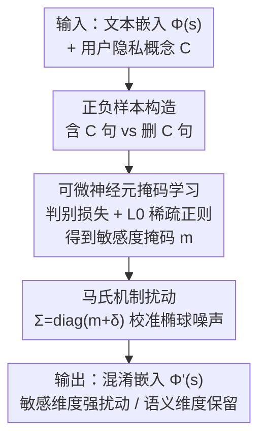

# Concept-Aware Privacy Mechanisms for Defending Embedding Inversion Attacks

**会议**: ICLR 2026  
**OpenReview**: [https://openreview.net/forum?id=bcOD0CLgBb](https://openreview.net/forum?id=bcOD0CLgBb)  
**代码**: 无  
**领域**: AI安全 / 隐私保护  
**关键词**: 嵌入反演攻击、差分隐私、概念级隐私、马氏机制、文本嵌入

## 一句话总结
针对"差分隐私防御对所有嵌入维度无差别加噪、导致语义被破坏"的痛点，本文提出 SPARSE：先用可微神经元掩码学习定位与用户指定隐私概念相关的敏感维度，再用马氏机制（Mahalanobis mechanism）注入按维度敏感度校准的椭球噪声，从而只扰动敏感维度、保留非敏感语义，在六个数据集上同时降低隐私泄露并保住下游效用。

## 研究背景与动机
**领域现状**：文本嵌入（Sentence-T5、SBERT 等）是 NLP 应用尤其是 RAG 系统的基础，但近年研究揭示嵌入会被"嵌入反演攻击"反推——Vec2Text 甚至能从 T5 嵌入恢复 32-token 输入中 92% 的内容，GEIA 能重建整句，攻击者可从中抽取姓名、疾病等敏感信息。差分隐私（DP）因其严格保证成为主流防御框架。

**现有痛点**：现有 DP 防御（如广义拉普拉斯机制 LapMech、Purkayastha 机制 PurMech）隐含假设"嵌入每一维携带的隐私敏感度都相同"，于是向所有维度无差别注入各向同性（球形）噪声。这有两个问题：一是隐私是因人、因情境而异的（有人在意病情、有人在意政治立场），无差别保护并不贴合真实需求；二是为了覆盖所有可能的敏感信息，必须在全维度注入大量噪声，不可避免地严重损害下游效用。

**核心矛盾**：根本原因在于 DP 机制的"均匀噪声"与嵌入维度的"异质性"之间的错配。作者的预备分析发现，嵌入的不同维度对特定概念的隐私敏感度差异很大——有些维度高度编码医疗状况，有些维度主要承载非敏感的通用语义，但球形噪声把它们一视同仁。

**本文目标**：分解为两个子问题——(1) 识别对给定隐私概念而言哪些维度是敏感的；(2) 设计一个能按维度敏感度校准噪声、且仍保留 DP 理论保证的机制。

**切入角度**：既然敏感信息集中在少数维度，那就把噪声"省"在非敏感维度上、把扰动集中砸到敏感维度上，用各向异性的椭球噪声替代各向同性的球形噪声。

**核心 idea**：用"可微掩码定位敏感维度 + 马氏椭球噪声按维度敏感度加噪"代替"全维度球形加噪"，实现用户自定义概念的精准隐私保护。

## 方法详解

### 整体框架
SPARSE（Sensitivity-guided Privacy-Aware Representations for better SEmantic-preserving）是一个以用户为中心的两阶段框架。输入是一句含敏感信息的文本及其嵌入 $\Phi(s)$，以及用户定义的隐私概念 $C$（一组要保护的 token，如姓名、疾病）；输出是一个混淆后的嵌入 $\Phi'(s)$，使攻击模型无法准确重建 $C$ 中的 token，同时尽量不损伤下游任务效用。

整体分两步：第一步**神经元掩码学习**，通过构造"含概念/去概念"的正负样本对，训练一个稀疏掩码 $m\in[0,1]^n$ 来估计每一维对概念 $C$ 的敏感度；第二步**马氏机制扰动**，把掩码 $m$ 当作椭球噪声的协方差对角元，对敏感维度（$m_i$ 大）注入更强噪声、对非敏感维度（$m_i$ 小）几乎不动。

### 关键设计

**1. 可微神经元掩码学习：把"哪些维度敏感"变成可梯度优化的稀疏掩码**

要按维度差异加噪，首先得知道哪些维度对概念 $C$ 敏感，但"选维度"本质是离散二值选择、不可微。作者用硬具体分布（HardConcrete）做平滑近似：每个掩码 $m_i$ 由可学习的位置 $\alpha_i$ 与温度 $\beta_i$ 参数化，经 $s_i=\sigma\!\left(\frac{1}{\beta_i}\big(\log\frac{\mu_i}{1-\mu_i}+\log\alpha_i\big)\right)$、$m_i=\min(1,\max(0,s_i(\xi-\gamma)+\gamma))$ 得到（$\xi=1.1,\gamma=-0.1$，$\mu_i\sim U(0,1)$），借重参数化技巧把"近似 Bernoulli 采样"变得可反传，推断阶段则用确定性的硬门 $m_i=\min(1,\max(0,\sigma(\log\alpha_i)(\xi-\gamma)+\gamma))$。

掩码的监督信号来自一对精心构造的数据集：正集 $D^+$ 是含概念 token 的句子，负集 $D^-=\{R(s_i,C)\}$ 把同一句里所有 $C$ 相关 token 删掉，于是正负样本仅在"是否含概念"上有差别。训练目标融合两项：判别损失 $L_{cls}$ 要求被掩码遮罩的嵌入 $\Phi(s)\odot m$ 仍能区分 $D^+$ 与 $D^-$（说明 $m$ 选中的维度确实承载了概念信息），$L_0$ 正则 $L_{reg}$（基于硬具体分布下活跃神经元的期望数）逼掩码稀疏，只保留最相关的少数维度，总目标为 $\min_{m,\theta} L_{cls}(m,\theta)+\lambda L_{reg}(m)$。这一设计的巧妙在于：用"删概念前后的对比"把抽象的"维度敏感度"操作化为一个可学习、可稀疏化的二分类问题，无需访问攻击模型即可定位敏感维度。

**2. 马氏机制：把掩码翻译成各向异性椭球噪声，按维度敏感度精准加噪**

定位到敏感维度后，关键是让噪声"该重的地方重、该轻的地方轻"。传统广义拉普拉斯机制注入各向同性噪声 $Z_{Lap}\sim\exp(-\epsilon\|z\|_2)$，其概率等高面是球面，各方向扰动均等。本文改用马氏范数 $\|v\|_M=\sqrt{v^\top\Sigma^{-1}v}$（$\Sigma$ 正定），其等高面是椭球，可让噪声沿不同维度有不同展布。由此定义马氏机制 $M_{Mah}(x)=x+Z_{Mah}$，$Z_{Mah}\sim\exp(-\epsilon\|z\|_M)$。

校准方式是直接把掩码塞进协方差对角：$\Sigma=\mathrm{diag}(m_1+\delta,\dots,m_n+\delta)$（$\delta=10^{-6}$ 保正定），并归一化使 $\sum_i m_i=n$ 即 $\mathrm{trace}(\Sigma)=\mathrm{trace}(I_n)$，与各向同性拉普拉斯机制在整体尺度上对齐。因为 $\|z\|_M$ 中是 $\Sigma^{-1}$，$m_i$ 越大（越敏感）该维等效噪声越强，敏感维度被狠狠扰动、非敏感维度近乎原样保留——这正是图示中"椭球噪声"相对"球形噪声"的本质区别，也是 SPARSE 能同时压泄露、保语义的原因。

**3. 隐私保证的等价性证明：椭球噪声仍满足度量 LDP，且与拉普拉斯机制同阶**

换成椭球噪声后必须确保隐私保证不丢。作者证明（Theorem 1）马氏机制对马氏范数满足 $\epsilon d$-LDP（度量局部差分隐私）。更重要的是把它和广义拉普拉斯机制挂钩：由于有限维空间中马氏范数与欧氏范数等价，引理给出 $\frac{\|v\|_2}{\sqrt n}\le\|v\|_M\le\frac{\|v\|_2}{\sqrt c}$（$c$ 为 $\Sigma$ 最小特征值下界），进而 $\exp(\frac{\epsilon}{\sqrt n}\|\Phi(s)-\Phi(s')\|_2)\le\exp(\epsilon\|\Phi(s)-\Phi(s')\|_M)\le\exp(\frac{\epsilon}{\sqrt c}\|\cdot\|_2)$。这说明在相同隐私预算 $\epsilon$ 下，马氏机制的隐私保证与广义拉普拉斯机制只差与数据无关的常数因子，即"换更聪明的噪声"并没有偷偷牺牲理论上的隐私强度。⚠️ 证明细节以原文附录为准。

### 损失函数 / 训练策略
掩码学习阶段的目标即式 $\min_{m,\theta} L_{cls}(m,\theta)+\lambda L_{reg}(m)$：判别项 $L_{cls}$ 用一个 MLP 分类器 $P_\theta$ 区分正负集的掩码嵌入，稀疏项 $L_{reg}$ 控制活跃神经元期望数，$\lambda$ 权衡判别精度与掩码紧致度。扰动阶段无需训练，依 Algorithm 1 从马氏机制采样 $Z_{Mah}$ 即可。隐私预算取 $\epsilon\in\{5,10,20,30,40\}$，$\epsilon=\infty$ 表示未保护嵌入。

## 实验关键数据

### 主实验
在 STS12、FIQA 上评估隐私-效用权衡，对比 LapMech、PurMech（5 次运行均值，单位 %）。Leakage 越低越好，Downstream 越高越好。

| 数据集 | ϵ | Leakage LapMech | Leakage SPARSE | Downstream LapMech | Downstream SPARSE |
|--------|---|------|------|------|------|
| STS12 | 5 | 7.36 | **4.34** | 29.28 | **34.12** |
| STS12 | 10 | 22.34 | **19.31** | 60.72 | **65.27** |
| FIQA | 5 | 12.56 | **8.48** | 10.64 | **14.87** |
| FIQA | 10 | 35.17 | **31.62** | 21.74 | **23.45** |

在 STS12、$\epsilon=10$ 时，SPARSE 把泄露从未保护的 60% 降到 19%（基线方法只降到约 22%），同时下游效用保住 65%（其他方法掉到 60%），实现了"更低泄露 + 更高效用"的双赢。

不同攻击模型下的鲁棒性（STS12，Leakage %，括号为相对未保护的降幅）：

| 攻击模型 | ϵ=∞ | SPARSE @ϵ=5 | SPARSE @ϵ=10 |
|----------|------|------|------|
| Vec2text | 60.09 | 4.34 (-92.78%) | 19.31 (-67.86%) |
| GEIA | 25.34 | 7.08 (-72.06%) | 15.82 (-37.57%) |
| MLC | 53.20 | 17.63 (-66.86%) | 29.59 (-44.38%) |

SPARSE 对三种攻击全面优于基线；越复杂的攻击（Vec2text、GEIA）越依赖嵌入完整信息，对扰动越敏感、泄露降幅越大，浅层 MLC 反而更难被防住。

### 消融实验
白盒上界对比（SPARSE-WB 用 Integrated Gradients 在已知攻击模型下计算维度归因，替代掩码采样），STS12 Leakage ↓ / Downstream ↑（%）：

| 配置 | ϵ=5 Leak | ϵ=10 Leak | ϵ=5 Util | ϵ=10 Util | 说明 |
|------|------|------|------|------|------|
| LapMech | 7.36 | 22.34 | 29.28 | 60.72 | 球形噪声基线 |
| SPARSE | 4.34 | 19.31 | 34.12 | 65.27 | 黑盒（不看攻击模型） |
| SPARSE-WB | 1.43 | 12.01 | 40.92 | 67.45 | 白盒上界（看攻击模型） |

真实场景验证（PII-300K / MIMIC-III，Leakage %，ϵ=10）：MIMIC-III 上未保护嵌入对 sex/disease/symptom 的泄露分别高达 88.40/70.43/82.76，SPARSE 把 sex 从 88% 压到 28%（LapMech/PurMech 只到 43%），且在所有隐私类别上一致领先。

### 关键发现
- 两个核心组件缺一不可：掩码定位敏感维度（设计 1）决定"噪声往哪加"，马氏椭球噪声（设计 2）决定"怎么加"，二者配合才有"压泄露同时保效用"的双赢；只要任一退化为均匀加噪就回到基线水平。
- SPARSE（黑盒）能逼近 SPARSE-WB（白盒上界）的表现，尤其在 $\epsilon=20,30,40$ 时差距很小，说明掩码学习无需访问攻击模型就能较准地估出敏感维度——这验证了"敏感信息集中在特定维度"这一核心假设。
- 攻击越强反而越好防：Vec2text 这类依赖完整嵌入语义的强攻击，在椭球扰动下泄露暴跌（-92.78% @ϵ=5），而浅层 MLC 的降幅最小。

## 亮点与洞察
- **把"维度敏感度"操作化为可学习的稀疏掩码**：通过"删概念前后"的正负样本对，将抽象的隐私敏感度变成一个二分类 + L0 稀疏问题，且全程不需要攻击模型，落地性强。
- **用马氏范数把掩码无缝接进 DP 框架**：只需令 $\Sigma=\mathrm{diag}(m+\delta)$，就把"球形噪声"升级成"椭球噪声"，并通过范数等价性证明保住了与拉普拉斯机制同阶的 LDP 保证——是个干净、可迁移到其他"需要各向异性 DP 噪声"场景的 trick。
- **用户自定义概念的隐私观**：不再死守 PII 的固定定义，而是让数据持有者自己指定要保护的概念 $C$，框架天然泛化到病情、政治立场等任意属性。

## 局限与展望
- 掩码学习需要为每个隐私概念构造正负样本对并训练，概念多/变化频繁时成本与维护负担上升。
- 评估主要用命名实体/PII token 实例化概念 $C$，对更抽象、跨 token 的语义概念（如"情绪倾向"）的有效性尚未充分验证。
- 与白盒上界仍有差距（尤其低 $\epsilon$ 强隐私区，$\epsilon=5$ 时 4.34 vs 1.43），掩码对敏感维度的估计精度还有提升空间，可探索更强的归因/对比信号。

## 相关工作与启发
- **vs LapMech（广义拉普拉斯机制）**: 它注入各向同性球形噪声、假设所有维度敏感度相同；本文用马氏椭球噪声按维度敏感度加噪，区别在于"无差别 vs 概念感知"，因而能在同等隐私下保住更多语义。
- **vs PurMech（Purkayastha 机制）**: 它用方向性噪声扰动嵌入并尽量保语义，但仍是全维度统一处理；SPARSE 显式定位敏感维度后再差异化加噪，真实数据上泄露更低（MIMIC-III sex：28% vs 43%）。
- **vs Vec2Text / GEIA（嵌入反演攻击）**: 这些是被防御的攻击方，本文不改攻击、只改嵌入发布端，证明强攻击恰恰最怕概念感知的椭球扰动。

## 评分
- 新颖性: ⭐⭐⭐⭐⭐ 把"概念感知 + 各向异性椭球噪声"引入嵌入 DP 防御，并给出与拉普拉斯机制同阶的理论保证，角度新颖。
- 实验充分度: ⭐⭐⭐⭐⭐ 六数据集 × 三嵌入模型 × 三攻击模型，含真实医疗/PII 数据与白盒上界对照，覆盖全面。
- 写作质量: ⭐⭐⭐⭐ 动机与方法层层递进，理论与图示配合清晰，公式较密但逻辑自洽。
- 价值: ⭐⭐⭐⭐⭐ 直击 RAG/嵌入服务的真实隐私风险，提供可落地、用户可控的防御范式。

<!-- RELATED:START -->

## 相关论文

- [\[ICLR 2026\] Exponential-Wrapped Mechanisms: Differential Privacy on Hadamard Manifolds Made Practical](exponential-wrapped_mechanisms_differential_privacy_on_hadamard_manifolds_made_p.md)
- [\[ICLR 2026\] Defending against Backdoor Attacks via Module Switching](defending_against_backdoor_attacks_via_module_switching.md)
- [\[ICLR 2026\] Membership Privacy Risks of Sharpness Aware Minimization](sam_membership_privacy_risks.md)
- [\[ICLR 2026\] RESFL: An Uncertainty-Aware Framework for Responsible Federated Learning by Balancing Privacy, Fairness and Utility](resfl_an_uncertainty-aware_framework_for_responsible_federated_learning_by_balan.md)
- [\[ICLR 2026\] Reliable Poisoned Sample Detection against Backdoor Attacks Enhanced by Sharpness-Aware Minimization](reliable_poisoned_sample_detection_against_backdoor_attacks_enhanced_by_sharpnes.md)

<!-- RELATED:END -->
