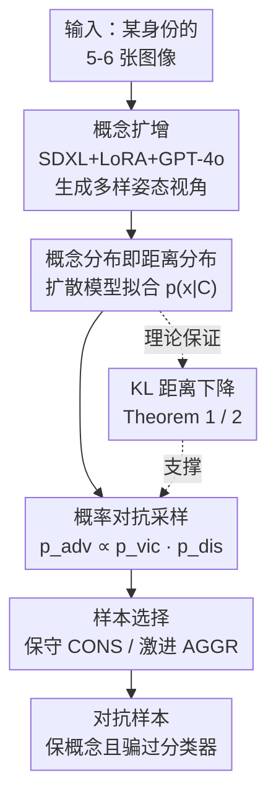

# Concept-based Adversarial Attack: a Probabilistic Perspective

**会议**: ICLR2026  
**OpenReview**: [https://openreview.net/forum?id=SoVgrFEgWt](https://openreview.net/forum?id=SoVgrFEgWt)  
**代码**: https://github.com/andiac/ConceptAdv  
**领域**: AI安全 / 对抗攻击  
**关键词**: 对抗攻击, 概率视角, 概念分布, 扩散模型, 不受限攻击

## 一句话总结
把对抗攻击从"扰动单张图像"升级为"扰动整个概念分布"——用扩散生成模型把一只特定柯基的多姿态多视角图像拟合成一个概念分布，再从这个概念分布与受害分类器分布的乘积里采样，生成既保留原概念身份、又能高成功率骗过分类器的对抗样本（白盒定向攻击成功率从 ProbAttack 的 59% 提到 98%）。

## 研究背景与动机
**领域现状**：对抗攻击的目标是在"保持输入语义不变"的前提下骗过分类器。图像领域的主流共识是：用 $L_1/L_2/L_\infty$ 范数约束扰动的几何距离，让对抗样本 $x_{adv}$ 离原图 $x_{ori}$ 足够近，从而既保留语义又能误导分类器。各类 benchmark/竞赛也都建立在"几何距离不超过阈值 $\delta$"的约束下比攻击成功率。

**现有痛点**：随着对抗防御越来越强，小的几何扰动越来越骗不动分类器，尤其是要求强迁移性（黑盒可转移）时。于是出现了"不受限攻击（unrestricted adversarial attack）"——允许更大的几何扰动。但"不受限"不等于可以乱改：对抗样本仍必须忠于原图语义，否则"保持输入含义"这一核心目标就丢了。问题是现有不受限方法（ACA、DiffAttack 等）仍然只围着**单张图像**做文章，扰动空间被这一张图死死框住。

**核心矛盾**：从概率视角（Zhang et al. 2024b）看，生成对抗样本等价于从两个分布的乘积里采样——受害分布 $p_{vic}$（强调把图分到目标类）和距离分布 $p_{dis}$（围绕原图的"近邻"分布）。$x_{adv} \sim p_{vic}\cdot p_{dis}$。当 $p_{dis}$ 紧紧锁在单张图 $x_{ori}$ 周围时，而 $x_{ori}$ 本身又不属于目标类，$p_{dis}$ 与 $p_{vic}$ 的**重叠区域非常小**；落在这块狭小交集里的样本要么骗不过分类器、要么丢了原语义，且因为处在分布低密度区，图像质量也差。

**本文目标**：把距离分布 $p_{dis}$ 的"覆盖范围"从单张图扩展到**整个概念**，让它和 $p_{vic}$ 的重叠变大，从而同时提升攻击成功率、保真度和图像质量。

**切入角度**：一个"概念"（concept）——比如"图 1 里那只左脸偏白的长耳柯基幼犬"这个具体身份——本质上可以用一个**图像分布** $p(\cdot\mid C_{ori})$ 来表示，即这只柯基在不同姿态/视角/背景下的所有图像构成的分布。既然概率视角里"任何围绕原图的分布"都能充当距离分布、隐式定义一种"距离"，那把概念分布直接拿来当 $p_{dis}$ 就行。

**核心 idea**：在概率对抗框架里，把 $p_{dis}(x_{adv}\mid x_{ori})$ 中的单图 $x_{ori}$ 替换成概念 $C_{ori}$，得到 $p_{adv}(x_{adv}\mid C_{ori}, y_{tar})\propto p_{vic}(x_{adv}\mid y_{tar})\,p_{dis}(x_{adv}\mid C_{ori})$——单图攻击只是 $|C_{ori}|=1$ 的特例。

## 方法详解

### 整体框架
方法要解决的事很直接：传统攻击的距离分布 $p_{dis}$ 钉死在单张原图上，和受害分布 $p_{vic}$ 几乎不重叠，导致采出来的对抗样本又难骗又难看。本文把 $p_{dis}$ 从"一张图的邻域"撑开成"一个概念的分布"，让它和 $p_{vic}$ 的重叠面积变大，再从重叠区采样。

整条管线分三步：**(1) 概念数据集扩增**——给定一个身份（如某只柯基的 5-6 张 DreamBooth 图像），用 SDXL+LoRA+GPT-4o 把它扩成几十张多样姿态/视角/背景的图，构成概念图集 $C_{ori}$；**(2) 拟合概念分布当距离分布**——在 $C_{ori}$ 上微调一个无条件扩散模型 $p(x)$，得到概念分布 $p_{dis}(\cdot\mid C_{ori})$，它隐式定义了"到这个概念的语义距离"；**(3) 采样+筛选**——用 Langevin Dynamics 从 $p_{adv}\propto p_{vic}\cdot p_{dis}$ 里采 $M$ 个样本，再按"目标类排名"和保真/激进两种策略挑出最好的对抗样本。理论上由 Theorem 1/2 保证：把分布从单图撑到概念会减小 $\mathrm{KL}(p_{dis}\,\|\,p_{vic})$。

### 关键设计

**1. 概念分布即距离分布：把 $x_{ori}$ 一处替换成 $C_{ori}$**

这是全文的理论支点，针对"单图 $p_{dis}$ 和 $p_{vic}$ 几乎不重叠"这个根本痛点。Zhang et al. (2024b) 的概率视角指出，对抗分布是受害分布与距离分布的乘积：

$$p_{adv}(x_{adv}\mid x_{ori}, y_{tar})\propto p_{vic}(x_{adv}\mid y_{tar})\,p_{dis}(x_{adv}\mid x_{ori})$$

其中 $p_{vic}\propto\exp(-c\,f(x_{adv}, y_{tar}))$ 衡量"被分到目标类"的程度，$p_{dis}\propto\exp(-D(x_{ori}, x_{adv}))$ 是围绕原图的距离分布；关键洞察是 $p_{dis}$ 可以是**任何**围绕中心的分布，分布的选择隐式定义了距离 $D$。本文做的事极简洁：把上式里的单图 $x_{ori}$ 换成概念 $C_{ori}$，

$$p_{adv}(x_{adv}\mid C_{ori}, y_{tar})\propto p_{vic}(x_{adv}\mid y_{tar})\,p_{dis}(x_{adv}\mid C_{ori})$$

这里 $C_{ori}=\{x^{(1)}_{ori},\dots,x^{(K)}_{ori}\}$ 是描述同一概念的一组图像。妙处在于：单图概率攻击（ProbAttack）正好是 $|C_{ori}|=1$ 的退化特例，因此本方法能几乎原样复用 ProbAttack 的实现，ProbAttack 也就天然成了消融基线。为什么有效？因为概念分布覆盖了这只柯基的各种姿态视角，它和"目标类语义集中"的 $p_{vic}$ 的交集比单张图大得多——采样能落在两个分布都高密度的区域。

**2. 用现代生成模型做概念扩增：把 5-6 张图撑成高多样性图集**

直接拿到"同一概念、又高质量又高多样性"的图集很难——DreamBooth 给的那只柯基虽然有几种姿态，但背景太单调，多样性不够，撑不起一个像样的概念分布。本文用 SDXL 来扩增：先把这只柯基记为 "[V] dog"，用 LoRA 微调（Hu et al. 2022）在 SDXL 上学这个身份；再把柯基图喂给 GPT-4o，让它生成一批"[V] dog 在各种环境/视角/姿态下"的 SDXL prompt（如"[V] dog on a skateboard""[V] dog playing in the snow"）；最后把柯基 LoRA 装回 SDXL，按这些 prompt 生成大量多样图像。实验里在 DreamBooth 的 30 个物体上，每个概念额外生成 30 张图，构成 **DreamBoothPlus** 数据集（最终扩增了其中 26 个，排除了 4 个对文本生成不友好或需卡通风格特殊参数的）。这一步是让概念分布"真的有多样性"的工程前提。

**3. 理论保证：撑开分布会减小到受害分布的 KL（Theorem 1/2）**

直觉上"扩大扰动空间应该更强"，但需要严格论证。Theorem 1 给出：对 Gibbs 形式的距离分布 $q(x)\propto\exp(-\beta D(x,\mu))$，当 $\mathbb{E}_{X\sim p}[D(X,\mu)] > \mathbb{E}_{X\sim q}[D(X,\mu)]$ 时，$\mathrm{KL}(p\,\|\,q)$ 是 $\beta$ 的增函数——即降低 $\beta$（提高"温度"、让 $p_{dis}$ 更分散）会减小 $\mathrm{KL}(p_{vic}\,\|\,p_{dis})$。这个前提条件在对抗框架里恒成立：从 $p_{vic}$ 采的样本天然比从 $p_{dis}$ 采的样本离 $p_{dis}$ 中心更远（否则"$p_{dis}$ 是集中在概念附近的距离分布"这一设定就被违背了）。Theorem 2 进一步给出两个不同距离分布对同一 $p_{vic}$ 的 KL 之差 $\Delta$ 的可计算表达式：

$$\Delta = \mathbb{E}_{X\sim p^{(1)}_{dis}}\!\big[\log p^{(1)}_{dis}(X) - c\log p(y_{tar}\mid X)\big] - \mathbb{E}_{X\sim p^{(2)}_{dis}}\!\big[\log p^{(2)}_{dis}(X) - c\log p(y_{tar}\mid X)\big]$$

用蒙特卡洛估计、并用共同随机数（common random numbers）降方差即可算出 $\tilde\Delta$。实验里令 $p^{(1)}_{dis}$ 为概念分布、$p^{(2)}_{dis}$ 为单图分布，发现每个概念都有 $\tilde\Delta<0$，实证确认了"概念 → 距离更近"。

**4. 多采样 + 保守/激进双策略选样**

概率攻击的一大优势是可以一次采多个样本再挑最好的。白盒下最简单是拒绝采样（扔掉骗不过分类器的样本），但若 $p_{dis}$、$p_{vic}$ 重叠太小、拒绝率会很高（尤其 top-1 标准下）。本文的折中做法：先从 $p_{adv}$ 采 $M$ 个样本（实验取 $M=10$），按"对目标类的排名"排序，遇到平手时用两种策略二选一——**保守策略（CONS）**挑目标类 softmax 概率**最低**的那个，过滤掉偏离原概念太远的样本（更保身份保真）；**激进策略（AGGR）**挑 softmax 概率**最高**的那个，选对抗潜力最大的样本（更强迁移性）。两种策略不影响白盒成功率（白盒下都是只要排第一就算成功），但在黑盒迁移上 AGGR 明显更强、CONS 与基线大致相当。

### 损失函数 / 训练策略
采样器用 Langevin Dynamics 优化 $\min D(x_{ori}, x_{adv}) + c\,f(x_{adv}, y_{tar})$ 这一松弛目标，其收敛到对应的 Gibbs 分布，从而给对抗样本生成提供了概率解释。距离分布选用直接建模 $p(x)$（而非 $p(x\mid y)$）的无条件扩散模型（Dhariwal & Nichol 2021），作者强调这是为了用更"有原则"的模型说明通用方法，而非追求工程极限性能。

## 实验关键数据

### 主实验
设定：白盒受害分类器 ResNet50，定向攻击（比无定向更难，ImageNet 1000 类）。从 DreamBoothPlus 的 26 个概念 × 30 个随机目标类 = 780 个对抗样本。白盒按 top-1 命中目标类算成功；迁移性因为 top-1 普遍极低，改报 top-5。对比 NCF、ACA、DiffAttack、ProbAttack。

| 设定 | 指标 | NCF | ACA | DiffAttack | ProbAttack | OURS(CONS) | OURS(AGGR) |
|------|------|-----|-----|-----------|-----------|-----------|-----------|
| 白盒 | Targeted-Top1 (ResNet50) | 1.15 | 6.03 | 84.23 | 59.23 | **97.82** | **97.82** |
| 迁移 | Top5 (ResNet152) | 1.41 | 1.92 | 8.33 | 3.33 | 2.82 | **8.72** |
| 迁移 | Top5 (DenseNet161) | 1.41 | 2.05 | 7.44 | 3.97 | 3.85 | **11.54** |
| 防御 | Top5 (EfficientNet B7 Adv) | 0.26 | 1.15 | 2.05 | 2.31 | 1.67 | **6.41** |

白盒定向成功率 97.82% 大幅领先（ProbAttack 59.23%、DiffAttack 84.23%）。激进策略 AGGR 在多数迁移/防御模型上拿到最高 top-5，保守策略 CONS 迁移性略低、与基线大致持平。

### 消融实验
ProbAttack 本身就是本方法 $|C_{ori}|=1$ 的退化版，因此"ProbAttack → OURS"即核心消融：把距离分布从单图换成概念，白盒成功率 59.23 → 97.82。下表为保真度与图像质量（无参考质量指标）对比：

| 指标 | Clean | DiffAttack | ProbAttack | OURS(CONS) | OURS(AGGR) | 说明 |
|------|-------|-----------|-----------|-----------|-----------|------|
| User Study 相似度 ↑ | N/A | 0.7577 | 0.8041 | **0.9654** | 0.8808 | 人评保概念程度 |
| HyperIQA ↑ | 0.7255 | 0.5551 | 0.6675 | **0.6947** | 0.6809 | 无参考画质 |
| MUSIQ-KonIQ ↑ | 65.05 | 52.54 | 58.16 | **63.75** | 62.22 | 无参考画质 |
| TReS ↑ | 93.21 | 74.12 | 84.31 | **90.45** | 88.08 | 无参考画质 |

### 关键发现
- **概念替换是最大贡献来源**：仅把单图换成概念分布（ProbAttack → OURS），白盒成功率几乎翻倍（59→98），且画质/保真同步提升，印证了"扩大 $p_{dis}$ 与 $p_{vic}$ 重叠"的理论。
- **CONS vs AGGR 是保真-迁移的权衡**：CONS 在 User Study 相似度（0.9654）和画质上全面最优，适合"要像、要保身份"；AGGR 牺牲一点保真换取明显更强的黑盒迁移，适合"要骗别的模型"。
- **DiffAttack 画质明显偏低**（HyperIQA 0.555、TReS 74.1），定性图也显示它生成的图细节缺失，和其低画质分一致。

## 亮点与洞察
- **"概念即分布"是个干净的抽象**：用 $p(\cdot\mid C_{ori})$ 表示一个概念，让攻击粒度可以无缝从单图（集合大小 1）到身份级再到类别级——同一套数学，只改 $C_{ori}$ 的大小。这种"把离散对象升格为分布"的思路可迁移到很多需要"语义保持"的生成/编辑任务。
- **理论与方法严丝合缝**：Theorem 1 用 Gibbs 分布的温度 $\beta$ 把"分布更分散 → KL 更小"讲清楚，且其前提条件在对抗框架里恒成立，不是事后凑的，是从概率视角自然导出的。
- **几乎零成本复用基线**：因为新方法是旧方法的严格泛化（$|C_{ori}|=1$），实现可大量复用 ProbAttack，也让消融对照天然干净——这是"把方法设计成基线特例"的好处。
- **GPT-4o 当 prompt 生成器**做概念扩增是个实用 trick：用 VLM 自动产出"同一身份、多样场景"的 prompt，解决了"概念图集多样性不足"这个工程瓶颈。

## 局限与展望
- **迁移性仍偏低**：即便最好的 AGGR，黑盒 top-5 也多在 4%-12% 区间，远不及白盒 98%；定向迁移本身就难，但说明方法的优势主要在白盒。
- **依赖重型生成管线**：每个概念都要 SDXL+LoRA 扩增 + 单独微调一个扩散模型来拟合 $p_{dis}$，计算成本高、不易规模化；DreamBoothPlus 还排除了 4 个"对文本生成不友好"的概念。
- **概念数据集的获取门槛**：方法假设能拿到/构造同一身份的多张图，对真实攻击场景（往往只有一张目标图）不一定现实，需靠生成扩增来补，扩增质量直接影响攻击。
- **评测规模有限**：26 概念 × 30 目标类、受害模型固定 ResNet50；若换更强的防御模型或更大评测集，成功率优势是否保持值得验证。

## 相关工作与启发
- **vs ProbAttack (Zhang et al. 2024b)**：ProbAttack 把对抗攻击解释为从 $p_{vic}\cdot p_{dis}$ 采样、但 $p_{dis}$ 仍锁在单张图。本文是它的严格泛化——把 $x_{ori}$ 换成概念 $C_{ori}$，重叠更大、成功率从 59% 提到 98%；ProbAttack 即 $|C_{ori}|=1$ 特例。
- **vs ACA / DiffAttack (Chen et al. 2024a,b)**：二者在 Stable Diffusion/DDIM 的隐空间直接施加对抗梯度，是不受限攻击的 SOTA，但仍围绕单图做扰动。本文换成在概念分布上做，白盒成功率和画质都更高（DiffAttack 84.23% vs OURS 97.82%，且画质明显更好）。
- **vs NCF (Yuan et al. 2022)**：最强的颜色变换类攻击，靠改色保语义；本文定向攻击下它几乎失效（1.15%），说明颜色扰动不足以做强定向攻击。
- **vs 类别级概念攻击 (Song et al. 2018; Dai et al. 2024; Collins et al. 2025)**：这些工作把"类"（猫/狗/卡车）当概念，无法精确刻画单个身份；本文用分布表示概念，可灵活对应单图、身份级、类别级，是更细粒度的"身份级"对抗攻击（作者称据其所知是首个）。

## 评分
- 新颖性: ⭐⭐⭐⭐⭐ 首个把对抗攻击从单图扰动升格到"身份级概念分布"，且数学上是旧框架的干净泛化
- 实验充分度: ⭐⭐⭐⭐ 白盒/迁移/画质/保真多维度对比 + 理论 KL 验证，但受害模型与评测规模有限、迁移性偏弱
- 写作质量: ⭐⭐⭐⭐⭐ 概率视角的动机—理论—方法—实验链条非常顺，图 1 的双分布重叠示意很有说服力
- 价值: ⭐⭐⭐⭐ 提供了"概念即分布"的新攻击范式与理论保证，但重型生成管线限制了实用规模

<!-- RELATED:START -->

## 相关论文

- [\[ICLR 2026\] Nasty Adversarial Training: A Probability Sparsity Perspective for Robustness Enhancement](nasty_adversarial_training_a_probability_sparsity_perspective_for_robustness_enh.md)
- [\[CVPR 2026\] A Unified Perspective on Adversarial Membership Manipulation in Vision Models](../../CVPR2026/ai_safety/a_unified_perspective_on_adversarial_membership_manipulation_in_vision_models.md)
- [\[ICLR 2026\] Decoupling the Class Label and the Target Concept in Machine Unlearning](decoupling_the_class_label_and_the_target_concept_in_machine_unlearning.md)
- [\[NeurIPS 2025\] Understanding and Improving Adversarial Robustness of Neural Probabilistic Circuits](../../NeurIPS2025/ai_safety/understanding_and_improving_adversarial_robustness_of_neural_probabilistic_circu.md)
- [\[ICLR 2026\] Discrete Latent Features Ablate Adversarial Attack: A Robust Prompt Tuning Framework for VLMs](discrete_latent_features_ablate_adversarial_attack_a_robust_prompt_tuning_framew.md)

<!-- RELATED:END -->
