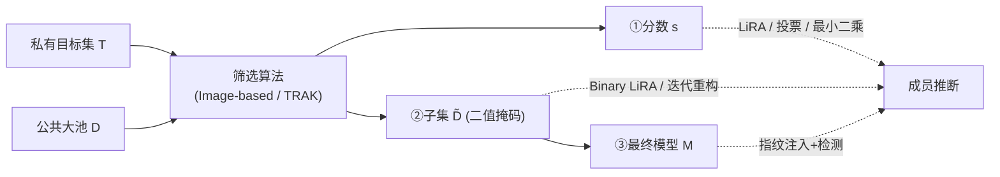

# Curation Leaks: Membership Inference Attacks against Data Curation for Machine Learning

**会议**: ICLR 2026  
**OpenReview**: [https://openreview.net/forum?id=BzNf90Csfa](https://openreview.net/forum?id=BzNf90Csfa)  
**代码**: 待确认  
**领域**: AI 安全 / 隐私 / 成员推断  
**关键词**: 数据筛选、成员推断攻击、TRAK、差分隐私、私有机器学习  

## 一句话总结
本文首次系统揭示：即便模型只在「公共数据」上训练、从未直接见过私有数据，只要私有数据被用来**指导数据筛选（curation）**，攻击者依然能在筛选分数、筛选子集、最终模型三个阶段成功推断私有样本的成员身份，并提出差分隐私版筛选作为有效防御。

## 研究背景与动机
- **领域现状**：数据筛选已成为现代 ML 流水线的核心环节——用一个小的私有「目标集」$T$ 去公共大池 $D$（如 12.8M 的 CommonPool）里挑出最有价值的子集 $\tilde{D}$，再只在 $\tilde{D}$ 上训练。在金融、医疗等数据稀缺的敏感领域，这被当作一种「隐私友好」的方案：模型从不直接接触私有数据。
- **现有痛点**：业界普遍假设「模型没见过私有数据 ⇒ 不泄露私有数据隐私」。但筛选分数、筛选子集甚至中间质量分常被公开发布或在「数据筛选即服务」市场中交易，这些产物对私有目标集的隐私风险**从未被系统评估**。
- **核心矛盾**：私有数据虽未进入训练集（$\tilde{D}\cap T=\varnothing$），却通过「影响筛选决策」这条隐蔽通道把信息泄露给了下游所有产物。隐私评估只盯训练过程是不够的，必须延伸到**数据选择过程**本身。
- **本文目标**：对两类代表性筛选方法——Image-based（embedding 最近邻）与 TRAK（梯度归因）——在筛选流水线每一阶段构造定制成员推断攻击，量化泄露，并探索差分隐私防御。
- **核心 idea**：
    - **【攻击面扩展】** 把成员推断从「攻击训练好的模型」前推到「攻击筛选产物」，证明分数/子集/模型三阶段都泄露；
    - **【信号蒸馏】** 私有信号在百万级公共样本中被稀释，因此每个目标只挑一个最具区分度的公共样本来还原信号；
    - **【指纹注入】** 对最终模型这种最难的端到端场景，向公共池注入极少量「指纹样本」，使其「当且仅当某私有目标存在时被选中」，把端到端攻击降维成「指纹是否入选」。

## 方法详解

### 整体框架
攻击针对图 1 中的三个递进威胁模型展开，难度逐级上升：(1) 观测到连续的**筛选分数** $s\in\mathbb{R}^{|D|}$；(2) 只观测到二值**选择掩码** $m\in\{0,1\}^{|D|}$；(3) 只有**最终模型** $M$ 的黑盒查询权限（需主动向池中注入指纹）。所有攻击的统一基座是把经典 LiRA 的「shadow 模型」替换成「shadow 筛选集」，再针对每种筛选算法的结构设计定制攻击，共 7 个攻击。

### 关键设计

**1. Shadow 筛选集 + 信号蒸馏：让 LiRA 适配 curation。** 经典 LiRA 需要训练大量 shadow 模型，代价高昂。本文的关键替换是：从目标集 $T$ 中采样 $m$ 个随机子集，对每个子集跑一次筛选，得到 shadow 筛选输出 $\{s_j\in\mathbb{R}^N\}$，每个目标恰好出现在一半子集里以保证 in/out 分布无偏。真正的难点在于公共池极大（$N\approx12.8\text{M}$），单个目标的信号被稀释在百万输出里，因此借鉴 Jagielski 等人的做法，**每个目标只保留一个最具信息量的公共样本** $k^*=\arg\max_k\big|\mathbb{E}_{j:t\in T_j}[s_j^{(k)}]-\mathbb{E}_{j:t\notin T_j}[s_j^{(k)}]\big|$，即在 member/non-member 两种分布下差异最大的那个样本。给定 $k^*$，LiRA 对其分数拟合高斯并计算对数似然比 $v_{\text{LiRA}}(t)=\log p(s_{k^*}\mid\mathcal{N}(\mu_\text{in},\sigma_\text{in}^2))-\log p(s_{k^*}\mid\mathcal{N}(\mu_\text{out},\sigma_\text{out}^2))$ 作为成员分数。

**2. 利用算法结构的定制分数攻击：投票（Image）与最小二乘（TRAK）。** LiRA 是通用基线，但每种筛选算法的内部结构能被更针对性地利用。Image-based 的分数是确定性最近邻 $s(x)=\max_t\cos(\phi(x),\phi(t))$，因此可以「反向工程」：对每个公共样本找出负责它的目标 $t^*$ 并给它投正票，同时对所有「若存在则会让 $s(x)$ 更高」的目标投负票，票数即成员分数。TRAK 的分数是各目标贡献的线性平均 $s(x)=\frac{1}{|T|}\sum_t\Phi(x)^\top G_t$，由于是线性组合，可直接解最小二乘 $\min_{m}\lVert\Phi(x)^\top G_t m-s\rVert_2^2$ 反解出最能解释观测分数的成员掩码 $m$，最优权重即成员分数。这一对比也揭示了：Image-based 的逐目标最近邻结构天然脆弱，而 TRAK 的平均化把单目标贡献稀释掉，提供了天然保护。

**3. 二值子集攻击：Binary LiRA 与迭代重构。** 当只能观测到「某样本是否入选」的二值掩码时，信息远比连续排名稀疏。Binary LiRA 把 shadow 输出二值化为 top-$k$ 掩码，用 Bernoulli 分布建模每个公共样本的入选频率 $\mu_\text{in},\mu_\text{out}$，再对 $k^*$ 选出的样本算 Bernoulli 对数似然比 $v(t)=\log\frac{\mu_\text{in}^{x_v}(1-\mu_\text{in})^{1-x_v}}{\mu_\text{out}^{x_v}(1-\mu_\text{out})^{1-x_v}}$。针对 Image-based 还设计了**迭代重构**：从空假设集出发，反复对候选目标集跑筛选，比较「我的假设选中但目标未选」(overweighted) 与「目标选中但假设未选」(underweighted) 的样本来增减投票，直到重构子集与观测子集的 Jaccard 相似度超过阈值。该攻击能**精确还原所有非零影响样本**的成员身份。

**4. 端到端指纹注入：把攻击最终模型降维成「指纹是否入选」。** 攻击最终模型最难也最现实。核心是向公共池注入少量指纹样本 $F$，需满足两个条件：**选择性触发**（当且仅当某特定目标 $t$ 在私有集中时该指纹才被选中）和**可检测指纹**（被选中后会在模型里留下可测信号）。由于直接训练大模型不可行，本文先一次性验证「极少量指纹（如 5 个，投毒率 0.0005%）确实能在模型留下不损害效用的可检测信号」，随后把端到端攻击**等价简化**为观测「指纹是否进入 $\tilde{D}$」。对 Image-based，因选择只看图像 embedding，可任意改文本 caption（如给 CIFAR-10 配「ratatouille」），并用相关性分数 $\text{score}(f,t_i)=\alpha\cdot s(f,t_i)+(1-\alpha)\cdot(1-\max_{t'\ne t_i}s(f,t'))$ 平衡「吸向目标」与「排斥其他目标」来挑指纹；对 TRAK，因其会惩罚错标样本，改为在正确 caption 后**追加语义正交信息**（如「an image of an airplane and ratatouille」），既保持高 TRAK 分数又留下可检测改变，再按信噪比挑指纹（算法 1）。

## 实验关键数据

### 主实验设置与结果
- **数据**：公共池用 CommonPool small（12.8M）；六个目标集覆盖自然图像/医学/卫星——CIFAR-10/100、STL-10、RESISC45、PatchCamelyon、Food101。embedding 用 CLIP ViT-L/14；LiRA 用 256 个 shadow 集。

| 阶段 / 方法 | Image-based 泄露 | TRAK 泄露 |
|---|---|---|
| 分数攻击 (Score) | 高成功率，AUC 远高于随机 | 近随机 (AUC≈0.5)，平均化提供天然保护 |
| 二值子集 (Subset) | 仍脆弱，可精确还原所有非零影响样本 | 较稳健 |
| 端到端 (Final Model) | 各 size 均中度泄露，RESISC45 在 \|T\|=100 时 TPR@1%FPR 达 **21.4%** | 随 \|T\| 增大成功率显著下降；小目标集高危 |

### 消融实验

| 因素 | 发现 |
|---|---|
| Embedding/投影维度 | Image-based 在 128 维有泄露「甜点」；TRAK 需 ≥1024 维，否则成功率掉 |
| 目标集大小 \|T\| | TRAK 呈强「越大越安全」的屏蔽效应；Image-based 因影响稀疏性呈双峰（多数受保护、少数高暴露） |
| Shadow 数量 | Image-based 上 128→256 对 CIFAR-10 提升 AUC 约 10%，对 PCAM 仅 1%；TRAK 几乎无提升 |
| 移除最脆弱样本 | 无效，出现「隐私洋葱效应」——剥掉一层又暴露下一层 |
| 差分隐私防御 | $\varepsilon=100$ 时 Image-based TPR@1%FPR 从 98.4%→5.4%、TRAK 从 100%→33.2%；$\varepsilon=10$ 时两者降至近基线 (1.1%、1.7%) |

### 关键发现
- **攻击成功率与「影响稀疏性」强相关**：图 2 显示大量目标对任何公共样本都不是最近邻（PCAM 高达 98.28% 零影响、STL-10 为 34.16%），这部分目标天然受保护，但非零影响目标信号极强——形成「双峰隐私分布」（多数样本安全、少数样本高暴露）。
- **数据类型不决定脆弱性，影响集中度才决定**：卫星图像 RESISC45 零影响样本少 → 更易攻击；医学图像 PCAM 零影响样本多 → 更难攻击；二者均与 CIFAR-10 形成对照，说明脆弱性由筛选结构而非语义域决定。
- **TRAK 并非安全**：其平均化在大目标集上稳健（分数攻击近随机），但在「小而敏感的目标集」——也正是筛选在敏感领域的核心动机场景——依然高度脆弱，呈现明显的 size 依赖。
- **DP 是可行方向**：对 Image-based 用 Report-Noisy-Max 对每个逐目标相似度加噪后再取最大、对 TRAK 像 DP-SGD 那样私有化平均梯度计算，均能在合理 $\varepsilon$ 下把泄露压回近基线水平。
- **TRAK 需更强保证**：因其工作在高维梯度空间，$\varepsilon=100$ 时仍有 33.2% TPR，需要比 Image-based 更严格的隐私预算才能压制泄露。

## 亮点与洞察
- **概念贡献最大**：打破「模型没见过私有数据就安全」的直觉，指出隐私评估必须覆盖数据选择过程，这对「用筛选做私有 ML」这一新兴范式是根本性警示。
- **威胁模型分层清晰**：分数→子集→模型三级递进，知识/能力假设与现实性同步上升；端到端指纹注入对应「公共池从互联网爬取、可被投毒」的真实威胁。
- **方法学巧思**：用「proxy 指标（指纹是否入选）」替代昂贵的反复训练大模型，既让攻击可扩展又显著提升了可复现性。
- **攻防闭环**：不止暴露问题，还给出 DP 版筛选并量化其有效性，使论文具备建设性而非纯破坏性。

## 局限与展望
- **指纹注入需投毒能力**：端到端攻击假设攻击者能向公共池注入特定样本，虽有先例支撑（爬取数据可被投毒），但仍是较强假设，限制了即时可利用性（作者在伦理声明中亦强调这点）。
- **DP 防御的隐私-效用权衡未深入**：仅展示了 DP 能降泄露，但对筛选质量/下游精度的代价缺乏系统刻画，作者明确列为未来工作。
- **计算成本高**：在与「数据筛选」真正相关的大规模数据上跑筛选+训练代价巨大，限制了完整端到端验证的规模，部分结论依赖一次性验证的 proxy 信号。
- **仅覆盖两类筛选方法**：Image-based 与 TRAK 是代表，但 loss-correlation 等其他筛选范式的泄露画像尚待补充。

## 相关工作与启发
- **成员推断基线**：建立在 LiRA（Carlini 等 2022a）与信号过滤（Jagielski 等 2023）之上，创新在于把 shadow 模型替换成 shadow 筛选集，从而绕过了反复训练模型的代价。
- **数据归因/筛选**：TRAK（Park 等 2023）、DataComp/Image filtering（Gadre 等 2023）、DataModels（Ilyas 等 2022）是被攻击对象，本文从「攻击者视角」反向审视它们的隐私属性。
- **投毒可行性**：依赖 Carlini 等（2024、2022）关于 web 规模数据可被投毒、对比学习可被后门的结论，使指纹注入具备现实基础。
- **隐私洋葱效应**：沿用 Carlini 等（2022b）的概念，证明「删高危样本」无法治本，formal DP 才是正道。
- **启发**：提醒「数据即服务」市场需把筛选分数/子集当作敏感产物治理；也提示后续可探索更细的隐私-效用前沿与更多筛选范式（如 loss-correlation）的泄露画像。

## 评分
- 新颖性: ⭐⭐⭐⭐⭐ 首次系统化揭示数据筛选流水线的成员推断隐私风险，开辟了「攻击筛选产物而非训练模型」的新视角。
- 实验充分度: ⭐⭐⭐⭐ 六数据集×两方法×三阶段全覆盖，消融详尽（维度/size/shadow/DP），仅端到端大模型受算力所限用 proxy 替代。
- 写作质量: ⭐⭐⭐⭐ 威胁模型分层、攻击编号、图表对应清晰，公式与算法完整；细节较密、需配合附录阅读。
- 价值: ⭐⭐⭐⭐⭐ 对「以筛选实现私有 ML」这一日益流行的范式给出关键安全警示，并指明 DP 防御方向，实践意义强。
