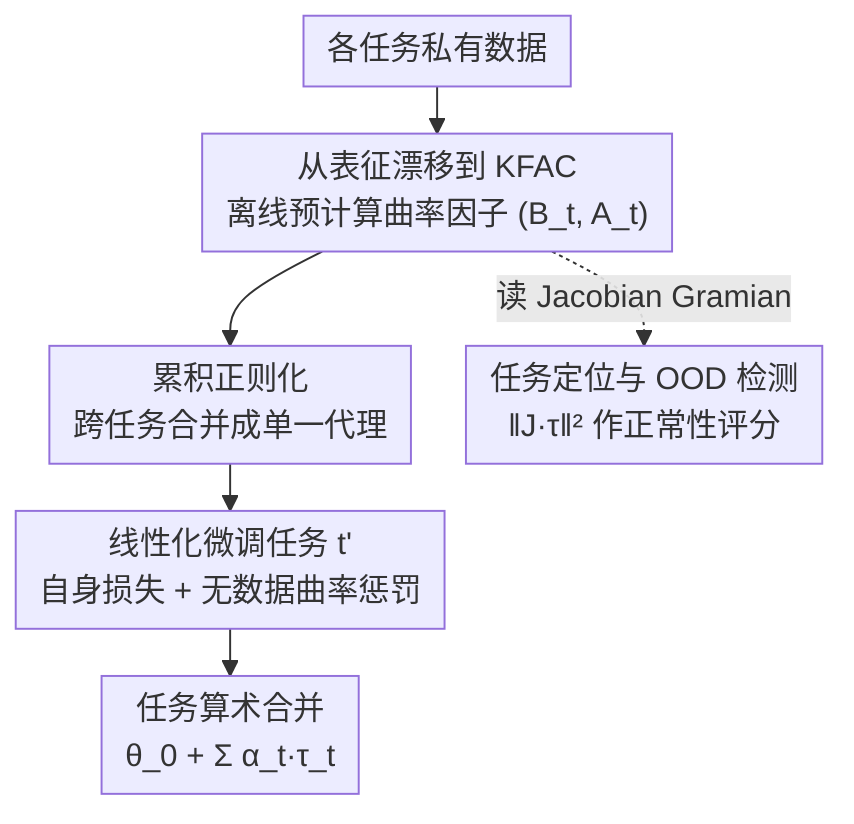

# Dataless Weight Disentanglement in Task Arithmetic via Kronecker-Factored Approximate Curvature

**会议**: ICLR 2026  
**arXiv**: [2602.17385](https://arxiv.org/abs/2602.17385)  
**代码**: [https://github.com/aimagelab/mammoth](https://github.com/aimagelab/mammoth)  
**领域**: AI安全 / 模型编辑  

## 一句话总结
该工作将曲率近似的经典理论（KFAC）与任务算术的实际需求巧妙结合，提出了一种无需外部数据的权重解缠正则化方法。理论推导清晰，从表征漂移正则化 → Jacobian Gramian → GGN → KFAC 的逻辑链条流畅。实验覆盖视觉和语言两个领域的多种模型规模，对 $\alpha$ 超参数的鲁棒性分析很实用。不足在于 KFAC 对大模型仍有 $O(d^2)$ 存储开销，且在文本领域与使用外部数

## 评分

⭐⭐⭐⭐

该工作将曲率近似的经典理论（KFAC）与任务算术的实际需求巧妙结合，提出了一种无需外部数据的权重解缠正则化方法。理论推导清晰，从表征漂移正则化 → Jacobian Gramian → GGN → KFAC 的逻辑链条流畅。实验覆盖视觉和语言两个领域的多种模型规模，对 $\alpha$ 超参数的鲁棒性分析很实用。不足在于 KFAC 对大模型仍有 $O(d^2)$ 存储开销，且在文本领域与使用外部数据的方法仍有差距。

---

## 研究背景与动机

### 领域现状

任务算术（Task Arithmetic）通过微调基础模型产生任务向量 $\boldsymbol{\tau}_t = \boldsymbol{\theta}_t^{\star} - \boldsymbol{\theta}_0$，然后通过线性组合 $\boldsymbol{\theta}_0 + \sum_t \alpha_t \boldsymbol{\tau}_t$ 实现多任务能力合并。这种方式无需额外训练、支持跨域甚至跨骨干网络的知识复用，具有极大的灵活性和可扩展性。

### 现有痛点

朴素的线性组合会导致跨任务干扰——添加新任务向量会修改共享表征，破坏其他任务的表示，导致组合模型性能退化。为减少干扰，需要促进权重解缠（weight disentanglement），使不同任务向量只影响各自任务对应的输入空间区域。

### 核心矛盾

现有的表征漂移正则化方法（如 $\tau$Jp）可以有效促进权重解缠，但需要访问其他任务的训练数据。这在隐私约束、去中心化训练、数据不可分享等实际场景中不可行，与任务算术的模块化精神相矛盾。

### 本文方案

提出 TAK（Task Arithmetic with KFAC regularization）：在线性化微调框架下，将表征漂移正则化转化为 Jacobian Gramian 的二次型，而 Gramian 恰好是广义 Gauss-Newton（GGN）矩阵的特殊实例。利用 KFAC 近似 GGN，预计算 Kronecker 因子后可在无需数据的情况下作为正则项使用。进一步提出累积正则化策略，将多任务 KFAC 因子合并为单一代理，实现 $O(1)$ 的任务数量复杂度。

---

## 方法详解

### 整体框架

TAK 把"添加新任务向量不要破坏旧任务表征"这件事，拆成解耦的两步：先在每个任务各自的私有数据上离线预计算一组 KFAC 曲率因子 $\{(\boldsymbol{B}_t^l, \boldsymbol{A}_t^l)\}_l$，把它当作"哪些方向碰不得"的紧凑代理；再在线性化微调阶段，用这些因子构造一个完全不需要其他任务数据的正则项，约束当前任务向量远离会引起跨任务干扰的方向。总目标函数写作

$$\min_{\boldsymbol{\tau}_{t'}} \mathcal{L}_{\mathcal{D}_{t'}}(\boldsymbol{\tau}_{t'}) + \beta \sum_{t \neq t'} \lambda_t \boldsymbol{\tau}_{t'}^\top \boldsymbol{G}_t(\boldsymbol{\theta}_0) \boldsymbol{\tau}_{t'}$$

第一项是任务 $t'$ 自身的微调损失，第二项是对所有其他任务 $t$ 的曲率惩罚，$\beta$ 与 $\lambda_t$ 控制强度。关键之处在于：其他任务的数据只在最左侧的离线曲率预计算里出现，进入正则化微调时已被压成不含数据的曲率因子，这正是"无数据"的来源。

### 关键设计

**1. 从表征漂移到 KFAC：把"别人的数据"换成"别人的曲率"**

要衡量给任务 $t'$ 加上任务向量后会对任务 $t$ 造成多大破坏，本来需要任务 $t$ 的数据去实测表征变化，这正是隐私/去中心化场景下不可行的根源。本文借助线性化模型 $f_\text{lin}(\boldsymbol{x}, \boldsymbol{\theta}) = f(\boldsymbol{x}, \boldsymbol{\theta}_0) + \mathrm{J}_{\boldsymbol{\theta}} f(\boldsymbol{x}, \boldsymbol{\theta}_0)(\boldsymbol{\theta} - \boldsymbol{\theta}_0)$ 把表征漂移化简成一个干净的二次型 $\Delta_{t \to t,t'}(\boldsymbol{x}) = \alpha_{t'}^2 \| \mathrm{J}_{\boldsymbol{\theta}} f(\boldsymbol{x}, \boldsymbol{\theta}_0) \boldsymbol{\tau}_{t'} \|_2^2$，对样本求期望后正则项就成了 $\boldsymbol{\tau}_{t'}^\top \boldsymbol{G}_t \boldsymbol{\tau}_{t'}$。关键观察是：这里的 Jacobian Gramian $\boldsymbol{G}_t$ 恰好是广义 Gauss-Newton（GGN）矩阵在平方损失（$\nabla^2 c = \boldsymbol{I}$）下的特例。既然如此，就能直接套用成熟的 KFAC 近似，把每层的 GGN 写成两个小矩阵的 Kronecker 积

$$\boldsymbol{G}(\boldsymbol{\theta}^l) \approx \boldsymbol{B}^l \otimes \boldsymbol{A}^l$$

其中 $\boldsymbol{A}^l$ 是该层输入的协方差、$\boldsymbol{B}^l$ 是输出梯度的协方差。这一步把"需要访问数据的表征对比"彻底替换为"可离线预存的曲率因子"，正则化因而变得无数据。

**2. 累积正则化：让任务数从 $O(T)$ 退化成 $O(1)$**

朴素做法是为每个其他任务都保留一份 KFAC 因子并逐一加惩罚，存储和计算都随任务数 $T$ 线性增长。本文提出一个启发式合并，把所有 $t \neq t'$ 的因子分别在两个 Kronecker 侧聚合成单一代理

$$\boldsymbol{G}_{-t'} \approx \left(\sum_{t \neq t'} \boldsymbol{B}_t^l\right) \otimes \left(\frac{1}{T-1} \sum_{t \neq t'} \boldsymbol{A}_t^l\right)$$

这样无论有多少任务，正则项都只需一份因子。合并当然引入误差，但理论给出 Frobenius 范数上界 $\|E\|_F \leq T \sigma_A \sigma_B$，说明当各任务的 KFAC 因子彼此差异不大时近似才好——而共享同一预训练骨干恰好满足这个前提，这也解释了实验中累积版与朴素版差距能控制在 0.3 点以内。

**3. 任务定位与 OOD 检测：正则化顺带得到一个免费的"正常性评分"**

这套正则化还有个副产品：量 $\| \mathrm{J}_{\boldsymbol{\theta}} f(\boldsymbol{x}, \boldsymbol{\theta}_0) \boldsymbol{\tau}_t \|_2^2$ 天然可以读作输入 $\boldsymbol{x}$ 对任务 $t$ 的"正常性评分"。因为惩罚项做的事就是压低分布外输入上的这个二次型，训练后 OOD 样本的评分被推向零，于是每个任务向量的影响被局部化到自己负责的输入子空间，跨任务干扰自然减弱——权重解缠和 OOD 检测在同一个量上统一了起来。

---

## 实验关键数据

### 主实验：8 Vision 任务加法

| 方法 | 无须数据 | $\alpha$ | ViT-B/32 (Abs.) | ViT-B/16 (Abs.) | ViT-L/14 (Abs.) |
|------|---------|---------|-----------------|-----------------|-----------------|
| Pre-trained | - | - | 48.4% | 55.4% | 65.0% |
| Linear FT | - | 1.0 | 76.7% | 80.2% | 88.0% |
| $\tau$Jp | ✗ | 1.0 | 85.0% | 88.2% | 90.9% |
| Diag. GGN | ✓ | 1.0 | 80.1% | 82.9% | 87.9% |
| **TAK (Ours)** | **✓** | **1.0** | **85.8%** | **88.3%** | **91.6%** |
| $\tau$Jp | ✗ | Best | 85.6% | **88.6%** | 91.1% |
| **TAK (Ours)** | **✓** | **Best** | **86.0%** | 88.3% | **91.6%** |

TAK 在无需外部数据的条件下达到或超过使用数据的 $\tau$Jp 方法，且 $\alpha=1.0$ 时即可获得接近最优的性能。

### 消融实验与分析

| 分析维度 | 关键结果 |
|---------|---------|
| 任务去学习 | TAK 目标任务准确率降至 **3.4**（ViT-B/32），同时控制任务保留 **62.4%** |
| 累积 vs 朴素 | ViT-B/16 上差距 < 0.3，验证合并策略有效性 |
| KFAC 数据量 | 128-256 样本即可饱和性能 |
| Monte Carlo 采样 | 1-2 个样本/数据点即可，更多反而性能下降 |
| KFAC 压缩 | Block-8 策略实现 87% 内存节省，仅损失 ~1 点准确率 |
| 训练开销 | MC=1 时全部因子预计算仅需 3.9 分钟 |
| 语言任务 (T5-base) | TAK: 78.7 Abs. / 98.9 Norm.；$\tau$Jp: **81.3%** / **100** |

---

## 局限与展望

**优点**:
- 理论推导严谨，将表征漂移正则化与 GGN/KFAC 优雅连接
- 无需外部数据，满足隐私和模块化约束
- 对 $\alpha$ 高度鲁棒，消除超参搜索需求
- 实验全面覆盖视觉+语言领域，消融分析充分
- 累积合并策略以 $O(1)$ 复杂度扩展到任意数量任务

**缺点**:
- KFAC 因子的存储随层宽度二次增长，对超大模型可能成为瓶颈
- 在文本领域（T5-base）与使用数据的 $\tau$Jp 仍有差距
- 理论分析基于线性化假设，虽然非线性实验也有效但缺乏严格保证
- 未探索参数高效微调（如 LoRA）场景下的适用性

## 亮点与洞察
- 方法设计简洁有效，核心思路清晰
- 实验验证全面，消融分析充分
- 对领域的关键问题提供了新的解决思路

## 局限与展望
- 方法在特定条件下可能存在局限性，泛化性待进一步验证
- 计算效率和可扩展性可做进一步优化
- 与更多相关方法的结合值得探索

## 相关工作与启发
- **vs 同领域代表性方法**：本文在方法设计上有独特贡献，与现有方法形成互补
- **vs 传统方法**：相比传统方案，本文方法在关键指标上取得了显著提升
- **启发**：本文的技术路线对后续相关工作有重要参考价值

<!-- RELATED:START -->

## 相关论文

- [\[ICLR 2026\] WARP: Weight Teleportation for Attack-Resilient Unlearning Protocols](warp_weight_teleportation_for_attack-resilient_unlearning_protocols.md)
- [\[ICLR 2026\] SCOPED: Score–Curvature Out-of-Distribution Proximity Evaluator for Diffusion](scoped_scorecurvature_out-of-distribution_proximity_evaluator_for_diffusion.md)
- [\[ICLR 2026\] Toward Enhancing Representation Learning in Federated Multi-Task Settings](toward_enhancing_representation_learning_in_federated_multi-task_settings.md)
- [\[ICLR 2026\] Towards a Certificate of Trust: Task-Aware OOD Detection for Scientific AI](towards_a_certificate_of_trust_task-aware_ood_detection_for_scientific_ai.md)
- [\[ICLR 2026\] LiteGuard: Efficient Task-Agnostic Model Fingerprinting with Enhanced Generalization](liteguard_efficient_task-agnostic_model_fingerprinting_with_enhanced_generalizat.md)

<!-- RELATED:END -->
