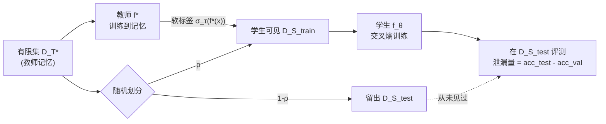

# Dataset Distillation for Memorized Data: Soft Labels can Leak Held-Out Teacher Knowledge

**会议**: ICLR 2026  
**OpenReview**: [https://openreview.net/forum?id=lmVfTPQF3a](https://openreview.net/forum?id=lmVfTPQF3a)  
**代码**: [https://github.com/SPOC-group/dataset-distillation-memorization](https://github.com/SPOC-group/dataset-distillation-memorization)  
**领域**: AI 安全 / 隐私 · 知识蒸馏 · 学习理论  
**关键词**: 软标签蒸馏, 记忆泄漏, 隐私风险, 教师函数恢复, 可识别性阈值, 温度  

## 一句话总结
本文系统地证明：在数据蒸馏中，只用教师的**软标签**训练学生，学生能在自己从未见过、且无法靠泛化推断的"被记忆数据"上取得远超随机的准确率——这既是高效迁移记忆知识的途径，也是一条隐性的隐私泄漏通道，其强弱由样本复杂度和 softmax 温度精确调控。

## 研究背景与动机
- **领域现状**：知识蒸馏与数据蒸馏依赖软标签把教师 logits 转成概率分布让学生匹配，长期被认为"有效是因为软标签编码了数据分布中的潜在结构"（即 Hinton 所谓的 dark knowledge）。
- **现有痛点**：现代神经网络不仅泛化，还会**逐条记忆**孤立事实/关联。软标签到底有没有携带这些被记忆的信息、学生能否继承它，一直缺乏可控可量化的刻画——此前研究多从"攻击"视角谈隐私泄漏，benign 蒸馏下的记忆传递仍是空白。
- **核心矛盾**：记忆要求模型保留单个样本的标签，而隐私要求模型对单点弱依赖。两者天然冲突，但很少被放在同一框架里分析"什么时候被记忆标签会从教师漏给学生"。
- **本文目标**：在可精确控制和测量的小模型上，回答两个问题——教师软标签是否编码了被记忆知识？若是，学生能否拾取这些非平凡信息？
- **核心 idea**：**【受控记忆隔离】** 训练教师去记忆一个有限数据集 $D^T_\star$，把它划成学生可见的 $D^S_{train}$ 和完全留出的 $D^S_{test}$，只用教师软标签训练学生，再在 $D^S_{test}$ 上评测。特别地，用**纯随机 i.i.d. 数据**（输入与标签独立、先验不可能泛化）让"教师拟合成功 ⟺ 纯记忆"，从而把记忆传递与结构泛化彻底解耦。

## 方法详解

### 整体框架
教师 $f_\star$ 先在有限集 $D^T_\star=\{(x_\mu,y_\mu)\}_{\mu=1}^n$ 上训练到记忆（$\mathrm{acc}^T_\star > \mathrm{acc}^T_{val}$）；把 $D^T_\star$ 随机划成不相交的 $D^S_{train}$（占比 $\rho$）与 $D^S_{test}$；学生用教师软标签 $\hat y_\mu=\sigma_\tau(f_\star(x_\mu))$ 在 $D^S_{train}$ 上以交叉熵训练到收敛，再在留出的 $D^S_{test}$ 与独立验证集 $D_{val}$ 上评测。三类数据场景递进验证：(i) 模运算结构化任务上的小 Transformer；(ii) 纯随机 i.i.d. 数据上的逻辑回归/ReLU MLP（含理论阈值）；(iii) 在随机序列上微调的 GPT-2（附录）。

### 关键设计

**1. 软标签训练与温度调控：在"拟合教师函数"和"只学真值标签"之间插值。** 学生不是用真值 one-hot $y_\mu$，而是用带温度的教师软标签作监督：

$$\hat y_\mu = \sigma_\tau(f_\star(x_\mu)),\quad \sigma_\tau(z)_k=\frac{\exp(z_k/\tau)}{\sum_j \exp(z_j/\tau)}$$

温度 $\tau$ 是泄漏的总开关：$\tau\to 0$ 时软标签退化成 one-hot，学生只学到真值类别、与教师函数解耦（在模加任务上学生甚至能反超教师、泛化到 $D_{val}$）；$\tau$ 越大软标签携带越多教师 logit 几何信息，学生越倾向于**功能性地匹配教师**（恢复教师在所有输入上的预测，包括留出的被记忆数据），数据效率与收敛速度都更高，但也把教师特有的被记忆信息最大化地漏给学生。换言之，温度把软标签当成一个正则化器，在"复现教师函数"与"只恢复真值训练标签"两端连续插值。

**2. 留出记忆泄漏度量：用 $D^S_{test}$ 与 $D_{val}$ 的准确率差把"泄漏"和"泛化"分开。** 学生准确率**始终用真值标签**计算（绝不用教师预测）。判据是：当 $\mathrm{acc}^S_{test} > \mathrm{acc}^S_{val}$ 时，说明学生在留出数据上的表现高于"对教师而言等价于随机猜"的独立数据，因而这部分增益只能来自教师软标签对 $D^T_\star$ 特定样本的泄漏。在纯随机 i.i.d. 数据下 $\mathrm{acc}^T_{val}=\mathrm{acc}^S_{val}=1/c$（随机猜），于是任何 $\mathrm{acc}^S_{test}>1/c$ 都是干净的、无法用结构解释的记忆泄漏证据——这正是用随机数据隔离记忆的价值。

**3. 逻辑回归的闭式容量与可识别性阈值：用三条临界线刻画泄漏的不同相。** 在两类逻辑回归中，直接拿教师 logit 用伪逆求解学生权重 $\hat W = X^+ z$（最小二乘），在高维比例极限下按样本复杂度 $\alpha=n/d$ 得到三条阈值：

- **教师记忆容量** $\alpha \le \alpha^T_{label}$：教师能正确关联所有随机输入-标签对，由 Cover 定理给出 $\alpha^T_{label}\le 2$（实测 $d{=}1600$ 时 $\approx1.96$，已接近渐近值）。
- **可识别性阈值** $\alpha \ge \alpha^S_{id}(\rho)=1/\rho$：当输入矩阵 $X$ 可逆时，学生通过 logit 在 MSE 意义下**功能性匹配教师**，从而连留出样本一起恢复。
- **学生记忆容量** $\alpha \le \alpha^S_{label}(\rho)$：学生能否拟合 $D^S_{train}$ 的全部 input-logit 对。

这三条线把 $(\alpha,\rho)$ 平面切成几个相：无/弱泄漏（$\mathrm{acc}^S_{test}<0.55$）、弱泄漏（$0.55\sim0.99$）、完全恢复留出记忆（$\ge0.99$），以及超过 $\alpha^T_{label}$ 后教师本身记忆失败的区域。结论刻画得很硬：只要 $\alpha,\rho$ 足够大跨过 $\alpha^S_{id}$，哪怕五分之一数据被留出，学生也能靠恢复教师权重 $W$ 把它们几乎全部"猜"回来。

**4. 从线性到 ReLU MLP 的相变跳变。** 对单隐层 ReLU MLP，"软标签记忆解"与"教师匹配解"是两个**不同**的解；学生只有在教师变得可识别后，才会从前者突然跳到后者，准确率出现陡升式相变。这说明泄漏不是线性模型的特例，而是随网络容量、架构（Transformer/MLP/GPT-2）、数据组成普遍存在的现象，只是表现为更尖锐的跳变。

## 实验关键数据

### 主实验：结构化数据（模加 Transformer，$p=113$，教师用 30% 数据）

| 教师状态 | 温度 $\tau$ | 现象（随 $\rho$ 增大） |
|---|---|---|
| ①记忆较浅 | $\tau=10$ | 小 $\rho$ 时 $\mathrm{acc}^S_{test} > \mathrm{acc}^S_{val}$（泄漏）；$\rho$ 增大后 $\mathrm{acc}^S_{test}\to1.0$，$\mathrm{acc}^S_{val}\to \mathrm{acc}^T_{val}$ |
| ②记忆较深 | $\tau=10$ | 同向但更陡的相变；学生即便训练 5× 时长仍只匹配教师的低 $\mathrm{acc}^T_{val}$，学不到教师未发现的结构 |
| ③已泛化 | $\tau=10$ | 学生几乎即时泛化到 $D_{val}$，所需数据更少 |
| 任意 | $\tau=0.1$ | 学生与教师解耦：数据不足则学不会、或延迟泛化，可反超教师 |

注：$\mathrm{acc}^S_{train}$ 在所有 $\rho,\tau$ 下恒为 100%。

### 理论验证：二类逻辑回归（$d=1600$）

| 阈值 | 取值 | 含义 |
|---|---|---|
| $\alpha^T_{label}$ | $\approx1.96$（→2） | 教师记忆容量（Cover 定理） |
| $\alpha^S_{id}(\rho{=}0.8)$ | $\approx1.26$ | 跨过后 $\mathrm{acc}^S_{test}\ge0.99$，留出记忆被完全恢复 |
| $\alpha^S_{label}(\rho)$ | 依 $\rho$ | 学生拟合教师监督的容量 |

### 关键发现
- 软标签确实编码并传递被记忆知识：学生在从未见过、且原则上不可泛化的留出数据上可达**非平凡乃至完美**准确率。
- **高温 = 更高数据效率 + 更快收敛 + 更大记忆泄漏**，三者绑定，是隐私权衡的核心旋钮。
- 未泛化教师 + 高温会**阻止**学生学到潜在结构（学生被"锁"在教师的记忆函数上），揭示蒸馏可能既保留也抹除信息。
- 现象跨架构稳健：逻辑回归（闭式）、ReLU MLP（跳变相变）、Transformer、微调 GPT-2 上一致出现。

## 亮点与洞察
- 用**纯随机 i.i.d. 数据**这一极简但此前蒸馏文献未曾研究的设置，把"记忆传递"从"结构泛化"中干净剥离，使泄漏成为可证伪的实证信号。
- 把模糊的 dark knowledge 落到**可识别性 $\alpha^S_{id}=1/\rho$** 这样的闭式阈值上，给"软标签到底漏了什么"一个可计算的答案。
- 把蒸馏的高效迁移与隐私泄漏统一成同一现象的两面，温度是连接二者的连续旋钮，对 LLM 蒸馏的隐私治理有直接启示。

## 局限与展望
- 分析聚焦小模型/匹配容量的教师-学生与玩具任务（逻辑回归、单层 MLP/Transformer），向大规模异构蒸馏的外推仍需验证（GPT-2 仅为附录佐证）。
- 闭式阈值依赖高维比例极限与线性可解性假设，非线性深网仅有定性相变刻画。
- 未给出针对该泄漏的防御机制（如 DP、温度约束、留出标签隐藏）的系统评估，是自然的后续方向。

## 相关工作与启发
- **蒸馏理论**：Phuong & Lampert (2019) 在线性情形给出学生功能性匹配教师的条件，本文将其阈值化并扩展到记忆数据；Saglietti & Zdeborová (2022) 研究正则化迁移但教师是生成模型而非记忆固定数据。
- **记忆**：Zhang et al. (2017) 证明深网能拟合随机标签，本文进一步问"这些被记忆信息能否经软标签迁移"。
- **隐私**：呼应 Cloud et al. (2025) 中"学生 LLM 在教师采样的无关随机数据上微调却继承隐藏特质"的现象，本文在玩具模型中给出机制解释。

## 评分
- **新颖性**: ⭐⭐⭐⭐⭐ — 首次在受控纯记忆设置下隔离并量化软标签的记忆泄漏，把 dark knowledge 落成闭式可识别性阈值。
- **实验充分度**: ⭐⭐⭐⭐ — 逻辑回归闭式 + MLP/Transformer/GPT-2 多架构交叉验证，但规模偏玩具、缺防御侧评估。
- **写作质量**: ⭐⭐⭐⭐ — 问题动机清晰，理论与实证衔接紧密，相变图解读到位。
- **价值**: ⭐⭐⭐⭐⭐ — 对蒸馏的隐私风险与高效迁移给出统一、可操作（温度旋钮）的理解，对 LLM 蒸馏治理有实际意义。

<!-- RELATED:START -->

## 相关论文

- [\[ICLR 2026\] FERD: Fairness-Enhanced Data-Free Adversarial Robustness Distillation](ferd_fairness-enhanced_data-free_adversarial_robustness_distillation.md)
- [\[ICML 2026\] Same Target, Different Basins: Hard vs. Soft Labels for Annotator Distributions](../../ICML2026/ai_safety/same_target_different_basins_hard_vs_soft_labels_for_annotator_distributions.md)
- [\[ICML 2026\] Fair Dataset Distillation via Cross-Group Barycenter Alignment](../../ICML2026/ai_safety/fair_dataset_distillation_via_cross-group_barycenter_alignment.md)
- [\[ICLR 2026\] Bridging Fairness and Explainability: Can Input-Based Explanations Promote Fairness in Hate Speech Detection?](bridging_fairness_and_explainability_can_input-based_explanations_promote_fairne.md)
- [\[ICLR 2026\] AP-OOD: Attention Pooling for Out-of-Distribution Detection](ap-ood_attention_pooling_for_out-of-distribution_detection.md)

<!-- RELATED:END -->
