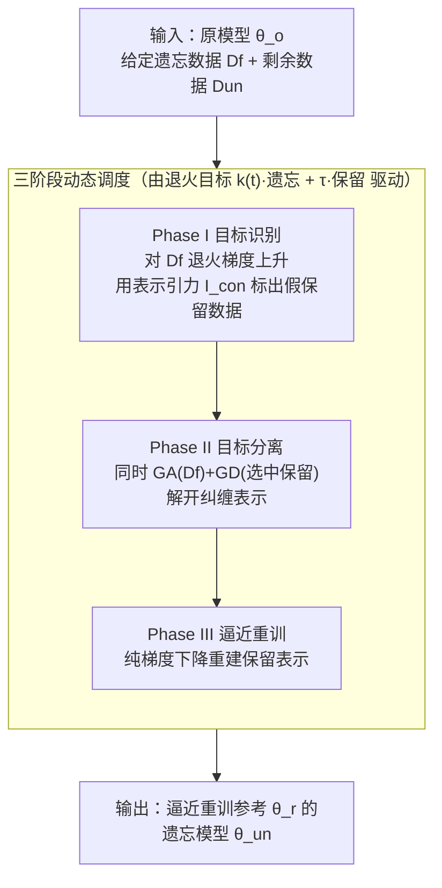

# Decoupling the Class Label and the Target Concept in Machine Unlearning

**会议**: ICLR2026  
**OpenReview**: [https://openreview.net/forum?id=Xpj0yeMhpz](https://openreview.net/forum?id=Xpj0yeMhpz)  
**代码**: https://github.com/tmlr-group/TARF  
**领域**: AI 安全 / 机器遗忘  
**关键词**: 机器遗忘, 类别遗忘, 目标概念解耦, 表示引力, 退火遗忘

## 一句话总结
本文指出传统类别遗忘默认"类别标签 = 想抹掉的目标概念"，而真实的删除请求往往二者错配；为此作者把遗忘数据、模型输出、目标概念拆成三个标签域，定义出 target/model/data 三类错配任务，并提出 TARF 框架——用"表示引力"识别藏在剩余集里的同概念数据，再用退火梯度上升 + 目标感知梯度下降的三阶段动态目标，把目标概念精确剥离、逼近重训模型。

## 研究背景与动机
**领域现状**：机器遗忘（machine unlearning）要把某些训练数据的影响从已训练模型里抹掉，使其行为逼近"从头在剩余数据上重训"的参考模型 $\theta_r$。因为精确重训太贵，主流是近似遗忘。在"类别粒度"上，已有方法（FT 在剩余数据上微调触发灾难性遗忘、GA 在遗忘数据上做梯度上升、L1-sparse、SalUn、SCRUB 等）已能较好地遗忘"一整个训练类别"。

**现有痛点**：这些方法几乎都默认一个隐含假设——**要遗忘的"目标概念"恰好等于某个预训练类别标签**。但现实里用户发来的删除请求常常违背预训练任务的分类体系：请求可能只是某个类别里的一个语义子集（如只删"金毛"而保留"狗"），也可能是跨多个类别的更大语义簇（如出于版权/声誉保守地删整个"人"概念）。此时"类别标签"无法准确刻画"目标概念"。

**核心矛盾**：当标签域错配时，表示空间出现两类失败。其一，当**目标概念比模型类别更细**（$\mathcal{L}_T \prec \mathcal{L}_M$，模型混在更粗的超类里训练）时，目标概念和同超类的"受影响保留数据"在特征空间高度纠缠，遗忘目标会"溢出"波及到本该保留的部分；其二，当**给定的遗忘数据只是目标概念的子集**（$\mathcal{L}_D \prec \mathcal{L}_T$）时，剩余集里藏着同属目标概念却没被标出的"假保留数据"，只盯着给定数据遗忘会留下未遗忘干净的残留。

**本文目标**：把"类别标签"与"目标概念"解耦，系统刻画错配场景，并设计一个能在错配下**只精确抹掉目标概念、保住其余部分**的通用遗忘框架。

**切入角度**：作者从遗忘的"表示动力学"入手——观察到梯度上升时，两簇数据在表示空间里离得越近、损失越会同步变化（一种"引力式"共动）。这条规律既解释了错配为何失败，也反过来给出工具：可以用引力效应去**识别**剩余集里和遗忘数据动力学相似的假保留数据，并提示纠缠表示需要双向操作来拆开。

**核心 idea**：用三个标签域（遗忘数据 $\mathcal{L}_D$、模型输出 $\mathcal{L}_M$、目标概念 $\mathcal{L}_T$）的相对关系建模错配任务，再用"表示引力 + 退火遗忘 + 目标感知保留"的三阶段动态目标，先识别、再分离、最后逼近重训。

## 方法详解

### 整体框架
TARF（TARget-aware Forgetting）的输入是一个已训练模型 $\theta_o$、用户给定的遗忘数据 $D_f$ 和剩余数据 $D_{un}=D\setminus D_f$；输出是一个遗忘模型 $\theta_{un}^*$，使其行为逼近只在真·剩余数据 $D_r$ 上从头重训的参考 $\theta_r$。难点在于：当目标概念 $D_t$ 与给定 $D_f$ 不一致时，$D_{un}$ 里既有真该保留的 $D_r$，也有同属目标概念、却被当作保留数据的"假保留数据" $D_{fr}=D_t\setminus D_f$；而模型错配时同类还藏着会被牵连的"受影响保留数据" $D_{ar}$。

TARF 把整个遗忘过程组织成一个**统一的动态目标**（退火遗忘 + 目标感知保留），随训练时间 $t$ 自然分成三个阶段：先用纯梯度上升构造动力学信息、靠表示引力把假保留数据识别出来（识别）；再同时做梯度上升 + 选择性梯度下降，把纠缠的目标概念从保留部分里拆开（分离）；最后只在选中的保留数据上做梯度下降，逼近重训、防止过度遗忘（逼近）。

### 关键设计

**1. 标签域错配建模：把"类别标签"与"目标概念"解耦**

本文最关键的概念贡献是把过去混为一谈的两件事拆开，用三个标签域刻画一次遗忘请求：遗忘数据所属域 $\mathcal{L}_D$、模型输出域 $\mathcal{L}_M$、目标概念域 $\mathcal{L}_T$。再引入两种域间关系——"匹配" $L_1 = L_2$ 和"子类域" $L_1 \prec L_2$（$L_1$ 里每个标签的样本都能被 $L_2$ 的某个标签覆盖，反之不然）。由于上报的遗忘数据总被目标概念包含（$\mathcal{L}_D \preceq \mathcal{L}_T$），可枚举出四类任务：**全匹配** $\mathcal{L}_D=\mathcal{L}_M=\mathcal{L}_T$（传统场景）、**目标错配** $\mathcal{L}_D=\mathcal{L}_M \prec \mathcal{L}_T$（模型按类训练，却要删更大的"人"概念）、**模型错配** $\mathcal{L}_D=\mathcal{L}_T \prec \mathcal{L}_M$（模型按超类训练，却要删超类里的"男孩/女孩"）、**数据错配** $\mathcal{L}_D \prec \mathcal{L}_T=\mathcal{L}_M$（模型按超类训练，给定数据只是目标概念一部分）。这套刻画把"实际删除请求可能违背预训练分类体系"这件含糊的事变成了可控、可实验的设定，也直接暴露出后三类任务里 $D_{fr}$、$D_{ar}$ 这些被传统方法忽略的数据分区（见数据划分表）。

**2. 表示引力：用遗忘动力学揪出"假保留数据"**

错配失败的根因是表示层的纠缠或欠纠缠，作者用一条可证明的动力学规律把它量化。在表示相似性假设下（中间层表示 $h(x)$，$\ell_h$ 以常数 $C_\ell$ Lipschitz 光滑），对某子集 $s_1$ 做梯度上升 $\theta_{t+1}=\theta_t+\nabla L_{s_1}(\theta_t)$ 时，两子集的损失差演化满足

$$\Delta L_{s_1,s_2}(\theta_{t+1}) \le \big(L_{s_1}(\theta_t)-L_{s_2}(\theta_t)\big) + \eta\,\lambda_{\max}(J_{\theta_t})\,C_\ell\,\mathbb{E}\,d_h(x_1,x_2)\cdot\|\nabla L_{s_1}(\theta_t)\| + O(\eta^2)$$

其中 $\lambda_{\max}(J_\theta)$ 是 Jacobian $J_\theta=\partial h(x)/\partial\theta$ 的最大特征值，$d_h$ 是表示距离。直观含义（"引力效应"）：当 $t\to 0$、$L_{s_1}-L_{s_2}\to 0$ 时，主导项正比于两簇数据的**表示距离**——离得越近，推动一簇遗忘就越会牵连另一簇同步变化；离得越远则几乎不动。基于此，作者定义**表示引力**指标来识别假保留数据：

$$I_{con}(x,y,\theta)=\big|\ell(f_\theta(x),y)-\ell(f_{\theta_t}(x),y)\big|$$

即在遗忘早期（小 $t$）一个样本相对原模型的损失/精度变化幅度，它反映了该样本与正在被遗忘的数据有多"近"。属于目标概念却没被标出的假保留数据，会因为和 $D_f$ 动力学相似而出现明显的精度下降，从而被 $I_{con}$ 选出来（实验里目标概念类别的精度跌幅显著大于无关类别）。这把"找出剩余集里的隐藏同概念数据"从无从下手变成一个可计算的排序问题。

**3. 退火遗忘 + 目标感知保留：一个动态加权的统一目标**

TARF 把遗忘与保留写进同一个随时间变化的损失（式 3）：

$$\mathcal{L}_{TARF}=k(t)\cdot\Big(-\frac{1}{|D_f|}\sum_{(x,y)\sim D_f}\ell(f(x),y)\Big)+\frac{1}{|D_{un}|}\sum_{(x,y)\sim D_{un}}\ell(f(x),y)\cdot\tau(x,y,t)$$

前一项是**退火遗忘**（对 $D_f$ 的梯度上升），后一项是**目标感知保留**（对剩余数据的加权梯度下降）。两个动态超参是关键：

$$k(t)=\max\Big(\frac{k\,(T-t-t_0)}{T},\,0\Big),\qquad \tau(x,y,t)=\begin{cases}0 & I_{con}(x,y,\theta_{t_1})>\beta \text{ 或 } t<t_1\\ 1 & I_{con}(x,y,\theta_{t_1})<\beta \text{ 且 } t\ge t_1\end{cases}$$

$k(t)$ 让遗忘强度随训练**退火衰减**，并在 $t_0$ 处归零，避免一直猛遗忘把模型打坏；$\tau$ 是个**门控**，只有当某保留样本的引力 $I_{con}$ 低于阈值 $\beta$（即它是"难被牵连、真该保留"的数据）且越过起始时刻 $t_1$ 时才纳入保留项。阈值 $\beta$ 由请求信息和损失/精度变化排序估计（如取变化量降序前 10% 数据的最低值）。整体目标的设计意图是让 $\mathcal{L}_f(k)\xrightarrow{t\to T}0$、$\mathcal{L}_u(\tau)\xrightarrow{t\to T}\mathcal{L}_{retrain}$，从而 $\mathcal{L}_{TARF}$ 渐近逼近重训目标。这比"只遗忘"或"只保留"的旧方法多了一层：它显式地在表示层做剥离，而非依赖单侧目标硬扛错配。

**4. 三阶段动态调度：识别 → 分离 → 逼近**

$k(t)$ 与 $\tau$ 的取值把上面这个统一目标自然切成三个阶段，对症下三类错配的病。**Phase I 目标识别**（$t<t_1$，此时 $\tau=0$）：目标退化为只有退火遗忘项 $\mathcal{L}_{\text{Phase-I}}=k(t)\cdot(-\frac{1}{|D_f|}\sum\ell)$，纯梯度上升构造全类动力学信息，借表示引力把 $D_{fr}$ 里的假保留数据识别出来（专治数据/目标错配下的"识别缺失"）。**Phase II 目标分离**（$t_1\le t<t_0$）：同时对 $D_f$ 梯度上升、对选中的保留数据梯度下降，双向操作把纠缠在一起的目标概念和受影响保留数据 $D_{ar}$ 拆开（专治模型错配下的"分解缺失"，让 RA 与 UA 的精度差恢复到重训参考的水平）。**Phase III 逼近重训**（$t\ge t_0$）：目标只剩 $\mathcal{L}_{\text{Phase-III}}=\frac{1}{|D_{un}|}\sum\ell\cdot\tau$，纯在选中的难影响保留数据上做梯度下降，重建表示、逼近重训参考，防止 Phase II 的"过度解构"（实验显示 Phase II 可能把精度差拉得比重训参考还大，必须靠 Phase III 拉回）。作者强调三阶段是从一个统一框架推出来的、而非拼凑的流水线：每阶段都建立在上一阶段的洞察之上。

### 损失函数 / 训练策略
核心目标即式 3，超参 $k$、$t_0$、$t_1$、$\beta$ 分别控制遗忘强度、遗忘结束时刻、保留起始时刻和假保留数据选择阈值。骨干用 ResNet-18，在 CIFAR-10/100 原类别与超类两套模型上分别实例化四类任务。

## 实验关键数据

### 主实验
评估以"逼近重训参考"为目标，用 UA（遗忘准确率）、RA（保留准确率）、TA（测试准确率）、MIA（成员推断）五项指标，汇总成与重训的平均差 $\text{Gap}=\frac{1}{4}\sum|R_{\theta_{un}}-R_{\theta_r}|$（越低越好）。下表为 Gap（%，越低越好）：

| 任务 | 数据集 | GA | SCRUB | SalUn | TARF(本文) |
|------|--------|-----|-------|-------|-----------|
| 全匹配 | CIFAR-10 | 2.88 | 1.03 | 4.00 | **1.01** |
| 全匹配 | CIFAR-100 | 3.01 | 0.71 | 9.10 | 1.11 |
| 模型错配 | CIFAR-10 | 45.68 | 3.61 | 43.69 | **2.90** |
| 模型错配 | CIFAR-100 | 39.68 | 2.45 | 25.15 | **1.21** |
| 目标错配 | CIFAR-10 | 20.80 | 25.53 | 25.38 | **1.23** |
| 目标错配 | CIFAR-100 | 8.86 | 29.90 | 27.35 | **0.21** |
| 数据错配 | CIFAR-10 | 5.89 | 46.76 | 24.75 | **0.96** |
| 数据错配 | CIFAR-100 | 2.43 | 45.54 | 36.89 | 1.17 |

可见：传统方法在全匹配上都还行，但一进三类错配任务 Gap 普遍飙到 20~48；TARF 在全部四类任务上都做到最优或接近最优，错配任务里优势尤其悬殊（目标错配 CIFAR-100 仅 0.21）。在 ImageNet-1k 大规模实验上，TARF 在全匹配与目标错配（删属于 "fish" 的三个类）下同样取得满意的整体 Gap。

### 消融实验
表 2 是模型错配下的细粒度评估，把超类里"要遗忘的细类（UA-F）"和"该保留的细类（UA-R）"分开看：

| 配置 | 说明 | Gap |
|------|------|-----|
| 完整 TARF（三阶段） | 识别 + 分离 + 逼近 | **1.36**（CIFAR-100 超类） |
| 仅 GA | 缺识别/分离/逼近 | 47.38 |
| SCRUB | 最强基线 | 2.65 |
| 去掉 Phase III | 仅识别 + 分离 | 出现"过度解构"，精度差大于重训参考 |

### 关键发现
- **表示距离主导遗忘动力学**：tSNE + 损失曲线显示，与遗忘数据表示越近的数据，损失/精度同步变化越剧烈，验证了 Theorem 3.2 的"引力效应"，这是识别假保留数据的理论依据。
- **错配让旧方法两头落空**：依赖单侧目标的方法要么因"表示不足"遗忘不干净（FT 保住 RA 但 UA 高），要么因"分解缺失"过度遗忘（GA 把 UA 压到最低却牺牲 RA），都偏离重训参考。
- **Phase III 不可省**：Phase II 的双向拆解会过冲（精度差比重训还大），必须靠纯保留的 Phase III 把表示重建回来才能真正逼近重训参考。

## 亮点与洞察
- **把一个被忽略的假设变成了完整问题空间**：用 $\mathcal{L}_D/\mathcal{L}_M/\mathcal{L}_T$ 三域 + 子类关系，把"类别标签 ≠ 目标概念"这件直觉上的事系统化成四类可控任务，给后续遗忘研究铺了一个新 benchmark 维度。
- **理论指标直接落地成算法部件**：表示引力 $I_{con}$ 既是 Theorem 3.2 的产物，又被当成 $\tau$ 门控的依据，理论—方法衔接得很干净，可迁移到任何"需要从剩余集里找隐藏同概念样本"的场景。
- **退火 + 门控的动态目标值得借鉴**：用一个随时间变化的 $k(t)$、$\tau(x,y,t)$ 把"先识别、再分离、后逼近"压进单一损失，避免了多阶段手工切换，思路可迁移到持续学习、概念擦除等任务。

## 局限与展望
- **主要在图像分类上验证**：核心实验集中在 CIFAR/ImageNet 的类别遗忘，虽有 TOFU/ImageNette 案例，但对生成模型、LLM 概念擦除等更复杂目标概念的适用性仍需更多验证。
- **超参依赖请求先验**：$\beta$、$t_0$、$t_1$ 的选择依赖对删除请求的信息（如目标概念在剩余集里占多少类别已知），现实中这些先验未必拿得到，自动估计的鲁棒性是待补的一环。
- **目标错配需已知目标类别数**：方法在目标错配里假设了 $D_{un}$ 中属于目标概念的类别数已知，放宽这一假设（完全未知目标边界）会更贴近实际。

## 相关工作与启发
- **vs FT / GA（经典近似遗忘）**：FT 在剩余数据上微调触发灾难性遗忘、GA 在遗忘数据上反向更新，二者都默认 $D_f=D_t$、$D_r=D\setminus D_f$，错配下要么遗忘不足要么过度；TARF 显式建模错配并在表示层做识别 + 分离。
- **vs L1-sparse / SalUn / SCRUB（近期 SOTA）**：它们在全匹配上很强，但仍未跳出"类别 = 概念"的假设，进入错配任务后 Gap 显著恶化；TARF 在四类任务上更均衡。
- **vs 影响函数类方法（IU 等）**：用影响函数擦除单点影响，计算重且在大类/错配下表现不稳；TARF 的动力学视角更适配类别/概念粒度的遗忘。

## 评分
- 新颖性: ⭐⭐⭐⭐⭐ 把"类别标签 ≠ 目标概念"系统化为三域错配问题空间，并配套表示引力理论，开了新设定。
- 实验充分度: ⭐⭐⭐⭐ 四类任务 × CIFAR/ImageNet × 多基线 + 细粒度消融较完整，但非图像域验证偏少。
- 写作质量: ⭐⭐⭐⭐ 概念—理论—算法三层衔接清晰，图 1/2/4 帮助理解；符号略密。
- 价值: ⭐⭐⭐⭐⭐ 给机器遗忘指出一个被长期忽略却很现实的维度，方法和 benchmark 都可复用。

<!-- RELATED:START -->

## 相关论文

- [\[ICLR 2026\] Label Smoothing Improves Machine Unlearning](label_smoothing_improves_machine_unlearning.md)
- [\[ICLR 2026\] ReTrace: Reinforcement Learning-Guided Reconstruction Attacks on Machine Unlearning](retrace_reinforcement_learning-guided_reconstruction_attacks_on_machine_unlearni.md)
- [\[ICLR 2026\] Distributional Machine Unlearning via Selective Data Removal](distributional_machine_unlearning_via_selective_data_removal.md)
- [\[ICLR 2026\] Machine Unlearning under Retain–Forget Entanglement](machine_unlearning_under_retainforget_entanglement.md)
- [\[ICLR 2026\] Concept-based Adversarial Attack: a Probabilistic Perspective](concept-based_adversarial_attack_a_probabilistic_perspective.md)

<!-- RELATED:END -->
