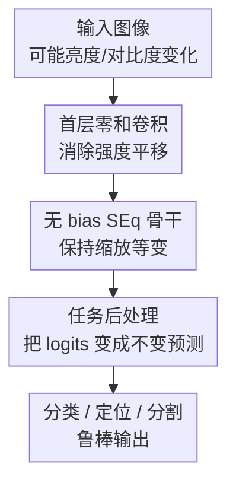

# Designing Affine-Invariant Neural Networks for Photometric Corruption Robustness and Generalization

**会议**: ICLR 2026  
**OpenReview**: [https://openreview.net/forum?id=fhEwTOLYNZ](https://openreview.net/forum?id=fhEwTOLYNZ)  
**代码**: https://github.com/MounirMessaoudi/SEqSi  
**领域**: AI安全 / 鲁棒性与泛化  
**关键词**: 光度扰动鲁棒性, 仿射不变性, 等变神经网络, 生物图像分析, 分布外泛化  

## 一句话总结

本文提出 SEqSI，一种把首层做成强度平移不变、把后续骨干做成强度缩放等变的 CNN 设计，在几乎不增加计算成本的情况下，为分类、定位和分割等任务提供对全局亮度/对比度仿射变化的可验证鲁棒性，并在 Cryo-ET 与显微图像等真实光度域偏移中明显优于普通网络。

## 研究背景与动机

**领域现状**：视觉模型在训练集和测试集光照、亮度、对比度一致时表现很好，但在真实部署里，图像的像素强度经常被无语义的光度因素改变。例如普通照片会受曝光影响，医学和生物显微图像会受仪器设置、重建算法、染色强度和传感器饱和影响，Cryo-ET 数据还会因为 WBP、CTF deconvolved、Denoised、IsoNet corrected 等不同预处理流程形成完全不同的强度分布。

**现有痛点**：常见修法是做光度数据增强，或者在输入前做 min-max / z-score normalization。增强能让模型见过更多扰动，但本质是经验覆盖：训练时没覆盖到的非仿射扰动、局部亮度变化、强饱和伪影仍可能让模型崩掉。输入归一化可以抵消全局仿射变化，却容易被局部强亮伪影或空间变化的亮度漂移破坏，因为归一化统计量由整张图决定，局部异常会把正常区域的有效动态范围压扁。

**核心矛盾**：这篇论文抓住的矛盾是，模型最终任务通常只需要预测结果对光度变化不变，而不一定要求每一层都严格仿射等变。已有 AffEq 网络把每一层都限制成仿射等变，需要所有卷积权重和为 1、去掉 bias、再用 SortPool 激活，保证很强但代价也很大：训练更慢、显存更高、与常见 ReLU 组件和迁移学习不太兼容。标准 CNN 训练方便，却没有形式保证。

**本文目标**：作者希望设计一种更实用的网络族：一方面能从架构上保证对全局强度平移和缩放的鲁棒性，另一方面仍能使用常见卷积、ReLU、池化和残差骨干，并能覆盖分类、对象定位、二值分割等需要不同后处理的任务。

**切入角度**：关键观察是，亮度平移和对比度缩放可以分开处理。对缩放，只要所有线性/卷积层去掉 bias，并使用 ReLU 这类正齐次激活，网络天然满足 $f(\lambda x)=\lambda f(x)$。对平移，不必让每一层都 shift-equivariant；只要第一层卷积的权重和为 0，它就会把输入中的常数亮度偏置消掉，后续层看到的表示已经不含全局 shift。

**核心 idea**：用“首层零和卷积消亮度平移 + 后续无 bias 骨干保强度缩放等变 + 任务后处理转成最终不变预测”的组合，替代昂贵的全层仿射等变约束。

## 方法详解

### 整体框架

SEqSI 的整体流程可以理解成三步。第一步，输入图像可能被全局光度仿射变换 $T_{\lambda,\mu}(x)=\lambda x+\mu$ 改变，其中 $\lambda>0$ 表示对比度缩放，$\mu$ 表示亮度平移。第二步，网络用一个 shift-invariant 的首层卷积去除常数平移，再把后续骨干全部做成 scale-equivariant。第三步，根据任务类型选择后处理：分类/语义分割用 softmax + argmax，定位/阈值任务先对 logits 做标准化，再阈值化。

这张图里的三个贡献节点分别对应下面的关键设计：首层零和卷积、无 bias SEq 骨干、任务后处理。输入和输出只是任务脚手架，不单独作为设计点。论文的理论保证也围绕这条链条展开：若输入变成 $\lambda x+\mu$，SEqSI 的 logits 满足 $f(\lambda x+\mu)=\lambda f(x)$，也就是平移被消掉、缩放被线性传到输出；随后只要后处理对正缩放不敏感，最终预测就能保持不变。

### 关键设计

**1. 首层零和卷积：用最小约束消掉全局亮度平移**

普通卷积对输入加一个常数 $\mu$ 时，输出会多出 $\mu \sum_i w_i$。如果每个输出通道的卷积核权重和被约束为 0，那么这项常数偏移直接消失，卷积输出就满足 $g(x+\mu)=g(x)$。SEqSI 把这个约束只放在第一层，而不是像 AffEq 那样要求所有层都对 shift 做严格等变，这使得后续网络可以继续用标准 ReLU、池化和残差结构。

这个设计的妙处在于它针对的是任务需要的最终不变性，而不是中间表示的逐层仿射等变性。只要第一层先把全局亮度平移从特征里滤掉，后续层再怎么组合这些特征，都不会重新依赖输入的常数偏置。论文还指出，反射 padding 对保持这种性质很重要；普通 zero padding 会在边界引入固定 0，破坏平移不变/等变关系。

**2. 无 bias 缩放等变骨干：保留 ReLU 生态而避免 AffEq 的高成本**

SEqSI 的后续骨干采用 scale-equivariant 设计：卷积层和线性层不使用 bias，ReLU 这类正齐次激活满足 $\mathrm{ReLU}(\lambda z)=\lambda \mathrm{ReLU}(z)$，max/average pooling 对正缩放和仿射变换也有可预测响应。于是首层输出如果随输入对比度缩放为 $\lambda$ 倍，后续 logits 也会整体缩放为 $\lambda$ 倍。

相比 AffEq，SEqSI 少了两类昂贵限制：它不要求每层卷积权重和为 1，也不需要把 ReLU 换成 SortPool。实验里的计算表显示，在 CIFAR-10 ResNet-20 上，Standard 每个 epoch 约 11.87 秒，SEqSI 约 11.23 秒，峰值显存同为 0.44GB；AffEq 则约 18.61 秒、1.26GB，训练时间超过 50% 更慢、显存接近 3 倍。也就是说，SEqSI 把形式保证集中在最关键的结构位置，而不是让整个网络都背负严格约束。

**3. 任务后处理：分类用顺序不变，定位用标准化阈值**

SEqSI 的 logits 对输入仿射变化满足 $f(\lambda x+\mu)=\lambda f(x)$。对分类、语义分割这类 argmax-based 任务，正缩放不会改变 logits 的大小顺序，因此 $\arg\max(\lambda y)=\arg\max(y)$。即使用 softmax 之后再取 argmax，只要中间函数严格单调递增，预测类别也不会改变。这解释了为什么分类实验中 SEqSI 能在 shift、scale、affine 测试上达到 0% prediction invariance error。

对象定位和二值分割更麻烦，因为它们通常把 logits 过 sigmoid 得到 $[0,1]$ score map，再用固定阈值找局部极大值或前景像素。若 logits 被缩放，固定阈值就不再有同样含义。论文因此把 score map 定义为 logits 的 z-score 标准化：$\hat z=Z(y)=(y-E[y])/\sigma(y)$。这样阈值 $\gamma$ 的含义变成“高于整张 score map 均值多少个标准差”，而不是某个绝对数值。对 AffEq 或 SEqSI logits，这个标准化会抵消全局仿射/缩放变化，使阈值定位也具备形式不变性。

**4. 架构不变性优先于输入归一化：更适合局部光度漂移和亮伪影**

输入 min-max 或 z-score normalization 也能抵消全局仿射强度变化，但它依赖整张图的统计量。一旦图像里出现局部强亮伪影，或者亮度 shift 随空间位置缓慢变化，输入归一化会把所有正常区域一起重标定，导致网络看到的局部结构发生额外变化。SEqSI 的首层卷积在局部邻域内用零和权重消除常数项，因此对分段常数 shift、线性变化 shift 这类空间变化扰动仍有“弱不变性”优势。

论文在显微定位实验中专门比较了这一点：标准模型即便带 $[0,1]$ 输入归一化，在空间变化 shift 下 score map 会大面积失真；SEqSI 的预测点几乎重合。亮伪影实验也支持同一逻辑，伪影强度达到原始信号最大值 10 倍时，未增强训练的 Standard 得分接近 0.064，而 SEqSI 仍有 0.693；结合增强后 SEqSI 高达 0.823。

### 一个完整示例

假设一张显微图像里真实细胞核位置不变，但采集时整体亮度升高并且对比度变强，输入从 $x$ 变成 $x'=3x+0.5$。普通 CNN 的首层卷积会同时响应原图结构和额外的 $0.5\sum_i w_i$，后面的 ReLU、归一化和阈值都会沿着不同路径放大这个偏差，最后可能多检或漏检细胞核。

在 SEqSI 中，首层卷积核和为 0，所以 $0.5$ 这部分常数亮度被滤掉；剩下的结构响应大约变成原来的 3 倍。无 bias 骨干继续保持这种缩放关系，得到 logits $y'=3y$。如果任务是分类，$y'$ 与 $y$ 的最大类别索引相同；如果任务是定位，标准化后 $Z(y')=Z(y)$，局部极大值和阈值判断也保持一致。这个例子就是论文所谓“logits 可以等变，但最终预测必须不变”的核心思路。

### 损失函数 / 训练策略

分类实验使用标准 cross-entropy，关键是训练时默认只做几何增强，不做光度增强，以便隔离“鲁棒性来自架构”还是“来自训练数据”。CIFAR-10 使用 ResNet-20，训练 500 epoch、batch size 128、SGD momentum 0.9、weight decay $5\times10^{-4}$、cosine learning rate schedule，并用 5 个随机种子报告均值和方差。

对象定位实验不能继续用 sigmoid + BCE，因为新的 score map 不在 $[0,1]$ 范围内。作者提出 Z-scored Mean Squared Error：

$$
L(\hat z,z)=\mathrm{MSE}(Z(y),Z(z)),
$$

其中 $z$ 是 ground-truth score map，通常在目标中心为 1、向边界线性下降到 0、背景为 0。ZMSE 让网络学习相对空间分布，而不是绝对 score 值。推理时，阈值也在标准化后的 score map 上选取，含义是“高于均值 $\gamma$ 个标准差”。

在 Cryo-ET 3D 分类里，作者用 3D ResNet 类骨干，输入是围绕粒子中心裁出的 $64\times64\times64$ patch，只做几何增强，训练域是 WBP 或 Denoised，测试域包括 CTF deconvolved、Denoised、IsoNet corrected 等未见预处理域。定位实验使用 2D/3D U-Net，SEqSI 的第一层为零和卷积，其余层为无 bias 卷积和 ReLU。

## 实验关键数据

### 主实验

| 任务 / 数据集 | 设置 | Standard | SEq | SEqSI | AffEq | 关键结论 |
|--------|------|------|------|------|------|------|
| CIFAR-10 invariance error | 全局 affine 变换 | 非 0，最高约 90% | 只对 scale 为 0% | 0% | 0% | SEqSI 和 AffEq 具备认证仿射不变预测 |
| CIFAR-10 clean | 无光度增强，Original accuracy | 91.7 | 91.3 | 91.2 | 89.6 | SEqSI 基本不牺牲干净精度 |
| CIFAR-10 shift | 无光度增强，Shift accuracy | 51.1 | 53.4 | 91.2 | 89.6 | SEqSI 对亮度平移几乎不掉点 |
| CIFAR-10 affine | 无光度增强，Affine accuracy | 64.1 | 65.1 | 91.2 | 89.6 | 架构不变性显著优于普通/SEq |
| Cryo-ET CZI | train WBP, test Denoised | 22.36 | 28.42 | 74.53 | 61.79 | SEqSI 在真实域偏移中保持高精度 |
| Cryo-ET CZI | train WBP, test IsoNet Corrected | 15.95 | 16.67 | 73.21 | 46.37 | Standard/SEq 接近随机，SEqSI 不崩 |
| 3D localization | no aug, affine score | 0.149 | 0.093 | 0.886 | 0.870 | SEqSI 在阈值定位任务中保持不变性 |

CIFAR-10 主表说明了本文最基础的结论：不做光度增强时，Standard 对 shift 从 91.7 掉到 51.1，对 affine 掉到 64.1；SEq 只对 scale 有天然鲁棒性，对 shift/affine 仍明显失效；SEqSI 在 Original、Shift、Scale、Affine 下都保持 91.2 左右。AffEq 也有保证，但干净精度略低且计算成本明显更高。

Cryo-ET 实验更接近实际部署。模型只在 WBP 域训练时，Standard 在 WBP 上有 87.17% 准确率，但换到 Denoised 和 IsoNet corrected 就跌到 22.36% 和 15.95%。SEqSI 在 in-distribution 上为 85.15%，略低于 Standard/SEq，但在 Denoised 和 IsoNet corrected 上分别达到 74.53% 和 73.21%，显示架构不变性确实能转化为真实 OOD 泛化。

### 消融实验

| 配置 / 对比 | 关键指标 | 说明 |
|------|---------|------|
| Standard | CIFAR-10 shift accuracy 51.1，affine accuracy 64.1 | 有 bias、无权重约束，无法抵抗亮度平移 |
| SEq | CIFAR-10 scale accuracy 91.3，但 shift accuracy 53.4 | 去 bias 只解决缩放，不解决平移 |
| SEqSI | CIFAR-10 shift/scale/affine 均 91.2 | 首层零和卷积 + 无 bias 骨干同时覆盖平移和缩放 |
| AffEq | CIFAR-10 affine 89.6，训练 18.61s/epoch，显存 1.26GB | 保证同样强，但 SortPool 和全层约束代价高 |
| SEqSI vs AffEq | 训练 11.23s/epoch vs 18.61s/epoch，显存 0.44GB vs 1.26GB | SEqSI 的实用性明显更好 |
| SEqSI + ZMSE | DSB 定位 affine invariance measure = 1.0 | 网络架构和标准化阈值必须配套 |
| SEqSI + BCE | 某些 shift 下仍可好，但 affine 不完全保证 | 只靠网络 logits 等变，不足以保证阈值任务输出不变 |
| Standard + MinMax | Cryo-ET train WBP test Denoised 17.84 | 输入归一化不足以解决真实预处理域偏移 |

消融最重要的地方不是“多一个模块掉几点”，而是把平移、缩放、阈值三件事拆开看。SEq 说明去 bias 只能带来 scale equivariance；SEqSI 说明只在第一层加入零和约束就足以补上 shift invariance；定位任务说明 logits 的等变性还必须通过 Z-score 后处理和 ZMSE 训练目标转成输出不变性。

### 关键发现

- SEqSI 和 AffEq 都能在 classification invariance verification 中达到 0% prediction invariance error，但 SEqSI 训练时间和显存几乎等同于普通/SEq 模型，AffEq 明显更重。
- 在没有光度增强时，SEqSI 对 CIFAR-10 affine corruption 的准确率保持 91.2，而 Standard 只有 64.1，SEq 只有 65.1，说明鲁棒性主要来自结构而非数据。
- SEqSI 对非仿射扰动也有迁移收益，例如 CIFAR-10 无增强下 spatially-varying affine 为 72.5，高于 Standard 的 31.8 和 SEq 的 38.2。
- 数据增强与架构先验是互补的；在 All augmentation 下，SEqSI 仍保持竞争力，说明这个先验没有把模型限制到学不了非仿射变化。
- Cryo-ET 是最有说服力的应用场景：不同重建/去噪 pipeline 造成强域偏移，Standard 在某些域接近随机，SEqSI 仍保持 70% 左右准确率。
- 3D localization 和 DSB binary segmentation 表明方法不只适用于分类，只要阈值任务改用标准化 score map 和 ZMSE，也可以获得仿射不变输出。

## 亮点与洞察

- **把不变性放在任务真正需要的位置**：论文没有追求每一层都完整仿射等变，而是先让 logits 满足更弱、更实用的“shift-invariant + scale-equivariant”，再用任务后处理得到最终不变预测。这种分工让理论保证和工程可用性之间的张力小了很多。

- **首层零和卷积是一个很干净的设计**：权重和为 0 直接对应“常数亮度项被抵消”，这个机制简单到可以嵌入常规 CNN/U-Net，却能解释全局 shift、分段 shift、缓慢空间 shift 等多种现象。

- **定位任务的 ZMSE 是必要补丁，不是附属细节**：如果只把网络做成等变，但还用固定 sigmoid 阈值，输出位置未必不变。ZMSE 与标准化阈值把“绝对分数”换成“相对于整张图分布的位置”，这一步让理论保证落到检测点上。

- **论文对输入归一化的反驳很有现实价值**：很多工程 pipeline 会默认认为 min-max/z-score 输入归一化足够解决亮度对比度问题，但显微图像的局部伪影和空间变化光照正好是这种策略的软肋。SEqSI 从局部卷积响应层面处理 shift，给了一个比预处理更稳的方向。

- **可迁移性优于 AffEq**：附录里的 Stanford Cars ImageNet fine-tuning 表明，SEqSI 可以从标准预训练权重迁移，虽然要去掉 bias 并重投影首层权重，但最终 clean accuracy 82.3，接近 Standard 的 85.6，并保留 affine robustness；AffEq 因结构改动太大只到 37.3。

## 局限与展望

- 理论保证主要针对全局 affine intensity transformation，且要求 $\lambda>0$。对 contrast inversion、强噪声、gamma correction、饱和裁剪等非仿射扰动，SEqSI 的表现是经验泛化，不是严格证明。

- SEqSI 对高噪声不一定占优。CIFAR-10 无增强下 high noise accuracy 只有 15.2，低于 Standard 的 19.0 和 AffEq 的 20.3；3D localization 中 high noise 也需要数据增强才能恢复较好表现。这说明光度仿射鲁棒性不能替代所有 corruption robustness。

- 对定位/分割任务，标准化 score map 的均值和方差仍然是全图统计量。如果异常区域足够大，或者伪影显著改变 logits 分布，阈值仍可能受影响。论文的亮伪影实验效果很好，但更极端的异常比例和复杂背景还需要测试。

- AffEq 有时在特定域上更强，例如 Cryo-ET CTF Deconvolved 上 AffEq 达到 79.07，高于 SEqSI 的 66.51。这说明 SEqSI 是更好的效率-鲁棒性折中，不一定在所有光度域偏移上绝对最优。

- 方法目前主要围绕 CNN/U-Net 展开。论文提到未来可扩展到视频、MixUp 等组合变换，也可探索兼容的 normalization 层；对 Transformer、ViT、混合架构如何设计类似的首层/patch embedding 约束仍是开放问题。

## 相关工作与启发

- **vs 数据增强 / AugMix**: 数据增强通过让模型见到更多扰动来学习鲁棒性，但没有保证，且对未见分布依赖运气。SEqSI 把全局亮度/对比度仿射变化写进架构，因此即便不做光度增强也能保证对应不变性；增强则作为补充，帮助非仿射扰动。

- **vs 输入 normalization**: min-max 和 z-score 输入归一化能抵消全局 affine shift/scale，但对空间变化、局部伪影、域内统计漂移很脆。SEqSI 把消 shift 的机制放进局部卷积响应里，因此在显微图像里比单纯预处理更稳。

- **vs SEq / bias-free CNN**: SEq 去掉 bias 后具备 scale equivariance，能抵抗对比度缩放，却不能处理亮度平移。SEqSI 只增加首层零和约束，就把 shift invariance 补上，保留了 SEq 的轻量和 ReLU 兼容性。

- **vs AffEq**: AffEq 对全仿射等变约束更强，但需要每层权重和为 1、SortPool 激活和更高计算成本。SEqSI 不追求每层都仿射等变，而是让最终任务预测不变，因此更轻、更容易训练，也更适合迁移学习。

- **对鲁棒 AI 的启发**: 这篇论文的价值不只是一个视觉 trick，而是展示了“认证鲁棒性”可以来自对任务输出结构的精确建模。与其在训练数据里穷举扰动，不如先问清楚任务预测对哪些变换应该不变，再把最小必要约束放到架构和后处理里。

## 评分

- 新颖性: ⭐⭐⭐⭐☆ 首层 shift-invariant + 后续 scale-equivariant 的组合很简洁，和 AffEq 相比不是全新群等变理论，但实用取舍很有新意。
- 实验充分度: ⭐⭐⭐⭐⭐ 覆盖 CIFAR-10、Oxford-IIIT Pets、Stanford Cars、Cryo-ET、2D/3D localization、binary segmentation、迁移学习和大量 corruption/augmentation 组合，证据很扎实。
- 写作质量: ⭐⭐⭐⭐☆ 主文逻辑清楚，附录非常详细；缺点是实验表很多、PDF 抽取后可读性略受影响，部分结论需要读附录才能完全串起来。
- 价值: ⭐⭐⭐⭐⭐ 对显微、生物医学、遥感等强依赖成像条件的场景很实用，也为“低成本架构保证 + 数据增强补足”的鲁棒模型设计提供了清晰范式。

<!-- RELATED:START -->

## 相关论文

- [\[CVPR 2026\] Towards Reliable Evaluation of Adversarial Robustness for Spiking Neural Networks](../../CVPR2026/ai_safety/towards_reliable_evaluation_of_adversarial_robustness_for_spiking_neural_network.md)
- [\[ICLR 2026\] Fisher-Rao Sensitivity for Out-of-Distribution Detection in Deep Neural Networks](fisher-rao_sensitivity_for_out-of-distribution_detection_in_deep_neural_networks.md)
- [\[ICLR 2026\] ATEX-CF: Attack-Informed Counterfactual Explanations for Graph Neural Networks](atex-cf_attack-informed_counterfactual_explanations_for_graph_neural_networks.md)
- [\[ICLR 2026\] How to Cure Newton for Unlearning Neural Networks? An Empirical Study from the Hessian Perspective](how_to_cure_newton_for_unlearning_neural_networks_an_empirical_study_from_the_he.md)
- [\[ICLR 2026\] No Prior, No Leakage: Revisiting Reconstruction Attacks in Trained Neural Networks](no_prior_no_leakage_revisiting_reconstruction_attacks_in_trained_neural_networks.md)

<!-- RELATED:END -->
