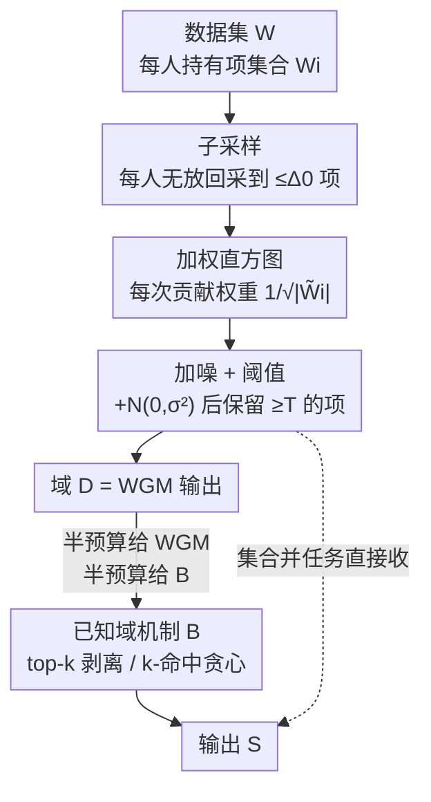

# Missing Mass for Differentially Private Domain Discovery

**会议**: ICLR2026  
**OpenReview**: [https://openreview.net/forum?id=yBpzF8hp3J](https://openreview.net/forum?id=yBpzF8hp3J)  
**代码**: 见论文 Supplement（数据处理与实验代码）  
**领域**: 差分隐私 / 学习理论 / 隐私保护数据分析  
**关键词**: 差分隐私, 域发现, 缺失质量, 集合并, Top-k 选择

## 一句话总结
本文把差分隐私"域发现"（从未知巨大字典里私有地挑出有信息量的高频项）的好坏，从"挑出多少个不同项（基数）"重新定义为"挑出多少质量（缺失质量 missing mass）"，并据此证明了一个简单可扩展的加权高斯机制（WGM）在 Zipf 分布数据上具有近最优的 $\ell_1$ 缺失质量保证、以及无分布假设的 $\ell_\infty$ 保证；再用"半预算先发现域、半预算跑已知域算法"的元算法把这套保证推广到私有 top-k 与 k-命中集，实验证明在六个真实数据集上与现有方法持平或更优。

## 研究背景与动机

**领域现状**：很多数据分析的"字典"事先是未知或大到不可枚举的——用户搜索词、商品评论、购买历史、所有定长字符串的集合等。要在这些数据上做下游分析，第一步往往是**域发现（domain discovery）**：先私有地把高频项挑出来构成一个可用的字典。它最基础的形态叫**集合并（set union，又称 key selection / partition selection）**：每个用户持有一个项集合 $W_i$，目标是输出尽可能多的项。这是 Google、LinkedIn、OpenDP 等工业与开源差分隐私（DP）框架里的核心组件，文献里已有大量 DP 集合并算法。

**现有痛点**：尽管算法很多，**几乎没有可证明的效用保证**。Desfontaines 等、Chen 等的结果都是"相对于其他算法更好"这种相对保证，没人给出**绝对**的效用上界。这导致一个尴尬：既不知道现有算法到底有多好，也不知道还能改进多少。

**核心矛盾**：问题出在**度量口径**。以往都用**基数（cardinality）**——挑出了多少个不同的项——来衡量效用。但基数把一个只出现一次的冷门词和一个被一半用户提到的热门词同等看待，既不符合下游需求，又难以证明干净的界。更糟的是，DP 的"soundness"约束（输出项必须真实出现在输入里，$\mathcal{A}(W)\subseteq\bigcup_i W_i$）会让某些病态数据集（每人一个互不相同的项）的缺失质量被迫接近 1，使得最坏情况下根本无法做出有意义的隐私-效用权衡。

**本文目标**：(1) 给集合并找一个能证明绝对效用上界的度量；(2) 在该度量下为一个**简单、可扩展**的机制证明（近）最优保证；(3) 把保证延伸到更复杂的 top-k 与 k-命中集。

**切入角度**：作者观察到，真实数据几乎都服从 **Zipf / 幂律**——频率随排名多项式衰减，质量高度集中在少数热门项上。于是与其数"挑了几个项"，不如量"挑回了多少质量"，并在 Zipf 假设下分析。

**核心 idea**：用**缺失质量（missing mass）**取代基数作为效用度量，证明朴素的加权高斯机制（WGM）在 Zipf 数据上 $\ell_1$ 缺失质量近最优、在任意数据上 $\ell_\infty$ 缺失质量可控，并以 WGM 作为"域发现前置器"接入已知域的 top-k / k-命中集算法。

## 方法详解

### 整体框架

本文要解决的是"未知域上的私有域发现"，整体可拆成**两层**：底层是一个度量与一个机制——用**缺失质量**重新定义效用，并证明朴素的 **WGM** 在这个口径下有保证；上层是一个**元算法**——把 WGM 当成"域发现前置器"，先花一半隐私预算用 WGM 从未知域里发现一个候选域 $D$，再花另一半预算在 $D$ 这个"已知域"上跑成熟的私有 top-k 或 k-命中集算法，由基础组合定理保证整体满足 $(\epsilon,\delta)$-DP。

记数据集 $W=\{W_i\}_{i\in[n]}$，$N=\sum_i|W_i|$ 为总项数，$M=|\bigcup_i W_i|$ 为不同项数，$N(x)=\sum_i \mathbf{1}\{x\in W_i\}$ 为项 $x$ 的频率。算法管线如下：

其中 B→C→D 三步就是 WGM（Algorithm 1），对集合并任务来说 WGM 的输出 $D$ 即最终答案；对 top-k / k-命中集，$D$ 还要再喂给上层的已知域机制 $B$（Algorithm 2）。

### 关键设计

**1. 用"缺失质量"重构域发现，并推广成 $\ell_p$ 家族**

以往用基数衡量集合并，既不贴合下游需求又证不出干净的界。作者把度量换成**缺失质量**：给定输出 $S$，
$$\mathrm{MM}(W,S):=\sum_{x\in \bigcup_i W_i\setminus S}\frac{N(x)}{N},$$
即"没被挑出来的那些项所占的质量份额"，越小越好。关键洞察是：$\mathrm{MM}$ 恰好是缺失频率向量 $(N(x)/N)_{x\notin S}$ 的 $\ell_1$ 范数。顺着这个视角自然得到 $\ell_p$ 推广
$$\mathrm{MM}_p(W,S):=\big\|(N(x)/N)_{x\in\bigcup_i W_i\setminus S}\big\|_p,$$
其中 $p=1$ 是常规缺失质量，$p=\infty$ 变成"最小化单项最大缺失质量"，$p=0$ 退化回旧的基数度量。这个统一框架让后文既能给集合并证 $\ell_1$ 界，又能用 $\ell_\infty$ 界去支撑 top-k 与 k-命中集——是全文一切保证的度量基石。

**2. WGM：加权直方图 + 高斯加噪阈值的三段式机制**

承接缺失质量度量，本文要的是一个**既简单可扩展、又能证界**的机制，选定 Gopi 等（2020）的加权高斯机制 WGM。它由噪声水平 $\sigma$、阈值 $T$、单用户贡献上界 $\Delta_0$ 三个参数刻画，分三步：① **子采样**——每个用户无放回采样至多 $\Delta_0$ 个项得到 $\tilde W_i$，把单用户敏感度压下来；② **加权直方图**——每个项的计数为 $\tilde H(x)=\sum_i (1/|\tilde W_i|)^{1/2}\mathbf{1}\{x\in\tilde W_i\}$，用 $1/\sqrt{|\tilde W_i|}$ 权重把每个用户的贡献缩放到单位 $\ell_2$ 范数，从而控制加噪所需的尺度；③ **加噪与阈值**——给每个计数加 $Z_x\sim N(0,\sigma^2)$，保留噪声计数 $\tilde H'(x)\ge T$ 的项。隐私性由 Gopi 等的定理给出：只要 $\sigma,T$ 满足
$$\Phi\!\Big(\tfrac{1}{2\sigma}-\epsilon\sigma\Big)-e^{\epsilon}\Phi\!\Big(-\tfrac{1}{2\sigma}-\epsilon\sigma\Big)\le\tfrac{\delta}{2}$$
以及一个关于 $T$ 的下界条件，WGM 就是 $(\epsilon,\delta)$-DP；本文进一步在附录算出满足约束的最小取值 $\sigma=\Theta\!\big(\tfrac{1}{\epsilon}\sqrt{\log(1/\delta)}\big)$、$T=\tilde\Theta_{\delta,\Delta_0}(\max\{\sigma,1\})$，为后续效用界提供了可代入的参数。

**3. Zipf 数据下的 $\ell_1$ 近最优界 + 无分布的 $\ell_\infty$ 界 + 匹配下界**

光有机制不够，本文的硬核贡献是给 WGM 证出**绝对效用保证**。由于病态数据（每人一个独占项）会让缺失质量被迫接近 $1-\delta$，作者把分析限制在 $(C,s)$-**Zipf 数据**：$N(r)/N\le C/r^s$ 对所有排名 $r$ 成立，且取 $s>1$（$s\le1$ 时病态数据仍合法）。这一限制只影响效用刻画、不影响隐私（隐私永远按最坏邻居数据集衡量）。主结果 Theorem 3.3 给出高概率上界
$$\mathrm{MM}(W,S)=\tilde O\!\left(\frac{C^{1/s}}{s-1}\Big(\frac{\max_i|W_i|}{N\sqrt{q^\star}}\Big)^{\frac{s-1}{s}}(T+\sigma)^{\frac{s-1}{s}}\right),\quad q^\star=\min\{\max_i|W_i|,\Delta_0\},$$
含义符合直觉：$N$ 越大、$s$ 越大（质量越集中）、$C$ 越小，缺失质量越小；代入最小 $\sigma,T$ 后（Corollary 3.4）误差里子采样项会主导，故应把 $\Delta_0$ 设得尽量接近 $\max_i|W_i|$。Theorem 3.5 给出匹配下界，说明上界对 $\epsilon$ 和 $N$ 的依赖是紧的。更妙的是同一证明技术还能产出**无需 Zipf 假设**的 $\ell_\infty$ 界（Theorem 3.6）：对**任意**数据集，$\mathrm{MM}_\infty(W,S)\le\tilde O(\max_i|W_i|/(\epsilon N\sqrt{q^\star}))$。正是这个分布无关的 $\ell_\infty$ 界，撑起了下一节 top-k 与 k-命中集的保证。

**4. 半预算元算法：把 WGM 当域发现前置器接入已知域算法**

top-k 与 k-命中集都有成熟的**已知域**私有算法，但未知域下无法直接用。本文的元算法（Algorithm 2）很直接：先用一半预算跑 WGM 得到候选域 $D=\mathrm{WGM}(W,\Delta_0)$，再用另一半预算在 $D$ 上跑已知域机制 $B$，由基础组合保证总预算。对 **top-k**，$B$ 取剥离指数机制（peeling exponential / Gumbel 机制，Algorithm 3）——反复给每个项加 $\mathrm{Gumbel}(\lambda)$ 噪声并取最大，因其简单、高效、组合紧致；借助 Theorem 3.6 的 $\ell_\infty$ 界证得 top-k 缺失质量 $\mathrm{MM}_k(W,S)\le\tilde O\big(\tfrac{k}{N}(\tfrac{\max_i|W_i|}{\epsilon\sqrt{q^\star}}+\tfrac{\sqrt k\log M}{\epsilon})\big)$（Theorem 4.3），并配 $k/\epsilon$ 量级的下界（Corollary 4.4）。对 **k-命中集**（输出 $k$ 个项命中尽量多用户，本质是带基数约束的子模最大化、NP-hard），$B$ 取 Mitrovic 等的私有贪心（用户剥离机制 Algorithm 4），得到 $(1-1/e)$ 近似加可控加性误差（Theorem 4.5），且当 $|\mathcal X|\gg M$ 时其 $\log M$ 依赖优于直接在全域上做的 $\log|\mathcal X|$。这套"先发现域再算"的范式，把 Section 3 的域发现保证转化为下游任务的端到端保证，是把理论落到三个实际问题的关键一跃。

### 损失函数 / 训练策略
本文是理论 + 机制设计工作，无训练损失。核心"目标函数"即缺失质量 $\mathrm{MM}_p$；隐私预算固定为 $(\epsilon,\delta)$，top-k / k-命中集统一采取"一半预算给 WGM、一半给已知域算法"的均分策略，由基础组合保证总体 $(\epsilon,\delta)$-DP。

## 实验关键数据

实验在**六个真实数据集**上做：Reddit、Amazon Games、Movie Reviews 为"大"数据集，Steam Games、Amazon Magazine、Amazon Pantry 为"小"数据集；总隐私预算固定 $(1,10^{-5})$-DP（附录另有 $(0.1,10^{-5})$-DP，趋势一致）。三个任务分别评估。

### 主实验（三个任务的对比结论）

| 任务 | 本文方法 | 对比基线 | 结论 |
|------|----------|----------|------|
| 集合并 | WGM | Policy Gaussian (Gopi 2020)、Policy Greedy (Carvalho 2022)，$\alpha=3$ | WGM 的缺失质量在所有数据集上落在策略机制的 **5% 以内**，但计算量远小于后者 |
| Top-k | WGM→剥离指数机制 | 限域 top-k (Durfee & Rogers 2019)，$\bar k\in\{k,5k,10k,\infty\}$ | 本文方法在所有数据集上 top-k 缺失质量**始终更小**，且优势随 $k$ 增大而扩大 |
| k-命中集 | WGM→用户剥离贪心 | 非私有贪心、已知域私有贪心（假设 $\bigcup_i W_i$ 公开，实则非法私有） | 与两个"非完全私有"基线**持平**；在 Steam/Magazine 上甚至**超过**已知域私有贪心 |

### 关键发现
- **集合并**：以往用基数度量时，序列式方法常能多输出约 2× 的项；但换成缺失质量后，朴素 WGM 与计算量大得多的策略机制差距收窄到 5% 以内——说明"质量"口径下，简单可扩展的 WGM 几乎不吃亏。
- **Top-k**：在大数据集上所有方法缺失质量都近 0（质量集中在极少数热门项），区分度只在小数据集上体现；本文方法对 $k$ 的鲁棒性更好，限域基线则受其超参 $\bar k$ 拖累。
- **k-命中集**：本文方法之所以能**反超**假设公开域的私有贪心，是因为 WGM 发现的域比完整的 $\bigcup_i W_i$ **更小但仍含高质量项**，给第二步的剥离机制制造了一个"更容易的问题"——域发现在这里不只是合法化，还顺带降了难度。
- **子采样上界 $\Delta_0$ 的取法**最敏感：Corollary 3.4 表明子采样误差会主导缺失质量，应把 $\Delta_0$ 调到尽量接近 $\max_i|W_i|$，但又不能远超（否则吃 $\log\Delta_0$ 的亏）；实验中 top-k / k-命中集统一取 $\Delta_0=100$。

## 亮点与洞察
- **换度量带来"可证明性"**：把基数换成缺失质量看似只是换个口径，却让一个原本"只有相对保证"的领域第一次有了**绝对效用上界**，还顺手统一成 $\ell_p$ 家族（$p=0$ 基数、$p=1$ 质量、$p=\infty$ 最大缺失）——一个度量同时服务三个任务，是非常漂亮的"以定义驱动理论"的范例。
- **为简单机制正名**：社区一度追逐计算昂贵的序列/自适应方法以多挑项，本文用理论 + 实验说明，在质量口径下朴素 WGM 已近最优、且差距只有 5%，把"可扩展性"重新摆回桌面。
- **域发现作为"难度削减器"**：k-命中集实验里，先做域发现不仅合法化了未知域设定，还因为输出域更小而让下游问题更易——这个"私有预处理顺带提质"的观察可迁移到其他未知域私有任务。
- **$\ell_\infty$ 界是承重墙**：分布无关的 $\ell_\infty$ 缺失质量界（Theorem 3.6）绕开了 Zipf 假设，成为把保证推广到 top-k / k-命中集的关键桥梁——这是把"集合并的分析"复用到"更复杂任务"的技术支点。

## 局限与展望
- **上下界未对齐**：作者承认 top-k 与 k-命中集的上界与下界还有 gap，闭合这些 gap 是自然的后续问题。
- **子采样方式较朴素**：所有方法都靠"对每个用户无放回均匀子采样"来强制 $\ell_0$ 界；Chen 等（2025）用更复杂、数据相关的子采样策略能拿到更高基数，把类似技术迁移到缺失质量上可能进一步提升效用。
- **依赖 Zipf 假设的 $\ell_1$ 界**：$\ell_1$ 近最优保证需要 $s>1$ 的 Zipf 数据，对长尾过重（$s\le1$）或非幂律分布不直接适用——尽管 $\ell_\infty$ 界无此限制，但 $\ell_1$ 是更贴近实际的目标。
- **预算均分未优化**：top-k / k-命中集统一"半半分"隐私预算只用了基础组合，未探索更精细的预算分配或高级组合，可能仍有提升空间。

## 相关工作与启发
- **vs DP 集合并（Korolova 2009 / Desfontaines 2022 / Gopi 2020 / Chen 2025）**：前人或给单贡献受限的最优算法、或给"相对于其他算法更优"的保证；本文据作者所知是**第一个**为 DP 集合并证明**绝对**效用保证的工作，靠的就是换用缺失质量度量。
- **vs DP Top-k（Durfee & Rogers 2019）**：他们是唯一面向未知域的 top-k 方法，但保证用的是 $k$-相对误差（约束最小输出项与第 $k$ 大项的差距）；本文用更严格的**缺失质量**给出保证，实验上也持续更优。
- **vs DP 子模最大化（Mitrovic 2017 / Chaturvedi 2021）**：他们在**已知域**下给 k-命中集这类问题近似保证，未知域不直接适用；本文用 WGM 先发现域再贪心，把保证推到未知域，且 $\log M$ 依赖优于直接在全域上的 $\log|\mathcal X|$。
- **启发**：当一个私有问题"算法多但证不出界"时，先反思**度量是否选对**——换一个与下游需求对齐、且数学上更友好的度量（如从基数到质量），往往能一举打通"可证明性"，并让原本被嫌弃的简单机制重新有竞争力。

## 评分
- 新颖性: ⭐⭐⭐⭐⭐ 用缺失质量重构域发现，首次为 DP 集合并给出绝对效用保证并统一三个任务
- 实验充分度: ⭐⭐⭐⭐ 六数据集 × 三任务 × 强基线，覆盖充分；但多为收敛趋势图、缺更细粒度的超参/预算消融
- 写作质量: ⭐⭐⭐⭐ 理论脉络清晰、定理与直觉解释配套到位，符号略密集
- 价值: ⭐⭐⭐⭐⭐ 给工业级 DP 框架里的核心组件提供了可证明保证与可扩展实现，理论与落地兼具

<!-- RELATED:START -->

## 相关论文

- [\[ICLR 2026\] Differentially Private Two-Stage Gradient Descent for Instrumental Variable Regression](differentially_private_two-stage_gradient_descent_for_instrumental_variable_regr.md)
- [\[AAAI 2026\] An Improved Privacy and Utility Analysis of Differentially Private SGD with Bounded Domain and Smooth Losses](../../AAAI2026/ai_safety/an_improved_privacy_and_utility_analysis_of_differentially_p.md)
- [\[ICLR 2026\] On Optimal Hyperparameters for Differentially Private Deep Transfer Learning](on_optimal_hyperparameters_for_differentially_private_deep_transfer_learning.md)
- [\[ICLR 2026\] PE-SGD: Differentially Private Deep Learning via Evolution of Gradient Subspace for Text](pe-sgd_differentially_private_deep_learning_via_evolution_of_gradient_subspace_f.md)
- [\[ICML 2026\] PRISM: Gauge-Invariant Tangent-Space Differentially Private LoRA](../../ICML2026/ai_safety/prism_gauge-invariant_tangent-space_differentially_private_lora.md)

<!-- RELATED:END -->
