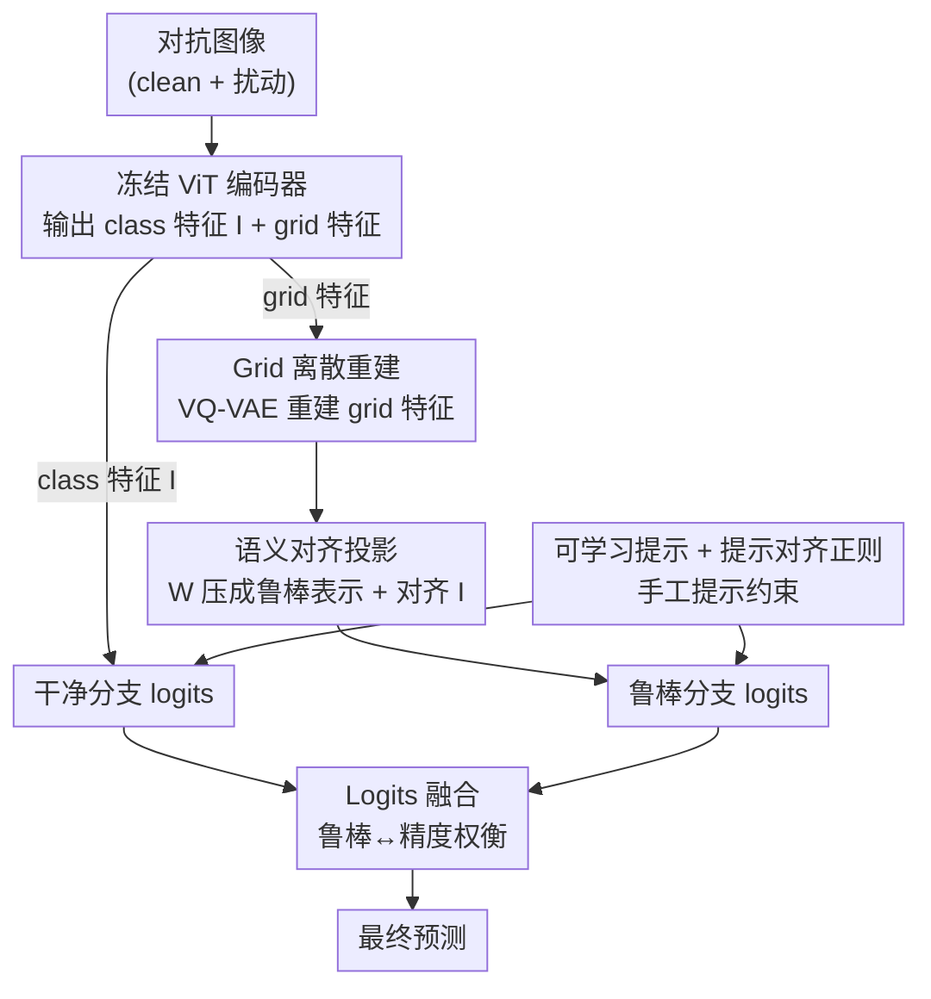

# Discrete Latent Features Ablate Adversarial Attack: A Robust Prompt Tuning Framework for VLMs

**会议**: ICLR2026  
**OpenReview**: [https://openreview.net/forum?id=lZgORA63ew](https://openreview.net/forum?id=lZgORA63ew)  
**代码**: https://github.com/cheny02/DEFEAT-ICLR2026  
**领域**: 多模态VLM / 对抗鲁棒 / 提示调优  
**关键词**: 对抗鲁棒、CLIP、VQ-VAE、离散表示、提示调优

## 一句话总结
DEFEAT 发现「把 CLIP 的图像潜在特征离散化」能天然削弱对抗扰动，于是在提示调优框架里插入一个基于 VQ-VAE 的 PerturbShield 模块来重建 grid 特征，再用 logits 融合在鲁棒与干净精度间取平衡，15 个数据集上对抗少样本分类的鲁棒/精度调和均值比此前 SOTA 平均提升 13.76%。

## 研究背景与动机
**领域现状**：CLIP 这类视觉-语言模型（VLM）在各种视觉任务上表现亮眼，但对对抗样本极其脆弱——人眼不可见的扰动就能让分类彻底翻车。最有效的防御是对抗训练（adversarial training），但对整个 VLM 做对抗微调参数量巨大、成本高得离谱。于是研究者转向参数高效的方案：把对抗训练和提示调优（prompt tuning，如 CoOp）结合起来，只训练少量可学习提示向量，代表工作有 APT、AdvPT、FAP。

**现有痛点**：作者指出这一整条线的方法都有一个共同盲点——它们**全都依赖连续的图像特征**做防御，注意力都放在「怎么训出更鲁棒的提示」上。可问题恰恰出在特征表示本身：连续特征在干净样本和对抗样本之间会发生显著漂移（shift），漂移直接导致分类精度从 19.44% 跌到 11.21%。提示再怎么训，输入端这个脆弱的连续特征表示没动过。

**核心矛盾**：对抗扰动之所以致命，是因为它能在**连续**特征空间里持续、平滑地把特征推离正确位置；只要表示是连续的，攻击就有可优化的梯度方向。同时，防御又不能损害干净样本精度——鲁棒性和精度天然存在 trade-off。

**本文目标**：(1) 找到一种能从「特征表示」层面直接抑制对抗漂移的机制；(2) 把它塞进轻量的提示调优框架，不动 encoder；(3) 在抑制扰动的同时保住干净精度。

**切入角度**：作者从 VQ-VAE 的量化过程得到灵感——离散化会把连续特征「捕捉」到最近的码字（code）上。他们做了关键的可视化实验：把潜在特征离散化后，干净与对抗样本之间的分布漂移明显变小（图 2、图 3）。直觉是：当对抗扰动被引入后，找最近码字这一步常常会把干净特征和被扰动的特征**映射到同一个离散码**，扰动就在离散空间里被「中和」掉了，攻击也失去了可优化的连续梯度方向。

**核心 idea**：用离散潜在特征代替脆弱的连续特征来抵消对抗扰动——具体做法是在提示调优框架里用 VQ-VAE 重建 ViT 的 grid 特征（而非 class 特征），再把这条鲁棒分支和原始分支的 logits 融合起来，兼顾鲁棒与精度。

## 方法详解

### 整体框架
DEFEAT（Discrete LatEnt FeaturE based Adversarial Training）建立在冻结的 CLIP 之上：图像编码器和文本编码器都**冻结**，只训练两样东西——可学习提示向量 + 一个叫 PerturbShield 的扰动离散护盾模块。一张（对抗）图像进来，ViT 最后一层同时吐出两种特征：代表整图的 class 特征 $I$、以及来自各 patch 的 grid 特征 $I_{\text{patch}}$。原始的 class 特征 $I$ 走「干净分支」算一套 logits；grid 特征 $I_{\text{patch}}$ 被送进 PerturbShield——先用 VQ-VAE 离散重建、再用投影矩阵压回单一图像表示——产出鲁棒的 $\hat{I}_{\text{proj}}$，走「鲁棒分支」算另一套 logits。两套 logits 融合后做分类。文本侧则用可学习提示替换手工提示，并用手工提示对它做正则。训练时仅用对抗样本，每个 epoch 动态生成。

### 关键设计

**1. PerturbShield 的 grid 级离散重建：用「多码字」而非「单码字」表示图像，从源头吸收扰动**

作者先排除了一个看似自然的做法——直接对 class 特征 $I$ 做 VQ-VAE 重建。因为 class 特征本质是整图的全局表示，离散化时只能用码本里**单个码字**去表示整张图，表达能力远不如多码字组合，信息损失严重；更糟的是，一旦对抗攻击把 class 特征映射到错误码字，就直接导致整图误判。于是 DEFEAT 改成重建 ViT 输出的 grid 特征 $I_{\text{patch}}\in\mathbb{R}^{N\times d_v}$：$\hat{I}_{\text{patch}}=\text{VQ-VAE}(I_{\text{patch}})$，让每个 patch 各自找最近码字、用 $N$ 个码字的组合来表示整图，既保留了更多信息，又借「找最近邻码字」这一步把微小扰动吸收进离散空间。VQ-VAE 的量化是 $z_q^{(i)}=\arg\min_{e_k}\lVert z_e^{(i)}-e_k\rVert_2$，梯度靠 straight-through 从解码器输入拷回编码器输出。这一步是全文的根，对应「干净与对抗特征常被量化到同一码字、从而中和扰动」的核心观察。

**2. 语义对齐投影：把 N 个 grid 码字压回单一表示，同时拉回 CLIP 的嵌入空间**

重建后的 $\hat{I}_{\text{patch}}$ 是 $N$ 个 patch 的特征，无法直接和文本特征算相似度，且离散重建后的分布可能偏离 CLIP 原本的语义空间。作者设计了一个可学习矩阵 $W\in\mathbb{R}^{1\times N}$ 一身兼两职：其一做线性变换 $\hat{I}_{\text{proj}}=W\cdot\hat{I}_{\text{patch}}$，把更鲁棒的 grid 表示压成单个图像级表示 $\hat{I}_{\text{proj}}\in\mathbb{R}^{d_v}$；其二施加特征对齐正则 $\mathcal{L}^{I}_{\text{reg}}=\lVert\hat{I}_{\text{proj}}-I\rVert_1$，强制这个鲁棒表示在语义上对齐 CLIP 预训练的 class 特征 $I$。这样既得到了能算 logits 的图像表示 $p_{\text{vq}}(y|x)$（用 $f^{\text{vq}}_c=\cos(t^s_c,\hat{I}_{\text{proj}})$），又保证防御过程不会把特征带离 VLM 原本的语义空间——否则像素级重建那种「分布跑偏、精度只剩 9.26%、鲁棒性为 0」的灾难就会重演。

**3. Logits 融合：让鲁棒分支扛攻击、原始分支守干净精度**

离散重建天然有信息损失，单用 $\hat{I}_{\text{proj}}$ 算 logits 会拉低干净精度（实测从 19.44% 降到 17.90%）。作者不强求一条分支既鲁棒又准，而是双分支分工：鲁棒分支 $p_{\text{vq}}(y|x)$（来自 $\hat{I}_{\text{proj}}$）负责抗扰动，原始分支 $p_s(y|x)$（来自未经离散化的 class 特征 $I$）负责保住干净精度，最后简单平均 $p(y|x)=(p_{\text{vq}}(y|x)+p_s(y|x))/2$。这个朴素的融合直接把鲁棒-精度的 trade-off 显式拆成两条可叠加的通路，是 DEFEAT 在精度上能追平 SOTA、在鲁棒上大幅超越的关键。

**4. 提示对齐正则：手工提示约束可学习提示，意外地也提升鲁棒性**

文本侧用可学习向量 $v=\{v_1,\dots,v_M\}$ 替换手工提示「a photo of a」，但纯可学习提示容易在 base 类上过拟合、丢掉 CLIP 的零样本泛化。作者用手工提示文本特征 $t$ 去正则可学习提示文本特征 $t^s$：$\mathcal{L}^{T}_{\text{reg}}=\lVert t^s-t\rVert_1$，保持二者一致。除了改善泛化，作者还发现（§4.3）这个正则**本身就能增强对抗鲁棒性**——把 CLIP 预训练的稳健语义先验注回提示，相当于给文本分支也加了一层防御。

最终训练目标把四件事并在一起：$\mathcal{L}=\mathcal{L}_{\text{ce}}(x_a,t^s,y)+\mathcal{L}_{\text{VQ-VAE}}(I_{\text{patch}})+\lambda\mathcal{L}^{I}_{\text{reg}}+\mu\mathcal{L}^{T}_{\text{reg}}$，其中对抗样本 $x_a$ 每个 epoch 用上一轮的可学习提示动态 PGD 生成。

### 损失函数 / 训练策略
- **对抗样本生成**：$x_a=\arg\max_{x_a}\mathcal{L}_{\text{ce}}(x_a,t^s,y)$，约束 $\lVert x_a-x\rVert_p\le\epsilon$；训练用 PGD 3 步、步长 $2\epsilon/3$，评测用 100 步、步长 $\epsilon/4$ 带随机起点，$\ell_\infty$ 威胁模型。
- **VQ-VAE 损失**：重建损失 + 码本损失 + 承诺损失，$\gamma=0.25\beta$（沿用原始实现）。
- **超参**：$\alpha=0.5,\ \beta=0.1,\ \lambda=10,\ \mu=20$，提示长度 16，全实验 ViT-B/32，image encoder 用 TeCoA 预训练权重。

## 实验关键数据

### 主实验
15 个数据集、三种设定：对抗少样本分类、对抗域泛化、对抗跨数据集泛化。Baseline 为零样本 CLIP、APT（文本提示调优）、FAP（多模态提示调优）。核心指标 H = 鲁棒性与精度的**调和均值**，衡量 trade-off。

11 数据集对抗少样本分类平均（ϵ=4/255）：

| 设定 | 方法 | Acc. | Rob. | H |
|------|------|------|------|---|
| 16-shot | CLIP | 33.67 | 10.79 | 16.34 |
| 16-shot | APT | 51.08 | 20.26 | 29.01 |
| 16-shot | FAP | 50.50 | 19.82 | 28.47 |
| 16-shot | **DEFEAT** | 50.98 | **36.05** | **42.23** |

DEFEAT 精度追平 SOTA（FAP），但鲁棒性在 16-shot/ϵ=4/255 下比 APT、FAP 高出 15.79%、16.23%，H 高出 13.22%、13.76%；ϵ=1/255 下同样全面领先。

### 消融实验
对抗域泛化（ϵ=4/255）显示鲁棒性可迁移到 OOD 数据，且随样本量从 16→100 shot 稳定上升（ImageNet 鲁棒性 +3.31%），而 APT/FAP 几乎不涨：

| 设定 | 方法 | ImageNet Rob. | 目标域均值 Rob. |
|------|------|---------------|------------------|
| 16-shot | APT | 12.02 | 7.65 |
| 16-shot | FAP | 12.06 | 7.57 |
| 16-shot | **DEFEAT** | **19.06** | **10.96** |
| 100-shot | **DEFEAT** | **22.71** | **12.70** |

### 关键发现
- **离散化是鲁棒性来源**：图 3 的可视化直接证明，对 grid 特征做 VQ-VAE 重建后，干净/对抗特征分布漂移大幅缩小，且比对像素重建（精度 9.26%、鲁棒 0%）保留了远多的语义信息（重建潜在特征：精度 17.90%、鲁棒 12.90%）。
- **grid 优于 class**：重建 grid（多码字）显著优于重建 class（单码字），后者一旦码字映射错就整图崩。
- **可扩展性**：DEFEAT 的鲁棒增益随训练样本数增加而持续放大，提示调优 baseline 则基本饱和。

## 亮点与洞察
- **换了个战场**：以往对抗提示调优都在「学更鲁棒的提示」上卷，DEFEAT 把战场搬到「特征表示」本身——用离散化从输入端吸收扰动，这是一个正交且更本质的角度。
- **VQ-VAE 当护盾很巧**：把生成模型里的量化机制重新解读为「对抗扰动中和器」（同一码字吸收 clean 与 adv 特征），是一个可复用的洞察，可迁移到任何依赖连续特征的鲁棒性任务。
- **双分支显式拆 trade-off**：不追求单一万能表示，而是让鲁棒分支和精度分支各司其职再融合，工程上简单、效果上直接，是处理鲁棒-精度权衡的实用范式。
- **手工提示正则的副作用**：发现「手工提示对齐」除了防过拟合还能涨鲁棒性，这一观察对其它提示调优工作有借鉴价值。

## 局限与展望
- **依赖码本质量**：离散化的防御力直接系于 VQ-VAE 码本的覆盖度，少样本场景下码本学不充分可能削弱鲁棒；论文未深入分析码本大小 $K$ 的敏感性。
- **仅验证 ViT-B/32 + PGD**：只在单一 backbone、单一攻击（PGD/$\ell_\infty$）下测试，对更强的自适应攻击（专门针对量化设计的攻击）、更大模型是否仍鲁棒未知。
- **融合是固定平均**：logits 融合用了固定 1:1 平均，按样本自适应地调整两分支权重可能进一步优化 trade-off。
- **离散化的精度税**：鲁棒分支单独会掉干净精度，目前靠融合补回，本质上仍是用一条「准但不鲁棒」的分支兜底，离散表示本身的精度上限是个待解问题。

## 相关工作与启发
- **vs APT / AdvPT**：它们把对抗训练接到文本提示调优上，仍用连续 class 特征做防御；DEFEAT 在图像侧插离散重建模块，从特征表示层面抑制扰动，鲁棒性大幅领先。
- **vs FAP**：FAP 走多模态提示、强调干净/对抗特征在单模态上的差异化；DEFEAT 精度与之相当，但靠 VQ-VAE 离散化拿到明显更高的鲁棒性与 H。
- **vs TeCoA / FARE**：它们对整个 CLIP 做对抗微调，参数代价高；DEFEAT 冻结 encoder、只训提示 + 护盾模块，是参数高效路线（且复用了 TeCoA 预训练的鲁棒 encoder 权重）。
- **vs 像素级 VQ-VAE 重建（Mao et al. 2022）**：在输入图像上重建会带来严重信息损失和结构畸变，少样本下精度崩盘；DEFEAT 把离散化挪到 ViT 输出的 latent grid 特征上，既保语义又抑扰动。

## 评分
- 新颖性: ⭐⭐⭐⭐⭐ 首次用「潜在特征离散化」抵消对抗扰动，角度正交且有可视化支撑。
- 实验充分度: ⭐⭐⭐⭐ 15 数据集三设定较全面，但攻击类型与 backbone 单一。
- 写作质量: ⭐⭐⭐⭐ 动机推导清晰，图 2/3 的可视化把核心直觉讲得很到位。
- 价值: ⭐⭐⭐⭐ 提供了一个参数高效、即插即用的 VLM 对抗防御范式，鲁棒提升显著。

<!-- RELATED:START -->

## 相关论文

- [\[ICLR 2026\] Identifying Robust Neural Pathways: Few-Shot Adversarial Mask Tuning for Vision-Language Models](identifying_robust_neural_pathways_few-shot_adversarial_mask_tuning_for_vision-l.md)
- [\[CVPR 2026\] V-Attack: Targeting Disentangled Value Features for Controllable Adversarial Attacks on LVLMs](../../CVPR2026/ai_safety/v-attack_targeting_disentangled_value_features_for_controllable_adversarial_atta.md)
- [\[ICLR 2026\] Concept-based Adversarial Attack: a Probabilistic Perspective](concept-based_adversarial_attack_a_probabilistic_perspective.md)
- [\[CVPR 2025\] MOS-Attack: A Scalable Multi-Objective Adversarial Attack Framework](../../CVPR2025/ai_safety/mos-attack_a_scalable_multi-objective_adversarial_attack_framework.md)
- [\[ICLR 2026\] Robust Spiking Neural Networks Against Adversarial Attacks](robust_spiking_neural_networks_against_adversarial_attacks.md)

<!-- RELATED:END -->
