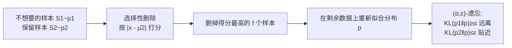

# Distributional Machine Unlearning via Selective Data Removal

**会议**: ICLR 2026  
**代码**: [https://github.com/ysfalh/unlearning-distribution](https://github.com/ysfalh/unlearning-distribution)  
**领域**: AI 安全 / 机器遗忘 (Machine Unlearning)  
**关键词**: distributional unlearning, selective data removal, KL divergence, Pareto frontier, sample efficiency  

## 一句话总结
把"遗忘一整个不想要的子分布"形式化为信息论问题，证明只删掉离保留分布最远的一小撮高影响样本，就能在低散度场景下比随机删除获得二次方的样本效率提升，实测可比"全删"少删 15–82% 的数据。

## 研究背景与动机
**领域现状**：机器遗忘 (machine unlearning) 的需求正从"删除单个用户的几条记录"升级到"抹掉整个领域/概念"——例如清除毒性语言、偏见，或某部受版权保护的作品（如让模型忘掉《哈利·波特》全系列文本）。

**现有痛点**：面对"删整个子群体"这件事，从业者被夹在两个糟糕的极端之间。
- **全删太贵**：高效遗忘方法的计算代价通常随 forget set 大小线性增长，整域删除成本高得离谱。
- **随机部分删除又没用**：因为这个领域的"统计足迹"会残留——即便删掉特定源文本，LLM 仍可能凭借与剩余数据重叠的上下文逐字复现被删序列。

**核心矛盾**：现有 sample-level unlearning（基于影响函数、数据分片）只回答了"给定一组样本怎么高效删"，却从没回答"到底该删哪些、删多少才能消除一个领域的整体统计足迹"。class-level 遗忘和 concept erasure 要么改的是模型内部表示（可逆、白盒、一次只服务一个模型），要么压根没有形式化的"选子集"方法。

**本文目标**：在"无效的部分删除"与"不必要的完全删除"之间找到一条路——回答那个被悬置的根本问题：*为了让数据分布远离不想要的领域、同时贴近想保留的领域，最少需要删除哪些数据点？*

**核心 idea**：作者的关键观察是 **「一个领域的统计影响往往高度集中在它的一小撮高冲击样本上」**。于是他们把领域建模为未知概率分布，提出 **distributional unlearning（分布式遗忘）** 框架：用 KL 散度约束同时刻画"遗忘"与"保留"，并据此设计一个**基于距离的选择性删除算法**——只删那些离保留分布中心最远的样本。

## 方法详解

### 整体框架
框架分三层递进：先在**总体（population）层面**用两条 KL 约束把"遗忘一个分布、保留另一个分布"定义为 $(\alpha, \varepsilon)$-distributional unlearning，并推出可达权衡的闭式 Pareto 前沿与下游 log-loss 保证；再下到**有限样本层面**，对比随机删除与选择性删除两种机制的样本复杂度；最后用一个简单的"距离打分"算法实现选择性删除并证明其在低散度区的二次方优势。

### 关键设计

**1. 用双 KL 约束定义"遗忘-保留"目标：把删数据这件事翻译成信息论语言。** 给定从不想要分布 $p_1$ 抽的样本集 $S_1$ 和从保留分布 $p_2$ 抽的 $S_2$（这两个集合由上游的关键词过滤、分类器或人工标注提供），目标是构造一个编辑后的数据分布 $p$，使它同时满足 $\mathrm{KL}(p_1\|p)\ge\alpha$（**removal**，强制远离要忘的分布）和 $\mathrm{KL}(p_2\|p)\le\varepsilon$（**preservation**，给保留分布的附带损害设上界）。选 KL 散度不是随意的——它能直接控制下游模型的期望 log-loss，从而把"数据层面的编辑"和"预测层面的后果"挂上钩。$(\alpha,\varepsilon)$ 这对参数因此变成一个可调旋钮：从业者若能容忍保留测试集上至多 0.1 nat 的 log-loss 上升，就设 $\varepsilon=0.1$，再由 Pareto 前沿读出对应可达的最大遗忘量。

**2. 闭式 Pareto 前沿 + 下游保证：证明"只留 p2"是次优的。** 对共享协方差的高斯分布类，作者推出可达 $(\alpha,\varepsilon)$ 的精确前沿 $\varepsilon = \big(\sqrt{\alpha}-\sqrt{\mathrm{KL}(p_1\|p_2)}\big)^2/2$（当 $\alpha\ge\mathrm{KL}(p_1\|p_2)$）。这条曲线揭示了分布式遗忘的一个内在代价：任何给定的遗忘量都要付出最小的保留损失，而这个权衡由初始散度 $\mathrm{KL}(p_1\|p_2)$ 决定。更关键的是它戳破了一个常见默认做法——"只保留 $p_2$ 的数据再重训"。这个策略确实做到了完美保留（$\varepsilon=0$），但前沿表明：只要接受一点点保留损失，就能换来显著更高的遗忘量。配套的 Proposition 2 进一步证明：满足 $(\alpha,\varepsilon)$-遗忘的 $p$ 训练出的下游预测器 $h$，在被遗忘分布上的 log-loss 至少增加 $\alpha-\delta_1$，在保留分布上的退化至多 $\varepsilon-\delta_2$，且额外的边际 KL 项总被同一个 $\alpha$ 兜住。该结论从高斯推广到一般正则指数族。

**3. 基于距离的选择性删除算法：删离保留中心最远的"离群点"。** 核心直觉是——既然要把数据集的经验均值从不想要的中心 $\mu_1$ 推向保留中心 $\mu_2$，那么最该删的就是 $p_1$ 中离 $\mu_2$ 最远的那些样本。算法极简：先算保留数据均值 $\hat\mu_2$；对每个不想要样本 $x_i$ 算分数 $s_i=|x_i-\hat\mu_2|$；删掉得分最大的 $f$ 个；再在剩余数据上用 MLE 重拟合。它只需 $p_2$ 的均值作参考点，无需访问模型内部。

**4. 二次方样本效率：选择性删除为何在低散度区碾压随机。** 随机删除的效果由"剩余不想要样本与保留样本之比" $\frac{n_1-f}{n_2}$ 驱动，且这个比值以**二次方**进入界，意味着每删一个随机样本的边际收益递减——这源于经验均值的集中性，其方差随样本量反比缩小。选择性删除的界里多出一个折叠正态分布的逆 CDF 分位项 $g^{-1}(\cdot;\kappa)$（其中 $g(u;\kappa):=\Phi(u-\sqrt{2\kappa})+\Phi(u+\sqrt{2\kappa})-1$，$\kappa=\mathrm{KL}(p_1\|p_2)$）——它来自"截断得分分布的尾部"，会**严格放大**那个二次方衰减。这个放大在两分布接近（低散度）时最强，因为此时"离群"样本更显眼、删掉它们对经验均值的定向推动更大。最终（Table 1 / Corollary 10）这转化为在低散度高斯区相对随机删除的**二次方样本效率提升**。

下表对比两种机制达到 $(\alpha,\varepsilon)$-遗忘所需的简化删除量（低散度、$n_2$ 大、$n_2/n_1$ 常数）：

| 删除机制 | 达成 removal 需删样本数 | 达成 preservation 需删样本数 |
|----------|------------------------|------------------------------|
| 随机 (Prop. 3) | $n_1\big(1-\sqrt{1-\alpha}\big)$ | $n_1\big(1-\sqrt{\varepsilon}\big)$ |
| 选择性 (Thm. 1) | $n_1\big(1-(1-\alpha)^{1/4}\big)$ | $n_1\big(1-\varepsilon^{1/4}\big)$ |

四次方根 vs 平方根，正是"二次方更省"的来源。

## 实验关键数据

### 主实验（各数据集达到"遗忘指标减半"所需的删除预算 %）

| 数据集 | 可分性 | 遗忘指标 | 随机删除 | 选择性删除 | 节省 |
|--------|--------|----------|----------|------------|------|
| Gaussians | 低（intertwined） | $\mathrm{KL}(p_1\|p)$ | 65 | 18 | **82%** |
| Gaussians | 高 | $\mathrm{KL}(p_1\|p)$ | 65 | 50 | 50% |
| Jigsaw 毒性评论 | 低 | Recall | 100 | 85 | 15% |
| SMS Spam | 中 | Recall | 90 | 75 | 25% |
| CIFAR-10 | 高 | Accuracy | 80 | 50 | 50% |

> "节省"指相对"全删（只用 $p_2$ 样本重训）"的相对体积缩减；节省幅度随领域可分性变化——越纠缠（低散度）省得越多。

### 关键发现
- **理论预言被合成实验直接验证**：低散度高斯区数据节省高达 82%，正是分析预测优势最大的区域；经验 Pareto 前沿与 Proposition 1 闭式曲线几乎重合。
- **泛化到高维非高斯数据**：文本（Jigsaw、SMS）和图像（CIFAR-10）上选择性删除仍带来 15–50% 的数据节省，幅度比理想理论值温和，反映真实分布更复杂。
- **保留几乎无损**：所有实验中遗忘增益都以"保留域性能可忽略的影响"换来，印证了 Proposition 2 的下游保证。
- **"全删 p1"确实次优**：纠缠分布的 Jigsaw 案例直接验证了 Proposition 1 之后的论断——简单删光 $p_1$ 并非最优。
- **可即插现有遗忘方法**：选择性删除能作为"效率前端"与多种 sample-level unlearning 方法（不止从零重训）组合使用（Table 5）。
- **参数可解释校准**：当 $\mathrm{KL}(p_1\|p_2)=2$、容忍 $\varepsilon=0.1$ 时，Pareto 前沿给出最大可达遗忘量 $\alpha=3$，与受控实验（Fig. 2 第二列）的观测吻合，说明理论旋钮在实践中可直接读用。

## 亮点与洞察
- **填了一个真空地带**：以往遗忘研究都在回答"怎么删"，本文是少有的系统回答"该删哪些、删多少"的工作，把数据选择问题独立出来并形式化。
- **理论扎实**：闭式 Pareto 前沿 + 下游 log-loss 保证 + 二次方样本效率证明，三者环环相扣，且从高斯推广到指数族。
- **数据中心、模型无关**：编辑的是数据而非模型表示，因此对任意下游模型都给出遗忘保证，比 concept erasure 那种"改表示、可逆、白盒"的做法更可移植。
- **反转了已有范式**：domain adaptation 想最小化域间散度，本文反其道而行——刻意拉大与不想要域的散度同时控制与保留域的接近；coreset 想用一个分布近似训练，本文则在两分布关系下选样本。

## 局限与展望
- **理论假设强**：闭式结论建立在已知方差的单变量/共享协方差高斯（或指数族）之上，真实高维数据上只能验证"定性趋势"而非直接套用 Theorem 1。
- **依赖上游领域识别**：框架假设 $S_1, S_2$ 已由关键词过滤/分类器/人工给出，"在野外识别一个领域"这个上游难题被显式排除在外。
- **KL 的选择是为可解析性**：作者也承认不同任务可能更适合其他散度，KL 主要因解析可解和直接控制 log-loss 被选中。
- **真实增益打折**：从合成的 82% 掉到真实数据的 15–50%，说明高维复杂分布下"高影响样本集中"这一前提的成立程度有限。

## 相关工作与启发
- **Sample-level unlearning**（影响函数 Guo et al. 2020、数据分片 Bourtoule et al. 2021）：解决"怎么高效删"，本文与之互补回答"删哪些"，且可叠加使用。
- **Concept erasure**（INLP、对抗训练、反事实增强）：改模型表示、可逆、白盒；本文改数据、对下游模型给硬保证。
- **Coresets & domain adaptation**：本文把这两个范式的目标"反转"——主动增大散度、在两分布关系下选样本，实验证明忽略 retain 数据的 coreset 基线做遗忘是低效的。
- **启发**：对做数据治理/版权清除的工程实践而言，"先用便宜的距离打分挑出高影响子集、再交给现有遗忘方法"是一条可立即落地的降本路径。
- **可延伸方向**：把 KL 换成任务加权散度、把单参考点 $\hat\mu_2$ 推广到多模态/多中心保留分布，或与影响函数打分融合，都是顺理成章的后续。

## 评分
- **新颖性**: ⭐⭐⭐⭐⭐ — 首次把"删哪些样本"独立形式化为信息论问题，并给出闭式 Pareto 前沿与二次方样本效率证明，视角新颖且填补空白。
- **实验充分度**: ⭐⭐⭐⭐ — 合成→文本→图像三档数据 + 与多种下游遗忘方法组合，验证链条完整；但真实数据规模偏小、未涉及大模型/LLM 实测。
- **写作质量**: ⭐⭐⭐⭐⭐ — 动机-定义-理论-算法-实验逻辑层层递进，理论直觉解释清晰。
- **价值**: ⭐⭐⭐⭐ — 为大规模子群体遗忘提供了可扩展、有理论保证的降本方案，对数据合规/安全工程有实际指导意义。

<!-- RELATED:START -->

## 相关论文

- [\[ICLR 2026\] Remaining-data-free Machine Unlearning by Suppressing Sample Contribution](remaining-data-free_machine_unlearning_by_suppressing_sample_contribution.md)
- [\[ICLR 2026\] Label Smoothing Improves Machine Unlearning](label_smoothing_improves_machine_unlearning.md)
- [\[ICLR 2026\] Machine Unlearning under Retain–Forget Entanglement](machine_unlearning_under_retainforget_entanglement.md)
- [\[ICLR 2026\] ReTrace: Reinforcement Learning-Guided Reconstruction Attacks on Machine Unlearning](retrace_reinforcement_learning-guided_reconstruction_attacks_on_machine_unlearni.md)
- [\[ICLR 2026\] Decoupling the Class Label and the Target Concept in Machine Unlearning](decoupling_the_class_label_and_the_target_concept_in_machine_unlearning.md)

<!-- RELATED:END -->
